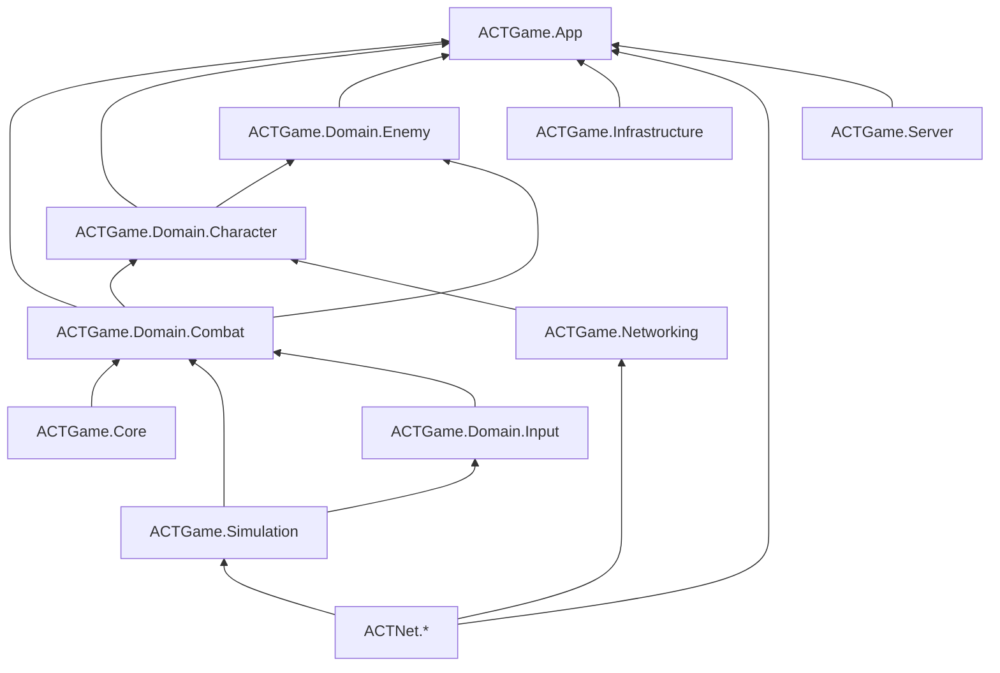
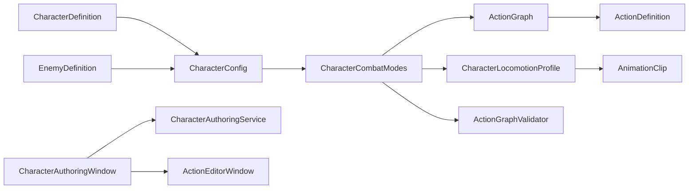

# ACTGame 架构文档

> Last audited: 2026-10-01（增量：Action 输入移动的 Domain→Sink→App 与复制/电机重放；Unity 验收待完成；此前全量测试遗留状态保留）

### Action 输入移动增量

方向动画默认通过 `ActionInputMovement.SampleActionSegmentTime` 与原 Action 段共用片内时钟（含裁剪起点）。本机、Observer 的 `ActionInputMovementPlayer` 与 Editor 预览采用相同查询；方向起始帧只在 FromDirectionChange 模式用于动画计时，同步模式仍保留它用于方向驻留。无新增网络字段。

输入移动的唯一配置源是 `ActionTimeline.InputMovementStates`。窗口继承 ActionNotifyState，共用时间轴编辑与范围查询；四向动画覆盖可以关闭，以便飘落阶段只移动并继续播放原动画。

`ActionTimeline.InputMovementStates` 属于 Combat 定义；`CharacterActionGameplayStep` 在同一 Action 实例的指定帧范围解析量化输入，复用 `LocomotionDirectionModel` 和 `CharacterMotor.MoveActionMm`。范围外恢复普通动画段，支持一个 Action 中的 Pose＋Cancel。无并行 Locomotion FSM、角色专用 VariantResolver 或姿态资源池。

`IActionPresentationSink.ApplyInputMovement` 把只读方向时钟交给 App；本机和 `RemoteCharacterProxy` 共用 `ActionInputMovementPlayer`。`ActorReplicationSnapshot.ActionMovementState` 编码方向与切片起始帧；Owner 仅通过 `IActionInputMovementReplay` 重演已记录的输入位移请求及碰撞，禁止重跑 Action/扣费/Notify。跨普通动作的完整回滚仍未实现。配置及验证细节见 [实施记录](../../../../docs/2026.10.1/ACTION_INPUT_MOVEMENT_IMPLEMENTATION.md)。

## 项目概述

Unity ACT（动作）游戏。当前重点：60Hz 模拟核、数据驱动动作 / 数值、Dedicated 权威状态同步，以及 UI、性能、A*、热更、SDK、剧情编辑器等近期学习切片；相机 SkillShot Spline 已落地，Lock-On 暂时舍弃，正式 UI 尚未实现。

> 各功能的实现细节、参数与运行时流程见 [TECHNICAL.md](TECHNICAL.md)。

## 目录结构

```
Assets/
├── Scripts/
│   ├── Core/StateMachine/     # 泛型状态机（与角色无关）
│   ├── Domain/
│   │   ├── Character/
│   │   │   ├── Animation/     # 逻辑 AnimationKey、Profile 与播放契约
│   │   │   ├── Locomotion/    # 相位 FSM、FootCycle、脚步
│   │   │   ├── Combat/        # 角色专属动作 Gameplay、HitPipeline 与 AssistParry
│   │   │   ├── Party/         # 阵容配置与角色侧生命周期
│   │   │   ├── Presentation/  # 只读 Sink 契约与 Headless Null Sink
│   │   │   ├── Prediction/    # Owner Restore/Replay
│   │   │   ├── Reactions/     # 受击/死亡请求解析与 Gameplay Observer
│   │   │   └── StateMachine/  # 角色状态机基类与共享 State
│   │   ├── Enemy/             # Definition、AI FSM、BehaviorTree 与句柄
│   │   ├── Combat/
│   │   │   ├── Actions/       # Definitions / Resolution / Execution / Frames
│   │   │   ├── Camera/        # Action Camera 作者数据与纯计算
│   │   │   ├── Damage/        # CombatDamageCalculator（G4 升级公式）
│   │   │   ├── Resources/     # 作者壳：ActionResourceSpec / Tag / Config / EnergyFormSelector
│   │   │   ├── Numeric/       # 数值权威：AttributeSet / Effect / NumericSystem
│   │   │   ├── Hitbox/        # OBB 判定与角色 Hurtbox
│   │   │   └── Targeting/     # 索敌
│   │   ├── Input/             # 原始帧、意图与输入中枢
│   │   ├── Simulation/        # 固定帧核 + Party 纯规则 + Replication + Prediction（无 Unity）
│   │   └── Networking/        # Character Schema、稳定 Archetype Catalog 与 Identity Adapter（纯 C#）
│   ├── Framework/ACTNet/
│   │   ├── Core/              # 稳定网络身份、版本、结果、Metrics 与有界小端 Buffer（纯 C#）
│   │   ├── Transport/         # INetTransport + 多连接 Loopback / UDP Adapter（纯 C#）
│   │   ├── Session/           # Join、注册表、Heartbeat、Kick 与应用消息路由（纯 C#）
│   │   └── Replication/       # V2 Protocol、Schema、实体生命周期、屏障与 Prepare/Commit（纯 C#）
│   ├── App/
│   │   ├── Architecture/      # QFramework 风格强类型 Architecture / 能力接口 / 基类
│   │   ├── Composition/       # Character/Enemy Actor 具体装配
│   │   ├── Controllers/       # Player / Enemy / Camera / Combat / SimulationHost Unity 入口
│   │   ├── Networking/        # ACT 内容/Schema、Authority/Owner/Observer Adapter 与 Room Gameplay Services
│   │   ├── Presentation/      # Playable、VFX/SFX、VisualResidual、RemoteProxy
│   │   ├── Server/            # Dedicated 独立运行时（ACTGame.Server）：Bootstrap / Match / 每连接 Replication
│   │   ├── Systems/           # Combat / Enemy / Player（LocalPlayerService）
│   │   ├── Commands/          # 跨系统业务行为
│   │   ├── Queries/           # 无副作用读取请求（含 GetLocalPlayer / GetPlayerRoots）
│   │   └── Events/            # IArchitectureEvent 事件
│   ├── Infrastructure/
│   │   ├── Input/             # Input System 与 AI 输入源适配
│   │   └── Net/               # 预留 Unity Transport Adapter；通用 UDP 在 Framework/ACTNet/Transport
│   ├── Previews/              # 独立 ACTGame.Previews；仅开发期场景展示，不进入 Gameplay Domain
│   └── Editor/                # Action/Locomotion 工具与统一 Architecture/Content 门禁
├── Data/                      # ScriptableObject 配置
├── Prefabs/Player/            # 玩家 Prefab
└── Art/                       # 美术资源（不参与代码依赖）
```

## 分层依赖



CS2B 已删除粗粒度 `ACTGame.Domain.Gameplay`。Camera 与 Action Timeline 同属 Combat；Party 定义与 Character 聚合根同属 Character；Enemy 只向下引用 Character/Combat。

## 核心子系统

### 1. 固定帧模拟宿主（Simulation）

| 类 | 职责 |
|----|------|
| `SimulationHost` | 场景唯一 Unity 时间入口：每渲染帧采样输入，并用 accumulator 驱动 60Hz World；`AfterLogicStep` 供复制打包 |
| `SimulationWorld` | 纯 C# Actor 容器：分配单调 `SimActorId`，按 Id 稳定执行 Input/Actor Step 与 PostCombat |
| `ISimulationActor` | 玩家 `CharacterActor` 与敌人 `EnemyHandle` 的固定帧契约 |
| `FixedStepAccumulator` | 把可变渲染时间转换为有追帧上限但不丢欠账的固定步数 |
| `ActionSim` | `ACTGame.Simulation` 内无 Unity 依赖的 60Hz 动作核：帧推进、Cancel、Graph 衔接、命中确认与 Snapshot/Event |
| `ACTGame.Core` | 通用 StateMachine 与对象池；当前因 `GameObjectPool` 保留 UnityEngine 引用 |
| `ACTGame.Domain.Input` | 设备无关输入状态、Intent Profile/Buffer/Producer；角色状态条件由 Character 注入 |
| `ACTGame.Domain.Combat` | Action/Timeline、Hitbox 契约与几何、Numeric 接口、Camera 作者内容；禁止引用 Character/Enemy |
| `ACTGame.Domain.Character` | Character 聚合根、Locomotion、Reaction、Prediction、Party 与角色专属 Combat 集成 |
| `ACTGame.Domain.Enemy` | EnemyDefinition、Brain、BehaviorTree 与工厂；单向引用 Character/Combat |
| `CharacterActionGameplayStep` | Character 内固定帧动作 Gameplay：位移、SoftBody、Hitbox；按位移后 Collect 的顺序把只读事件交给 Sink |
| `IActionPresentationSink` / `ICharacterPresentationSink` | Domain 定义的只读表现端口；Headless 使用 Null Sink |
| `App/Composition` / `App/Presentation` | Actor 装配、Playable、VFX/SFX、VisualResidual 与 RemoteProxy 的具体实现 |
| `StructureValidationBatch` | Editor/BatchMode 总门禁：聚合 Assembly/源码结构、Action/Character/Enemy 内容审计；失败返回非零退出码 |
| `ci.ps1` | 本地总入口：统一审计 → EditMode → 可选 Dedicated READY smoke |
| `ACTGame.Infrastructure` | 客户端设备采样适配；当前仅 `InputReader`，依赖 Input System |
| `ACTGame.App` | Scene Composition Root、Controller、Architecture、联网编排；单向引用 Domain/Infrastructure/ACTNet/Server |
| `ACTGame.Previews` | 独立开发期预览程序集；不依赖 Gameplay/App，Editor 工具可单向引用 |
| `ACTNet.Core` | 零依赖纯 C# 网络基础：稳定 Id/Tick/Sequence、`NetProcessRole`、协议/内容版本、结果、Metrics 与有界小端 Reader/Writer |
| `ACTNet.Transport` | 只依赖 Core：按 `NetConnectionId` 定向收发；`ChannelMuxTransport` 为 Control/Event 做可靠有序，Snapshot 丢旧；`TransportMtuGate` 拒超 MTU |
| `ACTNet.Session` | 只依赖 Core/Transport：多连接 Join、Player 分配、Heartbeat/RTT/jitter、超时/Kick；构造时包装 ChannelMux |
| `ACTNet.Replication` | 只依赖 Core：V2 Lifecycle/Snapshot 语义拆包、屏障缓冲、未变跳过、兴趣/预算/节拍、Prepare/Commit baseline 恢复 |
| `ACTNet.Prediction` | 只依赖 Core：`CommandHistory` / `PredictedStateHistory` / `PredictionCoordinator` / `SnapshotTimeline` / `NetworkTimeEstimator`；不解读 ActionId 或 Hit/Death |
| `ACTGame.Networking` | 依赖 Simulation 与 ACTNet Core/Replication：`CharacterSnapshotSchemaV2`、Snapshot Meta/Event Codec、稳定 Character Archetype 映射；不含 Unity 资产引用 |
| `ActAuthorityReplicationAdapter` | App/Networking 的 ACT 权威映射：远端输入灌入、Guest/敌人 Capture 与 FrameHits 补 ActionId；不再拍场景 LocalPlayer |
| `ActGameSessionHandler` | App/Networking 的加入生命周期映射：按 Loadout 创建最多三个稳定 Guest Authority Actor、注册 App/Simulation 并在断线时逆序清理 |
| `ActOwnerReplicationAdapter` | App/Networking 的 Autonomous 映射：跟随 Active 槽切换 Owner ActorId，处理 HP、Action Ack、Locomotion Reconcile 与 Hit/Death 硬吸 |
| `ActCharacterPredictionModel` | ACT 走跑策略：2m Gate、宽限、出招/受击禁止走跑 Replay；连招 Cancel 仍在 `PredictedActionAckQueue` |
| `ActObserverReplicationAdapter` / `ActRemoteProxyFactory` | Observer 映射：RemotePlaybackClock 取样（Listen delay=1）；ApplySnapshot 不切 Clip，PresentSampledPlayback 跟采样 to；走跑 Urgent；Proxy 不跑权威位移 |
| `GameContentCatalog` | App/Networking 的冻结内容真源：集中持有 PartyLoadout、GameplayIntent 确定性规则、Action Catalog、全部槽 Character Archetype 与 EnemyDefinition 映射；运行时只读 |
| `GameContentBootstrap` | 场景内容唯一 Build 入口：`CombatWorldController.Start` 一次收集、排序并校验 Party/Character/CombatMode/Action/Locomotion/RootMotion/GameplayIntent，再冻结 Catalog；Local/Listen/Dedicated 共用算法 |
| `ClientRuntimeConfiguration` | 非 Dedicated 的设备输入入口：从固定路径一次加载并校验 InputActionAsset，由 Composition Root 注入 Player；不进入 Gameplay Fingerprint |
| `ActCharacterSnapshotSchema` | App/Networking 的角色生产 Schema：统一 CharacterActor Capture；纯 C# `CharacterSnapshotSchemaV2` 是唯一角色线格式实现 |
| `ActClientRoomGameplay` / `LocalClientRuntime` | Client Gameplay 与 Session 薄门面；前者只组合 Owner、Observer、Feedback 三个协调器，Listen 本机与远端 Client 共用 |
| `OwnerPredictionCoordinator` | 本机输入采样、命令冗余、阵容预测 Step、Owner ACK/Reconcile 与 Party Meta 纠正唯一入口 |
| `ObserverReplicationCoordinator` | V2 Lifecycle/Snapshot/Meta 原子应用、Observer Proxy 生命周期与远端播放时钟唯一入口 |
| `ReplicatedFeedbackCoordinator` | 可靠命中 Cue、SimHitKey 去重、弹刀跨通道暂存、预测卡肉与本机对 Proxy 软体分离唯一入口 |
| `ListenServerBootstrap` / `ReplicationRoomClient` | Listen 组合 ServerRuntime+LocalClient；远端 Client 薄 Facade 只驱动 Runtime 与逻辑步发送 |
| `DedicatedServerBootstrap` / `DedicatedServerRuntime` | 唯一权威运行时宿主：只负责 Session/Match/Poll/Flush、每连接 ACK 与 `MatchEnd`；角色状态解释全部委托 Authority World，Listen 复用 |
| `ServerLaunchConfigResolver` | Dedicated 启动覆盖：CLI > Env > File > Default；不写密钥日志 |
| `ServerSimulationRunner` / `SimulationStepKernel` | 单调时钟 + 固定 60Hz 追帧；Listen 与 Dedicated 共用 `SimulationHost.StepOnce` |
| `DedicatedAuthorityWorld` | `IDedicatedAuthorityWorld` 组合门面：只装配并委托 Guest Registry、Authority Step Coordinator 与 Replication Publisher |
| `AuthorityGuestRegistry` | Dedicated 连接→Headless Guest 唯一注册表：创建、查询、PostLogic 阵容生命周期与对称销毁 |
| `AuthorityStepCoordinator` | Authority 命令合并与外部固定时钟入口；固定保持 Guest 生命周期提交先于帧末复制发布 |
| `AuthorityReplicationPublisher` | 每连接 `ReplicationServer`、Join/Recover 全量、Prepare/Commit/Reject、Snapshot/Lifecycle 与可靠命中事件唯一所有者 |
| `MatchCoordinator` | 房间身份与出生：PlayerId/Entity/Team/Spawn/Archetype；出生为槽位 × 2000mm，不读 Host Root |
| `IRenderFrameSampler` | 可选渲染帧输入汇聚契约，避免高 FPS 无逻辑 Step 时丢 Pressed/Released |
| `ISimulationRenderable` | 可选表现接口；Host LateUpdate 按 accumulator alpha 转发插值 |
| `CharacterPresentationBridge` | 保留前后权威 Pose，只移动运行时模型锚点，不回写模拟根 |
| `InputFrame` / `InputFrameBuffer` | 量化轴、MoveReferenceYaw、稳定按钮 bitset、Actor/Frame 身份与最多 64 帧输入历史；写入与 World.Step 都裁剪；本地追帧延续 Move/Held/Yaw |
| `DeterministicTargetResolver` | 基于整数逻辑 Pose、阵营、存活与 SimActorId 稳定维护/切换唯一目标；无 Transform/Physics 依赖 |
| `ISimulationInputProducer` | Actor Step 前统一生成当帧输入；玩家采样量化输入，敌人 Brain 提交 Desire/Entry Request 并生成空输入帧 |
| `ISimulationPostCombatActor` | 整批命中结算后处理 OnHitConfirm/OnWhiff 自动衔接与动作自然结束 |
| `SimHitKey` / `CombatHitPipeline` | Hitbox 只 Collect；按稳定 Actor/会话/窗口身份排序，帧末统一伤害、Reaction 与命中确认 |
| `SimCombatPose` / `HitboxMath` | 命中 OBB 由 MotorSim 逻辑根构建；挂点仅相对根局部 |
| `CharacterMotorSim` / `ISimCollisionWorld` | 水平+竖直毫米权威；静态 AABB 硬挡或空场地；重力/着地在 Sim |
| `StaticCollisionBake` / `SimStaticCollisionWorld` | Editor 烘焙场景 Collider→XZ AABB；Host 共享给全体 Actor |
| `SoftBodySeparation` / `ISimSoftBodyParticipant` | World 帧末角色圆盘软弹开；死亡不参与 |
| `ActionBodySweep` / `ISimBodyObstacleQuery` | 动作 StopOnContact：直线静态 AABB + 动态圆盘最早接触，安全终点由 MotorSim 单次提交；不滑墙、不累计位移欠账 |
| `CharacterBodyObstacleQuery` / `ISimBodyObstacleSource` | 共用目标注册表获取独立身体体积；工厂为 Authority/Autonomous 注入来源筛选，避免 Listen 权威与 Proxy 混用；无敌/SoftBodySuppress 不移除身体 |
| 复制契约（V2） | `ClientCommand` 上行；Lifecycle 可靠、Snapshot 不可靠并带 Lifecycle Sequence 屏障、Event 可靠；Loopback/UDP；`RemoteCharacterProxy` 跟状态 |

`CombatWorldController` 创建并持有唯一 `SimulationHost`；`PlayerController` / `EnemyController` 只从该先行 Composition Root 装配和注册，缺失时明确失败，不扫描场景或自行创建第二个 World。Camera/Debug Controller 只取同物体组件、Composition Root 子树或 Architecture/Simulation 注册表。

NetSync W0～W10 已验收。W11 的 V2 FakeActionGame 与真实连接级 Update 预算已补回并通过生成工程编译；10+ Actor、兴趣裁剪 / Owner 预算仍待 Unity Test Runner + Editor Play 后关闭 R2。阅读：[`docs/2026.8.23/NETSYNC_FROM_JOIN_TO_HIT.md`](../../../docs/2026.8.23/NETSYNC_FROM_JOIN_TO_HIT.md)。

### 2. 泛型状态机（Core）

| 类 | 职责 |
|----|------|
| `IState<TStateId, TContext>` | 状态生命周期与转换守卫 |
| `StateBase<,>` | 状态基类，持有 Context |
| `StateMachine<TStateId, TContext>` | 注册、Initialize、Tick、TryChangeState |

### 3. 角色状态机（Character）

| 类 | 职责 |
|----|------|
| `CharacterStateType` | 状态枚举（Locomotion, Action, …） |
| `CharacterContext` | 运行时共享数据（Transform、Animation、Motor、ActionRuntime） |
| `CharacterStateMachine` | 纯 C# 状态机宿主：RegisterStates、Tick |
| `LocomotionState` | 顶层门面：托管 `LocomotionStateMachine` |
| `LocomotionStateMachine` | 内层纯状态机（Idle/Start/Gait/PivotTurn/Stop）+ `LocomotionContext` |
| `LocomotionContext` | 内层共享依赖、跨相位数据与 RootMotion/落脚辅助 |
| `ActionState` | 只执行 Action 旋转与状态快照；动作帧由 CharacterActor 统一 Step，PostCombat 后按会话结果退出 |
| `CharacterConfig` | 角色装配根配置：模型、输入、动画、LocomotionProfile、移动、战斗 |
| `CharacterMotor` | 移动执行：水平/竖直写 `CharacterMotorSim` 并同步 Transform；CC 仅表现代理不 Move |
| `CharacterActor` | 单角色聚合根：持有生命周期与对外能力，并作为 `ISimulationActor` / PostCombat 唯一入口 |
| `CharacterSimulationPipeline` | CS3 固定帧编排真源：独占 Step/PostCombat 顺序、逐帧输入快照与动作横移调试采样 |
| `CharacterPredictionRuntime` | Autonomous 预测端口：实现 `IPredictedLocomotionReplay`，独占权威恢复、未确认输入 Replay 与动作 ACK 取消 |
| `CharacterTargetingState` | 每逻辑帧在 Action 前维护唯一 `SelectedTargetId`；自动最近、滞回保持、动作中左右切敌 |
| `CharacterActorFactory` | 通过 `CharacterConfig` + `ILocalInputSampler` + 共享 `CombatHitPipeline` 创建角色实例 |

**数据流（玩家）**：

```
PartyLoadout → PlayerController（Scene/Input 装配）→ PlayerPartyRuntime（槽 Actor 创建与预测阵容）
                    ↓
CombatWorldController → SimulationHost.Update → SampleRenderFrame + 60Hz SimulationWorld.Step
                    ↓（SimActorId 稳定顺序）
CharacterActor.Step(InputFrame) → CharacterSimulationPipeline.Step → InputManager → CharacterTargetingState（SelectedTarget）
                    ↓
              GameplayIntentProducer / GameplayIntentBuffer（整数帧）
                    ↓
              CharacterActionDriver（语义意图起手 / 缓冲 / 移动取消）
                    ↓
              CharacterStateMachine
                    ├─ LocomotionState → LocomotionStateMachine → 各相位 State → Motor + Animation
                    └─ ActionState.Tick → ActionRotationDriver
                    ↓ CharacterSimulationPipeline 唯一调用 ActionSim.Step（ActionSim.CurrentFrame 权威）
              CharacterActionPresentationBridge（只读 Snapshot/Event → Clip Seek / Timeline）
              HitboxFrameConsumer（只 Collect）/ ActionVfxPlayer + ActionSfxPlayer（IActionNotifyConsumer）
                    ↓（全体 Actor Step 完成）
              CombatHitPipeline.SortAndResolve → CharacterActor.ResolvePostCombat
                    → CharacterSimulationPipeline.ResolvePostCombat → 帧末 App 表现事件
```

### 3.1 玩家阵容与换人（Party，P-SW0～P-SW2）

| 类 | 职责 |
|----|------|
| `CharacterId` | 跨阵容、存档与联网使用的稳定角色字符串身份 |
| `CharacterDefinition` | `CharacterId` + `CharacterAssistStyle` + 现有 `CharacterConfig`；元素/阵营/定位标签仅预留 |
| `PartyLoadout` | 单座位 1～3 槽阵容、开局槽与支援点 max/starting/cost/ult；允许中间空槽，拒绝重复 Id |
| `PartySlotSelector` | 单键按槽位正序绕回，跳过 Empty / Exiting / Dead |
| `PartyAssistPoints` | 队共享支援点口袋；数值来自 Loadout，默认上限 6 / 开局 3 / 耗 1；扣费只在 Coordinator 裁定成功时发生 |
| `WorldAssistCueBoard` | 权威帧收集敌人 `AssistCue`；切人读上一拍，优先锁定目标否则最小 OwnerId |
| `PartyDeathSwitchPolicy` / `PartyDeathSwitchGate` | 纯整数帧死亡门禁：最短 15 帧，以 `DeathSequenceComplete` 为主信号，最晚在死亡 Action 总帧 + 15 提交 |
| `PartyCombatCoordinator` | 按 Cue / 点数 / AssistStyle 输出常规切人；死亡门禁打开时原子提交 Dead→Active 或 PartyWiped |
| `CharacterPartyLifecycle` | 单角色 Party 端口：槽状态、普通退场、支援意图/卡肉转移、动作起手事件与换人落位唯一所有者 |
| `PlayerController` | 本机玩家 Scene 入口：校验配置、创建设备输入与 `PlayerPartyRuntime`，向相机/本地服务暴露当前 Actor；不实现阵容算法 |
| `PlayerPartyRuntime` | 本机阵容运行时：创建/释放最多三个 Autonomous Actor，独占预测切人、阵容 Step/Render、死亡接替及 ActiveSlot/FlagsPacked 权威同步 |
| `ActGameGuest` | 权威侧一座位多稳定 Actor；按输入边沿切 Active，并在 AfterLogicStep 提交死亡自动换人/队灭 |
| `ActReplicationSnapshotMeta` | Snapshot Meta 下发 Owner 槽 ActorId、ActiveSlot、PartyFlags、PartyWiped 与累计命令 ACK；客户端据此跳过自有 Proxy 并纠正预测 |

`SwitchCharacter` 上行仍是单条 `ClientCommand`。无 Cue 时权威先裁定普通 DualPresence：旧槽空闲立即 `SwitchOut`，已有 Action/受击招时到首次 Recovery 再切 `SwitchOut`，交接前必须离开 `Hit`，最终只在 `SwitchOut` Recovery 后 Inactive。金/红 Cue 走 InstantReplace：旧槽当帧 Inactive，上场只起 `AssistParry` / `AssistEvade` / `SwitchPerfectDodge`。接触成功由 `CombatHitPipeline` 在玩家 `AssistParryWindow` 内 `IssueParried`、切 `AssistParrySuccess`，卡肉帧读该窗。上场角色另有 `GameplayIntentType.Parry` 本体举刀，不走切人协调器。Graph Entry 与 Timeline 窗仍需 Editor 配置，Play 验收前状态保持 🟡。

Active 死亡后，`DedicatedAuthorityWorld.OnAfterLogicStep` 推进门禁并在同帧 Capture 前调用 `ActGameGuest.ProcessDeathCloseoutAfterLogicStep`。死亡槽直接写 `Dead`，下一存活槽直接 `Active` 并请求 `SwitchIn`；该路径禁止进入 `Exiting` 或请求 `SwitchOut`。队灭期间上行 Hint 继续 ACK，但玩法输入被清空。PartyWiped 独立 V2 Meta 尚未实现，当前由 Coordinator 权威口袋持有；各槽 `PartyMemberState` 已从角色快照 `FlagsPacked` 同步到 Owner。

### 4. 动作系统（Combat/Actions）

| 类 | 职责 |
|----|------|
| `ActionDefinition` | 单动作播放内容 SO：动画段、统一时间轴、分类与 `ActionExecutionPolicy`；不参与输入选招、流程、伤害、反馈或索敌 |
| `ActionTimeline` / `ActionNotify` / `ActionNotifyState` | 动作帧数据唯一真源：点事件（Event / VFX / SFX）与区间窗口（Phase/Hitbox/Hurtbox/Cancel/Movement/Rotation/`AssistCue`/`AssistParryWindow`）；Recovery Phase 集成移动取消与 Entry 重开；`tracks[]` 为编辑器手动轨道 |
| `ActionSim` | L1B 纯模拟执行器：严格 60Hz；拥有 CurrentFrame、图游标、命中确认、稳定实例 Id 与下一帧切招 |
| `ActionSimSnapshot` / `ActionSimEvent` | 模拟到角色表现边界；不携带 Unity 类型，表现与 Timeline 不可反写 Sim |
| `CharacterActionPresentationBridge` | 根据 Snapshot/Event 播放并 Seek 动画，派发 Timeline；L2 前暂留 RootMotion、脚本位移与 Transform Hitbox |
| `ActionFrameQuery` | Runtime 与 Action Editor 共用的无副作用段映射、窗口和点事件查询 |
| `ActionGraph` / `ActionGraphNode` | 完整选招与流程真源：节点 Intent、Entry、是否消费 SelectedTarget、起手行为、自动衔接；Normal / Perfect 边与 SharedRoute |
| `ActionResolverService` | 调当前模式 Graph 的起手/Cancel 解析 |
| `CharacterActionDriver` | 角色无关：消费语义意图、起手切状态、动作缓冲与移动取消 |
| `ActionRotationDriver` | `RotationNotifyState` + 索敌转向 |
| `CombatModeService` | 战斗模式、`ActiveGraph`、Locomotion Profile 切换（无 ActionSet） |
| `CombatWorldController` | 场景级战斗系统生命周期锚点 |
| `ACTGameArchitecture` | QFramework 风格架构入口：System/Model/Utility 注册、Command 执行、Query 查询、Event 分发 |
| `ArchitectureSystemBase` / `AppControllerBase` / `ArchitectureCommandBase` / `ArchitectureQueryBase` | 架构对象基类；通过能力接口限制谁能访问 System、发送 Command、订阅 Event |
| `CombatActorSystem` / `TargetSystem` / `CombatFeedbackSystem` | 战斗角色注册、目标注册、反馈状态 |
| `PublishAttackHitCommand` / `GetActiveTargetsQuery` / `AttackHitEvent` | 已结算命中的只读表现通知入口与无副作用目标查询 |
| `HitboxFrameConsumer` / `HitDetector` / `CombatHitPipeline` / `TargetingResolver` | 动作帧几何检测只 Collect；命中按 `SimHitKey` 排序后帧末统一结算 |
| `HitPayload` / `HitFeedbackSettings` | 单个 Hitbox 的伤害、冲击力（`interruptLevel`）、HitReactionId、镜头震动、卡肉与受击 Cue |
| `HitImpactController` / `FeedbackController` | 帧末 `AttackHitEvent` 在接触点播受击特效/音效（可随机旋转）；卡肉由 `HitStopController` 托管 |
| `CombatHurtboxDebugSettings` / `CombatHurtboxDebugVisualizer` | F4 开关绘制逻辑 Hurtbox 线框 |
| `CharacterReactionSet` / `CharacterReactionResolver` | `ResolveKind(冲击力, 韧性)` 出档；Stun+ 才按 HitReactionId 选受击 Action；默认硬直时长在规则集 |
| `CharacterReactionService` | Vitality 边沿桥接：Flinch 不进 Hit / 不通知树；Stun+ / Death 交给 CharacterActor |
| `CharacterConfig.CombatModes` | mode → `ActionGraph`（节点按语义 Intent 匹配；无 ActionSet 壳） |
| `NumericSystem` / `NumericCostGate` / `ActionResourceSpec` | 数值权威与起手扣费；价签挂 ActionDefinition；ConfirmHit 经 Pipeline Grant Effect |
| `PerfectDodgeAttack` / `PerfectDodgeWindow` | 完美闪避：窗内吞伤武装 Flags；Producer 派生 Intent；Begin 清缓冲；Graph Entry→Counter |
| `CharacterVitality` | Health Attribute 边沿（扣血 / Hit / Death） |
| `ActionEnergyFormSelector` | Special 同键：可负担则 ExSpecial，否则普通 Special |

**当前 Logic Tick**：`CharacterActor` 保留 `SimulationWorld` 契约入口，内部由唯一 `CharacterSimulationPipeline` 在每个固定帧调用一次 `ActionSim.Step`；Action 内容严格为 60Hz。表现桥只读事件与 Snapshot；Hitbox 仅收集事件，Host 在全 Actor Step 后统一 Resolve；Pipeline 的 PostCombat 排队自动 Transition，目标 frame 0 下一 World 帧提交。

### 5. 玩家（Player）

| 类 | 职责 |
|----|------|
| `PlayerController` | Scene Empty 上唯一玩家脚本；创建 `InputReader` 并向 SimulationHost 注册/注销 Actor |
| `CharacterActor` | 实现 `ISimulationActor` 并持有角色生命周期；固定帧入口转交 `CharacterSimulationPipeline` |
| `CharacterSimulationPipeline` | 输入、动作路由、重力、状态机、表现同步和 Numeric 的固定顺序编排 |
| `CharacterMotor` | Locomotion 位移、相机相对方向、起手面向、移动快照 |

**注意**：`PlayerController` 现在是 Scene 空物体上的装配入口；通过 `CharacterConfig` 生成模型与纯 C# runtime。Player 根对象运行时只保留 `PlayerController` + `CharacterController`，不再挂载业务脚本。

### 6. 动画（Character/Animation）

| 类 | 职责 |
|----|------|
| `AnimationKey` | 逻辑动画键（Idle/Walk/Run/Sprint/Start/PivotTurn/StopL/StopR） |
| `CharacterLocomotionProfile` | AnimationKey → AnimationClip 映射 |
| `CharacterLocomotionProfile` | 每 AnimationKey 的 60Hz `LocomotionClipTiming`、帧落脚、脚步音与根位移轨；缺失配置严格失败 |
| `IAnimationPlayback` | 可替换播放后端契约（Playable / 未来 Animancer） |
| `PlayableAnimationPlayback` | 双槽 CrossFade PlayableGraph 实现 |
| `CharacterAnimationService` | 调用层门面：Locomotion 只消费 `AnimationKey + PhaseFrame`，招式使用 `PlayClip` |

### 7. 输入（Input）

| 类 | 职责 |
|----|------|
| `InputFrame` | `frame + SimActorId + sbyte move + Pressed/Held/Released bitset + MoveReferenceYaw` 固定输入格式 |
| `InputFrameBuffer` | 玩家渲染采样、回放与统一 Actor Step 共用历史，硬上限 64 帧；精确读取与本地连续状态展开 |
| `ILocalInputSampler` / `InputReader` | 玩家设备边界：Input System Action 名映射为稳定 InputButton 并量化下一逻辑帧 |
| `IMoveIntentSource` | Character 层只读移动契约；玩家由 InputManager 实现，AI 由 LocomotionDesireBuffer 实现 |
| `InputManager` | 摄入玩家量化帧，提供移动反解值与按钮生命周期；不再含 AI 覆盖分支 |
| `GameplayIntentProfile` | 物理 InputAction → 语义意图映射；Hold/Buffer 阈值为整数逻辑帧 |
| `GameplayIntentProducer` / `GameplayIntentBuffer` | 输出语义意图并按整数帧维护长按与 Cancel 缓冲 |

### 8. 相机（Camera）

| 类 | 职责 |
|----|------|
| `CameraManager` | 日常 Look、锚点装配与 Orbit yaw staged；不再持有滤左右或 CameraLock 真源 |
| `CameraRig` | 日常 FollowAnchor 唯一写入器：滤左右、FollowHold、Orbit/Pitch |
| `CameraDirector` / `CameraDirectorStack` | Free/SkillShot/Cutscene 优先级栈、CM2 A/B SkillShot VCam、Look 门控与退出 yaw 回写；代码保留未启用的 LockOn 模式，但当前产品范围不建设 LockOn 构图 |
| `CameraShotPlayer` | 只读本机 `ActionSimSnapshot`，捕获 Snapshot Binding 并按逻辑帧驱动 Spline |
| `CameraAnchorProvider` | 把模型无关 `AnchorId` 映射为实际 Transform；空 Id 直接使用 Root |
| `CameraSplineCurveRuleUtility` / `CameraSplineEvaluator` / `CameraShotPoseResolver` | 端点预设几何编译、官方 Spline 恒速求值；Binding + 局部路径 → 世界 Position/LookAt/FOV |
| `ActionEditorCameraShotPreview` / `ActionEditorCameraView` | Scene 中编辑端点或 Custom Knot/Tangent并绘制当前帧视锥；独立 Camera View 用隐藏 Camera + RenderTexture 预览实际构图 |

### 9. 复制与权威进程（NS0～NS5 代码已落地）

| 类 | 职责 |
|----|------|
| `ActorReplicationSnapshot` / `ClientCommand` | 无 Unity业务状态与上行命令契约；旧 `AuthorityTick` 已删除 |
| `ReplicationServer` / `ReplicationProtocolV2Codec` / `ReplicationClient` | Server Prepare Lifecycle/Snapshot，发送成功再 Commit；Client 以 RequiredLifecycleSequence 缓冲和应用 |
| `ActorReplicationSnapshotCodec` / `CharacterSnapshotSchemaV2` / `ReplicationPoseApplier` | Snapshot 字段唯一布局 → Schema payload；客户端解码后写回 MotorSim |
| `ActReplicationSnapshotMetaCodec` / `ActReplicationEventCodec` | Owner 阵容/ACK 随 Snapshot Meta；命中与弹反结果走可靠 Event |
| `GraphNodeKey` / `ReplicationBuildOptions` | 节点稳定整数；Compact 节拍/预算；Recover 重置 baseline |
| `ActReplicationEventCodec` / `DedicatedEventSend` | 本帧命中可靠事件包；Runtime 按连接走 `EventReliableOrdered` |
| `SessionCodec` / `ServerSession` / `ClientSession` | Session 信封与控制消息唯一真源；每连接注册、版本/容量校验、心跳、超时和 Kick |
| `RoomCodec` / `RoomRemoteInputMerge` | 只编码 ACT 上行命令批；未应用 Hint 边沿合并，不处理 Session 或下行 Frame |
| `SimActorNetIdAdapter` | 在 ACTGame 边界显式映射 `SimActorId ↔ NetEntityId`；首版数值相同 |
| `INetTransport` / `LoopbackTransport` / `UdpTransport` / `ChannelMuxTransport` | 通用多连接字节传输；Session 外包 Mux 做可靠控制/事件；UDP 本身仍是数据报 |
| `GameContentCatalog.Actions` / `ActCharacterSnapshotSchema.Capture` | Build 阶段生成稳定 Id（含 VariantResolver 变体）并冻结；Capture 只 `RequireId`，禁止动态登记 |
| `RemoteCharacterProxy` / `ActRemoteProxyFactory` / `ReplicationPresentationAlign` | 他人 Seek；本机走跑只 Sync Motor；过渡相位硬切在 Align |
| `ReplicationSeat` | Authority / Autonomous 工厂能力图；Autonomous 不 Collect、不进 World |
| `CharacterActor`（Autonomous） | 客机本机同一聚合根；通过 `CharacterPredictionRuntime` 提供 `IPredictedLocomotionReplay`；表现走 `CharacterActionPresentationBridge` |
| `PredictedActionAckQueue` | 出招预测 Ack；未起手/变体分叉/Hit 则 Stop；连招超前只 Ack |
| `LocomotionSavedState` | 内层机 Capture/Restore；权威 FromAuthority |
| `PredictedLocomotionDriver` | 走跑门面：电机推进 + Gate；历史与 Replay 交给 `PredictionCoordinator` |
| `ListenServerBootstrap` / `ReplicationRoomClient` | Listen 组合与远端 Client Facade；Gameplay 由 `DedicatedAuthorityWorld` / `LocalClientRuntime` 单轨承接 |
| `NetProcessRole` | 进程拓扑：Client / ListenServer / DedicatedServer；不得用 Listen 开关冒充 Dedicated |
| `DedicatedServerBootstrap` / `MatchCoordinator` | Dedicated 独立宿主与 N 玩家身份/出生；JoinAccept 无房主时 `AuthorityEntityId` 为 Invalid |
| `ServerLaunchConfigResolver` | 启动覆盖 CLI > Env > File；Editor 强制不退出进程 |

权威进程写法：同一份 `ACTGame.Simulation`，不另写服务器战斗。对照与禁区见 CONVENTIONS「服务器 / 权威进程」。实现阅读：[`docs/2026.8.23/NETSYNC_FROM_JOIN_TO_HIT.md`](../../../docs/2026.8.23/NETSYNC_FROM_JOIN_TO_HIT.md)。

### 10. 敌人（Enemy）

| 类 | 职责 |
|----|------|
| `EnemyDefinition` / `EnemyBrainProfile` / `EnemyBehaviorTreeAsset` | 身体配置、AI（Profile 终态瘦身）、可替换行为树资产；动作只在 CharacterConfig |
| `IEnemyBehaviorRunner` / `EnemyBrain` / `EnemyPerception` | Runner 决策；Brain 门闩+黑板+CooldownTable+提交；Perception 只读快照 |
| `LocomotionDesireBuffer` / `ActionEntryRequestBuffer` | Character / Combat 通用命令槽；Enemy 仅生产，不向下层泄漏具体类型 |
| `EnemyActorFactory` / `EnemyHandle` | 复用 CharacterActorFactory，聚合 Actor、Brain、Vitality、Hurtbox 生命周期 |
| `EnemyController` / `EnemySpawnController` | 单敌 Tick 入口与场景刷怪入口；感知读玩家花名册，不 Find 唯一玩家 |
| `EnemySpawnSystem` | 架构级敌人实例注册与同 Definition 存活上限 |
| `ILocalPlayer` / `LocalPlayerService` | 本机输入/相机拥有者与权威玩家花名册；`RemotePlayerSeat.Root` 是稳定感知锚点，切人时重挂到当前 Active 槽位逻辑根 |

**数据流（敌人 · 当前终态）**：

```
EnemyActorFactory 构造 LocomotionDesireBuffer + ActionEntryRequestBuffer，并通过通用接口注入角色服务图
EnemyPerception 从 GetPlayerRootsQuery / 可选钉死 Transform 取水平最近玩家
EnemyBrain → Runner.Tick → 写 LocomotionDesire + ActionEntryRequest
CharacterMotor / LocomotionStateMachine 读 IMoveIntentSource；CharacterActionDriver 读 IActionEntryRequestSource
玩家仍为 InputFrame → InputManager → Intent；CharacterActor 无 Enemy 分支
玩家 Hitbox → CombatHitPipeline.Collect → 稳定排序/Resolve → CharacterHurtboxTarget → CharacterVitality
              └─ CharacterReactionService → CharacterReactionResolver
                   ├─ 非致命：EnemyBrain.NotifyHit → CharacterActor.EnterHit
                   └─ 致命：EnemyBrain.NotifyDeath → CharacterActor.EnterDeath
                         → PostCombat 后 Commit 注销 Target/CombatActor → Despawn
```

## 技术栈

- Unity + **Input System**
- **CharacterController** 移动
- **Cinemachine** 虚拟相机
- **Animator** 仅作 Playable 输出目标 + Avatar + Root Motion；Locomotion/招式均由 Clip + `IAnimationPlayback` 驱动
- 无命名空间（全局类名，靠目录分层）

## 扩展点

| 需求 | 推荐接入位置 |
|------|--------------|
| 新玩家状态 | `CharacterStateType` + 新 State 类 + RegisterStates |
| 新招式帧事件 | `ActionNotify` / `ActionNotifyState` + `IActionNotifyConsumer` 或专用查询服务 |
| 编辑器 Scrub | `ActionEditorPreviewSession` 复用 `ActionFrameQuery`，只读采样且不执行 Runtime Step |
| OnHit 收招 | `ActionGraphNode.AutomaticTransitions(OnHitConfirm)` + `IActionHitReceiver` |
| 敌人 AI 出招 | `CharacterActionDriver` + AI 输入源替换 `InputManager` |
| 配置数据 | `Assets/Data/` ScriptableObject |

## 角色作者链路（2026-09-28）

CharacterConfig 内嵌 CharacterCombatModes；模式条目引用 Graph 和 Locomotion。动画 Key/Clip 映射由 Locomotion 持有，两个旧 Profile 类型及 8 个资产已移除，不保留双读。



Editor/Character 为作者工具层，复用 Editor/Combat 与 Editor/Locomotion；Domain 不依赖 Editor。结构化图问题由 Domain/Combat/Actions/Validation 提供，启动与 Inspector 共用。实现证据：CharacterConfig.cs、CharacterCombatModes.cs、CharacterLocomotionProfile.cs、CharacterAuthoringWindow.cs。


2026-09-28 验收更新：最新 Unity EditMode 定向测试 62/62 通过（新增 16 项）。全项目审计 85 项原有结构/内容问题仍未关闭；新增源码结构违规为 0，Graph 误报已修复。以 CHARACTER_AUTHORING_EXECUTION_REPORT 和 UNITY_RESULTS.xml 为准，不能将测试通过等同于 Play/全内容验收通过。

## 2026-09-29 源码结构整理

43 个多类型源文件拆成 165 个单类型文件，保持原命名空间、程序集、类型与成员声明；9 个主文件连同 .meta 改名，原脚本 GUID 保留。ActionGraphNode/ActionGraphEdge、行为树 Node/NodeDef、Session 消息与复制协议数据类型均在原层目录中独立成文件。没有新增运行时适配器或双路径。

例外：Assets/Scripts/UI 新增 ACTGame.UI 程序集，依赖仅 UIFramework；UIFramework 依赖仅 UnityEngine.UI。UITestA/UITestController 保留 GUID，使用 MovedFrom 标记原 Assembly-CSharp 来源。该程序集属于 UI 示例装配层，不允许 Framework 反向引用。

ActionSim 作为单实例整数帧状态机登记单职责说明；其帧推进、冻结、取消与延迟提交共享状态，不为 450 行阈值机械拆分。StructureAudit 对互斥分支/partial 的同名同泛型元数只计一次，真正不同类型仍阻断。

最新结果覆盖上文历史验收状态：StructureValidationBatch.ValidateAll=0，直接相关测试 41/41；全量 EditMode 639/656，17 项额外失败尚待诊断，未声称全工程或 Play 通过。报告：docs/2026.9.29/STRUCTURE_REPAIR_REPORT.md；逐文件清单：STRUCTURE_REPAIR_FILE_CHANGES.md。

### 空角色作者入口（2026-09-29）

CharacterCreateWindow → CharacterAuthoringService.CreateCharacter → CharacterAssetLayout；仅 Editor 层改变。创建独立 CharacterDefinition → CharacterConfig → Default 模式的 ActionGraph / CharacterLocomotionProfile，替代并删除模板复制 API。目录和命名统一由 CharacterAssetLayout 管理，Domain 仍以显式序列化引用为真源。见 Assets/Scripts/Editor/Character/CharacterAuthoringService.cs 与 CharacterAssetLayout.cs。


### 既有配置目录统一（2026-09-29）

62 项角色与敌人配置按显式引用清单迁移至 Assets/Data/Characters 与 Assets/Data/Shared，GUID 保留；AI 放在角色 AI 子目录，方向解析器放在 Actions/Resolvers。CharacterAssetMigration 仅在 Editor 层处理预检、移动和回滚，不改变 Domain 配置引用和运行时链路。未引用的 7 项资产保留，见 docs/2026.9.29/CHARACTER_LAYOUT_MIGRATION_REPORT.md。


2026-09-29 基础目录补齐：CharacterAssetLayout.EnsureBaseFolders 为新建和已有角色提供同一五目录规则；CharacterConfigSourcePanel 在 Editor 工作台按实际引用显示共享来源，不改变 Domain 引用链。


2026-09-29：ActionEditorWindow 的角色动作范围与预览目标解耦；场景与隔离模型共用 ActionEditorPreviewSession，目标切换先恢复旧目标。


## ActionEditor 统一工作区（2026-09-29）

`ActionEditorWindow.CreateGUI` → `ActionEditorWorkspaceView` 管理上下分栏；`ActionTimelineView` 和 `ActionNotifySelectionDrawer` 保留单一 IMGUI 画布与序列化上下文。`ActionEditorPreviewViewport` 只拥有隔离资源，场景与隔离采样统一由 `ActionEditorPreviewSession` 驱动。`CharacterAuthoringPreviewWindow` 已删除，无双窗口兼容路径。

编辑写回：`ActionTimelineSnapping` 只做整数候选计算；动画插入/源帧修剪经 `ActionAnimationSegmentCommands`，拒绝使战斗窗越界的整体事务。全部新代码在 Editor 层，不改变 Domain/Runtime 资产格式。详细实现与验证边界见 `docs/2026.9.29/ACTION_EDITOR_CWCMONTAGE_ALIGNMENT_REPORT.md`。
`ActionMotionBakePanel` 是动作编辑器与 ActionDefinition Inspector 共用的单招烘焙入口，统一复用 ActionMotionBakeService 写回与 Undo；CharacterAnimationSourcePreferences 统一提供角色动画与 RM 目录 GUID 偏好，未改变运行时位移表格式。

2026-09-29：CharacterActionCreateWindow 与 ActionDefinitionCreateWindow 共用 ActionAnimationPickerPanel；候选动画按来源目录缓存、以子资源对象区分。选片预览复用 ActionEditorPreviewSession 与 ActionEditorPreviewViewport，在临时动作/模型上采样，期间暂停其他会话。退出清理临时资源并允许原会话恢复。
