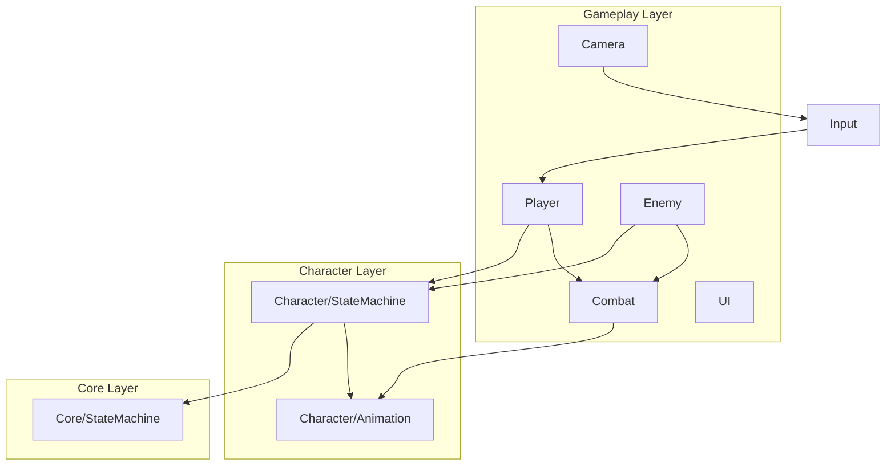

# ACTGame 架构文档

> Last audited: 2026-08-15（UE4 只读 ActionSim）

## 项目概述

Unity ACT（动作）游戏。当前重点：第三人称移动、状态机驱动动画、Cinemachine 相机、**数据驱动动作系统（ActionEditor 准备中）**。

> 各功能的实现细节、参数与运行时流程见 [TECHNICAL.md](TECHNICAL.md)。

## 目录结构

```
Assets/
├── Scripts/
│   ├── Core/StateMachine/     # 泛型状态机（与角色无关）
│   ├── Domain/
│   │   ├── Character/
│   │   │   ├── Animation/     # 动画播放与 Profile
│   │   │   ├── Locomotion/    # 相位 FSM、FootCycle、脚步
│   │   │   ├── Reactions/     # 受击/死亡请求解析与事件桥接
│   │   │   ├── Replication/   # RemoteProxy / Catalog / Capture / AutonomousRunner
│   │   │   └── StateMachine/  # 角色状态机基类与共享 State
│   │   ├── Enemy/             # Definition、AI FSM、生命值、工厂与句柄
│   │   ├── Combat/
│   │   │   ├── Actions/       # Definitions / Resolution / Execution / Frames
│   │   │   ├── Damage/        # CombatDamageCalculator（G4 升级公式）
│   │   │   ├── Resources/     # 作者壳：ActionResourceSpec / Tag / Config / EnergyFormSelector
│   │   │   ├── Numeric/       # 数值权威：AttributeSet / Effect / NumericSystem
│   │   │   ├── Hitbox/        # OBB 判定与角色 Hurtbox
│   │   │   ├── VFX/           # 招式 VFX 帧事件
│   │   │   └── Targeting/     # 索敌
│   │   ├── Input/             # 原始帧、意图与输入中枢
│   │   ├── Simulation/        # 固定帧核 + Replication + Prediction（无 Unity）
│   │   └── Net/               # IReplicationTransport + Loopback + UDP（ACTGame.Net）
│   ├── App/
│   │   ├── Architecture/      # QFramework 风格强类型 Architecture / 能力接口 / 基类
│   │   ├── Controllers/       # Player / Enemy / Camera / Combat / SimulationHost Unity 入口
│   │   ├── Systems/           # Combat / Enemy / Player（LocalPlayerService）
│   │   ├── Commands/          # 跨系统业务行为
│   │   ├── Queries/           # 无副作用读取请求（含 GetLocalPlayer / GetPlayerRoots）
│   │   └── Events/            # IArchitectureEvent 事件
│   ├── Infrastructure/
│   │   ├── Input/             # Input System 与 AI 输入源适配
│   │   └── Net/               # 预留 Unity Transport；当前 UDP 在 Domain/Net
│   └── Editor/Combat/         # ActionDefinition 预览 Editor；Editor/Net 房间菜单
├── Data/                      # ScriptableObject 配置
├── Prefabs/Player/            # 玩家 Prefab
└── Art/                       # 美术资源（不参与代码依赖）
```

## 分层依赖



## 核心子系统

### 1. 固定帧模拟宿主（Simulation）

| 类 | 职责 |
|----|------|
| `SimulationHost` | 场景唯一 Unity 时间入口：每渲染帧采样输入，并用 accumulator 驱动 60Hz World；`AfterLogicStep` 供复制打包 |
| `SimulationWorld` | 纯 C# Actor 容器：分配单调 `SimActorId`，按 Id 稳定执行 Input/Actor Step 与 PostCombat |
| `ISimulationActor` | 玩家 `CharacterActor` 与敌人 `EnemyHandle` 的固定帧契约 |
| `FixedStepAccumulator` | 把可变渲染时间转换为有追帧上限但不丢欠账的固定步数 |
| `ActionSim` | `ACTGame.Simulation` 内无 Unity 依赖的 60Hz 动作核：帧推进、Cancel、Graph 衔接、命中确认与 Snapshot/Event |
| `IRenderFrameSampler` | 可选渲染帧输入汇聚契约，避免高 FPS 无逻辑 Step 时丢 Pressed/Released |
| `ISimulationRenderable` | 可选表现接口；Host LateUpdate 按 accumulator alpha 转发插值 |
| `CharacterPresentationBridge` | 保留前后权威 Pose，只移动运行时模型锚点，不回写模拟根 |
| `InputFrame` / `InputFrameBuffer` | 量化轴、MoveReferenceYaw、稳定按钮 bitset、Actor/Frame 身份与输入历史；本地追帧延续 Move/Held/Yaw |
| `DeterministicTargetResolver` | 基于整数逻辑 Pose、阵营、存活与 SimActorId 稳定维护/切换唯一目标；无 Transform/Physics 依赖 |
| `ISimulationInputProducer` | Actor Step 前统一生成当帧输入；玩家采样量化输入，敌人 Brain 提交 Desire/Entry Request 并生成空输入帧 |
| `ISimulationPostCombatActor` | 整批命中结算后处理 OnHitConfirm/OnWhiff 自动衔接与动作自然结束 |
| `SimHitKey` / `CombatHitPipeline` | Hitbox 只 Collect；按稳定 Actor/会话/窗口身份排序，帧末统一伤害、Reaction 与命中确认 |
| `SimCombatPose` / `HitboxMath` | 命中 OBB 由 MotorSim 逻辑根构建；挂点仅相对根局部 |
| `CharacterMotorSim` / `ISimCollisionWorld` | 水平+竖直毫米权威；静态 AABB 硬挡或空场地；重力/着地在 Sim |
| `StaticCollisionBake` / `SimStaticCollisionWorld` | Editor 烘焙场景 Collider→XZ AABB；Host 共享给全体 Actor |
| `SoftBodySeparation` / `ISimSoftBodyParticipant` | World 帧末角色圆盘软弹开；死亡不参与 |
| 复制契约（NS1～NS5） | Snapshot/Tick/Codec + Loopback/UDP；`RemoteCharacterProxy` 跟状态；NS5 Listen Host 房间 |

`CombatWorldController` 创建并持有唯一 `SimulationHost`；`PlayerController` / `EnemyController` 只负责装配和注册，不再实现 Actor `Update` Tick。

### 2. 泛型状态机（Core）

| 类 | 职责 |
|----|------|
| `IState<TStateId, TContext>` | 状态生命周期与转换守卫 |
| `StateBase<,>` | 状态基类，持有 Context |
| `StateMachine<TStateId, TContext>` | 注册、Initialize、Tick、TryChangeState |

### 3. 角色状态机（Character）

| 类 | 职责 |
|----|------|
| `CharacterStateType` | 状态枚举（Locomotion, Action, …） |
| `CharacterContext` | 运行时共享数据（Transform、Animation、Motor、ActionRuntime） |
| `CharacterStateMachine` | 纯 C# 状态机宿主：RegisterStates、Tick |
| `LocomotionState` | 顶层门面：托管 `LocomotionStateMachine` |
| `LocomotionStateMachine` | 内层纯状态机（Idle/Start/Gait/PivotTurn/Stop）+ `LocomotionContext` |
| `LocomotionContext` | 内层共享依赖、跨相位数据与 RootMotion/落脚辅助 |
| `ActionState` | 只执行 Action 旋转与状态快照；动作帧由 CharacterActor 统一 Step，PostCombat 后按会话结果退出 |
| `CharacterConfig` | 角色装配根配置：模型、输入、动画、LocomotionProfile、移动、战斗 |
| `CharacterMotor` | 移动执行：水平/竖直写 `CharacterMotorSim` 并同步 Transform；CC 仅表现代理不 Move |
| `CharacterActor` | 单角色纯 C# Actor：输入、Motor、状态机、动作、旋转与非权威表现插值 |
| `CharacterTargetingState` | 每逻辑帧在 Action 前维护唯一 `SelectedTargetId`；自动最近、滞回保持、动作中左右切敌 |
| `CharacterActorFactory` | 通过 `CharacterConfig` + `ILocalInputSampler` + 共享 `CombatHitPipeline` 创建角色实例 |

**数据流（玩家）**：

```
CharacterConfig → PlayerController（Empty 根创建玩家输入源）
                    ↓
CombatWorldController → SimulationHost.Update → SampleRenderFrame + 60Hz SimulationWorld.Step
                    ↓（SimActorId 稳定顺序）
CharacterActor.Step(InputFrame) → InputManager → CharacterTargetingState（SelectedTarget）
                    ↓
              GameplayIntentProducer / GameplayIntentBuffer（整数帧）
                    ↓
              CharacterActionDriver（语义意图起手 / 缓冲 / 移动取消）
                    ↓
              CharacterStateMachine
                    ├─ LocomotionState → LocomotionStateMachine → 各相位 State → Motor + Animation
                    └─ ActionState.Tick → ActionRotationDriver
                    ↓ CharacterActor 唯一调用 ActionSim.Step（ActionSim.CurrentFrame 权威）
              CharacterActionPresentationBridge（只读 Snapshot/Event → Clip Seek / Timeline）
              HitboxFrameConsumer（只 Collect）/ ActionVfxPlayer + ActionSfxPlayer（IActionNotifyConsumer）
                    ↓（全体 Actor Step 完成）
              CombatHitPipeline.SortAndResolve → CharacterActor.ResolvePostCombat → 帧末 App 表现事件
```

### 4. 动作系统（Combat/Actions）

| 类 | 职责 |
|----|------|
| `ActionDefinition` | 单动作播放内容 SO：动画段、统一时间轴、分类与 `ActionExecutionPolicy`；不参与输入选招、流程、伤害、反馈或索敌 |
| `ActionTimeline` / `ActionNotify` / `ActionNotifyState` | 动作帧数据唯一真源：点事件（Event / VFX / SFX）与区间窗口（Phase/Hitbox/Hurtbox/Cancel/Movement/Rotation）；Recovery Phase 集成移动取消与 Entry 重开；`tracks[]` 为编辑器手动轨道 |
| `ActionSim` | L1B 纯模拟执行器：严格 60Hz；拥有 CurrentFrame、图游标、命中确认、稳定实例 Id 与下一帧切招 |
| `ActionSimSnapshot` / `ActionSimEvent` | 模拟到角色表现边界；不携带 Unity 类型，表现与 Timeline 不可反写 Sim |
| `CharacterActionPresentationBridge` | 根据 Snapshot/Event 播放并 Seek 动画，派发 Timeline；L2 前暂留 RootMotion、脚本位移与 Transform Hitbox |
| `ActionFrameQuery` | Runtime 与 Action Editor 共用的无副作用段映射、窗口和点事件查询 |
| `ActionGraph` / `ActionGraphNode` | 完整选招与流程真源：节点 Intent、Entry、是否消费 SelectedTarget、起手行为、自动衔接；Normal / Perfect 边与 SharedRoute |
| `ActionResolverService` | 调当前模式 Graph 的起手/Cancel 解析 |
| `CharacterActionDriver` | 角色无关：消费语义意图、起手切状态、动作缓冲与移动取消 |
| `ActionRotationDriver` | `RotationNotifyState` + 索敌转向 |
| `CombatModeService` | 战斗模式、`ActiveGraph`、Locomotion Profile 切换（无 ActionSet） |
| `CombatWorldController` | 场景级战斗系统生命周期锚点 |
| `ACTGameArchitecture` | QFramework 风格架构入口：System/Model/Utility 注册、Command 执行、Query 查询、Event 分发 |
| `ArchitectureSystemBase` / `AppControllerBase` / `ArchitectureCommandBase` / `ArchitectureQueryBase` | 架构对象基类；通过能力接口限制谁能访问 System、发送 Command、订阅 Event |
| `CombatActorSystem` / `TargetSystem` / `CombatFeedbackSystem` | 战斗角色注册、目标注册、反馈状态 |
| `PublishAttackHitCommand` / `GetActiveTargetsQuery` / `AttackHitEvent` | 已结算命中的只读表现通知入口与无副作用目标查询 |
| `HitboxFrameConsumer` / `HitDetector` / `CombatHitPipeline` / `TargetingResolver` | 动作帧几何检测只 Collect；命中按 `SimHitKey` 排序后帧末统一结算 |
| `HitPayload` / `HitFeedbackSettings` | 单个 Hitbox 的伤害、HitReactionId、镜头震动、卡肉与受击 Cue（VFX/SFX）载荷 |
| `HitImpactController` / `FeedbackController` | 帧末 `AttackHitEvent` 在接触点播受击特效/音效（可随机旋转）；卡肉由 `HitStopController` 托管 |
| `CombatHurtboxDebugSettings` / `CombatHurtboxDebugVisualizer` | F4 开关绘制逻辑 Hurtbox 线框 |
| `CharacterReactionSet` / `CharacterReactionResolver` | 按 HitReactionId 与反应类型生成完整受击/死亡状态请求；默认硬直时长也由规则集持有 |
| `CharacterReactionService` | 玩家/敌人共用的 Vitality 边沿桥接：副作用 + 解析结果交给 CharacterActor |
| `CombatModeProfile` | mode → `ActionGraph`（节点按语义 Intent 匹配；无 ActionSet 壳） |
| `NumericSystem` / `NumericCostGate` / `ActionResourceSpec` | 数值权威与起手扣费；价签挂 ActionDefinition；ConfirmHit 经 Pipeline Grant Effect |
| `PerfectDodgeAttack` / `PerfectDodgeWindow` | 完美闪避：窗内吞伤武装 Flags；Producer 派生 Intent；Begin 清缓冲；Graph Entry→Counter |
| `CharacterVitality` | Health Attribute 边沿（扣血 / Hit / Death） |
| `ActionEnergyFormSelector` | Special 同键：可负担则 ExSpecial，否则普通 Special |

**当前 Logic Tick**：Runtime 由 `CharacterActor` 在每个 `SimulationWorld` 固定帧唯一调用一次 `ActionSim.Step`；Action 内容严格为 60Hz。表现桥只读事件与 Snapshot；Hitbox 仅收集事件，Host 在全 Actor Step 后统一 Resolve；PostCombat 排队自动 Transition，目标 frame 0 下一 World 帧提交。

### 5. 玩家（Player）

| 类 | 职责 |
|----|------|
| `PlayerController` | Scene Empty 上唯一玩家脚本；创建 `InputReader` 并向 SimulationHost 注册/注销 Actor |
| `CharacterActor` | 实现 `ISimulationActor`；固定帧输入采集、动作路由、重力与状态机 Step |
| `CharacterMotor` | Locomotion 位移、相机相对方向、起手面向、移动快照 |

**注意**：`PlayerController` 现在是 Scene 空物体上的装配入口；通过 `CharacterConfig` 生成模型与纯 C# runtime。Player 根对象运行时只保留 `PlayerController` + `CharacterController`，不再挂载业务脚本。

### 6. 动画（Character/Animation）

| 类 | 职责 |
|----|------|
| `AnimationKey` | 逻辑动画键（Idle/Walk/Run/Sprint/Start/PivotTurn/StopL/StopR） |
| `CharacterAnimationProfile` | AnimationKey → AnimationClip 映射 |
| `CharacterLocomotionProfile` | 相位阈值、落脚标记、脚步音 |
| `IAnimationPlayback` | 可替换播放后端契约（Playable / 未来 Animancer） |
| `PlayableAnimationPlayback` | 双槽 CrossFade PlayableGraph 实现 |
| `CharacterAnimationService` | 调用层门面：Locomotion `Play`、招式 `PlayClip`、`SetSpeed` |

### 7. 输入（Input）

| 类 | 职责 |
|----|------|
| `InputFrame` | `frame + SimActorId + sbyte move + Pressed/Held/Released bitset + MoveReferenceYaw` 固定输入格式 |
| `InputFrameBuffer` | 玩家渲染采样、回放与统一 Actor Step 共用历史；精确读取与本地连续状态展开 |
| `ILocalInputSampler` / `InputReader` | 玩家设备边界：Input System Action 名映射为稳定 InputButton 并量化下一逻辑帧 |
| `IMoveIntentSource` | Character 层只读移动契约；玩家由 InputManager 实现，AI 由 LocomotionDesireBuffer 实现 |
| `InputManager` | 摄入玩家量化帧，提供移动反解值与按钮生命周期；不再含 AI 覆盖分支 |
| `GameplayIntentProfile` | 物理 InputAction → 语义意图映射；Hold/Buffer 阈值为整数逻辑帧 |
| `GameplayIntentProducer` / `GameplayIntentBuffer` | 输出语义意图并按整数帧维护长按与 Cancel 缓冲 |

### 8. 相机（Camera）

| 类 | 职责 |
|----|------|
| `CameraManager` | Cinemachine 第三人称；Orbit yaw 只 staged 到 InputFrame，本地 CameraLock 只读 SelectedTarget |

### 9. 复制与权威进程（NS0～NS5 代码已落地）

| 类 | 职责 |
|----|------|
| `ActorReplicationSnapshot` / `AuthorityTick` / `ClientCommand` | 无 Unity 上下行契约；Tick 按 SimActorId 排序 |
| `ReplicationSnapshotBuilder` / `ReplicationCodec` / `ReplicationPoseApplier` | Motor+Action+数值 → 快照；小端往返；位姿写回 MotorSim |
| `RoomCodec` / `RoomIdleTracker` / `RoomRemoteInputMerge` | 房间信封（命令批，不改 Tick 布局）；空闲 10s 剔除；未应用 Hint 边沿合并 |
| `IReplicationTransport` / `LoopbackReplicationTransport` / `UdpReplicationTransport` | 只传字节；Loopback 同进程；UDP 为 NS5 第二实现 |
| `ActionReplicationCatalog` / `CharacterReplicationCapture` | 资产名稳定 Id（含 VariantResolver 变体）；从权威 Actor 填快照 |
| `RemoteCharacterProxy` / `RemoteCharacterProxyFactory` / `ReplicationPresentationAlign` | 他人 Seek；本机走跑只 Sync Motor；过渡相位硬切在 Align |
| `ReplicationSeat` | Authority / Autonomous 工厂能力图；Autonomous 不 Collect、不进 World |
| `CharacterActor`（Autonomous） | 客机本机同一类实例；实现 `IPredictedLocomotionReplay`；表现走 `CharacterActionPresentationBridge` |
| `PredictedActionAckQueue` | 出招预测 Ack；未起手/变体分叉/Hit 则 Stop；连招超前只 Ack |
| `LocomotionSavedState` | 内层机 Capture/Restore；权威 FromAuthority |
| `RemoteGhostViewController` | Host 同机 Ghost；Client 不启用 |
| `PredictedLocomotionDriver` | 走跑记账；超阈 Restore+Replay |
| `PredictedClientPreviewController` | Host 同机左侧预览走同一 Runner；Listen Host 本地仍不预测 |
| `ReplicationRoomHost` / `ReplicationRoomClient` / `RemotePlayerSeat` | 最小 2 人房间；单机=Listen Host |

权威进程写法：同一份 `ACTGame.Simulation`，不另写服务器战斗。对照与禁区见 CONVENTIONS「服务器 / 权威进程」与方案 §13。实现级阅读入口：[`docs/2026.8.15/NETWORK_SYNC.md`](../../docs/2026.8.15/NETWORK_SYNC.md)。

### 10. 敌人（Enemy）

| 类 | 职责 |
|----|------|
| `EnemyDefinition` / `EnemyBrainProfile` / `EnemyBehaviorTreeAsset` | 身体配置、AI（Profile 终态瘦身）、可替换行为树资产；动作只在 CharacterConfig |
| `IEnemyBehaviorRunner` / `EnemyBrain` / `EnemyPerception` | Runner 决策；Brain 门闩+黑板+CooldownTable+提交；Perception 只读快照 |
| `LocomotionDesireBuffer` / `ActionEntryRequestBuffer` | Character / Combat 通用命令槽；Enemy 仅生产，不向下层泄漏具体类型 |
| `EnemyActorFactory` / `EnemyHandle` | 复用 CharacterActorFactory，聚合 Actor、Brain、Vitality、Hurtbox 生命周期 |
| `EnemyController` / `EnemySpawnController` | 单敌 Tick 入口与场景刷怪入口；感知读玩家花名册，不 Find 唯一玩家 |
| `EnemySpawnSystem` | 架构级敌人实例注册与同 Definition 存活上限 |
| `ILocalPlayer` / `LocalPlayerService` | 本机输入/相机拥有者；客机 `Input` 可空；跟朝向用 `HasMoveIntent`，出招用 `IsPresentingAction` 暂停 |

**数据流（敌人 · 当前终态）**：

```
EnemyActorFactory 构造 LocomotionDesireBuffer + ActionEntryRequestBuffer，并通过通用接口注入角色服务图
EnemyPerception 从 GetPlayerRootsQuery / 可选钉死 Transform 取水平最近玩家
EnemyBrain → Runner.Tick → 写 LocomotionDesire + ActionEntryRequest
CharacterMotor / LocomotionStateMachine 读 IMoveIntentSource；CharacterActionDriver 读 IActionEntryRequestSource
玩家仍为 InputFrame → InputManager → Intent；CharacterActor 无 Enemy 分支
玩家 Hitbox → CombatHitPipeline.Collect → 稳定排序/Resolve → CharacterHurtboxTarget → CharacterVitality
              └─ CharacterReactionService → CharacterReactionResolver
                   ├─ 非致命：EnemyBrain.NotifyHit → CharacterActor.EnterHit
                   └─ 致命：EnemyBrain.NotifyDeath → CharacterActor.EnterDeath
                         → PostCombat 后 Commit 注销 Target/CombatActor → Despawn
```

## 技术栈

- Unity + **Input System**
- **CharacterController** 移动
- **Cinemachine** 虚拟相机
- **Animator** 仅作 Playable 输出目标 + Avatar + Root Motion；Locomotion/招式均由 Clip + `IAnimationPlayback` 驱动
- 无命名空间（全局类名，靠目录分层）

## 扩展点

| 需求 | 推荐接入位置 |
|------|--------------|
| 新玩家状态 | `CharacterStateType` + 新 State 类 + RegisterStates |
| 新招式帧事件 | `ActionNotify` / `ActionNotifyState` + `IActionNotifyConsumer` 或专用查询服务 |
| 编辑器 Scrub | `ActionEditorPreviewSession` 复用 `ActionFrameQuery`，只读采样且不执行 Runtime Step |
| OnHit 收招 | `ActionGraphNode.AutomaticTransitions(OnHitConfirm)` + `IActionHitReceiver` |
| 敌人 AI 出招 | `CharacterActionDriver` + AI 输入源替换 `InputManager` |
| 配置数据 | `Assets/Data/` ScriptableObject |
