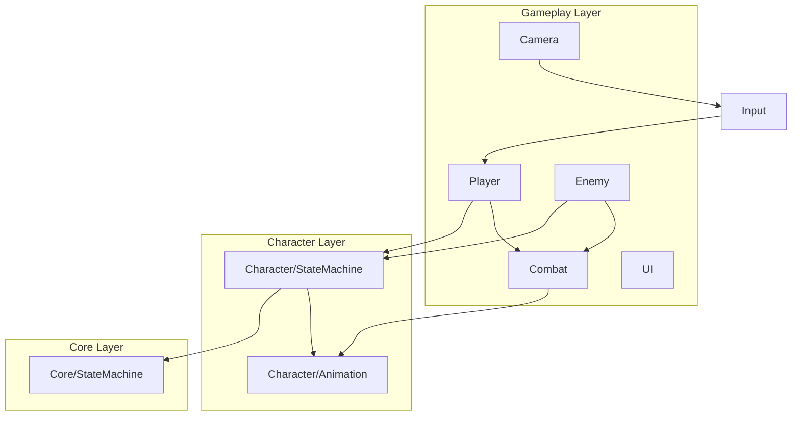

# ACTGame 架构文档

> Last audited: 2026-08-01

## 项目概述

Unity ACT（动作）游戏。当前重点：第三人称移动、状态机驱动动画、Cinemachine 相机、**数据驱动动作系统（ActionEditor 准备中）**。

> 各功能的实现细节、参数与运行时流程见 [TECHNICAL.md](TECHNICAL.md)。

## 目录结构

```
Assets/
├── Scripts/
│   ├── Core/StateMachine/     # 泛型状态机（与角色无关）
│   ├── Domain/
│   │   ├── Character/
│   │   │   ├── Animation/     # 动画播放与 Profile
│   │   │   ├── Locomotion/    # 相位 FSM、FootCycle、脚步
│   │   │   ├── Reactions/     # 受击/死亡请求解析与事件桥接
│   │   │   └── StateMachine/  # 角色状态机基类与共享 State
│   │   ├── Enemy/             # Definition、AI FSM、生命值、工厂与句柄
│   │   ├── Combat/
│   │   │   ├── Actions/       # Definitions / Resolution / Execution / Frames
│   │   │   ├── Damage/        # 伤害计算与生命值
│   │   │   ├── Hitbox/        # OBB 判定与角色 Hurtbox
│   │   │   ├── VFX/           # 招式 VFX 帧事件
│   │   │   └── Targeting/     # 索敌
│   │   ├── Input/             # 原始帧、意图与输入中枢
│   │   └── Simulation/        # 纯 C# 固定帧时钟、稳定 Actor Id 与 World
│   ├── App/
│   │   ├── Architecture/      # QFramework 风格强类型 Architecture / 能力接口 / 基类
│   │   ├── Controllers/       # Player / Enemy / Camera / Combat / SimulationHost Unity 入口
│   │   ├── Systems/           # 注册到 Architecture IOC 的业务系统
│   │   ├── Commands/          # 跨系统业务行为
│   │   ├── Queries/           # 无副作用读取请求
│   │   └── Events/            # IArchitectureEvent 事件
│   ├── Infrastructure/Input/  # Input System 与 AI 输入源适配
│   └── Editor/Combat/         # ActionDefinition 预览 Editor
├── Data/                      # ScriptableObject 配置
├── Prefabs/Player/            # 玩家 Prefab
└── Art/                       # 美术资源（不参与代码依赖）
```

## 分层依赖



## 核心子系统

### 1. 固定帧模拟宿主（Simulation）

| 类 | 职责 |
|----|------|
| `SimulationHost` | 场景唯一 Unity 时间入口：每渲染帧采样输入，并用 accumulator 驱动 60Hz World |
| `SimulationWorld` | 纯 C# Actor 容器：分配单调 `SimActorId`，按 Id 稳定顺序逐帧 `Step` |
| `ISimulationActor` | 玩家 `CharacterActor` 与敌人 `EnemyHandle` 的固定帧契约 |
| `FixedStepAccumulator` | 把可变渲染时间转换为有追帧上限但不丢欠账的固定步数 |
| `IRenderFrameSampler` | 可选渲染帧输入汇聚契约，避免高 FPS 无逻辑 Step 时丢 Pressed/Released |
| `ISimulationRenderable` | 可选表现接口；Host LateUpdate 按 accumulator alpha 转发插值 |
| `CharacterPresentationBridge` | 保留前后权威 Pose，只移动运行时模型锚点，不回写模拟根 |
| `InputFrame` / `InputFrameBuffer` | 量化轴、稳定按钮 bitset、Actor/Frame 身份与输入历史；本地追帧只延续 Move/Held |
| `ISimulationInputProducer` | Actor Step 前统一生成当帧输入；当前由敌人句柄驱动 Brain → AIInputWriter |

`CombatWorldController` 创建并持有唯一 `SimulationHost`；`PlayerController` / `EnemyController` 只负责装配和注册，不再实现 Actor `Update` Tick。

### 2. 泛型状态机（Core）

| 类 | 职责 |
|----|------|
| `IState<TStateId, TContext>` | 状态生命周期与转换守卫 |
| `StateBase<,>` | 状态基类，持有 Context |
| `StateMachine<TStateId, TContext>` | 注册、Initialize、Tick、TryChangeState |

### 3. 角色状态机（Character）

| 类 | 职责 |
|----|------|
| `CharacterStateType` | 状态枚举（Locomotion, Action, …） |
| `CharacterContext` | 运行时共享数据（Transform、Animation、Motor、ActionRuntime） |
| `CharacterStateMachine` | 纯 C# 状态机宿主：RegisterStates、Tick |
| `LocomotionState` | 顶层门面：托管 `LocomotionStateMachine` |
| `LocomotionStateMachine` | 内层纯状态机（Idle/Start/Gait/PivotTurn/Stop）+ `LocomotionContext` |
| `LocomotionContext` | 内层共享依赖、跨相位数据与 RootMotion/落脚辅助 |
| `ActionState` | Tick `IActionExecutor` + `ActionRotationDriver`；Dodge 退出写入 `LocomotionResumeRequest` |
| `CharacterConfig` | 角色装配根配置：模型、输入、动画、LocomotionProfile、移动、战斗 |
| `CharacterMotor` | 纯 C# 移动执行：`ApplyLocomotion`、重力、移动意图解析 |
| `CharacterActor` | 单角色纯 C# Actor：输入、Motor、状态机、动作、旋转与非权威表现插值 |
| `CharacterActorFactory` | 通过 `CharacterConfig` + `ICharacterInputSource` 创建角色实例 |

**数据流（玩家）**：

```
CharacterConfig → PlayerController（Empty 根创建玩家输入源）
                    ↓
CombatWorldController → SimulationHost.Update → SampleRenderFrame + 60Hz SimulationWorld.Step
                    ↓（SimActorId 稳定顺序）
CharacterActor.Step(InputFrame) → InputManager → GameplayIntentProducer / GameplayIntentBuffer（整数帧）
                    ↓
              CharacterActionDriver（语义意图起手 / 缓冲 / 移动取消）
                    ↓
              CharacterStateMachine
                    ├─ LocomotionState → LocomotionStateMachine → 各相位 State → Motor + Animation
                    └─ ActionState.Tick → ActionExecutor + ActionRotationDriver
                    ↓ ActionExecutor.Tick（当前仍以 fixed dt 推进，L1 待改整数帧权威）
              HitboxFrameConsumer（ICombatFrameConsumer）/ ActionVfxPlayer + ActionSfxPlayer（IActionNotifyConsumer）
```

### 4. 动作系统（Combat/Actions）

| 类 | 职责 |
|----|------|
| `ActionDefinition` | 单动作播放内容 SO：动画段、统一时间轴、分类与 `ActionExecutionPolicy`；不参与输入选招、流程、伤害、反馈或索敌 |
| `ActionTimeline` / `ActionNotify` / `ActionNotifyState` | 动作帧数据唯一真源：点事件（Event / VFX / SFX）与区间窗口（Phase/Hitbox/Hurtbox/Cancel/Movement/Rotation）；Recovery Phase 集成移动取消与 Entry 重开；`tracks[]` 为编辑器手动轨道 |
| `ActionExecutor` | 当前播放器：由固定 60Hz `CharacterActor.Step` 间接 Tick；仍以 ElapsedSeconds 为权威，L1 待提取整数帧 `ActionSim` |
| `ActionSession` | 当前招式唯一会话状态：CurrentAction、Elapsed、图游标、命中确认、卡肉暂停 |
| `ActionGraph` / `ActionGraphNode` | 完整选招与流程真源：节点 Intent、Entry、索敌、起手行为、自动衔接；Normal / Perfect 边与 SharedRoute |
| `ActionResolverService` | 调当前模式 Graph 的起手/Cancel 解析 |
| `CharacterActionDriver` | 角色无关：消费语义意图、起手切状态、动作缓冲与移动取消 |
| `ActionRotationDriver` | `RotationNotifyState` + 索敌转向 |
| `CombatModeService` | 战斗模式、出招表、Locomotion Profile 切换 |
| `CombatWorldController` | 场景级战斗系统生命周期锚点 |
| `ACTGameArchitecture` | QFramework 风格架构入口：System/Model/Utility 注册、Command 执行、Query 查询、Event 分发 |
| `ArchitectureSystemBase` / `AppControllerBase` / `ArchitectureCommandBase` / `ArchitectureQueryBase` | 架构对象基类；通过能力接口限制谁能访问 System、发送 Command、订阅 Event |
| `CombatActorSystem` / `TargetSystem` / `CombatFeedbackSystem` | 战斗角色注册、目标注册、反馈状态 |
| `ApplyHitCommand` / `GetActiveTargetsQuery` / `AttackHitEvent` | 命中后的跨系统通信入口与无副作用目标查询 |
| `HitboxFrameConsumer` / `HitDetector` / `TargetingResolver` | 动作帧命中检测与索敌纯计算入口；命中按 Hitbox 窗口下标×目标去重，不直接访问 Architecture |
| `HitPayload` / `HitFeedbackSettings` | 单个 Hitbox 的伤害、HitReactionId、镜头震动与卡肉载荷 |
| `CharacterReactionSet` / `CharacterReactionResolver` | 按 HitReactionId 与反应类型生成完整受击/死亡状态请求；默认硬直时长也由规则集持有 |
| `CharacterReactionService` | 玩家/敌人共用的 Health 事件桥接：执行可选上层副作用，并把解析结果交给 CharacterActor |
| `PlayerActionSet` | 出招表：绑定一张 `ActionGraph`（节点按语义 Intent 匹配） |

**当前 Logic Tick**：Runtime 由 `SimulationWorld` 固定 60Hz 推进 `ActionExecutor.Tick`；`UpdateFrame` 尚未成为生产入口，Editor Preview 仍独立采样。帧消费者实现 `ICombatFrameConsumer`，点事件/区间事件消费者实现 `IActionNotifyConsumer`；统一整数帧 `ActionSim` 见重构方案 L1。

### 5. 玩家（Player）

| 类 | 职责 |
|----|------|
| `PlayerController` | Scene Empty 上唯一玩家脚本；创建 `InputReader` 并向 SimulationHost 注册/注销 Actor |
| `CharacterActor` | 实现 `ISimulationActor`；固定帧输入采集、动作路由、重力与状态机 Step |
| `CharacterMotor` | Locomotion 位移、相机相对方向、起手面向、移动快照 |

**注意**：`PlayerController` 现在是 Scene 空物体上的装配入口；通过 `CharacterConfig` 生成模型与纯 C# runtime。Player 根对象运行时只保留 `PlayerController` + `CharacterController`，不再挂载业务脚本。

### 6. 动画（Character/Animation）

| 类 | 职责 |
|----|------|
| `AnimationKey` | 逻辑动画键（Idle/Walk/Run/Sprint/Start/PivotTurn/StopL/StopR） |
| `CharacterAnimationProfile` | AnimationKey → AnimationClip 映射 |
| `CharacterLocomotionProfile` | 相位阈值、落脚标记、脚步音 |
| `IAnimationPlayback` | 可替换播放后端契约（Playable / 未来 Animancer） |
| `PlayableAnimationPlayback` | 双槽 CrossFade PlayableGraph 实现 |
| `CharacterAnimationService` | 调用层门面：Locomotion `Play`、招式 `PlayClip`、`SetSpeed` |

### 7. 输入（Input）

| 类 | 职责 |
|----|------|
| `InputFrame` | `frame + SimActorId + sbyte move + Pressed/Held/Released bitset + aimYaw` 固定输入格式 |
| `InputFrameBuffer` | 玩家渲染采样、AI、回放共用历史；精确读取与本地连续状态展开 |
| `ILocalInputSampler` / `InputReader` | 玩家设备边界：Input System Action 名映射为稳定 InputButton 并量化下一逻辑帧 |
| `AIInputWriter` | AI 直接构造同格式 InputFrame，不再实现设备 Capture 接口 |
| `InputManager` | 摄入量化帧并向现有玩法提供移动反解值与按钮生命周期 |
| `GameplayIntentProfile` | 物理 InputAction → 语义意图映射；Hold/Buffer 阈值为整数逻辑帧 |
| `GameplayIntentProducer` / `GameplayIntentBuffer` | 输出语义意图并按整数帧维护长按与 Cancel 缓冲 |

### 8. 相机（Camera）

| 类 | 职责 |
|----|------|
| `CameraManager` | Cinemachine 第三人称 |

### 9. 敌人（Enemy）

| 类 | 职责 |
|----|------|
| `EnemyDefinition` / `EnemyBrainProfile` | 组合 CharacterConfig、AI 半径/冷却、HP 与敌人阵营；动作配置只在 CharacterConfig |
| `AIInputWriter` | 将 AI 移动与 Attack 脉冲量化为当帧 `InputFrame`，继续走统一语义意图管线 |
| `EnemyBrain` / `EnemyPerception` | Idle / Chase / Attack / Hit / Dead FSM 与只读感知快照 |
| `EnemyActorFactory` / `EnemyHandle` | 复用 CharacterActorFactory，聚合 Actor、Brain、Health、Hurtbox 生命周期 |
| `EnemyController` / `EnemySpawnController` | 单敌 Tick 入口与场景刷怪入口 |
| `EnemySpawnSystem` | 架构级敌人实例注册与同 Definition 存活上限 |

**数据流（敌人）**：

```
EnemyDefinition → EnemyActorFactory → CharacterActorFactory
EnemyBrain → AIInputWriter → InputFrameBuffer → InputManager → GameplayIntentProducer → CharacterActionDriver
玩家 Hitbox → ApplyHitCommand → CharacterHurtboxTarget → EnemyHealth
              └─ CharacterReactionService → CharacterReactionResolver
                   ├─ 非致命：EnemyBrain.NotifyHit → CharacterActor.EnterHit
                   └─ 致命：EnemyBrain.NotifyDeath → CharacterActor.EnterDeath
                         → 注销 Target/CombatActor → Despawn
```

## 技术栈

- Unity + **Input System**
- **CharacterController** 移动
- **Cinemachine** 虚拟相机
- **Animator** 仅作 Playable 输出目标 + Avatar + Root Motion；Locomotion/招式均由 Clip + `IAnimationPlayback` 驱动
- 无命名空间（全局类名，靠目录分层）

## 扩展点

| 需求 | 推荐接入位置 |
|------|--------------|
| 新玩家状态 | `CharacterStateType` + 新 State 类 + RegisterStates |
| 新招式帧事件 | `ActionNotify` / `ActionNotifyState` + `IActionNotifyConsumer` 或专用查询服务 |
| 编辑器 Scrub | `ActionExecutor.UpdateFrame` |
| OnHit 收招 | `ActionGraphNode.AutomaticTransitions(OnHitConfirm)` + `IActionHitReceiver` |
| 敌人 AI 出招 | `CharacterActionDriver` + AI 输入源替换 `InputManager` |
| 配置数据 | `Assets/Data/` ScriptableObject |
