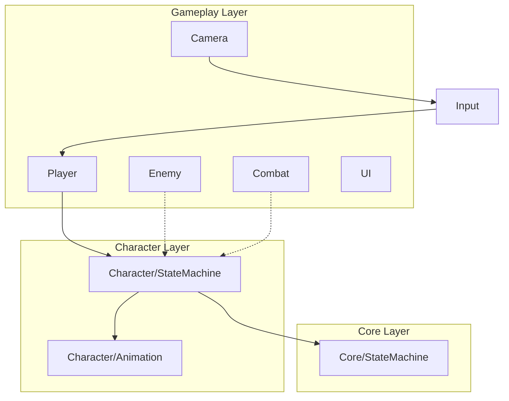

# ACTGame 架构文档

> Last audited: 2026-06-17

## 项目概述

Unity ACT（动作）游戏。当前重点：第三人称移动、状态机驱动动画、Cinemachine 相机。

> 各功能的实现细节、参数与运行时流程见 [TECHNICAL.md](TECHNICAL.md)。

## 目录结构

```
Assets/
├── Scripts/
│   ├── Core/StateMachine/     # 泛型状态机（与角色无关）
│   ├── Character/
│   │   ├── Animation/         # 动画播放与 Profile
│   │   └── StateMachine/      # 角色状态机基类与共享 State
│   ├── Player/                # 玩家控制器与 PlayerStateMachine
│   ├── Enemy/                 # （占位）
│   ├── Combat/                # （占位）
│   ├── Input/                 # Input System 封装
│   ├── Camera/                # Cinemachine 第三人称相机
│   ├── UI/                    # （占位）
│   └── Editor/                # （占位）
├── Data/                      # ScriptableObject 配置
├── Prefabs/Player/            # 玩家 Prefab
└── Art/                       # 美术资源（不参与代码依赖）
```

## 分层依赖



## 核心子系统

### 1. 泛型状态机（Core）

| 类 | 职责 |
|----|------|
| `IState<TStateId, TContext>` | 状态生命周期与转换守卫 |
| `StateBase<,>` | 状态基类，持有 Context |
| `StateMachine<TStateId, TContext>` | 注册、Initialize、Tick、TryChangeState |

转换规则：`TryChangeState` 检查 `CanTransitionTo`；`force` 可跳过守卫。

### 2. 角色状态机（Character）

| 类 | 职责 |
|----|------|
| `CharacterStateType` | 状态枚举（Locomotion, Action, …） |
| `CharacterContext` | 运行时共享数据（Transform、Animation、Motor、输入快照） |
| `CharacterState` | 角色 State 基类 |
| `CharacterStateMachine` | MonoBehaviour 宿主：Awake 建 Context、RegisterStates、Update Tick |
| `ICharacterStateMachine` | 对外暴露 TryChangeState |
| `LocomotionState` | 根据 MoveInputMagnitude 选择 Idle/Walk/Run 动画 |
| `ActionState` | 动作状态（攻击等，待扩展） |

**数据流（当前）**：

```
InputReader → PlayerController（移动+重力）
                    ↓ UpdateContext 快照
              PlayerStateMachine → CharacterContext
                    ↓ Tick
              LocomotionState → CharacterAnimationController.Play
```

### 3. 玩家（Player）

| 类 | 职责 |
|----|------|
| `PlayerController` | CharacterController 移动、相机相对方向、重力 |
| `PlayerStateMachine` | 继承 CharacterStateMachine，将 PlayerController 数据写入 Context |

**注意**：移动逻辑仍在 `PlayerController`，状态机目前主要驱动**动画**而非位移。见 ROADMAP「移动职责迁移」。

### 4. 动画（Character/Animation）

| 类 | 职责 |
|----|------|
| `AnimationKey` | 逻辑动画键枚举 |
| `CharacterAnimationProfile` | AnimationKey → Animator 状态名映射 |
| `CharacterAnimationController` | CrossFade 播放、Lock 机制、禁止 Root Motion |

### 5. 输入（Input）

| 类 | 职责 |
|----|------|
| `InputReader` | 绑定 `GameInputActions` 的 Player Map（Move/Look） |
| `GameInputActions.inputactions` | Input System 资产 |

组件级 InputReader，非全局单例。CameraManager 可引用同一 InputReader。

### 6. 相机（Camera）

| 类 | 职责 |
|----|------|
| `CameraManager` | 运行时创建 CameraRoot/Orbit/Pitch 层级，Cinemachine 第三人称 |

## 技术栈

- Unity + **Input System**（非 Legacy Input）
- **CharacterController** 移动（非 Rigidbody）
- **Cinemachine** 虚拟相机
- **Animator** + CrossFade（非 Playables 主路径）
- 无命名空间（全局类名，靠目录分层）

## 扩展点

| 需求 | 推荐接入位置 |
|------|--------------|
| 新玩家状态 | `CharacterStateType` + 新 State 类 + RegisterStates |
| 攻击/技能 | `ActionState` 或新 State；Combat/ 模块处理 Hitbox |
| 敌人 AI | `Enemy/` 下 `EnemyStateMachine : CharacterStateMachine` |
| 配置数据 | `Assets/Data/` ScriptableObject |
| 全局事件 | 待定（ROADMAP）；避免 Core 依赖 UnityEngine |
