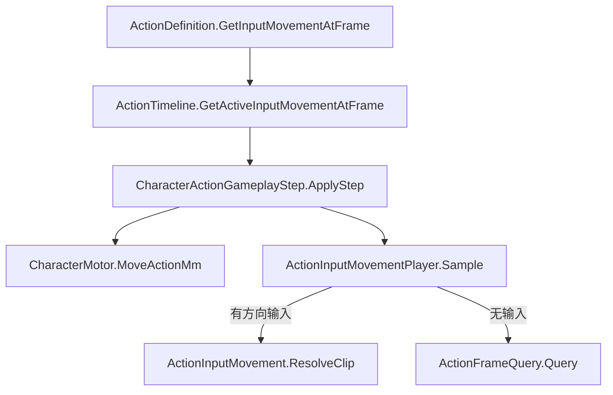
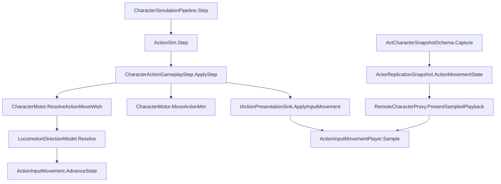

# Action 输入移动实施记录

## 最新修复：Pose 与四向 Move 共用段进度

`Animation Time Mode` 默认 **Follow Action Segment**（枚举 0），使用当前 Animation Segment 的片内时间；即使窗口中途开始、换向或松手，也不重置播放进度。包含段裁剪起始帧以及 Observer 小数帧。新字段未配置的现有窗口同样使用同步模式，不需修改生产资产。

若其它角色使用独立循环移动片，可选 **From Direction Change**，此时才显示和应用 Loop Move。它是明确的另一种行为模式，不是迁移兼容路径。方向起始帧仍用于 Minimum Direction Frames 防抖，同步模式不拿它做动画计时。网络字段和位移规则不变。

Editor：Input Movement 窗口选择 Follow Action Segment；保留所需 Cross Fade Seconds（例如 0.5）；动画覆盖窗口结束帧设为 Pose 段最后一帧。后面的 Cancel/飘落可使用关闭动画覆盖的移动窗口。四向动画需要覆盖原段的片内采样范围，短片只会钳到片尾，不自动拉伸。是否为 Cancel 设置独立的 0 秒过渡仍由作者配置，本次没有修改资产。

| 本次修改源码 | 职责 |
|---|---|
| `Assets/Scripts/Domain/Combat/Actions/Definitions/ActionInputMovement.cs` | 新增时间模式、共用段时钟和枚举校验；同步模式不独立循环。 |
| `Assets/Scripts/App/Presentation/ActionInputMovementPlayer.cs` | 本机与 Observer 按同一段时间采样方向/原动画，并跟踪同步片段身份。 |
| `Assets/Scripts/Editor/Combat/ActionEditorPreviewSession.cs` | 方向预览采用相同采样函数。 |
| `Assets/Scripts/Editor/Combat/ActionEditor/Timeline/ActionTimelineCommands.cs` | 新窗口默认同步段时间。 |
| `Assets/Scripts/Editor/Combat/ActionEditor/Inspectors/ActionNotifySelectionDrawer.cs` | 时间模式选项、条件显示 Loop Move 及配置说明。 |
| `Assets/Tests/Editor/Combat/ActionInputMovementTests.cs` | 增加裁剪/中途开窗/换向/松手/Cancel 边界/小数末帧测试，明确独立循环模式回归。 |

验证：临时 `Compile.ps1` 独立源码编译通过；`TailRunner.exe` 的 6 项纯托管窗口测试通过（shared-clock-window-tests.log）。新增依赖 Unity 对象的集成测试只完成编译，没有运行。工程正在 Unity Editor 中打开且无可用 Unity MCP，未启动 BatchMode。

待验收：Test Runner → EditMode → Assembly-CSharp-Editor → **ActionInputMovementTests**；Play 中进入 Vivian Air Pose，在中途按前进/换向/松手，并在最后数帧再次换向，检查 Move 与 Pose 对应进度及 Cancel 首帧。本次不修改 FBX，也不宣称解决底层混合中断或骨骼姿态差异。

## 当前实现：Input Movement 轨道窗口

2026-10-01 最新调整。此节替代下文历史记录中的 ExecutionPolicy 内嵌配置、独立 Pose 与 Movement Tail Frames；这些旧代码入口已移除，无兼容双路径。未修改生产资产。

### Editor 配置

1. Action Editor 中添加 **Input Movement** 轨道，再添加窗口。添加窗口会自动选择 Base Motion Mode=InputMovement。
2. 拖动窗口设置 StartFrame～EndFrame（含末帧）；只需绑定 Forward / Back / Left / Right 四个 Inplace 动画，以及移动速度。
3. 窗口内有输入时播放对应移动动画；无输入时播放 Animation Segments 中当前 Action 帧对应的原动画。Action 时钟持续推进，松手不会从头重播。
4. 若飘落时仍允许移动，添加相邻的第二个窗口，关闭 **Override Movement Animation**；该窗口不需要绑定 Clip，始终保留原 Cancel 动画。
5. 例如浮空窗口 0～299，飘落移动窗口 300～329，330 起恢复普通行为。窗口不得重叠、越过 TotalFrames 或覆盖开启 AllowMovementCancel 的 Recovery。结束帧不使用 -1。

旧配置需要在新轨道重新创建。删除最后一个窗口后若不再需要输入移动，请把 Base Motion Mode 改回适合该 Action 的模式。已有烘焙表、脚本位移、MotionCommand 或吸附配置会触发冲突提示。

Minimum Direction Frames 仍只限制连续方向切换，松手立即生效；Input Threshold 是移动输入门槛。轨道改造未修改底层混合器，不能宣称解决长 Cross Fade 下的武器闪烁。

### 代码边界

窗口唯一源为 `ActionTimeline.InputMovementStates`，查询见 [ActionTimeline.cs](/D:/Projects/ACTGame-code/Assets/Scripts/Domain/Combat/Actions/Definitions/Timeline/ActionTimeline.cs:88)。动作时钟、扣费、AutoTransition 和现有网络方向状态保持原职责。

本次修改源码（相对于上一版输入移动实现）：

| 文件（Assets 下） | 修改 |
|---|---|
| Scripts/Domain/Combat/Actions/Definitions/ActionInputMovement.cs | 继承 NotifyState；移除独立 Pose/尾帧，增加动画覆盖开关。 |
| Scripts/Domain/Combat/Actions/Definitions/ActionExecutionPolicy.cs | 删除内嵌输入移动配置，仅保留位移源选择。 |
| Scripts/Domain/Combat/Actions/Definitions/ActionDefinition.cs | 查询活动窗口，校验重叠、范围和其它位移源冲突。 |
| Scripts/Domain/Combat/Actions/Definitions/Timeline/ActionTimeline.cs | 保存、查询并枚举输入移动窗口。 |
| Scripts/Domain/Combat/Actions/Definitions/Timeline/ActionTimelineTrackKind.cs | 追加 InputMovement 轨道类型。 |
| Scripts/Domain/Character/Combat/CharacterActionGameplayStep.cs | 按当前窗口解析移动，跨窗口重置方向计时。 |
| Scripts/App/Presentation/ActionInputMovementPlayer.cs | 松手采样 Action 当前帧，跟踪窗口和动画段身份。 |
| Scripts/App/Networking/Content/ServerContentManifest.cs | 窗口行为参数加入内容指纹。 |
| Scripts/Editor/Combat/ActionEditorPreviewSession.cs | 无输入保留原动画预览，有输入预览四向片。 |
| Scripts/Editor/Combat/ActionEditor/ActionEditorWindow.cs | 无输入预览选项改名为 Action 原动画。 |
| Scripts/Editor/Combat/ActionEditor/ActionEditorStyles.cs | 添加轨道名称和颜色。 |
| Scripts/Editor/Combat/ActionEditor/Timeline/ActionTimelineCommands.cs | 接入轨道增删、窗口操作和默认配置。 |
| Scripts/Editor/Combat/ActionEditor/Inspectors/ActionNotifySelectionDrawer.cs | 窗口 Inspector 配置四向动画及仅移动模式。 |
| Tests/Editor/Combat/ActionInputMovementTests.cs | 迁移测试配置，增加窗口边界、间隙、重叠、松手恢复与编辑器增删测试。 |

### 验证与待验收

- 临时 `ACTGame-InputMovement-20261001/Compile.ps1` 独立编译通过；不是 Unity 导入编译结果。
- `TailRunner.exe`：6 项纯托管窗口测试通过；`Runner.exe`：35 项复制、预测和 Action 回归通过。日志在同一临时目录的 track-tests.log / regression-tests.log。
- 工程在 Unity 中打开且无可用 Unity MCP，未启动 BatchMode。Unity Test Runner → EditMode → Assembly-CSharp-Editor → ActionInputMovementTests / ActionInputMovementWindowTests 待运行。
- Play：Vivian → Attack_04_Main → Air → Pose；检查输入/松手/换向、Pose→Cancel 飘落跨窗口、窗口结束、攻击/闪避派生和 Owner/Observer 一致性。资产和 prefab 尚需用户在 Editor 配置。

## 历史记录（已由上述轨道方案替代）

日期：2026-10-01。状态：代码及定向测试已落地，Unity 编译、Editor 测试及 Play 待验收。未修改任何生产资产。

## 飘落阶段继续移动增量

原实现把位移和四向动画绑定到同一范围，不能在恢复 Cancel 动画后继续输入移动。本次增加 `Movement Tail Frames`（默认 0），拆分两种判断：

- `ActionDefinition.IsInputMovementAnimationActive`：Start Frame～End Frame，覆盖 Pose/四向片。
- `ActionDefinition.IsInputMovementActive`：Start Frame～End Frame＋Movement Tail Frames，驱动原 Motor 输入位移及 Owner 请求重放。
- 尾段继续按 `ActionFrameQuery` 播放原 Cancel/飘落动画，本机、Observer 与 Editor 保持一致。动作时钟和 TotalFrames 不变。

例：Pose 到第 299 帧，飘落为第 300～329 帧，第 330 帧开始可移动取消的 Recovery，则 End Frame=299、Movement Tail Frames=30。所有帧均为整个 Action 的全局帧，边界包含末帧。如果 Recovery 在飘落时已开始，可以保留 Recovery 语义，但重叠范围不能开启 AllowMovementCancel，否则移动输入的含义会冲突。

End Frame=-1 已覆盖到动作结束，尾帧必须为 0；尾帧非负，延长后的末帧必须小于 TotalFrames。无生产资产自动修改。

本次源文件变更（无新增、移动或删除源码，无兼容双路径）：

| 文件 | 本次改动 |
|---|---|
| Assets/Scripts/Domain/Combat/Actions/Definitions/ActionInputMovement.cs | 添加尾帧与独立位移/动画窗口查询，使用 long 检查末帧溢出。 |
| Assets/Scripts/Domain/Combat/Actions/Definitions/ActionDefinition.cs | 分离两个有效帧查询，校验延长范围及 Recovery 移动取消冲突。 |
| Assets/Scripts/Domain/Character/Combat/CharacterActionGameplayStep.cs | 尾段继续输入位移，但不再向 Sink 提交方向动画覆盖。 |
| Assets/Scripts/App/Presentation/CharacterActionPresentationBridge.cs | 主轨覆盖仅受动画窗口控制。 |
| Assets/Scripts/App/Presentation/RemoteCharacterProxy.cs | 即时与插值播放均在尾段恢复原动画。 |
| Assets/Scripts/Editor/Combat/ActionEditorPreviewSession.cs | 方向预览不覆盖尾段原动画。 |
| Assets/Scripts/App/Networking/Content/ServerContentManifest.cs | 尾帧配置进入 Gameplay 指纹。 |
| Assets/Scripts/Editor/Combat/ActionEditor/Inspectors/ActionNotifySelectionDrawer.cs | 更新尾段及 Recovery 配置提示。 |
| Assets/Tests/Editor/Combat/ActionInputMovementTests.cs | 增加尾段继续移动/停止边界、Recovery 重叠、溢出及窗口测试。 |

本次验证：临时 `Compile.ps1` 独立源码编译全部成功；`TailRunner.exe` 调用 NUnit 的 4 个纯窗口测试通过（`tail-tests.log`）。Unity 工程仍打开、无可用 Unity MCP，未启动 BatchMode；17 项 `ActionInputMovementTests` 集成测试仅编译，待 Unity Test Runner → EditMode → Assembly-CSharp-Editor 运行。Play 应检查持续输入跨 Pose→飘落→Recovery、飘落中松手/换向，以及 Host/Owner/Observer 动画一致性。未做 prefab 或资产布线。

## 行为与边界

`BaseMotionMode.InputMovement` 让同一个 Action 在指定帧范围内使用量化移动输入。原 Action 实例、TotalFrames、扣费、攻击/闪避派生和 AutoTransition 继续管理生命周期；方向片不会变成新的 Action。范围外恢复原 Animation Segments。

发现当前 `Vivian_Air_Pose` 包含 `Attack_Branch_Air_Pose_Inplace` 与 `Attack_Branch_Air_Cancel_Inplace` 两段，因此补充 `startFrame/endFrame`，无须强制拆成两个 Action。此处 `endFrame=-1` 表示覆盖动作剩余有效帧，不代表永久姿态；整体仍按 TotalFrames 结束。

移动请求经过原碰撞通道，撞墙不把方向动画误判为静止。最后一个卡肉 Tick 没有 FrameAdvanced 事件时不重复移动。方向最短驻留以动作帧差计算，松手立即切 Pose；不借用 Locomotion 的状态计数。

表现先推进混合权重，再 Seek 到方向片相位；重复状态不重复 Play。进入/离开窗口、切招、隐藏时清理选片缓存。当前只支持 XZ 输入移动，不增加飞行高度/重力规则。

Owner 保存每个固定帧输入解析后的世界位移请求，纠偏重新提交碰撞，不重新起手、扣费、推进 Action 或派发 Notify。重放遇普通攻击/Locomotion 帧便停止，不跨过未支持的动作恢复后续 Pose。完整战斗回滚不在本实现中；跨边界纠偏和实时移动障碍仍需联网 Play 验证。方向动画时钟由本地同一动作继续持有，Observer 从权威快照读取。

快照新增一个 int32，所有 With/Builder/Codec/Equals 均覆盖；通用复制使用编码载荷，无额外手写字段差量表。内容指纹增加线格式标识和移动速度/门槛/驻留/范围，旧构建不能加入新构建房间。无双协议兼容路径。

## Unity 配置步骤

1. 打开 `Vivian_Air_Pose` 的 Action Editor → **动作 → Execution Policy**，将 Base Motion Mode 设为 **InputMovement**。
2. 设 Start Frame=0，End Frame=**第一段 Pose 的全局末帧**（第二段 Cancel 的起始帧减 1）。飘落中需要继续移动时，将 Movement Tail Frames 设为飘落阶段帧数。若之后改为独立 Pose Action，可设 End Frame=-1、尾帧=0。
3. Input Movement 的 Pose 绑定 `Attack_Branch_Air_Pose_Inplace`，Forward/Back/Left/Right 绑定对应四个 Air Move Inplace 动画。方向按角色朝向解析；不要配置每帧强制朝移动方向转向的 Rotation 窗口，否则表现可能一直是 Forward。
4. Speed Mm Per Second 默认 2500（2.5m/s）；Input Threshold=.2；Minimum Direction Frames=3；Cross Fade Seconds=.08。Loop Pose / Loop Move 分别控制循环或末帧保持。
5. 当前 Air Pose 有已烘焙表。在动作页点击 **清除与输入移动冲突的烘焙表（支持 Undo）**，然后保存。输入移动首版不允许同时存在烘焙表、Timeline Movement、TargetAdhesion 或 MotionCommand。
6. 关闭与输入移动范围（包含移动尾段）重叠的 Recovery `AllowMovementCancel`。范围外 Cancel 段可以保留移动取消；攻击/闪避派生按现有 Graph 设置。
7. 保留原两段动画和 TotalFrames；Ground Pose、下降攻击、闪避无需启用输入移动。
8. **检查 / 来源 → 输入移动预览（只读）** 可选择五个方向；拖动时间轴进入 Cancel 范围时自动恢复 Cancel。点击校验当前动作检查缺片/范围/位移冲突。

## 验证

- `C:/Users/Diavolo/AppData/Local/Temp/ACTGame-InputMovement-20261001/Compile.ps1`：Unity 随附 Roslyn，按生成 csproj 引用编译到临时目录，并补入新增源文件；App、Editor、Simulation 测试及其依赖全部成功。这是辅助源码编译，不是 Unity Editor 验收。
- 同目录 `Runner.exe` 经 Unity Mono 调用 NUnit 断言：**35 passed / 0 failed**。覆盖新增复制/请求重放测试，以及既有快照、走跑纠偏、动作位移策略、ActionSim 生命周期。结果 `tests.log`。
- `git diff --check -- Assets/Scripts Assets/Tests` 通过。全仓检查发现用户已有 Vivian Graph 两处尾空格，未修改。
- 当前工程在 Unity Editor 打开，且未找到 Unity MCP，因此未启动 BatchMode，也未声称 Unity Test Runner 通过。

待执行：

- 等待 Unity 编译结束，确认 Console 无新错误。
- Test Runner → EditMode → `Assembly-CSharp-Editor` → `ActionInputMovementTests`（13 项）、`ActionDashCollisionIntegrationTests`、`RemoteCharacterProxyTests`。
- Test Runner → `ACTGame.Simulation.EditModeTests` → `ActionInputMovementReplicationTests`、`ActorReplicationSnapshotTests`、`PredictedLocomotionReconcileTests`、`ActionSimTests`、`ActionMotionRuntimePolicyTests`。
- Play：Attack04 → Air Pose → 四向/斜向/松手 → 原 Cancel → 普通 Locomotion；持续输入不能续时。再测卡肉、碰墙/实体、攻击派生、闪避、受击、死亡和切人。Ground Pose 与普通角色走跑对照回归。
- Host/Owner/Observer：增加延迟后检查方向、Cancel 时机、持续碰墙、重复快照，以及从 Pose 派生到下降攻击的纠偏；不能据纯逻辑测试认定联网 Play 已验收。

## 源文件清单

以下为本次实施新增/修改；已有 Graph 编辑器和 Vivian 资产改动不属于本次实施。

| 文件（均相对工程根） | 改动 |
|---|---|
| Assets/Scripts/Domain/Combat/Actions/Definitions/ActionInputMovement.cs | 新增：帧范围、速度、五向片、驻留与 Loop/Hold 配置。 |
| Assets/Scripts/Domain/Combat/Actions/Definitions/ActionExecutionPolicy.cs | 新增输入移动配置入口。 |
| Assets/Scripts/Domain/Combat/Actions/Definitions/ActionDefinition.cs | 新增范围查询、起手有效性与冲突校验。 |
| Assets/Scripts/Domain/Simulation/Motion/ActionBaseMotionMode.cs | 新增 InputMovement 枚举值。 |
| Assets/Scripts/Domain/Simulation/Motion/ActionDisplacementSource.cs | 新增唯一输入位移源。 |
| Assets/Scripts/Domain/Simulation/Motion/ActionMotionRuntimePolicy.cs | 解析新的位移源。 |
| Assets/Scripts/Domain/Simulation/Motion/ActionInputMoveState.cs | 新增方向/起始帧打包与校验。 |
| Assets/Scripts/Domain/Character/CharacterMotor.cs | 输入 wish 读取与模拟/重放共用碰撞提交。 |
| Assets/Scripts/Domain/Character/Combat/CharacterActionGameplayStep.cs | 解析输入位移、帧事件门禁、输出方向及重放请求。 |
| Assets/Scripts/Domain/Character/StateMachine/States/ActionState.cs | 输入移动窗口内保留移动观测。 |
| Assets/Scripts/Domain/Character/CharacterActor.cs | 暴露复制状态及预测请求。 |
| Assets/Scripts/Domain/Character/Presentation/IActionPresentationSink.cs | 增加只读输入移动表现契约。 |
| Assets/Scripts/Domain/Character/Presentation/NullActionPresentationSink.cs | 补齐 Headless 空实现。 |
| Assets/Scripts/App/Presentation/ActionInputMovementPlayer.cs | 新增本机/远端共用方向播放者。 |
| Assets/Scripts/App/Presentation/CharacterActionPresentationBridge.cs | 主轨选择、混合推进与方向时钟采样。 |
| Assets/Scripts/App/Presentation/RemoteCharacterProxy.cs | 权威方向状态采样、跨方向帧插值及缓存清理。 |
| Assets/Scripts/Domain/Simulation/Replication/ActorReplicationSnapshot.cs | 复制方向时钟，补齐复制构造/相等比较。 |
| Assets/Scripts/Domain/Simulation/Replication/ActorReplicationSnapshotCodec.cs | 增加方向状态 int32 线字段。 |
| Assets/Scripts/Domain/Simulation/Replication/ReplicationSnapshotBuilder.cs | 构造方向字段并清理无动作状态。 |
| Assets/Scripts/App/Networking/Schema/ActCharacterSnapshotSchema.cs | Capture 动作方向状态。 |
| Assets/Scripts/App/Networking/Content/ServerContentManifest.cs | 移动规则及线格式进入内容指纹。 |
| Assets/Scripts/Domain/Simulation/Prediction/ActionInputMovementCommand.cs | 新增输入请求值与纯重放契约。 |
| Assets/Scripts/Domain/Simulation/Prediction/LocomotionPredictCommand.cs | 保存当 Tick 输入动作请求。 |
| Assets/Scripts/Domain/Simulation/Prediction/ActPredictionReplayKind.cs | 增加动作输入移动重放种类。 |
| Assets/Scripts/Domain/Simulation/Prediction/ActCharacterPredictionModel.cs | 只重放连续输入移动请求，遇其它动作停止。 |
| Assets/Scripts/Domain/Simulation/Prediction/PredictedLocomotionDriver.cs | 选择移动纠偏策略，忽略已确认/乱序权威帧。 |
| Assets/Scripts/Domain/Character/Prediction/CharacterPredictionRuntime.cs | 复用 CharacterMotor 碰撞，不恢复 Action 状态机。 |
| Assets/Scripts/App/Networking/Adapters/ActOwnerReplicationAdapter.cs | 保存移动请求并识别权威输入移动范围。 |
| Assets/Scripts/Editor/Combat/ActionEditor/ActionEditorWindow.cs | 添加只读方向预览控件。 |
| Assets/Scripts/Editor/Combat/ActionEditorPreviewSession.cs | 预览共享方向时钟，范围外恢复原片。 |
| Assets/Scripts/Editor/Combat/ActionEditor/Inspectors/ActionNotifySelectionDrawer.cs | 配置说明、错误提示及 Undo 清烘焙表按钮。 |
| Assets/Scripts/Editor/Combat/Motion/ActionDefinitionAuditUtility.cs | 审计输入移动配置冲突。 |
| Assets/Tests/Editor/Combat/ActionInputMovementTests.cs | 新增 Unity 集成/播放测试：方向、范围、冻结、碰撞、到期与扣费。 |
| Assets/Tests/EditMode/Simulation/ActionInputMovementReplicationTests.cs | 新增复制、相位、重复包、纠偏及重放边界测试。 |

新增六份 C# 均配套 `.meta`。没有删除生产源码或保留双实现兼容路径；原 Locomotion 与普通 Action 仍使用各自职责入口。暂停的 Combat 姿态/资源池方案没有恢复。

## 连续换向优化（2026-10-01）

- 播放后端移除 Previous/Current 双槽提升逻辑，保留全部仍有权重的片段，从当前权重淡入下一目标，完成后释放旧片。
- FollowActionSegment 每个动作段使用独立 timeGroup；Move 与无输入原动画共享 Seek，跨段/restart 不把旧段拖回新段起点。同组同片复用，反复换向不会不断增加方向片实例。
- 不修改 Vivian 资产、方向驻留或 0.5 秒配置；不新增姿态系统。
- 待 Editor Test Runner / EditMode：`PlayableMovementBlendTests`、`ActionInputMovementTests`、`LocomotionIntegerClockTests`、`NullAnimationPlaybackTests`。
- 验证：临时目录 `ACTGame-MovementBlend-20261001/Compile.ps1` 使用 Unity 安装附带 Roslyn 对相关程序集和 Editor 测试进行独立编译，全部通过；本次已跟踪修改文件的 `git diff --check` 通过。独立编译不替代 Unity 编译与 Test Runner；有 Editor 进程运行且无 Unity MCP，未运行 Unity batch mode 或图测试。
- 待 Play：Vivian Air Pose，按住左后切右、在 0.5 秒内连续左右、左→松手→右、接近片尾换向→Cancel；验证武器不闪跳、时序不重置、自然落地、普通走跑/攻击过渡正常。无需新增 Inspector 或 Prefab 布线。
