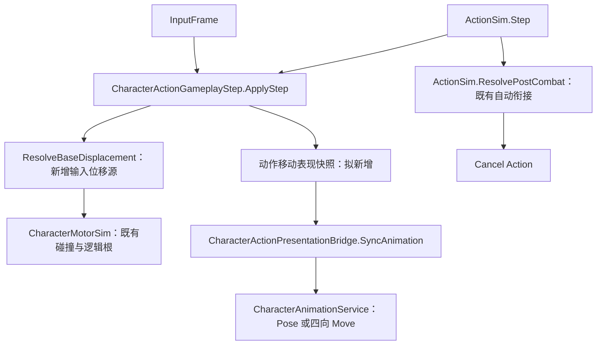

# 固定时长 Pose Action 的输入移动方案

> 制定：2026-10-01。状态：代码及定向测试已落地，Unity / Play 待验收；见[实施记录](ACTION_INPUT_MOVEMENT_IMPLEMENTATION.md)。  
> 依据：用户已用 Action 自动衔接实现 Ground/Air Pose，两个 Pose 持续时间固定；当前缺口为 Air Pose 内输入移动与四向动画。  
> 角色：本轮缩减后的实施方案；替代旧姿态资源方案在当前 Vivian 需求中的实施范围。  
> 关联：[旧方案（已暂停并撤回实现）](../2026.9.30/COMBAT_MODE_LIFECYCLE_PLAN.md)、[Locomotion 策略](../2026.8.9/LOCOMOTION_GAIT_POLICY_PLAN.md)。

> 最新实施调整（2026-10-01）：配置已改为 Input Movement 轨道窗口，仅绑定四向动画；无输入播放当前 Action 帧原动画。独立 Pose、ExecutionPolicy 内嵌配置及 Movement Tail Frames 已删除。以下是原设计历史，涉及旧配置的描述已被[当前实施记录](ACTION_INPUT_MOVEMENT_IMPLEMENTATION.md)替代。

## 0. 一句话

保留 Pose Action 的固定时长与 AutoTransition，为动作增加配置驱动的输入位移及方向动画表现，复用现有 Motor 和方向算法，不新增姿态生命周期、资源池或第二套移动状态机。

## 1. 现状与目标

以下是实施前的基线（行号对应设计时版本）。本次已新增“同一个 Action 内随输入在 Pose 与四向 Move 动画之间切换”，未改为替换 LocomotionProfile：

- `Assets/Scripts/Domain/Character/StateMachine/States/ActionState.cs:25` 在进入动作时锁住 Locomotion 动画，`:61` 在 Tick 清理移动快照。
- `Assets/Scripts/App/Presentation/CharacterActionPresentationBridge.cs:160` 的 SyncAnimation 按 ActionFrameQuery 选择当前动作段；没有输入方向选片分支。
- `Assets/Scripts/Domain/Character/Combat/CharacterActionGameplayStep.cs:312` 的 ResolveBaseDisplacement 支持烘焙或时间轴位移；现有 ScriptedTimeline 沿角色 forward，不等于玩家四向输入移动。
- `Assets/Scripts/Domain/Character/CharacterMotor.cs:148` 的 ApplyLocomotion 已处理输入、速度与位移，但同时携带步态/转向策略；不能从 ActionState 再调用一次，与动作位移叠加。
- `Assets/Scripts/Domain/Character/Locomotion/LocomotionContext.cs:318` 已复用 LocomotionDirectionModel 与 LocomotionCardinalHysteresis 实现四向解析，可共享算法，无需启动整套 LocomotionStateMachine。
- `Assets/Scripts/Domain/Character/Combat/CharacterActionDriver.cs:141` 支持 Movement Cancel；Pose 若打开该窗口，方向输入会退出 Action，配置必须明确区分。

| 路径 | 可行性与代价 | 本轮结论 |
| --- | --- | --- |
| 四个方向分别做 Move Action | 可以扩展方向选招与连续衔接，但当前没有现成的按移动方向持续选招闭环；换动作会产生新实例、重新起手，原 Pose 的剩余时间不能自动延续 | 不采用 |
| Pose 结束后切入 Air Locomotion | 适合长期自由移动；固定时长收姿需独立保存期限并调度 Cancel，重新引入动作外生命周期 | 不采用 |
| 保持一个 Air Pose Action，内部切表现和输入位移 | ActionFrame 始终前进，松手恢复 Pose，固定帧自动进入 Cancel | 推荐并据此设计 |

**范围：** Ground Pose 继续普通 Action；Air Pose 开启本能力；固定时间、攻击派生、打断与 Cancel 仍归 ActionGraph/ActionSim。可复用于固定时间瞄准、蓄力移动等动作。

**不做：** 永久/N 姿态系统、资源维持、CombatMode 类型迁移、通用 Locomotion Profile 切换、真实离地飞行。Air 指视觉和水平移动，Motor 的重力与地面约束不因此改变。

## 2. 原则

1. ActionSim.CurrentFrame 是 Pose 时长唯一真源；换方向、移动、松手均不重启 Action，不扣第二次起手费用。
2. Gameplay 由 SimulationWorld/InputFrame 固定逻辑帧驱动；渲染输入、动画长度或回调不能决定动作完成。
3. 每帧只有一个基础位移源；移动方向不等于角色转向。Air 可沿输入横移，同时保留朝向或使用既有 ActionRotationDriver 转向策略。
4. 本能力由动作配置启用，不写角色名判断；默认关闭，普通攻击和普通 Locomotion 保持原行为。
5. 不同时运行 Action 与 Locomotion 两套主轨播放者。共享方向、输入与电机算法，Action 表现桥拥有此期间的主轨。
6. 不保留替代后的双轨实现；不直接修改 Assets/Data、Prefab、场景或美术导入设置。

## 3. 目标架构与契约（拟实现）

### 3.1 动作配置

在 ActionExecutionPolicy/动作移动配置中声明输入驱动基础位移源与移动参数。不要复用“移动取消”作为开关。

| 参数 | 契约 |
| --- | --- |
| 基础位移源 | 新增输入驱动选项，与 BakedMotion/ScriptedTimeline 互斥 |
| 速度、输入阈值 | 显式动作移动速度；摇杆幅值影响速度，斜向归一化；不随普通 Walk/Run 升档 |
| 方向表现配置 | 可选 Pose + 前/后/左/右 Move Clip；对当前 Air 需求必配齐四向 |
| 循环策略 | Pose/Move 分别声明 Loop 或 Hold；不得根据文件名推断循环导入状态 |
| 转向 | 继续使用既有动作转向规则；位移方向来自量化输入，动画方向相对当前角色逻辑朝向解析 |

Pose 的有效动作段仍负责现有 TotalFrames，方向动画只是表现覆盖，不拼接到 animationSegments，不改变动作长度。后续如果需要“逻辑长度独立于原动作片长”，另行设计，不在本轮偷偷改写 TotalFrames 规则。

首版限制为 Inplace 的输入移动动作；不同时启用烘焙位移、脚本位移或吸附。审计拒绝互斥配置。沿用明确的角色/墙体碰撞策略，不允许从表现动画位移反写逻辑根。

### 3.2 固定帧与表现

后续需求增量已落地：`Movement Tail Frames` 可在 End Frame 后继续输入位移并保留原飘落动画，默认 0。范围校验与 Movement Cancel 冲突判断覆盖移动尾段；不增加独立时钟。详见实施记录中的“飘落阶段继续移动增量”。

实施补充：当前资产的 Pose 和 Cancel 是同一 Action 的两个动画段，因此增加 `startFrame/endFrame`。仅在窗口内使用输入移动和方向片，窗口外恢复原动画段；`endFrame=-1` 覆盖剩余有效动作帧，不表示无限持续。兼容独立 Pose Action 接 Cancel 的原设计。

- 在既有 Gameplay 位移协调点解析本帧输入，计算一次位移；ActionState 不再对这种动作无条件清掉必要的移动观测数据。普通动作继续原清理行为。
- 复用现有方向模型及滞回算法，状态属于当前动作实例，不能借用暂停中的 LocomotionContext 驻留计数。
- 动作期间松手时停止水平输入位移并显示 Pose；不切到 Locomotion，不重置 ActionFrame。
- 表现桥将原动作段和方向表现收敛为一次主轨选择。方向变化才切片，不能每帧 Play；逻辑时钟由动作帧驱动，明确固定帧的片段起点/相位，卡肉冻结。
- Move Clip 时长不必等于 Pose Action 时长。循环取模或末帧保持只作用于表现，达到动作结束帧仍由原 AutoTransition 进入 Cancel。
- 退出、打断、受击、死亡、切人及自动衔接清理移动表现缓存；下一动作默认不继承输入移动能力。
- Pose 配置关闭 Movement Cancel。其他攻击/闪避派生按原窗口保留；不全局屏蔽移动取消。

### 3.3 预测、复制与编辑器

Owner 保存固定帧输入解析出的碰撞前请求，纠偏重演电机碰撞；Observer 不能读本机摇杆。已核实原移动快照字段表示 wish，新增方向与切片起始帧打包值恢复驻留相位，撞墙不会错误退回 Pose。现有项目不支持完整 Action 回滚：本轮重放只覆盖连续输入移动请求，遇普通攻击/Locomotion 帧停止，不重跑动作/扣费/Notify，也不刷新当前 Action 时钟。

若现有快照不足以恢复方向驻留与动画相位，新增最小动作移动表现状态，并同步 Capture/Restore、With/复制构造、Codec、差量和内容指纹；不加入姿态资源字段。明确这部分不能因为“只是移动规则”而略过。

Action Editor 原有 Scrub 默认仍预览 Pose；补充只读方向预览控件可查看四个 Move，不修改正式输入或逻辑时间轴。新增配置在动作编辑器和内容校验入口均可见。

## 4. 分阶段交付

### AM1 — 同一动作内输入移动

**任务**

- [x] 增加输入驱动位移配置、内容校验及编辑字段。
- [x] 接入 CharacterActionGameplayStep 的唯一基础位移源；复用电机方向/碰撞能力。
- [x] 协调 ActionState 的移动快照，拒绝冲突配置。

**验收**

- [ ] 相同 InputFrame 序列得到一致 XZ；前后左右及斜向、松手、碰墙均正确。
- [ ] 移动前后 Action 实例及时间连续，起手费用仅一次；冻结不暗中位移。
- [ ] 普通攻击位移、Movement Cancel 和 Locomotion 回归通过。

**出口：** Pose Action 可输入移动，仍按固定帧结束；尚不代表四向动画完成。→ **未达成**

### AM2 — Pose 与四向 Move 表现

**任务**

- [x] 动作内方向表现配置、滞回状态和单一选片入口；复用方向算法。
- [x] Loop/Hold、松手恢复 Pose、切片相位和实例清理。
- [x] Editor 方向预览及缺片/互斥配置提示。

**验收**

- [ ] 快速切向不重复起手或刷新时长；对角输入不会每帧在两片之间抖动。
- [ ] 持续按住方向也在原结束帧进入 Cancel；松手不跳普通 Idle。
- [ ] HitStop、攻击派生、受击/死亡/切人后无残留移动片。

**出口：** 本地 Air Pose⇄四向 Move 完整可观察。→ **未达成**

### AM3 — 复制与回归闭环

**任务**

- [x] 审计并补齐输入移动范围内的 Owner 电机重放与 Observer 表现输入、相位及内容指纹；跨普通攻击的完整回滚仍沿用现有限制。
- [x] 增加动作内移动与固定时间不变的回归，覆盖纠偏和重复快照（Editor 集成测试已编译、尚待运行）。

**验收**

- [ ] Host/Owner/Observer 方向、动作结束帧及 Cancel 一致；校正不刷新姿态时间。
- [ ] 撞墙仍持方向输入的表现符合本地规则，远端不引用本地输入。
- [ ] Unity 编译与定向 Test Runner 通过，再进行 Vivian 与普通角色 Play 回归。

**出口：** 完成本轮范围；不等同通用姿态框架完成。→ **未达成**

## 5. 迁移与删除

| 内容 | 处理 |
| --- | --- |
| 用户已配置的 Ground/Air Pose Action 与 AutoTransition | 保留，由用户在 Air Pose 上启用移动配置 |
| 普通 LocomotionStateMachine | 保留正常职责，不增加 Air 专用分支或并行运行入口 |
| 输入解析、方向计算中必要的共享部分 | 提取到双方可调用的纯逻辑入口，删除被提取的重复实现，不留包装兼容路径 |
| 已撤回的模式资源方案 | 保持撤回，不恢复 Numeric 资源池、CombatModeId 或动作外计时 |

## 6. 风险与对策

| 风险 | 对策 |
| --- | --- |
| 仅解锁动画导致 Action/Locomotion 抢主轨 | 保持 Action 状态，由动作表现桥统一选片 |
| 转向后所有移动都只播前向 | 用世界输入相对逻辑朝向选片；朝向策略与位移分开 |
| 移动取消窗口导致按方向退出 Pose | 明确配置审计和 Editor 提示，不改变全局取消规则 |
| 方向片长度影响 Pose 结束时间 | 方向片不是新 Action；主动作帧不变 |
| Air 被误解为真实飞行 | 本轮只处理 XZ；地形高度、腾空碰撞另设范围 |

## 7. Editor 人工步骤

实现完成后，在现有 Air Pose Action 启用输入移动，配置速度与四向 Inplace 动画、Pose 循环策略；关闭其 Movement Cancel，保留所需战斗派生与 AutoTransition。Ground Pose 和 Cancel 不启用输入移动。检查循环接缝及同方向持续输入到时退出。Agent 不直接修改正式资产。

Play：Attack04 分支 → Air Pose → 四向移动/松手 → 固定时间 Cancel → 普通 Locomotion；对照 Ground Pose 固定时间收姿。加入卡肉、攻击派生、受击、死亡和切人测试。

## 8. 开工顺序与变更日志

AM1/AM2/AM3 已实施代码与定向测试，验收出口仍须 Unity 与联网 Play。独立编译成功，35 项纯逻辑测试通过；正式资产待用户在 Editor 配置。

- 2026-10-01：依据“两个 Pose 时间固定且已做成自动衔接 Action”缩减需求；选择动作内输入移动，不恢复完整姿态框架。
- 2026-10-01：用户授权执行后落地；针对真实 Pose＋Cancel 资产补充输入移动帧范围，记录 Owner 电机重放边界及 Unity 待验项。
