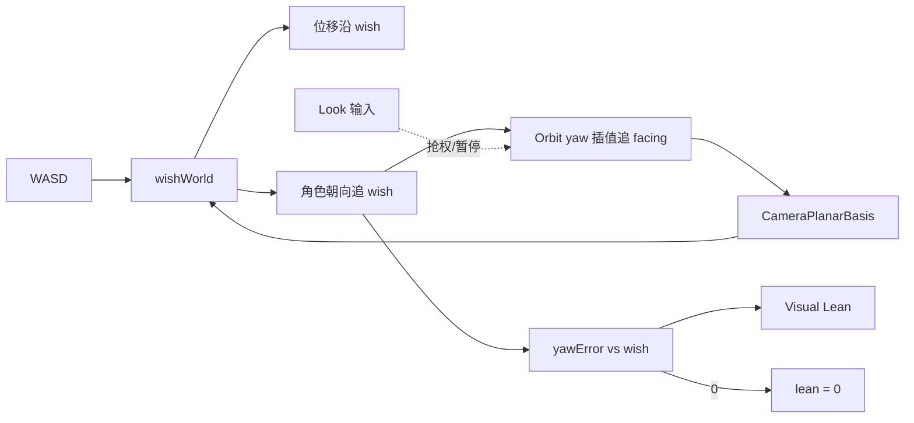

# Locomotion：相位与方向解耦 · AnimSet · 锁定八向就绪 · Sprint 倾身 — 优化方案

> 制定：2026-08-10  
> 修订：2026-08-11 — 增补 **L-DIR4 Sprint 转弯身体倾斜（Bank/Lean）**；文内路径改为本仓相对链接  
> 修订：2026-08-11 — 归纳产品需求：按住 W + 转视角的倾身闭环；AD/WD 转向减速与绕圈；明确与相机系统边界（§1.4 / L-DIR5）  
> 修订：2026-08-11 — **绕圈定案改为**：Orbit yaw **插值跟随角色移动朝向**（相机←角色，闭环反哺 wish）；Look 可抢权；见 §1.4 / L-DIR5  
> 角色：**Character Locomotion 下一阶段结构真源（先文档，后实现）**；绕圈相机行为与 [`CAMERA_SYSTEM_PLAN`](../2026.8.6/CAMERA_SYSTEM_PLAN.md) 交叉落地  
> 相关：  
> - 既有相位：[`../LOCOMOTION_OPTIMIZATION_PLAN.md`](../LOCOMOTION_OPTIMIZATION_PLAN.md)（Idle/Start/Gait/Pivot/Stop）  
> - 步态策略：[`../2026.8.9/LOCOMOTION_GAIT_POLICY_PLAN.md`](../2026.8.9/LOCOMOTION_GAIT_POLICY_PLAN.md)（GaitPolicy / WalkLeft·Right Resolver）  
> - 敌人移动命令：[`ENEMY_BT_DISCRETE_COMBAT_AND_CONFIG_PLAN.md`](./ENEMY_BT_DISCRETE_COMBAT_AND_CONFIG_PLAN.md)（`LocomotionDesire`；结构已关闭）  
> - 相机：[`../2026.8.6/CAMERA_SYSTEM_PLAN.md`](../2026.8.6/CAMERA_SYSTEM_PLAN.md)（Orbit 基；**L-DIR5 增补 yaw 跟随朝向**）  
> - 锁步 / 表现边界：[`../ACTION_SYSTEM_LOCKSTEP_REFACTOR_PLAN.md`](../ACTION_SYSTEM_LOCKSTEP_REFACTOR_PLAN.md)、[`../INPLACE_ROOTMOTION_MOTION_TABLE_PLAN.md`](../INPLACE_ROOTMOTION_MOTION_TABLE_PLAN.md)  
> - 参考心智：UE Lyra（Cardinal + Orientation Warping）、ALS / 经典 Strafe、疾跑倾身（Bank）  
> - 格式 skill：`.cursor/skills/actgame-design-plan`  
> 装配链：`WASD→镜头相对 wish→角色追 wish`；`相机 yaw 平滑追角色朝向→再喂 PlanarBasis`；`facing↔wish→Lean`

---

## 0. 一句话

Locomotion **相位状态机只表达行为**（Idle/Start/Gait/Stop/Pivot），**方向与锁定是参数与数据**（`FacingMode` + Cardinal/Angle + `LocomotionAnimSet`）；自由移动保持**镜头相对 wish**，绕圈靠 **Orbit yaw 插值跟随角色移动朝向**（表现层读朝向、反哺 wish，**禁止**相机写 Motor 权威）；Lean 由 `facing↔wish` 偏角驱动，对齐时恰为 0；禁止为八向新建相位类、禁止 Lean 改位移权威、禁止坦克键位默认定案。

---

## 1. 问题与动机

### 1.1 现状基线

```text
CharacterActor.Step
  → InputFrame / LocomotionDesire（敌人）
  → LocomotionStateMachine
       Idle | Start | Gait | PivotTurn | Stop   ← 各一 C# 相位类
       GaitPolicy.Evaluate → Walk/Run/Sprint
       DefaultLocomotionAnimResolver
         Walk + 横向主导 → WalkLeft / WalkRight
         Start → WalkStartLeft/Right / WalkStart / Start
  → CharacterAnimationService.Play(AnimationKey)
  → Motor.ApplyLocomotion(RotationMode…)
  → （无）Sprint 转弯倾身 / Bank 信号
```

| 点 | 现状 |
|----|------|
| 相位 | 五类：`Idle/Start/Gait/PivotTurn/StopLocomotionState`；行为语义正确 |
| 步态 | `LocomotionGaitPolicy` 外置；敌我靠 Profile，State 无身份 if |
| 选片 | 离散 `AnimationKey`：Idle/Walk/WalkLeft/WalkRight/WalkStart*/Run/Sprint/Start/StartEnd/StopL/R/PivotTurn |
| 朝向 | Profile.`GaitRotationMode`：`FollowInput` / `FaceCamera`（敌对峙） |
| wish 构造 | `CharacterMotor.ResolveWorldMoveDirection`：`OrbitForward*y + OrbitRight*x`（`SetCameraPlanarBasis`） |
| 位移 | **FollowInput：沿当前朝向**（与 `RotationSmoothTime` 同参拐弯）；FaceCamera 仍沿 wish |
| 转向 | `FollowInput` → `SmoothDampAngle(RotationSmoothTime)` 追 wish；只调这一项即可拉长 W→WD |
| 循环横移 | 仅左右；无后向、无对角线、无完整八向 |
| 起步 | Start 相位内闩 Key；含 Walk↔Run 升档/降档特例 |
| 急停 | 按落脚 `StopL`/`StopR`，非按移动方向 |
| 播放 | 单 Clip `Play(Key)`；无 Cardinal 表、无 2D Blend、无 Orientation Warp |
| 倾身 | **无**：Sprint 转弯直立硬转 |
| 绕弧 | Orbit yaw **仅**人手 Look；相机**不**跟角色朝向 → 固定视角下 WD 世界 wish 恒定 → 直线冲 |
| 相机 | `CameraManager`：Look 累加 yaw；位置跟随有，**无**「yaw 追角色移动朝向」 |

### 1.2 痛点

1. **扩展单位错位**：每加一种移动表现 ≈ 新 `AnimationKey` + Profile 槽 + Resolver 分支 +（常）Start 特例；玩家状态扩展很重。  
2. **方向污染相位**：`StartLocomotionState` 已含 WalkStart 族、升跑直切、降走重闩；方向逻辑渗进行为类。  
3. **组合爆炸预期**：锁定八向若沿用「一方向一 Key / 一方向一状态」，将出现 8 走循环 + 8 起步 + 8 停止的资产与配置面（甚至误导成 24 个状态类）。  
4. **自由移动 ≠ 锁定 strafing**：自由跟输入转 + Pivot；锁定面朝目标 + 本地 wish。现有 `FaceCamera` 只够敌人对峙，撑不住玩家完整锁定八向。  
5. **命令轨已对齐、选片未收敛**：敌人已走 `LocomotionDesire`；Locomotion 仍以横向 Key 硬编码选片，扩展面仍重。  
6. **疾跑转弯缺倾身**：wish 相对朝向偏转时，缺少「向转弯侧略倾 → 对齐时倾角恰为 0」。  
7. **WD/D 无法自然绕圈**：镜头不跟移动朝向时，斜前/右移 wish 世界方向不变 → 直线；人手一直拖视角才能弯，不符合「按住 WD/D 就能转圈」的预期。

### 1.3 目标

| 目标 | 说明 |
|------|------|
| 结构 | 相位类数量稳定；方向进 `DirectionModel` + `LocomotionAnimSet`（或 Loop BlendSpace） |
| 锁定就绪 | `FacingMode=FaceTarget` 时，同一套相位 + 四向/八向选片可播 strafing，无需新状态类 |
| 配置收敛 | 人维护 AnimSet / Blend 资产；不再每方向改枚举与 State |
| Sprint 倾身 | `facing↔wish` 有符号 Lean；**对齐时 lean≡0** |
| 绕圈 | 移动中 Orbit yaw **插值跟随**角色移动朝向，使 WD/D 在跟随过程中持续变 wish → 转圈 |
| 正交 | Locomotion 产朝向；相机**只读**跟随并回写 PlanarBasis；不写 Motor 权威 |
| 不做 | 八向相位类；Lean 相位/改权威；坦克键位默认定案；Lock-On 式环绕冒充自由绕圈；Motion Matching；Agent 改 `.asset`/Clip |

### 1.4 产品需求归纳（2026-08-11）

#### 需求 A — 倾身闭环（facing ↔ wish）

| 项 | 内容 |
|----|------|
| 场景 | Sprint（首版）下 wish 与角色朝向出现水平偏角（含 W+镜头相对变向、或相机跟随滞后造成的夹角） |
| 表现 | 向偏转侧 **略倾**；随朝向追上 wish，倾角减小 |
| 终点 | **facing 与 wish（≈当前镜头正前/斜前）对齐 ⇒ lean≡0** |
| 工程 | `yawError = SignedAngle(facing, wishWorld)`；`lean = f(yawError)` |

#### 需求 B — 按住 WD/D 能绕圈（定案：相机跟随朝向）

| 项 | 内容 |
|----|------|
| 痛点 | 固定视角下 WD/D 世界 wish 不变 → 直线；角色秒贴斜前 |
| 期望 | **相机视角自动插值跟随到玩家移动朝向**；输入 WD 或 D 时，视角在跟随过程中持续更新 → **移动转圈** |
| 工程闭环 | 角色追 wish → 相机 yaw 平滑追角色朝向 → PlanarBasis 变 → wish 世界方向变 → 路径弯曲 |

#### 根因（现网）

```text
Look → Orbit yaw（独立，不跟角色朝向）
wish = OrbitFwd*W + OrbitRight*D
位移 ∥ wish；朝向几乎贴 wish
→ 不拖鼠标时 wish 世界方向恒定 → 直线
```

#### 路径对比与定案

| 路径 | 说明 | 结论 |
|------|------|------|
| ~~人手持续 Look + 仅降角色转向~~ | 早先草案；绕圈依赖拖视角 | **废弃为绕圈主方案**（仍可作辅助手感） |
| **C（定案）相机 yaw 插值跟随角色移动朝向** | 保持镜头相对 WASD；表现层读 facing；Look 可抢权/暂停跟随 | ✅ **绕圈真源**（L-DIR5） |
| 坦克键位（W 贴身前、AD 偏航） | 不依赖相机 | ❌ 本阶段不做 |

**定案结论：**

1. **绕圈主路径 = 相机跟随朝向闭环**（须改 `CameraManager` / 后续 Rig，属相机表现能力，与本方案 L-DIR5 交叉验收）。  
2. **方向铁律不变**：Gameplay 朝向权威在 Motor；相机 **只读 facing → 平滑改自己的 Orbit yaw → 再 `SetCameraPlanarBasis`**；禁止相机写回 Motor 朝向。  
3. **Look 优先**：有 Look 输入时暂停或大幅减弱自动跟随，避免抢视角；松手后恢复跟随（可配延迟）。  
4. **跟随必须滞后**：相机 yaw 不得 1:1 贴死 facing，否则纯 D 易「原地拧圈」；`cameraFollowFacingSmoothTime` 明显大于 0。  
5. **倾身 = L-DIR4**；角色侧可保留适度转向平滑（辅助倾身窗口），但绕圈**不**再依赖「人手一直转视角」。  
6. **不做** Lock-On 环绕、坦克键位、相机写权威。



---

## 2. 设计原则

1. **相位 = 行为，方向 = 参数**：Idle/Start/Gait/Stop/Pivot 只回答「现在能不能松手急停 / 要不要 Pivot」；不回答「播左还是右后」。  
2. **差异在资产与 Policy**：敌我、自由/锁定靠 Profile（FacingMode、AnimSet、MaxGait），禁止 `if (isEnemy)` / `if (lockOn)` 散落 State。  
3. **单一选片入口**：迁完后 Gait/Start 只调 `ILocomotionAnimResolver`（或后继 `LocomotionAnimSet.Resolve`）；删除旁路 `Play(AnimationKey.Walk)` 业务路径。  
4. **逻辑与表现分工**：逻辑帧权威输出 `phase + gait + localWish + facingMode +（可选 cardinal）`；Clip 混合权重可在表现层，但锁步位移仍走既有 Motor / 烘焙轨。  
5. **零长期兼容**：WalkLeft/Right 与 WalkStartLeft/Right 迁入 AnimSet 后删除枚举业务用法与 Resolver 横向硬编码。  
6. **成熟心智优先**：对齐 Lyra「少相位 + Cardinal 选片（对角线后续可 Warp）」；不默认上 Motion Matching。  
7. **Pivot 属于自由移动**：锁定 strafing 默认 `AllowPivot=false` 或由 Policy 关闭；不与八向选片缠成新相位。  
8. **急停两轴分开**：落脚（StopL/R）与移动 cardinal 不在同一阶段强行笛卡尔积；首版急停保持落脚轴，方向急停另开可选阶段。  
9. **倾身是表现，不是相位**：Lean 只读 gait + 转向偏角，输出有符号倾角/权重给 Presentation；禁止新 `LeanLocomotionState`，禁止 Lean 改 Motor 位移权威或命中盒中心。  
10. **倾身默认仅 Sprint**：Walk/Run/Pivot/Stop/Hit 默认 Lean→0（可配「Run 也倾」但首版不做）；离开 Sprint 或 wish 与 facing 对齐后平滑回正。  
11. **Lean 与转向同一误差源**：驱动量 = `SignedAngle(facing, wishWorld)`；**禁止**与朝向脱钩的假倾身衰减。  
12. **绕圈靠相机跟随朝向闭环**：移动中 Orbit yaw 平滑追角色移动朝向，反哺 PlanarBasis；**禁止**相机写 Motor 权威；Look 输入优先于自动跟随。  
13. **跟随必须可配滞后**：避免相机贴死 facing 导致纯 D 自旋；与角色 `RotationSmoothTime` 分开调参。

---

## 3. 目标架构

### 3.1 总览

```text
【Gameplay】
  WASD / Desire → wishWorld（镜头相对）→ 位移
                → FollowMove：角色朝向追 wish
                → SprintLeanModel：lean = f(facing, wish)

【Presentation / Camera — L-DIR5】
  读角色移动朝向（或权威根 yaw）
    → 若有移动且无 Look 抢权：
         OrbitYaw = SmoothDamp(OrbitYaw, facingYaw, cameraFollowFacingSmoothTime)
    → 若有 Look：Look 直接改 OrbitYaw，暂停/减弱跟随
  → SetCameraPlanarBasis(PlanarFwd, PlanarRight)  // 反哺下一帧 wish
  → 禁止写回 Motor.SetFacing / 权威朝向

【选片 — L-DIR1～3】
  DirectionModel → LocomotionAnimSet → Play / Blend
```

### 3.2 相位保持（不膨胀）

| Phase | 职责 | 与方向关系 |
|-------|------|------------|
| `Idle` | 静止 | 无 |
| `Start` | 必经起步；松手→Stop | **只闩** AnimSet 解析出的 Start Clip，不换相位类 |
| `Gait` | 循环；升档/宽限急停 | 每帧（或滞回后）按 Cardinal 选 Loop |
| `PivotTurn` | 自由移动大角度折返 | 通常单 Clip；锁定模式 Policy 关闭 |
| `Stop` | 急停收束 | 首版仍 StopL/R（落脚）；不强制×八向 |

**定案：不加** `StartForwardState` / `GaitStrafeLeftState` 等方向相位。

### 3.3 FacingMode（定案）

| 模式 | 旋转参考 | 典型用途 |
|------|----------|----------|
| `FollowMove` | 跟 wish 世界方向（现 FollowInput） | 玩家探索 |
| `FaceTarget` | 面朝锁定/索敌目标 | 玩家锁定八向 |
| `FaceCamera` | 面朝假相机/对峙前向 | 敌人对峙（现网） |

- 写入点：`CharacterLocomotionProfile` 默认 + 运行时可被 CombatMode / Desire 覆盖（单一写入契约，禁止多处抢写）。  
- 替换并吸收现 `GaitRotationMode` 语义；迁完删除旧枚举业务名（或改名为 FacingMode 别名一期后删）。

### 3.4 DirectionModel（定案首版：Cardinal4）

```text
enum MoveCardinal { Forward, Back, Left, Right }

Resolve(localWish, epsilon):
  无意义输入 → None
  取 atan2 / 主导轴 → 最近 cardinal（死区 + 可选滞回帧，防对角线抖动）
```

| 决议 | 内容 |
|------|------|
| 首版覆盖 | **四向**（Lyra 同级）；对角线先吸附最近 cardinal |
| 八向 | 可选阶段 L-DIR3：Octant8 或 Loop 2D BlendSpace |
| 滞回 | Cardinal 切换最短驻留（建议与对峙 DistanceBand 同类想法，防抖） |

禁止：在 State 内手写 `if (x>0 && y>0) Play(WalkFL)` 散落。

### 3.5 LocomotionAnimSet（定案数据真源）

人维护（或挂在 `CharacterLocomotionProfile` 内）：

```text
LocomotionAnimSet
├─ Walk
│   ├─ Loop[Fwd, Back, Left, Right]     // Clip 引用；缺则回退 Fwd→Walk 旧键迁移期一次性
│   ├─ Start[Fwd, Back, Left, Right]    // 可缺；缺则回退 Fwd Start → 旧 Start
│   └─ （Stop 方向表：本方案默认不做，见原则 #8）
├─ Run
│   ├─ Loop[Fwd]（锁定后再扩 Back/Left/Right）
│   └─ Start[Fwd]（现 Start / RunStart）
├─ Sprint.Loop[Fwd]
└─ Shared：Idle, StartEnd, PivotTurn, StopL, StopR
```

解析契约：

```text
ResolveLoop(gait, cardinal) → ClipRef / PresentationKey
ResolveStart(gait, cardinal) → ClipRef
ResolveShared(kind) → ClipRef   // Idle, StopL/R, Pivot…
```

**`AnimationKey` 命运：**

| 阶段 | 做法 |
|------|------|
| L-DIR1 | AnimSet 为真源；旧 Key 仅作迁移别名或删除 |
| 完成态 | 业务选片不再 `switch(AnimationKey)` 扩方向；枚举可缩为 Shared 少数项或废弃 |

### 3.6 选片与相位协作

```text
Start.Enter:
  cardinal = DirectionModel.Resolve(localWish)  // 闩定，Start 中途不因微抖换片（可保留升跑直切）
  clip = AnimSet.ResolveStart(gait, cardinal)
  Play(clip)

Gait.ExecuteFrame:
  cardinal = DirectionModel.ResolveWithHysteresis(localWish)
  clip = AnimSet.ResolveLoop(gait, cardinal)
  Play(clip)  // 换 cardinal 用 InterruptFade，非新相位
```

Walk↔Run 升档/降档逻辑留在相位 + GaitPolicy；**不再**以 `AnimationKey.WalkStart*` 族硬编码判断，改为「当前 Start 槽是否属于 Walk 档」。

### 3.7 SprintLeanModel（定案：L-DIR4）

**产品意图（对齐 §1.4 A）：** 按住 W 并向右转视角时，角色向右略倾；朝向逐渐追上**当前镜头正前（wish）**时倾角减小，**完全对齐时 lean 恰为 0**。

```text
每逻辑帧：

  wishWorld = ResolveWorldMoveDirection(moveIntent)   // 已含 Orbit 基；纯 W 时 = 镜头正前
  if gait != Sprint || wishWorld≈0:
      targetLean = 0
  else:
      yawErrorDeg = SignedAngle(characterForward.xz, wishWorld.xz)
      // 定案：lean 目标与 |yawError| 单调；对齐 ⇒ 0（死区内视为 0）
      targetLean01 = Saturate((|yawErrorDeg| - deadZone) / (maxEngageYaw - deadZone))
                     * Sign(yawErrorDeg)

  // 可选：对 lean01 做轻微平滑，但不得在 yawError 已为 0 时仍长期非 0
  // 推荐：yawError 进死区时强制 lean→0（比独立 recover 计时更贴「正好恢复到 0」）
  lean01 → Presentation Bank Roll = lean01 * maxLeanDeg
```

| 决议 | 内容 |
|------|------|
| 启用步态 | **仅 Sprint**（首版）；离开 Sprint → 0 |
| 驱动量 | `SignedAngle(facing, wishWorld)`；纯 W + 转视角时 wish=镜头正前 |
| 对齐契约 | **yawError∈死区 ⇒ lean≡0**（验收硬条件） |
| 应用层 | Visual-only；不改 Motor 权威位移/碰撞中心 |
| 配置面 | `maxLeanDeg`、`deadZoneDeg`、`maxEngageYawDeg`（+ 可选轻微平滑） |
| 与 L-DIR5 | 相机跟随滞后越大，同一输入下 yawError 窗口可能更长；两者分参 |
| Pivot / FaceTarget | Lean 目标 0 |
| 不做 | Lean 相位；Lean Clip 替换 Sprint；与朝向脱钩的独立衰减真源 |

禁止：`if (isPlayer) lean=…`；幅度走 Profile。

### 3.8 CameraFollowFacing + 角色转向（定案：L-DIR5）

**产品意图（对齐 §1.4 B）：** 相机视角自动插值跟随玩家**移动朝向**；按住 WD/D 时，视角在跟随过程中持续更新 PlanarBasis，从而绕圈。

```text
【相机 — 主】
  if hasMoveIntent && !lookOverride:
      targetYaw = characterFacingYaw   // 只读 Motor/根朝向
      orbitYaw = SmoothDampAngle(orbitYaw, targetYaw, cameraFollowFacingSmoothTime)
  else if lookOverride:
      orbitYaw += lookDelta            // 现网 Look；期间暂停或减弱跟随
  Publish PlanarBasis(orbitYaw)

【角色 — 辅】
  位移仍 ∥ wishWorld（镜头相对语义不变）
  FollowMove：朝向追 wish；可保留/略加大 RotationSmoothTime（倾身可读，非绕圈主因）
```

| 决议 | 内容 |
|------|------|
| 控制模型 | **保持镜头相对 WASD**；不改坦克键位 |
| 绕圈主因 | **Orbit yaw 跟随角色朝向**（可配滞后） |
| 启用条件 | 有水平移动意图；`FacingMode=FollowMove`（探索自由移动） |
| Look 抢权 | 有 Look 输入 → 暂停/减弱跟随；松手后延迟恢复（可配） |
| 滞后 | `cameraFollowFacingSmoothTime` **必须 > 0**；禁止每帧硬贴 facing |
| 权威 | 相机 **只读** facing；**禁止** `Motor`/`Sim` 被相机改朝向 |
| 锁定 | `FaceTarget` / LockOn 模式：**关闭**本跟随（避免与锁定相机抢 yaw） |
| 角色转向 | 可选 AD 加权慢转作辅；**不**再写成「绕圈靠人手 Look」 |
| 不做 | Lock-On 环绕冒充；坦克键位；相机写权威 |

### 3.9 层边界

| 层 | 职责 | 不负责 |
|----|------|--------|
| 相机 App | Look；**yaw 跟随 facing**；PlanarBasis；跟随滞后与抢权 | 改 Motor 朝向、Lean、权威位移 |
| 输入 / Desire | 本地 WASD / Desire | AnimationKey、Cardinal、Lean |
| Phase SM | 起停 Pivot、松手、必经 Start | 八向枚举、绑 Clip、倾身幅度 |
| GaitPolicy | MaxGait、Sprint 计时、AllowPivot | 读仇恨、选左右片、算 Lean |
| DirectionModel | wish→Cardinal/Angle | Motor 位移、Lean、相机 yaw |
| 角色转向 | 追 wish 的朝向（可配平滑） | 驱动相机（由相机读朝向） |
| SprintLeanModel | yawError(facing,wish)→lean；对齐⇒0 | 播 Clip、改权威位置 |
| AnimSet / Resolver | (gait,phase,cardinal)→Clip | Lean、相机 |
| Presentation | Play / Blend / **Bank Roll** | 回写逻辑相位 |

### 3.10 与敌人 / 锁定的对齐

| 场景 | FacingMode | AnimSet / 转向·倾身·相机 |
|------|------------|--------------------------|
| 玩家探索 | FollowMove | L-DIR5 相机跟朝向 + L-DIR4 Sprint Lean |
| 玩家锁定 | FaceTarget | 四向表；**Lean 关**；**相机跟随朝向关** |
| 敌人对峙 | FaceCamera / FaceTarget | Walk L/R；无玩家相机跟随 |
| 敌人追击 | FollowMove / FaceTarget | Run Fwd |

### 3.11 方案对比（为何不定案别的）

| 方案 | 结论 |
|------|------|
| 八向各一套相位类 | ❌ 明确禁止；工程与测试爆炸 |
| 仅膨胀 AnimationKey | ❌ 现状痛点延续 |
| **Cardinal4 + AnimSet（定案）** | ✅ 与 Lyra 同级；锁步友好；可迁现网 L/R |
| Loop 2D BlendSpace | ⚪ L-DIR3 可选；手感更好，表现层加重 |
| Cardinal + Orientation Warp | ⚪ 更远期；减对角线美术，需骨骼/Warp 基建 |
| Motion Matching | ❌ 本阶段不做；与整数帧/表驱动主路径冲突大 |
| Sprint 专用 Lean 相位 / Lean Clip 主循环 | ❌ 相位膨胀；与现 Sprint Loop 叠播冲突 |
| **偏角驱动 Visual Bank（定案 L-DIR4）** | ✅ 对齐「追上 wish 则 lean=0」 |
| ~~仅人手 Look + 角色慢转绕圈~~ | ❌ 已废弃为绕圈主方案 |
| **相机 yaw 跟随角色朝向（定案 L-DIR5）** | ✅ 按住 WD/D 可转圈；Look 可抢权；不写 Motor |
| 坦克键位（W 贴身前、AD 偏航） | ❌ 本阶段不做；另议题 |
| Lock-On 式强制环绕 | ❌ 与自由探索绕圈不同题；见相机方案 LockOn |

---

## 4. 范围声明

| 阶段 | 包含 | 不包含 |
|------|------|--------|
| L-DIR1 | FacingMode 统一；DirectionModel Cardinal4；AnimSet 骨架；Walk L/R 迁入；删横向 Key 业务双轨 | 玩家锁定玩法完整 UX、BlendSpace、Warp、倾身 |
| L-DIR2 | Start 四向表；Start 相位去 Key 族特例；Cardinal 滞回；敌人/玩家 Profile 接线契约 | 方向×落脚 Stop 笛卡尔积 |
| L-DIR3 | 玩家锁定 FaceTarget 可玩；可选 Octant8 或 Loop BlendSpace；Run strafing 表 | Motion Matching、完整 Lyra Warp |
| L-DIR4 | Sprint Lean；**yawError→0 ⇒ lean≡0**；Visual Bank；与 §1.4 A 验收对齐 | Lean 改权威；Run 倾身；锁定倾身；Lean Clip |
| L-DIR5 | Orbit yaw 跟随角色朝向；Look 抢权；滞后可配；PlanarBasis 反哺；交叉相机方案 | 相机写 Motor；坦克键位；LockOn 环绕；贴死 facing |
| 全程不做 | Agent 改 Prefab/`.asset`/Clip；身份 if；长期旧 Resolver 与 AnimSet 并行；Lean 相位类 |

---

## 5. 分阶段交付（任务 / 验收 / 出口）

> 勾选：未开始 `[ ]`；完成后 `[x]` 并在出口注明日期。

---

### L-DIR1 — FacingMode + Cardinal + AnimSet 骨架

**任务**

- [x] 新增 `LocomotionFacingMode`（FollowMove / FaceTarget / FaceCamera）；Profile 挂载；Motor 旋转从该模式解析
- [x] **吸收** 现 `GaitRotationMode`（`FormerlySerializedAs` → `facingMode`）；删除 `GaitRotationMode` 属性
- [x] 新增 `MoveCardinal` + `LocomotionDirectionModel`（含 ε 死区）
- [x] 新增 `LocomotionAnimSet`（Profile 内嵌）：Walk Loop 四槽 + Shared
- [x] `ILocomotionAnimResolver` 改为查 AnimSet；WalkLeft/Right **迁入** Left/Right 槽（默认 Key 别名）
- [x] **删除** Resolver 循环选片横向硬编码（`TryResolveLateralKey`）
- [x] EditMode：`LocomotionDirectionModelTests` / `LocomotionAnimSetTests`
- [x] TECHNICAL / 本文件勾选

**验收**

- [x] Gait 循环播片经 AnimSet；State 不直写 WalkLeft/Right 分支
- [ ] 敌人对峙：表绑 Left/Right 后表现与迁前一致（Play 待确认）
- [x] 缺片回退 Fwd（单测覆盖）
- [x] State 内无 `isEnemy` / `lockOn` 身份分支
- [ ] Unity 编译 / EditMode 在 Editor 确认通过

**出口：** 选片真源 = AnimSet；方向参数化起步。→ **代码已达成（2026-08-12）**；Play/编译待确认

---

### L-DIR2 — Start 表化 + 相位去向特例

**任务**

- [x] AnimSet 增加 Walk/Run `Start[cardinal]`；缺省回退链写死在 AnimSet（非 State）  
- [x] `StartLocomotionState`：**删除** `WalkStart*` Key 族判断；改为 `ActiveStartGait` + AnimSet  
- [x] Start 进入闩 cardinal；升跑/降走仍可打断，选片只调 AnimSet  
- [x] Cardinal 切换滞回（Gait）：`cardinalMinDwellFrames`（默认 3）  
- [x] State/Resolver **无** WalkStart*/WalkLeft 业务分支（Key 仅作 AnimSet 默认别名槽）  
- [x] EditMode：Start 回退、`LocomotionCardinalHysteresisTests`  

**验收**

- [x] 零新相位类 / 零新 State 文件  
- [x] Start 闩 cardinal；升档看 `ActiveStartGait`  
- [x] TECHNICAL：起步选片改为 AnimSet  
- [ ] Unity 编译 / Play 待 Editor 确认  

**出口：** 相位类不再含方向 Key 特例。→ **代码已达成（2026-08-12）**

---

### L-DIR3 — 锁定八向就绪（可玩切片）

**任务**

- [x] 玩家锁定：`ILocomotionFacingTargetSource` 单一入口（动作索敌锁 + 软锁）；有效模式 `ResolveFacingMode`  
- [x] wish→角色本地；FaceTarget/FaceCamera 下 DirectionModel 用本地 cardinal  
- [x] **定案 A**：Cardinal4 + AnimSet Walk Start/Loop（对角线吸附）；不做 BlendSpace  
- [x] Run strafing：首版 Walk 表即可（Run 仍 Fwd）  
- [x] Pivot：`FaceTarget` 时 `CanEnterPivot=false`  
- [x] EditMode：`LocomotionFaceTargetTests`；相机 FaceTarget 时关 L-DIR5  
- [x] 与 Desire：敌人仍 `FaceCamera`+假相机；玩家软锁与动作锁共用 AnimSet/DirectionModel  

**验收**

- [ ] Play：软锁半径内面朝敌人，前后左右 Walk 循环可辨（待 Editor）  
- [x] 离软锁/无目标：有效模式回 FollowMove（代码）  
- [x] 无新增方向相位类  
- [x] 选片共用 DirectionModel + AnimSet  

**出口：** 锁定 strafing 工程就绪。→ **代码已达成（2026-08-12）**；Play 待确认

---

### L-DIR4 — Sprint 转弯身体倾斜（Bank / Lean）

**任务**

- [x] 新增 `SprintLeanSettings` / `SprintLeanModel`；Profile 挂载；敌人 FaceCamera 不启用  
- [x] `lean01 = f(SignedAngle(facing, wish))`；死区内强制 0；VisualMotionRoot Roll  
- [x] EditMode：`SprintLeanModelTests`；TECHNICAL 已记  

**验收**

- [ ] Play（§1.4 A）：Sprint 按住 W 转视角 → 倾身；对齐镜头前向时 lean=0  
- [ ] 离开 Sprint / Hit 无残留；权威位移不变；无 Lean 相位类  

**出口：** 代码已落地，待 Play（2026-08-11）。→ **未达成（待验收）**

---

### L-DIR5 — 相机 yaw 跟随角色朝向（绕圈闭环）

**任务**

- [x] `CameraManager`：移动中 yaw SmoothDamp 追角色朝向；Look 抢权 + 延迟恢复；TargetLock 时关闭  
- [x] 仍发布 PlanarBasis；不写 Motor；默认 `cameraFollowFacingSmoothTime=0.35`  
- [x] `CAMERA_SYSTEM_PLAN` 铁律 #6 + TECHNICAL  

**验收**

- [ ] Play：不拖视角按住 WD/D 可转圈  
- [ ] Play：Look 可抢权；松手后恢复跟随；无贴死自旋  
- [x] 架构：相机只读 facing → Orbit yaw → PlanarBasis  

**出口：** 代码已落地，待 Play（2026-08-11）。→ **未达成（待验收）**

---

## 6. 迁移与兼容

### 6.1 保留 / 迁入

| 保留 | 迁入 |
|------|------|
| 五相位 SM、FootCycle、StopL/R、Pivot、GaitPolicy | WalkLeft/Right → AnimSet.Walk.Loop[Left/Right] |
| Motor.ApplyLocomotion、烘焙 Stop/Pivot 轨 | WalkStart* → AnimSet.Walk.Start[*] |
| 敌人独立 LocomotionProfile | GaitRotationMode → FacingMode |
| 顶层 Locomotion ↔ Action 边界 | LocomotionDesire 只喂 wish+face |
| VisualMotionRoot / 表现层旋转钩子 | Lean 仅挂视觉；权威朝向仍走 Motor |
| `SetCameraPlanarBasis` / 镜头相对 wish | L-DIR5：Orbit yaw 跟 facing 后继续发布；不改 wish 公式；不写 Motor |

### 6.2 明确删除

| 删除 | 阶段 | 原因 |
|------|------|------|
| Resolver 横向主导硬编码为唯一左右真源 | L-DIR1 | 改 AnimSet |
| Start 内 `IsWalkStartFamily(AnimationKey)` 等 Key 族业务 | L-DIR2 | 改槽位/gait |
| 为八向新增的相位 State 类（禁止出现） | 全程 | 结构禁令 |
| 长期「Key 枚举 + AnimSet」双配 | L-DIR2 末 | 零长期兼容 |
| 锁定专用复制 `EnemyLocomotionSM` | 全程 | 差异在 Profile |
| Lean 专用相位 / Lean 改 Motor 位置的旁路 | L-DIR4 | 表现与权威分离 |
| 长期「无 Lean 硬编码 + Lean 双套」调试旁路 | L-DIR4 末 | 零长期兼容；关倾身用 `maxLeanDeg=0` |
| 与朝向脱钩的独立 Lean 衰减真源 | L-DIR4 | 违反「对齐则 0」 |
| 相机写回 Motor 朝向 | L-DIR5 | 破坏权威；只允许读 facing→改 Orbit yaw |
| 「人手 Look 绕圈」与「相机跟随」双真源文档 | L-DIR5 | 旧草案作废，只留跟随闭环 |

### 6.3 玩家 / 敌人

- **玩家：** 默认 AnimSet 可只填 Fwd；锁定角色再填四向。  
- **敌人：** 对峙 Profile 填 Left/Right（+ 可选 Back）；MaxGait 仍 Run。  
- Agent **不改** `.asset`；Editor 清单见 §9。

---

## 7. 目录与文件预期（增量）

```text
Assets/Scripts/Domain/Character/Locomotion/
  LocomotionFacingMode.cs              // 新（或替换 GaitRotationMode）
  MoveCardinal.cs                      // 新
  LocomotionDirectionModel.cs          // 新
  LocomotionAnimSet.cs                 // 新（或嵌 Profile）
  SprintLeanSettings.cs / SprintLeanModel.cs   // L-DIR4
  ILocomotionAnimResolver.cs           // 改：查 AnimSet
  DefaultLocomotionAnimResolver.cs     // 改薄
  CharacterLocomotionProfile.cs        // + FacingMode + AnimSet + Lean
  CharacterMotor.cs                    // 可选：略调 RotationSmoothTime（辅）
  States/StartLocomotionState.cs       // 去 Key 族
  States/GaitLocomotionState.cs        // DirectionModel；Lean 刷新

Assets/Scripts/App/Controllers/Camera/
  CameraManager.cs                     // L-DIR5：yaw 跟随 facing + Look 抢权

Assets/Scripts/Domain/Character/Animation/（或 Presentation）
  AnimationKey.cs                      // 收缩 Shared；方向键废弃
  （Visual Bank 应用点：VisualMotionRoot / additive）

Assets/Tests/EditMode/.../
  LocomotionDirectionModelTests.cs
  LocomotionAnimSetTests.cs
  SprintLeanModelTests.cs

docs/2026.8.10/LOCOMOTION_DIRECTIONAL_ANIMSET_PLAN.md
docs/2026.8.6/CAMERA_SYSTEM_PLAN.md    // 交叉：Orbit yaw follow facing
```

---

## 8. 风险与对策

| 风险 | 对策 |
|------|------|
| 对角线吸附手感硬 | Cardinal 滞回；L-DIR3 可选 BlendSpace |
| 缺片角色滑步假走 | 回退 Fwd + EditMode/Validator 报缺失；锁定验收强制绑四向 |
| Start 闩 cardinal 与即时转向冲突 | 保持 Follow/Face 旋转与播片分离；升跑直切规则单测锁住 |
| Desire / AnimSet 接线 | Desire 只产 wish+face；本方案只改消费侧 |
| 旧 AnimationKey 资产大量引用 | 迁移期 AnimSet 槽可从旧 Key 解析 Clip；完成后删 Key |
| 误做 24 状态类 | Code Review / Validator：新增 `*LocomotionState` 须证明是新**行为**相位 |
| Orientation Warp 期待过高 | 本方案不阻塞；Warp 单开后续文档 |
| Lean 过大穿模/脚滑观感 | `maxLeanDeg` 保守（5°～12°）；死区内强制 0 |
| Lean 进权威旋转导致锁步/命中偏移 | Visual-only；对比关 Lean 的 Motor 位姿 |
| 与 Pivot Clip 双重倾斜 | Pivot lean=0 |
| 相机贴死 facing → 纯 D 自旋 | `cameraFollowFacingSmoothTime` 加大；验收禁 1:1 硬贴 |
| Look 与自动跟随抢 yaw | Look 期间暂停跟随；松手延迟恢复 |
| 身向与位移夹角过大像滑步 | 角色转向与相机滞后分参；可选限速 |
| 相机写 Motor | L-DIR5 验收硬禁；只读 facing |
| 与 LockOn 冲突 | FaceTarget/LockOn 关闭跟随 |

---

## 9. Editor 人工步骤

### 9.1 L-DIR1

1. 复制/打开角色 `CharacterLocomotionProfile`。  
2. 填 AnimSet：Walk.Loop Fwd=原 Walk；Left/Right=原 WalkLeft/Right（敌人必填）。  
3. FacingMode：玩家 FollowMove；敌人对峙 FaceCamera（或 FaceTarget）。  
4. Play：对峙左右走与迁前一致。

### 9.2 L-DIR2

1. 为需要起步分向的角色填 Walk.Start[Left/Right/Fwd]。  
2. 可清空 AnimationProfile 上废弃横向 Key 槽（确认 AnimSet 已接管）。  

### 9.3 L-DIR3

1. 锁定用角色填满 Walk 四向 Loop（Start 按需）。  
2. CombatMode / 锁定开关验证 FaceTarget 切换。  
3. Play：锁定下前后左右循环可辨；解锁恢复 FollowMove。  

### 9.4 L-DIR4

1. 玩家 Profile 填 Sprint Lean：`maxLeanDeg`（建议先 8°）、死区、`maxEngageYaw`。  
2. 敌人：`maxLeanDeg=0`。  
3. Play：Sprint 按住 W 转视角 → 倾身 → 对齐镜头前向时直立；关 Lean 对比位移。  

### 9.5 L-DIR5

1. 在 `CameraManager`（或后续 Profile）调 `cameraFollowFacingSmoothTime`（先偏大防自旋）。  
2. Play：不拖鼠标按住 WD/D 应能转圈；拖视角应能压过跟随。  
3. 确认无 Prefab 必改项（除非暴露新 SerializeField 需挂引用——仅脚本字段则可运行时默认）。  

**Agent 不改 Prefab / `.asset` / Clip。**

---

## 10. 推荐开工顺序

```text
手感优先（可先于 AnimSet）：
  L-DIR5（相机 yaw 跟随朝向）∥ L-DIR4（Lean，对齐⇒0）
    → 调 cameraFollowFacingSmoothTime / maxLeanDeg
结构主线：
  L-DIR1 → L-DIR2 → L-DIR3
  → 总出口
```

**最小可感（绕圈）：** L-DIR5。  
**最小可感（倾身）：** L-DIR4（建议与 L-DIR5 同开）。  
**最小可感（结构）：** L-DIR1。  
**产品锁定切片：** L-DIR1+2+3。  
**自由移动手感完整：** L-DIR4+5。

```text
闭环：facing → Camera orbitYaw → PlanarBasis → wish → facing …
铁律：相机只读 facing，不写 Motor
```

---

## 11. 成功标准（方案完成）

同时满足：

1. L-DIR1～L-DIR5 出口均为已达成。  
2. 新增方向 / 倾身 / 相机跟随 **均不** 新增行为相位类。  
3. 玩家锁定 strafing Play 可辨；解锁无残留；锁定下无探索向跟随冲突。  
4. §1.4 A：倾身对齐 wish 时 lean=0；Lean Visual-only。  
5. §1.4 B：不拖视角按住 WD/D 可绕圈；Look 可抢权；相机不写 Motor。  
6. 无身份 if；无 Key/AnimSet 双真源；WalkLeft/Right 业务路径已删。  
7. 与 `LocomotionDesire` 消费路径一致。

---

## 12. 变更日志

| 日期 | 说明 |
|------|------|
| 2026-08-10 | 初版：相位/方向解耦；Cardinal4 + AnimSet 定案；L-DIR1～3；对齐 Lyra 心智与现网 GaitPolicy/WalkL/R |
| 2026-08-11 | 增补 L-DIR4 Sprint 转弯身体倾斜（Bank/Lean）；路径改本仓相对链接；Desire 基线改为已落地 |
| 2026-08-11 | §1.4 归纳倾身 / 绕圈；初版 L-DIR5 曾写「人手 Look + 慢转」 |
| 2026-08-11 | **改定案**：绕圈 = Orbit yaw 插值跟随角色朝向；废弃「人手 Look 为绕圈主路径」；L-DIR5 / §1.4 / 层边界重写 |
| 2026-08-11 | **代码落地** L-DIR4（SprintLean→VisualMotionRoot）+ L-DIR5（CameraManager 跟朝向）；待 Play 验收 |
| 2026-08-11 | FollowInput：位移改为沿朝向，与 `RotationSmoothTime` 单参共用转向时长（W→WD） |
| 2026-08-12 | **L-DIR1 代码落地**：FacingMode + DirectionModel + AnimSet；GaitRotationMode 迁 facingMode |
| 2026-08-12 | **L-DIR2 代码落地**：AnimSet Start 表；Start 去 Key 族；Gait cardinal 滞回 |
| 2026-08-12 | **L-DIR3 代码落地**：FaceTarget Motor；软锁+动作锁源；本地 cardinal；禁 Pivot |
| 2026-08-11 | SprintLean：`leanEngageSmoothTime` / `leanRecoverSmoothTime` SmoothDamp，避免 0↔满倾硬切 |
