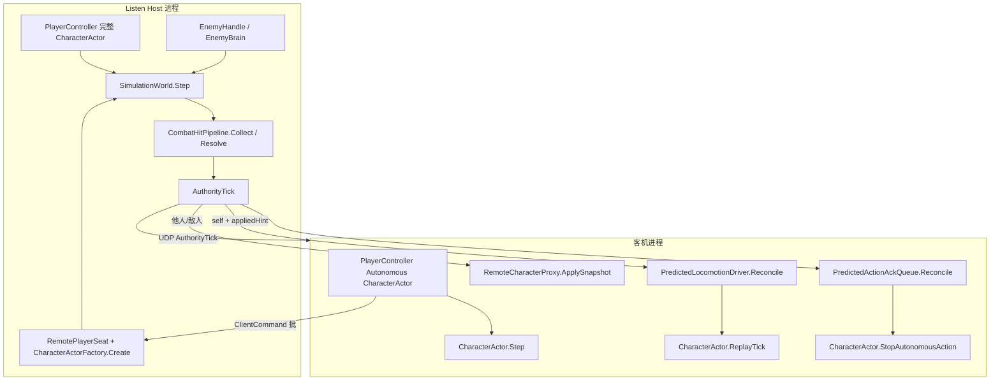
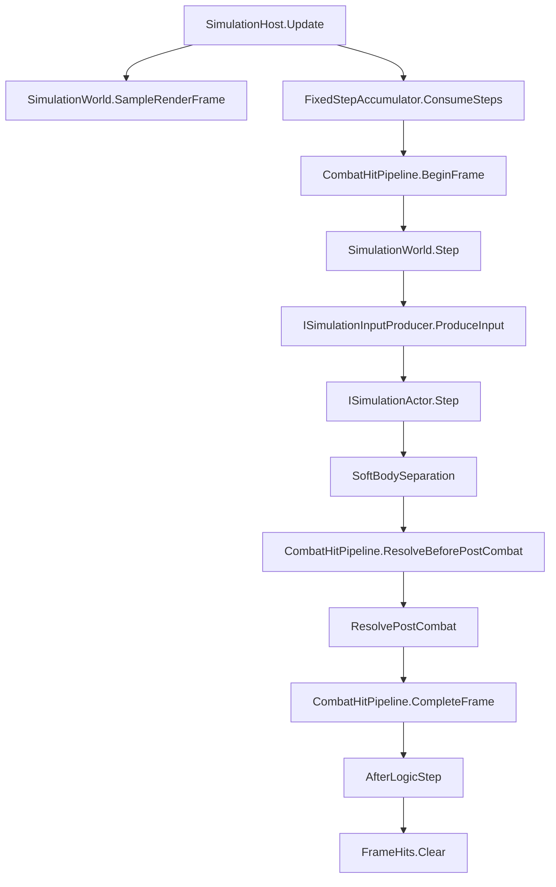
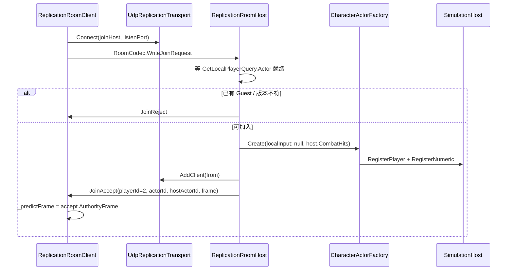
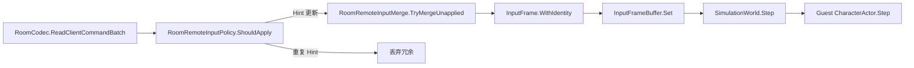
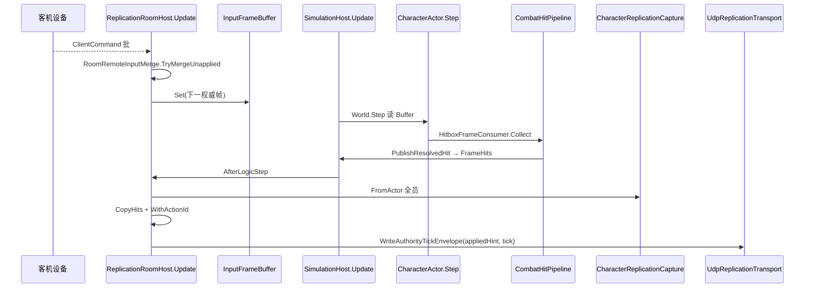
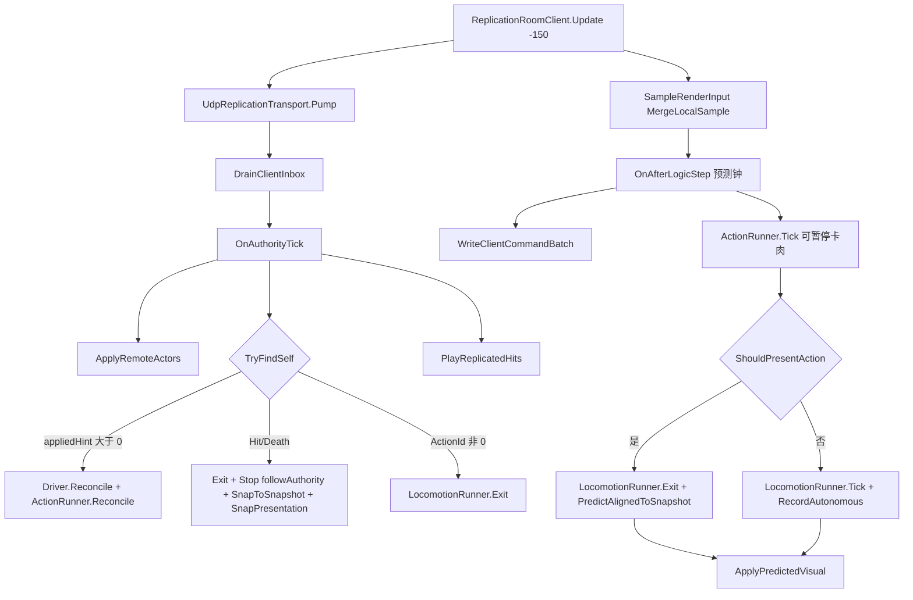
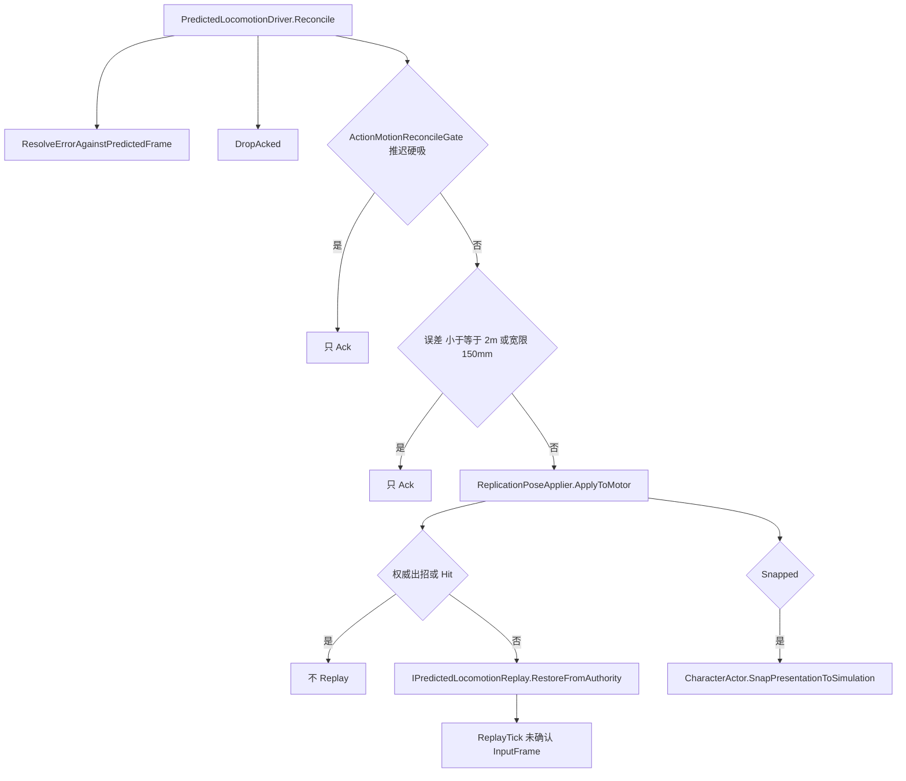
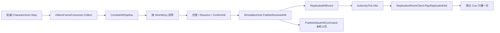

# ACTGame 网络同步方案（实现说明）

> 撰写：2026-08-15  
> 角色：**已落地实现的阅读入口**（对照代码，不是下一阶段实施计划）  
> 方案真源（设计决策 / 阶段勾选）：  
> - 房间、权威 World、命中契约：[`../2026.8.13/TEAM_PVE_NARAKA_STYLE_STATE_SYNC_PLAN.md`](../2026.8.13/TEAM_PVE_NARAKA_STYLE_STATE_SYNC_PLAN.md)（NS0～NS5 已关闭）  
> - 客机本机预测纠偏合同：[`UE_ALIGNED_CLIENT_PREDICTION_PLAN.md`](./UE_ALIGNED_CLIENT_PREDICTION_PLAN.md)  
> - 客机装配真源：[`UNIFIED_CHARACTER_ACTOR_SEAT_PLAN.md`](./UNIFIED_CHARACTER_ACTOR_SEAT_PLAN.md)（同一 `CharacterActor` + `ReplicationSeat`）  
> 约定：`.cursor/skills/actgame-architecture/CONVENTIONS.md`「复制契约 / 预测 / 服务器 / 权威进程」  
> 外部对照（学 Handler/房间壳，不学战斗权威）：[`D:/Projects/DemoServer/docs/ARCHITECTURE.md`](../../../DemoServer/docs/ARCHITECTURE.md)  
> 本文以 `Assets/Scripts/**` 为准；文档与代码冲突时改文档。

---

## 0. 一句话

组队 PVE 是 **Listen Host 权威状态同步**：玩家只上行量化 `InputFrame`，权威进程独跑现有 `SimulationWorld`（60Hz），下行 `AuthorityTick`（角色快照 + 命中边沿）。客机本机用 **同一份 `CharacterActor`（`ReplicationSeat.Autonomous`）** 先演走跑和招式，权威只纠正结果。**命中、HP、硬直只认 Host 的 `CombatHitPipeline`。** 禁止全端同构重演（锁步 L5），禁止客户端上报伤害 / 坐标 / 招式名。

单机一人进关也是 Listen Host，不另开 Offline 模拟核。

---

## 1. 为什么是这套，而不是锁步

| 候选 | 本项目结论 |
|------|------------|
| 锁步 L5：广播全员输入，各端 `SimulationWorld.Step` 同构 | **已取消。** 2～4 人打怪需要晚加入、掉线、AI 只在权威端跑；全端 bit-identical 回滚成本高 |
| 永劫「攻击方客户端盒、防守方被拉回」 | **P0 不做。** 现网命中是 Host 逻辑盒；终态另开 `NS-PVP`（攻击方申报几何、权威入账），现在禁止分叉两套盒 |
| MMO 式技能名 / 伤害 RPC | **禁止。** 对不齐 `ActionSim` 整数帧与 Cancel |
| 本方案 | Host/DS 跑 Sim；上行命令；下行状态；本机预测表现 |

工业界对照（只学角色分工，不搬框架）：

| 对照 | 本项目对应 |
|------|------------|
| Source `CUserCmd` + `game/shared` | `InputFrame` + `ACTGame.Simulation` |
| 守望 command frame + 专用服模拟 | 60Hz `SimulationWorld.Step` + Snapshot |
| UE `ROLE_Authority` / `AutonomousProxy` / `SimulatedProxy` | Host `CharacterActor` / 客机 Autonomous `CharacterActor` / `RemoteCharacterProxy` |
| Unity Netcode Entities Ghost | 拥有者预测、他人插值；命令只从 Owner 来 |
| Mirror / NGO `ServerRpc` | 只适合元数据；禁止每帧近战 Rpc |

---

## 2. 三种座位（不许 `if (isClient)` 当网关）

差异用**装配**，不在 State 里写网角色分支。

| 座位 | 谁创建 | 跑什么 | 不跑什么 |
|------|--------|--------|----------|
| **Authority** | Listen Host 的本机玩家、远端玩家在 Host 上的 `RemotePlayerSeat`、全部敌人 | 完整 `CharacterActor.Step` + `HitboxFrameConsumer.Collect` + Numeric | 客机设备采样（远端玩家吃收到的 `InputFrame`） |
| **Autonomous（客机本机）** | `PlayerController` → `CharacterActorFactory.Create(seat: Autonomous)` | 同一 `CharacterActor.Step`（无 Hitbox、有 WorldQuery、不进 World） | Collect、`SimulationWorld.Register` |
| **Simulated（他人 / 敌人）** | `RemoteCharacterProxyFactory.Create` | `RemoteCharacterProxy.ApplySnapshot`：位姿插值、Clip Seek、过点 VFX/SFX | `ActionSim.Step`、BT、Hitbox Collect |

Listen Host 本地玩家：**不预测**，直接吃权威（0 RTT）。`ILocalPlayer.IsLocalPredicted` 在 Host 上恒为 `false`，客机座位为 `true`。



---

## 3. 进程与启动

### 3.1 场景入口

`CombatWorldController`（`DefaultExecutionOrder(-200)`）是房间角色与 `SimulationHost` 的生命周期锚点。

- `Role == ListenHost` → 挂 `ReplicationRoomHost`，`IsAuthority == true`
- `Role == Client` → 挂 `ReplicationRoomClient`，`IsAuthority == false`
- 单机默认 Listen Host，**不走旧旁路**

Editor 启动覆盖（不硬引用 ParrelSync 程序集）：

1. 反射 `ParrelSync.ClonesManager.IsClone` 为真 → 强制 Client，连 `127.0.0.1:7777`
2. 否则读 `ACTGame/Room` 菜单写入的 EditorPrefs
3. 再否则用场景 Inspector 默认值

### 3.2 客机建 Autonomous Actor，不进 World

`PlayerController` 发现 `!combatWorld.IsAuthority` 时走 `BuildClientSeat`：`CharacterActorFactory.Create(seat: Autonomous)`。同一类实例，**不**注册 `HitboxFrameConsumer`，**不** `RegisterPlayer`。相机读 `ILocalPlayer.Actor`。

敌人只在权威端刷：`EnemySpawnController.Start` 在 `!IsAuthority` 时直接 return。客机看到的怪是 `RemoteCharacterProxy`。

### 3.3 客机仍有一只「空」SimulationHost

`CombatWorldController.Awake` 两端都会 `EnsureSimulationHost`。客机 World 里通常没有玩家/敌人 Actor，但 `SimulationHost.Update` 仍按 60Hz 推进并触发 `AfterLogicStep`。客机用这个事件当**本机预测钟**，不是第二份权威战斗。

### 3.4 执行序（同一渲染帧）

| Order | 组件 | Host | Client |
|------:|------|------|--------|
| -200 | `CombatWorldController` | 角色 / Host 引用 | 角色 / Client 引用 |
| -150 | `ReplicationRoomHost` / `Client` | `Pump` → 灌入客机命令到 `CurrentFrame+1` | `Pump` → 收 Tick 纠偏；`MergeLocalSample` |
| -100 | `SimulationHost` | `World.Step` → 命中结算 → `AfterLogicStep` | 空 World 步进 → `AfterLogicStep`（预测钟） |
| 事件 | `AfterLogicStep` | Host 打包 `AuthorityTick` 下行 | Client 预测一帧并上行命令批 |
| LateUpdate | `SimulationHost` / Client | 权威表现插值 | 本机 `CharacterActor.Render` + 他人 Proxy `Render(alpha)` |

**必须先灌输入再 Step。** Host 在 -150 把客机命令写入 `InputFrameBuffer`，-100 的 `SimulationWorld.Step` 才能读到下一权威帧。

---

## 4. 权威时钟（两端共用同一份核）

`SimulationHost.Update` 是唯一 Unity 时间入口：accumulator 把渲染时间换成最多 `MaxFrameCatchUp` 次 60Hz 步。每一步顺序固定：

```text
CombatHitPipeline.BeginFrame(CurrentFrame + 1)
SimulationWorld.Step
  ISimulationInputProducer.ProduceInput   // 敌人 Brain 写 Desire / 空 InputFrame
  按 SimActorId 升序 CharacterActor.Step
  SoftBodySeparation                      // 只在权威 World；客机预测电机不进
CombatHitPipeline.ResolveBeforePostCombat
SimulationWorld.ResolvePostCombat
CombatHitPipeline.CompleteFrame
CommitEnemyLifecycle
SendEvent(SimulationLogicStepEvent)
AfterLogicStep(CurrentFrame)
清空 FrameHits
```

`SimulationWorld.Step` 里每个 Actor 只 `ResolveLocal` 一次输入，禁止递归 Step。缺帧走 `InputFrame.CarryForward`：延续 Move / Held / Yaw，**清掉 Pressed / Released，不伪造边沿**。



---

## 5. 传输：只传字节

契约在 `IReplicationTransport`。实现可换，**禁止**把 UDP 引用推进 `ACTGame.Simulation`。

| 实现 | 用途 |
|------|------|
| `LoopbackReplicationTransport` | 同进程队列，可设 `LatencyMs`；仅单测。Host 同机预览已删 |
| `UdpReplicationTransport` | NS5 真房间；Host `Bind`，Client `Connect`；非阻塞收包 |

UDP 实现要点：

- Host `AddClient(IPEndPoint)` 后，`SendAuthorityToClients` 广播已登记端点
- `JoinAccept` 在 `AddClient` 之前用 `SendTo` 直发
- `Pump` 把到期数据放进权威 / 客机队列；业务侧再 `TryDequeue*`
- **不可靠**：不重传 Tick。靠输入冗余和「漏 Tick 时跨帧补 VFX」兜底，不能保证 0 丢包

房间信封与战斗正文分层：

```text
UDP 载荷
  RoomCodec 信封：version + RoomMessageKind + body
    Join / Heartbeat / Kick / ClientCommand 批 / AuthorityTick 信封
      ClientCommand 正文 = count + 若干 ReplicationCodec.WriteClientCommand
      AuthorityTick 正文 = appliedClientFrameHint(int64) + ReplicationCodec.WriteAuthorityTick
```

`RoomCodec` **不改** `ReplicationCodec` 的 Tick / Command 布局。日后 Dedicated 只换传输与进程布局，不换 Snapshot 字段。

---

## 6. 房间协议

常量在 `ReplicationRoomProtocol`：

| 常量 | 值 | 含义 |
|------|----|------|
| `RoomCodecVersion` | 1 | 信封版本 |
| `ProtocolVersion` | 1 | Join 握手逻辑协议号 |
| `MaxPlayers` | 2 | Host + 一名客机 |
| `IdleTimeoutMs` | 10000 | 无包则剔除 / 客机认 Host 掉线 |
| `InputRedundancyCount` | 3 | 每包重发最近 3 条命令 |
| `DefaultPort` | 7777 | 默认监听 |
| `HeartbeatIntervalMs` | 500 | 客机心跳 |
| `LateInputWindowFrames` | 8 | **已声明、当前代码未使用**；过滤只比 `FrameHint`，不比 Host 逻辑帧 |

### 6.1 消息

| `RoomMessageKind` | 方向 | 正文 |
|-------------------|------|------|
| `JoinRequest` | C→H | `contentVersion` + `protocolVersion` |
| `JoinAccept` | H→C | `assignedPlayerId` / `assignedActorId` / `hostActorId` / `contentVersion` / `authorityFrame` |
| `JoinReject` | H→C | `RoomRejectReason`（满员 / 版本不符） |
| `Heartbeat` | 双向 | `SendTimeMs` + `EchoTimeMs`；Host 原样回显 SendTime，客机算 RTT |
| `ClientCommand` | C→H | 命令批（1～8 条已编码 `ClientCommand`） |
| `AuthorityTick` | H→C | `appliedClientFrameHint` + Tick 字节 |
| `Kick` | H→C | `RoomKickReason`（空闲 / Host 结束） |

### 6.2 入房



Host 侧客机 Actor 出生在本机玩家右侧 +2m，挂 `RemotePlayerSeat`（`IsLocalPredicted == false`），完整 Hurtbox / Reaction / 花名册登记。`localInput: null`：这名 Actor 的输入只来自 `InputFrameBuffer.Set`，不读设备。

客机 `OnJoinAccept` 后才开始预测与上行。`AssignedActorId` 是 Host World 里那名 `RemotePlayerSeat` 的 `SimActorId`，两端用它认「我」。

---

## 7. 上行：命令，不是世界

### 7.1 `InputFrame`（等价 Source `CUserCmd`）

固定布局，禁止 float / 字符串招式名：

| 字段 | 类型 | 说明 |
|------|------|------|
| `Frame` | `long` | 逻辑帧号（客机侧是本机预测序号） |
| `ActorId` | `SimActorId` | 输入所属 Actor |
| `MoveX` / `MoveY` | `sbyte` | [-127, 127] |
| `ButtonsPressed` / `Held` / `Released` | `ulong` | 稳定按钮 bitset |
| `MoveReferenceYawQuantized` | `ushort` | 0.1 度，[0, 3599]；相机相对移动只读这个 |

**不进 InputFrame：** Look 轴、CameraLock、Lean、世界坐标、HP、招式名。Look 由 `PlayerController.LookInput` 直接给相机；CameraLock 是本地表现。

### 7.2 `ClientCommand`

```text
FrameHint        客机认为对应的命令序号；权威不当成 Host.CurrentFrame
SenderPlayerId   房间内玩家编号（Host 本地不是 2；客机 JoinAccept 为 2）
Input            上述 InputFrame
```

禁止带 HP / 命中 / 世界坐标 / ActionName。

### 7.3 客机如何采到边沿

高刷新时两个逻辑步之间的 `WasPressed` 会丢。客机拆成两段：

1. **每个渲染帧** `SampleRenderInput`：`InputSampler.Sample(_predictFrame + 1)` → `InputFrameBuffer.MergeLocalSample`（边沿 OR，轴与 Held 取最新）
2. **每个逻辑步** `OnAfterLogicStep`：`ResolveLocal` 取出合并结果，`_predictFrame++`，打成 `ClientCommand`，`RememberCommand` 保留最近 3 条，`WriteClientCommandBatch` 上行

### 7.4 Host 如何灌入（FrameHint ≠ 权威帧）

`RoomRemoteInputPolicy.ShouldApply`：**只接受比已应用更大的 Hint**。同等 Hint 是 UDP 冗余重发，再写一次会把已经结算的 Attack 边沿打到下一帧。

**禁止**用 `Host.CurrentFrame` 和 `FrameHint` 比较。客机序号和 Host 逻辑帧从入房起就不是同一条数轴（RTT、丢包、两端 accumulator 都会错开）。

`RoomRemoteInputMerge.TryMergeUnapplied`：

1. 按 `FrameHint` 升序
2. 跳过 `<= lastAppliedHint`
3. `WithIdentity(targetFrame, guestActorId)` 把身份改成 **下一权威帧**
4. 多条未应用命令 `MergeSample`：边沿 OR，轴 / Held / Yaw 取最新
5. 若该权威帧已有样本，再与现有帧合并
6. `InputFrameBuffer.Set`；记下 `LastAppliedFrameHint` 与 `AppliedHintThisTick`

`targetFrame = SimulationHost.CurrentFrame + 1`，正好赶上即将 `Step` 的那一帧。

无新命令时 `AppliedHintThisTick` 保持 0。下行 Tick 仍发（CarryForward 位姿），但 **`appliedClientFrameHint = 0`**，客机不得用旧预测位姿对当前权威做纠偏。



---

## 8. 下行：`AuthorityTick` 与快照最小集

### 8.1 Tick

`AuthorityTick` 构造时按 `SimActorId` **升序排序**，保证两端遍历稳定。

| 字段 | 含义 |
|------|------|
| `AuthorityFrame` | Host `SimulationWorld.CurrentFrame` |
| `Actors[]` | 全员快照（Host 玩家 + Guest + 敌人） |
| `Hits[]` | 本帧 `ReplicatedHitEvent` |
| `Spawns` / `Despawns` | 契约已有；当前房间打包主要靠「本 Tick 还在的 Actors」扫幽灵 |

房间信封额外带 `appliedClientFrameHint`：本步真正灌入 Guest 命令时为最新 Hint，否则 0。

### 8.2 `ActorReplicationSnapshot`

从权威 `CharacterActor` 经 `CharacterReplicationCapture.FromActor` → `ReplicationSnapshotBuilder.FromAuthority` 填写。

| 字段 | 来源 | 备注 |
|------|------|------|
| `ActorId` / `TeamId` / `Kind` | Actor | `Player` 或 `Enemy` |
| `PosX/Z/YMm` / `FacingMilliDeg` | `CharacterMotorSim` | 毫米 / 毫度 |
| `MoveVxMm` / `MoveVzMm` | 当帧 wish 单位方向×1000 | 供幽灵调试黄箭，与位姿同一 Tick 延迟 |
| `LocomotionPhase` / `Gait` / `Cardinal` | 空闲时 AnimationKey + 内层机 | 有招时相位无意义 |
| `LocomotionNormalizedMilli` | `NormalizedTime × 1000` | 循环片可 >1000；幽灵 Seek |
| `ActionId` | `ActionReplicationCatalog.GetOrAdd` | 0 = 无活动招 |
| `GraphNodeId` | `ActionSimSnapshot.NodeId` | |
| `ActionFrame` / `FreezeFrames` | `ActionSim` | 卡肉帧 |
| `SelectedTargetId` | `TargetingSnapshot` | 契约上仅 Owner 有意义 |
| `HealthMilli` | Numeric Health | |
| `FlagsPacked` | P0 为 0 | |
| `VitalityEdge` | `CharacterVitality.ReplicationEdge` | 当帧 Hit / Death，防只靠 HP 差值漏播 |

**明确不进快照：** CameraLock、Look、Lean、Impulse、表现插值锚点。Lean 只在本机 Actor 倾身模型推进。

本机预测表现会用 `WithMotorPose` / `WithAction` / `WithLocomotion` 在**本地副本**上改字段再 `ApplySnapshot`，不回写权威 Motor。

### 8.3 编解码

`ReplicationCodec` 小端，首字节协议版本 `1`。版本不匹配抛错。`InputFrame`、Snapshot、`ReplicatedHitEvent`、spawn/despawn Id 数组都在同一套 Writer/Reader 里。房间信封是另一套版本号，互不混用。

---

## 9. ActionId 目录（两端必须同名同 Id）

`ActionReplicationCatalog` 用 **资产名稳定哈希**，不按注册顺序发 Id。`Prefill(CharacterConfig)` 必须收录：

1. Graph 节点默认 `node.Action`
2. `node.VariantResolver.CollectActions`（六向闪避等）
3. `Reactions.CollectActions`（受击 / 死亡）

只预填 `node.Action` 时，客机侧闪 / 后闪 `TryGet` 失败，表现为**有位移没有 Clip**。

Host 在入房与每步打包前 Prefill 玩家 + 场景 `EnemySpawnController` 收集到的配置。客机在 `Connect` 后对本机 `CharacterConfig` 与敌人配置做同样 Prefill。同名资产跨实例映射到同一 Id；哈希碰撞则线性探测，两端因按名称排序，探测顺序一致。

---

## 10. Host 一帧（权威）



打包细节：

- 快照顺序：本机玩家 → Guest → `CopyEnemyControllers` 里的敌人
- 命中：`SimulationHost.PublishResolvedHit` 在 Pipeline 回调里写入 `FrameHits`（完美闪避吞伤不进复制）。Host 打包时用攻击者当帧快照的 `ActionId` 盖上，供客机还原刀光 Feedback
- `AfterLogicStep` 之后 Host **立刻清空** `FrameHits`，必须在回调里拷走
- 无 Guest 或 Guest 尚未 `RegisterPlayer` 成功时，不发 Tick（一人 Listen 只监听）

踢人：`RoomIdleTracker` 10s 无包 → `Kick` + `Unregister` + `Destroy(RemotePlayerSeat)`。Host 自己继续玩。

---

## 11. 客机一帧（预测 + 跟状态）



### 11.1 他人 / 敌人

`ApplyRemoteActors` 跳过 `AssignedActorId`。未见过的 Id 用 `RemoteCharacterProxyFactory.Create` 建幽灵（不注册 World、不挂 Hurtbox）。创建时 `TargetSystem.Register(proxy)`，销毁时 Unregister，供本机 Targeting / CameraLock。本 Tick 消失的 Id 销毁。玩家模型用本机 `CharacterConfig`；敌人暂用刷怪列表**第一条**配置（多种敌人时会穿错模，已知限制）。

`ApplySnapshot`：写 Motor、同步根、有招则切段 Play+Seek，并按 `previousFrame → currentFrame` 只派发 VFX/SFX。**禁止派发 Hitbox。** `FreezeFrames > 0` 时动画 Speed=0。生命边沿 Hit/Death 或同一招动作帧回绕 → `ShouldForceActionRestart` 硬切重播。

走跑循环片：同键只 `Tick`，禁止每 Tick Seek。过渡相位（Start/Stop/Pivot）才按 `LocomotionNormalizedMilli` Seek。硬切规则在 `ReplicationPresentationAlign`。

### 11.2 本机预测体

`PlayerController.BuildClientSeat` 在入房前就 `CharacterActorFactory.Create(seat: Autonomous)`。第一份 self 快照到达后 `EnsurePredictedDriver`：

- 绑定 `SimActorId` + 对齐 Motor 位姿
- `PredictedLocomotionDriver` 只记账与纠偏
- 相机跟 `ILocalPlayer.Actor.PresentationRoot`

不另建 Proxy，不对自角色 `ApplySnapshot` Seek。

---

## 12. 走跑预测与纠偏

对齐 UE AutonomousProxy：本机跑与 Host **同一套**内层机，权威只纠正结果并重放未确认输入。已删除 `PredictedLocomotionVisual` / `ResolveSelfKey` / `TickPredictedGait`。

### 12.1 预测步

`ReplicationRoomClient.AfterLogicStep` 调本机 `CharacterActor.Step` + `ResolvePostCombat`（不进 `SimulationWorld`）。

走跑由顶层 `LocomotionState` → 同一套 `LocomotionStateMachine`。出招由 `CharacterActionDriver` + `CharacterActionPresentationBridge`（Clip / VFX / 烘焙位移 / Adhesion / Relocate）。Autonomous 注入 `ActionMotionWorldQuery`，目标 Pose 读只读 Proxy，不 Collect。

卡肉由 `PredictedHitStopConsumer` 在本机 Hitbox 与只读 Proxy 重叠时 `RequestHitStop`。禁止用延迟权威 `FreezeFrames` 再 `holdActionClock`。

`PredictedLocomotionDriver.RecordAutonomous`（`skipWishReplay=true`，纠偏走 Actor 的 `ReplayTick`）。

闪避结束回走跑仍走 Host 同一套 `ActionState.Exit` → `SprintAfterDodge`，禁止另写 Runner `Enter(default)`。

### 12.2 纠偏

`Reconcile(appliedHint, self, actor)`：

1. 用 pending 里 **该 Hint 帧记下的预测位姿** 和权威位姿算误差（不是和当前墙钟位姿比）
2. `DropAcked` 丢掉 `<= appliedHint` 的 SavedMove
3. 带 Runner 时默认硬吸阈 **`AutonomousHardSnapMm = 2000`（2m）**。禁止房间再传 50mm：内层机与 Host 常态偏差就会每包 Restore+Replay+表现硬切，走跑卡顿
4. 刚吸附后 8 包内误差 ≤ 150mm 只 Ack（`SnapGraceMaxErrorMm`）
5. 超阈：`ReplicationPoseApplier.ApplyToMotor` + `RestoreFromAuthority`（`LocomotionSavedState.FromAuthority` 恢复相位 / 步态 / cardinal / 归一化时间）+ 对后续 pending `ReplayTick`
6. 权威正在出招或 Hit/Death：只吸 Pose，**不** Runner 重放
7. **穿敌吸附 / SoftBodySuppress 窗，或权威 `FreezeFrames > 0`**：`ActionMotionReconcileGate` 把硬吸阈提到 `int.MaxValue`，只 Ack。否则本机已吸到敌后、延迟快照还停在敌前，2m 会把人拽回
8. 仅 `Snapped` 或权威 Hit/Death 才 `SnapPresentationToSimulation`。出招 / 闪避禁止每包硬切表现，否则插值被掐死、位移和相机一起跳



---

## 13. 出招预测与 Clip / VFX 所有权

客机本机跑完整 `ActionSim` + 表现桥：Graph 起手、Cancel 窗、连招、推帧、Clip/VFX。挂 `PredictedHitStopConsumer`（只卡肉），没有 `HitboxFrameConsumer`，事件不会进 `CombatHitPipeline`。`GameplayIntentProducer` 绑真实 `CharacterStateMachine`。

### 13.1 预测步

`CharacterActor.Step`（Autonomous）：

- Driver → 起手 / 移动取消 / 高优打断 → `Step` + `ResolvePostCombat` + `ApplyStep`（烘焙位移 + Adhesion / Relocate + 预测卡肉）
- 本机 `ActionSim.freezeFrames` 由预测重叠写入；权威 Freeze 不再拖本机时钟
- 每帧 `PredictedActionAckQueue.Record(frame, actionId)`

真客机受击走权威边沿 `EnterHit`。已删除 `SetAutonomousPredictMode`（仅同机预览用）。

### 13.2 Ack

`PredictedActionAckQueue.Reconcile(authorityFrame, snapshot)`：

| 情况 | 结果 |
|------|------|
| 权威 Vitality Hit/Death | `Cancelled`，跟受击招 |
| 该帧预测有招且权威 `ActionId==0` | `Cancelled`（未起手或已结束且本机仍停在该招） |
| 该帧预测招 ≠ 权威招，且权威招从未在更早 pending 出现 | `Cancelled`（变体分叉，如朝向不同选了另一闪） |
| 该帧预测已是下一招，权威仍是本机刚打过的上一招 | **只 Ack，不 Cancel**（连招超前） |
| 同招 | 只 Ack，**禁止 Seek 回旧帧** |

`Cancelled` 时 `CharacterActor.StopAutonomousAction()`：停本地招并回走跑。权威 Hit/Death 另走 `EnterHit` / `EnterDeath`。

### 13.3 呈现规则（避免特效重播）

本机 Clip/VFX 由 `CharacterActionPresentationBridge` 消费 `ActionSim` 事件，**禁止**对自角色再 `ApplySnapshot` Seek。自然结束后立刻回走跑；延迟快照上的 `ActionId` 不得重派刀光。

| 条件 | 播什么 |
|------|--------|
| 本机 `ActionSim.IsActive` | Actor 自己的招 |
| 权威 Hit/Death | `EnterHit` / `EnterDeath` |
| Ack 取消 | `StopAutonomousAction` 回走跑 |
| 本机自然结束 | 立刻走跑，忽略延迟 `snapshot.ActionId` |

Listen Host 本地**不**跑这套出招预测。

---

## 14. 命中：只在权威入账



规则：

- `rg "hitPipeline.Collect"` / `HitboxFrameConsumer` 只挂权威工厂
- 客机刀光是 Timeline 表现，不改 Numeric / Vitality
- 下行 `ReplicatedHitEvent`：`SimHitKey` 去重 + 毫米落点 + `ActionId`
- 客机 `_playedHits` 按 Key 只播一次
- 快照 `VitalityEdge` 驱动受击 / 死亡 Clip 硬切
- 边沿由 `CharacterVitality` 记一帧，`CharacterActor.Step` 开头清空，所以必须在当步 `AfterLogicStep` 捕获

**P0 过渡：** Host 独 Collect。产品终态（未开 `NS-PVP`）是同一套几何：攻击方座位申报、权威校验入账。现在禁止 `if (PVE)` 另开盒。

---

## 15. 本机表现（不进复制）

| 项 | 行为 |
|----|------|
| 相机跟谁 | 客机跟预测体 `PresentationRoot`；空座位 `transform` 不转，A/D 无法绕圈 |
| 移动意图 | `ILocalPlayer.HasMoveIntent` 读设备采样；客机 `Input` 恒空，禁止用它判断 |
| 出招中相机 | `IsPresentingAction` 时暂停 L-DIR5 跟朝向，避免连闪 yaw 追权威朝向台阶 |
| 插值 | `CharacterPresentationBridge` 在逻辑根与表现根之间按 `InterpolationAlpha` 插；Render 禁止回写碰撞 / 命中 |
| CameraLock | 纯本地。客机无权威 `Actor` 时当前不能锁敌（已知限制） |
| HUD | F3 Room 行：角色 / 状态 / authorityFrame / RTT / 生命 |

---

## 16. 同机预览（已删除）

Host 不再生成右侧 +2m 延迟幽灵或左侧 -2m 预测体。`RemoteGhostViewController`、`PredictedClientPreviewController` 与 `CombatWorldController` 的 preview 开关已删。

验收走 ParrelSync 真客机：UDP + `ReplicationRoomClient`。不要把已删除的 Loopback 预览延迟当成房间 RTT。

---

## 17. 明确不进网、明确未做

### 17.1 不进复制 / 不上行

- CameraLock、Look、Lean、镜头 Impulse
- 客户端世界坐标、HP、伤害、招式名字符串
- 客机 `ActionSim` 的命中事件
- SoftBody 分离（只在权威 World 帧末）
- 敌人 BT（只在 Host `EnemyBrain`）

### 17.2 当前未做（代码无实现）

| 项 | 状态 |
|----|------|
| Dedicated 独立进程 | 无。权威进程写法已定：同一份 `ACTGame.Simulation`，只换传输 |
| 匹配 / 排位 / Host 迁移 / 晚加入补全状态 | 无。NS5 只做最小 2 人房间 |
| `NS-PVP` 攻击方申报命中 | 未开 |
| Tick 可靠重传 / 增量快照 / 相关性裁剪 | 无 |
| `AuthorityTick.Spawns/Despawns` 驱动生成 | 字段在 Codec 里；房间主要靠 Actors 列表扫幽灵 |
| `LateInputWindowFrames` | 常量存在，过滤未使用 |
| 客机 CameraLock | Proxy 只读进 TargetSystem；范围内自动选中后可开 |
| 多种敌人正确模型 | 客机暂用第一条刷怪配置 |
| 客机出招 Relocate / Adhesion | 读只读 Proxy 逻辑 Pose；敌人位姿仍有 Tick 延迟 |
| 锁步 L5 / 全世界回滚 | 已废止，不得双轨 |

---

## 18. 禁区（实现检查）

每次改联网相关代码都应能用检索对上：

- 新战斗规则写在 `SimulationWorld` / Actor / Pipeline，不写在房间 Handler
- 新上行字段只能进 `InputFrame` / `ClientCommand`
- `HitboxFrameConsumer` / `hitPipeline.Collect` 仅 `ReplicationSeat.Authority`
- 无 `AutonomousLocomotionRunner` / `AutonomousActionRunner` / `CreateAutonomous`
- `ACTGame.Simulation` 无 Unity、无传输实现引用
- 无 `LockstepNetworkHost` 与 `StateSyncHost` 双主路径
- 无 `PredictedActionDriver` / `PredictedLocomotionVisual`
- 无 `RemoteGhostViewController` / `PredictedClientPreviewController` / `SetAutonomousPredictMode`
- 玩法禁止 `FindObjectOfType<PlayerController>`（仅 Editor Gizmo 可留）

---

## 19. 关键类型与文件

### 契约（无 Unity）

| 类型 | 路径 |
|------|------|
| `InputFrame` | `Assets/Scripts/Domain/Simulation/Input/InputFrame.cs` |
| `ActorReplicationSnapshot` / `AuthorityTick` / `ClientCommand` | `Assets/Scripts/Domain/Simulation/Replication/` |
| `ReplicationCodec` / `RoomCodec` | 同上 |
| `RoomRemoteInputMerge` / `RoomRemoteInputPolicy` | 同上 |
| `ReplicatedHitEvent` / `VitalityReplicationEdge` | 同上 |
| `PredictedLocomotionDriver` / `PredictedActionAckQueue` | `Assets/Scripts/Domain/Simulation/Prediction/` |
| `IReplicationTransport` / `Udp*` / `Loopback*` | `Assets/Scripts/Domain/Net/` |

### 角色装配（有 Unity）

| 类型 | 路径 |
|------|------|
| `CharacterReplicationCapture` / `ActionReplicationCatalog` | `Assets/Scripts/Domain/Character/Replication/` |
| `RemoteCharacterProxy` / `RemoteCharacterProxyFactory` | 同上 |
| `ReplicationSeat` | 同上 |
| `LocomotionSavedState` / `ReplicationPresentationAlign` | 同上 |
| `ReplicationRoomHost` / `ReplicationRoomClient` | `Assets/Scripts/App/Controllers/Gameplay/` |
| `RemotePlayerSeat` / `ReplicationRoomLaunchSettings` | 同上 |
| `CombatWorldController` | `Assets/Scripts/App/Controllers/Combat/` |
| `ReplicationRoomMenu` | `Assets/Scripts/Editor/Net/` |

### 单测入口

- `ActorReplicationSnapshotTests` / `LoopbackReplicationTransportTests` / `UdpReplicationTransportTests`
- `RoomCodecTests` / `RoomIdleTrackerTests`
- `PredictedLocomotionReconcileTests` / `PredictedActionReconcileTests`
- `RemoteCharacterProxyTests` / `ActionReplicationCatalogTests` / `ReplicationPresentationAlignTests`

---

## 20. 联调怎么开

1. 工程菜单 `ACTGame/Room/Use Listen Host`（或场景默认 Host）
2. ParrelSync 开克隆（自动 Client）或菜单 `Use Client` 再开第二编辑器
3. Host Play → 克隆 Play；克隆应看到 Join 成功、本机预测走路、Host 玩家与敌人幽灵
4. F3 看 Room 行：Host `ListenHost / ClientJoined`，Client `Client / Joined` 与 RTT
5. 一人 Play 就是 Listen Host，行为应与改联网前单机一致（本机不预测）

无需新建 Prefab / Input Actions。客机 Autonomous Actor 读现有 `CharacterConfig`。Catalog 必须能看到 Graph 变体，否则侧闪没片子。

---

## 21. 变更日志

| 日期 | 说明 |
|------|------|
| 2026-08-15 | 初版：按 NS0～NS5 + UE1～UE4 已落地代码整理网络同步说明；与方案文档分离，本文对实现负责 |
| 2026-08-15 | 删除 Host 同机预览（±2m Ghost / Predicted Client）；Loopback 仅留单测 |
