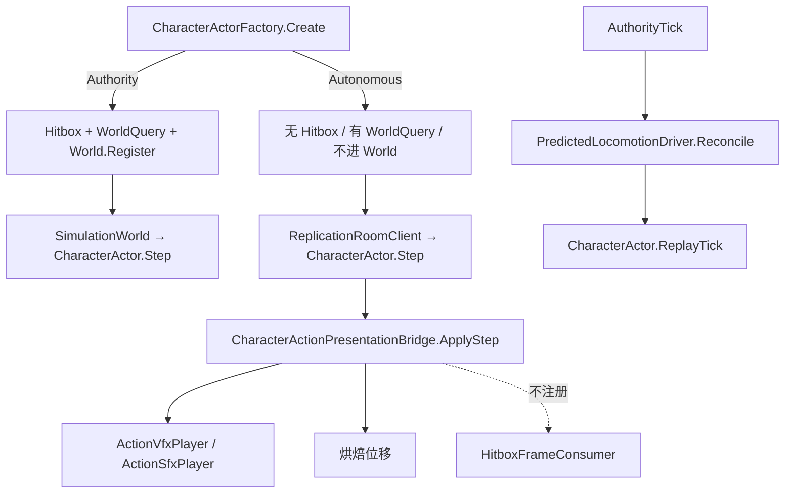

# 统一 CharacterActor 座位 — 客机同一类实例

> 制定：2026-08-15  
> 角色：**客机本机装配的结构真源（先文档，后实现）**；房间协议、Host 权威 World、命中 P0 仍以 [`TEAM_PVE_NARAKA_STYLE_STATE_SYNC_PLAN.md`](../2026.8.13/TEAM_PVE_NARAKA_STYLE_STATE_SYNC_PLAN.md) 与 [`NETWORK_SYNC.md`](./NETWORK_SYNC.md) 为准  
> 相关：  
> - 走跑纠偏合同（仍有效）：[`UE_ALIGNED_CLIENT_PREDICTION_PLAN.md`](./UE_ALIGNED_CLIENT_PREDICTION_PLAN.md)  
> - 装配链：`ReplicationSeat → CharacterActorFactory.Create → CharacterActor.Step`（客机不进 `SimulationWorld`）

---

## 0. 一句话

客机本机与 Host **同一份 `CharacterActor`**，差异只在工厂按 `ReplicationSeat` 装配能力图（Autonomous 不挂 Collect、不进 World；Adhesion/Relocate 读只读 Proxy）；禁止 `if (isClient)` 再开 Runner/Proxy 第二套表现核，禁止客机 `CombatHitPipeline.Collect`，禁止锁步全世界回滚。

---

## 1. 问题与动机

### 1.1 现状基线

```text
Host
  PlayerController → CharacterActorFactory.Create（完整）
    → SimulationWorld.Register → CharacterActor.Step
    → HitboxFrameConsumer → CombatHitPipeline.Collect

客机
  PlayerController.BuildClientSeat → 只 InputReader，Actor == null
  ReplicationRoomClient.EnsurePredictedView
    → RemoteCharacterProxyFactory.CreateAutonomous
         RemoteCharacterProxy + AutonomousLocomotionRunner + AutonomousActionRunner
    → AfterLogicStep：Runner.Tick / 只读 ActionSim
    → ApplyPredictedVisual：Proxy.ApplySnapshot 再 Seek/派 VFX
  CameraLock 读 ILocalPlayer.Actor → 永远开不了
```

| 点 | 现状 |
|----|------|
| 本机类 | 客机不是 `CharacterActor`，是 Proxy + 两套 Runner |
| 表现 | Clip/VFX 经 Proxy 快照 Seek，与 Host `CharacterActionPresentationBridge` 不是同一条 |
| 出招位移 | 贴延迟快照，不跑烘焙位移 |
| 相机 | `Actor == null`，CameraLock 无 `TargetingSnapshot` |
| 命中 | Host 独 Collect（保持） |

### 1.2 痛点

1. 本机表现与 Host 不是同一座桥梁：连招结束、刀光、状态机探针容易和权威对不齐。  
2. CameraLock / 朝向调试 / HUD 都假定有 `CharacterActor`。  
3. 再给客机挂「完整权威工厂」会双伤、错吸、Numeric 不可回滚。  
4. UE / Lyra 用同一 `ACharacter` + `NetRole`；本项目没有引擎 Role，必须用**装配座位**达到同类效果。

### 1.3 目标

| 目标 | 说明 |
|------|------|
| 结构 | 客机本机 = `ReplicationSeat.Autonomous` 的 `CharacterActor` |
| 表现 | 走跑/出招 Clip、VFX/SFX、烘焙位移走 `CharacterActor.Step` + `CharacterActionPresentationBridge` |
| 纠偏 | 仍 `PredictedLocomotionDriver` + `IPredictedLocomotionReplay`（改由 Actor 实现） |
| 不做 | 客机 Collect、进 `SimulationWorld`、他人改成完整 Actor、锁步回滚、Listen Host 本地再预测 |

---

## 2. 设计原则

1. **学 UE 的 Role，不搬 CMC/GAS**：同一类实例；写入能力由座位装配，不由 `if (isClient)` 阉割 `Step`。  
2. **能力图在工厂**：`Authority` 挂 Hitbox + `ActionMotionWorldQuery`；`Autonomous` 不挂 Hitbox，仍注入 WorldQuery（只读 Proxy）。禁止工厂出两套 Actor 类型。  
3. **预测核仍不进 World**：客机 Actor 由 `ReplicationRoomClient` 在 `AfterLogicStep` 调 `Step` / `ResolvePostCombat`，不 `RegisterPlayer`。  
4. **走跑纠偏合同不变**：2m 硬吸、Restore+Replay、出招禁止每包硬切表现。  
5. **命中仍 Host 独 Collect**：Autonomous 可以有 Numeric（本地费用门 + HUD），HP 每 Tick 用快照覆盖；禁止 `HitboxFrameConsumer`。  
6. **他人仍 SimulatedProxy**：`RemoteCharacterProxy` + Snapshot，不升格为 `CharacterActor`。  
7. **零长期兼容**：切座后删除 `AutonomousLocomotionRunner` / `AutonomousActionRunner` / `CreateAutonomous` / `BindPredictedView`。

---

## 3. 目标架构

```text
【Host · Authority】
  CharacterActorFactory.Create(seat: Authority)
    HitboxFrameConsumer + ActionMotionWorldQuery + Numeric
    → SimulationWorld.Register → Step → Collect

【客机本机 · Autonomous】
  PlayerController → CharacterActorFactory.Create(seat: Autonomous)
    无 Hitbox、有 WorldQuery（只读 Proxy Pose）、有 Numeric/Targeting/ActionPresentation
    不 Register World
  ReplicationRoomClient.AfterLogicStep
    InputFrame 上行
    actor.Step + ResolvePostCombat（预测卡肉，不 hold 权威 Freeze）
    PredictedActionAckQueue.Record
  AuthorityTick
    HP 覆盖 + Hit/Death → EnterHit/EnterDeath
    PredictedLocomotionDriver.Reconcile(..., actor)
    Ack 取消 → actor.StopAutonomousAction

【他人 / 敌人 · Simulated】
  RemoteCharacterProxy.ApplySnapshot（不变）
```



### 3.1 关键契约

```text
Input  → 客机 InputReader 渲染帧 MergeLocalSample → AfterLogicStep Resolve → Actor.Step
Output → 本机表现由 Actor.Render；他人仍 Proxy.Render
禁止  → Autonomous 注册 CombatHitPipeline；Step 内 if (isClient)
```

### 3.2 座位能力表

| 能力 | Authority | Autonomous |
|------|-----------|------------|
| `CharacterActor` 同类 | 是 | 是 |
| `LocomotionStateMachine` | 是 | 是 |
| `ActionSim` + `CharacterActionDriver` | 是 | 是 |
| `CharacterActionPresentationBridge`（Clip/VFX/烘焙位移） | 是 | 是 |
| `NumericSystem` + `NumericCostGate` | 是 | 是（HP 被快照覆盖） |
| `CharacterTargetingState` | 是 | 是（花名册空则选不中，CA2） |
| `HitboxFrameConsumer` | 是 | **不装配**（改挂 `PredictedHitStopConsumer`） |
| `ActionMotionWorldQuery` / Relocate / Adhesion | 是 | 是（只读 Proxy Pose，不 Collect） |
| `SimulationWorld.Register` | 是 | **否** |
| Hurtbox / `TargetSystem` | 是 | **否** |

### 3.3 边界

| 层 | 职责 | 不负责 |
|----|------|--------|
| `ReplicationSeat` | 工厂能力图 | 传输、房间匹配 |
| `CharacterActor` | 同一套 Step / 表现 | Collect（仅 Authority 消费者） |
| `ReplicationRoomClient` | 上行、纠偏、Ack、覆盖 HP | 再 Seek 本机 Clip |
| `RemoteCharacterProxy` | 他人/敌人 | 本机预测 |

---

## 4. 范围声明

| 阶段 | 包含 | 不包含 |
|------|------|--------|
| CA0 | `ReplicationSeat` + 工厂分支 + Actor 实现 Replay | 不切房间 |
| CA1 | 客机/预览切到 Actor；删 Runner/CreateAutonomous | 客机选敌花名册 |
| CA2 | 客机目标表（Proxy 只读 `ITargetable`）+ CameraLock 可用 | NS-PVP、Dedicated |

---

## 5. 分阶段交付（任务 / 验收 / 出口）

### CA0 — 座位与工厂能力图

**任务**

- [x] 新增 `ReplicationSeat`（`Authority` / `Autonomous`）  
- [x] `CharacterActorFactory.Create` 增加 `seat`；Autonomous **不**创建/注册 `HitboxFrameConsumer`，**注入** `ActionMotionWorldQuery`（只读 Proxy Pose）  
- [x] Authority 且 `combatHitPipeline == null` 抛错  
- [x] `CharacterActor` 实现 `IPredictedLocomotionReplay`；禁止 `if (isClient)`（`SetAutonomousPredictMode` 随后随同机预览删除）  
- [x] `CharacterVitality.ApplyAuthorityHealthMilli`：覆盖 HP，不发 Hit 事件  

**验收**

- [x] `rg "CreateAutonomous"` 在切座后为 0（CA1）  
- [x] 工厂源码里 `RegisterFrameConsumer(hitbox` 仅在 `seat == Authority` 分支  
- [ ] Unity 编译 / EditMode 在 Editor 确认通过  

**出口：** 工厂能装出不 Collect 的同一类 Actor。→ **代码已落地（2026-08-15）；编译/Play 待 Editor**

### CA1 — 客机切座并删除 Runner

**任务**

- [x] `PlayerController` 客机走 `Create(seat: Autonomous)`；不 `RegisterPlayer`、不挂 Hurtbox  
- [x] `ReplicationRoomClient` 对本机调 `Actor.Step`，删除 Proxy 自表现、`BindPredictedView`  
- [x] 同机预览曾改用 Autonomous `CharacterActor`（随后整段删除）  
- [x] **删除** `AutonomousLocomotionRunner`、`AutonomousActionRunner`、`CreateAutonomous`、`AutonomousPredictedSeat`  
- [x] Ack 仍用 `PredictedActionAckQueue`；取消走 `StopAutonomousAction`  

**验收**

- [x] `ILocalPlayer.Actor` 客机非空；`PresentationRoot` 来自 Actor（代码）  
- [x] `rg AutonomousLocomotionRunner` / `AutonomousActionRunner` / `CreateAutonomous` 无匹配  
- [ ] Test Runner：`PredictedLocomotionReconcileTests`、`PredictedActionReconcileTests`、更新后的幽灵源码扫描  
- [ ] Play：客机走跑/出招 Clip 由本机 Actor 播，不再对自角色 `ApplySnapshot` Seek  

**出口：** 客机本机唯一表现核是 `CharacterActor`。→ **代码已落地（2026-08-15）；Play 待 Editor**

### CA2 — 客机选敌与 CameraLock

**任务**

- [x] 他人/敌人 Proxy 提供只读 `ITargetable`（不挂 Hurtbox、不收伤害）  
- [x] Autonomous `activeTargetsProvider` 读该花名册（`TargetSystem` + `GetActiveTargetsQuery`）  
- [x] CameraLock 读 `Actor.TargetingSnapshot.HasSelectedTarget`（范围内自动选中后可开）  

**验收**

- [x] EditMode：`TargetingState_AcquiresProxyInRange`；`OnHit` 不改血  
- [ ] Play：客机 TargetSwitch 能选中幽灵；CameraLock 可开可关  
- [x] 选中不导致客机 Collect（`CollectsHits==false`，无 HitboxFrameConsumer）  

**出口：** 客机锁敌与 Host 同入口（`ILocalPlayer.Actor`）。→ **代码已落地（2026-08-15）；Play 待 Editor**

---

## 6. 迁移与兼容

### 6.1 保留 / 迁入

- `PredictedLocomotionDriver` / `LocomotionSavedState` / 2m 硬吸  
- `PredictedActionAckQueue`（连招超前、自然结束不重播）  
- 他人 `RemoteCharacterProxy`  
- Host `CharacterActorFactory.Create` 默认 `Authority`  

### 6.2 明确删除

| 删除 | 原因 |
|------|------|
| `AutonomousLocomotionRunner` | 内层机已在 Actor 上 |
| `AutonomousActionRunner` | ActionSim/Driver 已在 Actor 上 |
| `RemoteCharacterProxyFactory.CreateAutonomous` | 禁止第二套本机工厂 |
| `PlayerController.BindPredictedView` | 相机跟 Actor |
| 本机 `ApplyPredictedVisual` / 对自 `ApplySnapshot` | 表现改由 Actor 桥 |

---

## 7. 目录与文件预期（增量）

```text
Assets/Scripts/Domain/Character/Replication/ReplicationSeat.cs
Assets/Scripts/Domain/Character/CharacterActorFactory.cs
Assets/Scripts/Domain/Character/CharacterActor.cs
Assets/Scripts/App/Controllers/Gameplay/PlayerController.cs
Assets/Scripts/App/Controllers/Gameplay/ReplicationRoomClient.cs
Assets/Tests/Editor/Replication/RemoteCharacterProxyTests.cs
docs/2026.8.15/UNIFIED_CHARACTER_ACTOR_SEAT_PLAN.md
```

---

## 8. 风险与对策

| 风险 | 对策 |
|------|------|
| 误把 Autonomous 注册进 World | 客机 `OnEnable` 禁止 `RegisterPlayer`；验收 `rg RegisterPlayer` 仅 Host |
| 工厂漏删 Hitbox | Autonomous 分支不 new `HitboxFrameConsumer`；源码扫描 `RegisterFrameConsumer` 在 Authority 内 |
| 烘焙位移与 Host 分叉后硬吸 | 纠偏合同不变；出招仍禁止每包 Snap 表现 |
| Relocate 空目标表乱吸 | 客机花名册只登记只读 Proxy；无目标则本帧不吸 |
| Numeric 本地费用与 Host 不一致 | 允许；Ack 取消。HP 只信快照 |
| CameraLock CA1 仍选不中 | 花名册空是已知；CA2 补只读目标 |

---

## 9. Editor 人工步骤

1. 打开工程，等编译通过。  
2. 无需新建 Prefab / Input Actions / 角色资产。  
3. **Play（ParrelSync）**：原工程 Host，克隆 Client；客机走跑/出招看本机 Actor；Host 上看对方跟快照。  
4. Host 同机预览已删除；不要再勾 `previewPredictedClient`。  
5. Test Runner：上表测试类。  

---

## 10. 推荐开工顺序

```text
CA0 座位+工厂 → CA1 切座删 Runner → CA2 客机花名册/CameraLock
```

**最小可感切片：** 客机 `ILocalPlayer.Actor` 非空，相机跟 `PresentationRoot`，本机出招不再对自 Proxy Seek。

---

## 11. 变更日志

| 日期 | 说明 |
|------|------|
| 2026-08-15 | 初版：同一 `CharacterActor` + `ReplicationSeat`；废止本机 Runner/CreateAutonomous |
| 2026-08-15 | CA0/CA1 代码落地：客机/预览切到 Autonomous Actor；删除 Runner |
| 2026-08-15 | CA2 代码落地：Proxy 只读 ITargetable 进 TargetSystem；CameraLock 可读 SelectedTarget |
| 2026-08-15 | 客机注入 WorldQuery：Adhesion / Relocate / SoftBodySuppress 与 Host 同一套桥 |
| 2026-08-15 | 穿敌窗/权威卡肉：`ActionMotionReconcileGate` 禁止 2m 硬吸拉回 |
| 2026-08-15 | 客机预测卡肉；删除权威 Freeze 拖时钟 / FollowAuthorityAction |
| 2026-08-15 | 删除 Host 同机预览与 `SetAutonomousPredictMode` |
