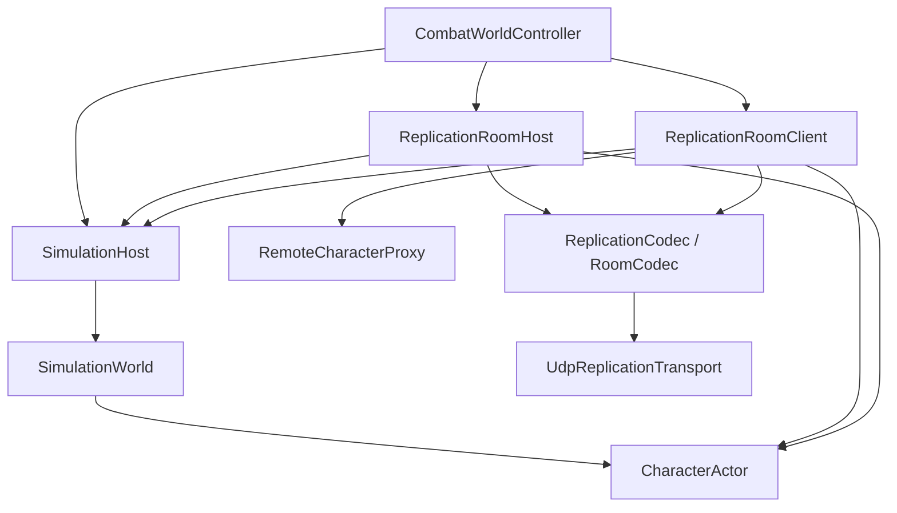
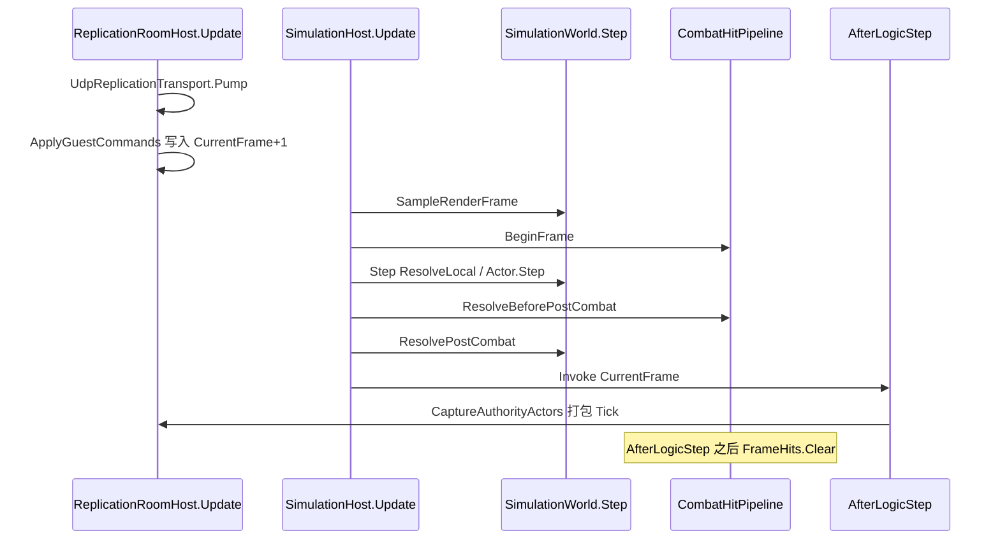
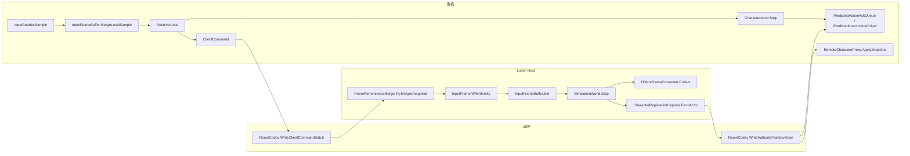

# 网络同步自学问答

> 记录：2026-08-16  
> 角色：对照代码讲解时的问答备忘，**不是**实现真源  
> 实现真源：[`../2026.8.15/NETWORK_SYNC.md`](../2026.8.15/NETWORK_SYNC.md)  
> 讲解进度：第 0～6 部分已理解；约定路线已收束

---

## 学习路线

| 部分 | 问题 | 状态 |
|---:|---|---|
| 0 | 本机进程是 Host 还是 Client？空钟、上行、AfterLogicStep | 已理解 |
| 1 | 角色座位、Proxy、ApplySnapshot、动画 Play/Seek/Tick | 已理解 |
| 2 | `InputFrame` / `ClientCommand`：网上到底传什么输入 | 已理解 |
| 3 | 房间时钟：先灌再 Step、`appliedClientFrameHint=0` | 已理解 |
| 4 | 下行：`AuthorityTick` / 快照最小集 / `ApplySnapshot` | 已理解 |
| 5 | 预测纠偏：Record / Hint 对账 / 2m 硬吸 / 掐招 | 已理解 |
| 6 | 命中复制：Host Collect / Hits[] / VitalityEdge | 已理解 |

---

## 框架总览：层级与数据流

对照 `Assets/Scripts`。箭头是依赖或调用，不是目录框。业务核（`ActionSim` / `EnemyBrain`）不引用 UDP。

### 分层（谁依赖谁）

上层可调下层；禁止倒依赖。`ACTGame.Simulation` 无 Unity；`ACTGame.Net` 只收发 `byte[]`。

| 层 | 入口类型 | 职责 | 不做什么 |
|---|---|---|---|
| 场景编排 | `CombatWorldController` | 解析 `ReplicationRole`，挂 Host 或 Client，保证有 `SimulationHost` | 不编解码、不判盒 |
| 房间 | `ReplicationRoomHost` / `ReplicationRoomClient` | 入房、灌输入、打包/收 Tick、点名本机预测 | 不跑 `ActionSim` |
| 时钟 | `SimulationHost` → `SimulationWorld` | 60Hz `Step`、命中帧末结算、`AfterLogicStep` | 不管 UDP |
| 角色核 | `CharacterActor` / `RemoteCharacterProxy` | 权威或预测 `Step`；幽灵 `ApplySnapshot` | 不知房间协议 |
| 契约 | `InputFrame` / `ClientCommand` / `AuthorityTick` / `ActorReplicationSnapshot` | 上下行字段 | 无传输 |
| 编解码 | `ReplicationCodec` / `RoomCodec` | 战斗正文小端；房间信封 | 不跑模拟 |
| 邮差 | `IReplicationTransport` / `UdpReplicationTransport` | `Pump` / `Send` | 不解字段 |

`ReplicationRole` 贴在进程（ListenHost / Client）。`ReplicationSeat` 贴在角色实例（Authority / Autonomous）。他人是 Proxy，没有第三套协议。

### 同一渲染帧（Host）

`-150` 先灌下一格，`-100` 再 `World.Step`。

客机同一序：`-150` 收 Tick 纠偏并 `MergeLocalSample`；`-100` 空 World 只加帧号；`AfterLogicStep` 里上行 + 本机 `actor.Step`。

### 上下行（跨进程）

| 方向 | 载荷 | 谁消费 |
|---|---|---|
| 客→Host | `ClientCommand`（`FrameHint` + `InputFrame`） | `ApplyGuestCommands` → 下一权威格 |
| Host→客 | `appliedClientFrameHint` + `AuthorityTick` | 自己：HP / Hint 纠偏 / Edge；他人：`ApplySnapshot`；`Hits[]` 火花 |

本机预测不进 `SimulationWorld`。命中只在 Host `CombatHitPipeline`；客机 `PredictedHitStopConsumer` 只冻钟。

---

## 第 0 部分结论

- **`ReplicationRole`**：这个 Unity **进程** 是 Listen Host 还是 Client。单机也是 Host，没有 Offline 核。
- **`ReplicationSeat`**：这个 **角色实例** 的工厂能力图（Authority / Autonomous），不是第二套同步协议。
- 客机 `SimulationWorld` 是 **空时钟**：名单为空，只 60Hz 报时；本机 Actor 由 `ReplicationRoomClient.OnAfterLogicStep` 点名 `Step`。
- 上行是量化 `InputFrame`（命令），下行是 `AuthorityTick`（状态）。禁止技能名 / 伤害 RPC。
- `AfterLogicStep` 是 `SimulationHost` 上的 `event Action<long>`，不是架构 `IArchitectureEvent`。

## 第 1 部分结论

- 会 `Step` 的人：`CharacterActorFactory` 出 Actor（Authority 或 Autonomous）。只跟快照的人：`RemoteCharacterProxy`，**没有** `ReplicationSeat.Simulated`。
- `seat = Authority` 是 C# 可选参数默认值。Host 上客机替身也是 Authority（`RemotePlayerSeat` 是房间入口，不是 Seat 枚举）。
- 契约/传输是独立层，房间编排在 App，业务核不管 UDP。Simulated 一开始就有，落地是 Proxy。
- 刀光/动作音效 **不同步事件**，同步 `ActionId`+`ActionFrame`，各端本地 Timeline 过点。受击火花走 `Hits[]`。
- `CharacterAnimationService` 是播发器，不分网。`ApplyPresentation` 只在幽灵上。Play 换片、Seek 对针、Tick 每逻辑步走表（Manual Playable，不是每渲染帧）。

## 第 2 部分结论

- 上行载荷是量化 `InputFrame`（整数轴/按钮/参考偏航），信封是 `ClientCommand`（`FrameHint` + 房间座位号）。禁止 float、招式名、坐标、HP。
- `FrameHint` 是客机序号，只用于去重；权威帧靠 `WithIdentity` 改写。禁止与 `Host.CurrentFrame` 比较。
- 同逻辑帧多次渲染采样：边沿 OR，轴/Held/Yaw 取最后一次。渲染先后在合并时丢掉。
- `ReplicationCodec` 把字段写成小端字节；`RoomCodec` 再套房间信封。不能直接拷结构体内存。

## 第 3 部分结论

- 三只计数器：Host `CurrentFrame`（权威已完成格）、客机 `_predictFrame`（预测序号/Hint）、客机空钟 `CurrentFrame`（只报时，回调丢掉）。入房只对齐一次起点，之后禁止两数相比。
- `CurrentFrame+1` 是「即将 Step、槽还空」的编号。写入的是**现在**的键/刚到的 UDP，不是预知未来。
- Unity `[DefaultExecutionOrder]`：-150 房间先灌，-100 再 `World.Step`。主线程调用序，不是 OS 优先级。
- Tick 永远下行；无新命令时信封 `appliedClientFrameHint=0`，客机不对自角色走跑纠偏。受击/死亡仍硬切。

## 第 4 部分结论

- 下行是权威结果照片：`AuthorityTick` = 世界帧 + 全员最小快照 + 本帧 `Hits[]`。自己不对 `ApplySnapshot` Seek；他人/敌人收到 Tick 才贴，不跟客机空钟 Step。
- 出招 Seek 对的是 `ActionFrame`（换段/`forceRestart` 才 Play+Seek），不是 `AuthorityFrame`。同段只 Tick。走跑循环不每 Tick Seek。
- 幽灵只补 VFX/SFX 点；Hitbox/Cancel/位移窗口只在 Host `ActionTimelineRunner`。

## 第 5 部分结论

- 先演 = 本机 `actor.Step`；权威按 Hint 对「那一格记下的脸」，不是对现在的脸。同招/连招超前只 Ack，延迟不切招。
- 走跑超 2m 才硬吸 + Restore + `ReplayTick`（只重放走跑）。吸附/穿敌/权威卡肉用 Gate 把阈提到无穷，不当走跑分叉。
- 掐招仅当权威该格没招或 Hit/Death。伤害从未在客机入账。

## 第 6 部分结论

- 伤害 / Reaction / HP 只走 Host `HitboxFrameConsumer` → `CombatHitPipeline`。客机本机只有 `PredictedHitStopConsumer`（冻钟），Proxy 不 Collect。
- 下行：`Hits[]` 按 `SimHitKey` 只播一次落点火花；`HealthMilli` 盖血；`VitalityEdge` 硬切受击/死亡。边沿只活一格，须在当步 `AfterLogicStep` 拍照。
- 刀光是 Timeline 表现，不是命中。禁止客机上报伤害；`NS-PVP` 申报未开。

---

## 问答

### Role / 空钟 / 本机表现

**Q. 解析 `ReplicationRole` 是为了什么？**  
A. Awake 时把本机进程身份定死。`IsAuthority == (Role == ListenHost)` 决定：挂 `ReplicationRoomHost` 还是 `Client`；玩家装权威还是 Autonomous；要不要刷怪。禁止每个系统自己猜 `isClient`。

**Q. 为什么客机的 `SimulationWorld` 叫空时钟？**  
A. 两端都有 `SimulationHost`。客机不 `RegisterPlayer`、不刷怪，World 名单为空，`Step` 只加帧号。`AfterLogicStep` 仍按 60Hz（可追帧）触发，给预测和上行对齐节拍。空 = 没养权威 Actor；钟 = accumulator 还在报时。

**Q. 客机没注册 Actor，逻辑帧表现怎么做？**  
A. Actor 在 `PlayerController.BuildClientSeat` 已创建，只是不进 World。`OnAfterLogicStep` 调 `actor.Step`；`LateUpdate` 用同一只钟的 `InterpolationAlpha` 调 `actor.Render`。他人走 `RemoteCharacterProxy.ApplySnapshot`。

**Q. `OnAfterLogicStep` 和 `World.Step` 有何区别？**  
A. 不是并列两套步进。`World.Step` 是内核（点名已登记 Actor）。`AfterLogicStep` 是步完（含命中/PostCombat）之后的事件。Host 回调打包 Tick；客机回调上行 + 本机 `Step`。客机本机只被房间点名，不被空 World 点名。

**Q. 为什么客机必须用 `AfterLogicStep` 推步？回调做了什么？**  
A. 必须和 Host 同一 60Hz / 追帧 / 插值 alpha。客机 `Update` 每渲染帧推会错频。回调顺序：心跳 → `ResolveLocal` 本格输入 → 上行命令批 → `actor.Step` / PostCombat / 预测卡肉 / 本地软弹开 → `_actionAck.Record` + `_driver.RecordAutonomous`。纠偏在收包的 `OnAuthorityTick`，不在这里。

### 心跳 / 输入 / 上行

**Q. `MaybeSendHeartbeat` / `RoomHeartbeat` 做什么？回显 `SendTimeMs`？RTT？**  
A. 站桩时可能没有新命令。Host 10s 无任何包则踢；命令和心跳都会 `Idle.Touch`。心跳另测 RTT：客机填 `SendTimeMs=T`，Host 原样回显到 `EchoTimeMs`，客机用自己的钟 `Now-T`，避免两端系统钟差。RTT = 往返时间，不参与 `FrameHint` 对齐。

**Q. 109–113 行 `ResolveLocal` 如何取合并结果？输入何时记？**  
A. 渲染帧 `SampleRenderInput`：`InputReader.Sample(_predictFrame+1)` → `MergeLocalSample`（边沿 OR，轴/Held 取最新）。逻辑步 `_predictFrame++` 后 `ResolveLocal`：有样本原样返回；没有则 `CarryForward`（清 Pressed/Released，不伪造边沿）。

**Q. `new ClientCommand` 是装箱吗？**  
A. 不是 C# boxing。`ClientCommand` 是 `readonly struct` 值类型构造。上网络前再 `ReplicationCodec` 序列化成字节。

**Q. `ClientCommand` / `RememberCommand` / `SendClientToAuthority` / `WriteClientCommandBatch`？**  
A. 结构体装箱三字段 → 列表留最近 3 条 → 打成一个 UDP 包冗余重发 → `UdpClient.Send` 到 Host。Host 按 `FrameHint` 去重。

**Q. `UdpReplicationTransport` / `UdpClient` / 为何不用 Mirror？**  
A. 项目邮差，只收发 `byte[]`。`UdpClient` 是 .NET BCL，不是 Unity 封装。Mirror/NGO 是物体+RPC 模型，和 60Hz `InputFrame`↔`AuthorityTick` 不是一类；战斗核在无 Unity 的 `ACTGame.Simulation`。

**Q. Host 在哪收上行？消费后结果怎么回客户端？**  
A. `ReplicationRoomHost.Update`（-150）`Pump` → `ApplyGuestCommands` → `InputFrameBuffer.Set(CurrentFrame+1)`。随后 `World.Step` 消费。没有「返回值 RPC」。`AfterLogicStep` 拍照成 `AuthorityTick` 广播；客机对自己 Reconcile，对他人 `ApplySnapshot`。

### 预测 / Ack / 事件

**Q. 123–127 行预测原理？会被服务器回滚吗？**  
A. 同一份 `CharacterActor.Step` 本机先演。不是锁步整世界回滚。权威 Tick 纠偏：走跑超 2m 硬吸+Replay；招分叉/未起手可 `StopAutonomousAction`；Hit/Death 硬切。伤害从未在客机入账。

**Q. `_actionAck` 是什么？**  
A. `PredictedActionAckQueue`：只记 `(预测帧, ActionId)`。权威到了按 Hint 对账。同招/连招超前只 Ack；未起手或 Hit/Death 标 Cancelled；权威仍在出招时不 Stop（避免有伤害没 Clip）。

**Q. 出招分叉 / 权威没起手会掐招回走跑吗？为何不只藏伤害？Dedicated 要改吗？**  
A. 权威 `ActionId==0` 或 Hit/Death 会 Stop。预测招还带烘焙位移和片子，只藏伤害会假滑再被拽回。Host 本机刀光是 Listen Host 自己当玩家；快照里的 ActionId/帧是复制状态。Dedicated 换进程/传输，掐招逻辑在客机不用改；无头捕获走跑相位（现读 Unity Animation）以后要改。

**Q. `AfterLogicStep` 是 Action 吗？要不要 EventManager？**  
A. 是 C# `event Action<long>`，带权威帧号。同循环另有无载荷的 `SimulationLogicStepEvent`（卡肉 VFX）。房间与 Host 同物体、要同步赶在 `FrameHits.Clear` 前，不必再套总线。

### GAS / RPC / 假位移

**Q. 用 GAS 就做不了帧手感？**  
A. 本项目 GAS-lite 只是 Numeric/Effect。帧手感在 `ActionSim` 整数帧。用 GAS Ability RPC 当出招时钟才会丢 Cancel/卡肉。学的是「先演、服务器可取消」，不搬 Ability 框架。

**Q. 技能改 RPC 要动什么？和现在比？**  
A. 档 A：攻击改 `UseAction` 消息，Host 仍写入下一逻辑帧意图槽再 `ActionSim`——不减服负担，变成移动命令+技能双轨。档 B：Montage/报伤害 = 换战斗主时钟，与现核冲突。现在的优点是和帧核同构；RPC 口头简单，近战对窗/预测/变体更难。

**Q. 片子继续播、假位移再 2m 拽回？减服负担吗？**  
A. 只改客机：`ShouldStopAutonomousAction` 在权威未起手时不 Stop；硬吸后通常仍要停招或锁烘焙，否则拉锯。Host `Step`/打包不变，**不减服务器负担**。

### 座位 / 工厂 / 同步层

**Q. Role 和 Seat 分别贴在哪？Autonomous/Authority 是两种同步模式吗？Host 替身？客机敌人？**  
A. Role 在进程，Seat 在角色实例。Authority/Autonomous 是工厂能力图（能不能 Collect、进不进 World），不是两套协议。Host 上客机替身是 Authority，才能进 World 互打。客机敌人是 `RemoteCharacterProxy`。

**Q. 为什么他人/敌人不走工厂出 Actor 再设 Simulated？**  
A. Host 敌人仍走 `EnemyActorFactory`→Authority Actor。客机他人若第三座位，`Step` 里难免 `if (Simulated)`。幽灵只要跟快照，用 Proxy。方案里 Simulated = Proxy 路径，不是漏掉的枚举。

**Q. `seat = ReplicationSeat.Authority` 是什么写法？**  
A. C# 可选参数默认值。不传就是 Authority；客机必须显式传 Autonomous。

**Q. 工厂是否装太多？只抽 `BuildClientSeat`？**  
A. 两座位共用的（ActionSim/走跑/表现/Numeric）故意装齐；Hitbox 只 Authority。Hurtbox/登记 World 在调用方。封装是 Awake 可读性，不是架构规定。

**Q. Proxy 是什么？有没有独立同步层？UE/Mirror？敌人链路？**  
A. Proxy = 只读替身（`GetLogicalCombatPose` 给 Relocate）。契约+传输是独立层，房间编排，业务核不管网。UE = Role+CMC 命令预测；Mirror = Identity+RPC。敌人只在 Host World 跑，Tick 里 `Kind=Enemy` 下行，客机建幽灵。Brain 不下行。

**Q. 有适合的开源同步方案吗？**  
A. 没有能整包替换战斗流的。LiteNetLib/UTP 只适合换邮差。Mirror/NGO/锁步都不对齐 `ActionSim` 整数帧。

### 快照表现 / 动画

**Q. `ApplySnapshot` 做了什么？和输入驱动差在哪？**  
A. 贴身份 → `TeleportMm` 位姿 → 按 `ActionId`/走跑相位 Play/Seek/Tick → 跨帧只派 VFX/SFX。输入驱动是 `Step`：吃键、ActionSim、烘焙位移、重力。一个是结果往回贴，一个是原因往前算。

**Q. VFX/SFX 是上网事件还是跟 Action？**  
A. 跟 Action。网上只有 `ActionId`+`ActionFrame`（及命中边沿）。各端本地 Timeline 过点。本机走 `ActionSim` 桥；幽灵用 previous→current 补点。受击火花走 `Hits[]`，不是刀光。

**Q. `CharacterAnimationService` 做什么？`ApplyPresentation` 怎么区分两种驱动？**  
A. Service 是播发器（Play/Seek/Tick），不知网。`ApplyPresentation` **只在幽灵上**，输入驱动走走跑机 + `SyncAnimation`，从不调它。

**Q. `Tick` 是每渲染帧吗？Playable 比 Controller 强在哪？**  
A. 每 **逻辑步** 1/60。Graph `DirectorUpdateMode.Manual`。Tick 推淡入权重 + `Evaluate(dt)`。相对 Controller：Clip 直播、时间和模拟锁死、不加 State、Seek 对得上 ActionFrame。

**Q. Play / Seek / Tick 各自用在哪？**  
A. Play 换片（走跑 Key / 出招 Clip）。Seek 对针不走时间（换段、跟权威帧）。Tick 每逻辑格走表。同键同段只 Tick，禁止每帧 Seek。

### 输入契约 / 量化 / Hint / Codec

**Q. 为什么禁止 float？`long` / `sbyte` / `ulong` / `ushort` 各干什么？**  
A. 网上和回放要比「位相等」，float 有舍入、跨端不一致、还更占带宽。`long` = 帧号/Hint（64 位不回绕，0 可当哨兵）。`sbyte` = 轴 [-127,127]。`ulong` = 最多 64 个稳定按钮位。`ushort` = 偏航 0.1 度 [0,3599]。

**Q. Look 和 Orbit yaw 有何区别？CameraLock 为何不上行？敌人朝向怎么同步？`MoveReferenceYawQuantized` 怎么来？**  
A. Look = 本渲染帧视角增量，只改本机 `CameraManager.yaw/pitch`。Orbit yaw = 相机水平朝向状态。上网的是采样瞬间的 Orbit yaw 量化值，用来把摇杆本地轴旋到世界 wish，**不是角色朝向**。角色/敌人朝向走下行 `FacingMilliDeg`。CameraLock 只改本机镜头跟不跟目标；选中目标已在快照 `SelectedTargetId`。

**Q. 采样链路是否太长？同逻辑帧先闪避后攻击怎么合并？**  
A. 上行前只做量化 + 边沿 OR + 暂存 yaw，不解析招式。`MergeSample` 丢掉渲染先后，只留「这一格点过哪些键」。同格 Dodge+Attack 两边沿都在；`GameplayIntentProducer` 按 Profile 按钮序 Emit，`CharacterActionDriver` 先成功起手的进 Action，另一个进 Cancel 缓冲。不是 16ms 内按渲染顺序连放两招。

**Q. Hint / `FrameHint` 是什么？**  
A. Hint = 提示序号。`FrameHint` 是客机 `_predictFrame`，给 Host 去重/乱序过滤，**不是** `Host.CurrentFrame`。权威帧靠 `WithIdentity` 改写。

**Q. `RoomRemoteInputMerge.TryMergeUnapplied` 做什么？**  
A. 一批命令按 Hint 升序，跳过 `<= lastAppliedHint`，`WithIdentity` 对齐下一权威帧，多条未应用命令 `MergeSample`。无新 Hint 返回 false，不清空已写入槽。

**Q. `ReplicationCodec` 做什么？和 `RoomCodec`？**  
A. Codec = 战斗正文小端编解码（Command / Tick / Snapshot / Hit）。`RoomCodec` = 房间信封（Join/心跳/踢人 + 把 Codec 字节当正文）。两套版本号。

**Q. 比技能 RPC 同步量是否过大？**  
A. 上行单条约 53B，3 条冗余约 0.2KB/包，60Hz 约 10KB/s，按钮几乎白送。走跑本来就要每逻辑帧传轴。技能 RPC 省不掉移动流，还裂成双轨。真正大头是下行 `AuthorityTick`（全员位姿），与 RPC/命令无关。

**Q. IEEE 754 是什么？为什么不同 CPU/编译器结果可能不同？**  
A. 浮点二进制标准：1 位符号 + 指数 + 尾数，有限精度，运算要舍入。单次加减的位型是定的；一长串运算会因 80 位中间精度、FMA 一次舍入还是两次、编译器重排（浮点不满足结合律）、flush-to-zero 而末位不同。所以契约用整数，不拿 float 对账。

**Q. 为什么要编解码，不能发「原始数据」？原理？**  
A. 网上只能发字节。C# 结构体内存有对齐填充、字段序、大小端，不能当协议。编码 = 按约定顺序把字段写成小端字节 + 版本号；解码 = 按同一顺序读回。`ReplicationCodec` 写战斗正文，`RoomCodec` 再套信封。

### 房间时钟 / 执行序

**Q. `_predictFrame` 和 `CurrentFrame` 是什么关系？为什么能写入「下一格」输入？**  
A. 不是同一条数轴。Host `CurrentFrame` = 权威已完成帧；客机 `_predictFrame` = 预测序号（入房抄 `JoinAccept.AuthorityFrame` 后自加）。客机空钟自己的 `CurrentFrame` 只用来触发 `AfterLogicStep`，回调里丢掉。`CurrentFrame+1` 是「即将 Step、槽还空」的编号，写入的是**现在**采到的键/刚到的 UDP，不是未来预知。先灌再 Step：-150 写槽，-100 的 `Step` 读 `frameIndex = CurrentFrame+1`。

**Q. `DefaultExecutionOrder` 是 Unity 自带的吗？原理？**  
A. 是。`[DefaultExecutionOrder(-150)]` 或 Project Settings → Script Execution Order。Player Loop 在主线程按这个整数排序后依次调 `Update`，数字越小越先。不是操作系统线程优先级，也不改 `deltaTime`。

**Q. `ApplyPresentation` 怎么跑？他人每 Step 都 ApplySnapshot 吗？Seek 的是世界帧吗？窗口/事件怎么消费？**  
A. 客机他人/敌人只在收到 `AuthorityTick` 时 `ApplySnapshot`，不跟客机空钟 `World.Step`。Seek 的是招式 `ActionFrame`（或走跑归一化时间），不是 `AuthorityFrame`。同段只 Tick 1/60，换段/受击回绕才 Seek。事件只补 `PlayVfx`/`PlaySfx` 点（previous→current 闭区间）；Hitbox/Cancel/位移窗口不在 Proxy 上消费。权威窗口只在 Host `ActionTimelineRunner`。

**Q. 是不是只有动画片段变了才 Seek？**  
A. 出招：换段、换招、或 `forceRestart`（Hit/Death、同一招 `ActionFrame` 回绕）才 `PlayClip+SeekClip`；同招同段只 Tick。走跑：切 Key 才 Play；Seek 只给起步/急停/折返，Idle/走/跑循环不每 Tick Seek。

### 预测纠偏

**Q. 先演是不是权威一到就按 ActionId 强制切招？延迟会不会总切？**  
A. 先演 = 不等 Tick 就 `actor.Step`。权威到了按 Hint 对账，**同招 / 连招超前只 Ack，不 Seek、不切**。只有权威该格没起手（`ActionId==0`）、变体分叉且权威也不在出招、或 Hit/Death 才停本机招。延迟是常态，不是切招条件。

**Q. `ActionMotionReconcileGate` 能否改成放宽 2m 以免特判窗口？**  
A. 不能靠放宽代替。2m 已经是走跑常态容差；吸附/穿敌是**合法的大位移**（本机已到敌后，延迟快照还在敌前），误差常超过任何固定走跑阈。全局放宽会拖真分叉的纠正。窗内把阈提到 `int.MaxValue` 是「这段误差不当走跑分叉」，不是 2m 太严。

### 命中复制

**Q. 客机刀光扫到人为什么不掉血？**  
A. 重叠只进 `PredictedHitStopConsumer`（卡肉）。`HitboxFrameConsumer` / `Pipeline.Collect` 只挂 Authority。血和受击等 Tick 的 `HealthMilli` / `VitalityEdge`；火花等 `Hits[]`。

**Q. `Hits[]` 和 `VitalityEdge` 各干什么？**  
A. `Hits[]` = 落点 Cue，Key 去重只播一次，不改 Numeric。`VitalityEdge` = 本格是否刚受击/死亡，驱动 `EnterHit`/`EnterDeath` 和幽灵 `forceRestart`。只靠 HP 差值会漏 0 伤受击和丢包。

---

## 禁区（讲解中反复出现）

- 禁止技能名 / 伤害 RPC 当战斗上行  
- 禁止 `FrameHint` 与 `Host.CurrentFrame` 比较  
- 禁止客机 `RegisterPlayer` / `HitboxFrameConsumer`  
- 禁止对自角色 `ApplySnapshot` Seek  
- `AfterLogicStep` 之后 Host 立刻清空 `FrameHits`  
- 禁止他人升格为 `CharacterActor` / `ReplicationSeat.Simulated`  
- 禁止动画 Graph 用 GameTime 与逻辑步双轨推进  

---

## 变更日志

| 日期 | 说明 |
|------|------|
| 2026-08-16 | 初版：第 0 部分问答整理 |
| 2026-08-16 | 补第 1 部分：座位 / Proxy / ApplySnapshot / 动画 Play·Seek·Tick |
| 2026-08-16 | 补第 2 部分问答：量化类型 / Look·Orbit / 同格合并 / Hint / Merge / Codec / 流量 |
| 2026-08-16 | 补 IEEE 754 与编解码原理 |
| 2026-08-16 | 第 2 部分标为已理解；开第 3 部分房间时钟 |
| 2026-08-16 | 补 `_predictFrame`/`CurrentFrame` 与 `DefaultExecutionOrder` |
| 2026-08-16 | 第 3 部分标为已理解；开第 4 部分下行快照 |
| 2026-08-16 | 补 ApplyPresentation / Seek·Tick / 幽灵事件消费 |
| 2026-08-16 | 第 4 部分标为已理解；开第 5 部分预测纠偏 |
| 2026-08-16 | 补先演≠强制切招、ReconcileGate 不能用放宽 2m 代替 |
| 2026-08-16 | 第 5 部分标为已理解；开第 6 部分命中复制 |
| 2026-08-17 | 第 6 部分标为已理解；第 0～6 约定路线收束 |
| 2026-08-17 | 补框架总览：分层依赖、Host 同帧序、跨进程上下行 |
