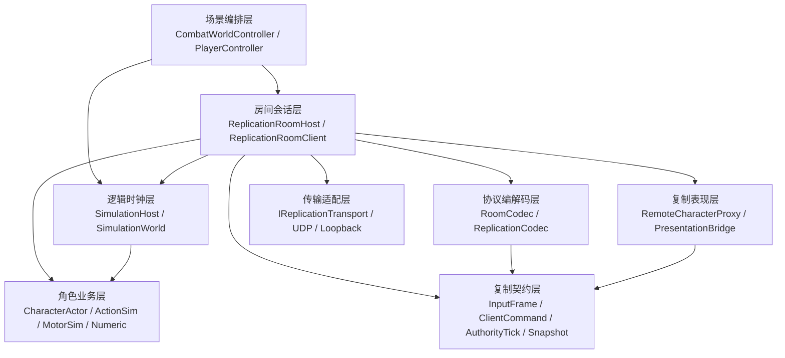
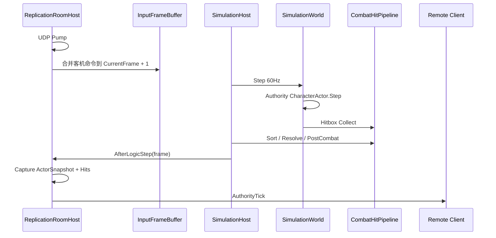

# NetSync 网络同步架构分析与大型框架对比

> 分析日期：2026-08-17  
> 代码基线：`DiavoloGame` 分支 `NetSync`，提交 `3f695f93865a29f92a09fedfe60788a620900419`  
> 分析范围：当前同步模型、框架层级、设计模式、运行原理、优缺点，以及与 Mirror、FishNet、Unity Netcode for Entities、Source SDK、GGPO、Unreal 网络架构的差异  
> 验收前提：用户已基本完成 NS0～NS5、客机预测和双人联机功能验收  
> 限制：本文基于公开分支文档与关键源码分析，不克隆项目；不对未运行的压力测试、丢包测试和带宽指标作完成声明

---

## 0. 结论摘要

当前 NetSync 不是帧同步，也不是传统“同步几个 Transform”的轻量状态同步，而是一套面向 2～4 人组队 PVE 的：

> **固定逻辑帧 + Listen Host 权威状态同步 + InputFrame 命令上行 + AuthorityTick 状态下行 + Owner 预测纠偏 + RemoteProxy 插值表现。**

其核心拓扑为：

```text
客机设备输入
  → 量化 InputFrame
  → ClientCommand 批量上行
  → Listen Host 的 60Hz SimulationWorld
  → CharacterActor / ActionSim / CombatHitPipeline 权威结算
  → AuthorityTick（ActorSnapshot + HitEvent）下行
  → 本机 Autonomous CharacterActor 纠偏
  → 他人 / 敌人 RemoteCharacterProxy 插值表现
```

它最接近的工业网络模型是：

1. **Source 系列**：`usercmd` 上行、服务器模拟、快照下行、本机预测、他人插值；
2. **Unreal CharacterMovement**：Authority / AutonomousProxy / SimulatedProxy 分工；
3. **FishNet Prediction**：Replicate 输入、Reconcile 权威状态；
4. **Unity Netcode for Entities**：Owner Predicted Ghost + Interpolated Ghost。

但本项目没有直接采用上述框架，而是围绕已有的 `SimulationWorld`、`CharacterActor`、`ActionSim`、`CombatHitPipeline` 自建了一套**领域专用网络层**。

这套方案的最大优点是：

- 网络层服从现有 ACT 帧逻辑，而不是让战斗逻辑迁就通用 RPC 框架；
- Host、客机本机都复用同一个 `CharacterActor`；
- 命中、HP、硬直只有一份权威；
- 单机等同于一人 Listen Host，不保留 Offline / Online 双核；
- 角色身份、预测、Proxy 和传输之间的边界比较清楚。

最大缺点是：

- 自研框架需要自行补齐可靠性、乱序、抖动缓冲、增量快照、兴趣管理、重连、认证和性能工具；
- 当前每个逻辑 Tick 下行全量 Actor 状态，扩展性明显弱于成熟 Ghost / Replication Graph；
- UDP Tick 无可靠重传，而 `VitalityEdge`、`Hits[]` 属于瞬时边沿，存在丢事件风险；
- RemoteProxy 没有真正的网络时间快照缓冲，能插值逻辑 Pose，但对网络抖动的抵抗仍有限；
- 目前是“双人 Demo 级网络框架”，不是生产级大型在线网络中间件。

---

## 1. 术语：当前方案到底属于哪一类

### 1.1 不是帧同步

帧同步 / Lockstep 的典型特征是：

```text
全端收到同一批玩家输入
  → 全端运行相同世界模拟
  → 理论上得到完全相同状态
```

NetSync 已明确取消产品侧 L5 全员输入广播：

- 客机不运行完整敌人 AI；
- 客机不运行权威命中；
- 他人和敌人不运行 `CharacterActor.Step`，而是应用快照；
- Host 下行的是 Actor 状态，不是所有玩家的输入集合；
- 客机只预测自己的角色，不回滚整个世界。

因此不能再把产品联网称为“帧同步”。

### 1.2 属于权威状态同步

当前权威状态只在 Host 产生：

```text
Host SimulationWorld.Step
  → MotorSim
  → ActionSim
  → CombatHitPipeline
  → Numeric / Reaction
  → ActorReplicationSnapshot
```

客户端收到状态后：

- 自己：拿快照做确认、纠偏和必要的输入重放；
- 他人：用快照直接驱动 Proxy；
- 命中：只播放 Host 复制的结果，不参与权威计算。

这就是典型的**服务器权威状态同步**。

### 1.3 为什么又有固定帧与 InputFrame

“状态同步”不等于“没有帧”。

本项目仍然保留：

- 60Hz `SimulationWorld.Step`；
- 整数 `ActionFrame`；
- 量化 `InputFrame`；
- 稳定 `SimActorId`；
- 帧末命中结算；
- `AuthorityFrame`。

因此更准确的描述是：

> **固定 Tick 的权威状态同步，而不是全端输入锁步。**

“状态帧同步”在行业中没有严格统一定义，容易混淆。对外介绍时建议使用：

> **Server-authoritative state synchronization with owner prediction**

中文：

> **服务器权威状态同步 + 拥有者客户端预测。**

---

## 2. 框架总体层级

### 2.1 分层全景



这不是严格的“每层只能调用下一层”栈，而是一个以 App 房间编排为中心、Domain 核心向内收敛的结构：

```text
App / Controllers
  负责把 Transport、Codec、Simulation、Actor、Proxy 组起来

Domain / Simulation
  只定义玩法时钟、输入和复制数据，不依赖 UDP

Domain / Net
  只收发 byte[]，不知道 ActionSim、Hitbox、相机

Presentation
  只消费模拟结果，不写回权威
```

### 2.2 每层职责

| 层级 | 核心类型 | 职责 | 明确不负责 |
|------|----------|------|------------|
| 场景编排 | `CombatWorldController` | 解析本进程是 Host 还是 Client，确保房间和时钟存在 | 不解包、不做命中 |
| 玩家入口 | `PlayerController` | 创建 Authority 或 Autonomous `CharacterActor`，绑定输入与相机 | 不管理 UDP 房间 |
| 房间会话 | `ReplicationRoomHost/Client` | 入房、心跳、灌输入、打包 Tick、纠偏、Proxy 生命周期 | 不定义招式规则 |
| 时钟 | `SimulationHost` | accumulator、60Hz Step、帧后回调 | 不直接收发 UDP |
| 世界模拟 | `SimulationWorld` | Actor 稳定顺序、AI、软弹开、战斗阶段 | 不知道网络角色 |
| 角色业务 | `CharacterActor` | 输入、Locomotion、Action、Numeric、表现桥 | 不知道房间消息格式 |
| 复制契约 | `InputFrame`、`AuthorityTick` | 定义线上“允许传什么” | 不做 Socket I/O |
| Codec | `ReplicationCodec`、`RoomCodec` | 小端字段序列化、版本检查、房间信封 | 不推进游戏 |
| Transport | `IReplicationTransport`、`UdpReplicationTransport` | 非阻塞字节收发 | 不解析业务字段 |
| Proxy | `RemoteCharacterProxy` | 位姿插值、动作 Seek、表现点事件 | 不跑 Action 权威、不 Collect |

### 2.3 依赖方向的价值

当前结构最重要的收益是：

```text
ActionSim 不依赖 UDP
CombatHitPipeline 不依赖 Room
SimulationWorld 不依赖 ParrelSync
Transport 不依赖 CharacterActor
```

这意味着：

- UDP 可以替换成 LiteNetLib、Unity Transport 或 Relay；
- Listen Host 可以替换成 Dedicated Server；
- 同一套模拟核可以继续做单机、测试和服务器；
- 网络协议不会把 `[Command]`、`[ClientRpc]` 等框架标记侵入 Domain。

---

## 3. 两类身份：进程 Role 与角色 Seat

### 3.1 `ReplicationRole`：进程身份

```text
ListenHost
  → 本进程拥有权威 SimulationWorld
  → 接受第二名玩家输入
  → 运行敌人 AI 和命中
  → 广播 AuthorityTick

Client
  → 本进程不拥有战斗权威
  → 本机 Actor 做预测
  → 他人和敌人使用 Proxy
```

Role 的粒度是**整个 Unity 进程**。

### 3.2 `ReplicationSeat`：角色能力图

```text
Authority
  → CharacterActor 完整 Step
  → 可进 SimulationWorld
  → 可挂 HitboxFrameConsumer

Autonomous
  → 同一个 CharacterActor.Step
  → 不进 SimulationWorld
  → 不挂 HitboxFrameConsumer
  → 由 ReplicationRoomClient 手动推进
```

Seat 的粒度是**单个角色实例**。

### 3.3 为什么没有 `ReplicationSeat.Simulated`

他人和敌人根本不需要完整 `CharacterActor`：

```text
RemoteCharacterProxy
  → 应用 Snapshot
  → 播动画
  → 插值位姿
  → 提供只读 Targetable
```

若强行增加 `Simulated` Seat，会在 `CharacterActor.Step` 内不断出现：

```text
if (seat == Simulated) 不推进 Action
if (seat == Simulated) 不改 Numeric
if (seat == Simulated) 不跑 Locomotion
```

当前采用独立 Proxy 是合理的：**不需要业务能力时，不创建完整业务 Actor。**

### 3.4 与 Unreal Role 的关系

| Unreal | 本项目 |
|--------|--------|
| Authority | `ReplicationSeat.Authority` |
| AutonomousProxy | `ReplicationSeat.Autonomous` |
| SimulatedProxy | `RemoteCharacterProxy` |
| NetDriver / ActorChannel | `ReplicationRoom* + Codec + Transport` |
| CharacterMovement SavedMove | `PredictedLocomotionDriver` pending inputs |

区别是 Unreal 把 Role、复制属性、RPC、ActorChannel 都做成引擎通用能力；本项目只为 ACT 角色实现了必要子集。

---

## 4. 设计模式与设计思想

### 4.1 Server Authority

模式：

```text
客户端提供意图
服务器决定结果
客户端不能直接声明伤害和位置
```

落地：

- 上行只有 `InputFrame`；
- Host 创建客机的 Authority `CharacterActor`；
- Host 独占 `CombatHitPipeline.Collect`；
- HP、Hit、Death、吸附最终结果来自 Host。

优点：

- 防止客户端直接修改伤害；
- 双方看到同一只敌人只死一次；
- AI 只需在 Host 运行；
- 可自然迁移 Dedicated Server。

限制：

- Listen Host 自己拥有代码和内存，不能防房主作弊；
- 真正反作弊仍需 Dedicated Server。

### 4.2 Ports and Adapters（端口—适配器）

端口：

```text
IReplicationTransport
```

适配器：

```text
UdpReplicationTransport
LoopbackReplicationTransport
```

业务只认：

```text
SendClientToAuthority(byte[])
SendAuthorityToClients(byte[])
Pump()
TryDequeue...
```

这是典型的 Hexagonal / Ports-and-Adapters 思路：

- 传输是外部基础设施；
- 复制协议是内部契约；
- 替换传输不应修改战斗核。

### 4.3 Strategy / Capability Graph（策略与能力图）

`ReplicationSeat` 不是简单状态枚举，而是工厂装配策略：

```text
Authority
  = Actor + Numeric + Targeting + Hitbox + World 注册

Autonomous
  = Actor + Numeric + Targeting + PredictedHitStop
  - Hitbox Collect
  - World 注册
```

差异在构造期决定，而不是运行时到处判断 `if (isClient)`。

### 4.4 Factory

`CharacterActorFactory` 负责创建复杂服务图：

- Motor；
- Locomotion 状态机；
- ActionSim；
- Numeric；
- PresentationBridge；
- Targeting；
- Authority / Autonomous 专属 Consumer。

这种工厂模式保证两端复用同一角色核，同时控制危险能力。

### 4.5 Proxy

`RemoteCharacterProxy` 是标准 Proxy 模式：

- 代表远端真实 Actor；
- 暴露 `ITargetable`、逻辑 Pose、表现根；
- 内部不拥有完整业务权威；
- `OnHit` 空操作；
- `CollectsHits == false`。

Proxy 不是网络 Actor 的“残缺版继承类”，而是不同职责的轻量对象。

### 4.6 Command

`InputFrame` 与 `ClientCommand` 是命令模式的数据化形式：

```text
InputFrame
  描述这一逻辑格玩家做了什么

ClientCommand
  增加 FrameHint 和 SenderPlayerId
```

发送的是“原因”，不是“结果”：

- 发送移动轴，不发送位置；
- 发送按钮边沿，不发送技能名；
- 发送参考 yaw，不发送最终角色朝向。

### 4.7 Snapshot

`ActorReplicationSnapshot` 是结果快照：

- 毫米位姿；
- 速度；
- Locomotion 相位；
- ActionId / ActionFrame；
- HP / Flags；
- VitalityEdge。

快照同时服务：

- RemoteProxy；
- Owner 纠偏；
- 动作确认；
- 生命状态覆盖。

### 4.8 Saved Move + Reconcile

`PredictedLocomotionDriver` 实现了简化的 Saved Move 模式：

```text
每个预测帧：
  保存 InputFrame + 当帧预测 Pose

收到权威 Hint：
  找到对应预测帧
  比较当时预测 Pose 与权威 Pose
  丢弃已确认输入
  超阈则 Restore + Replay 未确认输入
```

这与 Unreal CharacterMovement 和 FishNet Reconcile 的思路一致。

### 4.9 Observer / Hook

`SimulationHost.AfterLogicStep` 是精确时序 Hook：

- Host：战斗已结算后立即 Capture Tick；
- Client：空 World 时钟完成后推进本机预测和上行。

它没有进入全局 EventBus，是因为这里要求：

```text
本逻辑步命中结算完成
  → Capture FrameHits
  → 然后才能 Clear
```

直接 C# event 比跨系统总线更适合强时序边界。

### 4.10 分层 Codec / Envelope

```text
ReplicationCodec
  只编码 Input / Snapshot / Hit

RoomCodec
  再包 Join / Heartbeat / Kick / AuthorityTick 信封
```

这是协议分层：

- 战斗正文与房间控制分离；
- 两者拥有各自版本；
- Transport 只看到最终字节。

### 4.11 CQRS-like，但不是严格 CQRS

上行命令、下行状态有 CQRS 的外观：

```text
Command：ClientCommand
Read Model：AuthorityTick
```

但系统没有独立数据库和读写模型投影，因此准确说法是：

> **命令上行 / 状态下行的不对称复制协议，具有 CQRS-like 特征，但不是完整 CQRS。**

---

## 5. 具体实现原理

### 5.1 Host 一帧怎么运行

执行序：

```text
-200 CombatWorldController
-150 ReplicationRoomHost.Update
-100 SimulationHost.Update
AfterLogicStep
LateUpdate
```

流水线：



关键点：

1. 房间必须先写下一帧输入；
2. World 再读取该帧；
3. 命中结算后再 Capture；
4. `FrameHits` 清空前必须完成发送。

### 5.2 客机一帧怎么运行

```mermaid
sequenceDiagram
    participant Room as ReplicationRoomClient
    participant Clock as Client SimulationHost
    participant Actor as Autonomous CharacterActor
    participant Host as Listen Host

    Room->>Room: Update 收 AuthorityTick
    Room->>Room: ApplyRemoteActors
    Room->>Actor: HP 覆盖 / Action Ack / Reconcile
    Room->>Room: 渲染帧输入 MergeLocalSample
    Clock->>Clock: 空 World Step，提供 60Hz 节拍
    Clock->>Room: AfterLogicStep
    Room->>Host: ClientCommand 最近 3 条
    Room->>Actor: Actor.Step 预测
    Room->>Actor: Record SavedMove / ActionAck
    Room->>Actor: Render(alpha)
```

客机的 `SimulationWorld` 通常没有战斗 Actor，只作为预测时钟。

本机 `CharacterActor`：

- 存在；
- 会 Step；
- 不注册进 World；
- 不 Collect；
- 由 RoomClient 在 `AfterLogicStep` 手动点名推进。

### 5.3 输入采样为什么分 Render 与 Logic

玩家按钮发生在渲染帧：

```text
Update:
  Sample(_predictFrame + 1)
  MergeLocalSample

Logic Step:
  ResolveLocal(_predictFrame)
```

同一逻辑格可能有多个渲染样本：

- `Pressed/Released`：OR，防止短按丢失；
- Move/Held/Yaw：取最新；
- 没有新样本：`CarryForward`；
- CarryForward 只延续 Move/Held/Yaw，清空 Pressed/Released。

这是固定逻辑帧输入系统的正确边界。

### 5.4 FrameHint 为什么不是 AuthorityFrame

客机和 Host 不共享完全相同的逻辑序号：

```text
Client FrameHint
  = 客机预测命令序号
  = 去重、乱序合并、Owner 对账键

Host AuthorityFrame
  = Host 已完成的世界帧
```

Host 收到命令后会：

```text
FrameHint 做去重
  → InputFrame.WithIdentity
  → 改写成 Host CurrentFrame + 1
```

因此禁止把 `FrameHint` 与 Host `CurrentFrame` 直接比较。

### 5.5 输入冗余

每个上行包携带最近 3 条命令：

```text
packet N = command N, N-1, N-2
```

Host 按 `LastAppliedFrameHint` 跳过已经消费的命令，将尚未应用的样本合并。

优点：

- 不做重传协议也能覆盖短暂丢包；
- 按钮边沿通过 Merge 保留。

限制：

- 连续丢 3 包以上仍会丢输入；
- 没有拥塞控制；
- 没有可靠确认窗口。

### 5.6 下行快照

每次 Host 逻辑步都构造：

```text
AuthorityTick
  AuthorityFrame
  ActorReplicationSnapshot[]
  ReplicatedHitEvent[]
  Spawns[]
  Despawns[]
```

当前主要通过 `Actors[]` 全量扫描：

- 新 Id 创建 Proxy；
- 本 Tick 不见的 Id 销毁 Proxy；
- `Spawns/Despawns` 字段已存在但尚未成为主生命周期路径。

### 5.7 Owner 预测与纠偏

本机先演：

```text
actor.Step(input)
actor.ResolvePostCombat()
driver.RecordAutonomous(input)
actionAck.Record(frame, actionId)
```

权威 Tick 到达：

```text
按 appliedHint 找当时预测结果
  → ActionAck
  → Locomotion Reconcile
  → Hit/Death 强制权威
```

走跑纠偏：

- 默认 2m 以上才硬吸；
- 刚吸附后有 8 包宽限；
- 150mm 内不连续吸附；
- 吸附后恢复 Locomotion 状态并重放未确认输入；
- Action / Hit 时不重放走跑。

合法大位移 Gate：

- TargetAdhesion；
- Relocate；
- SoftBodySuppress；
- 权威 HitStop。

这些窗口中，位置误差不被当作普通走跑分叉。

### 5.8 动作预测

Autonomous 使用同一套：

- `CharacterActionDriver`；
- `ActionSim`；
- `ActionGraph`；
- `CharacterActionPresentationBridge`。

但没有权威 Hitbox Consumer。

确认规则：

| 预测与权威关系 | 处理 |
|----------------|------|
| 同一招 | Ack，不 Seek |
| 本机已进入下一段，权威仍是刚打过的上一段 | Ack，不取消 |
| 权威没有起手 | 停止预测招 |
| 权威是不同变体 | 取消错误预测 |
| 权威 Hit/Death | 强制进入受击/死亡 |

这能防止 RTT 导致每个快照都重播刀光。

### 5.9 RemoteProxy 表现

RemoteProxy 不推演玩法，只消费快照：

```text
Pose → MotorSim.TeleportMm
ActionId / ActionFrame → Play / Seek / Tick
LocomotionPhase → AnimationKey
VFX/SFX → Timeline 跨帧补点
```

明确禁止：

- Hitbox；
- CancelWindow；
- MovementNotify；
- Numeric；
- BT。

同动作同动画段不每 Tick Seek，只 Tick；切段或受击重入时才 Seek。

### 5.10 命中复制

权威：

```text
HitboxFrameConsumer
  → CombatHitPipeline
  → Numeric / Reaction / ConfirmHit
  → ReplicatedHitEvent
```

客机：

```text
Hits[]
  → SimHitKey 去重
  → 播落点 Cue

HealthMilli
  → 覆盖本机 / Proxy 血量

VitalityEdge
  → EnterHit / EnterDeath
```

客机本机的几何重叠只用于预测卡肉，不扣血。

### 5.11 编解码

`ReplicationCodec` 使用手写小端布局：

- 明确字段顺序；
- 明确整数宽度；
- 首字节协议版本；
- 不直接 memcpy C# struct；
- 字符串 UTF-8 + int 长度。

优点：

- 可控；
- 易调试；
- 不依赖 Protobuf；
- 与无 Unity Simulation 契约兼容。

代价：

- 每次增加字段必须同步改读写；
- 缺少字段 tag，版本兼容能力弱；
- 当前创建较多临时 `byte[]`；
- 无 bit packing、delta、baseline compression。

---

## 6. 当前方案的优点

### 6.1 与产品匹配

2～4 人 PVE 不需要全世界 GGPO：

- AI 多；
- Actor 多；
- 可接受服务器裁判；
- 需要掉线、生成、重连扩展；
- Host/DS 权威比全端一致更直接。

状态同步是合理选择。

### 6.2 复用既有 ACT 核

Host 权威仍然运行：

- `ActionSim`；
- `MotorSim`；
- `CombatHitPipeline`；
- `NumericSystem`；
- Enemy BT。

联网没有另写一套“网络版战斗规则”。

### 6.3 同一个 CharacterActor 做 Owner 预测

相比早期 Runner + 猜片方案，当前：

- Host 与客机使用同一 Locomotion；
- 使用同一 ActionGraph；
- 使用同一烘焙位移；
- 使用同一动画桥；
- Cancel 与连招逻辑一致。

这显著降低“Host 能做、客机表现做不到”的分叉。

### 6.4 权威边界干净

检查权威只需问：

```text
有没有 HitboxFrameConsumer？
有没有注册进 Authority World？
```

Autonomous Actor 即使完整运行 Action，也不能向 Pipeline 写入命中。

### 6.5 网络契约没有污染玩法

玩法代码里没有：

- `[Command]`；
- `[ClientRpc]`；
- `NetworkBehaviour`；
- `NetworkIdentity`。

这是相对 Mirror / NGO 的明显架构优势。

### 6.6 整数和量化契约

线上字段主要使用：

- mm；
- milli-degree；
- sbyte axis；
- bitset；
- integer frame。

这减少了带宽和浮点比较问题，也让测试更稳定。

### 6.7 单机即 Listen Host

没有：

```text
if offline:
  旧单机入口
else:
  新联网入口
```

一人进关同样运行 Authority Room，只是没有第二名玩家。

### 6.8 Transport 可替换

网络 Socket 被限制在适配器层。未来可以替换：

- LiteNetLib；
- Unity Transport；
- Steam Relay；
- Dedicated Server IPC。

### 6.9 测试友好

Loopback 与纯 Codec 能在 EditMode 验证：

- 字段往返；
- 输入合并；
- 预测纠偏；
- Ack；
- Proxy；
- Idle timeout。

---

## 7. 当前方案的缺点与技术债

### 7.1 自研网络框架的维护成本

成熟框架通常已经提供：

- 通道可靠性；
- 序号与乱序过滤；
- Fragmentation；
- 连接认证；
- 超时；
- Snapshot baseline；
- Delta compression；
- Interest management；
- 网络对象生命周期；
- 带宽分析工具。

当前这些需要项目自己实现。

### 7.2 AuthorityTick 没有可靠性与序号防旧包

当前 UDP 是裸 Datagram：

- 没有可靠重传；
- 没有 ACK；
- 没有发送窗口；
- 没有拥塞控制；
- 客户端代码设置 `_lastAuthorityFrame`，但未见明确的“旧 Tick 丢弃”门禁。

因此乱序包可能把 Proxy 或 Owner 状态应用回旧帧。

建议最低门禁：

```text
if tick.AuthorityFrame <= lastAppliedAuthorityFrame:
    drop
```

### 7.3 瞬时事件可能丢失

`VitalityEdge` 和 `Hits[]` 只存在于特定 Tick：

- 丢包后 HP 最终可被下一快照修正；
- 但受击边沿、死亡重播、落点火花可能丢；
- `_playedHits` 解决重复，不解决丢失。

成熟方案通常使用：

- 可靠事件通道；
- 最近 N 个事件冗余；
- 事件序号 + ACK；
- 可从持久状态推导的边沿。

### 7.4 没有真正的 Snapshot Interpolation Buffer

RemoteProxy 保存前后逻辑 Pose，并用 `InterpolationAlpha` 渲染。

但它不是完整的网络插值缓冲：

```text
网络包到达时间不均匀
  → 立即 ApplySnapshot
  → 只在当前本地逻辑格内插值
```

成熟状态同步通常会故意落后服务器若干毫秒：

```text
SnapshotBuffer[t-2, t-1, t]
  → renderTime = serverTime - interpolationDelay
  → 在两个确定快照之间插值
```

当前方案对局域网够用，但遇到公网 jitter 会更容易抖。

### 7.5 下行全量快照扩展性有限

当前每权威逻辑步都复制所有 Actor。

按当前 Codec 粗略估算，每 Actor 固定字段约：

```text
约 67 字节 + GraphNodeId UTF-8 字节
```

若 10 个 Actor、平均节点字符串 8 字节：

```text
约 750B / Tick（未含 Tick 头、Hits、房间信封、UDP/IP）
60Hz ≈ 45KB/s / Client
```

这是估算，不是实测。

当 Actor 达到 16～20 个时，单 Tick 可能接近或超过常见 MTU，产生 IP 分片；裸 UDP 对分片丢失尤其敏感。

### 7.6 `GraphNodeId` 字符串不适合高频协议

每 Actor 每 Tick 写 UTF-8 字符串会带来：

- 带宽；
- 编码分配；
- 内容拼写依赖；
- 协议稳定性问题。

建议替换为构建期稳定整数 Id：

```text
GraphNodeNetId : ushort / int
```

### 7.7 复制频率与模拟频率绑定

当前：

```text
Simulation 60Hz
AuthorityTick 60Hz
```

成熟框架通常允许：

- Simulation 60Hz；
- Snapshot 15～30Hz；
- Owner correction 高频；
- 远端低优先级 Actor 降频；
- 关键事件可靠发送。

当前带宽与 Actor 数线性增长。

### 7.8 没有兴趣管理

Host 为每个连接发送所有 Actor。

当前只有一名客机问题不大；扩到 4 人或更大场景，需要：

- 距离过滤；
- 队伍相关性；
- 场景/房间可见性；
- 更新频率分级；
- AlwaysRelevant 列表。

### 7.9 输入迟到窗口尚未真正生效

文档明确：

- `LateInputWindowFrames` 已声明；
- 当前过滤只看 `FrameHint`；
- 不基于 Host 时间限制过旧输入。

需要注意：FrameHint 与 AuthorityFrame 不能直接比较，因此迟到窗口要基于：

- 客机最近应用 Hint；
- 接收时间；
- 每 Tick 最大消费命令数；
- 服务器队列预算。

### 7.10 预测阈值偏“体验兜底”

2m 阈值可以减少频繁拉回，但它不是严格网络误差控制。

风险：

- 长时间小误差积累；
- 合法大位移 Gate 掩盖真实分叉；
- Host 与客机状态机参数不一致时不易暴露。

建议记录：

- p50 / p95 / max prediction error；
- 每分钟 Snap 次数；
- Gate 延迟纠偏次数；
- Replay 输入数量。

### 7.11 本地 Numeric 复制不完整

快照当前包含：

- Health；
- Flags。

如果 Special / EX / Ultimate 依赖更多资源、Effect 层数和冷却：

- 客机本地可能预测可起手；
- Host 可能拒绝；
- 只能靠 ActionAck 取消。

这是允许的预测模型，但 UI 和资源条最终也需要复制相应权威字段。

### 7.12 Host 优势

Listen Host：

- 输入直接进入权威；
- 无 RTT；
- 不需要预测纠偏。

客机：

- 本地预测；
- 可能被取消或拉回。

PVE 可接受；PVP 则需要 Dedicated Server 或明确公平性限制。

### 7.13 安全能力不足

已有：

- 协议版本；
- 内容版本；
- Endpoint 绑定；
- 房间容量；
- Host 权威伤害。

缺少：

- 身份认证；
- 包签名/加密；
- 防重放 nonce；
- 输入速率限制；
- 命令时间窗；
- 异常移动/按钮频率校验；
- DDoS/UDP spoof 防护。

### 7.14 生命周期仍是 P0

当前 Proxy 主要通过每 Tick Actors 列表：

- 出现新 Id → 创建；
- 消失 → 销毁。

虽然协议已有 `Spawns/Despawns`，但尚未成为完整生命周期真源。

这会影响：

- 丢包；
- 大型实体生成；
- 重连；
- 对象类型；
- 多种敌人正确模型。

### 7.15 实现文档存在一处 CameraLock 自相矛盾

`NETWORK_SYNC.md` 对客机 CameraLock 有两种不同描述：

- 一处称客机没有权威 Actor，因此当前不能锁敌；
- 另一处称 Proxy 注册进 `TargetSystem`，客机可以对范围内 Proxy 选敌和锁定。

以当前代码为准，后者更准确：

- `ReplicationRoomClient` 会把 `RemoteCharacterProxy` 注册进 `TargetSystem`；
- Proxy 实现只读 `ITargetable`；
- 客机本机仍保留 CameraLock 输入。

因此应把“客机不能锁敌”的旧描述改成：

> 客机可以对复制 Proxy 做本地选敌和相机锁定，但 Proxy 只提供延迟后的只读目标状态，不具有命中权威。

---

## 8. 与 Mirror 对比

### 8.1 Mirror 架构

```text
NetworkManager
  → Transport
  → NetworkServer / NetworkClient
  → NetworkIdentity
  → NetworkBehaviour
      SyncVar
      Command
      ClientRpc
```

核心思想：

- GameObject 是网络对象；
- `NetworkIdentity.netId` 是身份；
- `NetworkBehaviour` 字段通过 SyncVar 同步；
- 客户端行为通过 Command 调服务器；
- 服务端用 ClientRpc / 状态复制通知客户端。

### 8.2 与本项目差异

| 维度 | NetSync | Mirror |
|------|---------|--------|
| 网络对象 | `SimActorId + Snapshot` | `NetworkIdentity + GameObject` |
| 玩法侵入 | Domain 不继承网络基类 | 业务常继承 `NetworkBehaviour` |
| 上行 | 固定 `InputFrame` | 任意 Command/RPC |
| 下行 | 手写 `AuthorityTick` | SyncVar / Rpc / 自定义序列化 |
| 预测 | 项目专用 SavedMove/ActionAck | 通常需自己组合组件或扩展 |
| 命中 | Host Pipeline 独占 | 由项目 Command/Server 逻辑决定 |
| 生命周期 | Actors 列表扫 Proxy | `NetworkServer.Spawn` 自动管理 |
| Interest | 当前无 | 有 Interest Management 体系 |
| 协议 | 手写、透明 | Weaver/框架生成较多 |

### 8.3 评价

Mirror 更适合：

- 快速做 GameObject 联机；
- RPC/SyncVar 驱动的合作游戏；
- 不需要复杂帧预测的项目。

NetSync 更适合当前项目，因为：

- ActionSim 已有整数帧；
- 输入、位移、命中都已形成独立 Domain；
- 若改用 Mirror SyncVar/RPC，容易产生“移动命令 + 技能 RPC + 命中 RPC”三轨。

NetSync 的代价是失去 Mirror 成熟的 Spawn、可见性、连接管理和通道能力。

---

## 9. 与 FishNet 对比

### 9.1 FishNet 架构

```text
NetworkManager
  → TimeManager
  → TransportManager
  → ServerManager / ClientManager
  → NetworkObject / NetworkBehaviour
  → PredictionManager
      [Replicate]
      [Reconcile]
  → ObserverManager
```

核心思想：

- Owner 发送 replicate 输入；
- Server 执行输入；
- Server 返回 reconcile 状态；
- Owner 回退/重放；
- 非 Owner 使用状态同步；
- Observer 系统管理可见性。

### 9.2 与本项目差异

| 维度 | NetSync | FishNet |
|------|---------|---------|
| Tick | 自研 `SimulationHost` | `TimeManager` |
| Replicate | `ClientCommand + InputFrame` | `[Replicate]` |
| Reconcile | `PredictedLocomotionDriver` | `[Reconcile]` |
| Owner 角色 | Autonomous `CharacterActor` | Owned `NetworkObject` |
| 他人 | `RemoteCharacterProxy` | NetworkObject / predicted or transform |
| 可见性 | 无 | ObserverManager |
| 传输 | 裸 UDP Adapter | 多 Transport 管理 |
| 预测范围 | ACT Locomotion/Action 专用 | 通用对象预测框架 |

### 9.3 评价

FishNet 是开源框架中与本项目**行为模型最接近**的。

本项目没有采用 FishNet 的主要差异：

- 预测需要复用已有 `CharacterActor` 和 ActionGraph；
- 命中权威要求严格控制 Consumer 装配；
- 现有模拟时钟已经成熟；
- 不希望 `NetworkObject` 侵入 Domain。

若将来需要生产化而不坚持全自研，FishNet 比 Mirror 更值得评估；但迁移成本主要在：

- 把 Room / Transport 交给 FishNet；
- 保留现有 `InputFrame` 和 Snapshot；
- 不要把 Action 改成普通 RPC。

---

## 10. 与 Unity Netcode for Entities 对比

### 10.1 Netcode for Entities 架构

```text
Server World
  → GhostSendSystem
  → Snapshot
  → Client World
      Interpolated Ghost
      Predicted Ghost
      Owner Predicted Ghost
      GhostUpdateSystem
      PredictedSimulationSystemGroup
```

成熟能力：

- Snapshot baseline / delta；
- partial snapshot；
- MTU 管理；
- Ghost importance；
- Owner predicted；
- selective rollback；
- prediction smoothing；
- ECS chunk 批量处理。

### 10.2 与本项目差异

| 维度 | NetSync | Netcode for Entities |
|------|---------|----------------------|
| 数据模型 | OO `CharacterActor` | ECS Entity/Ghost |
| Owner | Autonomous Actor | Owner Predicted Ghost |
| 他人 | RemoteProxy | Interpolated Ghost |
| 回滚 | 只纠偏 Owner 的走跑/动作 | Predicted Ghost selective rollback |
| 快照 | 每 Tick 手写全量 | partial + delta + baseline |
| 相关性 | 无 | importance / chunk / partial snapshots |
| MTU | 依赖 UDP/IP | 框架主动按 MTU 裁切 |
| 玩法复用 | 同一 CharacterActor | 预测系统组 + Simulate tag |

### 10.3 评价

概念上，两者非常接近：

```text
Authority        ≈ Server Ghost
Autonomous       ≈ Owner Predicted Ghost
RemoteProxy      ≈ Interpolated Ghost
AuthorityTick    ≈ Ghost Snapshot
```

但 NetSync 是手写的、角色专用的 OO 小框架；NfE 是面向大量实体的通用数据导向复制系统。

NetSync 的优势：

- 与现有 MonoBehaviour/纯 C# Actor 集成成本低；
- ActionGraph/Playable/CharacterConfig 不必重写 ECS。

NfE 的优势：

- 带宽、MTU、delta、相关性和大规模 Actor 能力远强于当前方案。

---

## 11. 与 Valve Source SDK 对比

### 11.1 Source 高层拓扑

```text
Client usercmd
  → Server authoritative simulation
  → Server snapshots
  → Owner prediction/reconciliation
  → Remote interpolation
  → Server lag compensation for shooting
```

### 11.2 对应关系

| Source | NetSync |
|--------|---------|
| `CUserCmd` | `InputFrame / ClientCommand` |
| Server tick | `SimulationWorld.Step` |
| Entity snapshot | `ActorReplicationSnapshot` |
| Client prediction | Autonomous `CharacterActor.Step` |
| Usercmd ack | `appliedClientFrameHint` |
| Remote interpolation | `RemoteCharacterProxy` |
| Weapon server authority | `CombatHitPipeline` |
| Lag compensation rewind | **当前没有** |

### 11.3 最大差异：延迟补偿

Source 对射击通常会：

```text
服务器收到开火 usercmd
  → 根据 latency + interpolation delay 找到历史时刻
  → 临时回退目标位置
  → 做射线判定
  → 恢复当前状态
```

本项目近战命中：

```text
Host 当前逻辑帧 Hitbox
  → 当前目标 Hurtbox
  → 直接结算
```

因此：

- 结构拓扑很像 Source；
- 但没有服务器历史回退；
- 高 RTT 客机的近战有效帧会更晚到 Host。

PVE 可接受；PVP 需要单独设计攻击申报或历史回溯，不能直接把当前 Host 当前帧盒称为“永劫式命中”。

---

## 12. 与 GGPO 对比

### 12.1 GGPO 架构

```text
双方交换输入
  → 缺远端输入时预测
  → 全世界继续推进
  → 实际输入到达后比较
  → SaveState / LoadState
  → 回滚整个确定性世界并重演
```

游戏必须提供：

- deterministic simulation；
- save_game_state；
- load_game_state；
- advance_frame；
- checksum。

### 12.2 与本项目根本差异

| 维度 | NetSync | GGPO |
|------|---------|------|
| 权威 | Host / DS | P2P 输入共识 |
| 下行 | 状态快照 | 远端输入 |
| 回滚对象 | Owner 走跑/动作局部纠偏 | 整个世界 |
| AI | 仅 Host | 全端必须同构 |
| 确定性要求 | Host 内部稳定即可 | 全端位级一致 |
| 加入/掉线 | 状态模型更自然 | 较复杂 |
| 适用品类 | 组队 PVE / 多 Actor | 1v1 格斗 |

NetSync 主动放弃了 GGPO 的整世界确定性换取：

- 更多 Actor；
- 权威 AI；
- 较容易的房间与恢复；
- 较低的客户端重演成本。

这不是“简化版 GGPO”，而是完全不同的同步模型。

---

## 13. 与 Unreal 网络架构对比（行业参考，非开源框架）

> Unreal Engine 源码对授权用户可见，但不应简单称为 MIT/Apache 意义上的开源框架。这里作为行业架构参考。

### 13.1 Unreal 通用层

```text
NetDriver / Connection
  → ActorChannel
  → Replicated Properties / RPC
  → Network Roles
  → CharacterMovement Prediction
  → Replication Graph / Iris
```

### 13.2 本项目借鉴的部分

- Authority / Autonomous / Simulated 角色分工；
- Owner 使用真实输入本地先演；
- Saved Move；
- 权威纠偏；
- 他人只消费复制状态；
- 网络平滑与逻辑 Pose 分离。

### 13.3 本项目没有的部分

- 通用 ActorChannel；
- 属性变化追踪；
- RPC；
- per-connection relevancy；
- Replication Graph；
- Iris baseline/delta/filter/prioritization；
- 通用 Spawn/Destroy；
- 网络时间同步；
- CharacterMovement 的完整组合移动与服务器响应协议。

### 13.4 本项目独有的部分

Unreal 的 CharacterMovement 主要解决移动；本项目还把：

- ActionGraph；
- ActionFrame；
- Cancel；
- 烘焙位移；
- HitStop；
- TargetAdhesion；
- 近战命中表现；

纳入同一个 Actor 预测和权威确认链。

因此当前框架比普通 CharacterMovement 示例更 ACT 专用，但比 Unreal 通用网络层窄很多。

---

## 14. 综合对比矩阵

| 方案 | 权威模型 | 上行 | 下行 | Owner 预测 | 他人表现 | 回滚范围 | Interest / Delta | 对现项目侵入 |
|------|----------|------|------|------------|----------|----------|------------------|------------|
| **NetSync** | Listen Host / 日后 DS | InputFrame | 全量 Actor Snapshot + Hits | 同一 CharacterActor | RemoteProxy | Owner 局部 Restore/Replay | 无 | 已深度贴合 |
| Mirror | Server | Command | SyncVar/RPC | 非核心通用能力 | NetworkIdentity | 项目自做 | 有 Interest，Delta 基础 | 较高 |
| FishNet | Server | Replicate | Reconcile + Object State | 框架内建 | NetworkObject | Owner/Object | Observer + Prediction 配置 | 中高 |
| Unity NfE | Server World | Command Data | Ghost Snapshot | Owner Predicted Ghost | Interpolated Ghost | Selective Ghost rollback | 强 | 需要 ECS 重写 |
| Source SDK | Dedicated Server | usercmd | Entity Snapshot | 内建 | 插值实体 | Owner movement | 成熟 PVS/Delta | 引擎级 |
| GGPO | P2P 输入共识 | Input | Input | 全世界预测 | 全世界重演 | 整世界 | 不以状态复制为主 | 与当前产品方向冲突 |
| Unreal | Server | Move/RPC | Property/Movement Replication | CMC SavedMove | SimulatedProxy | Owner movement / gameplay 自定义 | RepGraph/Iris 很强 | 引擎级 |

---

## 15. 本项目最有辨识度的差异

### 15.1 不是“套框架”，而是“围绕战斗核建立协议”

Mirror/FishNet 先给网络对象，再让游戏逻辑塞进去。

本项目反过来：

```text
先有 SimulationWorld / ActionSim / CombatPipeline
  → 决定哪些字段才是 Input
  → 决定哪些结果才需要 Snapshot
  → 再建立 Room / Codec / Transport
```

这是领域驱动的网络设计。

### 15.2 ActionFrame 是一等复制状态

普通同步教程常只复制：

- position；
- rotation；
- velocity；
- animator parameter。

本项目复制：

- `ActionId`；
- `GraphNodeId`；
- `ActionFrame`；
- `FreezeFrames`；
- Locomotion phase/cardinal/normalized time。

它直接服务于帧驱动 ACT，而不是依赖 Animator 参数猜状态。

### 15.3 命中 Consumer 在装配期被剥离

不是在运行时写：

```text
if client:
    不扣血
```

而是 Autonomous Actor 根本不拥有 `HitboxFrameConsumer`。

这是比普通 `isServer` 判断更强的能力隔离。

### 15.4 本机与 Host 同一 Actor，远端不是 Actor

这是精细的复用边界：

- 需要预测的人复用完整 Actor；
- 只需展示的人使用 Proxy；
- 不为了“统一类”让所有远端对象承担完整状态机成本。

### 15.5 预测与表现桥共享

本机预测动作直接走 `CharacterActionPresentationBridge`，所以：

- Clip；
- VFX；
- SFX；
- 烘焙位移；
- Cancel；

和单机/Host 使用同一条内容管线。

---

## 16. 成熟度判断

### 16.1 已达到的层级

当前已经可以称为：

> **可运行、可解释、边界清楚的双人 Listen-Server 权威状态同步框架。**

具备：

- 房间握手；
- UDP；
- 固定 Tick；
- 客机输入冗余；
- Host 权威 Actor；
- Owner 预测；
- RemoteProxy；
- 权威命中；
- 心跳与踢出；
- 协议版本；
- 测试契约。

### 16.2 尚未达到的层级

不能称为：

- 生产级 Dedicated Server 框架；
- 大规模多人复制系统；
- 公网抗抖动网络层；
- PVP 延迟补偿系统；
- 通用 Unity 网络中间件。

缺少：

- Snapshot 序列与 jitter buffer；
- reliable event；
- old tick rejection；
- delta/baseline；
- relevancy；
- bandwidth budget；
- reconnect；
- late join state restore；
- server authentication；
- content hash；
- per-actor prefab type；
- DS build / headless 测试。

---

## 17. 建议的演进顺序

### P0：正确性与公网基本稳定

1. AuthorityTick 单调序号门禁，丢弃乱序旧包。  
2. `Hits[]` / VitalityEdge 最近 N 帧冗余，或增加可靠事件序列。  
3. 真正启用迟到输入预算与每 Tick 最大命令消费。  
4. 增加网络模拟：RTT、jitter、双向丢包、乱序。  
5. 记录预测误差和 Snap 次数，而不只看“能玩”。  

### P1：带宽与规模

1. Snapshot 发送频率与 60Hz Simulation 解耦。  
2. `GraphNodeId` 改稳定整数。  
3. 增加 baseline + delta mask。  
4. Actor 更新优先级和距离相关性。  
5. 避免单 Tick 超 MTU；必要时分组或分片。  
6. Codec / Transport 缓冲复用，降低 GC。  

### P2：房间完整性

1. `Spawns/Despawns` 成为生命周期真源。  
2. 敌人类型 Id 正确生成不同 Proxy。  
3. 重连与状态恢复。  
4. Ready / Loading / Playing / Ending 房间状态机。  
5. Dedicated Server 构建。  

### P3：PVP（若产品需要）

1. 服务器历史 Pose 环。  
2. 攻击命令时间验证。  
3. 近战命中回溯或攻击方几何申报。  
4. 反作弊输入预算。  
5. Dedicated 权威，取消 Host 优势。  

---

## 18. Demo 展示建议

为了体现这是网络框架而不只是“两个人能动”，建议展示：

```text
左：Listen Host
右：ParrelSync Client
HUD：
  AuthorityFrame
  FrameHint
  RTT
  Pending Inputs
  Prediction Error mm
  Snap Count
  AuthorityTick bytes
  Actors count
```

演示顺序：

1. 客机移动立即响应，Host 延迟收到输入；  
2. RemoteProxy 只吃 Snapshot；  
3. 人为注入延迟，Owner 继续移动；  
4. 触发纠偏，展示 Restore + Replay；  
5. 客机刀光先播，但 HP 只由 Host 修改；  
6. 修改客户端 HP，下一 Tick 被 Host 覆盖；  
7. 断开客机，10 秒后 Host 剔除座位；  
8. Profiler 展示 Host 权威 Step 与 Client Proxy 成本。  

---

## 19. 最终评价

当前 NetSync 的设计选择是合理的：

- 它没有为了“技术更高级”坚持不适合组队 PVE 的整世界锁步；
- 也没有退化成技能名 RPC + Transform 同步；
- 它保留了输入帧、固定时钟、动作帧和权威 Hitbox；
- 用状态下行解决多 Actor、AI、房间与扩展问题；
- 用 Owner 预测保住本机 ACT 手感。

从架构质量看，最成功的部分是：

> **把网络身份差异收敛到 Role / Seat / Proxy 装配，而不是把 `if (isClient)` 写进每个 State。**

从工程成熟度看，当前最大的差距不是战斗逻辑，而是网络基础设施：

> **可靠性、乱序、网络时间、快照缓冲、Delta、Interest、生命周期和安全。**

因此下一阶段不应该继续重构 `CharacterActor`，而应该把注意力放在：

```text
协议正确性
  → 公网抖动
  → 带宽
  → 生命周期
  → Dedicated
```

---

## 20. 参考资料

### 本项目

- [`NetSync/NETWORK_SYNC.md`](https://github.com/diosamacao/DiavoloGame/blob/NetSync/docs/2026.8.15/NETWORK_SYNC.md)
- [`ReplicationRoomHost.cs`](https://github.com/diosamacao/DiavoloGame/blob/NetSync/Assets/Scripts/App/Controllers/Gameplay/ReplicationRoomHost.cs)
- [`ReplicationRoomClient.cs`](https://github.com/diosamacao/DiavoloGame/blob/NetSync/Assets/Scripts/App/Controllers/Gameplay/ReplicationRoomClient.cs)
- [`ActorReplicationSnapshot.cs`](https://github.com/diosamacao/DiavoloGame/blob/NetSync/Assets/Scripts/Domain/Simulation/Replication/ActorReplicationSnapshot.cs)
- [`PredictedLocomotionDriver.cs`](https://github.com/diosamacao/DiavoloGame/blob/NetSync/Assets/Scripts/Domain/Simulation/Prediction/PredictedLocomotionDriver.cs)
- [`RemoteCharacterProxy.cs`](https://github.com/diosamacao/DiavoloGame/blob/NetSync/Assets/Scripts/Domain/Character/Replication/RemoteCharacterProxy.cs)
- [`ReplicationCodec.cs`](https://github.com/diosamacao/DiavoloGame/blob/NetSync/Assets/Scripts/Domain/Simulation/Replication/ReplicationCodec.cs)
- [`UdpReplicationTransport.cs`](https://github.com/diosamacao/DiavoloGame/blob/NetSync/Assets/Scripts/Domain/Net/UdpReplicationTransport.cs)

### 外部框架与行业资料

- [Unity Netcode for Entities — Ghosts and snapshots](https://docs.unity3d.com/Packages/com.unity.netcode@1.6/manual/ghost-snapshots.html)
- [Unity Netcode for Entities — Prediction](https://github.com/needle-mirror/com.unity.netcode/blob/master/Documentation~/intro-to-prediction.md)
- [Mirror — NetworkIdentity](https://mirror-networking.gitbook.io/docs/manual/components/network-identity)
- [Mirror — Synchronization](https://mirror-networking.gitbook.io/docs/manual/guides/synchronization)
- [Mirror — Remote Actions](https://mirror-networking.gitbook.io/docs/manual/guides/communications/remote-actions)
- [FishNet — PredictionManager](https://fish-networking.gitbook.io/docs/fishnet-building-blocks/components/managers/predictionmanager)
- [FishNet — Replicate / Reconcile](https://fish-networking.gitbook.io/docs/guides/features/prediction/creating-code/controlling-an-object)
- [FishNet — ObserverManager](https://fish-networking.gitbook.io/docs/manual/components/managers/observermanager)
- [GGPO GitHub](https://github.com/pond3r/ggpo)
- [GGPO Developer Guide](https://github.com/pond3r/ggpo/blob/master/doc/DeveloperGuide.md)
- [Valve Source SDK 2013 — Lag Compensation](https://github.com/ValveSoftware/source-sdk-2013/blob/master/src/game/server/player_lagcompensation.cpp)
- [Valve — Latency Compensating Methods](https://www.gamedevs.org/uploads/latency-compensation-in-client-server-protocols.pdf)
- [Unreal Engine — Actor Roles](https://docs.unrealengine.com/4.27/en-US/InteractiveExperiences/Networking/Actors/Roles/)
- [Unreal Engine — Character Movement](https://docs.unrealengine.com/4.27/en-US/InteractiveExperiences/Networking/CharacterMovementComponent/)
- [Unreal Engine — Replication Graph](https://dev.epicgames.com/documentation/en-us/unreal-engine/replication-graph-in-unreal-engine)

---

## 21. 变更日志

| 日期 | 说明 |
|------|------|
| 2026-08-17 | 初版：分析 NetSync 当前架构、实现原理、设计模式、优缺点，并与 Mirror、FishNet、NfE、Source、GGPO、Unreal 对比 |
