# NetSync 通用网络层分离 + Dedicated Server 总开发计划

> 制定：2026-08-17  
> 角色：**NetSync 两份方案的总排期与阶段出口真源**；具体类型契约仍以下列专项方案为准  
> 设计真源：  
> - [`NETSYNC_GENERIC_CORE_GAMEPLAY_SEPARATION_PLAN.md`](./NETSYNC_GENERIC_CORE_GAMEPLAY_SEPARATION_PLAN.md) — GF0～GF8  
> - [`NETSYNC_DEDICATED_SERVER_SEPARATION_PLAN.md`](./NETSYNC_DEDICATED_SERVER_SEPARATION_PLAN.md) — DS0～DS8  
> - [`NETSYNC_ARCHITECTURE_ANALYSIS_AND_FRAMEWORK_COMPARISON.md`](./NETSYNC_ARCHITECTURE_ANALYSIS_AND_FRAMEWORK_COMPARISON.md) — 现状分析  
> 当前实现：[`../2026.8.15/NETWORK_SYNC.md`](../2026.8.15/NETWORK_SYNC.md)  
> **执行决策：** GF4 是“网络层分离完成”门槛；GF8 不是 Dedicated 前置。先交付 DS-Demo，再做 Listen 组合收敛、公网与规模优化。

---

## 0. 一句话

先用 Golden Bytes、固定帧序和双进程回归冻结现有行为，再依次拆出 `ACTNet.Core → Transport → Session → Replication → ACT Adapter`；GF4 出口关闭后，以同一 `ServerRuntime` 实现无本地玩家的 Dedicated Server，DS6 完成可玩的 2～4 人 LAN DS-Demo，之后才推进通用预测、可靠通道、网络时间、Delta、包化、重连和运维；禁止在旧 `ReplicationRoomHost` 上堆 Dedicated 分支，禁止长期保留新旧 Room 双轨。

---

## 1. 总目标与不做

### 1.1 三个交付里程碑

| 里程碑 | 条件 | 可宣称 |
|---|---|---|
| M1 — 网络层分离 | W0～W4；对应 GF0～GF4 | `ACTNet.*` 与 ACT 业务单向依赖，Room 不再兼任 Gameplay Driver |
| M2 — DS-Demo | W5～W8；对应 DS0～DS6 主路径 | 无本地玩家 Server + 两个远端客户端可完成一局 |
| M3 — DS-Full / R2 | W9～W12 | Listen 组合收敛、公网基线、规模能力、包化与运维闭环 |

### 1.2 本计划明确不做

- 不在 W0～W4 改动作、Locomotion、命中或 2m 纠偏语义。
- 不把 `ActionId`、Hit/Death、弹反等 ACT 规则写进 `ACTNet.Prediction`。
- 不在 DS-Demo 前先做 Matchmaking、账号、跨区、云厂商 SDK。
- 不以 `#if UNITY_SERVER` 隐藏 Domain 对表现层的依赖。
- 不同时维护旧 Room 与新 Runtime 两套长期主路径。
- 不在 W5～W8 强制把 Listen Host 改成双实例；先证明真 Dedicated。
- 不直接修改 Prefab、`.asset`、`Assets/Data/**`；所需绑定列入 Editor 验收。

---

## 2. 关键路径与依赖

```mermaid
flowchart LR
    W0[W0 基线冻结]
    W1[W1 Core]
    W2[W2 Transport Session]
    W3[W3 Replication]
    W4[W4 ACT Adapter]
    M1((M1 分离完成))
    W5[W5 DS Bootstrap N玩家]
    W6[W6 Headless Content]
    W7[W7 Match Replication]
    W8[W8 Dedicated Build]
    M2((M2 DS-Demo))
    W9[W9 Listen 收敛]
    W10[W10 Prediction Reliability Time]
    W11[W11 Delta Package]
    W12[W12 Public Ops]
    M3((M3 DS-Full / R2))

    W0 --> W1 --> W2 --> W3 --> W4 --> M1
    M1 --> W5 --> W6 --> W7 --> W8 --> M2
    M2 --> W9 --> W10 --> W11 --> W12 --> M3
```



### 2.1 阶段映射

| 总 Wave | GF / DS 来源 | 主交付 |
|---|---|---|
| W0 | GF0 + DS0 | 行为、协议、依赖、指标冻结 |
| W1 | GF1 | Core Id / Buffer / Version / Fingerprint |
| W2 | GF2 | Transport + Session，ConnectionId 与 N 连接 |
| W3 | GF3 | Replication Runtime、实体生命周期、Archetype |
| W4 | GF4 | ACT Authority / Owner / Observer Adapter |
| W5 | DS1 + DS2 | Dedicated Bootstrap、无 Host 玩家、N 玩家 |
| W6 | DS3 + DS4 | Headless Authority、Server Content |
| W7 | DS5 | Match + per-connection Replication + Client 接入 |
| W8 | DS6 | Unity Dedicated Build、CI Smoke、DS-Demo |
| W9 | Listen 组合收敛 | `ServerRuntime + LocalClientRuntime + Loopback` |
| W10 | GF5 + GF6 | Prediction 骨架、可靠通道、网络时间、事件可靠性 |
| W11 | GF7 + GF8 | Delta / Relevancy / Budget / 包化 / FakeActionGame |
| W12 | DS7 + DS8 | 公网安全、重连、容器、指标、压测、Runbook |

### 2.2 可并行但不得合并为同一风险面

- W0：Golden Bytes、依赖图、人工回归脚本、指标基线可并行。
- W1：Core Id 与 Reader/Writer 可并行，最终用 Golden Bytes 汇合。
- W3：FakeEntity 生命周期与 ACT Archetype 设计可并行。
- W6：Headless Actor 与 Content Manifest 设计可并行；接线必须串行验收。
- W8：Build Profile、CLI、CI 脚本可并行；完整对局烟测最后汇合。

禁止并行：

- W2 首次 Session 拆分与更换成熟 UDP 库。
- W3 生命周期真源切换与 W11 Delta。
- W4 Adapter 搬迁与玩法系统重构。
- W6 Headless 装配与 Action/Locomotion 语义修改。
- W10 Prediction 提取与纠偏阈值调参。

---

## 3. 每个 Wave 的共同门禁

每个 Wave 合并前必须满足：

- [ ] 当前 Wave 的 EditMode / PlayMode 测试通过。
- [ ] 单人 Listen Host 基线路径通过。
- [ ] Host + 真 Client 双进程移动、出招、受击、死亡通过。
- [ ] 未授权改变线格式时，GF0 Golden Bytes 完全一致。
- [ ] 无 `ACTNet.* → ACTGame.* / UnityEngine` 反向引用。
- [ ] 无新增长期 `Legacy` / `Compat` / `V1` 双轨。
- [ ] 新 Session / Replication 热路径有长度、数量和非法 Id 检查。
- [ ] 变更同时更新两份专项方案的勾选项与出口。

W5 起额外要求：

- [ ] 无 LocalPlayer 时 Server 可启动。
- [ ] Connection / Command / ACK / Baseline 均为 per-connection。
- [ ] Server 不接受客户端 Pose / HP / Damage 覆盖。

---

## 4. 分阶段交付

### W0 — 行为冻结与 Dedicated 前置审计

**对应：** GF0 + DS0

**任务**

- [x] 为 `RoomCodec`、`ReplicationCodec` 建 Golden Bytes 测试。（2026-08-17：`ProtocolGoldenBytesTests`，待 Test Runner）
- [x] 固定 Join、CommandBatch、AuthorityTick、Hit 的往返字节。（2026-08-17）
- [x] 用测试固定 Host 一格顺序：Receive → Set Input → World.Step → Hit Resolve → Capture → Send。（2026-08-17：待 Test Runner）
- [x] 用测试固定 Client 一格顺序：Receive Tick → Reconcile → Sample → Send → Predict。（2026-08-17：按当前生产代码冻结，待 Test Runner）
- [x] 建双进程人工回归脚本：移动、急停、折返、攻击、连招、闪避、受击、死亡、CameraLock、断线。（2026-08-17：待 Editor 执行）
- [ ] 记录 Tick bytes、GC alloc、Proxy 数、pending command、RTT 基线。
- [x] 列出 `ReplicationRoomHost` 中所有 Host LocalPlayer、固定 Guest、HostRoot Spawn 假设。（2026-08-17：见 W0 审计）
- [x] 列出 Authority Actor 对 Animator、Playable、Model、VFX/SFX、Transform 的依赖。（2026-08-17：见 W0 审计）
- [x] 定案 DS-Demo：一场一进程、2～4 玩家、LAN、无重连。
- [ ] 禁止修改协议布局、阈值和玩法语义。

**验收**

- [ ] Codec Golden Bytes 全部通过。
- [ ] 固定输入脚本在 Host / Client 最终 Pose、HP、Action 一致。
- [ ] 能从依赖图定位 LocalPlayer → Host Room 与 Presentation → Authority 路径。
- [ ] 当前双人联机人工回归通过。

**出口：** 后续搬迁有可比较基线，Dedicated 范围可证明。→ **未达成**

---

### W1 — ACTNet.Core 与协议基础

**对应：** GF1

**任务**

- [x] 创建纯 C# `ACTNet.Core`。（2026-08-17：`Framework/ACTNet/Core/ACTNet.Core.asmdef`，`noEngineReferences=true`）
- [x] 增加 `NetConnectionId`、`NetPlayerId`、`NetEntityId`、`NetArchetypeId`、`NetTick`、`NetSequence`。
- [x] 增加有边界检查的小端 `NetBufferReader/Writer`。
- [x] 定义 `NetworkProtocolVersion`、`ContentFingerprint`、`NetResult`、`DisconnectReason`。
- [x] `SimActorId ↔ NetEntityId` 只在 ACT Adapter 映射；首版允许数值相同。（`SimActorNetIdAdapter`）
- [x] `RoomCodec` / `ReplicationCodec` 改用 Core Reader/Writer。
- [x] 删除各 Codec 重复私有 Reader/Writer。

**验收**

- [x] `ACTNet.Core` 无 Unity / ACT 引用。（asmdef 零引用 + noEngineReferences）
- [x] W0 Golden Bytes 完全不变。（2026-08-17：Unity Test Runner 验收）
- [x] 非法长度、负 count、超上限、无效 Id 被拒绝。（2026-08-17：Unity Test Runner 验收）
- [x] Id Equality / Hash / Invalid 测试通过。（2026-08-17：Unity Test Runner 验收）

**出口：** 通用纯 C# 协议基础形成，当前线上字节不变。→ **已达成（2026-08-17）**

---

### W2 — Transport 与 Session 分离

**对应：** GF2

**任务**

- [x] 以 `INetTransport` 替换方向固化的 `IReplicationTransport`。（2026-08-17：旧接口与两套旧实现已删除）
- [x] 接口支持 `StartServer/StartClient/Poll/Send(connection, channel)/TryReceive/Disconnect`。
- [x] 建 `ServerSession`、`ClientSession`、`ConnectionRegistry`、`PlayerRegistry`。
- [x] Join / Accept / Reject / Heartbeat / Kick 从 Room 移到 Session。
- [x] 容量由 Session 配置，不再写死 `MaxPlayers=2`。
- [x] UDP Adapter 保持当前行为；本 Wave 不接可靠 UDP。（代码已单轨切换，待双进程 Play）
- [x] `LoopbackTransport` 支持至少三条独立连接。（多连接测试已写，待 Test Runner）
- [x] 删除 Room 中 Endpoint、握手 switch、IdleTracker 与固定 Session Guest 状态。（Gameplay 单 Guest Actor 留待 W5）

**验收**

- [x] FakeGame 不创建 Character/Unity 对象即可 Join、Heartbeat、Kick。（2026-08-17：Test Runner 验收）
- [x] 三条 Loopback 连接获得独立 ConnectionId / PlayerId。（2026-08-17：Test Runner 验收）
- [x] 一条连接断开不影响其他连接。（2026-08-17：Test Runner 验收）
- [x] 当前双人 UDP 入房行为不变。（2026-08-17：双进程 Play 验收）

**出口：** 连接与房间状态不再依赖 ACT Gameplay。→ **已达成（2026-08-17）**

---

### W3 — Replication Runtime 与实体生命周期

**对应：** GF3

**任务**

- [x] 建 `ReplicatedEntityRegistry`、`ReplicationServer`、`ReplicationClient`。（2026-08-18 已验收）
- [x] 定义 `ReplicationFrame`、`EntityRecord`、`SpawnRecord`、`DespawnRecord`。
- [x] 定义 `IReplicationSchema` 与 Schema Registry。
- [x] 实现 `CharacterSnapshotSchemaV1`，首版正文复用 `ActorReplicationSnapshotCodec` 保持旧 Snapshot 语义。（2026-08-18 已验收）
- [x] `Spawn/Despawn` 成为生命周期真源。（2026-08-18 双进程 Play 已验收）
- [x] 建立稳定 Character Archetype Catalog：调用方 stableKey 经 FNV-1a 映射 `NetArchetypeId`，拒绝重复键与哈希碰撞。（2026-08-18 已验收）
- [x] 将 `NetArchetypeId` 接入生产 Spawn/Proxy，删除客户端 `_enemyConfigs[0]` 模型回退主路径。（2026-08-18 已验收）
- [x] 当前单客机按连接持有 `ReplicationServer` baseline；重连重建 Server，禁止继承上一连接 ACK。（N 连接扩展仍属 W5）
- [x] 旧 Sequence 不得覆盖新状态。（Runtime 与生产切换均完成）
- [x] 删除 `ApplyRemoteActors` 中“本 Tick 未见即销毁”的生命周期主逻辑。

**验收**

- [x] FakeEntity 完成 Spawn → Update → Despawn。（2026-08-18 Runtime Test Runner 已验收）
- [x] 丢一张普通 Snapshot 不会误 Despawn。（2026-08-18 Runtime Test Runner 已验收）
- [x] 乱序旧 Frame 不会回滚实体。（2026-08-18 Runtime Test Runner 已验收）
- [x] 两种敌人 Archetype 通过稳定 Id 精确解析各自内容；生产 Play 已验收。
- [x] Player / Enemy 当前联机表现不变。（2026-08-18 双进程 Play 已验收）

**出口：** 复制层拥有通用实体生命周期，不再等于 Actors 全量数组。→ **已达成（2026-08-18：生产 Play 与丢帧/乱序/多 Archetype 线格式测试验收）**

---

### W4 — ACT Authority / Owner / Observer Adapter

**对应：** GF4；**M1 网络层分离完成门槛**

**任务**

- [x] 建 `ActGameSessionHandler`，玩家加入后创建 Authority Actor。（2026-08-18 Test Runner / 双进程 Play 已验收）
- [x] 建 `ActAuthorityReplicationAdapter`：InputFrame 灌入、Snapshot Capture、FrameHits。（2026-08-18 Test Runner / 双进程 Play 已验收）
- [x] 建 `ActOwnerReplicationAdapter`：Owner HP、Action Ack、Locomotion Reconcile。（2026-08-18 Test Runner / 双进程 Play 已验收）
- [ ] 建 `ActRemoteProxyFactory`：Proxy、TargetSystem、Archetype 与 View 生命周期。（2026-08-18 `ActObserverReplicationAdapter` + Factory 代码完成，待 Test Runner / 双进程 Play）
- [ ] `ActionReplicationCatalog` 迁入 `ActContentRegistry`。
- [ ] `CharacterReplicationCapture` 迁入 Character Schema。
- [ ] Hit Cue、PredictedHitStop、CameraLock 只留 ACT/App。
- [ ] `ReplicationRoomHost/Client` 缩为薄 Facade，或切到 `NetGameController`。
- [ ] 删除 Session / Replication 对 `CharacterConfig`、`PlayerController`、`EnemySpawnController`、`RemoteCharacterProxy` 的引用。
- [ ] 删除已迁出的旧 Room Gameplay 路径；不得保留两套运行入口。

**验收**

- [ ] `ACTNet.*` 搜索无 `CharacterActor|ActionDefinition|CharacterConfig|CombatHitPipeline|RemoteCharacterProxy|UnityEngine`。
- [ ] Authority / Owner / Observer 映射测试通过。
- [ ] Observer 不创建完整 `CharacterActor`。
- [ ] Owner 不注册权威 Hitbox Consumer。
- [ ] 双人联机移动、出招、连招、受击、死亡、CameraLock 全回归。

**出口：** M1 达成；网络层 / ACT 业务层结构性分离完成，可启动 Dedicated 主路径。→ **未达成**

---

### W5 — Dedicated Bootstrap 与 N 玩家 Session

**对应：** DS1 + DS2

**任务**

- [ ] 定义 `NetProcessRole.Client / ListenServer / DedicatedServer`。
- [ ] 建 `DedicatedServerBootstrap` 与 `ServerLaunchConfig`。
- [ ] Bootstrap 装配 Transport、ServerSession、Match、Simulation、Replication。
- [ ] `CombatWorldController` 不负责 Dedicated 启动。
- [ ] Dedicated 不创建 PlayerController、Input、Camera、HUD、Feedback。
- [ ] 删除 `GuestPlayerId=2`、单 `_guest`、Join 等 HostActor 的假设。
- [ ] 每连接独立 CommandStream / ACK / Idle。
- [ ] `MatchCoordinator` 负责 PlayerId、Team、Spawn、Archetype。
- [ ] 增加配置失败、Bind 失败退出码。

**验收**

- [ ] 无 LocalPlayer 的 Server 可到 Listening 并 Accept 第一名玩家。
- [ ] 三个 Loopback Client 分配不同 PlayerId / EntityId。
- [ ] 一人断开不影响其他人。
- [ ] 每连接 ACK 不串线。
- [ ] Server Bootstrap 程序集不引用 Client HUD / Input / Camera。

**出口：** Dedicated 成为独立宿主，不是 Listen Host 开关。→ **未达成**

---

### W6 — Headless Authority 与 Server Content

**对应：** DS3 + DS4

**任务**

- [ ] 建 `ServerSimulationRunner`：单调时间、固定 60Hz、catch-up 上限、overrun 指标。
- [ ] 建 Headless Authority Character 装配。
- [ ] Server 不创建 PlayableGraph、Animator、Model、VFX、SFX、HitStop Presentation。
- [ ] AI、Motor、Action、Numeric、Targeting、Hitbox、Hurtbox 完整运行。
- [ ] 将权威 Locomotion 相位/时间采集从 `CharacterAnimationService` 移到模拟状态真源。
- [ ] 分类 Gameplay Notify 与 Presentation Notify。
- [ ] 定义 `ServerContentManifest`、`NetArchetypeId`、Gameplay `ContentFingerprint`。
- [ ] 首版允许使用现有 Gameplay ScriptableObject 闭包；完整 Action Gameplay Bake 后置，除非 Server Build 被 Clip 依赖阻塞。
- [ ] 删除 Server 对 `_enemyConfigs[0]`、ModelPrefab 和表现资源的运行时回退。

**验收**

- [ ] 无 Camera、Animator、Model 的 Authority Actor 可移动、出招、命中、死亡。
- [ ] 固定输入脚本与普通 Host Authority 的最终 Pose / HP / Action 一致。
- [ ] 关闭全部 Presentation 后 AI 仍能完成战斗。
- [ ] 不同 Gameplay Content Fingerprint 明确拒绝 Join。
- [ ] 持续运行 10 分钟无 Tick 漂移、持续积压或空引用。

**出口：** 权威玩法与表现、客户端内容闭包分离。→ **未达成**

---

### W7 — Match、per-connection Replication 与 Client 接入

**对应：** DS5

**任务**

- [ ] 建 Lobby → Starting → Playing → Ending → Cleanup 状态机。
- [ ] 每名玩家 Authority Actor 只消费 Owner Connection 的 CommandStream。
- [ ] `ReplicationServer` 对每连接构造 Frame / ACK。
- [ ] Owner 客户端继续使用 W4 ACT 预测 Adapter；本 Wave不要求先完成 GF5 通用预测。
- [ ] Observer 使用 RemoteProxy。
- [ ] Spawn / Despawn 走可靠生命周期。
- [ ] Hit / Death 选择“最近 N 事件冗余 + EventId 去重”作为 DS-Demo 临时单轨；W10 升级后删除。
- [ ] Match End 可靠下发。
- [ ] 日志按 connection / player / entity / tick 串起命令。

**验收**

- [ ] 两个独立 Client 连接无本地玩家 Server。
- [ ] 双方可移动、出招、打同一敌人。
- [ ] HP、受击、死亡、敌人生命周期最终一致。
- [ ] 客机修改本地 HP / Pose 会被权威覆盖。
- [ ] 一名 Client 断开时可靠 Despawn，另一名和 AI 不崩。

**出口：** 真 Dedicated Authority 对局成立。→ **未达成**

---

### W8 — Unity Dedicated Build 与 DS-Demo

**对应：** DS6；**M2 DS-Demo 门槛**

**任务**

- [ ] 安装目标平台 Dedicated Server Build Support。
- [ ] 创建 Windows Server / Linux Server Build Profile。
- [ ] 创建 Server Bootstrap Scene。
- [ ] 增加 CLI / Env / Config 解析与优先级。
- [ ] 增加 Ready、空房超时、优雅退出和退出码。
- [ ] 增加 CI Server Build + 启动烟测。
- [ ] 自动启动 Server + Client A/B，执行脚本移动/攻击并断言 MatchEnd。
- [ ] 检查 Server 包不包含不需要的 Client 资产与程序集。
- [ ] 输出本地启动说明。

**验收**

- [ ] Server Build 在无 GPU 环境启动。
- [ ] 两个 Client Build 可完成一局。
- [ ] Server 进程无 Camera、AudioListener、InputSampler、Animator 权威依赖。
- [ ] 正常结束 / 空房退出码 0；Bind / Content / Config 错误非 0。
- [ ] 专项方案 H-DS-D-1～H-DS-D-10 全通过。

**出口：** M2 达成；2～4 人 LAN DS-Demo 完成。→ **未达成**

---

### W9 — Listen Server 组合收敛

**对应：** Dedicated 方案 §4.3～4.4；DS-Demo 后执行

**任务**

- [ ] 建 `ListenServerBootstrap = ServerRuntime + LocalClientRuntime + LoopbackConnection`。
- [ ] 房主角色在 Server 为 Authority Actor，在 LocalClient 为 Owner/Presentation Actor。
- [ ] 房主也走 Command / Snapshot / ACK。
- [ ] 对比旧 Listen 的输入延迟、动作预测、HP 与镜头体验。
- [ ] 新组合路径验收后删除特殊 Host 本机玩家逻辑。
- [ ] 删除旧 Listen 专用 Role / Query / Capture 分支。

**验收**

- [ ] Listen 与 Dedicated 使用同一 `ServerRuntime`。
- [ ] Local Client 断开/重连不会销毁 ServerRuntime 的其他连接。
- [ ] 单人、房主 + 客机、Dedicated + 两客机三种拓扑结果一致。
- [ ] 仓库只剩一条 ServerRuntime 权威主路径。

**出口：** Listen 不再是特殊服务器实现，新旧 Host 双轨关闭。→ **未达成**

---

### W10 — 通用预测、可靠通道与网络时间

**对应：** GF5 + GF6

**任务**

- [ ] 提取通用 CommandHistory / StateHistory / ACK / Replay 协调。
- [ ] ACT 的 2m Gate、连招超前、Hit/Death、Action Cancel 留在 `ActCharacterPredictionModel`。
- [ ] Remote Entity 使用 `SnapshotTimeline`。
- [ ] Control / Event 使用可靠有序通道。
- [ ] Command 保留不可靠冗余；Snapshot 使用不可靠时序并丢旧。
- [ ] 删除 W7 的事件冗余临时路径，只保留可靠事件单轨。
- [ ] 增加 ServerTime / Tick offset、interpolation delay、RTT / jitter / loss 指标。
- [ ] 定案 LiteNetLib 或 Unity Transport；若采用成熟库，不自研可靠 UDP。
- [ ] 增加 MTU、最大 payload、拆包或分组门禁。

**验收**

- [ ] Fake linear entity 可预测、注入分歧、Restore + Replay。
- [ ] ACT 2m Gate、连招超前、Hit/Death 行为与 W0 一致。
- [ ] 100ms RTT、20ms jitter、5% 丢包下可完成对局。
- [ ] 旧 Snapshot 不回滚 Proxy；死亡/关键事件最终到达且只播一次。
- [ ] 单包不超过配置 MTU。

**出口：** 通用网络基础设施达到公网 Demo 基线。→ **未达成**

---

### W11 — Delta、Relevancy、预算、清理与包化

**对应：** GF7 + GF8

**任务**

- [ ] Snapshot 发送频率与 60Hz Simulation 解耦。
- [ ] 每连接维护 baseline ACK、change mask、full recovery。
- [ ] `GraphNodeId` 迁为稳定整数。
- [ ] 增加 Visibility / Priority / per-connection byte budget。
- [ ] 删除旧 `IReplicationTransport`、混合 RoomCodec 入口、Actors diff 生命周期和重复 Role/Id。
- [ ] 建 FakeActionGame：移动 Entity + Owner 预测 + Observer 插值。
- [ ] 输出程序集依赖图、接入说明、协议说明、调试指南。
- [ ] 稳定前保持项目内 Framework；达到出口后再决定 Unity Package。

**验收**

- [ ] 10+ Actor 平均下行显著低于 W0 全量 60Hz 基线。
- [ ] 不相关 Entity 不发给连接；Owner 关键状态不被饿死。
- [ ] baseline 丢失后可恢复 full state。
- [ ] FakeActionGame 不引用 ACT Character 即可跑 Loopback。
- [ ] 当前游戏只通过 `ACTGame.Networking` Adapter 接框架。
- [ ] 无新旧 Controller 双轨。

**出口：** R2 级可复用 ACT 网络框架形成。→ **未达成**

---

### W12 — 公网、安全、重连与运维

**对应：** DS7 + DS8；**M3 门槛**

**任务**

- [ ] 接入 Auth Ticket Adapter、Command rate/tick window/bitset 验证。
- [ ] 增加 reconnect token 与 grace。
- [ ] malformed / flood 只断连接，不崩 Match。
- [ ] 增加 structured log、Process/Tick/Network/Match metrics。
- [ ] 增加 Liveness / Readiness、SIGTERM graceful drain。
- [ ] 构建 Linux Server 容器，非 root 运行。
- [ ] 建 2～4 玩家 + 目标敌人数压测与 Tick p95/p99 预算。
- [ ] 输出 Runbook：启动、停服、日志、崩溃、版本回滚。

**验收**

- [ ] 专项方案 H-DS-F-1～H-DS-F-8 全通过。
- [ ] 非法状态上行不能修改 Server HP / Pose / Action。
- [ ] grace 内恢复同一 Player/Entity，超时正确 Despawn。
- [ ] Tick Overrun 触发指标并转 Unhealthy。
- [ ] 连续多轮 Match 无端口、内存、静态注册残留。

**出口：** M3 达成；DS-Full 与运维闭环完成。→ **未达成**

---

## 5. PR / 分支切片规则

每个 Wave 拆为可独立评审的小切片，不把整 Wave 压进一个 PR：

```text
契约 / 测试
  → Runtime 实现
  → ACT Adapter 接线
  → 删除旧入口
  → 人工回归与文档勾选
```

建议单 PR 原则：

- 只改变一个依赖方向或一个运行时真源。
- 线格式变更必须同时带版本、Golden Bytes 和兼容策略；迁移完成删除旧版本入口。
- 删除旧入口与切换调用点放在同一阶段，不积累到 W11。
- 不在架构 PR 中混入动作数值、窗口或表现调参。
- Dedicated Build / Prefab / Build Profile 的人工步骤单独列验收，不直接编辑受保护资产。

---

## 6. 回归矩阵

| 能力 | W0～W4 | W5～W7 | W8 | W9～W12 |
|---|---|---|---|---|
| 单人 Listen | 每 Wave | 每 Wave | 必测 | 组合路径 |
| Host + Client | 每 Wave | 回归对照 | 必测 | 删除特殊 Host 后重验 |
| Dedicated + 2 Client | — | W7 起 | 完整对局 | 公网/负载 |
| Codec Golden Bytes | 锁定 | 协议升级需新基线 | Build Smoke | 按版本维护 |
| FakeGame / FakeEntity | W2 起 | 每层单测 | — | W11 成为接入证明 |
| Headless Authority | — | W6 起 | 10 分钟 + Build | 压测 |
| 丢包 / jitter | 不改语义 | 仅诊断 | LAN 基线 | W10 强制 |

---

## 7. 风险与停线条件

| 风险 | 对策 / 停线条件 |
|---|---|
| GF 抽象过度 | 当前 ACT + FakeEntity 未共同使用的抽象不进 Core |
| 搬家与协议同时改 | W1～W4 Golden Bytes 不变；否则停线拆 PR |
| Session 仍读 LocalPlayer | W2 架构守卫失败即不得进 W3 |
| Replication 仍靠 Actors 全量差集销毁 | W3 出口失败，不得开 W4 |
| ACTNet 反向依赖 Character/Unity | W4 出口失败，不得开 Dedicated |
| Headless 仍靠 Animation 产 Locomotion 状态 | W6 固定脚本不一致即停线 |
| DS 能监听但不能打 | 不以 Listening 为完成，必须通过 W7 完整战斗 |
| Listen 双实例过早扰动手感 | W9 固定在 DS-Demo 后 |
| 公网裸 UDP 丢关键事件 | W10 前只称 LAN Demo；不得称公网可用 |
| Scope 扩到平台服务 | Matchmaking/Auth 只留 Adapter |

---

## 8. 开工顺序

第一批只做 W0：

```text
Codec Golden Bytes
→ Host / Client 单帧顺序测试
→ 双进程回归脚本
→ 指标基线
→ Dedicated 依赖审计
```

W0 出口未关闭，不开始 W2 或 Dedicated 实现。  
W4 出口未关闭，不开始 W5 Dedicated 主路径。  
W8 出口关闭前，不宣称 Dedicated Server 已完成。  
W10 出口关闭前，只宣称 LAN DS-Demo，不宣称公网可用。

---

## 9. 完成定义

### M1 — 网络层分离

- [ ] GF0～GF4 出口全部达成。
- [ ] `ACTNet.*` 无 ACT / Unity 反向引用。
- [ ] Session 不知道 Character，Replication 不知道 Action。
- [ ] 当前双人 Listen 行为回归通过。

### M2 — DS-Demo

- [ ] DS0～DS6 主路径出口达成。
- [ ] 无本地玩家 Dedicated Server 可完成两客户端对局。
- [ ] Server 无 Camera/Input/VFX/SFX/Animator 权威依赖。
- [ ] Spawn/Despawn、Command ACK per-connection。
- [ ] Dedicated Build 可在无 GPU 环境运行。

### M3 — DS-Full / R2

- [ ] Listen 特殊 Host 主路径已删除。
- [ ] GF5～GF8 与 DS7～DS8 出口达成。
- [ ] 可靠控制 / 事件、时序快照、网络时间、Delta、Relevancy 成立。
- [ ] FakeActionGame 证明框架接缝可复用。
- [ ] 公网、安全、重连、容器、指标、压测、Runbook 完整。

---

## 10. 变更日志

| 日期 | 说明 |
|---|---|
| 2026-08-17 | 初版：整合 GF0～GF8 与 DS0～DS8；定案 GF4 为网络层分离门槛、DS6 为 LAN DS-Demo、Listen 组合后置到 DS-Demo 之后 |
