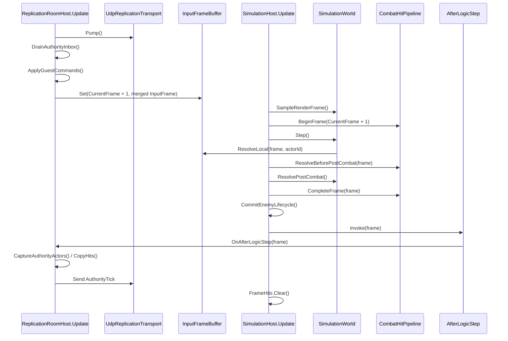
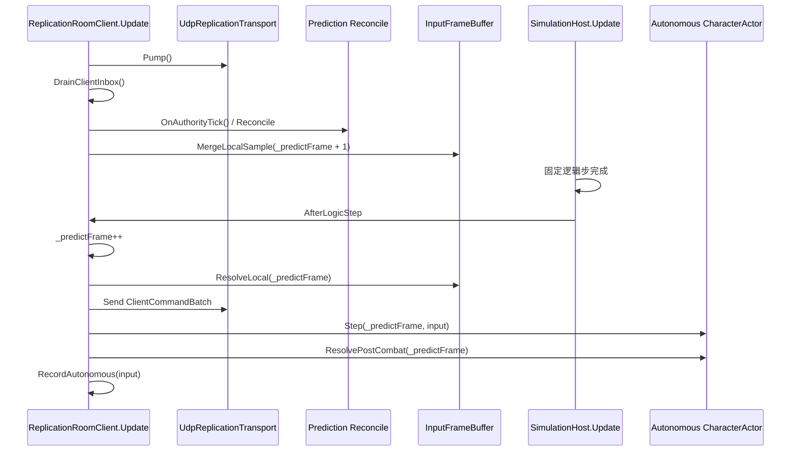
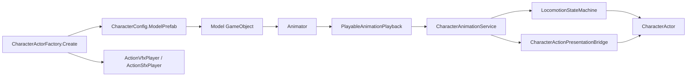

# NetSync W0 — 基线、帧序与 Dedicated 依赖审计

> 制定：2026-08-17  
> 对应：[`NETSYNC_FRAMEWORK_DEDICATED_MASTER_DEVELOPMENT_PLAN.md`](./NETSYNC_FRAMEWORK_DEDICATED_MASTER_DEVELOPMENT_PLAN.md) W0  
> 代码基线：当前工作树（协议版本仍为 `ReplicationCodec=1`、`RoomCodecVersion=1`）  
> 角色：W1～W4 搬迁前的行为证据；本文件不定义新协议或新玩法语义

---

## 0. 当前状态

| 项 | 状态 | 证据 / 待办 |
|---|---|---|
| Codec Golden Bytes | ✅ 2026-08-18 Test Runner 已验收 | `ProtocolGoldenBytesTests` |
| Host 固定帧顺序 | ✅ 2026-08-18 Test Runner 已验收 | `ReplicationFrameOrderTests`、`ReplicationProductionOrderTests` |
| Client 固定帧顺序 | ✅ 2026-08-18 Test Runner 已验收 | `ReplicationFrameOrderTests`、`ReplicationProductionOrderTests` |
| Host / Dedicated 耦合 | ✅ 静态审计完成 | §4 |
| 双进程玩法回归 | ✅ 2026-08-18 已验收 | §6 |
| Tick bytes / GC / Proxy / pending / RTT | ✅ HUD 与双进程基线已验收 | §5；典型 tickB≈250、cmdB=177、proxy=2、pending=0～2 |
| DS-Demo 范围 | ✅ 冻结 | 2～4 玩家、LAN、一场一进程、无重连 |

W0 已于 2026-08-18 随 M1 验收正式关闭；W1～W4 搬迁均受 Golden Bytes、生产帧序与双进程基线保护。Dedicated 从 W5 开始，仍不得修改既有纠偏阈值、动作或命中语义来掩盖架构问题。

---

## 1. 协议 Golden Bytes

### 1.1 固定样本

| 测试 | 固定内容 |
|---|---|
| `JoinRequest_GoldenBytes_FreezesEnvelopeAndVersionFields` | Room version、`JoinRequest` kind、content/protocol version |
| `ClientCommandBatch_GoldenBytes_FreezesInputFrameLayout` | 批数量、条目长度、FrameHint、Sender、InputFrame 全字段 |
| `EmptyAuthorityTick_GoldenBytes_FreezesTickHeader` | Replication version、AuthorityFrame、四个空数组 count |
| `HitAuthorityTick_GoldenBytes_FreezesHitLayout` | Hit frame、`SimHitKey`、ActionId、落点、方向、Spawn/Despawn count |

测试同时执行两种断言：

1. 当前 Writer 输出必须等于固定字节。
2. 固定字节必须能由当前 Reader 还原为原结构。

因此 W1 更换通用 Reader/Writer 时，只要线格式意外漂移，测试会立即失败。

### 1.2 相关文件

- `Assets/Tests/EditMode/Simulation/ProtocolGoldenBytesTests.cs`
- `Assets/Scripts/Domain/Simulation/Replication/ReplicationCodec.cs`
- `Assets/Scripts/Domain/Simulation/Replication/RoomCodec.cs`
- `Assets/Tests/EditMode/Simulation/ActorReplicationSnapshotTests.cs`
- `Assets/Tests/EditMode/Simulation/RoomCodecTests.cs`

---

## 2. Host 一格真实顺序

`ReplicationRoomHost` 的执行顺序为 `-150`，`SimulationHost` 为 `-100`。因此同一 Unity 渲染帧内，Room 先把收到的命令写入 `CurrentFrame + 1`，SimulationHost 后消费该槽。

### 2.1 已有自动保护

- `SimulationWorldTests.Step_ProducesInputBeforeActorConsumption`
- `SimulationWorldTests.ResolvePostCombat_RunsAfterAllActorsOnceInIdOrder`
- `SimulationWorldTests.Step_AdvancesOneFrameAndTicksActorsInIdOrder`
- `AuthorityTick_SortsActorsBySimActorId`
- `ReplicationFrameOrderTests.HostUpdate_RunsBeforeSimulationHostUpdate`
- `ReplicationFrameOrderTests.ClientUpdate_RunsBeforeSimulationHostUpdate`
- `ReplicationProductionOrderTests.HostFrame_ProductionSource_PreservesReceiveStepCaptureSendOrder`
- `ReplicationProductionOrderTests.ClientFrame_ProductionSource_PreservesReceiveSampleSendPredictOrder`

### 2.2 W0 特征测试边界

`ReplicationProductionOrderTests` 直接读取当前生产脚本的方法区间，冻结：

- `AfterLogicStep` 必须发生在 Combat / PostCombat / Commit 后、`FrameHits.Clear` 前。
- Host 命令写入 `CurrentFrame + 1`，然后才由 SimulationHost 推进。
- Client 收 Tick / Reconcile / Sample 发生在 Update；AfterLogicStep 中先 Send、后 Autonomous Predict。

这是 W0 搬迁保护网，不是长期框架 API。W2 删除旧 Room 入口时，必须删除该源码特征测试，并由新 Session / Replication 的运行时顺序测试直接替代，禁止保留旧入口只为让测试继续通过。

---

## 3. Client 一格真实顺序

Client 的 `ReplicationRoomClient.Update` 同样为 `-150`，先收权威 Tick 并合并渲染输入；`SimulationHost.Update(-100)` 产生逻辑步后，通过 `AfterLogicStep` 推进本地预测钟。

关键冻结点：

- 权威 Tick 先 Reconcile，渲染输入后写下一预测帧槽。
- 命令先加入最近 N 条冗余批并发送，再推进本地 Autonomous Actor。
- 本机预测不进 `SimulationWorld`，不 Collect 权威 Hitbox。
- `_predictFrame` 与 `AuthorityFrame` 是不同时间线；Join 时只做初始对齐。

---

## 4. Dedicated 阻塞依赖审计

### 4.1 Listen Host / 单 Guest 假设

| 假设 | 位置 | Dedicated 阻塞 |
|---|---|---|
| 角色只有 `ListenHost / Client` | `CombatWorldController.Role / IsAuthority` | 无 Dedicated ProcessRole |
| `CombatWorldController` 总会创建 Feedback 与 Room MonoBehaviour | `Awake / EnsureFeedbackController / EnsureRoomController` | Server Bootstrap 仍依赖场景表现入口 |
| 固定 `GuestPlayerId = 2` | `ReplicationRoomHost` | 无 N 玩家 Id 分配 |
| 单 `_guest` | `ReplicationRoomHost` | 连接、ACK、Idle 不能 per-connection |
| Join 必须查 `GetLocalPlayerQuery` | `TryAcceptPendingJoins` | 无 Host 本地玩家时永远不 Accept |
| JoinAccept 必须携带 `HostActorId` | `TrySpawnGuest` | Dedicated 无 Host Actor |
| Guest 使用 Host `CharacterConfig` | `TrySpawnGuest` | 无 Archetype / Loadout |
| Guest Spawn = Host Root + 2m | `TrySpawnGuest` | Spawn 不属于 Match |
| Host Snapshot 显式拼 local + guest + enemies | `CaptureAuthorityActors` | 无通用 Replicated Entity Registry |
| 单 Endpoint 判断 | `IsGuestEndpoint` | 无 ConnectionRegistry |
| UDP 广播所有 clients 同一字节 | `UdpReplicationTransport` + Host send | 无 per-connection ACK / Baseline |
| Client 敌人配置回退 `_enemyConfigs[0]` | `ReplicationRoomClient.ResolveConfig` | 多 Archetype 错配 |

### 4.2 Authority Actor 的表现依赖

当前 `CharacterActorFactory.Create` 在任何 Seat 创建时都会：

1. `Instantiate(config.ModelPrefab)`。
2. 查找 `Animator`，缺少即抛错。
3. 创建 `PlayableAnimationPlayback`。
4. 创建 `CharacterAnimationService`、`CharacterRootMotionDriver`。
5. 创建 `LocomotionFootstepPlayer`。
6. 创建 `ActionVfxPlayer`、`ActionSfxPlayer`。
7. 创建 `CharacterActionPresentationBridge`。

依赖链：

结论：

- `ReplicationSeat.Authority` 目前只控制是否挂权威 `HitboxFrameConsumer`，不代表 Headless 装配。
- `CharacterActor` 的模拟能力可复用，但工厂闭包不能直接用于 Dedicated。
- DS3 必须提供 Headless Authority 装配，并把 Locomotion 权威相位/时间从动画服务读数迁回模拟状态。
- 不应通过空 Animator Prefab 或 `UNITY_SERVER` 跳过异常来掩盖依赖。

### 4.3 Transport / Session 现状

- `IReplicationTransport` 方向固化为 Client→Authority / Authority→Clients。
- `UdpReplicationTransport` 能保存多个 Client Endpoint，但 Room 只承认 `_guest`。
- Room 同时拥有握手、Endpoint 身份、玩家创建、输入合并、Tick 构造和 HUD。
- 网络线程模型当前是 Unity 主线程 `Pump`；Dedicated 后仍应保持“收包入队，模拟线程消费”边界。

### 4.4 Server Dependency Guard 清单

W5 创建 Server Runtime 程序集时，必须自动检查：

- [ ] Server Bootstrap 不引用 `PlayerController`、Input、Camera、HUD、Feedback。
- [ ] Server Session 不引用 `ILocalPlayer` / `GetLocalPlayerQuery`。
- [ ] Server Authority Factory 不引用 `Animator`、Playable、ModelPrefab、VFX、SFX。
- [ ] `ACTNet.*` 不引用 `ACTGame.*` 或 `UnityEngine`。
- [ ] `Domain/Simulation` 不出现 `UNITY_SERVER` 条件分支。
- [ ] Server 只接受 Command / Request / ACK，不存在 Client Pose / HP / Damage 写入口。
- [ ] Connection、CommandStream、ACK、Idle、Baseline 均为 per-connection。
- [ ] Server 无 LocalPlayer 时仍可完成 Bootstrap → Listening。

---

## 5. 指标基线

### 5.1 当前可直接观察

| 指标 | 当前来源 | 状态 |
|---|---|---|
| AuthorityFrame | `ReplicationRoomHudInfo.AuthorityFrame` | 已有 |
| RTT | Client Heartbeat → `ReplicationRoomHudInfo.RttMs` | 已有 |
| 本机 HP | `ReplicationRoomHudInfo.HealthMilli` | 已有 |
| Pending prediction | `PredictedLocomotionDriver.PendingCount` + `PredictedActionAckQueue.PendingCount` | F3 HUD `pending` |
| Proxy 数 | `ReplicationRoomClient._proxies.Count` | F3 HUD `proxies` |
| Tick bytes | 完整 `AuthorityTick` Room payload length | F3 HUD `tickB` |
| Command bytes | 完整 `ClientCommandBatch` Room payload length | F3 HUD `cmdB` |
| GC alloc / frame | Unity Profiler | 待人工采样 |

### 5.2 采样条件

固定条件，后续 GF7 与 DS 压测均复用：

- Unity 2022.3.62f3c1 Development Editor。
- Host + 一名真 Client，场景与敌人数保持一致。
- 60Hz Simulation；Snapshot 当前每逻辑步一次。
- 依次采集：空闲 60 秒、持续移动 60 秒、持续战斗 60 秒。
- 每段记录平均 / p95 Tick bytes、Command bytes、GC alloc/frame、Proxy 数、pending command、RTT。

### 5.3 待填写记录

| 场景 | Tick B avg / p95 | Command B avg / p95 | GC B/frame | Proxy | Pending | RTT avg / p95 |
|---|---:|---:|---:|---:|---:|---:|
| 双进程当前场景·混合操作（2026-08-17 初测） | ≈250 / 待测 | 177 / 177 | 待测 | 2 | 操作时 0～2 | 待测 |
| 空闲 60s | 待测 | 待测 | 待测 | 待测 | 待测 | 待测 |
| 移动 60s | 待测 | 待测 | 待测 | 待测 | 待测 | 待测 |
| 战斗 60s | 待测 | 待测 | 待测 | 待测 | 待测 | 待测 |

W0 不为采指标改协议；若增加 Debug 计数，只允许只读观测。

初测解释：

- `cmdB=177` 与当前 `InputRedundancyCount=3` 完全吻合：Room 头 2B + count 4B + `3 × (length 4B + ClientCommand 53B)`。
- `proxies=2` 表示当前 Client 同时维护两个非 Owner 远端表现体；需结合场景确认其具体为队友 / 敌人组合。
- 玩家操作时 `pending=0～2` 表示预测记录入队后很快被 ACK 清理；当前未观察到持续增长，属健康现象。
- `tickB≈250` 是当前 Actor 数和字符串字段下的全量 Tick 初值；W0 正式基线仍需按空闲 / 移动 / 战斗各采 60 秒并记录 p95。

---

## 6. 双进程人工回归脚本

### 6.1 启动

- [ ] 主 Editor 以 Listen Host 启动。
- [ ] ParrelSync Clone 或第二进程以 Client 启动。
- [ ] Client 收到 JoinAccept；HUD 显示 `Joined`、AuthorityFrame 单调、RTT 非负。
- [ ] Host 与 Client 的 ContentVersion 一致。

### 6.2 移动与预测

- [ ] Client 前进、急停、A/D 折返。
- [ ] 观察本机即时响应，无每包硬吸。
- [ ] Host 看到 Guest 最终位置与 Client 一致。
- [ ] CameraLock 与 MoveReferenceYaw 行为与改前一致。

### 6.3 动作与战斗

- [ ] Client 普攻起手与连招表现立即播放。
- [ ] Client 闪避及闪避后 Sprint 恢复。
- [ ] Client 命中敌人：HP 只由 Host 扣减。
- [ ] Hit / Death 只播一次；无重复 Cue。
- [ ] Host 与 Client 最终 HP、ActionId、Actor 生死一致。

### 6.4 断线

- [ ] 关闭 Client。
- [ ] 10 秒 Idle 后 Host 剔除 Guest。
- [ ] Host 本地玩家与 AI 继续运行。

---

## 7. DS-Demo 冻结范围

| 项 | W0 决策 |
|---|---|
| 进程 | 一场一 Server 进程 |
| 玩家 | 2～4 名远端玩家；Server 无本地玩家 |
| 网络 | LAN Demo |
| Simulation | 固定 60Hz |
| 权威 | AI、Motor、Action、Numeric、Hit、Death 全在 Server |
| 重连 | 不做 |
| Matchmaking / Auth | 不做，只留未来 Adapter |
| Build | Windows / Linux Dedicated Build，DS6 验收 |

---

## 8. W0 出口

- [x] Golden Bytes 测试代码已建立。
- [x] Host / Client 真实帧序已审计。
- [x] Room `-150` 先于 SimulationHost `-100` 的测试代码已建立。
- [x] Host / Client 生产方法内关键调用顺序测试代码已建立。
- [x] LocalPlayer、固定 Guest、HostRoot Spawn 与表现依赖已定位。
- [x] DS-Demo 范围已冻结。
- [ ] Unity Test Runner：`ProtocolGoldenBytesTests` 全通过。
- [ ] Unity Test Runner：`ReplicationFrameOrderTests` 全通过。
- [ ] Unity Test Runner：`ReplicationProductionOrderTests` 全通过。
- [ ] 双进程人工回归 §6 全通过。
- [ ] 指标基线 §5.3 已填写。

全部关闭后，才能开始 W1 `ACTNet.Core`。

---

## 9. 变更日志

| 日期 | 说明 |
|---|---|
| 2026-08-17 | 初版：建立 Golden Bytes 证据索引，审计 Host/Client 帧序、Listen/单 Guest 假设、Authority 表现依赖、指标与人工回归基线 |
