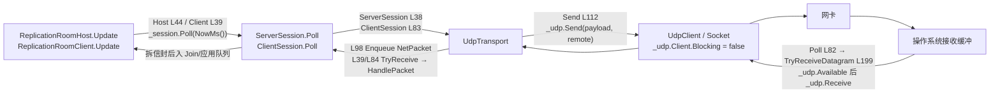
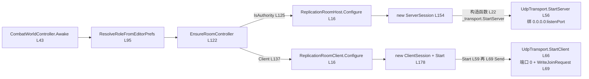
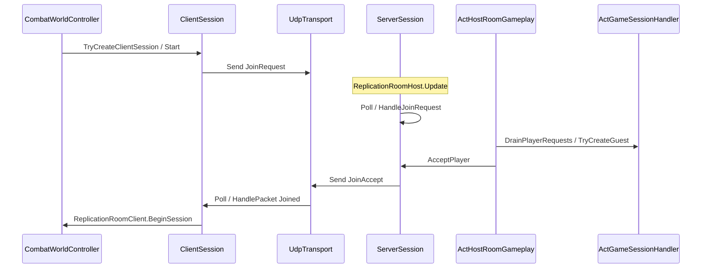
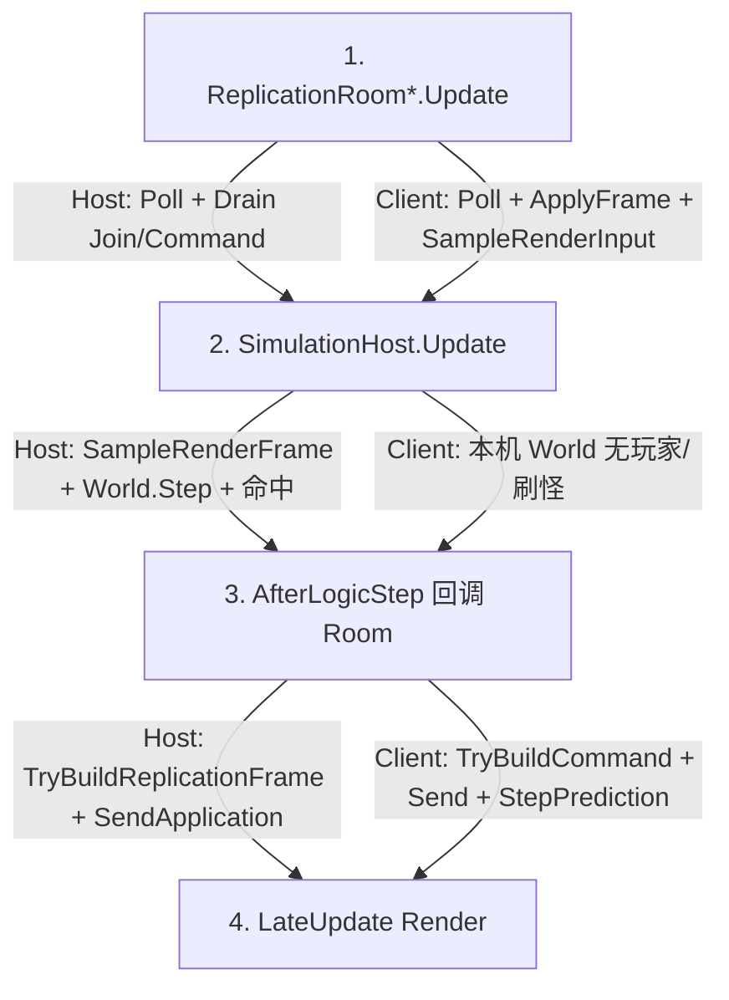
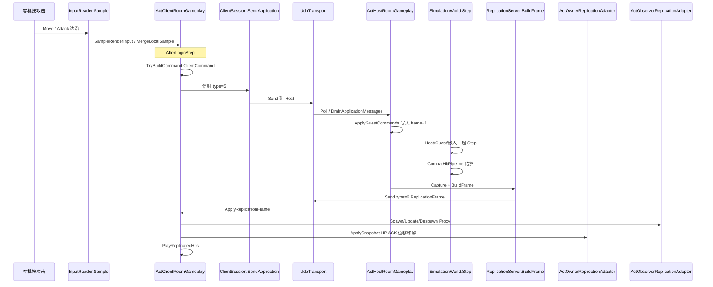

# NetSync M1 阶段性总结（W0～W4）

> 撰写：2026-08-18  
> 角色：**M1（W0～W4）历史备忘**（Host Facade 已删除）。现行阅读入口：[`../2026.8.23/NETSYNC_FROM_JOIN_TO_HIT.md`](../2026.8.23/NETSYNC_FROM_JOIN_TO_HIT.md)  
> 排期真源：[`../2026.8.17/NETSYNC_FRAMEWORK_DEDICATED_MASTER_DEVELOPMENT_PLAN.md`](../2026.8.17/NETSYNC_FRAMEWORK_DEDICATED_MASTER_DEVELOPMENT_PLAN.md)  
> 专项方案：[`../2026.8.17/NETSYNC_GENERIC_CORE_GAMEPLAY_SEPARATION_PLAN.md`](../2026.8.17/NETSYNC_GENERIC_CORE_GAMEPLAY_SEPARATION_PLAN.md)（GF0～GF4 已关闭）  
> NS5 时期结构说明：[`../2026.8.15/NETWORK_SYNC.md`](../2026.8.15/NETWORK_SYNC.md)（下行已改为 `ReplicationFrame`，勿再按 `AuthorityTick` 读生产路径）  
> 约定：`.cursor/skills/actgame-architecture/CONVENTIONS.md`「复制契约 / 网络 Room 薄 Facade」  
> 本文以 `Assets/Scripts/**` 为准；文档与代码冲突时改文档。

---

## 0. 一句话

组队 PVE 是 **Listen Host 权威状态同步**：玩家只上行量化 `InputFrame`（`ClientCommand`），权威独跑现有 `SimulationWorld`（60Hz），下行 `ReplicationFrame`（显式 Spawn/Update/Despawn + appliedHint + 命中事件）。客机本机用同一份 `CharacterActor`（`ReplicationSeat.Autonomous`）先演走跑和招式；**命中、HP、硬直只认 Host 的 `CombatHitPipeline`。** `ACTNet.*` 不引用 Unity / ACT 玩法；Room 只驱动 Session，Gameplay 在 `Act*RoomGameplay`。

单机一人进关也是 Listen Host，不另开 Offline 模拟核。W5 Dedicated Bootstrap 已切独立运行时，见 [`../2026.8.19/NETSYNC_W5_STAGE_SUMMARY.md`](../2026.8.19/NETSYNC_W5_STAGE_SUMMARY.md)；权威 World 仍属 W6。

---

## 1. 本阶段交付了什么

| Wave | 对应 | 交付 | 出口 |
|------|------|------|------|
| W0 | GF0 | Golden Bytes、Host/Client 帧序测试、双进程回归脚本、HUD 指标基线、Dedicated 依赖审计 | ✅ 2026-08-18 |
| W1 | GF1 | 零依赖 `ACTNet.Core`：Id / Tick / Sequence / 版本 / 有界小端 Buffer | ✅ 2026-08-18 |
| W2 | GF2 | `ACTNet.Transport`（`INetTransport` / UDP / Loopback）+ `ACTNet.Session`（Join / Heartbeat / Kick / 应用消息队列） | ✅ 2026-08-18 |
| W3 | GF3 | `ACTNet.Replication`：full-set 差分、Schema、Sequence 丢旧；生产切到 `ReplicationFrame`；删除 `AuthorityTick` | ✅ 2026-08-18 |
| W4 | GF4 | Authority / Owner / Observer / Content / Schema Adapter；`ActHostRoomGameplay` / `ActClientRoomGameplay`；Room 收成薄 Facade | ✅ 2026-08-18 |
| **M1** | GF0～GF4 | `ACTNet.*` 零反向依赖；Room 不再兼任 Gameplay Driver | ✅ 2026-08-18 |

**本阶段明确没做**

- 不改走跑 2m 纠偏、命中公式、ActionSim 语义。
- 不做 Dedicated、匹配、重连、可靠通道、Delta。
- 不把 `ActionId` / Hit / Death 写进 `ACTNet.*`。
- 不保留 Room 内旧 Gameplay 与 Adapter 双轨。

---

## 2. 当前分层

依赖只允许从上往下。`ACTNet.*` 不知道 Character / Action / Unity。

```
CombatWorldController          场景 Composition Root：定角色、建 UDP Session、挂 Room
  ReplicationRoomHost/Client   薄 Facade：Poll、收发应用消息、AfterLogicStep、HUD
    ActHost/ClientRoomGameplay ACT 编排：Join 建 Guest、灌输入、Capture、预测、Proxy、Hit Cue
      Act*ReplicationAdapter   权威 / Owner / Observer 映射
      ActContentRegistry       动作 Catalog + Archetype + CharacterConfig 唯一真源
      ActCharacterSnapshotSchema  CharacterActor → V1 线格式
    ServerSession/ClientSession  Join / 心跳 / 超时；拆信封后把应用包入队
      UdpTransport.Poll/Send   套接字收发
    ReplicationServer/Client   full-set 差分 / Sequence 原子应用
    SimulationHost/World       仅 Host 权威步进（客机本机玩家不进 World）
```

| 层 | 入口类型 | 职责 |
|----|----------|------|
| App 房间 | `CombatWorldController` | `Awake` 读菜单/ParrelSync，创建 `ServerSession` 或 `ClientSession` |
| App Facade | `ReplicationRoomHost` / `ReplicationRoomClient` | 每帧 `Poll`；逻辑步后发送 Frame 或 Command |
| App Gameplay | `ActHostRoomGameplay` / `ActClientRoomGameplay` | Guest、命令合并、Capture、Owner 预测、Observer、Hit Cue |
| ACT Adapter | `ActAuthority/Owner/ObserverReplicationAdapter` | 输入灌入、快照、和解、Proxy 生命周期 |
| Session | `ServerSession` / `ClientSession` | 控制消息 + 已鉴权应用队列 |
| Transport | `UdpTransport` | 非阻塞套接字；`Poll` 入队，`Send` 出站 |
| Replication | `ReplicationServer` / `ReplicationClient` | Spawn/Update/Despawn + Sequence |
| 模拟 | `SimulationHost` → `SimulationWorld` | 60Hz Input → Step → 命中 → `AfterLogicStep` |

### 2.1 套接字收发（Poll / Send）

Room / Session **不碰套接字**。每帧只调 `INetTransport.Poll` / `Send`；`UdpTransport` 把字节交给 `UdpClient`（底层 `Socket`）。`Poll` 不是向对面问状态，只是把 **OS 接收缓冲里已经到的数据报** 搬进 `_received`。



| 箭头 | 位置 | 实现逻辑 |
|------|------|----------|
| Room → Session | `ReplicationRoomHost.cs` L44；`ReplicationRoomClient.cs` L39 | 每渲染帧泵一次 Session；Room 自己不 `Receive` |
| Session → Transport.Poll | `ServerSession.cs` L38；`ClientSession.cs` L83 | 先把套接字数据报灌进队列，再 `while TryReceive` 拆信封 |
| Transport.Send | `UdpTransport.cs` L103–114 | 用 `NetConnectionId` 查远端 `IPEndPoint`，立刻 `_udp.Send`；通道头尚未进线格式 |
| Transport.Poll | `UdpTransport.cs` L77–99、L189–212 | `_udp.Available<=0` 则停；否则非阻塞 `Receive`，按远端地址映射 `NetConnectionId` 后入队 |
| Session 消费 | `ServerSession.cs` L39–43；`ClientSession.cs` L84–90 | `HandlePacket`：控制消息自己消化，应用包入队给 Room Drain |

```39:46:Assets/Scripts/App/Controllers/Gameplay/ReplicationRoomHost.cs
    void Update()
    {
        if (_session == null)
            return;

        _session.Poll(NowMs());
        _gameplay?.DrainPlayerRequests(_session);
        _gameplay?.DrainApplicationMessages(_session);
    }
```

```35:55:Assets/Scripts/Framework/ACTNet/Session/ServerSession.cs
    public void Poll(long nowMs)
    {
        EnsureNotDisposed();
        _transport.Poll();
        while (_transport.TryReceive(out NetPacket packet))
        {
            try
            {
                HandlePacket(packet, nowMs);
            }
            catch (Exception)
            {
                DisconnectInternal(
                    packet.ConnectionId,
                    DisconnectReason.MalformedPacket,
                    notifyClient: false);
            }
        }

        DisconnectTimedOut(nowMs);
    }
```

```77:99:Assets/Scripts/Framework/ACTNet/Transport/UdpTransport.cs
    public void Poll()
    {
        if (_udp == null)
            return;

        while (TryReceiveDatagram(out byte[] payload, out IPEndPoint remote))
        {
            NetConnectionId connectionId;
            if (IsServer)
                connectionId = GetOrCreateServerConnection(remote);
            else
            {
                if (_clientServerEndPoint == null || !_clientServerEndPoint.Equals(remote))
                    continue;
                connectionId = ClientServerConnection;
            }

            _received.Enqueue(new NetPacket(connectionId, NetChannel.Unspecified, payload));
        }
    }
```

```103:114:Assets/Scripts/Framework/ACTNet/Transport/UdpTransport.cs
    public void Send(NetConnectionId connectionId, NetChannel channel, byte[] payload)
    {
        if (payload == null)
            throw new ArgumentNullException(nameof(payload));
        EnsureRunning();
        if (!_remoteByConnection.TryGetValue(connectionId, out IPEndPoint remote))
            throw new InvalidOperationException($"连接不存在：{connectionId}。");

        _udp.Send(payload, payload.Length, remote);
        _bytesSent += payload.Length;
        _packetsSent++;
    }
```

`TryReceiveDatagram`（`UdpTransport.cs` L189）：缓冲空则返回 false，不卡住 Unity 主线程（`WouldBlock` 当「本帧没包」）。

---

## 3. 进关：玩家还没操作时发生了什么

`CombatWorldController.Awake` 是 Composition Root：先定角色，再创建已启动的 Session，最后挂薄 Room。套接字在 **构造 Session 时** 就绑好；Join 在 **ClientSession.Start** 里立刻发出，不等第一帧 `Update`。



| 步骤 | 位置 | 实现逻辑 |
|------|------|----------|
| 定角色 | `CombatWorldController.cs` L43–57、L95–108 | `Awake` 设 `Current`；Editor 下 ParrelSync 克隆强制 Client→`127.0.0.1:7777`，否则读菜单 EditorPrefs |
| 挂 Room | `EnsureRoomController` L122–137 | `IsAuthority`（ListenHost）加 `ReplicationRoomHost`，否则加 `ReplicationRoomClient`；`Configure` 注入已创建的 Session |
| Host 绑端口 | `TryCreateServerSession` L149–157 → `ServerSession` 构造 L17–22 → `UdpTransport.StartServer` L56–62 | `new UdpClient(bindAddress, listenPort)`，`Blocking=false`；失败则 `Dispose` 并 HUD `BindFailed` |
| Client 发 Join | `TryCreateClientSession` L172–181 → `ClientSession.Start` L53–73 → `UdpTransport.StartClient` L66–73 | 本机绑 `Any:0`（OS 分配临时端口），记住 Host 端点；`SessionCodec.WriteJoinRequest` 后立刻 `Send`，`State=Connecting` |
| Room 收引用 | `ReplicationRoomHost.Configure` L16；`ReplicationRoomClient.Configure` L16 | 只保存 `world`/`session` 并订阅 `AfterLogicStep`；Gameplay Service 在 Room `Start` 里 `new` |

```43:58:Assets/Scripts/App/Controllers/Combat/CombatWorldController.cs
    void Awake()
    {
        if (Current != null && Current != this)
        {
            Debug.LogWarning("CombatWorldController: 场景中存在多个实例，后创建的实例将被禁用。", this);
            enabled = false;
            return;
        }

        Current = this;
        ResolveRoleFromEditorPrefs();
        EnsureSimulationHost();
        ApplyStaticCollisionBake();
        EnsureFeedbackController();
        EnsureRoomController();
    }
```

```121:137:Assets/Scripts/App/Controllers/Combat/CombatWorldController.cs
    void EnsureRoomController()
    {
        SessionConfig sessionConfig = CreateSessionConfig();
        if (IsAuthority)
        {
            ReplicationRoomHost host = GetComponent<ReplicationRoomHost>();
            if (host == null)
                host = gameObject.AddComponent<ReplicationRoomHost>();
            host.Configure(this, TryCreateServerSession(sessionConfig));
            return;
        }

        ReplicationRoomClient client = GetComponent<ReplicationRoomClient>();
        if (client == null)
            client = gameObject.AddComponent<ReplicationRoomClient>();
        client.Configure(this, TryCreateClientSession(sessionConfig));
    }
```

```149:183:Assets/Scripts/App/Controllers/Combat/CombatWorldController.cs
    ServerSession TryCreateServerSession(SessionConfig config)
    {
        var transport = new UdpTransport();
        try
        {
            var session = new ServerSession(
                transport,
                config,
                new NetEndpoint("0.0.0.0", listenPort, allowEphemeralPort: true));
            Debug.Log($"CombatWorldController: 监听 UDP {session.LocalEndpoint}。", this);
            return session;
        }
        catch (Exception ex)
        {
            transport.Dispose();
            Debug.LogError(
                $"CombatWorldController: 绑定端口 {listenPort} 失败，房间不可加入。{ex.Message}",
                this);
            return null;
        }
    }
```

```172:196:Assets/Scripts/App/Controllers/Combat/CombatWorldController.cs
    ClientSession TryCreateClientSession(SessionConfig config)
    {
        var transport = new UdpTransport();
        ClientSession session = null;
        try
        {
            session = new ClientSession(transport, config);
            session.Start(
                new NetEndpoint(joinHost, listenPort),
                DateTimeOffset.UtcNow.ToUnixTimeMilliseconds());
            Debug.Log($"CombatWorldController: 已请求加入 {joinHost}:{listenPort}。", this);
            return session;
        }
        catch (Exception ex)
        {
            if (session != null)
                session.Dispose();
            else
                transport.Dispose();
            Debug.LogError(
                $"CombatWorldController: 连接 {joinHost}:{listenPort} 失败。{ex.Message}",
                this);
            return null;
        }
    }
```

```17:22:Assets/Scripts/Framework/ACTNet/Session/ServerSession.cs
    public ServerSession(INetTransport transport, SessionConfig config, NetEndpoint endpoint)
    {
        _transport = transport ?? throw new ArgumentNullException(nameof(transport));
        _config = config;
        _players = new PlayerRegistry(config.FirstPlayerId);
        _transport.StartServer(endpoint);
    }
```

```53:73:Assets/Scripts/Framework/ACTNet/Session/ClientSession.cs
    public void Start(NetEndpoint endpoint, long nowMs)
    {
        _transport.StartClient(endpoint);
        _serverConnection = _transport.Connections[0];
        _transport.Send(
            _serverConnection,
            NetChannel.ControlReliableOrdered,
            SessionCodec.WriteJoinRequest(in request));
        State = ClientSessionState.Connecting;
    }
```

```56:73:Assets/Scripts/Framework/ACTNet/Transport/UdpTransport.cs
    public void StartServer(NetEndpoint endpoint)
    {
        _udp = new UdpClient(new IPEndPoint(bindAddress, endpoint.Port));
        _udp.Client.Blocking = false;
        IsServer = true;
    }

    public void StartClient(NetEndpoint endpoint)
    {
        _clientServerEndPoint = new IPEndPoint(ResolveRemoteAddress(endpoint.Host), endpoint.Port);
        _udp = new UdpClient(new IPEndPoint(IPAddress.Any, 0));
        _udp.Client.Blocking = false;
        AddConnection(ClientServerConnection, _clientServerEndPoint);
    }
```

1. 菜单 `ACTGame/Room/Use Listen Host` 或 `Use Client (127.0.0.1)` 写 EditorPrefs；ParrelSync 克隆强制 Client → `127.0.0.1:7777`。
2. `CombatWorldController.Awake` → `ResolveRoleFromEditorPrefs` → `EnsureRoomController`。
3. **Host**：`new UdpTransport` + `new ServerSession(..., 0.0.0.0:7777)` → `ReplicationRoomHost.Configure`。本机 `PlayerController` 走 Authority 装配，`OnEnable` 里 `SimulationHost.RegisterPlayer`。
4. **Client**：`new ClientSession` → `ClientSession.Start` → `UdpTransport.StartClient` + `SessionCodec.WriteJoinRequest`。本机 `PlayerController.BuildClientSeat`：Autonomous Actor，**不** `RegisterPlayer`。
5. Host `ReplicationRoomHost.Update`：`ServerSession.Poll` → `HandleJoinRequest`（版本/容量）→ `TryDequeuePlayerRequest`。
6. `ActHostRoomGameplay.DrainPlayerRequests` → `ActGameSessionHandler.TryCreateGuest`：Host 场景 `RemotePlayer` + Authority `CharacterActor`（无 `InputReader`），出生在 Host 玩家右侧 +2m，再 `RegisterPlayer`。
7. `ServerSession.AcceptPlayer` 下发 `JoinAccept`：`PlayerId`、Guest `EntityId`、Host `AuthorityEntityId`、当时 `AuthorityTick`。
8. 客机 `ClientSession.HandlePacket` → `Joined`；`ReplicationRoomClient.OnSessionJoined` → `ActClientRoomGameplay.BeginSession`，预测时钟对齐 Accept.Tick。

敌人只在 Host 刷：`EnemySpawnController.Start` 发现不是权威就 return。客机敌人靠下行 Spawn 出 `RemoteCharacterProxy`。



---

## 4. 每帧执行序

`DefaultExecutionOrder`：Room `-150`，`SimulationHost` `-100`。先收包，再步进，再发包。



**Host 一格**

1. `ReplicationRoomHost.Update` → `ServerSession.Poll` → `UdpTransport.Poll` / `TryReceive` / `HandlePacket`
2. `ActHostRoomGameplay.DrainPlayerRequests` / `DrainApplicationMessages`
3. `SimulationHost.Update` → `SimulationWorld.SampleRenderFrame`（Host 本机设备）→ `World.Step` → `CombatHitPipeline` → `AfterLogicStep`
4. `ActHostRoomGameplay.TryBuildReplicationFrame` → `ServerSession.SendApplication(ReplicationFrame)`

**Client 一格**

1. `ReplicationRoomClient.Update` → `ClientSession.Poll`
2. `DrainApplicationMessages` → `ActClientRoomGameplay.ApplyReplicationFrame`
3. `SampleRenderInput`（合并到 `_predictFrame + 1`）
4. `AfterLogicStep` → `TryBuildCommand` → **先** `ClientSession.SendApplication(ClientCommand)` → **再** `StepPrediction`

客机不变式：**命令正文必须在 `StepPrediction()` 之前发出。**

---

## 5. 玩家操作走哪条函数

### 5.1 设备如何变成 `InputFrame`

玩家推轴、按攻击 **不直接改坐标**。两端都先量化：

| 字段 | 含义 |
|------|------|
| `MoveX` / `MoveY` | `sbyte` [-127, 127] |
| `ButtonsPressed/Held/Released` | 离散键 bitset（攻击、闪避等，来自 `GameplayIntentProfile`） |
| `MoveReferenceYawQuantized` | 相机偏航 0.1°，保证「相对镜头前进」一致 |

采集：`InputReader.Sample`。`CharacterActorFactory` 会 `ConfigureDiscreteInputs`。

**不进同步：** `Look`、镜头锁定（只给本机相机）。`CameraManager` 经 `PlayerController.StageMoveReferenceYaw` 写入 yaw。

| 座位 | 谁采样 | 输入进哪 | 谁 `CharacterActor.Step` |
|------|--------|----------|--------------------------|
| Host 本机 | `SimulationWorld.SampleRenderFrame` → `CharacterActor.SampleRenderFrame` | Host `InputFrameBuffer` | `SimulationWorld.Step` |
| 客机本机 | `ActClientRoomGameplay.SampleRenderInput` | 客机自己的 `InputFrameBuffer` | `ActClientRoomGameplay.StepPrediction` |
| Host 上的 Guest | 无设备；等 `ClientCommand` | 同一份 Host `InputFrameBuffer` | `SimulationWorld.Step` |

高帧率多次渲染：`InputFrame.MergeSample` 对 Pressed/Released 做 OR，避免漏边沿。

### 5.2 客机按下攻击：完整往返



逐步对应：

1. **采输入** — `ReplicationRoomClient.Update` → `ActClientRoomGameplay.SampleRenderInput` → `InputReader.Sample(_predictFrame + 1)` → `InputFrameBuffer.MergeLocalSample`。
2. **组包** — `TryBuildCommand`：`_predictFrame++`，`ResolveLocal`，`new ClientCommand(predictFrame, PlayerId, input)`。`RememberCommand` 保留最近 3 条（`InputRedundancyCount`）。`RoomCodec.WriteClientCommandBatch` → `ReplicationCodec.WriteClientCommand`。
3. **发送** — `ClientSession.SendApplication(RoomMessageKind.ClientCommand, CommandUnreliableRedundant)` → Session 信封 → `UdpTransport.Send`。
4. **本机预测** — `StepPrediction`：`CharacterActor.Step` + `ResolvePostCombat` + `PresentPredictedHitStop` + `AutonomousSoftBodySolver` + `ActOwnerReplicationAdapter.RecordAutonomous`。Autonomous **不 Collect**，不算真伤。
5. **Host 收包** — 下一格 Room.Update：`DrainApplicationMessages` 只认同一 Guest 连接的 type=5。`RoomRemoteInputMerge.TryMergeUnapplied` 按 `FrameHint` 排序，丢掉已用 Hint，合并进 `currentFrame + 1`（迟到窗口 8 帧）。`WithIdentity` 改写成 Guest `SimActorId` 后 `InputFrameBuffer.Set`。
6. **权威步进** — `SimulationWorld.Step`：敌人 `ProduceInput`，再按 `SimActorId` 升序 `ResolveLocal` + `Step`。Host 本机吃设备；Guest 吃网络输入；敌人吃 Brain。然后 `CombatHitPipeline` 结算，命中进 `SimulationHost.FrameHits`。
7. **构帧** — `ActAuthorityReplicationAdapter.CaptureAuthorityActors`（Host 玩家 + Guest + 敌人）→ `ActCharacterSnapshotSchema.Capture`（位姿、动作 Id、HP、Hit/Death 边沿、步态；不拍镜头/Lean）→ `CopyHits` 补 ActionId → `ActReplicationApplicationPayloadCodec.Encode(appliedHint, hits)` → `ReplicationServer.BuildFrame` → `ReplicationFrameCodec.Encode` → `SendApplication(ReplicationFrame)`。
8. **客机落地** — `ReplicationClient.ApplyFrame`（旧 Sequence 整帧丢）→ Observer 处理他人/敌人 Proxy；自己的 `EntityId` 交给 `ActOwnerReplicationAdapter.ApplySnapshot`（HP、Action Ack、位移和解；Hit/Death 硬吸）→ `PlayReplicatedHits` 按 `SimHitKey` 去重播 Cue。
9. **画面** — `ActClientRoomGameplay.Render` 用 `SimulationHost.InterpolationAlpha` 插值 Owner 与 Proxy。

`appliedHint`：本步真正灌进远端命令时为最新 `FrameHint`；CarryForward / 无新命令必须下发 **0**，禁止用旧预测位姿和解当前权威帧。

### 5.3 Host 本机玩家操作

路径更短，**不上网**：

1. 同一套 `InputReader`
2. `SimulationWorld.SampleRenderFrame` → Host 玩家 `CharacterActor.SampleRenderFrame`
3. 同一次 `World.Step` 出权威结果和命中
4. 有 Guest 时打进 `ReplicationFrame`；客机看到的是 **Proxy 上的 Host 玩家**

Host 屏幕上的 Guest 是真 `CharacterActor`；客机屏幕上的 Host 玩家才是 Proxy。

---

## 6. 线上传什么

UDP 最外层都是 Session 信封：`[version=1][messageType][body]`（`SessionCodec`）。

| 方向 | messageType | 通道意图 | body |
|------|-------------|----------|------|
| C→H | JoinRequest / Heartbeat | 控制 | 版本、时间戳 |
| H→C | JoinAccept / Reject / Kick / Heartbeat 回显 | 控制 | 身份、实体 Id、Tick |
| C→H | `RoomMessageKind.ClientCommand = 5` | 不可靠 + 冗余 | 最近最多 3 条：FrameHint + PlayerId + `InputFrame` |
| H→C | `RoomMessageKind.ReplicationFrame = 6` | 不可靠 + 序号 | Tick、Sequence、Spawn/Update/Despawn、appliedHint、Hits |

`ClientCommand` **不含** HP、命中、世界坐标、招式名。招式由权威 `CharacterActor.Step` 根据按钮图自己选。

`Poll` 不是向对面问状态：它把**已经到达本机套接字**的数据报搬进队列并解析。对面回包是因为之前 `Send` 过。

---

## 7. 三种座位（不许 `if (isClient)` 当网关）

差异用装配，不在 State 里写网角色分支。

| 座位 | 谁创建 | 跑什么 | 不跑什么 |
|------|--------|--------|----------|
| Authority | Host 本机 `PlayerController`、Guest `RemotePlayerSeat`、全部敌人 | 完整 `CharacterActor.Step` + Collect + Numeric | 客机设备（Guest 吃收到的 `InputFrame`） |
| Autonomous | 客机 `PlayerController.BuildClientSeat` | 同一 `CharacterActor.Step`（无 Hitbox、不进 World） | Collect、`SimulationWorld.Register` |
| Simulated | `ActRemoteProxyFactory` → `RemoteCharacterProxy` | `ApplySnapshot`：位姿插值、Clip Seek、过点 VFX | `ActionSim.Step`、BT、Collect |

Listen Host 本地 **不预测**（0 RTT）。`ILocalPlayer.IsLocalPredicted` 在 Host 恒为 `false`。

---

## 8. 验收基线（2026-08-18 已关）

| 项 | 结果 |
|----|------|
| Test Runner | Golden Bytes、Session、Replication、`RoomArchitectureBoundaryTests`、生产顺序测试 |
| 双进程 Play | 移动、急停、折返、攻击、连招、闪避、受击、死亡、CameraLock、断线 |
| HUD 典型值 | tickB≈250，cmdB=177，proxies=2，pending 0～2 |
| 架构守卫 | Room 不得含 CharacterConfig / PlayerController / EnemySpawn / Proxy / Hit Cue；`ACTNet.*` 不得含 Unity / ACT 玩法类型 |

**怎么再跑**

1. 原工程菜单 `ACTGame/Room/Use Listen Host`，克隆自动 Client。
2. 打开工程等编译；两边 Play。
3. F3 看 Room 行：Host `ClientJoined`，Client `Joined`，RTT 与 pending 合理。

---

## 9. 本阶段删除的旧路径

- `AuthorityTick` 全量数组、缺席即销毁、首敌配置回退
- Room 内 Character 扫描、Guest 生成、预测/和解、Proxy、Hit Cue/HitStop 实现（迁到 App Service/Adapter）
- 独立 `CharacterReplicationCapture`（由 `ActCharacterSnapshotSchema` 取代）
- `CharacterReplicationContentRegistry`（并入 `ActContentRegistry`）
- Domain 旧 RemoteProxy Factory（`ActRemoteProxyFactory` 唯一入口）
- Host 同机 ±2m 预览、`NetGameController` 双轨

禁止恢复上述符号作为兼容层。

---

## 10. 下一阶段（未开始）

**W5 Dedicated Bootstrap（2026-08-19 代码已切）**：独立 `DedicatedServerRuntime`，不是 Listen 开关。Listening / N 玩家 Session / 每连接 ACK 已落地；权威 World 属 W6。见 [`../2026.8.19/NETSYNC_W5_STAGE_SUMMARY.md`](../2026.8.19/NETSYNC_W5_STAGE_SUMMARY.md)。

之后：W6 Headless Content → W7 Match Replication → W8 Dedicated Build（M2 DS-Demo）。

---

## 11. 关键文件

| 路径 | 在链路里做什么 |
|------|----------------|
| `App/Controllers/Combat/CombatWorldController.cs` | 定角色、建 Session、挂 Room |
| `App/Controllers/Gameplay/ReplicationRoomHost.cs` | Host Poll / 发送 Frame |
| `App/Controllers/Gameplay/ReplicationRoomClient.cs` | Client Poll / 发送 Command / 先发后预测 |
| `App/Controllers/Gameplay/PlayerController.cs` | Authority 进 World；Client 装 Autonomous |
| `App/Controllers/Gameplay/SimulationHost.cs` | 60Hz Step + `AfterLogicStep` + FrameHits |
| `App/Networking/Services/ActHostRoomGameplay.cs` | Guest、灌命令、Capture、构帧 |
| `App/Networking/Services/ActClientRoomGameplay.cs` | 采样、组命令、预测、落地、Render |
| `App/Networking/Adapters/ActAuthorityReplicationAdapter.cs` | 远端输入 + Capture |
| `App/Networking/Adapters/ActOwnerReplicationAdapter.cs` | HP / Ack / 位移和解 |
| `App/Networking/Adapters/ActObserverReplicationAdapter.cs` | Proxy 生命周期 |
| `App/Networking/Adapters/ActGameSessionHandler.cs` | 创建/销毁 Guest Actor |
| `Framework/ACTNet/Session/ServerSession.cs` / `ClientSession.cs` | 握手与应用队列 |
| `Framework/ACTNet/Transport/UdpTransport.cs` | 套接字 Poll / Send |
| `Framework/ACTNet/Replication/ReplicationServer.cs` / `ReplicationClient.cs` | 差分与 Sequence |
| `Domain/Simulation/Input/InputFrame.cs` | 上行唯一玩法载荷 |
| `Domain/Simulation/Replication/ClientCommand.cs` / `RoomCodec.cs` | 命令批 |

---

## 变更日志

| 日期 | 说明 |
|------|------|
| 2026-08-18 | 初版：按 M1 验收后的代码整理阶段结论、分层、入房、每帧序、客机攻击往返与线格式 |
| 2026-08-18 | §2.1 / §3 补 Poll-Send 套接字图与 Awake 进关图；边上标文件行号并附实现摘录 |
| 2026-08-19 | 指向 W5 独立 Runtime 备忘；Dedicated 不再写「尚未开始」 |
