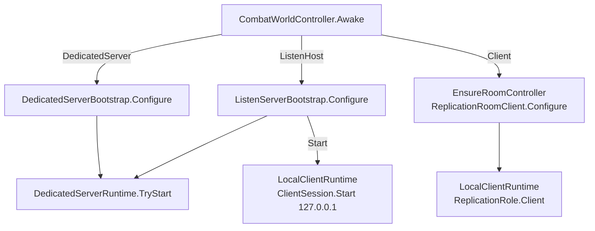
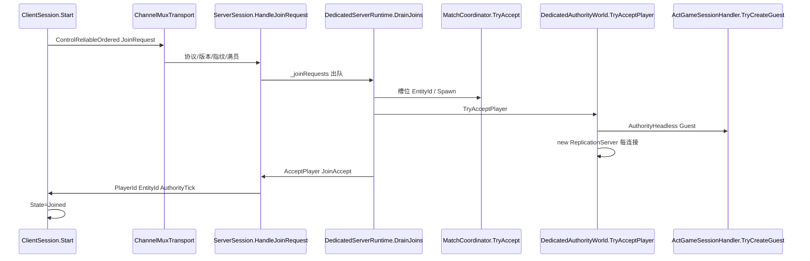
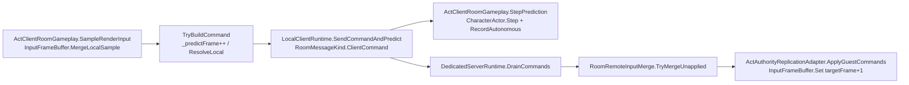
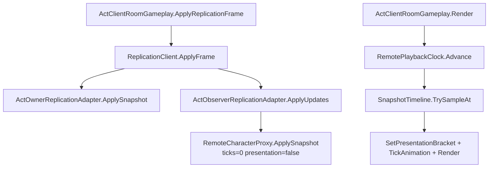
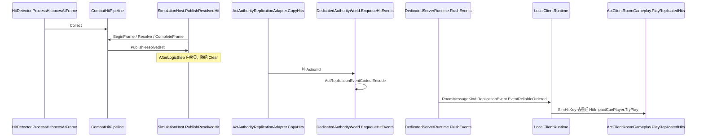

# NetSync：从入房到命中（现行实现阅读入口）

> 撰写：2026-08-23  
> 角色：**当前代码的端到端学习笔记**（对照 `Assets/Scripts/**`，不是下一阶段实施计划，不是验收勾选表）  
> 冲突时以代码为准，并回头改本文。  
> 排期：[`../2026.8.17/NETSYNC_FRAMEWORK_DEDICATED_MASTER_DEVELOPMENT_PLAN.md`](../2026.8.17/NETSYNC_FRAMEWORK_DEDICATED_MASTER_DEVELOPMENT_PLAN.md)  
> 运行时：`.cursor/skills/actgame-architecture/`（ARCHITECTURE / TECHNICAL / CONVENTIONS）  
> 踩坑：[`../2026.8.20/NETSYNC_ARCHITECTURE_PROBLEMS.md`](../2026.8.20/NETSYNC_ARCHITECTURE_PROBLEMS.md)

**本文覆盖到 2026-08-23 的生产路径**：W9 Listen 组合 + W10 通道/预测骨架 + W11 Compact + 远端播放头 / Urgent / 战斗立刻 Apply。  
**明确未关出口**：W10 Clumsy Play、W11 远敌裁剪 Play、R2。不得称公网可用。

---

## 0. 怎么读、读到哪算「完整」

没有一份文档能替代打开下面这些类型。本文把 **Join → 命令 → 权威步进 → Compact 构帧 → Owner 和解 / Observer 表现 → 可靠命中** 串成一条链；字段级字节布局以 Codec 为准。

| 你想弄清 | 先读本节 | 再打开 |
|----------|----------|--------|
| 本机到底是谁 | §2 三角色 | `CombatWorldController.Awake` |
| UDP 上到底有几层头 | §4 信封 | `ChannelMuxTransport.Encode` → `SessionCodec` → `RoomMessageKind` |
| 入房分配了什么 | §5 Join / §6 Match | `ServerSession.HandleJoinRequest` → `DedicatedServerRuntime.DrainJoins` |
| 按键怎么进权威 | §8 命令 | `ActClientRoomGameplay.TryBuildCommand` → `RoomRemoteInputMerge` |
| 一帧模拟怎么走 | §9 权威步进 | `SimulationHost.StepOnce` |
| 为什么别人 30Hz 还不卡死 | §10～§12 | `ReplicationServer.BuildFrame` + `RemotePlaybackClock` |
| 刀光 / 受击谁先到 | §12 / §13 | `ActObserverReplicationAdapter.ApplyUpdates` vs `FlushEvents` |
| 丢包后怎么办 | §14 Recover | `LocalClientRuntime` Rejected 分支 |

纠偏阈值（2m 硬吸、Restore+Replay）仍以 [`../2026.8.15/UE_ALIGNED_CLIENT_PREDICTION_PLAN.md`](../2026.8.15/UE_ALIGNED_CLIENT_PREDICTION_PLAN.md) 与 `PredictedLocomotionDriver` 为准。已关闭的 Host 房间 / `AuthorityTick` / 波次备忘不再归档。

---

## 1. 一句话模型

组队 PVE 是 **Dedicated 权威状态同步**，Listen 只是「同一进程里再开一个连 `127.0.0.1` 的 Client」。

- 玩家只上行量化 `InputFrame`（`ClientCommand` 批）。
- 权威独跑现有 `SimulationWorld`（60Hz）；命中只在权威 `CombatHitPipeline` 结算。
- 下行两条轨：**不可靠时序** `ReplicationFrame`（位姿 / 动作 / HP / VitalityEdge）+ **可靠有序** `ReplicationEvent`（命中 Cue）。
- 本机玩家是 `ReplicationSeat.Autonomous`：先演走跑和招式，HP / 硬直 / 伤害只认权威。
- 他人与敌人是 `RemoteCharacterProxy`：**快照到达立刻写判定与受击**；模型位移用播放头插值。

`ACTNet.*` 不引用 Unity / Character / Action。ACT 业务在 `App/Networking` Adapter 与 `Domain` Codec。`ReplicationRoomHost` / `ActHostRoomGameplay` **已删除**，禁止按 M1 分层图读生产路径。

---

## 2. 三条进程角色

`CombatWorldController.Awake`（执行序 **-200**）读 `ReplicationRole`（场景默认 + EditorPrefs / ParrelSync），然后三分支：

```50:78:Assets/Scripts/App/Controllers/Combat/CombatWorldController.cs
    void Awake()
    {
        // ...
        ResolveRoleFromEditorPrefs();
        EnsureSimulationHost();
        ApplyStaticCollisionBake();
        ActContentRegistry roomContent = CreateRoomContent(out _gameplayFingerprint);
        if (Role == ReplicationRole.DedicatedServer)
        {
            EnsureDedicatedBootstrap(roomContent);
            return;
        }

        EnsureFeedbackController();
        if (Role == ReplicationRole.ListenHost)
        {
            EnsureListenBootstrap(roomContent);
            return;
        }

        EnsureRoomController();
    }
```

| `ReplicationRole` | 权威 | 本机画面 | 每帧谁泵 |
|-------------------|------|----------|----------|
| `ListenHost` | `DedicatedServerRuntime` | `LocalClientRuntime` → `127.0.0.1` | `ListenServerBootstrap.Update`（**-210**） |
| `DedicatedServer` | 同上 | **无**（无头） | `DedicatedServerBootstrap.Update` |
| `Client` | 远端进程 | `ReplicationRoomClient` → `LocalClientRuntime` | Facade `Update` + `SimulationHost.AfterLogicStep` 发命令 |

`IsAuthority` 只表示「本机进程里有没有权威 World」，**不表示本机玩家是 Host 座位**。Listen 本机玩家与远端客机同一套 Owner 预测。



**执行序（同帧）**

| Order | 类型 | 备注 |
|------:|------|------|
| -210 | `ListenServerBootstrap` / `DedicatedServerBootstrap` | 先于 World |
| -200 | `CombatWorldController` | 定角色、建内容指纹 |
| -150 | `ReplicationRoomClient` | 仅纯 Client |
| -100 | `SimulationHost` | Dedicated / Listen 权威侧 `DriveFromExternalClock=true`，不自驱步进 |

ParrelSync 克隆由 `ReplicationRoomLaunchSettings.ApplyEditorOverride` **强制 Client + 127.0.0.1:7777**。

---

## 3. 分层（谁依赖谁）

只允许从上往下。`ACTNet.*` 不知道 `CharacterActor` / `ActionId` / Unity。

```
CombatWorldController
  ListenServerBootstrap / DedicatedServerBootstrap / ReplicationRoomClient
    DedicatedServerRuntime          泵 Session / Match / Advance / Flush
      DedicatedAuthorityWorld       外部时钟 + Capture + 每连接 ReplicationServer
        ActAuthorityReplicationAdapter
        ActGameSessionHandler.TryCreateGuest   AuthorityHeadless
        SimulationHost.StepOnce → SimulationWorld
    LocalClientRuntime
      ClientSession
      ActClientRoomGameplay
        ActOwnerReplicationAdapter / ActObserverReplicationAdapter
    ServerSession / ClientSession
      ChannelMuxTransport
        UdpTransport
    ReplicationServer / ReplicationClient
    ACTNet.Prediction（Coordinator / SnapshotTimeline / RemotePlaybackClock）
```

| 层 | 入口 | 职责 |
|----|------|------|
| App 组合 | `CombatWorldController` | 角色、指纹、挂 Bootstrap / Room |
| App Facade | `ListenServerBootstrap` / `ReplicationRoomClient` | 只调度，不写 Character 逻辑 |
| 权威运行时 | `DedicatedServerRuntime` | Join、命令、步进、Flush |
| 权威世界 | `DedicatedAuthorityWorld` | Guest、Capture、Compact、命中事件 |
| 客机运行时 | `LocalClientRuntime` | Join 后 Drain Frame/Event、发 Command |
| 客机编排 | `ActClientRoomGameplay` | 构命令、预测、Apply Frame、Hit Cue |
| Session | `ServerSession` / `ClientSession` | 控制消息 + 已鉴权应用队列 |
| Transport | `ChannelMuxTransport` → `UdpTransport` | 通道语义 + 套接字 |
| Replication | `ReplicationServer` / `ReplicationClient` | Spawn/Update/Despawn + Sequence |
| 模拟 | `SimulationHost` → `SimulationWorld` | 60Hz Input → Step → 命中 |

**尚未做到的边界**：`RoomCodec` 仍在 `Domain/Simulation/Replication`；`DedicatedAuthorityWorld` / `ActClientRoomGameplay` 仍直接调 `ReplicationServer` / `ReplicationClient`。不得宣称「只经 `ACTGame.Networking` Adapter」。

---

## 4. 信封：一颗 UDP 里有什么

从外到内：

```
UDP 数据报
 └─ ChannelMux 头（9 字节）+ payload
     └─ Session 信封 [EnvelopeVersion | SessionMessageKind | body]
         └─ 应用层：RoomMessageKind 作为 Session messageType + Room 正文
```

### 4.1 Mux 头与通道

`ChannelMuxTransport.Encode`：`version | NetChannel | kind | seq u16 | ack u16 | payloadLen u16 | payload`。  
`TransportMtuGate.DefaultMaxDatagramBytes = 1400`（含 9 字节头）。超限 **抛异常、不拆包**。

| `NetChannel` | 值 | Mux 行为 | 典型载荷 |
|--------------|----|----------|----------|
| `ControlReliableOrdered` | 1 | 可靠有序 + 50ms 重传 | Join / Accept / Reject / Heartbeat / Kick / MatchEnd |
| `CommandUnreliableRedundant` | 2 | 不可靠原样 | `ClientCommand` 批 |
| `SnapshotUnreliableSequenced` | 3 | 不可靠 **丢旧 seq** | `ReplicationFrame` |
| `EventReliableOrdered` | 4 | 可靠有序 + 重传 | `ReplicationEvent` / `ReplicationRecover` |

`UdpTransport.Poll` 只把 OS 接收缓冲里已到的数据报搬进队列，**不向对面问状态**。

### 4.2 Session 控制消息

`SessionMessageKind`：`JoinRequest=1`、`JoinAccept=2`、`JoinReject=3`、`Heartbeat=4`、`Kick=7`。  
其余类型经 `SendApplication` / `TryDequeueApplication` 透传。

### 4.3 Room 应用消息

`RoomMessageKind`（刻意跳过 7，避开 Kick）：

| 值 | 种类 | 方向 | 通道 | 编解码 |
|----|------|------|------|--------|
| 5 | `ClientCommand` | C→S | Command | `RoomCodec.Write/ReadClientCommandBatch` |
| 6 | `ReplicationFrame` | S→C | Snapshot | `ReplicationFrameCodec` |
| 8 | `MatchEnd` | S→C | Control | `RoomCodec.Write/ReadMatchEnd` |
| 9 | `ReplicationEvent` | S→C | Event | `ActReplicationEventCodec` |
| 10 | `ReplicationRecover` | C→S | Event | 正文可空 |

帧内 `ApplicationPayload` **不是**独立 Room 种类：生产只编 `AppliedClientFrameHint`，hits 传 `null`。

---

## 5. 入房：Join 握手

### 5.1 客户端何时发出

- Listen：`ListenServerBootstrap.Start` → `ClientSession.Start(127.0.0.1, BoundPort)`。
- 纯 Client：`CombatWorldController.TryCreateClientSession` 里 `session.Start(joinHost, listenPort)`，**Awake 立刻发 Join**。

`SessionCodec.WriteJoinRequest` 字段：

| 字段 | 含义 |
|------|------|
| `ContentVersion` | 关卡内容版本（Inspector `contentVersion`） |
| `ProtocolVersion` | `ReplicationRoomProtocol.ProtocolVersion`（现为 1） |
| `GameplayFingerprint` High/Low | 场景 Catalog + 碰撞烘焙名；全 0 视为 Invalid |

指纹在权威侧由 `ServerContentManifest.FromRegistry(content, contentVersion, bakeId)` 算出，写入 `SessionConfig`。服务端指纹 **Valid** 时才比对；双方不一致 → `JoinReject(ContentMismatch)`。

### 5.2 服务端校验与接纳



`ServerSession.HandleJoinRequest` 拒绝原因：`VersionMismatch` / `ContentMismatch` / `ServerFull`。通过后 `PlayerRegistry.Reserve`，**真正建角色在下一拍 `DrainJoins`**。

`DedicatedServerRuntime.DrainJoins`：

1. `MatchCoordinator.TryAccept`：容量、按入场序 X 方向 +2m 出生、`EntityId` 从 1 递增、默认 Team=1。
2. `DedicatedAuthorityWorld.TryAcceptPlayer`：`TryCreateGuest(..., CharacterPresentationMode.AuthorityHeadless)`；**每连接新建** `ReplicationServer`（禁止继承上一连接 Registry）。
3. `ServerSession.AcceptPlayer`：`AuthorityEntityId` 现为 **Invalid**（无「房主实体」字段）。
4. Lobby 首个成功 Join → `DedicatedMatchPhase.Starting`；同 Poll 末 `PromoteStartingToPlaying`。

`JoinAccept` 正文：`PlayerId, EntityId, AuthorityEntityId, ContentVersion, AuthorityTick`。  
客机 `LocalClientRuntime.AcceptJoinIfReady` 见到 `ClientSessionState.Joined` 后 `ActClientRoomGameplay.BeginSession`，才允许 Drain 复制帧。

Heartbeat：默认 500ms 一发；服务端回显 `EchoTimeMs`；客机算 `RttMs` / `JitterMs`。双向 `IdleTimeoutMs` 默认 10s → Kick。

**「READY」不是 Match 状态**，只是 Bootstrap 日志：`DedicatedServerRuntime.IsReady`（已绑定且未退出）。没有独立 Ready 消息。

---

## 6. Match 与首帧 Spawn

`DedicatedMatchPhase`：`Lobby → Starting → Playing → Ending → Cleanup → Lobby`。

`DedicatedServerRuntime.Poll` 固定顺序：

```107:127:Assets/Scripts/App/Server/DedicatedServerRuntime.cs
    public void Poll(long nowMs)
    {
        // ...
        BeginPlayerTicks();
        _session.Poll(nowMs);
        DrainJoins();
        _authority.PublishImmediateReplication();
        DrainCommands();
        PromoteStartingToPlaying();
        _authority.Advance(nowMs);
        FlushReplication();
        FlushEvents();
        FinishPendingMatchEnd();
        CheckEmptyLobbyTimeout(nowMs);
    }
```

要点：

- **Join 同拍** `PublishImmediateReplication`：在 `Advance` 之前强制全量 Spawn（Tick 可为 0），避免客机 Joined 后空等。
- **日常 Frame / Event 只在 `Playing` Flush**。
- `ServerSimulationRunner.Advance`：首拍只对齐墙钟，**次拍起**按 60Hz `StepOnce`。权威 World 从第一次 Poll 就开始走时钟，即使 Lobby 还没人。
- 对局结束：全员断开或 `RequestMatchEnd` → 可靠 `MatchEnd` → 客机 `EndRoom`。

---

## 7. 每渲染帧谁先动（Listen vs 纯 Client）

### 7.1 Listen（本机回环）

命令必须赶在权威 `Advance` 之前到达，否则本机预测步数会对不齐。

```53:68:Assets/Scripts/App/Controllers/Gameplay/ListenServerBootstrap.cs
    void Update()
    {
        if (_server == null)
            return;

        long nowMs = NowMs();
        _local?.PollAndApply(nowMs);
        _local?.SampleRenderInput();
        int steps = _server.PeekAdvanceSteps(nowMs);
        for (int i = 0; i < steps; i++)
            _local?.SendCommandAndPredict();
        _server.Poll(nowMs);
        _local?.PollAndApply(nowMs);
    }

    void LateUpdate() => _local?.Render();
```

禁止每个渲染帧 `StepPrediction`：连段会加速，快照会把人拉回。`PeekAdvanceSteps` 与权威即将消耗的逻辑步数一致。

### 7.2 纯 Client

`ReplicationRoomClient.Update`：`PollAndApply` + `SampleRenderInput`。  
`SimulationHost.AfterLogicStep` → `SendCommandAndPredict`。客机本机 `SimulationHost` **仍自驱 60Hz**（给预测时钟），但不进权威 World。

两端都每渲染帧 `MergeLocalSample`，禁止只在逻辑步里 `Sample`（会丢掉无逻辑步的 `WasPressedThisFrame`）。

---

## 8. 上行：按键变成 ClientCommand



1. `TryBuildCommand` 把当前缓冲收成 `ClientCommand(FrameHint, PlayerId, InputFrame)`，再 `RoomCodec.WriteClientCommandBatch` 带上近期冗余批。
2. **先 Send 再** `StepPrediction`：本机 Autonomous `CharacterActor.Step`（不进 `SimulationWorld`，`CollectsHits=false`）。
3. 服务端 `FilterOwnerCommands` 后 `ApplyCommands`。
4. `RoomRemoteInputMerge`：按 `FrameHint` 升序，**边沿 OR、轴取最新**，写入 **`targetFrame = 权威 currentFrame + 1`**。无新 Hint 返回 false，不得清空已写的下一帧。
5. `firstAppliedHint` 写入本连接 `AppliedHintThisTick`，随下一帧 `ApplicationPayload` 回给客机。**CarryForward（本步没灌新命令）必须下发 0**，禁止拿旧 Hint 对当前权威位姿和解。

网上 **没有** HP / 坐标 / 招式名。只有量化轴、按钮 bitset、`MoveReferenceYawQuantized`。

---

## 9. 权威一步：`SimulationHost.StepOnce`

`DedicatedAuthorityWorld` 构造时 `_host.DriveFromExternalClock = true`，订阅 `AfterLogicStep`。  
`Advance`：`SampleRenderInputs` → Runner 多步 `StepOnce` → 发布插值 alpha（给无头调试，不驱动远端播放头）。

```109:124:Assets/Scripts/App/Controllers/Gameplay/SimulationHost.cs
    public void StepOnce()
    {
        _combatHits.BeginFrame(_world.CurrentFrame + 1);
        _world.Step();
        _combatHits.ResolveBeforePostCombat(_world.CurrentFrame);
        _world.ResolvePostCombat();
        _combatHits.CompleteFrame(_world.CurrentFrame);
        CommitEnemyLifecycle();
        GetArchitecture().SendEvent(SimulationLogicStepEvent.Instance);
        AfterLogicStep?.Invoke(_world.CurrentFrame);
        _frameHits.Clear();
    }
```

`SimulationWorld.Step`：先全体 `ISimulationInputProducer.ProduceInput`，再按 `SimActorId` 升序 `Actor.Step`，然后 SoftBody，最后 `CurrentFrame = frameIndex`。

`CompleteFrame` → `PublishResolvedHit` 写入 `_frameHits`。`OnAfterLogicStep` **必须在 `_frameHits.Clear()` 之前** `CopyHits`。命中 **不进** Frame 的 ApplicationPayload。

权威玩家与敌人座位：`AuthorityHeadless`。Listen 场景里的 `PlayerController` 只给本机 Client 当 Autonomous；**Capture 只拍 Guest + 敌人**，不再拍场景 LocalPlayer。

已知限制：同进程 `TargetSystem` 可能同时登记 Headless Hurtbox 与 Observer Proxy。

---

## 10. 构帧：兴趣、Compact、Urgent

`DedicatedAuthorityWorld.OnAfterLogicStep` → `EnqueueFrames`：

1. `ActAuthorityReplicationAdapter.CaptureAuthorityActors`（Guest + `CopyEnemyControllers`）。
2. `CopyHits`（补攻击者 `ActionId`）→ `EnqueueHitEvents`。
3. 每连接：
   - `CopyRelevantStates(observerId, 40m)`
   - `ReplicationBuildOptions.Compact.WithPreferred(Owner).WithForceFull(join或Recover)`
   - `ReplicationServer.BuildFrame`

### 10.1 兴趣

`ReplicationInterest.IsRelevant`：**Owner 与所有玩家恒 true**；敌人用观察者平面距离，默认 `DefaultRadiusMm = 40000`（40m）。没有独立 Always 枚举。

### 10.2 Compact 默认

| 字段 | 值 | 含义 |
|------|----|------|
| `SkipUnchanged` | true | 整包 payload 字节相同则跳过 |
| `MaxUpdateBytes` | 1200 | 只限制 Update；Spawn/Despawn 不限 |
| `SnapshotIntervalTicks` | 2 | 非优先实体约 30Hz |
| `PreferredEntity` | 该连接 Owner | 不受间隔限制，预算内先装 |
| `ForceFull` | Join / Recover | `ResetBaseline` 后当步全量 |

**没有字段级 change mask。** Update 仍是完整 `ActorReplicationSnapshotCodec` 载荷；「Delta」= 实体级跳过 + 节拍 + 预算。

### 10.3 谁该发 Update

```104:111:Assets/Scripts/Framework/ACTNet/Replication/ReplicationServer.cs
            bool due = options.ForceFull
                || preferred
                || state.Urgent
                || tick.Value % options.SnapshotIntervalTicks == 0;
            if (!due)
                continue;
```

`Urgent` 在 Capture 时置位：

```164:171:Assets/Scripts/App/Networking/Adapters/ActAuthorityReplicationAdapter.cs
        bool urgent = snapshot.ActionId != 0
            || snapshot.VitalityEdge != VitalityReplicationEdge.None;
        _entityStates.Add(new ReplicationEntityState(
            new NetEntityId(snapshot.ActorId.Value),
            archetypeId,
            ActCharacterSnapshotSchema.Id,
            _characterSchema.Encode(in snapshot),
            urgent));
```

出招或受击/死亡边沿 **奇数 Tick 也必须发出**，否则 Compact 会丢掉一帧 VitalityEdge。装不下预算的实体保持脏，下帧重试（Owner 优先排序）。

新实体 → Spawn；消失 → Despawn；构帧成功后才提交 Registry 与 `_nextSequence`。

---

## 11. 客机应用一帧

`LocalClientRuntime.DrainApplicationMessages`：

| `MessageType` | 行为 |
|---------------|------|
| `MatchEnd` | `EndRoom` |
| `ReplicationEvent` | `ApplyReplicationEvents`（非法包只 Warn） |
| `ReplicationFrame` | `ApplyReplicationFrame` |
| 其它 | 忽略 |

`ActClientRoomGameplay.ApplyReplicationFrame`：

1. `ReplicationFrameCodec.Decode`
2. `ReplicationClient.ApplyFrame`：`Sequence <= Latest` → `StaleSequence` 整帧丢；校验失败 → `Rejected`；成功则原子提交 Registry 并 Publish Spawn→Update→Despawn。
3. 解码 `AppliedClientFrameHint`；`NetworkTimeEstimator.ObserveAuthorityTick`
4. Observer：`ApplySpawns` → `ApplyUpdates` → `ApplyDespawns`（Owner 实体从 Update 里抽出，不建 Proxy）
5. 若有自己的快照：`ActOwnerReplicationAdapter.ApplySnapshot(..., appliedHint)`

`ReplicationClient` **拒的是 Sequence，不是 Tick**。Tick 拒旧在 `SnapshotTimeline.TryPush`（`tick <= LatestTick` 丢弃）。

Mux 层对 Snapshot 已先丢旧 seq，这是第二道保险。

---

## 12. Owner 与 Observer：两条完全不同的时钟

### 12.1 Owner（本机玩家）

座位：`ReplicationSeat.Autonomous`，同一份 `CharacterActor`。

| 步骤 | 做什么 |
|------|--------|
| 预测 | `RecordAutonomous` → `PredictedActionAckQueue` + `PredictedLocomotionDriver` |
| HP | `Vitality.ApplyAuthorityHealthMilli`（每份快照） |
| hint=0 | 只覆盖状态，**不解和** |
| hint>0 | 动作 ACK；必要时 `StopAutonomousAction`；位移 `Reconcile` |
| 硬吸 | 有 `IPredictedLocomotionReplay` 时默认 **2m**（`AutonomousHardSnapMm`）；无 replay 单测仍 50mm |
| 宽限 | 刚吸附后 8 步内 ≤150mm 只 Ack |
| 门控 | `ActionMotionReconcileGate`：穿敌 / 闪避 / 烘焙位移把阈提到 `int.MaxValue` |
| 超阈 | `RestoreFromAuthority` + `ReplayTick`，禁止对走跑步 `ApplyInput` |
| Hit/Death | `ApplyAuthorityVitalityEdge` + `SnapToSnapshot` + `SnapPresentationToSimulation` |

本机 Render：`CharacterActor.Render(SimulationHost.InterpolationAlpha)`。  
预测卡肉：`PresentPredictedHitStop` 几何重叠后 `RequestHitStop`，**不用**延迟权威 `FreezeFrames` 拖本机时钟。伤害仍只信权威。

### 12.2 Observer（他人 / 敌人）

**战斗时钟**与**位移时钟**已拆开。这是 Compact 30Hz 之后不卡肉、不慢放的现行约定。

| 时机 | 方法 | 写什么 |
|------|------|--------|
| 快照到达 | `ApplyUpdates` → `proxy.ApplySnapshot(..., simulationTicks:0, updatePresentation:false)` | Motor、判定盒、受击边沿、VFX/SFX Notify |
| 每渲染帧 | `RemotePlaybackClock.Advance` → `TrySampleAt` → `SetPresentationBracket` → `TickAnimation` → `Render(alpha)` | **只**模型锚点 + Clip 走表 |

```133:137:Assets/Scripts/App/Networking/Adapters/ActObserverReplicationAdapter.cs
            // 旧 Tick 不回滚。每份到达的快照立刻写判定/受击/Notify，禁止等播放头。
            if (!timeline.TryPush(authorityTick, in snapshot))
                continue;
            proxy.ApplySnapshot(in snapshot, simulationTicks: 0, updatePresentation: false);
```

`RemotePlaybackClock`：按 `deltaTime * 60` 单调推进，钳在 `[firstTick, latestTick - delayTicks]`，单帧最多追 **4** Tick。  
**禁止**用会每逻辑步清零的 `InterpolationAlpha` 取样远端（会回绕成掉帧）。

`SnapshotTimeline.TrySampleAt`：`to` = 第一份 `Tick >= 播放头` 的样本，再算括号 alpha。

`NetworkTimeEstimator.InterpolationDelayMs` = RTT/2 + jitter + 一格（16ms），钳 16～150ms，至少 1 Tick。

`RemoteCharacterProxy`：

- `OnHit` 空操作，`CollectsHits == false`。
- Notify 只派发 `PlayVfxNotify` / `PlaySfxNotify`，禁止 Hitbox / MotionCommand。
- `VitalityEdge` Hit/Death：`ShouldForceActionRestart` 硬切受击动画。
- 同 `AnimationKey` 只 `Tick`，不 Seek。



---

## 13. 命中：可靠事件 + 快照边沿

权威结算仍是现有管道，复制只做「结果下行」。



两条互补信息：

| 通道 | 内容 | 客机用途 |
|------|------|----------|
| `ReplicationEvent` | `ReplicatedHitEvent[]`（本帧，无历史窗口） | 刀光 / 受击 Cue；`SimHitKey` 约 128 窗去重 |
| Snapshot `VitalityEdge` | Hit / Death / None | Owner 进受击/死亡状态机；Observer 硬切动画 |

W7 曾把最近 8 条命中塞进 Frame 冗余，**已删除**。ApplicationPayload 的 hits 字段生产路径恒空。

Owner **不**在客机跑 `CombatHitPipeline.Collect`（`RoomArchitectureBoundaryTests` 守卫）。

---

## 14. 恢复：Rejected 不再拆房间

`ReplicationClient` 整帧校验失败（未知 Schema、Spawn/Update 对不上 Registry 等）→ `Rejected`：

1. `ActClientRoomGameplay.ResetReplicationForRecovery`：拆 Observer、Reset Owner 预测、`ReplicationClient.ResetRegistry`（**保留 LatestSequence**）。
2. 发 `RoomMessageKind.ReplicationRecover`（可靠，正文可空）。
3. 服务端 `RequestFullRecovery` → 该连接 `ResetBaseline` + `ForceFull`，下一帧全量 Spawn。

`StaleSequence` 只跳过，不 Recover。Owner Despawn → `EndRoom`。

---

## 15. 线格式备忘（学习用，真源在 Codec）

### 15.1 `ReplicationFrame`

`Tick i64 | Sequence i64 | Spawns | Updates | Despawns | ApplicationPayload`  
外层 `ReplicationFrameCodec` 带 Version=1。

### 15.2 角色 Snapshot 字段序

`ActorReplicationSnapshotCodec.WriteFields`（无版本头）：

`ActorId, TeamId, Kind, PosX/Z/Y, Facing, MoveVx/Vz, LocomotionPhase, Gait, Cardinal, ActionId, GraphNodeKey, ActionFrame, FreezeFrames, SelectedTargetId, HealthMilli, FlagsPacked, VitalityEdge, LocomotionNormalizedMilli`

`GraphNodeKey`：`FromStableName` 做 FNV-1a → int32；空名=0。线上 **不再传 UTF-8 节点名**。

禁止写入：CameraLock / Look / Lean。Lean 只存在于本机预测预览。

### 15.3 ACK

无独立 ACK 包。`ActReplicationApplicationPayloadCodec` 只带本步 `AppliedClientFrameHint`。测试可读 `DedicatedServerRuntime.TryGetAck`。

---

## 16. 代码里没有、文档里可能还有的东西

| 旧符号 / 说法 | 现状 |
|---------------|------|
| `ReplicationRoomHost` / `ActHostRoomGameplay` | 已删；测试断言不得复活 |
| `DedicatedClientRuntime` / `NetGameController` | 不存在 |
| 独立 Ready / Frame ACK 消息 | 不存在 |
| `AuthorityTick` 全量数组、缺席即销毁 | 已删 |
| Host 本机 Capture / ±2m 预览 | 已删 |
| 固定 `GuestPlayerId = 2` | `PlayerRegistry` 从 1 递增 |
| 字段级 change mask / 超 MTU 拆包 | **未做** |
| 公网 / R2 / W10·W11 Play 出口 | **未关** |
| 客机权威命中结算 | **不做** |

`ReplicationRoomClient`、`ActClientRoomGameplay`、`ActGameSessionHandler.TryCreateGuest` **仍存活**，职责已迁到 Dedicated 组合上。

---

## 17. 关键文件

| 职责 | 路径 |
|------|------|
| 角色入口 | `Assets/Scripts/App/Controllers/Combat/CombatWorldController.cs` |
| Listen 组合 | `Assets/Scripts/App/Controllers/Gameplay/ListenServerBootstrap.cs` |
| Dedicated 组合 | `Assets/Scripts/App/Server/DedicatedServerBootstrap.cs` |
| 泵 | `Assets/Scripts/App/Server/DedicatedServerRuntime.cs` |
| Match | `Assets/Scripts/App/Server/MatchCoordinator.cs` |
| 权威世界 | `Assets/Scripts/App/Networking/Services/DedicatedAuthorityWorld.cs` |
| 客机运行时 | `Assets/Scripts/App/Networking/Services/LocalClientRuntime.cs` |
| 客机编排 | `Assets/Scripts/App/Networking/Services/ActClientRoomGameplay.cs` |
| 权威 / Owner / Observer Adapter | `Assets/Scripts/App/Networking/Adapters/Act*ReplicationAdapter.cs` |
| 逻辑步 | `Assets/Scripts/App/Controllers/Gameplay/SimulationHost.cs` |
| 模拟核 | `Assets/Scripts/Domain/Simulation/SimulationWorld.cs` |
| 命令合并 | `Assets/Scripts/Domain/Simulation/Replication/RoomRemoteInputMerge.cs` |
| Room 种类 / Codec | `Assets/Scripts/Domain/Simulation/Replication/RoomMessageKind.cs`、`RoomCodec.cs` |
| Snapshot 布局 | `Assets/Scripts/Domain/Simulation/Replication/ActorReplicationSnapshotCodec.cs` |
| Graph 节点 | `Assets/Scripts/Domain/Simulation/Replication/GraphNodeKey.cs` |
| 命中事件 | `Assets/Scripts/Domain/Networking/ActReplicationEventCodec.cs` |
| Session | `Assets/Scripts/Framework/ACTNet/Session/ServerSession.cs`、`ClientSession.cs` |
| Mux / UDP / MTU | `Assets/Scripts/Framework/ACTNet/Transport/` |
| 构帧 / 应用 | `Assets/Scripts/Framework/ACTNet/Replication/ReplicationServer.cs`、`ReplicationClient.cs` |
| 播放头 / 时间线 | `Assets/Scripts/Framework/ACTNet/Prediction/RemotePlaybackClock.cs`、`SnapshotTimeline.cs` |
| 远端表现 | `Assets/Scripts/Domain/Character/Replication/RemoteCharacterProxy.cs` |
| 纠偏 | `Assets/Scripts/Domain/Simulation/Prediction/PredictedLocomotionDriver.cs` |
| 架构守卫 | `Assets/Tests/Editor/Replication/RoomArchitectureBoundaryTests.cs` |
| 框架第二用例 | `Assets/Tests/EditMode/ACTNet/FakeActionGame/` |

---

## 18. 和其它文档怎么接力

读完本文若还要往下挖：

1. **约定（禁止事项）**：`.cursor/skills/actgame-architecture/CONVENTIONS.md`「复制契约 / RemoteProxy / 预测位移 / 命中复制」
2. **功能参数表**：`.cursor/skills/actgame-architecture/TECHNICAL.md`「组队 PVE · NS0」一直到 **W11**
3. **波次勾选**：`docs/2026.8.17/NETSYNC_FRAMEWORK_DEDICATED_MASTER_DEVELOPMENT_PLAN.md`
4. **踩过的坑**：`docs/2026.8.20/NETSYNC_ARCHITECTURE_PROBLEMS.md`
5. **怎么起 Dedicated 进程**：`docs/2026.8.19/DEDICATED_SERVER_LAUNCH.md`

对照代码时从 `ListenServerBootstrap.Update` 或 `DedicatedServerRuntime.Poll` 跟进去，比从目录树扫更快。
