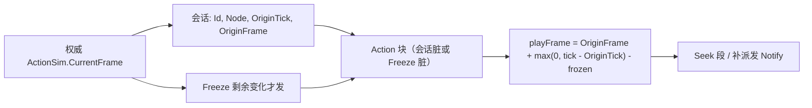

# 动作 / 走跑本地推帧 — 优化方案

> 制定：2026-08-24  
> 角色：**Observer 动作与 Locomotion 时钟**的结构真源（先文档，后实现）  
> 依赖：[`REPLICATION_FIELD_MASK_PLAN.md`](./REPLICATION_FIELD_MASK_PLAN.md) **RS-M2**（Action / Loco 块存在）  
> 建议先完成：[`REPLICATION_POSE_STATE_SPLIT_PLAN.md`](./REPLICATION_POSE_STATE_SPLIT_PLAN.md) **RS-S1**（否则出招期 Action 块仍跟整实体 Due 缠在一起）  
> 现行阅读：[`../2026.8.23/NETSYNC_FROM_JOIN_TO_HIT.md`](../2026.8.23/NETSYNC_FROM_JOIN_TO_HIT.md) §12；纠偏 [`../2026.8.15/UE_ALIGNED_CLIENT_PREDICTION_PLAN.md`](../2026.8.15/UE_ALIGNED_CLIENT_PREDICTION_PLAN.md)  
> 装配链：`ActionSim.CurrentFrame`（权威）→ V2 Action 块 → `RemoteCharacterProxy.ApplyPresentation`

---

## 0. 一句话

权威下行 **动作会话**（`ActionId + GraphNodeKey + OriginTick + OriginFrame`）和 **卡肉边沿**，Observer 用权威 Tick 本地推 `ActionFrame` / 走跑时间；禁止每 Tick 把 `ActionFrame`、`LocomotionNormalizedMilli` 写入 Action/Loco 块；禁止客机用推帧结果改血或 Collect。

---

## 1. 问题与动机

### 1.1 现状基线

```text
权威 Capture
  ActionId, GraphNodeKey, ActionFrame=CurrentFrame, FreezeFrames
  LocomotionNormalizedMilli = NormalizedTime*1000（无招时）

V1 / V2-M 未做时钟前：
  出招每 Tick ActionFrame+1 → Action 块每 Tick 脏
  走路每 Tick NormMilli+ → Loco 块每 Tick 脏（RS-S 后仅 Norm 跟 Pose 节拍）

RemoteCharacterProxy.ApplyPresentation
  有招：Seek 仅在段变化；VFX 按 previousFrame→ActionFrame 补派发
  无招同 key：不每 Tick Seek，只 Tick（归一化时间线上仍在发）
```

权威 `ActionSim` 仍每 World 帧 +1，这是模拟真源。浪费在 **复制把推帧结果当状态重发**。

Owner Autonomous 已有本地 `ActionSim`，本方案 **不**用会话时钟替换 Owner 预测；Owner 仍收完整权威会话做 Ack / 掐招。

### 1.2 痛点

1. `RS-M` 后出招仍约 16 字节 × 60Hz × 出招人数，团战 Action 块本身可顶满预算。  
2. 远端 Clip 已能本地 Tick，线上海归一化时间是重复时钟。  
3. 若只停发 `ActionFrame` 却不定义会话与卡肉，丢包后 Proxy 会停在旧帧或快进错窗，刀光区间派发会漏/重。

### 1.3 目标

| 目标 | 说明 |
|------|------|
| 结构 | Action 块改为会话 + Freeze 边沿；Loco 块去掉每 Tick `NormalizedMilli`，切键/切步态才发 |
| 可玩/可测 | Observer 出招段切换、VFX 过点、卡肉停片与改前一致；走路循环不抽帧 |
| 不做 | 客机 Collect / 改 Numeric；锁步回滚；用动画 `IsPlaying` 当权威；Owner 预测改走会话外推 |

---

## 2. 设计原则

1. **权威只发时钟原点，不发时钟读数。** `CurrentFrame` 仍只在服务器 `ActionSim` 递增。  
2. **会话身份稳定：** 同一 `ActionId` 连续帧 = 同一会话，直到 Id 变、强制重开（受击/死亡边沿）或 `ShouldForceActionRestart` 现有规则对应的权威信号。  
3. **卡肉不外推：** `FreezeFrames` 只在开始、剩余值变化、结束时进 Action 块；外推公式在 freeze 期间冻结 `playFrame`。  
4. **丢包可恢复：** 任一后续 Update/ForceFull 若该实体仍在招，必须能带齐会话四元组，禁止「只靠客机自己加到结束」。Recover 全量仍含会话。  
5. **表现补帧：** Proxy 用外推 `playFrame` 对 `[lastPlayFrame, playFrame]` 派发 Notify，等价今天用快照帧差补 VFX。  
6. **零双轨：** 删除线上每 Tick `ActionFrame` / `LocomotionNormalizedMilli`；禁止 V1 字段与会话字段同时发。  
7. **命中仍在权威盒：** 推帧只驱动 Proxy 动画与刀光 Cue；判定盒不因推帧 Collect。

---

## 3. 目标架构



### 3.1 Action 块 V2 改版（定案，替换 RS-M 的四 int32 帧布局）

实现 `RS-C` 时 **重写 Action 块字段**，不保留旧四字段：

| 字段 | 类型 | 含义 |
|------|------|------|
| `ActionId` | i32 | 0 = 无招，结束会话 |
| `GraphNodeKey` | i32 | 与今相同 |
| `OriginTick` | i64 | 权威 `NetTick` / `CurrentFrame`：本会话用于推帧的原点（起手当步，或 Seek 重开当步） |
| `OriginFrame` | i32 | 原点对应的动作帧（通常 0；强制重开可为权威当时帧） |
| `FreezeFrames` | i32 | **剩余**卡肉逻辑帧；0 表示未卡肉。只在该值相对 lastSent 变化时置 Action 脏（可与会话同包） |

无招：`ActionId=0`，其余写 0，发一次以清会话，之后 Action 块不脏。

**外推（Observer，权威 Tick = `T`）：**

```text
若 FreezeFrames_remaining > 0:
  playFrame = lastPlayFrame（停）
  本地每逻辑步把 remaining-1（与权威同频的播放头步进，见 3.3）
否则:
  playFrame = OriginFrame + (T - OriginTick)
  playFrame = clamp(0, action.TotalFrames)
```

`T` 用 **该连接已应用的 ReplicationFrame.Tick**，不用渲染时间，避免和 `RemotePlaybackClock` 位移插值抢两套时间。动作表现跟逻辑 Tick，位移模型仍跟播放头——与现行「战斗时钟 / 位移时钟拆开」一致。

### 3.2 何时发 Action 块

| 事件 | 发？ |
|------|------|
| 新起手 / 换招 / Graph 换节点 | 是（新 OriginTick/Frame） |
| 受击/死亡强制重开（现 `ShouldForceActionRestart`） | 是 |
| 招自然结束 → Id=0 | 是（一次） |
| 仅 `CurrentFrame+1` | **否** |
| `FreezeFrames` 从 0→N、N→N-1 每步、N→0 | **剩余值变化即脏** — 见下条 |

卡肉若每步 remaining-1 仍会 60Hz 脏，等于没省。定案：

- 线上 `FreezeFrames` 表示 **开始卡肉时的剩余长度**（或「卡肉进行中 + 起始 Tick + 时长」）。  
- **推荐只留一种：** `FreezeOriginTick` + `FreezeDurationFrames`。客机 `frozen = T < FreezeOriginTick + Duration`。  
- 为少加字段：复用 Action 块增加 `FreezeOriginTick` i64 + `FreezeDuration` i32，删除每 Tick 剩余。无卡肉 Duration=0。

本方案 **锁定** `FreezeOriginTick + FreezeDuration`，删除「每步剩余 i32」。

Action 块最终字段：

```text
ActionId, GraphNodeKey, OriginTick, OriginFrame, FreezeOriginTick, FreezeDuration
```

无招且无冻：Id=0，后四字段 0，Freeze 双 0。

### 3.3 Loco 块改版

| 字段 | 去留 |
|------|------|
| `Phase` `Gait` `Cardinal` | 保留；键变才脏 |
| `LocomotionNormalizedMilli` | **删除**。切到过渡相位时发一次可选 `LocoOriginTick`（u 可不加：Proxy 已对循环片只 Tick 不 Seek） |

定案：Loco 块只剩 3 字节键。过渡相位硬切仍用 `ReplicationPresentationAlign.IsTransitionPhase` + Play；**不再 Seek 权威归一化时间**。若 Play 出现起步相位明显不同步，再加可选 `LocoOriginNorm` **仅在键变时发**，不每 Tick 发。第一期 **不加**，验收若失败再开 RS-C 修订，不预留双字段。

### 3.4 Owner

- 下行仍应用 Vitality / Pose 纠偏 / `PredictedActionAckQueue`。  
- Ack 所需权威动作：用会话外推的 `playFrame` 或会话四元组，**不再要求每 Tick 快照带 ActionFrame**。  
- `ActOwnerReplicationAdapter` 读 `self.ActionFrame` 的路径改为 `EvaluatePlayFrame(session, tick, freeze)`。  
- 禁止 Owner 再走一套「仍收每 Tick ActionFrame」的兼容分支。

### 3.5 关键契约

```text
Capture → ActionSessionWire { id, node, originTick, originFrame, freezeOrigin, freezeDuration }
脏：相对 lastSent 会话或 freeze 区间变化

Observer:
  lastPlayFrame → playFrame = Evaluate(...)
  DispatchNotifies(action, lastPlayFrame, playFrame)
  Seek 仅段变化 / forceRestart

Evaluate 禁止读 Animator
```

### 3.6 边界

| 层 | 职责 | 不负责 |
|----|------|--------|
| 权威 `ActionSim` | 真 `CurrentFrame`、真卡肉 | 编码 |
| Schema Action 块 | 会话 + freeze 区间 | 插值位移 |
| `RemoteCharacterProxy` | 外推 + 表现 | Collect |
| `RemotePlaybackClock` | 模型位移 | 动作帧 |

---

## 4. 范围声明

| 阶段 | 包含 | 不包含 |
|------|------|--------|
| RS-C0 | `EvaluatePlayFrame` 纯函数 + 单测 | 改 Codec |
| RS-C1 | Action/Loco 块改版；删每 Tick 帧/归一化 | Owner 预测重写 |
| RS-C2 | Proxy / Owner Ack 改读 Evaluate；Notify 补区间 | 命中申报 |
| RS-C3 | Play：连招、卡肉、受击重开、循环走 | 公网 |

---

## 5. 分阶段交付（任务 / 验收 / 出口）

### RS-C0 — 外推纯函数

**任务**

- [ ] 新增 `ReplicationActionClock.EvaluatePlayFrame(...)`（无 Unity）  
- [ ] 覆盖：正常推进、clamp 总帧、freeze 区间内停、结束后续播  
- [ ] **冻结公式定案（只此一种）：** 从 `OriginTick` 的下一逻辑步起，每个权威 Tick 若落在 `[FreezeOrigin, FreezeOrigin+Duration)` 则 **不增加** `playFrame`，否则 +1。禁止「冻住仍让 `T-OriginTick` 当已播放帧」的第二套。  

**验收**

- [ ] 无冻：OriginTick=100、OriginFrame=0、T=105 → play=5  
- [ ] 有冻：OriginTick=100、FreezeOrigin=102、Duration=3；T=101 → play=1；T=102/103/104 冻住 → play=1；T=105 → play=2  
- [ ] Id=0 → play=0  
- [ ] 函数注释与表驱动测试同一组期望值  

**出口：** 公式唯一且可测。→ **未达成**

### RS-C1 — 改 Action/Loco 块，删旧字段

**任务**

- [ ] V2 Action 块改为 §3.2 六字段（或 Id=0 短编码：仅 Id，省无招包——若做短编码必须是唯一无招格式）  
- [ ] Loco 块删除 `LocomotionNormalizedMilli`  
- [ ] **删除** Capture 写入每 Tick `ActionFrame` / `NormalizedMilli` 的线上路径  
- [ ] 重写 Schema 单测长度与往返  

**验收**

- [ ] `rg LocomotionNormalizedMilli` 无 Codec Write  
- [ ] 出招 10 个权威 Tick、会话未变、无新冻：Action 块只在第 1 Tick 出现  
- [ ] 卡肉开始当步出现 FreezeOrigin/Duration，随后 freeze 持续 Tick 不再因 remaining 发块  

**出口：** 线上不再有每 Tick 动作读数。→ **未达成**

### RS-C2 — Proxy / Owner 接线

**任务**

- [ ] `RemoteCharacterProxy`：`playFrame = Evaluate`；`DispatchPresentationNotifies` 用 last→play 区间  
- [ ] `ShouldForceActionRestart` 改为认 Edge + 新会话 Origin，不再比连续 `ActionFrame` 回绕  
- [ ] `ActOwnerReplicationAdapter` / `PredictedActionAckQueue` 改读 Evaluate 或会话字段  
- [ ] **删除** 对 `snapshot.ActionFrame` 作为「本 Tick 权威读数」的 Apply 路径  

**验收**

- [ ] EditMode Proxy：连续 5 个只含 Pose 的 Update，动作 Clip 仍前进 5 逻辑帧（测试注入 Tick）  
- [ ] 丢 2 个中间帧再收到 Pose：Notify 区间一次补上，不重播已派发点（沿用现有 previousFrame 语义）  
- [ ] Owner：权威空闲 Id=0 仍 StopAutonomous；Hit/Death Edge 仍掐预测  

**出口：** 表现与 Ack 只认会话时钟。→ **未达成**

### RS-C3 — Play

**任务**

- [ ] Play：连招段切换、Recovery 衔接、卡肉停片、受击重开、循环走不抽  
- [ ] 实现后更新 `NETSYNC_FROM_JOIN_TO_HIT` §12 动作字段说明  

**验收**

- [ ] Listen：打木桩刀光过点不漏、不双播  
- [ ] 卡肉时模型停、结束后按权威节奏续  
- [ ] Test Runner：`ReplicationActionClock*`、`CharacterSnapshotSchemaV2*`、Proxy/Owner 相关既有测更新后全过  
- [ ] Unity 编译在 Editor 确认通过  

**出口：** Observer 推帧为唯一远端动作时钟。→ **未达成**

---

## 6. 迁移与兼容

### 6.1 保留 / 迁入

- 权威 `ActionSim` 整数帧  
- 可靠 `ReplicationEvent` 刀光（与推帧 Notify 去重规则保持：事件仍是命中 Cue，Timeline VFX 仍按帧过点）  
- `SimHitKey` / Pipeline  
- `RS-M` lastView 合并、`RS-S` 块 Due（Action 块 Due 改为「会话/冻区间脏」而非 Frame+1）  

### 6.2 明确删除

| 删除 | 原因 |
|------|------|
| 线上每 Tick `ActionFrame` | 被 Origin+Evaluate 替代 |
| 线上每 Tick `LocomotionNormalizedMilli` | 本地 Tick |
| 线上每 Tick `FreezeFrames` 剩余 | 被 FreezeOrigin+Duration 替代 |
| Owner「仍要每 Tick ActionFrame 才能 Ack」分支 | 双轨 |

`RS-S` 的「出招期 Action 60Hz」在本方案出口后自然失效：会话不脏则 Action 不当步。

---

## 7. 目录与文件预期（增量）

```text
Assets/Scripts/Domain/Networking/ReplicationActionClock.cs
Assets/Scripts/Domain/Simulation/Replication/ActorReplicationSnapshot.cs  // 内存改为会话字段或并行 Evaluate
Assets/Scripts/Domain/Character/Replication/RemoteCharacterProxy.cs
Assets/Scripts/App/Networking/Adapters/ActOwnerReplicationAdapter.cs
Assets/Tests/EditMode/ACTNet 或 Simulation/ReplicationActionClockTests.cs
docs/2026.8.24/REPLICATION_ACTION_CLOCK_PLAN.md
```

内存 struct 建议直接改成会话字段，Apply 处 Evaluate，禁止 `ActionFrame` 线上字段与内存字段两套含义。

---

## 8. 风险与对策

| 风险 | 对策 |
|------|------|
| 丢会话起点包 | 下一脏 Pose 不自动带 Action；若仍在招，Due 必须「会话未在对方 lastSent 确认」则重发——用可靠？**定案：不可靠。** 靠后续任意 ForceFull/Recover，以及「每 N Tick 若仍在招且 lastSent 会话未 ack」**不做 Nack**。改：会话期间 **PoseInterval 对齐的偶数 Tick 附带一次 Action 块心跳**（只含会话，仍远小于每 Tick Frame）。心跳间隔 = `PoseInterval`，写进 Due，避免无限悬空。 |
| 心跳又把带宽吃回去 | 仅 `ActionId!=0` 且 interval 到；无招不心跳 |
| freeze 公式歧义 | RS-C0 表驱动锁一种 |
| 位移播放头与动作 Tick 不一致 | 保持现状拆分；不把 playFrame 绑 `RemotePlaybackClock` |
| Timeline 总帧与 clamp | 与权威结束当步发 Id=0 对齐；客机 clamp 后停片直到 Id=0 |

**会话心跳（补进 Due，防丢起点）：** `ActionId!=0` 且 `tick % ActionHeartbeatTicks == 0`（默认 2，与 Pose interval 相同）则 Action 块到期。仍比每 Tick 16B×60 少一半，且无 Frame 递增。

---

## 9. Editor 人工步骤（若涉及配置/Prefab）

1. 不改动作资产时间轴；权威仍 60Hz `ActionDefinition`。  
2. Play：连招、HitStop、受击打断、跑步循环。  
3. 无新 Prefab 字段。  

---

## 10. 推荐开工顺序

```text
RS-M2 →（建议 RS-S1）→ RS-C0 锁公式 → RS-C1 改块 → RS-C2 接线 → RS-C3 Play
```

**最小可感切片：** 出招 1 秒只看到 1 次会话 + 偶发心跳 + 卡肉各 1 次，Proxy 刀光仍过点。

---

## 11. 变更日志

| 日期 | 说明 |
|------|------|
| 2026-08-24 | 初版：会话外推、Freeze 区间、Loco 去归一化、会话心跳防丢 |
