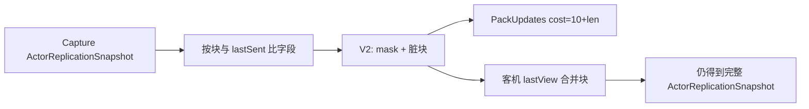

# 复制字段掩码 / 分块 — 优化方案

> 制定：2026-08-24  
> 角色：**下行角色 Schema 分块编码**的结构真源（先文档，后实现）  
> 系列：[`README.md`](./README.md) → 本方案 `RS-M` → [`REPLICATION_POSE_STATE_SPLIT_PLAN.md`](./REPLICATION_POSE_STATE_SPLIT_PLAN.md) → [`REPLICATION_ACTION_CLOCK_PLAN.md`](./REPLICATION_ACTION_CLOCK_PLAN.md)  
> 现行阅读：[`../2026.8.23/NETSYNC_FROM_JOIN_TO_HIT.md`](../2026.8.23/NETSYNC_FROM_JOIN_TO_HIT.md) §10  
> 装配链：`ActCharacterSnapshotSchema.Encode` → `ReplicationServer.BuildFrame` → `ReplicationFrameCodec` → `RemoteCharacterProxy` / Owner Apply

---

## 0. 一句话

用 **Schema Id=2 的分块掩码载荷**替换「整份 67 字节固定铺平」：Update 只带变脏的块（走位 = Pose，出招再加 Action）；Spawn / Recover 仍发全块；禁止 V1/V2 双轨解码，禁止字段级掩码却继续整包逐字节当唯一脏检测。

---

## 1. 问题与动机

### 1.1 现状基线

```text
ActAuthorityReplicationAdapter.AddEntityState
  → ActCharacterSnapshotSchema.Encode
       → CharacterSnapshotSchemaV1 (Id=1)
            → ActorReplicationSnapshotCodec.WriteFields（固定 67B，无掩码）
  → ReplicationEntityState(payload, urgent)
  → ReplicationServer.BuildFrame(Compact)
       SkipUnchanged：整段 payload 与 lastSent 逐字节比
       PackUpdates：cost = 10 + payload.Length，预算 1200
  → 客机 ReplicationClient.ApplyFrame
       → 解码整份 ActorReplicationSnapshot 覆盖
```

| 点 | 现状 |
|----|------|
| 线格式 | `ActorReplicationSnapshotCodec.WriteFields` 固定顺序，无版本、无掩码 |
| Schema | `CharacterSnapshotSchemaV1.Id = 1` |
| 脏检测 | `ReplicationServer.HasSamePayload` 整包相等才跳过 |
| 节拍 | Compact：非优先实体 `tick % 2 == 0`；`Urgent` = `ActionId != 0` 或 `VitalityEdge != None` |
| 预算 | 每条 Update 估 10+67=77；约 15 条顶满 1200 |
| 占位 | `FlagsPacked` Capture 恒 0；`SelectedTargetId` 仅 Owner 有意义仍写入全员 |
| 重复 | payload 内 `ActorId` 与 Update 记录头 `EntityId` 重复 |

### 1.2 痛点

1. 坐标或 `ActionFrame` 变 1，HP/Team/Kind 也整份重发。  
2. 团战 Urgent 人数一多，1200 预算按 77B/人饿死后排 EntityId。  
3. 收窄单个 `int32` 只让已决定发送的包便宜几字节，不改变「整包脏」。

### 1.3 目标

| 目标 | 说明 |
|------|------|
| 结构 | 唯一 Schema V2：`u16 mask` + 按 bit 拼接的块；内存仍合并为一份 `ActorReplicationSnapshot` |
| 可玩/可测 | 走位 Update 典型 ≤ Pose 块；出招另加 Action 块；HP 不变不带 Vitality |
| 不做 | 不上报伤害；不改权威 Collect；不保留 V1 Encode；不做字段级 bit（21 个独立 bit）；不在本阶段做分频（`RS-S`）或本地推帧（`RS-C`） |

---

## 2. 设计原则

1. **零长期兼容**：切换日删除 `CharacterSnapshotSchemaV1` 的生产 Encode/Decode 注册；旧客机靠 `ContentVersion` / 指纹拒 Join，不写 V1 fallback。  
2. **锁步边界不变**：权威仍是 `SimulationWorld` + `InputFrame`；掩码只压缩下行。  
3. **一块一职责**：块按变化频率与语义切，禁止 `if (敌人)` 另开盒。  
4. **记录头是身份真源**：payload 不再写 `ActorId`；`SimActorId` = `NetEntityId.Value`。  
5. **脏检测与编码同粒度**：按块比字段（或按块上次已发字节），禁止只比整包却声称做了掩码。  
6. **Spawn 全量**：新实体 / `ResetBaseline` 后第一帧 mask 全开，客机可独立重建。  
7. **结构优先**：差异在 Schema 与块表，不在 Adapter 里拼两种 payload。

---

## 3. 目标架构



### 3.1 块表（定案，只此一套）

| Bit | 块 | 字段（顺序） | 估长 |
|-----|-----|----------------|------|
| 0 | `Pose` | `PosX/Z/Y` i32×3、`FacingMilliDeg` i32、`MoveVx/Z` i32×2 | 24 |
| 1 | `Loco` | `Phase` `Gait` `Cardinal` u8×3、`LocomotionNormalizedMilli` u16 | 5 |
| 2 | `Action` | `ActionId` i32、`GraphNodeKey` i32、`ActionFrame` i32、`FreezeFrames` i32 | 16 |
| 3 | `Vitality` | `HealthMilli` i32、`VitalityEdge` u8 | 5 |
| 4 | `Meta` | `TeamId` i32、`Kind` u8、`SelectedTargetId` i32 | 9 |

- `FlagsPacked` **不进 V2**，P0 无消费者；以后要加开 bit5，不回填 V1。  
- mask 用 `ushort`（2 字节），bit5～15 保留为 0，非 0 则整帧拒绝。  
- 走位典型 Update：`mask=Pose|Loco` → 2+24+5=**31** 字节（对比今 67）。  
- 仅坐标变、Loco 键未变：`mask=Pose` → **26** 字节。  
- 出招中帧推进：再加 Action → 约 **42**。HP 不变仍不带 Vitality。

本阶段 **Action 仍含每 Tick `ActionFrame`**。去掉每 Tick 帧号是 `RS-C`，不在此方案提前做一半。

### 3.2 关键契约

```text
EncodeUpdate(prevSentFields, current) → (mask, bytes)
  mask 仅含字段相对 prev 有差异的块
  无差异 → 不产生 Update（沿用 SkipUnchanged）

EncodeSpawn(current) → mask=Pose|Loco|Action|Vitality|Meta 的全量字节

Decode(mask, bytes, lastView) → ActorReplicationSnapshot
  未出现的块沿用 lastView；Spawn 禁止缺块

Urgent（仍在 Capture 置位，语义暂不改）：
  ActionId != 0 或 VitalityEdge != None
```

### 3.3 边界

| 层 | 职责 | 不负责 |
|----|------|--------|
| `ActorReplicationSnapshot` | 内存完整视图 | 线格式 |
| `CharacterSnapshotSchemaV2` | 分块编解码、缺块拒绝 | 节拍 / 预算 |
| `ReplicationServer` | 每连接 last 字段或 last 块字节、Skip、Pack | ACT 字段语义 |
| Observer / Owner Apply | 合并后的完整快照 | 猜未发块 |

`ACTNet.Replication` 继续只看见不透明 payload。块语义留在 ACT Schema。

---

## 4. 范围声明

| 阶段 | 包含 | 不包含 |
|------|------|--------|
| RS-M0 | 块表冻结、单测编解码 | 接线生产路径 |
| RS-M1 | Schema V2 注册；删除 V1 生产路径 | 分频 Due |
| RS-M2 | Server 按块脏检测 + 客机 lastView 合并 | 本地推 `ActionFrame` |
| RS-M3 | 预算/带宽单测与 Play | `RS-S` / `RS-C` |

---

## 5. 分阶段交付（任务 / 验收 / 出口）

> 勾选：未开始 `[ ]`；完成后 `[x]` 并在出口注明日期。

### RS-M0 — 块表与纯编解码

**任务**

- [ ] 新增 `CharacterSnapshotSchemaV2`（`Id = 2`）与 `ActorReplicationSnapshotChunkCodec`（名称可微调，职责：mask+块）  
- [ ] 实现上表五块的 Write/Read；未知 bit 或截断/尾随字节抛错  
- [ ] EditMode：全量往返、单 Pose 合并、缺 Meta 的 Spawn 拒绝  

**验收**

- [ ] `CharacterSnapshotSchemaV2Tests`（名可微调）：全量 payload 长度 = 2+24+5+16+5+9 = 61；仅 Pose = 26  
- [ ] 非法 mask 位 / 长度不匹配抛 `NetBufferException` 或与现网一致的严格异常  
- [ ] Unity 编译 / EditMode 在 Editor 确认通过  

**出口：** V2 编解码可单测，尚未替换生产注册。→ **未达成**

### RS-M1 — 生产单轨切 V2

**任务**

- [ ] `ActCharacterSnapshotSchema` 只委托 V2；Registry 只注册 Id=2  
- [ ] **删除** `CharacterSnapshotSchemaV1` 生产入口与 `ActorReplicationSnapshotCodec.WriteFields` 的 V1 固定 67B 作为线上格式（内存 struct 可留）  
- [ ] 重写/改名 `CharacterSnapshotSchemaV1Tests`、`ActCharacterSnapshotSchemaTests` 为 V2；禁止测试再 Encode Id=1  
- [ ] Join `ContentVersion` 或 Gameplay 指纹随 Schema 变更（现有指纹扫描能扫到则跟扫描，否则显式 bump）  

**验收**

- [ ] `rg CharacterSnapshotSchemaV1` 无生产引用（测试夹具不得再注册 Id=1）  
- [ ] `rg ActorReplicationSnapshotCodec.WriteFields` 无发送路径（若 Codec 改名为 Chunk 则旧符号消失）  
- [ ] 旧 Id=1 正文进 `ReplicationClient.ApplyFrame` → Rejected，走现有 Recover，不静默当 V2 读  

**出口：** 房内只有 Schema 2。→ **未达成**

### RS-M2 — 按块脏检测与客机合并

**任务**

- [ ] 每连接保存「上一次成功发出的各块字段」（或各块字节）。`HasSamePayload` 整包比较改为「无脏块则跳过」  
- [ ] `DedicatedAuthorityWorld` / Adapter Capture 仍产出完整 `ActorReplicationSnapshot`；Encode 吃 last+current  
- [ ] Observer / Owner Apply：实体 `lastView` 合并；Proxy 仍只认完整快照  
- [ ] `FlagsPacked` 不再出现在线上；内存 struct 可留 0  

**验收**

- [ ] EditMode：仅 `PosXMm+1` 时发出 mask 仅 Pose，客机 HP/Action 保持上一份  
- [ ] 仅 `HealthMilli` 变时 mask 仅 Vitality  
- [ ] 仅 `ActionFrame+1` 时 mask 仅 Action，坐标不在 payload  
- [ ] Spawn / `ForceFull` / Recover 后首帧五块齐全，客机无需上一份 lastView  

**出口：** 脏哪块发哪块，客机视图连续。→ **未达成**

### RS-M3 — 预算与 Play

**任务**

- [ ] `PackUpdates` 仍 `10+payload.Length`（变短的 payload 自动便宜）  
- [ ] 补 `ReplicationDeltaTests` 或 FakeActionGame：N 个只走路实体的 Update 字节低于 V1 整包基线  
- [ ] 文档：`NETSYNC_FROM_JOIN_TO_HIT` §10.2 改为 V2 分块（实现后改，本阶段任务列出以免忘）  

**验收**

- [ ] 单测：10 个仅 Pose 脏的实体，单帧 Update 字节和 < 10×77  
- [ ] Play：Listen 2 人走位 + 出招 + 掉血，Proxy 位姿/刀/血与改前一致（手感不回归）  
- [ ] Test Runner：`CharacterSnapshotSchema*`、`ReplicationDelta*`、`ActCharacterSnapshot*`  

**出口：** V2 为唯一线上角色快照。→ **未达成**

---

## 6. 迁移与兼容

### 6.1 保留 / 迁入

- `ActorReplicationSnapshot` 内存字段集（除线上删除 `FlagsPacked`）  
- `ReplicationFrame` / Mux / Compact 1200 / 兴趣半径 / Urgent 置位条件（本阶段不改语义）  
- Owner 2m 纠偏、Proxy 插值播放头  

### 6.2 明确删除

| 删除 | 原因 |
|------|------|
| `CharacterSnapshotSchemaV1` 生产编解码 | 禁止双 Schema |
| 线上固定 67B `WriteFields` | 被分块替代 |
| 线上 `FlagsPacked` | 恒 0 |
| payload 内 `ActorId` | 与 EntityId 重复 |
| `HasSamePayload` 作为脏检测真源 | 与掩码粒度冲突 |

---

## 7. 目录与文件预期（增量）

```text
Assets/Scripts/Domain/Networking/Schema/CharacterSnapshotSchemaV2.cs
Assets/Scripts/Domain/Simulation/Replication/ActorReplicationSnapshotChunkCodec.cs
Assets/Scripts/App/Networking/Schema/ActCharacterSnapshotSchema.cs   // 只委托 V2
Assets/Tests/EditMode/ACTGame/Networking/CharacterSnapshotSchemaV2Tests.cs
docs/2026.8.24/REPLICATION_FIELD_MASK_PLAN.md
```

---

## 8. 风险与对策

| 风险 | 对策 |
|------|------|
| 合并漏块导致 HP 停在旧值 | Spawn/ForceFull 必须全 mask；单测缺块 Spawn 失败 |
| 旧客机连新服 | 指纹/ContentVersion 拒 Join，不解码 V1 |
| mask 与长度不同步 | 严格顺序读块，EnsureComplete |
| Urgent 仍整实体 60Hz | 本阶段接受；由 `RS-S` 把 Urgent 收到块级 |
| `SelectedTargetId` 仍随 Meta 走 | Meta 少变；非 Owner 权威应继续写 Invalid，不变则不发 |

---

## 9. Editor 人工步骤（若涉及配置/Prefab）

1. Agent **不改** `Assets/Data/**`、Prefab。  
2. 实现后打开工程等编译；若 Join 指纹含程序集/Schema，旧 Build 无法入新房（预期）。  
3. 无新 Inspector 字段。  

---

## 10. 推荐开工顺序

```text
RS-M0 编解码 → RS-M1 删 V1 → RS-M2 按块脏/合并 → RS-M3 单测+Play
随后 RS-S（分频）→ RS-C（本地推帧）
```

**最小可感切片：** RS-M0+M1 后，走路包从 67 降到 Pose（+可选 Loco），血条与招式仍正确。

---

## 11. 变更日志

| 日期 | 说明 |
|------|------|
| 2026-08-24 | 初版：五块掩码、Schema 2、删 V1 |
