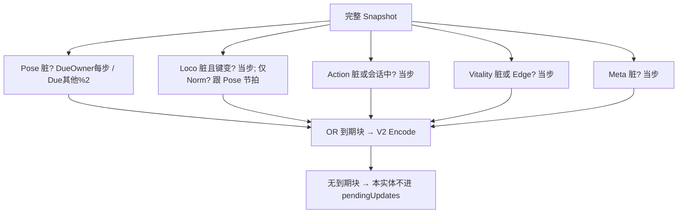

# 高频位姿 vs 低频状态拆开 — 优化方案

> 制定：2026-08-24  
> 角色：**同一实体内块级发送节拍**的结构真源（先文档，后实现）  
> 依赖：[`REPLICATION_FIELD_MASK_PLAN.md`](./REPLICATION_FIELD_MASK_PLAN.md) **RS-M2 出口**（V2 分块 + 按块脏检测）  
> 后续：[`REPLICATION_ACTION_CLOCK_PLAN.md`](./REPLICATION_ACTION_CLOCK_PLAN.md)  
> 现行阅读：[`../2026.8.23/NETSYNC_FROM_JOIN_TO_HIT.md`](../2026.8.23/NETSYNC_FROM_JOIN_TO_HIT.md) §10.2～10.3  
> 装配链：`ReplicationBuildOptions` + V2 Encode → `ReplicationServer.BuildFrame` → Observer `lastView`

---

## 0. 一句话

在 **同一 `NetEntityId`、同一 Schema V2** 上按块定 Due：Pose 继续高频，Vitality/Meta 只在变脏时发，Action 在本阶段仍随出招 Urgent；禁止再注册第二套角色 Schema/幽灵实体来「拆通道」，禁止 `if (PVE)` 两套 Due。

---

## 1. 问题与动机

### 1.1 现状基线

```text
ReplicationBuildOptions.Compact
  SkipUnchanged = true          // 整包（M 之后：无脏块）才跳过
  MaxUpdateBytes = 1200
  SnapshotIntervalTicks = 2     // 非优先实体
  PreferredEntity = Owner
  ForceFull = Join/Recover

ReplicationServer 资格（整实体）：
  dirty ∧ (ForceFull ∨ Owner ∨ Urgent ∨ tick%2==0)

Urgent（Capture）：
  ActionId != 0 ∨ VitalityEdge != None
```

W11 已有 **实体级** 跳过、30Hz 节拍、Owner 优先。缺的是 **同实体再拆**：出招时整个人变 Urgent，HP/Team 即使没变也会跟 Pose 抢同一条「当步必发」资格；走路时若 Loco 归一化时间仍脏，会拖着整实体进偶数 Tick。

`RS-M` 之后：没变的块可以不带，但 **Due 仍是整实体**。出招中每个奇数 Tick 仍会给该实体发 Update（至少带 Action 块）。人数多时预算仍按「每个出招者一条 Update」排队。

### 1.2 痛点

1. Compact 的 30Hz 管「整个人发不发」，不管「这个人的哪一块该发」。  
2. `Urgent` 绑在实体上：一出招或一挨打，Owner 以外也当步发送，团战把 1200 打满。  
3. 若用两个 Entity（Pose 实体 + 状态实体）分频，Spawn/Despawn/Recover/兴趣会裂成两套生命周期——禁止。

### 1.3 目标

| 目标 | 说明 |
|------|------|
| 结构 | 每连接每实体维护「块级 lastSent + 块级 Due」；一条 Update 仍是一份 V2 mask payload |
| 可玩/可测 | 走位：Pose（+脏 Loco）按节拍；HP/Team/锁敌：只在字段变时出现；出招：Action 块按本阶段 Urgent 规则 |
| 不做 | 第二 Schema / 第二 Entity；改权威模拟；本阶段删除 `ActionFrame` 每 Tick（那是 `RS-C`）；改 1400 MTU / 拆包 |

---

## 2. 设计原则

1. **分频是策略，不是身份**：Due 表按块，不按玩家/敌人 if。敌人远距仍用现有 `ReplicationInterest` 整实体裁剪。  
2. **一条 Update、一个 mask**：同一 Tick 多个脏且到期的块打进同一 payload，禁止同实体同 Tick 两条角色 Update。  
3. **依赖掩码**：无 V2 块则本方案不开工。  
4. **Urgent 降到块**：`VitalityEdge != None` 只强迫 Vitality（及需要的 Pose 对账，见 3.2）；`ActionId != 0` 只强迫 Action，不强迫 Meta。  
5. **Owner Pose 不降频**：本机和解仍要权威位姿尽量密；他人 Pose 可用 interval=2。  
6. **零双轨**：删除整实体 `tick%2` 作为唯一 Due；旧 `Urgent` 布尔不再单独决定「整人发送」。  
7. **锁步不变**：服务器仍 60Hz Step；少发的是复制，不是模拟。

---

## 3. 目标架构



### 3.1 Due 表（定案）

| 块 | 脏 | 到期 |
|----|----|------|
| `Pose` | 六字段任一变 | Owner / ForceFull：**每 Tick**；其他：`tick % PoseInterval == 0`（默认 interval=2，即约 30Hz） |
| `Loco` | 四字段任一变 | `Phase/Gait/Cardinal` 变：**当步**（切步态必须立刻）；仅 `NormalizedMilli` 变：跟该实体 Pose Due，避免走路 60Hz 只为刷归一化时间 |
| `Action` | 四字段任一变 | **当步**（本阶段仍含每 Tick `ActionFrame`，出招期会 60Hz 带 Action 块；`RS-C` 后再降） |
| `Vitality` | HP 或 Edge 变 | **当步**；`Edge==None` 且 HP 未变则不发 |
| `Meta` | Team/Kind/Target 变 | **当步** |

`PoseInterval` 放在 `ReplicationBuildOptions`（或 ACT 侧薄包装），默认 2。`ForceFull` / Recover：所有块当步且全 mask。

### 3.2 受击当步要对齐的东西

`VitalityEdge` 为 Hit/Death 时，**同一 Update 必须带 Pose**（即使 Pose 未到 interval）。否则 Observer 受击盒/倒地位置停在上一拍插值点。  
不因此带上 Meta。Action 若仍是旧招，可不带（反应招若同帧切 `ActionId`，Action 本身已脏）。

### 3.3 关键契约

```text
ChunkDue(entity, chunk, tick, isOwner, forceFull, dirty, vitalityEdge) → bool

pendingUpdate.payload = Encode(mask = { chunk | Due && (dirty || forceFull || 受击绑 Pose) })

PackUpdates：仍按 payload 字节排队；Owner Pose 优先改为「Owner 的 Pose 块优先」——
  排序键：PreferredEntity 第一，其次本帧 mask 含 VitalityEdge，再次 EntityId
```

预算语义不变：装不下的 **整条 Update**（该实体本帧所有到期块）推迟，基线不改。禁止「先发 Pose 再把 Vitality 留到下帧」拆成半包（受击必须 Pose+Vitality 原子）。

### 3.4 边界

| 层 | 职责 | 不负责 |
|----|------|--------|
| `ReplicationBuildOptions` | interval / 预算 / ForceFull | 块字段 |
| ACT `ChunkDuePolicy` | 上表 | Mux / 兴趣半径 |
| `ReplicationInterest` | 敌人 40m 整实体可见性 | 块节拍 |
| `RS-C` | 去掉 Action 每 Tick 帧号 | 本方案不提前做 |

---

## 4. 范围声明

| 阶段 | 包含 | 不包含 |
|------|------|--------|
| RS-S0 | Due 纯函数 + 单测 | 接线 Server |
| RS-S1 | Server/Encode 按块 Due；删除整实体 interval/Urgent | 第二实体 |
| RS-S2 | 受击 Pose+Vitality 原子；预算排序 | `RS-C` |
| RS-S3 | Play：远敌 30Hz 位姿、切血当步、出招 Action 仍密 | 公网 W12 |

---

## 5. 分阶段交付（任务 / 验收 / 出口）

### RS-S0 — Due 表冻结

**任务**

- [ ] 新增无 Unity 的 `ReplicationChunkDue`（名可微调），实现 §3.1～3.2  
- [ ] 依赖 RS-M 的块枚举，禁止复制一份块 bit  

**验收**

- [ ] 单测：非 Owner、仅 Pose 脏、奇数 Tick、interval=2 → Pose 不上报  
- [ ] 单测：同上偶数 Tick → Pose 到期  
- [ ] 单测：Owner 奇数 Tick 仅 Pose 脏 → 到期  
- [ ] 单测：VitalityEdge=Hit、Pose 未到 interval → Pose 与 Vitality 同时到期  
- [ ] 单测：仅 Meta.SelectedTarget 变 → 仅 Meta 到期  

**出口：** Due 纯函数可测。→ **未达成**

### RS-S1 — 替换整实体 Due

**任务**

- [ ] `ReplicationServer` 或 ACT Encode 入口：实体进入 `pendingUpdates` 当且仅当 mask≠0  
- [ ] **删除**「`Urgent` 整实体当步」与「非优先实体只看 `tick % SnapshotIntervalTicks`」作为发送资格（interval 改挂到 Pose）  
- [ ] `ReplicationEntityState.Urgent` 若不再被 Server 读取则删除该字段及赋值，禁止留无读字段  

**验收**

- [ ] `rg state.Urgent` 无构帧资格判断（或字段已删）  
- [ ] EditMode：闲置 HP/Team 不变时，连续 Tick 的 Update 不含 Vitality/Meta 块  
- [ ] 出招中非 Owner：仍见 Action 块（本阶段预期 60Hz）；Pose 仍按 interval，除非受击绑 Pose  

**出口：** 生产路径只认块级 Due。→ **未达成**

### RS-S2 — 原子受击与预算

**任务**

- [ ] Hit/Death 与 Pose 打进同一 payload；预算不够则整实体本帧都不改 lastSent  
- [ ] Pack 排序：Preferred Owner → 本帧含 Death/Hit → EntityId  
- [ ] FakeActionGame 或 Delta 测：12 个走路敌人 + 2 个出招，Vitality/Meta 字节接近 0  

**验收**

- [ ] 单测：预算只够一条、同时 Hit+Pose 与纯 Pose 排队时，Hit 实体不丢 Edge  
- [ ] 单测：装不下时 lastSent 各块均不变，下帧仍脏  

**出口：** 受击不出现「有 Edge 无新位姿」。→ **未达成**

### RS-S3 — Play

**任务**

- [ ] Play：2 人 + 多名敌人，远处走位约 30Hz 不抽成传送（插值播放头仍在）  
- [ ] Play：受击当步倒、掉血，不晚一拍才对位姿  
- [ ] 实现后改 `NETSYNC_FROM_JOIN_TO_HIT` §10.3 Due 描述  

**验收**

- [ ] W11 远敌裁剪相关 Play 不因分频回退成「人还在 40m 内却完全不更新 Pose」  
- [ ] Test Runner：`ReplicationChunkDue*`、`ReplicationDelta*`、`CharacterSnapshotSchemaV2*`  
- [ ] Unity 编译在 Editor 确认通过  

**出口：** 同实体分频为唯一 Due。→ **未达成**

---

## 6. 迁移与兼容

### 6.1 保留 / 迁入

- V2 五块与客机 `lastView` 合并（`RS-M`）  
- 1200 预算、1400 硬门、兴趣 40m  
- Owner 纠偏合同  

### 6.2 明确删除

| 删除 | 原因 |
|------|------|
| 整实体 `SnapshotIntervalTicks` 资格 | 改为 Pose interval |
| 整实体 `Urgent` 发送资格 | 改为块级 + 受击绑 Pose |
| 「角色 Pose Schema + 角色 State Schema」双注册设想 | 双生命周期 |

---

## 7. 目录与文件预期（增量）

```text
Assets/Scripts/Framework/ACTNet/Replication/ReplicationBuildOptions.cs  // PoseInterval
Assets/Scripts/Domain/Networking/ReplicationChunkDue.cs                 // 或 ACTNet 无 ACT 字段的 Due + ACT 适配
Assets/Scripts/Framework/ACTNet/Replication/ReplicationServer.cs
Assets/Tests/EditMode/ACTNet/Replication/ReplicationChunkDueTests.cs
docs/2026.8.24/REPLICATION_POSE_STATE_SPLIT_PLAN.md
```

Due 若必须读 `VitalityEdge`，放在 ACT 适配层，不把枚举推进 `ACTNet` 核心。

---

## 8. 风险与对策

| 风险 | 对策 |
|------|------|
| 他人 Pose 30Hz 近战「看到的人」更慢 | 播放头已有 delay；受击强制带 Pose；不在本阶段改命中权威 |
| 仅 NormMilli 跟 Pose 节拍，循环片相位略跳 | 与今「偶数 Tick 才发整包」同级；`RS-C` 改为本地 Tick 后消失 |
| 出招仍 60Hz Action 块 | 接受，由 `RS-C` 收口；本方案先把 Meta/HP 从 Urgent 人身上剥掉 |
| 预算半包 | 禁止；整实体推迟 |

---

## 9. Editor 人工步骤（若涉及配置/Prefab）

1. 不改 `.asset` / Prefab。  
2. 无需新 Inspector。  
3. Play 对照：远距走位、贴脸挨打、开招。  

---

## 10. 推荐开工顺序

```text
RS-M2 已达成 → RS-S0 → RS-S1 → RS-S2 → RS-S3 → RS-C
```

**最小可感切片：** 一群只走路的敌人：奇数 Tick 不再为 HP/Team 占预算；出招者只多带 Action（+必要 Pose），不带 Meta。

---

## 11. 变更日志

| 日期 | 说明 |
|------|------|
| 2026-08-24 | 初版：块级 Due、受击绑 Pose、禁双 Entity |
