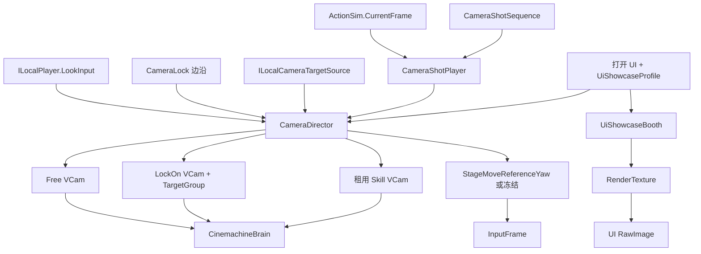

# 相机系统扩展 — Director 多机位 + UI 展示舱

> 制定：2026-08-26  
> 修订：2026-08-29 — **大招 SkillShot 数据真源**改挂 [2026.8.29 篇](../2026.8.29/CAMERA_SKILLSHOT_AND_STRETCH_PLAN.md)：`timeline.cameraShotStates`；**不再**以独立 `CameraShotSequence` SO 为入口（本文 C3 任务中的 Sequence SO 条目作废，以 8.29 为准）
> 修订：2026-08-29 — SkillShot / FollowHold 实施勾选改挂 8.29 篇；本文保留总览与 C5
> 角色：**相机表现层总览 / UI 展示舱排期真源**；SkillShot+拉伸以 8.29 篇为准
> 接替：[2026.8.6/CAMERA_SYSTEM_PLAN.md](../2026.8.6/CAMERA_SYSTEM_PLAN.md)（C0～C4 设计细节仍有效）
> 前置（不重做）：[2026.8.13/CAMERA_AUTHORITY_AND_TARGETING_REFACTOR_PLAN.md](../2026.8.13/CAMERA_AUTHORITY_AND_TARGETING_REFACTOR_PLAN.md)（C-AT0～3 代码已切；Input 资产仍待 Editor）  
> 对照实现（只读吸收）：`D:\Projects\DemoClient` 的 `PlayerSystem` / `RoleCtrl` / `DialogueSystem` / Timeline 相机 Notify  
> 装配链：`ActionSim.CurrentFrame → CameraShotPlayer → CameraDirector`；`UiShowcaseProfile → UiShowcaseBooth → RenderTexture → UI RawImage`

---

## 0. 一句话

用 **`CameraDirector` 优先级栈 + 多 VCam 租用池** 做战斗多机位（Free / LockOn / SkillShot / Cutscene），用 **独立展示舱 + 第二台相机 + RenderTexture** 做 UI 场景/角色橱窗；时钟只认 `ActionSim` 逻辑帧；**禁止**用展示舱或演出 VCam 写 `InputFrame` / Motor，禁止 `if (某界面)` 切机位，禁止把 DemoClient 的 `VCam.transform.forward` 玩法朝向搬回来。

---

## 1. 问题与动机

### 1.1 现状基线（2026-08-26 代码）

```text
ILocalPlayer.LookInput
  → CameraManager.ApplyLookInput / ApplyFollowFacingYaw
  → CameraOrbitPivot + CameraPitchPivot
  → 唯一 CM ThirdPerson（Transposer + HardLookAt + Collider）
  → StageMoveReferenceYaw → InputFrame.MoveReferenceYawQuantized

CameraLock 按键 → CameraManager._cameraLockEnabled（只停 L-DIR5，不切 VCam）
AttackHitEvent → CameraShakeController（仅玩家进攻命中 Impulse）

无：CameraDirector / CameraRig 类型 / LockOn VCam / TargetGroup
无：CameraShotSequence / CameraShotPlayer
无：正式 UI、展示舱、RenderTexture 橱窗
GameInputActions 无 CameraLock / TargetSwitchLeft / TargetSwitchRight
```

| 点 | 现状 |
|----|------|
| 日常机位 | `CameraManager` 运行时建单 VCam；跟 `PresentationRoot/CameraRoot`；滤左右已在 `SyncOrbitPivots` |
| 权威边界 | Orbit yaw 只 staged；Motor 只读 `MoveReferenceYawQuantized`（C-AT 代码已切） |
| 锁定 | `_cameraLockEnabled` 只读 `ILocalCameraTargetSource`；无构图 |
| 大招 | Action 无相机引用；`ActionSim.CurrentFrame` 已可作时钟，无人消费 |
| UI | `Assets/Scripts/UI/` 空占位；无展示场景 / 橱窗相机 |
| 输入资产 | `InputReader` 可选查找三键；资产未配则永远无效 |

### 1.2 DemoClient 对照（吸收 / 拒绝）

| DemoClient 做法 | 本项目 | 定案 |
|-----------------|--------|------|
| 场景多 VCam，`enabled` 抢权（日常 + 左右支援 + 对话） | 无 Director | **吸收**：改成 Priority + Brain Blend + 租用池，不散落 `Find("第三人称VCam")` |
| `FramingTransposer` + `CinemachinePOV` + InputProvider | 自管 Orbit/Pitch + Transposer | **拒绝 POV 作 Look 权威**；日常 Look 仍走 `CameraManager`；演出 VCam 可用 Framing/Composer |
| 移动读 `VCam.transform.forward` | 已删除 PlanarBasis | **拒绝**；保持 InputFrame 闭包 |
| 换人前排改 `vcam.Follow/LookAt` | 单人本机 | **后置**；有多人前排再做，不进本方案出口 |
| 左右 Assist VCam，选离当前相机更近的一台 | 无 | **吸收为租用策略**：SkillShot / 支援机位按 `vcamKey` 取池，退出时 **回写 Orbit yaw = 该 VCam 水平角**（防猛甩） |
| `DialogueSystem`：TargetGroup + 若干候选旋转，挑离战斗相机最近的 | 无对话 | **吸收算法**：LockOn / 双人构图用 TargetGroup；进出用 **Inherit Position + 最近候选**，不硬切 |
| `HoldCameraFollowNotifyState`：窗内钉死 `vcamFollow` 世界坐标 | 仅 `lateralFollowFactor` | **吸收**：`FollowHold` 窗口（Shot 或 Action 帧），钉 `FollowAnchor`，结束还原 local |
| Timeline `AssistCamera` / `CameraShakeMarker` | 无 Camera 轨 | **吸收语义、换时钟**：主路径用 `ActionSim.CurrentFrame` 窗口；超重演出才 Timeline。震屏进 `impulseOnEnter` / `CameraFeedback`，禁止 Marker 写 Sim |
| 滚轮改 `FramingTransposer.m_CameraDistance` | 无变焦 | **C2 可选**；不阻塞 C1/C3/C5 |
| Overlay 面板叠在关卡相机上（角色详情纯 2D） | 无正式 UI | **拒绝当橱窗方案**；UI 3D 必须走独立展示舱，不拧战斗 VCam |

### 1.3 痛点

1. 放大招无法切特写 / 回身 / 段内 FOV，只能第三人称跟跑。  
2. 开界面无法同时画「预制场景 + 角色模型 + 2D」，也没有按 UI 换场景的数据口。  
3. 若把 Demo 的「谁想切就 `vcam.enabled`」直接搬来，会再次打穿 MoveReferenceYaw，并在 `CameraManager` 里堆 `if (大招/装备栏)`。  
4. C-AT 契约已在，LockOn / SkillShot / UI 仍无导演落点。

### 1.4 目标

| 目标 | 说明 |
|------|------|
| 导演 | 唯一 `CameraDirector` 栈：Free / LockOn / SkillShot / Cutscene；高优覆盖，Pop 恢复进入前 Gameplay 模式 |
| 大招 | `CameraShotSequence` 按逻辑帧切机位；至少一条测试招：脸特写 → 回身 + 震/FOV |
| UI | `UiShowcaseProfile` 驱动展示舱；不同 UI 换场景/机位/角色锚点，2D 吃 RenderTexture |
| 权威 | Look / Shot / 展示舱 / Impulse / Blend **不进** InputFrame 与 Sim Hash |
| 不做 | 不把 UI 做成 Director 的第五战斗模式；不把战斗相机 Follow 拧到展台；不做联机观战；不在 Animator 里散落切相机；不以滤左右替代 SkillShot；不把 Demo 的 POV/VCam.forward 玩法路径搬回 |

---

## 2. 设计原则

1. **两套渲染域，禁止混用**：战斗走 `CinemachineBrain` + Director；UI 橱窗走独立 Camera + CullingMask + RT。  
2. **结构优先于 if**：招式差异在 `CameraShotSequence` 资产；界面差异在 `UiShowcaseProfile` 资产。  
3. **时钟只认逻辑帧**：Shot `enterFrame/exitFrame` 对齐 `ActionSim.CurrentFrame`；卡肉时帧不走，Shot 不提前切。  
4. **表现可丢**：Director 模式、Blend、FOV、Impulse、展示舱、`CameraLockEnabled` 不进 Snapshot。  
5. **进出不硬切**：Inherit Position；SkillShot/支援退出时把日常 Orbit yaw 对齐最后一台演出 VCam 的水平角（吸收 Demo Assist→POV）。  
6. **目标仍一份**：LockOn / Shot 的敌只读 `SelectedTargetId` → `ILocalCameraTargetSource`。  
7. **零长期兼容**：不保留「单 VCam 硬拧 LookAt 当锁定」与 Director 双轨；迁完只留栈。  
8. **资产人工**：Agent 不改 `.asset` / Prefab / `.inputactions`；只列 Editor 步骤。  
9. **Dedicated 无相机**：`ACTGame.Server` 继续禁止引用 Camera / HUD / Input。

---

## 3. 目标架构

### 3.1 总图

```text
【战斗域 · 关卡 Main Camera + CinemachineBrain】
  CameraDirector（模式栈 / 优先级 / 暂停 Look / 冻结 staged yaw）
    ├─ Free        10  日常 VCam（现 CameraManager Rig）
    ├─ LockOn      20  LockOn VCam + TargetGroup
    ├─ SkillShot   80  租用 Face/Body/Custom VCam
    └─ Cutscene    90～100  Timeline / 关卡 VCam
  CameraRig          PresentationRoot → CameraRoot → FollowAnchor →（可选 Hold / Predict）→ Orbit/Pitch
  CameraShotPlayer   只读 (actionId, CurrentFrame, Sequence) → Director.SetSkillShot / Clear
  CameraFeedback     命中/受击/弹刀 → Impulse / 短 FOV（不进 Collect）

【UI 域 · 与 Brain 隔离】
  UiShowcaseService.Show(UiShowcaseProfile)
    → Booth（独立层 / 关内玩家与战斗相机都看不见）
    → 实例化 scenePrefab + 展示用角色副本（不进 SimulationWorld）
    → UiShowcaseCamera → RenderTexture
    → UI RawImage + Overlay 2D
  打开时：Director.SetGameplayLookEnabled(false)，staged yaw 冻结为打开前最后值
  关闭时：Hide Booth，恢复 Look（不把展台姿态写回 Orbit）
```



### 3.2 战斗契约

```text
CameraDirector
  Push(mode, vcamKey, inheritPosition)
  Pop(restoreMode)                    // PreviousGameplay | ForceFree | ForceLockOn
  SetGameplayLookEnabled(bool)
  CameraLockEnabled                   // 仍为本地 bool；无 SelectedTarget 不得为 true
  SnapshotOrbitYawFrom(vcam)          // 演出结束回写日常 yaw

CameraShotSequence                    // SO，ActionDefinition 引用，不进 Sim
  restoreMode
  suppressLookInput
  shots[]: enterFrame, exitFrame, vcamKey, followAnchor, lookAtAnchor,
           blendIn, inheritPosition, holdFollow, fovOverride, impulseOnEnter

CameraShotPlayer（LateUpdate，晚于 World.Render）
  本机且正在播带 Sequence 的 Action
    → 帧落入 Shot 且与上一 Shot 不同 → Director.Push(SkillShot)
    → Action 结束 / Cancel / 被更高优 Cutscene 盖住 → Clear + restoreMode
```

`ActionDefinition` **只增加一个可选引用** `CameraShotSequence`（或并列 SO），禁止把大段镜头参数平铺进招式顶层。远端玩家大招：本方案首版 **不播 SkillShot**，只保留日常机位 + 可选轻 Impulse（与 8.6 篇一致）。

### 3.3 UI 契约

```text
UiShowcaseProfile                     // 每个需要 3D 橱窗的界面一份
  scenePrefab
  cameraLocalPose + fieldOfView
  characterAnchorPath                 // 相对场景根
  characterVisualId                   // Catalog / Prefab 键，不是 SimActorId
  renderTextureSize
  pauseGameplayLook                   // 默认 true
  cullingMask                         // 仅展示层

UiShowcaseService
  Show(profile, visualRequest)        // 幂等：同 Profile 再 Show 只刷新角色
  Hide()
  IsActive

禁止：
  CameraManager.Follow = 展台角色
  展示角色注册进 SimulationWorld / TargetSystem
  用展示相机 staged yaw
```

不同 UI = 不同 Profile 资产，不在 `CameraManager` 或 `UIMgr` 里按面板名分支机位。

### 3.4 层边界

| 层 | 负责 | 不负责 |
|----|------|--------|
| `CameraManager` | 日常 Rig、Look 累加、光标、Free VCam 装配 | 选敌、SkillShot 选段、实例化 UI 场景 |
| `CameraDirector` | 模式栈、VCam Priority/Blend、暂停 Look、回写 yaw | 写 Motor / Targeting / ActionSim |
| `CameraShotPlayer` | 逻辑帧 → 当前 Shot | 自己 new 一套目标 |
| `UiShowcaseService` | 展台生命周期与 RT | 战斗构图、InputFrame |
| `CharacterTargetingState` | SelectedTargetId | CameraLock、VCam |
| `ActionSim` | `CurrentFrame`、打断 | 持有镜头状态 |

---

## 4. 范围声明

| 阶段 | 包含 | 不包含 |
|------|------|--------|
| C0 收口 | 抽出 `CameraRig`；FollowHold 数据口预留 | 切 LockOn |
| C1 | Director 栈 + LockOn VCam + TargetGroup + 最近候选进出 | SkillShot 资产、UI 展台 |
| C2 | PredictAnchor、FollowHold 运行时、受击/弹刀 Feedback；可选滚轮距离 | 大招多段 |
| C3 | ShotSequence + ShotPlayer + Face/Body 池 + 测试大招 | Timeline Finisher、远端 SkillShot |
| C4 | Timeline / 关卡高优 VCam | 剧情剪辑器产品化 |
| C5 | UiShowcase Profile / Booth / RT + 一个测试面板 | 正式装备/角色 UI 美术、MVVM 全套 HUD |

C-AT 仍以 8.13 篇为前置真源：C1 Play 前必须在 Input Actions 绑好 `CameraLock` 与 `TargetSwitchLeft/Right`。C3 不依赖切敌键。C5 不依赖 LockOn VCam，但打开展台必须能暂停 Look（C1 Director 的 `SetGameplayLookEnabled`，未做 Director 前不得用拧 Follow 代替）。

---

## 5. 分阶段交付（任务 / 验收 / 出口）

> 勾选：未开始 `[ ]`；完成后 `[x]` 并在出口注明日期。  
> 已在旧稿完成的能力（滤左右、Gizmo、MoveReferenceYaw）不在此重复开工，只在 C0 标现状。

### C0 — CameraRig 收口

**任务**

- [ ] 从 `CameraManager.SyncOrbitPivots` 抽出 `CameraRig`：写入 `CameraRoot` / `FollowAnchor` / Orbit / Pitch；`CameraManager` 只保留 Look、光标、Free VCam 装配与 staged yaw
- [ ] `FollowAnchor` 算法保持现 `lateralFollowFactor`；传送仍 `SnapFollowToTarget`
- [ ] 预留 `FollowHold` 开关接口（本阶段可 no-op，C2 接上）；**禁止**再写一套滤左右
- [ ] 删除抽 Rig 后 `CameraManager` 内重复的跟随 SmoothDamp

**验收**

- [ ] Play：侧向攻击镜头稳、前向仍跟、传送吸附，与抽 Rig 前一致
- [ ] `rg "class CameraRig"` 仅一处实现；`CameraManager` 不再内联吸收左右分量
- [ ] Unity 编译在 Editor 确认通过

**出口：** 日常跟随只由 `CameraRig` 写入，CameraManager 不再兼算法。→ **未达成**

### C1 — CameraDirector + LockOn 双机位

**任务**

- [ ] 新增 `CameraDirector`：栈内模式 `Free` / `LockOn` / `SkillShot` / `Cutscene`；Priority 10 / 20 / 80 / 90+
- [ ] 把 `CameraLockEnabled` 从 `CameraManager` **迁到** Director；`CameraManager` 只转发 Look / 查询；删除第二份 lock bool
- [ ] LockOn VCam + `CinemachineTargetGroup`（玩家 LookAtPoint + 敌 LockPoint）；只读 `ILocalCameraTargetSource`
- [ ] 进出 LockOn：Brain Blend + Inherit Position；候选水平角取离当前 Brain 相机最近者（吸收 Dialogue 最近距）
- [ ] LockOn 下 Look：关或微距（只留一种，首版 **关**）
- [ ] 锁定准星：简单 UI 跟随敌 LockPoint（可用 Debug 级，不做正式 HUD 美术）
- [ ] `SetGameplayLookEnabled`：关 Look 时冻结 staged yaw 为最后值，禁止展台/鼠标把 MoveReferenceYaw 拧走
- [ ] 依赖 C-AT：Editor 已绑定 CameraLock / TargetSwitch 后做 Play

**验收**

- [ ] 无 SelectedTarget 时按锁定键无效；有目标时人、敌基本同框
- [ ] 解锁 / 目标死亡回 Free，无硬切跳变
- [ ] 锁定期间 TargetSwitch 保持 LockOn，Group 成员换成新目标
- [ ] `rg "CameraLockEnabled"` 的写入只在 `CameraDirector`
- [ ] CameraLock 开关前后 `SelectedTargetId` / FacingMode / ActionSim 不变
- [ ] Unity 编译 / Play 在 Editor 确认通过

**出口：** 战斗域有唯一导演栈，LockOn 可进出且不写玩法权威。→ **未达成**

### C2 — Predict、FollowHold、反馈扩展

**任务**

- [ ] `PredictAnchor`：Free / 疾跑可用；LockOn 与 SkillShot 默认关
- [ ] 实现 C0 预留的 `FollowHold`：窗口内钉 `FollowAnchor` 世界坐标，结束还原（吸收 HoldCameraFollow）
- [ ] `CameraFeedback` 收拢震屏入口：玩家命中保留；新增受击 / 弹刀（或完美闪避成功）独立 Profile
- [ ] **删除** 业务直接 `FindObjectOfType<CinemachineImpulseSource>` 的散落调用（若出现）
- [ ] 可选：滚轮改日常 `followDistance`（不进 InputFrame）

**验收**

- [ ] 疾跑构图略看前方；LockOn 中无 lead
- [ ] 带 FollowHold 的测试窗内，侧向位移不带日常 Follow
- [ ] 弹刀 / 受击有独立 Impulse 或 FOV，且只在结算事件后触发
- [ ] Unity 编译 / Play 在 Editor 确认通过

**出口：** 跟随缓冲与事件反馈与导演栈接通，仍不进 Sim。→ **未达成**

### C3 — 大招多段 SkillShot

**任务**

- [ ] `Domain/Camera/CameraShot.cs` + `CameraShotSequence.cs`（SO 或纯结构 + SO 外壳）
- [ ] `ActionDefinition` 增加可选 `CameraShotSequence` 引用；无引用则行为与今日相同
- [ ] `CameraShotPlayer`：只读本机 `ActionSim.CurrentFrame`；切 Shot / Clear；打断与 Cancel 走 `restoreMode`
- [ ] Face / Body 两套可租用 VCam 池（`vcamKey`）；禁止每招 Instantiate 一台
- [ ] 段内 FOV override/punch + `impulseOnEnter`；`holdFollow` 复用 C2
- [ ] SkillShot 结束：`Director.Pop` + `SnapshotOrbitYawFrom` 最后演出 VCam（吸收 Assist 回写 yaw）
- [ ] 一条测试大招资产（Editor 人工）：Shot0 脸特写 → Shot1 回身 + 震/FOV
- [ ] Action Editor Camera 轨（可视 Shot 块）可后置一迭代，不挡本阶段出口
- [ ] **删除** 任何 Animator State 里切 VCam 的试验代码

**验收**

- [ ] Play：放大招自动特写，第一段结束后回身；Look 被抑制
- [ ] 招式自然结束、Cancel、受击打断后回到进入前的 Free 或 LockOn
- [ ] 卡肉时 Shot 不因表现时间提前切换（逻辑帧冻结则窗口保持）
- [ ] 无 Sequence 的普攻与改前一致
- [ ] `rg "ActionSim.CurrentFrame"` 的相机消费只在 `CameraShotPlayer`（或明确的只读查询）
- [ ] Unity 编译 / Play 在 Editor 确认通过

**出口：** 本机大招可多段切机位并安全恢复 Gameplay 模式。→ **未达成**

### C4 — 重度演出（后置）

**任务**

- [ ] Timeline + Cinemachine Track 的 Finisher / 过场：只允许经 Director.Push(Cutscene)
- [ ] 关卡触发高优 VCam 同一入口
- [ ] 与 SkillShot 优先级：Cutscene 可盖 Shot；结束不得卡死在 Cutscene
- [ ] 对话双人构图（可选）：复用 TargetGroup + 最近候选旋转，仍走 Director，不新建 DialogueSystem 旁路

**验收**

- [ ] 演出结束回到进入前 Gameplay 模式
- [ ] SkillShot 中被 Cutscene 打断，Cutscene 结束后按 restore 回 Gameplay 而非空栈
- [ ] Unity 编译 / Play 在 Editor 确认通过

**出口：** 过场与大招抢权共用一个栈。→ **未达成**

### C5 — UI 展示舱

**任务**

- [ ] `UiShowcaseProfile` SO：场景预制、相机 Pose/FOV、角色锚点、RT 尺寸、cullingMask、`pauseGameplayLook`
- [ ] `UiShowcaseBooth` + `UiShowcaseService`：Show/Hide；展示角色为视觉副本，**不**进 `SimulationWorld`
- [ ] 独立 `UiShowcaseCamera` 渲染到 RenderTexture；2D 面板 RawImage 引用该 RT
- [ ] Show 时调用 `CameraDirector.SetGameplayLookEnabled(false)`；Hide 恢复；**禁止**改 Free VCam 的 Follow/LookAt
- [ ] 至少两份测试 Profile（例如「角色详情展台」与「武器检视」）证明换 Profile 即换场景/机位，代码无面板名分支
- [ ] Dedicated / `ACTGame.Server` 不引用本模块（asmdef 边界）
- [ ] **删除** 把 `Camera.main` 或战斗 VCam 当作橱窗相机的试验路径

**验收**

- [ ] Play：打开测试 UI 同时看到预制场景、角色模型、2D 控件；关界面展台销毁或回池，战斗相机跟点不变
- [ ] 展台打开期间 WASD 世界 wish 不因鼠标看展台而变（MoveReferenceYaw 冻结）
- [ ] 换第二份 Profile 后场景与机位变化，无需改 C# 分支
- [ ] `rg "UiShowcase"` 的相机写入不出现在 `CharacterMotor` / `InputFrame`
- [ ] Unity 编译 / Play 在 Editor 确认通过

**出口：** UI 3D 橱窗与战斗 Brain 隔离，按 Profile 换场景。→ **未达成**

---

## 6. 迁移与删除

### 6.1 保留 / 迁入

| 现有 | 终态 |
|------|------|
| `CameraManager` Orbit / L-DIR5 / 滤左右 | 降为 Free Rig 驱动器 + Look |
| `CameraLockEnabled` 契约 | 迁入 Director，语义不变 |
| `CameraShakeController` + Profile | 收进 `CameraFeedback`，保留 Impulse 资产链 |
| `ILocalCameraTargetSource` | LockOn / Shot 敌点唯一映射 |
| `ActionSim.CurrentFrame` | Shot 时钟 |
| `SetLookEnabled` | 由 Director 统一调用 |

### 6.2 明确删除（实现阶段见任务勾选）

| 删除 | 替代 |
|------|------|
| `CameraManager` 第二份 lock bool（迁完） | `CameraDirector.CameraLockEnabled` |
| 单 VCam 硬改 LookAt 冒充锁定 | LockOn VCam + TargetGroup |
| 战斗 VCam Follow 指向 UI 展台 | `UiShowcaseService` |
| `Camera.main.forward` / VCam.forward 玩法回退 | 已禁；保持 |
| Animator / 面板名 `if` 切相机 | Sequence / Profile |
| 每招一个 VCam Prefab 永久实例 | `vcamKey` 租用池 |

不允许长期「Director 与 CameraManager 各管一套 lock / 各切一套 VCam」。

---

## 7. 目录与文件预期（增量）

```text
Assets/Scripts/App/Controllers/Camera/
  CameraManager.cs                 // Look、光标、Free VCam 装配
  CameraDirector.cs                // 模式栈
  CameraRig.cs                     // 日常锚点
  CameraShotPlayer.cs              // 逻辑帧 → Shot
  CameraFeedback.cs                // 事件 Impulse/FOV
  CameraShakeController.cs         // 可并入 Feedback

Assets/Scripts/App/UI/Showcase/
  UiShowcaseService.cs
  UiShowcaseBooth.cs

Assets/Scripts/Domain/Camera/
  CameraShakeProfile.cs            // 已有
  CameraFollowProfile.cs           // 可选
  CameraShot.cs
  CameraShotSequence.cs
  UiShowcaseProfile.cs

Assets/Scripts/Domain/Combat/Actions/Definitions/
  ActionDefinition.cs              // 可选 Sequence 引用

Assets/Tests/EditMode/Camera/
  CameraDirectorStackTests.cs
  CameraShotPlayerFrameTests.cs

docs/2026.8.26/CAMERA_SYSTEM_PLAN.md
```

---

## 8. 风险与对策

| 风险 | 对策 |
|------|------|
| SkillShot 与逻辑帧不同步 | enter/exit 只认 `ActionSim.CurrentFrame`；禁 `normalizedTime` |
| 特写穿墙 / Collider 顶脸 | SkillShot 段可降或关 Collider |
| 演出结束 yaw 猛甩 | `SnapshotOrbitYawFrom` + Inherit Position（Demo Assist 教训） |
| TargetGroup 低头 | 成员用胸口/头同一高度 |
| UI 打开污染移动参考 | 冻结 staged yaw；展示相机绝不 Stage |
| 展示角色进 World | Booth 副本无 Actor；验收用 rg / Play |
| 每招 VCam 爆炸 | 强制 `vcamKey` 池 |
| C-AT 输入未绑导致 C1 无法测 | C3/C5 不依赖切敌键；C1 Play 清单写明先绑 Input |
| 把 UI 做成 Director 第五模式 | C5 验收禁止改 Free Follow |

---

## 9. Editor 人工步骤

1. Input Actions：新增 `CameraLock`（纯表现）、`TargetSwitchLeft/Right`（进 InputFrame）。Agent 不改 `.inputactions`。  
2. 玩家 Prefab：`FaceAnchor`、`LockPoint`；`CameraRoot` 保持与 `VisualMotionRoot` 并列。  
3. 场景：日常 VCam 保持由 `CameraManager` 装配或挂好；另备 LockOn VCam、Face/Body 池（可运行时生成，需在场景留空物体根）。  
4. 配 Free↔LockOn Blend 0.2～0.4s；检查 Inherit Position。  
5. 建一条测试 Ult 的 `CameraShotSequence`（两段）并挂到测试 `ActionDefinition`。  
6. 建两份 `UiShowcaseProfile` + 两个简单展台预制（Agent 不改 Prefab，由人工 Create）。  
7. 展示层 Layer / CullingMask 与战斗相机互斥。  
8. Dedicated 启动场景确认无 Showcase / Camera 引用。

---

## 10. 推荐开工顺序

```text
C-AT Input 资产（Editor，不挡 C0/C3 编码）
  → C0 CameraRig 收口
  → C1 CameraDirector（先栈 + 暂停 Look，再 LockOn VCam）
  → C3 SkillShot 与 C5 UI Showcase 可并行（C5 不依赖 LockOn 构图）
  → C2 FollowHold / Feedback / 可选变焦
  → C4 Finisher / 对话 TargetGroup
```

**最小可感切片：** C1 做出 Director 栈 + `SetGameplayLookEnabled`，接着 C3 一条两段测试大招。UI 橱窗走 C5，不要先拧战斗相机。

---

## 11. 方案完成定义

同时满足：

1. 战斗多机位只经 `CameraDirector`；SkillShot 按逻辑帧切段并可恢复 Free/LockOn。  
2. UI 橱窗只经 `UiShowcaseProfile` + Booth + RT；战斗 Follow 不被展台改写。  
3. Motor / InputFrame 仍只消费量化 MoveReferenceYaw；展示舱与 Shot 不写权威。  
4. Demo 已拒绝项（VCam.forward 移动、POV 玩法权威、Find 场景 VCam）仓库无回归。  
5. C0～C3 与 C5 出口勾选关闭；C2/C4 可后置但不破坏栈契约。

---

## 12. 变更日志

| 日期 | 说明 |
|------|------|
| 2026-08-26 | 初版：接替 8.6 篇为排期真源；吸收 DemoClient 多 VCam / 最近候选 / 回写 yaw / HoldFollow；新增 C5 UI 展示舱；阶段改为任务/验收/出口 |
| 2026-08-29 | SkillShot / FollowHold 实施勾选改挂 8.29 篇；本文保留总览与 C5 |
