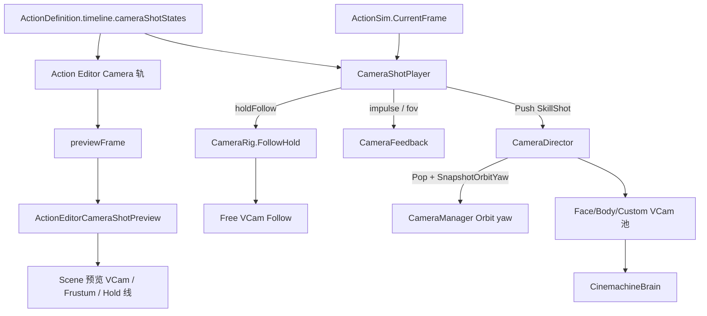

# 大招多机位 + 动作镜头拉伸 — 实现方案

> 制定：2026-08-29  
> 修订：2026-08-29 — **定案**：镜头窗纳入 `ActionDefinition.Timeline`（Camera 轨）；Scene 快捷预览走 `IActionEditorPreviewExtension`；**不引入**独立 `CameraShotSequence` / Preset SO（零双轨；跨招复用走 Timeline Clipboard）  
> 样条接替：2026-08-30 已按 [CAMERA_SPLINE_INTEGRATION_PLAN.md](./CAMERA_SPLINE_INTEGRATION_PLAN.md) 完成代码切换；本文后续出现的 `vcamKey/Anchor/localOffset/dollyPunch` 仅为历史设计记录，运行时与 Editor 路径均已删除  
> 角色：**大招 SkillShot / 动作镜头拉伸** 的结构与排期真源（先文档，后实现）  
> 上位总览（LockOn / UI 展示舱仍归该篇）：[`../2026.8.26/CAMERA_SYSTEM_PLAN.md`](../2026.8.26/CAMERA_SYSTEM_PLAN.md)  
> 权威前置：[`../2026.8.13/CAMERA_AUTHORITY_AND_TARGETING_REFACTOR_PLAN.md`](../2026.8.13/CAMERA_AUTHORITY_AND_TARGETING_REFACTOR_PLAN.md)  
> 历史设计细节：[`../2026.8.6/CAMERA_SYSTEM_PLAN.md`](../2026.8.6/CAMERA_SYSTEM_PLAN.md) §5.5  
> Action Editor：[`../ACTION_EDITOR.md`](../ACTION_EDITOR.md)、已有 `IActionEditorPreviewExtension`  
> 对照实现（只读吸收）：`D:\Projects\ZZZACTGame`、`D:\Projects\zzzdemo-source-code`、`D:\Projects\DemoClient`  
> 装配链：`ActionDefinition.Timeline.CameraShotStates → CameraShotPlayer(CurrentFrame) → CameraDirector`；编辑：`Action Editor Camera 轨 + Scene PreviewExtension`

---

## 0. 一句话

用 **`ActionDefinition.Timeline` 的 Camera 轨（逻辑帧窗口）+ `CameraDirector` 栈 + VCam 租用池** 做大招多段特写/回身与拉伸；Action Editor scrub 时用 **Scene 预览相机** 快捷看机位/轨迹；时钟只认 `ActionSim.CurrentFrame`；**禁止**引入 `CameraShotSequence` / Preset SO 第二入口，禁止 Animator / `vcam.enabled` 散落切镜，禁止 `Time.timeScale` 当镜头时钟。

---

## 1. 问题与动机

### 1.1 本仓库现状基线（2026-08-29 磁盘核对）

```text
ILocalPlayer.LookInput
  → CameraManager.ApplyLookInput / ApplyFollowFacingYaw
  → CameraOrbitPivot + CameraPitchPivot
  → 唯一 CM ThirdPerson（Transposer + HardLookAt + Collider）
  → StageMoveReferenceYaw → InputFrame.MoveReferenceYawQuantized

AttackHitEvent → CameraShakeController（玩家进攻命中 Impulse）
lateralFollowFactor → 侧向攻击轻微「滤左右」（非招式窗可控拉伸）

有：C-AT（MoveReferenceYaw + SelectedTarget + 本地 CameraLock 契约）
无：CameraDirector / CameraRig 类型 / CameraShotSequence / CameraShotPlayer
无：ActionDefinition 相机引用；无 FollowHold 运行时
```

| 点 | 现状 |
|----|------|
| 日常机位 | 单 VCam；滤左右 + L-DIR5 跟朝向 |
| 大招 | 只能第三人称跟跑，无法特写 / 回身 / 段内 FOV |
| 动作拉伸 | 仅全局 `lateralFollowFactor`；无法按招式帧窗钉死 Follow |
| 文档 | 8.26 篇已定 Director/SkillShot 骨架，**C0～C3 代码未开工** |

### 1.2 三项目大招镜头对照

#### A. ZZZACTGame（最简：状态机 + SetActive）

```text
BigSkillStart Enter:
  Brain.DefaultBlend = Cut(0)
  freeLook.SetActive(false)
  bigSkillStartShot.SetActive(true)

BigSkill Enter:
  startShot off → bigSkillShot on

BigSkillEnd Enter:
  shot off
  Brain.DefaultBlend = EaseInOut(1s)
  freeLook on + ResetFreeLook(X=角色 yaw, Y=0.5)
```

| 吸收 | 拒绝 |
|------|------|
| 大招分「起手机位 / 主体机位 / 收尾回日常」三段语义 | 在 PlayerState 里 `SetActive` 切镜 |
| 进入硬切、退出 EaseInOut + **回写 FreeLook 水平角**防猛甩 | FreeLook 当日常真源（本仓库已是 Orbit/Pitch 自管） |
| 起手/主体各一台预制 VCam | 每角色永久挂两台 GameObject 当唯一方案 |

#### B. zzzdemo-source-code（角色 × 技能类型 → StateDrivenCamera 池）

```text
PlayerSkillState.Enter
  → CameraSwitcher.ActiveStateCamera(characterName, attackStyle)
       // Priority 0 → 20；池键 = CharacterName × AttackStyle(Finish/Switch/…)

PlayerSkillState.Exit
  → UnActiveStateCamera(…)  // Priority → 0

FinishSkill Prefab:
  CinemachineStateDrivenCamera
    ├─ 「可琳特写镜头」(FramingTransposer…)
    └─ 「可琳大招相机」
  （子机位由 Animator 状态驱动；本仓 AnimatedTarget 常空，靠优先级抢权）

切人 QTE:
  ActiveSwitchCamera + Time.timeScale=0.06（CameraHitFeel）
```

| 吸收 | 拒绝 |
|------|------|
| **按角色/技能类型租用机位池**，禁止每招 Instantiate | `CinemachineStateDrivenCamera` 绑 Animator 当权威时钟 |
| Priority 抢权（非散落 enabled）→ 本仓升为 **Director 栈 Priority** | `Time.timeScale` 驱动慢镜（与锁步/逻辑帧冲突） |
| Finish / Switch 分资产 | 字典里 `if (characterName)` 作为终态差异手段（差异应在 Sequence 资产） |

#### C. DemoClient（Timeline Notify + 支援机位 + Follow 钉死）

```text
AssistCameraNotifyState Begin/End
  → RoleCtrl.EnterAssistCamera / ExitAssistCamera
       取 left/right 中离当前相机更近者 enabled=true
       并把该 VCam 水平角写回日常 POV（退出不猛甩）

HoldCameraFollowNotifyState
  Begin: 记 vcamFollow 世界坐标 + local
  Tick:  vcamFollow.position = 钉死世界坐标   // 角色冲出去，镜头锚点不动
  End:   还原 localPosition

ControlAssistCameraNotify（点事件）同语义
CinemachineZoomController: 滚轮改 FramingTransposer.m_CameraDistance
```

| 吸收 | 拒绝 |
|------|------|
| **最近候选机位** + **退出回写日常 yaw** | `VCam.transform.forward` / POV 作玩法朝向 |
| **`HoldCameraFollow` = 本方案「镜头拉伸」主手段** | Timeline 作为普招/大招主时钟（超重演出才 Timeline） |
| 距离/FOV 作表现脉冲 | 业务里 `Find("第三人称VCam")` |

### 1.3 「镜头拉伸」定案语义

产品上指：**招式位移窗内，Follow 锚点故意滞后或钉死，角色在画面中被「拉出去」再回收**；可叠加短 FOV/距离脉冲强化冲击感。

| 层 | 手段 | 对应参考 |
|----|------|----------|
| 主路径 | `holdFollow`：窗内钉 `FollowAnchor` 世界坐标，结束还原 | DemoClient `HoldCameraFollowNotifyState` |
| 增强 | `fovPunch` / `dollyPunch`（距离相对脉冲，不写 InputFrame） | 8.6 篇 FOV；demo Zoom 注释意图 |
| 已有近似 | `lateralFollowFactor`（全局侧向滤） | Wave1 止血；**不可替代**招式窗拉伸 |
| 不做 | `Time.timeScale` 假拉伸；在 Motor 里减速伪装镜头 | zzzdemo QTE 慢镜 |

### 1.4 痛点

1. 放大招无法切特写 / 回身，只有日常第三人称。  
2. 冲刺斩 / 突进类招式没有「镜头先留、人先冲」的拉伸窗，侧向滤左右又无法按帧配置。  
3. 若照搬三项目任一终态（State SetActive / StateDriven / Timeline enabled），会再次打穿 MoveReferenceYaw，并在 `CameraManager` 堆身份分支。

### 1.5 目标

| 目标 | 说明 |
|------|------|
| 大招多机位 | 至少一条测试 Ult：脸特写 → 回身；Look 可抑制；结束恢复进入前 Free（或日后 LockOn） |
| 动作拉伸 | 至少一条测试突进招：帧窗内 FollowHold，角色明显「被拉出」构图，窗结束回收且无 yaw 猛甩 |
| 结构 | 镜头窗落在 **Action Timeline Camera 轨**；运行时只经 Director |
| 编辑 | Action Editor 拖块改 enter/exit；Scene 随 scrub 预览机位/Hold/FOV |
| 权威 | Shot / Hold / FOV / Impulse **不进** InputFrame / Sim Hash（Timeline 存的是表现数据，Sim 步进不读） |
| 不做 | 独立 `CameraShotSequence` / Preset SO 双入口；UI 展示舱（8.26 C5）；远端 SkillShot；Animator 切镜；`Time.timeScale` 时钟 |

---

## 2. 设计原则

1. **时钟只认逻辑帧**：`enterFrame/exitFrame` 对齐 `ActionSim.CurrentFrame`；卡肉帧冻结则 Shot/Hold 不提前切。  
2. **结构优先于 if**：招式差异 = 不同 Action 的 Camera 轨配置；禁止 `if (Ult)` / `if (角色名)` 切 VCam。  
3. **编辑与运行同一真源**：镜头窗在 `ActionDefinition.Timeline`；Scene 预览不另开第二套数据。  
4. **导演唯一入口**：Free / LockOn(预留) / SkillShot / Cutscene 只经 `CameraDirector`；禁止业务 `vcam.enabled` 旁路。  
5. **租用池，不永久实例爆炸**：`vcamKey` → Face / Body / Custom 池。  
6. **进出不硬甩**：Inherit Position；结束 `SnapshotOrbitYawFrom` 回写日常 Orbit yaw。  
7. **拉伸与切镜正交**：纯拉伸可只 Hold、不 Push SkillShot；大招可切镜且段内再 Hold。  
8. **零长期兼容**：不保留「单 VCam 硬拧 LookAt 冒充大招」与 Director 双轨。  
9. **资产人工**：Agent 不改 `.asset` / Prefab / `.inputactions`；只列 Editor 步骤。  
10. **Dedicated 无相机**：`ACTGame.Server` 禁止引用本模块。

---

## 3. 目标架构

### 3.0 配置归属定案（回答「能否纳入 ActionDefinition」）

**能，而且应当纳入。** 与 Hitbox / MotionModifier 同构；按 **零长期兼容** 只留一条入口：

| 方案 | 结论 |
|------|------|
| **A. Timeline Camera 轨（唯一真源）** | `ActionTimelineTrackKind.Camera` + `cameraShotStates[]` 嵌在 `ActionDefinition.timeline`；Action Editor 拖块 + Inspector |
| B. 独立 `CameraShotSequence` SO（含「仅作预设」变体） | **删除 / 不引入**。会形成「Timeline 与 SO」双配置入口；仓库尚无实现，勿造第二轨 |
| C. 镜头参数平铺 Action 顶层一长串字段 | **禁止** |

跨招复用：**复用已有 `ActionTimelineClipboard`**（复制 Camera 块到另一 Action），不另开 Preset SO。若日后确需共享库，须单独立项并写清「Import 只写入 Timeline、无运行时直读」——**不在本方案范围**。

```text
ActionDefinition
  └─ timeline
       ├─ hitboxStates / movementStates / …     // 逻辑相关
       └─ cameraShotStates[]                    // 表现唯一真源；Sim 不消费
            └─ CameraShotNotifyState
```

理由：`IActionEditorPreviewExtension` 已预留镜头预览；Sim 步进不读该轨，不破坏锁步；与 `no-legacy-compatibility` 一致——禁止「新轨 + 旧 SO」并存。

### 3.0b Scene 快捷预览定案

| 能力 | 做法 |
|------|------|
| scrub 跟帧 | Action Editor 当前预览帧 → `ActionEditorCameraShotPreview : IActionEditorPreviewExtension` |
| 机位 | 临时 Editor 预览 VCam（或 Scene Camera overlay）：按当前 Shot 的 `vcamKey`/锚点/FOV 摆 Pose；**不写** Play Mode Director 栈 |
| 轨迹 | Scene 画 FollowAnchor 路径折线 + 当前帧锥体/Frustum；Hold 窗内锚点钉死高亮 |
| 拉伸 | Hold 时预览角色位移 vs 钉死 Follow 的连线（「拉出」可视化） |
| 交互（CS3+） | 选中 Camera 块后可用 Handles 微调预览机位偏移；写入该 Shot 的 local offset（非改日常 Free VCam） |
| 禁止 | 预览改 `InputFrame` / 写进权威 Sim；预览依赖进入 Play Mode |

预览与运行时共用同一套 **锚点解析 + Shot 求值**（纯函数放 Domain，Editor/Runtime 各调），禁止两套 Pose 公式。

### 3.1 总图

```text
【编辑】
Action Editor Timeline Camera 轨
  → 改 cameraShotStates
  → scrub → ActionEditorCameraShotPreview（Scene）

【运行】
ActionSim.CurrentFrame（权威只读）
  → CameraShotPlayer 读 Action.Timeline.CameraShotStates
       ├─ Director.Push/Update(SkillShot, vcamKey, …)
       ├─ CameraRig.SetFollowHold / Clear
       └─ CameraFeedback（Impulse / FOV）

CameraDirector：Free / LockOn(预留) / SkillShot / Cutscene
CameraRig：CameraRoot → FollowAnchor → [Hold?] → Orbit/Pitch
```



### 3.2 关键契约

```text
CameraShotNotifyState : ActionNotifyState     // 与 Hitbox 同为区间窗
  trackName
  startFrame, endFrame                       // 对齐 ActionTimelineItem：闭区间 [start, end]
  vcamKey: None | Face | Body | CustomId      // None = 不切机位，只 Hold/FOV
  followAnchor / lookAtAnchor
  localOffset / lookAtOffset                  // 可 Scene Handles 微调
  blendInSeconds, inheritPosition
  holdFollow: bool
  fovOverride, fovPunchDegrees, dollyPunchMeters
  impulseOnEnter: CameraShakeProfile
  // Sequence 级字段（restoreMode / suppressLook）挂 Action 级 CameraTrackSettings
  // 或第一条 Shot / 专用 header 窗口 — 实现时只留一种

ActionTimeline
  + cameraShotStates[]
  + tracks 可含 Kind=Camera

CameraShotPlayer
  本机 ∧ 当前 Action 的 cameraShotStates 非空
    → 帧落入 Shot → Apply；换段 → 切；结束/Cancel → Clear + restore
  远端：首版不播

CameraRig
  SetFollowHold(worldPos) / ClearFollowHold()
```

> **已否决 / 实现阶段不得创建：** `CameraShotSequence` SO、`CameraShotPreset` SO、`ActionDefinition` 顶层 Sequence 引用槽。

### 3.3 边界

| 层 | 负责 | 不负责 |
|----|------|--------|
| `ActionDefinition.timeline.cameraShotStates` | 招式镜头/拉伸窗 **唯一真源** | 命中、伤害、Sim Hash |
| `CameraShotPlayer` | 帧 → 当前 Shot | 写 Motor / Targeting |
| `ActionEditorCameraShotPreview` | Scene scrub 预览 | Play Mode 权威栈 |
| `CameraDirector` | 模式栈、Priority、Look、yaw 回写 | 选敌、展台 |
| `CameraRig` | FollowAnchor / Hold / 滤左右 | 切 VCam |
| `ActionSim` | `CurrentFrame`、打断 | 持有镜头状态；**不枚举 Camera 窗做逻辑** |
| `ActionTimelineClipboard` | 跨招复制 Camera 块 | 另立 Preset 资产类型 |

### 3.4 与 8.26 篇关系

| 8.26 阶段 | 本方案 |
|-----------|--------|
| C0 CameraRig | **CS0** 必做（Hold 依赖） |
| C1 LockOn 构图 | **不阻塞**；Director 栈先落地，LockOn VCam 可空实现 |
| C2 FollowHold / Feedback | **CS1** 拉伸可感切片（可先于完整大招） |
| C3 SkillShot | **CS2～CS3** |
| C4 Timeline / C5 UI | **不在本方案范围** |

---

## 4. 范围声明

| 阶段 | 包含 | 不包含 |
|------|------|--------|
| CS0 | CameraRig 抽出；Director 栈骨架 + Look 门控 | LockOn TargetGroup |
| CS1 | FollowHold + Timeline Camera 轨最小块 + 一条突进拉伸 | 多段切镜 / Scene 预览完整 |
| CS2 | ShotPlayer + Face/Body 池 + 测试大招两段 | Timeline Finisher |
| CS3 | **Scene 快捷预览** + Action Editor Camera 轨完整 UX + FOV/dolly punch | UI 展台、远端 SkillShot |
| CS4 | （可选后置）Cutscene 抢权与 SkillShot 共存 | 对话双人构图产品化 |

---

## 5. 分阶段交付（任务 / 验收 / 出口）

> 勾选：未开始 `[ ]`；完成后 `[x]` 并在出口注明日期。

### CS0 — CameraRig + Director 栈骨架

**任务**

- [x] 从 `CameraManager.SyncOrbitPivots` 抽出 `CameraRig`：写入 `CameraRoot` / `FollowAnchor` / Orbit / Pitch；保留现 `lateralFollowFactor` 语义  
- [x] 新增 `CameraDirector` + `CameraDirectorStack`（纯逻辑可单测）：模式 `Free` / `LockOn` / `SkillShot` / `Cutscene`；Priority 10 / 20 / 80 / 90+  
- [x] `SetGameplayLookEnabled(false)` 时冻结 staged yaw；`CameraLockEnabled` 写入迁到 Director（Manager 只转发）  
- [x] **删除** `CameraManager` 内第二份 lock bool / 重复跟随算法（抽 Rig 后）  
- [x] EditMode：`CameraDirectorStackTests`（Push/Pop/restore、高优覆盖）

**验收**

- [ ] Play：日常跟随、侧向滤、L-DIR5、传送吸附与抽 Rig 前一致  
- [x] `rg "class CameraRig"` 仅一处；`CameraManager` 不再内联吸收左右分量  
- [ ] 栈单测绿；Unity 编译在 Editor 确认通过  

**出口：** 日常跟随只由 Rig 写；导演栈可 Push/Pop 且能冻 Look。→ **未达成**

### CS1 — 动作镜头拉伸（FollowHold）+ Timeline 落点

**任务**

- [x] 新增 `CameraShotNotifyState`（区间窗）+ `ActionTimeline.cameraShotStates`  
- [x] `ActionTimelineTrackKind.Camera`；`ActionTimelineCommands` / Styles / Clipboard 接轨  
- [x] `CameraRig.SetFollowHold` / `ClearFollowHold`  
- [x] `CameraShotPlayer` 最小闭环：只消费 Hold（可暂不 Push SkillShot）  
- [ ] Editor 人工：突进测试招加一段 `holdFollow=true` 的 Camera 块  
- [x] **删除 / 不引入** `CameraShotSequence`、`CameraShotPreset` 及 Action 顶层 Sequence 引用；跨招复用只走 Clipboard  
- [x] **删除** 任何试验性「在 Action State 里直接改 orbitPivot.position」旁路  

**验收**

- [ ] Action Editor 可见 Camera 轨并可拖 enter/exit  
- [ ] Play：测试招窗内 Follow 钉死/滞后，窗结束回收，无硬切飞镜  
- [ ] 卡肉时 Hold 不提前 Clear；无 Camera 窗的普攻与改前一致  
- [x] `ActionSim` / Hit 管线不消费 `cameraShotStates`（rg 可证）  
- [ ] Unity 编译 / Play 在 Editor 确认通过  

**出口：** 镜头拉伸可在 ActionDefinition 时间轴配置并运行。→ **未达成**

### CS2 — 大招多段 SkillShot

**任务**

- [x] 完善 `CameraShotNotifyState`：`vcamKey`、锚点、offset、blend、impulse、fovOverride  
- [x] Action 级 `restoreMode` / `suppressLookInput`（只留一种挂法）  
- [x] Face / Body（及可选 Custom）可租用 VCam 池；禁止每招 Instantiate  
- [x] `CameraShotPlayer`：换段 Push/Update SkillShot；结束 Pop + `SnapshotOrbitYawFrom`  
- [x] 段入 `CameraFeedback` Impulse；SkillShot 池默认不挂 Collider  
- [ ] Editor 人工：测试 Ult — Shot0 脸特写 → Shot1 回身  
- [x] EditMode：帧窗命中 / 无重叠歧义 / 结束 Clear 单测  
- [x] **删除** Animator State / `SetActive` 切镜试验代码（若出现）  

**验收**

- [ ] Play：放大招自动特写，第一段后回身；Look 被抑制  
- [ ] 自然结束 / Cancel / 受击打断后回到进入前 Free  
- [ ] 卡肉时 Shot 不提前切  
- [x] 相机消费 `CurrentFrame` 的路径可 rg 证明唯一  
- [ ] Unity 编译 / Play / Test Runner 在 Editor 确认通过  

**出口：** 本机大招可多段切机位并安全恢复。→ **未达成**

### CS3 — Scene 快捷预览 + 拉伸增强

**任务**

- [x] `ActionEditorCameraShotPreview : IActionEditorPreviewExtension`：scrub 时 Scene 显示预览 VCam Pose / Frustum / Hold 连线  
- [x] 选中 Camera 块时 Handles 微调 `localOffset`（写入该窗，不改 Free VCam）  
- [x] Domain 纯函数 `CameraShotPoseResolver`：Editor 预览与 Runtime 共用  
- [x] `fovPunch` / `dollyPunch`；Hold + SkillShot 同段叠加运行路径  
- [x] Action Editor Inspector：Camera 块字段与 Hitbox 同级可编；Clipboard 可复制 Camera 块  
- [x] 实现后 TECHNICAL 补 SkillShot / FollowHold / Editor 预览节  
- [x] 验收：`rg "CameraShotSequence|CameraShotPreset"` 仓库无类型定义

**验收**

- [ ] **不进 Play**：Action Editor scrub，Scene 中机位/锥体随帧切换；Hold 窗可见拉伸连线  
- [ ] Handles 改 offset 后 scrub 立刻反映，保存进当前 `ActionDefinition`  
- [ ] Play：突进招同时有拉伸与短 FOV/距离脉冲，结束后恢复  
- [ ] 预览路径不写 `InputFrame` / Motor  
- [ ] Unity 编译在 Editor 确认通过  

**出口：** 策划可在 Action Editor + Scene 快捷预览并改机位；拉伸与切镜可同段配置。→ **未达成**

### CS4 — Cutscene 抢权（后置，可选）

**任务**

- [ ] Timeline / 关卡高优 VCam 只经 `Director.Push(Cutscene)`  
- [ ] Cutscene 可盖 SkillShot；结束按栈恢复，不卡死  

**验收**

- [ ] 演出结束回到进入前 Gameplay 模式  
- [ ] Unity 编译 / Play 在 Editor 确认通过  

**出口：** 过场与大招共用一个栈。→ **未达成**

---

## 6. 迁移与兼容

### 6.1 保留 / 迁入

| 现有 | 终态 |
|------|------|
| `CameraManager` Orbit / 滤左右 / L-DIR5 | Free Rig 驱动 + Look；算法进 `CameraRig` |
| `CameraLockEnabled` 契约 | 迁入 Director |
| `CameraShakeController` | 收进 `CameraFeedback`（可先包装） |
| `ActionSim.CurrentFrame` | Shot / Hold 唯一时钟 |
| `IActionEditorPreviewExtension` | Camera Scene 预览扩展点已预留 |
| 8.26 篇 C5 UI | 仍归 8.26；本方案不实现 |

### 6.2 明确删除

| 删除 | 替代 |
|------|------|
| `CameraManager` 内联滤左右 + 第二份 lock bool | `CameraRig` + `CameraDirector` |
| 「镜头只挂独立 SO / Preset」入口 | `timeline.cameraShotStates` + Clipboard |
| Animator / PlayerState `SetActive` 切镜 | Camera 轨 + Director |
| StateDrivenCamera 绑 Animator 当时钟 | 逻辑帧 ShotPlayer |
| `Time.timeScale` 作大招/拉伸时钟 | HitStop 逻辑帧冻结 |
| 每招永久 VCam 实例 | `vcamKey` 池 |
| Editor/Runtime 两套 Pose 公式 | 共用 `CameraShotPoseResolver` |

不允许长期「Director 与 CameraManager 各切一套 VCam」。

---

## 7. 目录与文件预期（增量）

```text
Assets/Scripts/Domain/Combat/Actions/Definitions/Timeline/
  ActionTimeline.cs                 // + cameraShotStates
  ActionTimelineTrack.cs           // + Camera kind
  CameraShotNotifyState.cs         // 区间窗

Assets/Scripts/Domain/Camera/
  CameraMode.cs / CameraRestoreMode.cs / CameraDirectorStack.cs
  CameraShotVcamKey.cs / CameraShotAnchor.cs
  CameraShotPoseResolver.cs        // Editor+Runtime 共用求值

Assets/Scripts/App/Controllers/Camera/
  CameraManager.cs / CameraDirector.cs / CameraRig.cs
  CameraShotPlayer.cs / CameraFeedback.cs

Assets/Scripts/Editor/Combat/ActionEditor/
  … TimelineCommands / Styles / NotifySelectionDrawer 接 Camera
  ActionEditorCameraShotPreview.cs // IActionEditorPreviewExtension

Assets/Scripts/Domain/Combat/Actions/Definitions/
  （禁止新增 CameraShotSequence.cs / CameraShotPreset.cs）

Assets/Tests/Editor/Camera/
  CameraDirectorStackTests.cs
  CameraShotNotifyFrameTests.cs

docs/2026.8.29/CAMERA_SKILLSHOT_AND_STRETCH_PLAN.md
```

---

## 8. 风险与对策

| 风险 | 对策 |
|------|------|
| Timeline 膨胀 / Sim 误读 Camera | 约定 Sim 枚举不碰 `cameraShotStates`；验收用 rg |
| Shot 与逻辑帧不同步 | enter/exit 只认 `CurrentFrame` |
| Hold / 预览结束猛甩 | Clear 平滑；运行时 `SnapshotOrbitYawFrom` |
| Editor 预览与 Play 机位不一致 | 共用 `CameraShotPoseResolver` |
| 特写穿墙 | SkillShot 段降/关 Collider |
| Handles 误改日常 Free VCam | 只写当前 Shot 的 localOffset |
| LockOn 未做阻塞大招 | 先 Free↔SkillShot；LockOn 槽预留 |

---

## 9. Editor 人工步骤

1. 玩家 Prefab：确认/补 `FaceAnchor`、`Chest`/`CameraRoot`。  
2. 场景：Skill VCam 池根（或运行时生成约定）。  
3. Action Editor：测试突进招加 Camera 轨 → 一段 Hold；测试 Ult 两段 Face→Body。  
4. Brain Blend：起手可硬切，收尾 0.2～0.4s。  
5. 跨招复用：用 Action Editor Clipboard 复制 Camera 块。  
6. Dedicated 场景确认无 CameraShotPlayer 强依赖。

---

## 10. 推荐开工顺序

```text
CS0 CameraRig + Director 栈
  → CS1 Timeline Camera 轨 + FollowHold
  → CS2 大招两段 SkillShot
  → CS3 Scene 预览 + Handles + FOV/dolly
  →（可选）CS4 Cutscene
```

**最小可感切片：** CS1 在 Action Editor 拖出 Hold 块并能 Play 见拉伸；CS3 补「不进 Play 也能在 Scene 看机位」。

---

## 11. 方案完成定义

同时满足：

1. 镜头窗在 **ActionDefinition Timeline Camera 轨** 配置；运行时本机多段切机位并可恢复。  
2. 至少一条招式可配置 FollowHold 拉伸，可与切镜叠加。  
3. Action Editor scrub 时 Scene 可快捷预览机位/轨迹/Hold（不依赖 Play）。  
4. `ActionSim` 不消费 Camera 窗；相机消费 `CurrentFrame` 路径唯一。  
5. CS0～CS3 出口关闭；CS4 可后置。

---

## 12. 变更日志

| 日期 | 说明 |
|------|------|
| 2026-08-29 | 初版：三项目对照；SkillShot + FollowHold；CS0～CS4 |
| 2026-08-29 | **定案**：Camera 窗纳入 Timeline；Scene 预览走 PreviewExtension；**删除/不引入** `CameraShotSequence` 与 Preset SO（零双轨；跨招用 Clipboard） |
