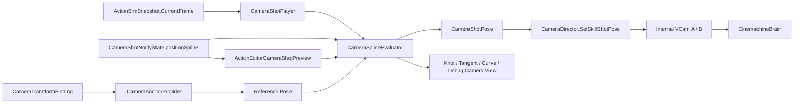

# Action Camera Spline — 样条轨迹接入计划

> 制定：2026-08-29  
> 角色：**Action Camera 位置轨迹与 Scene 样条编辑的实施真源**；接替现有单 `localOffset + dollyPunch` 机位模型  
> 上位方案：[CAMERA_SKILLSHOT_AND_STRETCH_PLAN.md](./CAMERA_SKILLSHOT_AND_STRETCH_PLAN.md)  
> 总览方案：[../2026.8.26/CAMERA_SYSTEM_PLAN.md](../2026.8.26/CAMERA_SYSTEM_PLAN.md)  
> 状态：C-SP0～C-SP3 代码已实施，Unity 2022.3.62f3c1 编译通过；Test Runner / Play 待人工验收

---

## 0. 一句话

以 **ActionDefinition Camera 窗内嵌的官方 `UnityEngine.Splines.Spline`** 作为演出相机位置唯一真源，用通用参考坐标系把样条绑定到角色 Root / 自定义锚点 / 目标或世界，并由 `CameraSplineEvaluator` 同时服务 Runtime 与 Action Editor；删除现有 `localOffset`、`dollyPunchMeters`、固定 Face/Body VCamKey 和 Face/Chest Anchor 预制语义。项目保持 Cinemachine 2.10.7，不接入 CM3 `CinemachineSplineDolly`，也不保留单双轨兼容分支。

---

## 1. 问题与动机

### 1.1 现状基线

```text
ActionDefinition.timeline.cameraShotStates[]
  → CameraShotNotifyState
       vcamKey
       followAnchor / lookAtAnchor
       localOffset
       dollyPunchMeters
  → CameraShotPoseResolver.ResolveLocalOffset(frame)
  → CameraDirector.SetSkillShot(...)
  → CinemachineTransposer.m_FollowOffset

ActionEditorCameraShotPreview
  → 按窗口采样最多 25 个逻辑帧
  → 每帧仍只求「Anchor + 单 localOffset + Dolly」
  → Scene 只能拖一个 PositionHandle
```

现有实现可做多段机位切换、FollowHold、直线 Dolly 与 FOV Punch，但不存在可编辑的空间曲线。所谓“轨迹线”只是把每帧单点结果连起来，不能表达环绕、螺旋、S 弯、越肩切入等机位运动。

### 1.2 痛点

1. `localOffset` 只能表达一个机位；同一窗口内不能沿曲线移动。  
2. `dollyPunchMeters` 只沿局部 Z 做固定正弦变化，无法替代通用轨迹。  
3. `Face/Body` 同时被当作 VCam 池槽名，和模型部位语义混淆。  
4. `FaceAnchor/ChestAnchor` 固定命名会把招式配置绑定到某套模型规格。  
5. Scene 只有单点 Handle；无法编辑 Knot、切线、闭合/开放路径。  
6. 预览若在 Handle 拖动期间逐点重采动画，会再次造成 Editor 卡顿。

### 1.3 目标与不做

| 项 | 目标 |
|----|------|
| 位置轨迹 | Camera 窗用三次 Bé塞尔链表示完整局部轨迹；静止机位也是合法样条 |
| 官方依赖 | `com.unity.splines` 2.8.4；只使用数据与 `SplineUtility`，不要求场景 `SplineContainer` |
| 坐标空间 | 样条依附通用 `CameraTransformBinding`；空 AnchorId = Root，不写死 Face/Chest |
| 运行时 | 只读 `ActionSimSnapshot.CurrentFrame`；共享求值器输出世界 Position / LookAt / FOV |
| 编辑器 | Scene 可增删 Knot、拖位置与入/出切线；Scrub 与 Runtime 同公式 |
| 速度 | 支持参数速度曲线；终态支持弧长表恒速 |
| 性能 | 拖 Handle 时不重采整段动画；释放后按 Dirty Revision 重建预览缓存 |
| 零兼容 | 删除旧单偏移、Dolly 与固定枚举入口；不保留 Legacy/Fallback 双轨 |
| 不做 | 不把样条放进 `ActionSim`；不影响命中/输入/同步；不引入独立 Spline SO |
| 不做 | 不直接修改任何 `.asset`、Prefab 或美术资源；配置由用户在 Editor 完成 |

---

## 2. 设计原则

1. **Spline 是位置唯一真源**：开启机位覆盖的 Camera 窗必须有有效样条；禁止 `path 无效 → localOffset` 回退。  
2. **参考系不可消失**：删除的是固定部位枚举与单偏移，不是空间参考系；世界轨迹和跟随角色轨迹必须显式区分。  
3. **数据仍内嵌 ActionDefinition**：官方 `Spline` 直接序列化在 `CameraShotNotifyState`，禁止另建 `SplineContainer`、`CameraSplineAsset/Preset` 双入口。  
4. **Runtime / Editor 共用纯求值器**：`SplineUtility` 负责 Bé塞尔与长度缓存，项目层只实现速度映射、Binding 与 FOV 求值。  
5. **模型差异走 Binding**：Action 写字符串 AnchorId；角色侧 Provider 映射到 Transform，禁止 Action 写死模型节点名。  
6. **导演内部管理 VCam**：Action 不选择 Face/Body 池槽；Director 用内部 A/B Ping-Pong VCam 完成段间 Blend。  
7. **逻辑帧只作时钟**：相机读取 `CurrentFrame`，不得写回 `InputFrame`、Motor、Targeting 或 Sim Hash。  
8. **Editor 性能有预算**：拖拽期 O(1) 更新当前机位；完整路径采样只在鼠标释放、窗口或 Knot 变化后发生。  
9. **零长期兼容**：切换时同步删除旧字段、旧枚举、旧 Inspector 和旧测试语义。

---

## 3. 目标架构

### 3.1 数据流



### 3.2 数据契约

```text
CameraShotNotifyState : ActionNotifyState
  overrideCameraPose: bool
  referenceBinding: CameraTransformBinding
  positionSpline: UnityEngine.Splines.Spline
  speedCurve: AnimationCurve
  constantSpeed: bool
  lookAtBinding: CameraTransformBinding
  lookAtLocalPosition: Vector3
  fieldOfViewCurve: AnimationCurve
  blendInSeconds
  inheritPosition
  holdFollow
  impulseOnEnter

CameraTransformBinding
  source: Character | SelectedTarget | World
  anchorId: string                    // Character 下空串 = Root
  space: Dynamic | Snapshot

UnityEngine.Splines.Spline
  BezierKnot[]                         // 至少 2 个
  TangentMode                         // AutoSmooth / Linear / Mirrored / Continuous / Broken
  官方 Length / Curve LUT 缓存

CameraShotPose
  worldPosition
  worldLookAt
  fieldOfView
```

`World` Binding 使用世界单位参考系（Identity），样条 Knot 即世界坐标；`SelectedTarget` 缺失时该 Shot 不抢权并报告配置/运行时诊断，禁止静默回退 CharacterRoot。

### 3.3 Bé塞尔与帧映射

```text
windowT = clamp01((frame - StartFrame) / max(1, EndFrame - StartFrame))
progress = speedCurve(windowT)
pathT = constantSpeed
  ? 按 GetCurveLength 累计到目标 Bezier 段，再用 GetCurveInterpolation 求段内 t
  : progress
localPosition = Spline.EvaluatePosition(pathT)
worldPosition = referencePose.TransformPoint(localPosition)
```

Bezier 分段、TangentMode 约束、长度 LUT 及 Knot 修改后的缓存失效均由官方 Splines 2.8.4 实现。

### 3.4 VCam 抢权

`CameraShotVcamKey` 从 Action 数据删除。`CameraDirector` 内部持有固定 A/B 两台 SkillShot VCam：

```text
同一 Shot 每帧：更新当前槽 Pose
Shot A → Shot B：配置非当前槽 → 设高 Priority → Cinemachine Blend
窗口结束：Pop SkillShot → 恢复 Free / LockOn → 回写 yaw
```

因此模型或招式不再知道池槽名称，同时保留多段切镜 Blend。

### 3.5 LookAt 定案

首版位置使用样条，观察点使用 `lookAtBinding + lookAtLocalPosition`。不同时引入第二条 LookAt 样条，避免一次重构把位置、构图和 Roll 全部耦合。

后续只有在真实需求出现“观察点也沿路径移动”时，才把 `lookAtLocalPosition` 替换为第二条官方 `Spline`；不得在首版并存两种 LookAt 写法。

### 3.6 层边界

| 层 | 负责 | 不负责 |
|----|------|--------|
| 官方 `Spline` / `BezierKnot` | 可序列化轨迹数据、Bezier、长度缓存 | Transform 查找、Cinemachine |
| `CameraSplineEvaluator` | 速度曲线、恒速入口、局部 Pose | Scene Handles、ActionSim |
| `CameraShotPoseResolver` | Binding + Spline → 世界 CameraShotPose | VCam Priority |
| `CameraShotPlayer` | 当前 Action/帧/Shot → 求值请求 | 插值公式、写模拟 |
| `CameraDirector` | A/B VCam、Blend、恢复 | 模型 AnchorId 规则 |
| `ActionEditorCameraSplinePreview` | Knot/切线编辑与缓存绘制 | Runtime 栈、资产自动改写 |
| `ActionSim` | 提供整数动作帧 | 枚举或执行 Camera/Spline 数据 |

---

## 4. 范围与阶段总览

| 阶段 | 必达 | 交付焦点 |
|------|------|----------|
| C-SP0 | ✅ | Spline 数据契约与纯求值器 |
| C-SP1 | ✅ | Runtime 单轨切换；删除旧 offset/dolly/vcamKey |
| C-SP2 | ✅ | Action Editor Knot / Tangent Scene 编辑 |
| C-SP3 | ✅ | 恒速、编辑交互、性能与完整验收 |
| 方案完成 | ✅ | C-SP0～C-SP3 全部出口关闭 |

---

## 5. 分阶段交付（任务 / 验收 / 出口）

> 勾选：未开始 `[ ]`；完成后 `[x]` 并在出口注明日期。

### C-SP0 — Spline 数据与纯求值器

**任务**

- [x] 接入官方 `Spline` / `BezierKnot` / `TangentMode`，不维护项目私有 Knot 模型  
- [x] 新增 `CameraTransformBinding`、`CameraBindingSource`、`CameraBindingSpace`  
- [x] 新增 `CameraSplineEvaluator.TryEvaluate(spline, normalizedTime)`；统一速度曲线与局部位置求值  
- [x] 使用官方 `GetCurveLength/GetCurveInterpolation` 与内部 LUT 按各 Bezier 段累计弧长，支持 `constantSpeed`  
- [x] `CameraShotPoseResolver` 改为输出 `CameraShotPose`，位置只读 Spline  
- [x] EditMode：`CameraSplineEvaluatorTests` 覆盖端点、恒速、缓存失效与 Pose  

**验收**

- [ ] Test Runner：端点严格命中首末 Knot；段连接无位置断裂  
- [ ] Test Runner：官方 TangentMode 行为与缓存失效测试通过  
- [ ] Test Runner：恒速开启后等帧位移误差在约定容差内  
- [x] `positionSpline` 无效时返回显式 Invalid，不读取任何旧 offset  
- [x] 求值测试不依赖 Cinemachine 或 Scene 对象  

**出口：** 样条位置代码可由整数帧稳定求值，且无旧单偏移回退。→ **代码达成（2026-08-30），Test Runner 待验收**

### C-SP1 — Runtime 单轨切换

**任务**

- [x] `CameraShotNotifyState` 新增 `overrideCameraPose/referenceBinding/positionSpline/lookAtBinding/lookAtLocalPosition/fieldOfViewCurve`  
- [x] `CameraDirector` 改为内部 A/B Ping-Pong SkillShot VCam，不再接收 authored `VcamKey`  
- [x] `CameraShotPlayer` 按 Shot 实例切换 A/B 槽；同 Shot 每帧只更新当前槽 Pose  
- [x] Dynamic Binding 每帧读 Anchor Pose；Snapshot Binding 仅在 Shot Enter 捕获一次  
- [x] 保留 `holdFollow` 作为 Free Rig 拉伸能力；它不再承担 SkillShot 位置轨迹  
- [x] `ActionTimelineCommands.AddWindow` 为 `overrideCameraPose=true` 创建两 Knot 静止样条默认值  
- [x] **删除** `CameraShotVcamKey`、固定 `CameraShotAnchor`、`localOffset`、`dollyPunchMeters`、`ResolveLocalOffset`  
- [x] **删除** Face/Body/Custom 池分支与 Inspector 字段；不保留兼容映射  

**验收**

- [x] Runtime 搜索无 `CameraShotVcamKey|CameraShotAnchor|localOffset|dollyPunchMeters|ResolveLocalOffset` 相机旧路径  
- [ ] 一段 Shot 可沿曲线移动；两段 Shot 可通过内部 A/B 正常 Blend  
- [ ] Cancel / 受击打断 / 自然结束均恢复进入前 Gameplay 模式  
- [ ] 卡肉时 `CurrentFrame` 不推进，样条位置保持不动  
- [ ] Dedicated / Simulation 源码不引用 Spline Runtime Controller 或 Cinemachine  

**出口：** Runtime 的演出相机位置唯一来自 Spline，旧机位数据路径已删除。→ **代码达成（2026-08-30），Play 待验收**

### C-SP2 — Action Editor 样条编辑

**任务**

- [x] 将 `ActionEditorCameraShotPreview` 重构为 Spline 单一职责终态类型  
- [x] Scene 常态只绘制 Knot、入/出 Tangent 与 Bezier 曲线；删除旧常驻机位 Frustum/LookAt Debug  
- [x] 选中 Camera 窗后支持 Insert Knot / Remove Knot / Reverse Path  
- [x] PositionHandle 只改当前 Knot；切线 Handle 通过官方 TangentMode 维护约束  
- [x] 新增 Linear / ArcUp / ArcDown / ArcLeft / ArcRight 端点规则；非 Custom 固定为开放两点路径并自动重建 Tangent  
- [x] Custom 才开放任意 Knot、Rotation 与 Tangent；开放路径首尾隐藏不参与曲段的无效 Tangent  
- [x] Inspector 绘制官方 Spline、SpeedCurve、ConstantSpeed 与 Binding  
- [x] Clipboard 遍历隐藏 MetaData 和嵌套数组，复制完整 Spline / TangentMode / 曲线  
- [x] `ActionDefinition60HzMigrator` 只缩放 Camera 窗口帧；官方 Knot 不存逻辑帧时间  
- [x] `ActionDefinitionAuditUtility` 增加 Knot 数量、NaN/Infinity 与 Binding 校验  
- [x] **删除**旧单 PositionHandle、旧 offset trajectory hash 与旧 Inspector 字段  

**验收**

- [ ] 不进 Play 即可在 Scene 拖 Knot/切线，Scrub 相机沿同一曲线移动  
- [x] 拖动过程中不调用整段 `_worldPoseEvaluator` 重采；Snapshot 只在 Binding/Shot 变化时采一次  
- [ ] Profiler：固定 48 点数组复用，空闲 Scene GUI 无显著 GC Alloc  
- [ ] Undo/Redo、保存、切换 Action、Clipboard 后路径一致  
- [ ] Runtime 与 Editor 在同帧的 Position / LookAt / FOV 误差在浮点容差内  

**出口：** Action Editor 已提供完整样条代码路径，无单点 Offset 编辑残留。→ **代码达成（2026-08-30），Editor 操作待验收**

### C-SP3 — 恒速、编辑交互与产品验收

**任务**

- [x] 增加“Flatten Tangents / Smooth Tangents / Frame Selected Path”编辑命令  
- [x] Knot 球与点击热区再次放大；浮窗提供起点/终点明确选择；仅 Custom 响应 E 与完整 Knot/Tangent 编辑  
- [x] 新增可停靠 `ActionEditorCameraView`，用隐藏 Camera + RenderTexture 自动预览当前 Shot Pose/FOV；删除 SceneView Debug 接管
- [x] Camera Inspector 隐藏未使用的 Int/Float/Float4/Object Spline 扩展数据；按当前预览帧 Position/LookAt/FOV 绘制视锥  
- [x] 复用官方 Spline 长度 LUT；Knot Setter 自动使缓存失效，Runtime 不自建 LUT  
- [x] 长路径 Scene 绘制固定 48 点上限；Handle 拖动不重采整段动画  
- [x] EditMode：官方长度缓存失效测试  
- [x] 更新 `TECHNICAL.md`、`ARCHITECTURE.md`、`CONVENTIONS.md` 与上位 Camera 方案状态  

**验收**

- [ ] Editor：预设规则只需拖首尾端点并自动成形；Custom 可编辑任意 Knot/Tangent；黄色视锥随预览帧沿路径移动  
- [ ] Editor：Camera View 随 Scrub/播放连续更新，SceneView 可同时自由导航且无 1cm/0.1° 阈值闪跳  
- [ ] Play：DynamicRoot 路径相对角色；SnapshotRoot 路径固定在进入姿态  
- [ ] ConstantSpeed 开关对比符合预期，无明显忽快忽慢  
- [ ] 32 Knot / 4 Camera 窗的 Action Editor 拖拽无明显卡顿  
- [x] Unity 2022.3.62f3c1 脚本编译通过
- [ ] 相关 EditMode Test Runner、普通攻击/突进/大招 Play 回归通过

**出口：** 样条已具备创作工具、恒速与性能约束代码，可替代旧机位模型。→ **代码达成（2026-08-30），产品验收待完成**

---

## 6. 迁移与删除

### 6.1 直接替换表

| 当前实现 | 终态 |
|----------|------|
| `CameraShotVcamKey Face/Body/Custom` | `CameraDirector` 内部 A/B Ping-Pong |
| `CameraShotAnchor Face/Chest/Custom` | `CameraTransformBinding(source + anchorId + space)` |
| `localOffset` | `positionSpline: UnityEngine.Splines.Spline` |
| `dollyPunchMeters` | 由 Spline Z 轨迹表达 |
| `fieldOfView + fovPunchDegrees` | `fieldOfViewCurve` |
| `ResolveLocalOffset` | `CameraSplineEvaluator` + `CameraShotPoseResolver` |
| 单 PositionHandle | Knot + Tangent Handles |
| 按 offset hash 的轨迹缓存 | 官方 Spline 长度缓存 + Editor 固定采样数组 |

### 6.2 资产处理

- 当前 Camera 轨仍处早期制作阶段，不写长期兼容读取器。  
- 实施切换时，已有 Camera 窗由用户在 Action Editor 重新配置。  
- 静止机位创建两个相同位置 Knot（t=0、t=1）；不是运行时 fallback。  
- Agent 不直接编辑 `.asset`；不自动改 `Assets/Data/**` 或 Prefab。  
- 若实施前确认已有大量正式 Camera 窗，再单独批准“一次性 Editor Migrator”；迁移完成后删除 Migrator，禁止留兼容层。

### 6.3 保留项

- `ActionDefinition.timeline.cameraShotStates` 仍是唯一配置入口。  
- `CameraDirectorStack`、模式 Priority、Look 门控、yaw 恢复保留。  
- `CameraRig.SetFollowHold/ClearFollowHold` 保留给不切机位的镜头拉伸。  
- `CameraFeedback` Impulse 保留。  
- `ActionTimelineClipboard` 继续作为跨招复用入口。

---

## 7. 目录与文件预期

```text
Assets/Scripts/Domain/Camera/
  CameraSplineEvaluator.cs
  CameraShotPoseResolver.cs              // 改：Binding + Spline → Pose
  CameraShotTypes.cs                     // Binding / Pose；删除旧 VcamKey / Anchor

Assets/Scripts/Domain/Combat/Actions/Definitions/Timeline/
  CameraShotNotifyState.cs               // 改：Spline 为位置唯一真源

Assets/Scripts/App/Controllers/Camera/
  CameraAnchorProvider.cs                // 新增：模型 AnchorId → Transform
  CameraDirector.cs                      // 改：内部 A/B Ping-Pong
  CameraShotPlayer.cs                    // 改：Enter 捕获 + 每帧 Evaluate

Assets/Scripts/Editor/Combat/ActionEditor/
  ActionEditorCameraShotPreview.cs       // Knot/Tangent/当前帧视锥/Camera View 推送
  ActionEditorCameraView.cs              // 独立隐藏 Camera + RenderTexture 构图预览
  Inspectors/ActionNotifySelectionDrawer.cs
  Timeline/ActionTimelineCommands.cs
  Timeline/ActionTimelineClipboard.cs

Assets/Tests/Editor/Camera/
  CameraSplineEvaluatorTests.cs          // Evaluator/ArcLength/Pose
```

---

## 8. 风险与对策

| 风险 | 对策 |
|------|------|
| 删除 Anchor 后失去跟随参考 | 不删除参考系；改为通用 Binding，删除固定部位枚举 |
| Bé塞尔参数速度不恒定 | 按各段 `GetCurveLength` 累计弧长，再用 `GetCurveInterpolation` 查表定位 |
| 切线导致过冲穿模 | 在独立 Camera View 检查实际构图；Smooth/Flatten 命令；Collider 后置 |
| 动态 Root 旋转导致轨迹整体转向 | Binding 显式 Dynamic/Snapshot，作者不可依赖隐式行为 |
| 两段共用一台 VCam 无法 Blend | Director 内部 A/B Ping-Pong |
| 拖 Knot 时重复采样导致卡顿 | 路径按当前参考 Pose 固定 48 点绘制；Snapshot 只在变更时重采进入帧 |
| 路径过长造成 Editor GC | 缓存数组复用；采样数量上限；空闲不 RepaintAll |
| LookAt 同时样条化导致范围膨胀 | 首版只做 Binding + LocalPosition；第二条 LookAt Spline 后置 |
| 旧资产字段丢失 | 实施前人工确认 Camera 窗数量；默认直接重配，不保留兼容 |

---

## 9. Editor 人工步骤

1. 实施切换后打开 `ACT/Action Editor`，选择测试 Action。  
2. 删除旧 Camera 窗并新建 Spline Camera 窗。  
3. 静止特写：保留两个相同位置 Knot；调整 LookAt Binding 与 FOV Curve。  
4. 点击青色 Knot 球选点；可先自由调整 Scene 视角，再选择 Keep Shot / Scene View / Custom FOV，并点击 `Scene 构图 → 选中点` 写入位置与朝向；FOV 后两种模式在当前预览帧写 Key。也可按 W 编辑位置，Custom 下按 E 编辑 Knot 旋转。  
5. 通过 Scene 浮窗或菜单 `ACT/Action Camera View` 打开专用构图窗口；拖动预览帧时 Camera View 自动更新，SceneView 继续自由观察和编辑。  
6. 角色移动镜头选择 Dynamic Character Root；定点演出选择 Snapshot 或 World。  
7. Test Runner 运行 §5 指定测试。  
8. Play 验证普通招式无 Camera 窗时不抢权；大招自然结束、Cancel、受击打断均恢复。  
9. Prefab / 模型若需自定义 AnchorId，由用户在 Editor 配置角色 Anchor Provider；Agent 不改 Prefab。

---

## 10. 推荐开工顺序

```text
C-SP0 纯数据/求值
  → C-SP1 Runtime 单轨切换并删除旧字段
  → C-SP2 Scene Knot/Tangent 编辑
  → C-SP3 恒速 + 编辑交互 + 性能验收
```

**最小可感切片：** C-SP1 用两个以上 Knot 让一段 Camera 窗在 Play 中沿曲线移动；随后 C-SP2 才开放 Scene 创作，不允许 Runtime 与 Editor 长期使用不同公式。

---

## 11. 方案完成定义

同时满足：

1. `CameraShotNotifyState` 的机位位置只来自官方 `positionSpline`。  
2. 仓库不存在旧 `CameraShotVcamKey`、固定 `CameraShotAnchor`、`localOffset`、`dollyPunchMeters` 或 `ResolveLocalOffset` 运行路径。  
3. Runtime 与 Action Editor 共用 `CameraSplineEvaluator` 与 `CameraShotPoseResolver`。  
4. Director 内部 A/B VCam 支持段间 Blend，Action 不感知池槽。  
5. Scene 可点击选择 Knot，以 W/E 编辑位置和旋转，或把当前 Scene 视角位置直接写入选中 Knot；独立 Camera View 检查构图。  
6. 拖拽期间不整段重采，空闲无持续 Scene Repaint/GC。  
7. C-SP0～C-SP3 出口全部关闭，Unity/Test Runner/Play 验收通过。

---

## 12. 变更日志

| 日期 | 说明 |
|------|------|
| 2026-08-29 | 初版定案：内嵌三次 Bé塞尔样条完全替换单 localOffset/Dolly；通用 Binding；Director 内部 A/B；Scene Knot/Tangent；恒速与螺旋生成器 |
| 2026-08-30 | 保持 Cinemachine 2.10.7；接入 Unity Splines 2.8.4；C-SP0～C-SP3 代码落地，Editor/Test/Play 待验收 |
| 2026-08-30 | 按制作需求删除螺旋生成器与旧相机定位 Debug；Knot 点击改为独立 ControlId，增加 W/E 位移/旋转与 CameraWindow Debug Scene Camera |
| 2026-08-30 | Camera Inspector 隐藏未使用的官方 Spline 扩展数据；黄色视锥改为当前预览帧 Position/LookAt/FOV，朝向真源保持不变 |
| 2026-08-30 | 新增端点驱动 Linear/上下左右 Arc 规则；非 Custom 隐藏 Tangent/中间点工具，放大 Knot 并提供起点/终点选择 |
| 2026-08-30 | 新增独立 Action Camera View；隐藏 Camera 渲染当前场景到 RenderTexture，删除 Debug Scene Camera 字段与 SceneView.LookAtDirect 接管 |
| 2026-08-30 | 修复恒速算法误用 LinearDistance：改为逐 Bezier 段累计弧长；增加高曲率提前到终点与多 Knot 遍历回归测试 |
| 2026-08-30 | `Scene 构图 → 选中点` 扩展为完整取景：位置写 Knot，forward 转换为 LookAt 局部点；FOV 支持保留、Scene View 与自定义当前帧 Key |
| 2026-08-30 | Unity 脚本编译通过；Test Runner 与 Play 回归待人工完成 |
