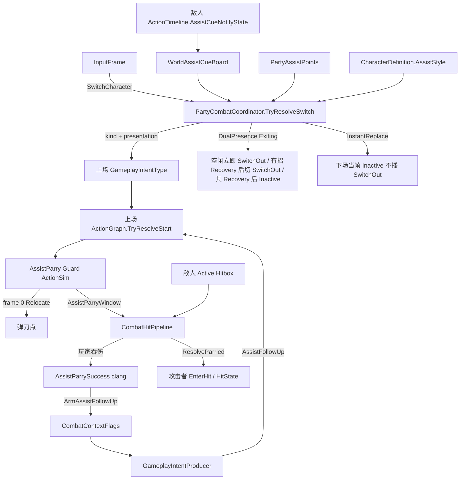

# 三人阵容换人 / 极限支援（弹刀）— 需求与实施真源

> 制定：2026-08-30  
> 角色：**编队换人、极限支援（招架/回避）、支援突击、快速支援** 的结构与排期真源（先文档，后实现）  
> 产品参考：绝区零战斗（换人无 CD、金/红闪光、支援点、连携技）  
> 相关：  
> - 技能槽裁剪（本文**改写**其「切人后置」）：[`../2026.8.6/SKILL_AND_RESOURCE_SYSTEM_PLAN.md`](../2026.8.6/SKILL_AND_RESOURCE_SYSTEM_PLAN.md)  
> - 完美闪避对照：`GameplayIntentType.PerfectDodgeAttack` + Graph Counter Entry  
> - 数值口袋：[`../COMBAT_NUMERICS_PLAN.md`](../COMBAT_NUMERICS_PLAN.md) / [`../2026.8.7/GAS_STYLE_COMBAT_REFACTOR_PLAN.md`](../2026.8.7/GAS_STYLE_COMBAT_REFACTOR_PLAN.md)  
> - 锁步：`SimulationWorld` → `CharacterActor.Step` → `ActionSim` → `CombatHitPipeline`  
> - 相机换人前排：[`../2026.8.26/CAMERA_SYSTEM_PLAN.md`](../2026.8.26/CAMERA_SYSTEM_PLAN.md)（后置，不进本方案出口）

---

## 0. 一句话

用 **座位级 `PartyCombatCoordinator`** 裁定「谁上场、切哪种支援」，用上场角色 `ActionGraph` 播 Guard/Success，用现有 **`HitState`** 播敌人被弹刀；身份用薄层 `CharacterId` + `CharacterDefinition` + `PartyLoadout`（最多 3 槽）。禁止把阵容/支援点写进单张 Graph，禁止 `if (角色名)`，禁止新建顶层 Parry 状态，禁止 Update 旁路权威。

---

## 1. 问题与动机

### 1.1 现状基线

```text
PlayerController.characterConfig（单份）
  → CharacterActorFactory.Create → 唯一 CharacterActor
       → GameplayIntentProducer（Attack / Dodge / Special / PerfectDodgeAttack …）
       → CharacterActionDriver → ActionResolverService(当前 CombatMode 的 ActionGraph)
       → ActionSim.Step（60Hz Timeline：Phase / Hitbox / Invincible / PerfectDodge / VFX / SFX）
LocalPlayerService = 多玩家座位花名册，不是三人编队
InputButton.SwitchMode = 同角色 CombatMode（Katana/Beast），不是换人
ActionResourceTag.HeavyHit 已有；敌人失衡 Daze / 支援点 / 闪光窗均未落地
SKILL 方案原裁定：切人 / 支援 / 连携 = 后置
```

| 点 | 现状 |
|----|------|
| 出战人数 | 每座位 1 个 `CharacterActor`，1 份 `CharacterConfig` |
| 切人输入 | 无；`SwitchMode` 是战斗模式 |
| 选招 | 单角色 `ActionGraph` Entry×Intent / Cancel / Perfect |
| 完美闪避 | 玩家 Dodge 轨 `PerfectDodgeWindow` → Pipeline 武装 Flags → Producer 派生 `PerfectDodgeAttack` |
| 角色身份 | 无稳定 `CharacterId`；配置即实例 |
| 养成 | 无等级/装备/抽卡；数值在 `NumericSystem` |
| 联网 | 每玩家一席 `CharacterActor` / Archetype；三人同座未设计 |

### 1.2 痛点

1. 产品已要求「最多 3 人出战 + 切人弹刀」，技能方案仍把切人标后置，与现需求冲突。  
2. 切人不是「换模型」：普通切是双人过场（空闲立即播 SwitchOut；已有 Action 到 Recovery 后转 SwitchOut；SwitchOut 到自身 Recovery 才隐藏；上场播 SwitchIn）；金光弹刀是瞬切到弹刀点，不播 SwitchIn/SwitchOut。
3. 若把「换谁、支援点够不够」写进某张 `ActionGraph`，三人各自 Graph 会互相引用、无法锁步测试。  
4. 若只做临时 `if (下一个角色)` 切 Prefab，养成与联网会无身份可挂。

### 1.3 目标

| 目标 | 说明 |
|------|------|
| 结构 | 座位级编队协调器 + 每角色独立 Actor/Graph；差异在 Definition/资产，不在身份 if |
| 可玩 | Play：3 人轮换；金光切人先举刀，敌人出手后 clang + 敌人进 `Hit`，再点攻击出支援突击 |
| 可测 | EditMode：支援点、金/红裁定、下场未完成不可再切出 |
| 不做 | SwitchPrev / 反向切人、养成、抽卡、背包、邦布、属性异常、彩光、13 段连续招架、联网三人复制（P-SW5） |

---

## 2. 绝区零资料摘要（需求真源，非全文转载）

对照社区/百科归纳**可实现规则**。冲突时以「本项目定案」列为准。

| 来源 | 用途 |
|------|------|
| [战斗 · biligame Wiki](https://wiki.biligame.com/zzz/战斗) | 官方口径术语：极限支援 / 招架支援 / 回避支援 / 支援突击 / 连携技 / 极限视域 |
| [GameKee 战斗系统](https://www.gamekee.com/zzz/626717.html) / 百度经验 | 金闪切人、红闪改极限闪避、支援点回复 |
| [NGA「新艾利都快讯」战斗系统分析](https://bbs.nga.cn/read.php?tid=40828854)（2024-07） | 切人无 CD、下场播完再退、招架分轻/重/连续、远程金光强制切远程、快速支援 |
| 九游 / 游戏狗等机制帖 | 登场冲入、支援突击难取消、受击支援 |

项目内已有技能槽归纳：[`SKILL_AND_RESOURCE_SYSTEM_PLAN.md`](../2026.8.6/SKILL_AND_RESOURCE_SYSTEM_PLAN.md) §2（支援技当时标后置）。

### 2.1 机制表（绝区零 → 本项目）

| 机制 | 绝区零要点 | 本项目定案 |
|------|------------|------------|
| 编队 | 最多 3 名代理人 | `PartyLoadout` 槽位数 1～3；空槽合法 |
| 切人键 | 键鼠/手柄可左右切；手机仅顺序切 | **只留一键** `InputButton.SwitchCharacter`（空格顺序循环）；禁止 `SwitchPrev`；与 `SwitchMode` 分离 |
| 切人 CD | 无 | 无时间 CD |
| 下场（普通切） | 不打断当前招，做完再退场；未退场不可再切出 | 仅 `SwitchPresentation.DualPresence`：下场 `Exiting` |
| 下场（极限支援） | 当场角色立刻消失，不播 SwitchOut | `InstantReplace`：下场当帧 `Inactive`，禁止 SwitchOut |
| 上场普通切 | 侧方冲入，播登场 | 上场 `SwitchIn`；出生在下场角色局部右侧 0.6m |
| 上场弹刀切 | 下一角色先吸到弹刀点举刀，敌人出手接触后才播成功 | 上场只起 `AssistParry` Guard；frame 0 `Relocate` + `SnapFacing`；接触后切 Success，敌人进 `HitState` |
| 金光 | 特定攻击金色闪光；切人消耗支援点 → 极限支援 | 敌人 Timeline `AssistCueWindow`（Gold） |
| 红光 | 点数不足或类型不匹配时金变红；切人 → 极限闪避（换人闪） | 同一窗降级为 Red；上场走 `SwitchPerfectDodge` |
| 彩光 | 极少；切人两者都不触发 | **不做** |
| 招架支援 | 近战上场；格挡、大量失衡、打断多数攻击；无敌 | `AssistStyle.MeleeParry` → `AssistParry` Action |
| 回避支援 | 远程上场；闪避 + 极限视域（敌减速） | `AssistStyle.RangedEvade` → `AssistEvade`；视域用逻辑 `TimeDilation` 旗标，禁止 `Time.timeScale` |
| 支援点 | 上限 6；极限支援耗 1（重/连续可 2）；连携 +1、终结 +3 | 队共享 `AssistPoints`（Numeric 或 Party 口袋）；首版消耗恒 1，回复：连携 +1 / Ult +3 |
| 支援突击 | 极限支援后立刻点普攻/特殊技；无敌 + 重击；难闪避/换人取消 | Flags 武装 → Producer 派生 `AssistFollowUp`（对照 `PerfectDodgeAttack`） |
| 快速支援 | 击飞（或支援角色 EX/连携/终结命中）后切人 | 首版只做**击飞档**受击；支援角色 QTE **后置** |
| 连携技 | 队≥2 + 重击打中失衡敌人；按敌档 1/2/3 次；UI 选人 | **P-SW4**；依赖敌人 Daze + `HeavyHit` |
| 邦布 | 额外连携、不占次数 | **不做** |
| 额外能力 | 同属性/同阵营激活 | 定义上预留 Tag，运行时 **不读** |

### 2.2 与已有完美闪避的对照（必须对齐同一套路）

```text
极限闪避（已有）
  玩家 Dodge Timeline.PerfectDodgeWindow
    → Pipeline 命中早退 + ArmPerfectDodgeCounter
    → Producer：攻击键 → PerfectDodgeAttack
    → 上场角色 Graph Entry → Counter Action（Timeline 含 VFX/SFX）

极限支援（本方案，接触成功）
  敌人 Action Timeline.AssistCueNotifyState（Gold/Red）只裁定「能不能切」
    → Coordinator 派生 AssistParry / AssistEvade / SwitchPerfectDodge
    → InstantReplace + frame 0 Relocate；上场播 Guard（举刀 + Invincible + AssistParryWindow）
    → 敌人 Active Hitbox 打到玩家：
         Pipeline 玩家吞伤（对偶 PerfectDodgeWindow）
         攻击者 CharacterReactionResolver.ResolveParried → EnterHit（现有 HitState）
         玩家切 AssistParrySuccess（clang VFX/SFX）并 ArmAssistFollowUp
    → Producer：攻击键 → AssistFollowUp
```

---

## 3. 两个架构问题的定案

### 3.1 切人动画、弹刀派生、音效特效要不要进 ActionGraph？

**要进 Graph 的：上场角色「这一招怎么播、怎么接」。**  
**不准进 Graph 的：谁上场、点够不够、敌人是否在闪光。**

| 内容 | 落点 | 理由 |
|------|------|------|
| 普通登场 / 招架支援 / 回避支援 / 支援突击 / 快速支援 / 连携技 的 Clip | 该角色 `ActionDefinition` | 已有播放真源 |
| 切人过程中的 VFX / SFX / 无敌 / Hitbox（弹刀打失衡） / Cancel | 该 Action 的 `ActionTimeline` | 与普攻同一套点事件/窗口 |
| 「招架后点攻击 → 突击」 | 接触成功后 Flags 武装；Producer 派生 `AssistFollowUp` Intent Entry | 与 `PerfectDodgeAttack` 同构；禁止切人当帧武装 |
| 敌人被弹刀后的硬直/受击 Clip | 现有 `HitState` + `CharacterReactionSet` 的 `Parried` 规则 | 禁止新建顶层 `ParryState` / 第二套受击执行器 |
| 角色是近战弹刀还是远程回避 | `CharacterDefinition.AssistStyle`，Coordinator 选 Intent | 禁止 Graph 里 `if (比利)` |
| 3 人槽位、活跃下标、支援点、金/红裁定 | `PartyCombatCoordinator` | Graph 是单角色选招图，不是编队状态机 |
| 敌人会不会闪光 | 敌人 `ActionTimeline` 的 `AssistCueWindow` | 与玩家 Dodge 窗对偶，真源在**进攻方** |

`ActionGraphStartBehaviorType.SwitchCombatMode` **保持**「同 Actor 换 Katana/Beast」，**禁止**复用成换人。换人是换 `CharacterActor`，不是换 `CombatModeType`。

### 3.2 要不要一次做完整角色系统 / 阵容系统 / 养成接口？

**现在做薄身份 + 阵容契约；不做养成产品。**

| 现在必须落地 | 现在禁止做 |
|--------------|------------|
| 稳定 `CharacterId`（字符串，资产级） | 抽卡、商城、背包、养成 UI |
| `CharacterDefinition`：Id、AssistStyle、引用 `CharacterConfig` | 等级/武器/驱动盘改伤害公式的第二套口袋 |
| `PartyLoadout`：最多 3 个 Id + 开局活跃槽 | 额外能力「队内同属性才生效」运行时 |
| 每槽独立 `NumericSystem`（个人 Energy/HP）；队共享 AssistPoints | 把 `CharacterConfig` 复制成「养成版 Config」双轨 |
| 预留只读 Tag（元素/阵营/定位）字段，P-SW0～4 **不读取** | 为养成先写空 Service / 假接口调用链 |

养成日后只允许：**读 `CharacterId` → 往该槽 `NumericSystem` 灌 Attribute/Effect**。不得再开一套 Health/Resource。

---

## 4. 设计原则

1. **锁步权威不变**：换人裁定、支援点、Cue 窗、Actor 激活都在 60Hz `SimulationWorld`；禁止 `Update` 换人。  
2. **Graph 只选本角色的招**：编队决策在 Coordinator。  
3. **一人一 Actor**：下场未完成的槽仍占一个正在 Step 的 Actor；禁止热换同一 Actor 的 Model/Config。  
4. **差异在资产**：`AssistStyle` + 各角色 Graph 节点；禁止角色名分支。  
5. **对照完美闪避扩 Intent/Flags**，不新开第二套 Action 执行器。  
6. **零长期兼容**：`PlayerController` 单 Config 入口改为 Loadout；删「单人特例」旁路。  
7. **联网后置**：P-SW0～4 只保证本机/Listen 权威 World 内三人；Dedicated 三人复制见 P-SW5，不挡玩法验收。  
8. **极限视域**：只改模拟/表现时钟倍率契约，禁止 `Time.timeScale`。

---

## 5. 目标架构

```text
PartyLoadout (SO)
  slots[0..2] → CharacterId → CharacterDefinition → CharacterConfig
                                                      ├ CombatModeProfile.ActionGraph
                                                      └ AssistStyle

PlayerSeat（原 PlayerController 升级为座位）
  → 最多 3× CharacterActor（Factory 各建一次）
  → PartyCombatCoordinator（纯 C#，World 每帧先于成员 Step）

InputFrame
  SwitchCharacter Pressed（单键，空格）
       ↓
PartyCombatCoordinator.TryResolveSwitch
  下一可激活槽 = (ActiveIndex+1 …) 绕回，跳过空槽 / Dead / Exiting
  读：ActiveIndex、各槽 PartyMemberState、AssistPoints、
      WorldAssistCueBoard（敌人当前 Gold/Red 窗）、上场 AssistStyle
  写：SwitchCommand { from, to, kind }
       ↓
  kind = SwitchIn | AssistParry | AssistEvade | SwitchPerfectDodge | QuickAssist
  presentation = DualPresence | InstantReplace
       ↓
  DualPresence  ：下场 Exiting（空闲立即播 SwitchOut；有招到 Recovery 后转 SwitchOut；SwitchOut Recovery 隐藏）；上场 SwitchIn
  InstantReplace：下场当帧 Inactive（不播 SwitchOut）；上场只起 Guard + Relocate
  上场槽 → Active；只把玩法输入灌给该 Actor
  上场 Intent → 该角色 ActionGraph.TryResolveStart
       ↓
ActionSim Guard（举刀 / Invincible / AssistParryWindow；无 clang）
  敌人 Active Hitbox → CombatHitPipeline
       ↓
  玩家吞伤 + 切 AssistParrySuccess（clang VFX/SFX）+ ArmAssistFollowUp
  敌人 ResolveParried → CharacterActor.EnterHit → HitState
  攻击族 Pressed → AssistFollowUp Intent → Graph Entry
```



### 5.1 关键契约

```text
Input  → InputFrame.SwitchCharacter（Pressed 边沿；无 SwitchPrev）
Cue    → WorldAssistCueBoard.ActiveCue { ownerId, kind Gold|Red, remainingFrames, interruptible }
Resolve → SwitchCommand { fromSlot, toSlot, kind, spendAssistPoints }
Output → 上场 Actor 当帧 Intent；下场 Actor 无玩法输入；相机仍读 Active.PresentationRoot（P-SW1 可硬切）
```

`SwitchCommand.kind` → Intent 映射（只留一种）：

| kind | `GameplayIntentType` | 典型 Graph Entry |
|------|----------------------|------------------|
| SwitchIn | `SwitchIn` | 普通登场 |
| AssistParry | `AssistParry` | 招架 Guard（举刀；无 clang） |
| AssistParrySuccess | `AssistParrySuccess` | 接触后成功段（clang）；不由切人键产生 |
| AssistEvade | `AssistEvade` | 回避支援 |
| SwitchPerfectDodge | `SwitchPerfectDodge` | 换人极限闪避（可再接已有 Counter 或独立登场闪） |
| QuickAssist | `QuickAssist` | 受击支援（重击 Tag） |
| AssistFollowUp | `AssistFollowUp` | 支援突击（不由切人键产生） |
| Chain | `ChainAttack` | **仅 P-SW4** |

### 5.2 裁定表（Coordinator 唯一）

```text
无下一可激活槽（空槽 / Dead / Exiting 全跳过后回到自己）→ 忽略切人
无 Cue 且上场可激活 → SwitchIn，不耗点
Gold ∧ 点数够 ∧ 上场 MeleeParry → AssistParry，耗点
Gold ∧ 点数够 ∧ 上场 RangedEvade → AssistEvade，耗点
Gold ∧（点数不够 ∨ 类型不匹配）→ 按 Red 处理
Red → SwitchPerfectDodge，不耗点
Active 处于击飞档 Hit 且上场可激活 → QuickAssist（优先于普通 SwitchIn；与 Gold 同时时 Gold 优先）
支援突击武装中：切人键是否可切 = 首版禁止（对齐「突击中难换人」）
```

「类型不匹配」首版只做一件事：敌人 Cue 标记 `RequiresRanged` 时，上场必须是 `RangedEvade`，否则当 Red。近战金光不强制近战（与绝区零「远程金光才点名远程」对齐，近战金光切远程则回避）。

### 5.3 边界（与谁正交）

| 层 | 职责 | 不负责 |
|----|------|--------|
| `CharacterDefinition` / `PartyLoadout` | 身份、槽位、AssistStyle | 出招、扣血 |
| `PartyCombatCoordinator` | 换人合法性、Cue/点数、谁收输入 | 播动画、写 Timeline |
| 上场 `ActionGraph` + `ActionDefinition` | 登场/支援/突击选招与衔接 | 改 ActiveIndex、改支援点（耗点在 Coordinator 裁定成功时扣） |
| `ActionTimeline` | Guard/Success 窗、无敌、接触后 clang | 选下一个角色；用玩家招架 Hitbox 打断敌人 |
| `GameplayIntentProducer` | 突击缓冲内劫持攻击族 | 读 3 个槽 |
| `CombatHitPipeline` | 窗内被命中：玩家吞伤、攻击者进受击、武装突击 | 换人；自己 new 状态机 |
| `CharacterReactionResolver` + `HitState` | 被弹刀：`Parried` 规则选招，强制 `EnterHit` | 换人；另开顶层 Parry 状态 |
| `LocalPlayerService` | 多玩家座位 | 队内 3 槽 |
| Camera Director | 跟 Active 锚点 | 换人权威 |

### 5.4 成员状态

```text
enum PartyMemberState : Inactive | Active | Exiting | Dead
Inactive  : 后台；可被切出；仍 Step 个人回能（接战规则跟 SKILL 能量，后台也回）
Active    : 收 InputFrame 玩法键；进索敌/软弹开/Hurtbox
Exiting   : 空闲立即 SwitchOut；有 Action 时首次进入 Recovery 即 Stop → SwitchOut；切人时已在 Recovery 则不再多推进旧招；SwitchOut 首次进入 Recovery → Inactive
Dead      : 不可切出；队灭规则后置
```

软弹开 / Hurtbox：仅 `Active` + `Exiting` 参与。`Inactive` 不进 `ISimSoftBodyParticipant`、不进 Hurtbox 花名册。

### 5.5 普通切 vs 弹刀切（目标效果，只留一种）

初版把两种切人写成同一条「下场 Exiting + 上场 Graph」，**不对**：金光极限支援在绝区零里是瞬切到弹刀点，不播 SwitchIn/SwitchOut。本方案以该观察为验收目标。

| | 普通切人 `DualPresence` | 极限支援 / 红闪换人闪 / 快速支援 `InstantReplace` |
|--|-------------------------|-----------------------------------------------------|
| 触发 | 无 Cue（或 Cue 已过） | Gold / Red / 击飞窗 |
| 上场播什么 | **只** `SwitchIn` | 先 `AssistParry` Guard；接触后再 `AssistParrySuccess`。回避/换人闪仍当帧起对应 Intent |
| 下场播什么 | 空闲立即播 `SwitchOut`；已有 Action 到首次 Recovery 后切 `SwitchOut`；只在 `SwitchOut` 的 Recovery 隐藏 | **不播** SwitchOut；当帧隐身进 `Inactive` |
| 场上人数 | 可两人同框（下场收招 + 上场冲入） | **一人**：上场角色出现在弹刀/回避点 |
| 出生点 | 下场角色局部右侧 0.6m（以旧角色 Motor 朝向为基准） | 敌人 Cue 给出的弹刀点（见下） |
| 吸附 | 不强制贴敌 | frame 0：`RelocateToTargetOffset` + `SnapFacingToTarget` |
| 连招 | 无突击武装 | **仅接触成功后**武装 `AssistFollowUp` |

**弹刀点（首版只留一种）：**

```text
敌人 AssistCueNotifyState 带 parryLocalOffsetMm（相对进攻敌人逻辑根，敌人朝向）
  缺省：(0, 0, +frontMm) = 敌人正前方固定距
上场 AssistParry **Guard** Timeline frame 0：
  MotionCommand RelocateToTargetOffset（Target = Cue 敌人，即 SelectedTarget）
  MotionCommand SnapFacingToTarget
禁止用 ActionMotionAdhesion 多帧去「滑向」弹刀点——那是普攻贴身，不是瞬切
回避支援同一套 Relocate，offset 用 evadeLocalOffsetMm（可更侧向/更远）
```

**接触成功（首版只留一种，删除「上场招架 Hitbox 打断敌人」）：**

```text
Cue Gold/Red     = 只决定切人 kind；可在 Startup 结束
敌人 Hitbox      = 出手真源；Guard 必须覆盖到该窗
玩家 Guard       = Invincible + AssistParryWindow；禁止 clang / 禁止 ArmAssistFollowUp
Pipeline         = 对偶 PerfectDodgeWindow：
                   1. 玩家吞伤，不 EnterHit
                   2. 按攻击者 SimActorId 取 CharacterReactionService
                      CharacterReactionType.Parried → Resolve → EnterHit
                      （复用 HitState：停当前攻击 ActionSim，播反应 Action 或默认硬直帧）
                   3. 玩家 QueueExternalIntent(AssistParrySuccess) 或 Graph 自动衔接
                   4. 玩家 Flags.ArmAssistFollowUp
仅 Invincible、无 ParryWindow = 只吞伤，不进受击、不武装突击
Guard 结束仍未接触 = 回 Locomotion，不武装突击
禁止用 ActionTransitionCondition.OnHitConfirm 等敌人出手（那是「自己的 Hitbox 打中人」）
禁止为弹刀新增 CharacterStateType 或第二套 Reaction 执行器
```

### 5.6 被弹刀走现有受击状态机（只留一种）

```text
已有路径（普通命中）
  CombatHitPipeline → Target.OnHit → Vitality.ApplyDamage
    → CharacterReactionService.HitReceived
    → CharacterReactionResolver.ResolveHit(HitReactionId)
    → CharacterActor.EnterHit → HitState
         Stop 当前 ActionSim
         有 ResolvedAction：TryStart 受击招
         无动作：DefaultHitStunFrames 倒数回 Locomotion

被弹刀（P-SW2 纳入同一条 HitState）
  Pipeline AssistParryWindow 分支不走玩家 OnHit
  按 hit.Key.AttackerId 取攻击者 CharacterReactionService
    CharacterReactionType.Parried（新增枚举值；不是新顶层状态）
    Resolver.ResolveParried() → ReactionSet 的 Parried 默认规则
    EnterHit（force）→ 同一 HitState
  敌人 Brain 已有 NotifyHit 副作用继续复用，BT 清空 Desire/Request
  0 伤：不改攻击者 Health；只进 Hit / 复制 VitalityEdge.Hit
```

| 角色 | 接触瞬间进什么状态 | 播什么 |
|------|--------------------|--------|
| 上场玩家 | 保持 Action：Guard → Success | clang 在 Success Timeline |
| 进攻敌人 | 顶层 `CharacterStateType.Hit` | `CharacterReactionSet` 的 `Parried` Action；缺资产则默认硬直帧 |
| 下场角色 | 已 `Inactive` | 无 |

禁止：用玩家 Success 上的 Hitbox 再打敌人当「打断」；打断只发生在 Pipeline 的 `EnterHit`。P-SW4 失衡仍可另挂 Grant，不改本条。

`SwitchCommand` 必须带 `presentation`：

```text
SwitchIn            → DualPresence
AssistParry         → InstantReplace
AssistEvade         → InstantReplace
SwitchPerfectDodge  → InstantReplace
QuickAssist         → InstantReplace
```

禁止：极限支援先播 `SwitchIn` 再 Cancel 进招架；禁止弹刀切还让下场角色在场上播完当前招。

---

## 6. 范围声明

| 阶段 | 包含 | 不包含 |
|------|------|--------|
| P-SW0 | Id / Definition / Loadout / AssistStyle | 换人玩法 |
| P-SW1 | 3 Actor、切人键、普通 `SwitchIn`、Exiting | 金光、支援点 |
| P-SW2 | Cue 窗、支援点、Guard/接触成功、敌人 `HitState` 被弹刀、支援突击 | 连续招架 13 段、视域镜头演出打磨、专用弹刀硬直状态机 |
| P-SW3 | 击飞 → 快速支援 | 支援角色 EX 触发快速支援 |
| P-SW4 | 敌人 Daze + 连携选人（可先自动切下一名） | 手动长按跳过连携、邦布 |
| P-SW5 | 支援点/Cue 等后续 Party 状态复制与公网验收 | 每槽稳定实体（已提前到 P-SW1） |

---

## 7. 分阶段交付（任务 / 验收 / 出口）

> 勾选：未开始 `[ ]`；完成后 `[x]` 并在出口注明日期。

### P-SW0 — 身份与阵容数据（无玩法）

**任务**

- [x] 新增 `CharacterId`（只读字符串包装）
- [x] 新增 `CharacterDefinition` SO：`characterId`、`assistStyle`（MeleeParry / RangedEvade）、`characterConfig`、预留 `element`/`faction`/`specialty` **不读**
- [x] 新增 `PartyLoadout` SO：1～3 个 `CharacterDefinition` 引用（身份仍取 `CharacterId`）、`startingSlot`；中间空槽合法
- [x] `PlayerController` 改绑 `PartyLoadout`
- [x] Client / Server 内容预填遍历 Loadout 全部角色并登记各槽网络 Archetype
- [x] **删除**座位「只认单 CharacterConfig、无 Id」作为唯一装配入口

**验收**

- [ ] EditMode：Loadout 3 槽校验（重复 Id 失败、空槽允许、越界 startingSlot 失败）  
- [ ] 单槽 Loadout Play：进关、相机、出招与改前单 Config 等价  
- [x] `rg "SerializeField] CharacterConfig characterConfig"` 在 `PlayerController` 无匹配

**出口：** 养成可挂 Id，战斗仍可单人。→ **未达成**

### P-SW1 — 三 Actor 普通切人

**任务**

- [x] `InputButton` / `InputBindingUtils` / `InputReader` 增加唯一 `SwitchCharacter`；Input Actions 绑空格仍需 Editor 人工
- [x] `PartyCombatCoordinator` 纯逻辑：顺序找下一可激活槽、写 ActiveIndex；普通切下场 `Exiting`（`DualPresence`）
- [x] **禁止** `SwitchPrev` / 反向切人键 / 左右同帧仲裁
- [x] 座位创建最多 3 个 `CharacterActor`；仅 Active 接收玩法输入
- [x] `GameplayIntentType.SwitchIn/SwitchOut` 与 Coordinator 外部意图注入；每角色 Graph 配两个 Entry 仍需 Editor
- [x] 普通切上场 Pose：从下场逻辑根沿旧角色局部右向偏移 600mm，经静态碰撞解析；优先朝向本槽 SelectedTarget（无目标继承朝向）
- [x] **禁止**普通切走 InstantReplace / Relocate 贴敌
- [x] Debug HUD：槽位、稳定 ActorId、Active、Exiting
- [x] P-SW5 身份基础前置：每槽稳定 `SimActorId/NetEntityId`，Owner 载荷同步槽身份与 ActiveSlot

**验收**

- [ ] Play：空格按槽位顺序循环（0→1→2→0）；上场播登场 Action（无资产时可空 Timeline 但必须进 Action 态）  
- [ ] 下场未结束时再切回该槽：忽略  
- [ ] 无时间 CD；空闲立即 SwitchOut；已有 Action 在首次 Recovery 切 SwitchOut；切人时已处于 Recovery 不得再泄漏一帧旧招 Notify；仅 SwitchOut Recovery 隐藏
- [ ] `PartyCoordinatorTests`：空槽/死亡/Exiting 拒绝  

**出口：** 无闪光也能三人轮换。→ **未达成**

### P-SW2 — 金/红 Cue、支援点、接触弹刀与突击

**任务**

- [ ] 敌人 Timeline 新窗口 `AssistCueNotifyState`：`Gold` / `Red`、`requiresRanged`、持续帧、`parryLocalOffsetMm` / `evadeLocalOffsetMm`  
- [ ] `WorldAssistCueBoard`：权威帧收集当前窗（按 `SimActorId` 稳定）  
- [ ] 队共享 `AssistPoints`（上限 6，开局 3）；扣费只在 Coordinator 裁定成功  
- [ ] Intent：`AssistParry` / `AssistParrySuccess` / `AssistEvade` / `SwitchPerfectDodge` / `AssistFollowUp`  
- [ ] 玩家 Timeline 新窗口 `AssistParryWindowNotifyState`（对偶 `PerfectDodgeWindowNotifyState`）  
- [ ] `CharacterReactionType.Parried`；`CharacterReactionResolver.ResolveParried()`；`CharacterReactionService` 对攻击者 `EnterHit`  
- [ ] `CombatHitPipeline`：`IsInAssistParryWindow` 时玩家吞伤、攻击者 `ResolveParried`、玩家切 Success、武装 `AssistFollowUp`  
- [ ] **删除**「上场招架 Hitbox 打断敌人」作为弹刀成功条件  
- [ ] Producer：`HasAssistFollowUp` 时攻击族派生 `AssistFollowUp`（对照完美反击）；切人当帧不得武装  
- [ ] 招架/回避/换人闪：`InstantReplace`——下场当帧 Inactive，**不**起 `SwitchIn`/`SwitchOut`  
- [ ] Guard frame 0：`RelocateToTargetOffset` + `SnapFacingToTarget`；Success 才挂 clang VFX/SFX  
- [ ] Guard：Invincible + `AssistParryWindow`；回避 Guard：Invincible（接触成功规则可与招架共用窗或首版仅招架）  
- [ ] Ult 起手成功回复 +3 支援点（P-SW4 前连携未做，+1 暂不接）  
- [ ] 点数为 0 时 Gold 对外表现为 Red  

**验收**

- [ ] Play：木桩 Gold 窗内切近战 → 当场角色立刻消失，下一角色出现在弹刀点**举刀**（无 SwitchIn、无 clang）  
- [ ] Play：敌人 Active 命中前不得出现招架成功特效；命中后才播 Success，敌人进入 `Hit` 并停掉攻击 Action  
- [ ] 同一次切人不得同时看到 SwitchIn + AssistParry  
- [ ] Guard 结束前敌人未出手 → 玩家回 Locomotion，敌人不进 `Hit`，不可派生突击  
- [ ] 远程上场 Gold → 回避点 Relocate，不走招架节点  
- [ ] 0 点 Gold 窗切人 → 换人闪，不耗点  
- [ ] `PartyAssistResolveTests`：裁定表覆盖  
- [ ] `AssistParryPipelineTests`：窗内命中 → 玩家不 `EnterHit`、攻击者 `EnterHit`、武装突击；仅无敌不武装  
- [ ] `rg CharacterStateType.Parry` 玩法目录无匹配  
- [ ] 禁止 `Time.timeScale`（`rg` 玩法目录无新增）  

**出口：** 金光切入、出手接触、敌人受击、突击派生可玩。→ **未达成**

### P-SW3 — 快速支援（击飞档）

**任务**

- [ ] Reaction 击飞档暴露给 Coordinator（或 Flags `HasQuickAssistWindow`）  
- [ ] 击飞中切人 → `QuickAssist`；上场 Action 标 `HeavyHit`  
- [ ] 轻/重击退 **不**开快速支援  

**验收**

- [ ] Play：击飞后切人播受击支援，下场立即按 Exiting 收  
- [ ] 非击飞受击切人仍为 SwitchIn  

**出口：** 失误可切人翻盘。→ **未达成**

### P-SW4 — 失衡与连携（可玩最小）

**任务**

- [ ] 敌人 `NumericSystem` 增加 Daze 积蓄；满则 `Stunned` 持续帧  
- [ ] `HeavyHit` 命中失衡敌人 → 打开连携窗（次数：普通 1 / 精英 2 / Boss 3，写在 `EnemyDefinition`）  
- [ ] 首版连携选人 = 自动下一名存活槽（UI 点头像后置）  
- [ ] `ChainAttack` Graph Entry；成功后 AssistPoints +1  
- [ ] 队存活 &lt; 2 不触发  

**验收**

- [ ] Play：打满失衡 + 重击 → 后台角色出连携 Action  
- [ ] 次数用尽不再开窗，失衡易伤可仍在  

**出口：** 三人循环「破防 → 切人爆发」可演示。→ **未达成**

### P-SW5 — Party 后续状态复制与公网验收

**任务**

- [x] 每槽独立稳定实体；已删除「一席热换单 Actor/Archetype」候选路径
- [x] ActiveIndex 与 Owner 槽 ActorId 进入 V2 帧级应用载荷
- [x] `PartyMemberState` 进入角色快照 Flags，Observer 只显示 Active / Exiting
- [ ] AssistPoints / Cue 进入权威快照

**验收**

- [ ] Listen 客机看到换人与支援点一致  

**出口：** 组队可见三人。→ **未达成**

---

## 8. 迁移与兼容

### 8.1 保留 / 迁入

- `CharacterConfig` / `CharacterActor` / `ActionGraph` / `ActionSim` / `NumericSystem` / 完美闪避路由全部保留  
- `InputButton.SwitchMode` 语义不变  
- `LocalPlayerService` 仍只管多玩家座位  

### 8.2 明确删除

| 删除 | 原因 |
|------|------|
| `PlayerController` 单一 `CharacterConfig` 作为座位唯一装配真源 | 改 Loadout |
| SKILL 方案「切人/支援技首版不做」作为现行产品裁定 | 改由本文真源 |
| 把换人做成 `SwitchCombatMode` 或 Graph StartBehavior | 语义冲突 |
| 单 Actor 热换 ModelPrefab / 运行时改 Config | 无法下场播完、无法后台回能 |
| 为换人新建第二套 Timeline/执行器 | 与 Action 核双轨 |
| 上场招架 Hitbox 作为弹刀成功/打断敌人的条件 | 改为敌人 Hitbox 接触 `AssistParryWindow`；打断只走 `EnterHit` |
| 顶层 `CharacterStateType.Parry` / 第二套受击执行器 | 被弹刀复用现有 `HitState` |

---

## 9. 目录与文件预期（增量）

```text
Assets/Scripts/Domain/Party/
  CharacterDefinition.cs          // SO
  PartyLoadout.cs                 // SO
Assets/Scripts/Domain/Simulation/Party/
  CharacterId.cs
  CharacterAssistStyle.cs
  PartyMemberState.cs
  PartySlotSelector.cs
  PartyLoadoutRules.cs
  PartyCombatCoordinator.cs
  PartySwitchCommand.cs
  WorldAssistCueBoard.cs
Assets/Scripts/Domain/Combat/Actions/Definitions/Timeline/
  AssistCueNotifyState.cs         // 敌人 Timeline 窗
  AssistParryWindowNotifyState.cs // 玩家 Guard 接触窗
Assets/Scripts/Domain/Character/Reactions/
  CharacterReactionType.cs        // + Parried
  CharacterReactionResolver.cs    // + ResolveParried
Assets/Scripts/Domain/Simulation/Input/
  InputButton.cs                  // + SwitchCharacter（无 SwitchPrev）
  GameplayIntentType.cs           // + SwitchIn / Assist* / …
Assets/Tests/EditMode/Simulation/
  PartyCombatCoordinatorTests.cs
  PartyAssistResolveTests.cs
  AssistParryPipelineTests.cs
docs/2026.8.30/PARTY_SWITCH_ASSIST_PLAN.md
```

养成日后新增（**本方案不建类**）：`CharacterProgression` 只写 Numeric，不进 Party 目录。

---

## 10. 风险与对策

| 风险 | 对策 |
|------|------|
| 3 Actor 步进成本 | 后台跳过 Motor 重计算可后做；首版先全 Step 但 Inactive 空输入、不进软弹开 |
| 换人与预测回滚 | P-SW1 已进入 Dedicated 权威：累计命令 ACK 覆盖切人帧前，不用旧 ActiveSlot 撤销本地预测 |
| 招架要打断敌招 | 接触瞬间 `ResolveParried` → `EnterHit`；`HitState` 停攻击 ActionSim；缺 `Parried` 资产则默认硬直帧 |
| Cue 已过但敌人尚未出手 | Guard 覆盖到 Active Hitbox；Cue 只裁定切人，不裁定成功 |
| 极限视域像顿帧 | 逻辑 `dilationPermille` 只作用于敌方 Action/Motor 步长；表现插值跟同一时钟 |
| 资产未齐 | 可用占位 Action（无 Clip）验收状态机；Clip/VFX Editor 人工 |
| 与相机 Follow 打架 | P-SW1 硬切 Active `PresentationRoot`；Director 换人前排不进本出口 |
| 支援点与个人 Energy 混淆 | AssistPoints 只活在 Party 口袋，不进角色 `CharacterResourceConfig` |

---

## 11. Editor 人工步骤（Agent 不改资产）

1. 为每个可出战角色建 `CharacterDefinition`，填 Id、AssistStyle、拖 `CharacterConfig`。  
2. 建 `PartyLoadout`，拖 1～3 个 Id。  
3. `PlayerController` 改绑 Loadout。  
4. Input Actions 只增加 `SwitchCharacter`（建议空格），由 Coordinator 消费；**不要**映射成 Graph Intent，**不要**做 SwitchPrev。  
5. 每角色 Graph：P-SW1 配 `SwitchIn`、`SwitchOut`；P-SW2 再配 `AssistParry` Guard、`AssistParrySuccess`、`AssistFollowUp`（远程加 `AssistEvade`）。
6. Guard `ActionDefinition`：frame 0 Relocate + SnapFacing、Invincible、`AssistParryWindow`（覆盖到敌攻击 Active）；**不要**在 Guard 上挂 clang。Success 才挂 clang VFX/SFX。
7. 木桩/精英敌 Graph：攻击节点加 Gold `AssistCue`（抬手）+ 独立 Hitbox（出手）；二者不要叠成同一帧。
8. 敌人 `CharacterReactionSet` 增加 `Parried` 默认规则（可先空 Clip，靠默认硬直帧验收 `HitState`）。
9. Play 确认相机随 `PlayerController.PresentationRoot` 自动切到当前 Active 槽；无需逐角色拖引用。

---

## 12. 推荐开工顺序

```text
P-SW0 身份/Loadout
  → P-SW1 三 Actor + 稳定复制身份 + 普通切人（最小可感）
  → P-SW2 金光切入 + 接触成功 + 敌人 HitState + 突击
  → P-SW3 击飞快速支援
  → P-SW4 失衡连携
  → P-SW5 支援状态复制与公网验收
```

**最小可感切片：** P-SW1 — 三个占位角色按空格顺序循环上场并播登场 Action。

---

## 13. 变更日志

| 日期 | 说明 |
|------|------|
| 2026-08-30 | 初版：收集绝区零换人/支援/连携规则；定案 Graph vs 编队分层；薄身份不做养成 |
| 2026-08-31 | 锁定两种切人表现：普通 DualPresence（SwitchIn+下场播完）；弹刀 InstantReplace（不播 SwitchIn/Out，frame 0 Relocate 到 Cue 弹刀点） |
| 2026-08-31 | 切人输入只留 `SwitchCharacter` 单键顺序循环；不做 SwitchPrev |
| 2026-08-31 | 开始实现：P-SW0 代码与 P-SW1 纯逻辑骨架；因现行一座位一网络实体，三 Actor 运行时接线保持未完成 |
| 2026-09-01 | P-SW1 采用每槽稳定网络实体：三 Actor、Active 输入路由、DualPresence、SwitchIn 意图、Owner 阵容载荷与 Observer 显隐代码完成；Graph 资产/Test/Play 待验 |
| 2026-09-01 | 普通退场规则收敛：空闲角色播放完整 SwitchOut；已有 Action 只播到首次 Recovery，随后停止原招并转 Inactive |
| 2026-09-01 | 普通退场规则再次收敛：所有普通退场都经过 SwitchOut；原招 Recovery 只作为切入点，最终仅在 SwitchOut 自身 Recovery 隐藏 |
| 2026-09-01 | 普通登场位置改为旧角色局部右侧 0.6m；预测与权威共用 `PartySwitchPlacement`，墙边由静态碰撞世界修正 |
| 2026-09-02 | 修复切人特效泄漏：切人输入到达时原招已在 Recovery 则在下一次 Step 前交接；远端新动作/重启不再补播整段历史 VFX/SFX |
| 2026-09-02 | 修复远端重复登场表现：Inactive 前回收挂在角色层级下的 VFX，Active/Exiting 重新显形时丢弃上次退场位置的插值历史并吸到最新权威 Pose |
| 2026-09-02 | 本机 `CharacterActor` 同样在退出可见状态前清理所属 VFX；远端与本机统一以阵容显隐边界终止会随父节点冻结的表现租约 |
| 2026-09-02 | 修复权威敌人感知根：`RemotePlayerSeat` 保留稳定花名册锚点，并在每次切人时将其重挂到当前 Active 槽位逻辑根 |
| 2026-09-02 | P-SW2 改为接触成功：Guard 到位举刀，敌人 Hitbox 触发 Success clang；被弹刀纳入现有 `HitState`（`CharacterReactionType.Parried`），删除上场招架 Hitbox 打断路径 |
