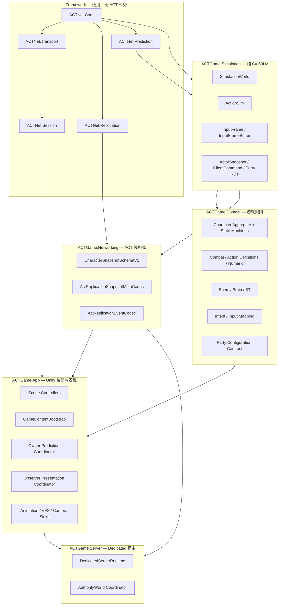

# ACTGame 代码结构稳定化重构方案

> 制定：2026-09-17  
> 角色：后续功能修复与扩展之前的**结构重构真源**  
> 基线：Replication V2、Party 死亡换人、Locomotion PhaseFrame 已落代码，但联合验收尚未关闭  
> 关联：[`../../.cursor/skills/actgame-architecture/ARCHITECTURE.md`](../../.cursor/skills/actgame-architecture/ARCHITECTURE.md) · [`../../.cursor/skills/actgame-architecture/ROADMAP.md`](../../.cursor/skills/actgame-architecture/ROADMAP.md)  
> 状态：方案已制定，所有实施阶段均未开始

---

## 0. 一句话

先冻结玩法行为，以 **依赖门禁 → Net 目录收敛 → Character 聚合根拆分 → App 编排瘦身 → 配置单入口 → 模拟/表现硬边界** 的顺序稳定代码结构；每阶段直接切换唯一入口并删除旧路径，禁止为赶功能保留 Legacy/Compat 双轨，结构总出口关闭后再集中修复当前功能问题。

---

## 1. 问题与动机

### 1.1 当前代码基线

当前项目已经具备明确的逻辑分层，但物理目录、程序集边界和运行时职责尚未完全一致：

```text
Framework/ACTNet/*
  → 通用 Transport / Session / Replication / Prediction，已有 asmdef

Domain/Simulation/*
  → 60Hz SimulationWorld / ActionSim / InputFrame / Replication 契约，已有 noEngine asmdef

Domain/Character + Combat + Enemy + Input + Party + Camera
  → 多数仍在 Assembly-CSharp，依赖方向主要靠约定和 Editor 字符串审计

App/*
  → Controller / Networking Adapter / Runtime 编排
  → App/Server 已有 asmdef，其余大部分仍在 Assembly-CSharp
```

关键结构问题：

1. **程序集门禁不完整**：大部分 Character、Combat、Enemy、Input 与 App 代码仍可在编译期互相引用。
2. **Net 概念分布过散**：`Framework/ACTNet`、`Domain/Simulation/Replication`、`Domain/Networking`、`Domain/Net`、`Domain/Character/Replication`、`App/Networking` 名称相近，职责需要重新钉死。
3. **聚合根职责过大**：
   - `CharacterActor` 同时编排输入、Targeting、Action、Locomotion、Numeric、Party、预测、表现和调试。
   - `PlayerController` 同时负责三槽装配、输入、Party 预测、权威状态同步和 Architecture 注册。
   - `DedicatedAuthorityWorld`、`ActClientRoomGameplay` 同时承担注册表、帧循环、复制和表现接线。
4. **配置入口分散**：Party、CharacterConfig、CombatMode、Locomotion、Input Settings、联网 Content Registry 通过多段扫描/注册进入运行时。
5. **模拟与表现仍有类型级耦合**：`CharacterActor` 直接推进 Animation/Presentation；Hitbox Consumer 与 Presentation Bridge 装配关系不够清晰。
6. **文档与代码漂移**：部分架构文档仍描述已删除的 V1 Frame/ApplicationPayload 路径。
7. **当前工作树尚未形成稳定基线**：Replication V2 与 Locomotion 改造范围大，不能在未完成编译/测试记录前继续叠加结构变更。

### 1.2 为什么先改结构

当前功能问题往往同时穿过 `CharacterActor → App Adapter → Replication → RemoteProxy → Presentation`。直接逐个修表现，容易继续扩大大类职责并制造临时分支。先稳定边界可以让后续问题落到唯一责任点：

- 输入历史增长 → Simulation 输入历史策略。
- Recover 重试 → Client Replication Recovery。
- Observer 动画 → Observer Presentation。
- Party 死亡接替 → Party Lifecycle。
- 内容配置错误 → Content Bootstrap / Validation。

### 1.3 目标与不做

| 项 | 目标 |
|----|------|
| 编译边界 | Domain 不引用 App；Framework 不引用 ACTGame 业务；Simulation 保持纯 C# |
| Net 结构 | 通用协议、ACT 线格式、Unity/App 映射各有唯一目录与程序集 |
| Character | `CharacterActor` 只作为角色聚合根和固定帧入口，不实现所有子系统细节 |
| App | Controller 只做 Scene 生命周期；Server/Client Runtime 只做编排 |
| 配置 | 单一 Content Bootstrap 生成只读运行时目录，客户端与 Dedicated 共用 |
| 表现边界 | 模拟只输出状态/事件；动画、VFX、相机不得反写模拟 |
| 完成证明 | Assembly 门禁、架构审计、EditMode、双进程基线全部通过 |
| 不做 | 不新增玩法、不调手感参数、不改协议语义、不顺手修普通表现问题 |

结构阶段允许的功能改动只有三类：编译阻塞、数据安全问题、使结构验收无法进行的确定性错误。它们必须作为独立小提交，不得夹带玩法扩展。

---

## 2. 设计原则

1. **先建边界，再搬职责**：没有依赖测试和程序集图时不开始大类拆分。
2. **聚合根不是万能类**：`CharacterActor` 可以持有子服务，但具体规则必须归属单一组件。
3. **Controller 只做装配与生命周期**：不持有可跨场景复用的业务算法。
4. **Simulation 单一权威**：固定帧顺序仍由 `SimulationWorld` 驱动，禁止新增 `Update` 玩法旁路。
5. **表现只消费结果**：动画/VFX/SFX/相机不得决定 Action、命中、死亡、Party 或复制状态。
6. **配置编译一次**：ScriptableObject 是作者输入，运行时使用经验证的只读目录；禁止各系统自行 `Resources.Load`、场景扫描或默认取首项。
7. **零长期兼容**：迁移调用点后立即删除旧入口、旧 DTO、旧 Codec 和转发壳。
8. **结构提交不改语义**：每阶段以现有测试、Golden Bytes 和 Play 基线证明行为保持。
9. **资产只读**：Agent 不直接修改 `Assets/Data/**`、Prefab、动画或其他非 Shader 资产；配置迁移由 Editor 清单完成。

---

## 3. 目标架构



### 3.1 Net 目录唯一职责

| 目录 | 只负责 | 禁止 |
|------|--------|------|
| `Framework/ACTNet` | 通用连接、可靠通道、复制容器、预测算法 | `CharacterActor`、ActionId 语义、Unity 资产 |
| `Domain/Simulation/Replication` | 纯模拟快照、命令、Party/Room 基础契约 | Transport、Session、Unity |
| `Domain/Networking` | ACT Character Schema、Meta、Hit/Event Codec | Scene 查找、Prefab/Config 装配 |
| `Domain/Character/Replication` | 角色复制表现模型与角色侧恢复契约 | 网络收发、Session |
| `App/Networking` | Authority/Owner/Observer 映射和 Unity 内容装配 | 新协议容器、重复 Codec |
| `App/Server` | Dedicated 生命周期和发送编排 | 第二套战斗模拟 |

`Domain/Net` 单文件层在迁移后删除；身份映射并入 `Domain/Networking/Identity`。

### 3.2 Character 聚合根目标

```text
CharacterActor
  ├─ CharacterSimulationPipeline    // 固定帧顺序
  ├─ CharacterPartyLifecycle        // Active/Exiting/Dead/Assist
  ├─ CharacterPredictionRuntime     // Restore + Replay
  ├─ CharacterStateMachine          // Locomotion/Action/Hit/Death
  └─ IActionPresentationSink        // 只写输出，Headless = Null
```

迁移完成后，调用方直接依赖所属子契约；禁止在 `CharacterActor` 保留同名旧方法转发形成兼容层。

### 3.3 配置入口目标

```text
Assets/Data（作者输入）
  → GameContentBootstrap.ValidateAndBuild
      → GameContentCatalog（只读）
          ├─ Character Archetypes
          ├─ Action Catalog
          ├─ Party Definitions
          ├─ Locomotion/Combat Profiles
          └─ Content Fingerprint
              → Local / Listen / Dedicated 共用
```

InputAction 与本地设备设置属于 Client Runtime Configuration，不进入 Dedicated Gameplay Content，也不由 CharacterConfig 隐式查找。

### 3.4 ScriptableObject 配置规范

| 规则 | 终态 |
|------|------|
| 职责 | 一个 SO 只描述一种作者语义；不得同时承担运行时注册表、缓存和场景查找 |
| 身份 | 联网/存档内容使用显式稳定 Id；禁止用 `UnityEngine.Object.name` 临时生成产品身份 |
| 引用方向 | Party → CharacterDefinition → CharacterConfig → Combat/Locomotion；下层 Profile 禁止反向引用 Party/Scene Controller |
| 必填字段 | 必须由 `Validate` 返回失败并指出资产与字段；禁止运行时默认取首项 |
| 可选字段 | 属性和 Tooltip 明确空值语义；禁止把 null 同时解释成默认、禁用和继承 |
| 校验 | 单资产 `Validate` + 全库 Content Audit 共用同一规则实现，禁止 Editor/Runtime 两套判断 |
| 运行时 | SO 只作为 Build 输入；Gameplay 使用不可变 Runtime Catalog/Config，不在 Tick 中查 AssetDatabase/Resources |
| 迁移 | 字段替换在同阶段完成资产迁移后删除旧字段；不保留 `legacy*` 长期双读 |

SO 分类：

```text
Identity/Composition
  PartyLoadout / CharacterDefinition / EnemyDefinition

Runtime Authoring
  CharacterConfig / CombatModeProfile / CharacterLocomotionProfile
  ActionGraph / ActionDefinition / EnemyBehaviorTreeAsset

Client-only Settings
  GameInputSettings / GameplayIntentSettings / Camera/Debug Settings

Build Output
  GameContentCatalog / ContentFingerprint（纯运行时只读，不是可编辑 SO）
```

CS0 先冻结本节规范；CS5 才迁移调用链。结构阶段不调整具体伤害、速度、动画帧和视觉参数。

---

## 4. 结构稳定完成定义

同时满足以下条件才允许进入集中功能修复：

1. 生产业务代码不再依赖默认 `Assembly-CSharp` 提供跨层可见性。
2. Framework、Simulation、Domain、Networking、App、Server 依赖方向由 asmdef 和测试共同约束。
3. V1/旧 Payload/重复 Net 身份目录全部删除，生产线格式只有 V2。
4. `CharacterActor`、`PlayerController`、Authority/Client Gameplay Service 的职责拆分完成，无旧转发入口。
5. 内容配置只有一个 Build/Validate 入口，缺失或重复内容启动前失败。
6. 模拟代码不直接创建或推进 Unity 表现对象；Headless 不依赖动画状态。
7. Architecture Audit、全部 EditMode、协议 Golden Bytes、Dedicated 测试通过。
8. Listen + Client 基线通过：加入、移动、出招、受击、切人、死亡、断线行为与结构改造前一致。
9. ARCHITECTURE、TECHNICAL、CONVENTIONS、ROADMAP 与代码一致。

---

## 5. 分阶段交付

### CS0 — 冻结基线与结构门禁

**任务**

- [x] 冻结当前 Replication V2 / Party / Locomotion 工作树，不再叠加新功能。
- [ ] 记录 Unity 编译、EditMode、Listen+Client 基线结果；失败项登记为功能 Backlog。
- [x] 扩展 `ArchitectureBoundaryValidator`：程序集方向、Domain→App、Framework→ACTGame、运行时 `FindObjectOfType`、空异常吞噬、重复 Codec。
- [x] 新增可批处理调用的结构审计入口，返回明确退出码。
- [x] 输出当前程序集依赖图和允许依赖清单。
- [x] 将 §3.4 写入项目 `CONVENTIONS.md`，明确 SO 身份、引用、校验、运行时和迁移规则。

**2026-09-17 执行记录**

| 基线项 | 结果 |
|--------|------|
| Git | `NetSync@f688dd688834`；本次未自动提交或打 Tag，避免吞并用户工作树 |
| Unity 编译 | 待当前 Editor 导入后确认；BatchMode 无法与已打开的同工程 Editor 并行 |
| IDE 构建 | `dotnet build --no-restore` 因 Unity `Temp/obj/**/project.assets.json` 缺失而未进入代码编译，不能视为代码失败 |
| EditMode | 待 Editor Test Runner：`StructureAuditRuleSetTests`、`NetworkStructureBoundaryTests` 与 V2 协议测试 |
| Listen + Client | 待人工基线；结构阶段不修正现有表现/同步功能 |

当前已存在的显式程序集依赖：

```text
ACTNet.Core -> (none)
ACTNet.Transport/Prediction/Replication -> ACTNet.Core
ACTNet.Session -> ACTNet.Core, ACTNet.Transport
ACTGame.Simulation -> ACTNet.Core, ACTNet.Prediction
ACTGame.Combat.Resources -> ACTGame.Simulation
ACTGame.Combat.Numeric -> ACTGame.Simulation, ACTGame.Combat.Resources
ACTGame.Networking -> ACTGame.Simulation, ACTNet.Core, ACTNet.Replication
ACTGame.Server -> ACTGame.Simulation + ACTNet Core/Transport/Session/Replication
```

**验收**

- [ ] 审计结果可在 Editor 菜单和 BatchMode 得到相同结论。
- [x] 每条规则至少有正例/反例测试。
- [x] SO 规范能区分作者资产、Client Settings 与 Runtime Catalog，且不要求 Agent 修改资产。
- [x] 当前已知违规全部进入本方案对应阶段，不使用永久 allowlist 掩盖。
- [ ] 当前基线 commit/tag 可被后续阶段逐阶段对比。

**出口：** 重构有可重复基线和机器可判定边界。→ **未达成**

---

### CS1 — Net 术语与旧路径收敛

**任务**

- [x] 以当前生产引用为准确认 V2 唯一路径。
- [x] 删除残留 `CharacterSnapshotSchemaV1`、旧 ApplicationPayload、旧 Frame/Codec/Status 及对应测试引用。
- [x] 将 `SimActorNetIdAdapter` 迁入 `Domain/Networking/Identity`，删除 `Domain/Net` 与 `ACTGame.Net.asmdef`。
- [x] 明确 `ReplicationProtocolV2Codec`、`ActorReplicationSnapshotCodec`、`ActReplicationSnapshotMetaCodec`、`ActReplicationEventCodec` 各自唯一职责。
- [x] 更新字符串守卫和 Golden Bytes，只引用现行 V2 类型。
- [x] 同步 ARCHITECTURE / TECHNICAL / CONVENTIONS 中的 V1 描述。

**验收**

- [x] `rg` 无 `ReplicationFrame`、`CharacterSnapshotSchemaV1`、`ActReplicationApplicationPayload`、`RoomMessageKind` 运行时生产引用。
- [x] `Domain/Net` 无生产文件且 `ACTGame.Net` 程序集不存在。
- [ ] `CharacterSnapshotSchemaV2Tests`、`ReplicationProtocolV2Tests`、Meta/Event Codec、Golden Bytes 全部通过。
- [x] 当前网络文档只描述 Lifecycle + Snapshot + Event + Meta；历史变更日志保留当时术语。

**出口：** Net 名称、目录和线格式形成单一真源。→ **未达成**

---

### CS2 — Assembly 分层与循环依赖拆除

**实施校正（2026-09-17）：**

真实代码存在 `CharacterConfig → CombatModeProfile → CharacterLocomotionProfile` 的 SO 类型环，以及 Combat Driver/HitPipeline 对 Character 实现的回边。CS5 之前直接创建独立 Character/Combat asmdef 会产生编译循环。因此 CS2 分两段：

1. **CS2A 粗边界**：`Core`、`Domain.Input`、`Infrastructure` 独立；Character/Combat/Enemy/Party/Camera 暂时只编入唯一 `ACTGame.Domain.Gameplay`，先切断 Domain→App 与默认 Assembly-CSharp。
2. **CS2B 终态切分**：CS3 拆 Character 职责、CS5 拆 SO 配置环后，以 Character/Combat/Enemy 三个终态 asmdef **替换并删除** `ACTGame.Domain.Gameplay`。不得同时保留粗细两套程序集。

**任务**

- [x] 先生成真实类型依赖图，列出 Character↔Combat↔Enemy↔App 循环。
- [x] 将首批跨层 DTO/接口下沉到最低共同层：`IMoveIntentSource` → Input、`BufferedIntentDebug` → Simulation，Input 条件改为 Character 注入。
- [x] 建立 `ACTGame.Core`、`ACTGame.Domain.Input`、`ACTGame.Infrastructure` 与 CS2A 唯一 `ACTGame.Domain.Gameplay`。
- [x] 删除 `VfxPooledInstance → AppControllerBase/CombatFeedbackSystem` 反向依赖，改由 App 单向调用 `VFXManager` 卡肉端口。
- [ ] CS3/CS5 后以 `ACTGame.Domain.Combat`、`ACTGame.Domain.Character`、`ACTGame.Domain.Enemy` 替换并删除 `ACTGame.Domain.Gameplay`。
- [x] 建立 `ACTGame.App` asmdef，并明确引用 Domain/Infrastructure/ACTNet/第三方程序集。
- [x] 将开发期 `Previews` 独立为 `ACTGame.Previews`，清空运行时默认 Assembly-CSharp。
- [x] 现有 `Combat.Numeric`、`Combat.Resources` 保持单向依赖；不得反向引用 Character/App。
- [x] 为行为树旧 `Assembly-CSharp` ManagedReference 补充 `MovedFrom` 映射和资产反序列化测试，程序集迁移不改写 `Assets/Data`。
- [x] 为每个生产 asmdef 登记精确引用白名单；未知程序集和白名单外同层依赖均由 Editor/BatchMode 共用门禁拒绝。
- [x] 审计 CS2A 新增 public 暴露；`CharacterGameplayIntentContext` 已恢复 `internal`，App 调用所需 VFX 端口保留 public。

**验收**

- [x] Unity 全量编译通过，无循环 asmdef（2026-09-17 用户 Editor 验收）。
- [x] Domain asmdef 不引用 App；Framework asmdef 不引用任何 ACTGame Domain/App。
- [x] `ACTGame.Simulation` 继续 `noEngineReferences=true`。
- [x] Architecture Assembly Reference 测试已覆盖全部生产 asmdef；等待 Editor 执行结果。
- [x] 静态归属扫描确认运行时脚本全部位于显式 asmdef；等待 Unity 编译确认无隐式可见性遗漏。

**CS2A 出口：** ✅ 2026-09-17 已验收；Domain→App 回边清零，粗粒度 Gameplay 边界编译通过，行为树 ManagedReference 迁移恢复。  
**CS2B 总出口：** `ACTGame.Domain.Gameplay` 被三个终态 Domain 程序集替换并删除。→ **未达成**

---

### CS3 — CharacterActor 聚合根拆分

**任务**

- [x] 提取 `CharacterSimulationPipeline`，独占固定帧 Step/PostCombat 顺序；`CharacterActor` 仅保留 SimulationWorld 契约入口并转交 Pipeline。
- [x] 提取 `CharacterPartyLifecycle`，独占 PartyState、退出、Assist、死亡接替角色侧行为。
- [x] 提取 `CharacterPredictionRuntime`，独占 Authority Restore、Locomotion Replay、Autonomous Action 停止。
- [x] 将 Targeting、Numeric、Action、Locomotion 作为明确依赖注入 Pipeline。
- [x] 调用点迁移到新契约后删除 `CharacterActor` 中对应 public 方法和字段。
- [x] 保留 `CharacterActor` 作为角色聚合根、`ISimulationActor` 唯一入口和生命周期所有者。

**验收**

- [x] `CharacterActor.Step` 只编排，不含 Party/预测/表现算法分支。
- [x] Party、Prediction、Presentation 各有独立测试夹具。
- [x] 不存在 `LegacyCharacterActor`、旧方法转发器或双轨 Step。
- [x] `ActionSimTests`、Locomotion、Party、Owner Reconcile、Assist Parry 测试通过。
- [x] 固定帧执行顺序 Golden/Order 测试与基线一致（2026-09-17 用户 Editor 验收）。

**出口：** Character 修改不再要求同时理解九类职责。→ **✅ 2026-09-17 已达成**

**2026-09-17 执行记录**

- `CharacterSimulationPipeline` 已接管 Step/PostCombat 唯一执行序列、逐帧输入快照与 Root Motion 横移调试采样。
- 新增 `CharacterSimulationPipelineOrderTests`，静态锁定 Actor 单入口和固定帧/PostCombat 调用顺序；已通过用户 Editor 验收。
- `CharacterPartyLifecycle` 已接管槽状态、普通退场、支援弹刀队列、换人落位与动作起手事件；App/Combat/Replication 调用点已迁到新契约，Actor 旧字段和方法已删除。
- 新增 `CharacterPartyLifecycleBoundaryTests`，并将现有 Party Exit / Assist Parry 用例迁到新生命周期入口；已通过用户 Editor 验收。
- `CharacterPredictionRuntime` 已实现 `IPredictedLocomotionReplay`，接管权威 Locomotion Restore、未确认输入 Replay 与动作 ACK 取消；Owner Adapter 已改用 `actor.Prediction`。
- 新增 `CharacterPredictionRuntimeBoundaryTests`，并从 `CharacterActor` 删除旧预测接口和方法；2026-09-17 用户 Editor 验收通过。
- `CharacterSimulationPipeline` 构造参数已显式区分 Input、Targeting、Numeric、Action、Locomotion 与 Presentation 依赖；Actor 只持有聚合能力并转交固定帧入口。
- `RemoteCharacterProxyTests` 提供独立 Observer Presentation 夹具；Party、Prediction、Presentation 三条边界均已由测试锁定。

---

### CS4 — App 与网络编排瘦身

**任务**

- [x] `PlayerController` 只保留 Scene 生命周期、本地设备输入入口和 Party Runtime 装配。
- [x] 提取 `PlayerPartyRuntime`，承接三槽创建、ActiveSlot、权威同步和预测切人。
- [x] 将 `DedicatedAuthorityWorld` 拆为 Guest Registry、Authority Step Coordinator、Replication Publisher。
- [x] 将 `ActClientRoomGameplay` 拆为 Owner Prediction Coordinator、Observer Replication Coordinator、Replicated Feedback Coordinator。
- [ ] `DedicatedServerRuntime` 只负责 Session/Match/Poll/Flush 生命周期，不解释角色状态。
- [ ] 删除 Controller 中运行时 `FindObjectOfType` 业务依赖，改由 Composition Root 显式注入。

**验收**

- [ ] Controller 不包含 Party、Replication、Combat 算法。
- [ ] Authority/Owner/Observer 三席位分别有唯一 Coordinator。
- [ ] Room Facade/Bootstrap 不引用具体 Character State、VFX 或 ActionDefinition。
- [ ] `DedicatedServerRuntimeTests`、Authority/Owner/Observer Adapter 测试通过。
- [ ] Listen 和 Dedicated 使用同一 Authority Coordinator。

**出口：** App 只装配和编排，不再成为第二个 Domain。→ **未达成**

**2026-09-17 执行记录**

- 新增 `PlayerPartyRuntime`，独占本机三槽 Actor 创建/释放、预测 Step/Render、切人/死亡接替、权威 Active/Member/Wiped 同步及支援接触镜像。
- `PlayerController` 删除 `_partyActors`、`_partyRoots`、`PartyCombatCoordinator`、预测帧口袋及全部 Party 算法方法，只保留 Scene 生命周期、设备输入、配置校验、Runtime 装配和本地调试绑定。
- `ActClientRoomGameplay` 与 `CombatDebugHudController` 直接依赖 `player.Party` 契约，不保留 Controller 旧转发入口。
- 新增 `PlayerPartyRuntimeBoundaryTests`；`ACTGame.App.csproj` 已构建通过，Editor Test Runner / Listen + Client 行为待验收。
- 新增 `AuthorityGuestRegistry`、`AuthorityStepCoordinator`、`AuthorityReplicationPublisher`：分别独占 Headless Guest 生命周期、命令/时钟/PostLogic 顺序、逐连接复制基线与可靠事件。
- `DedicatedAuthorityWorld` 收敛为 `IDedicatedAuthorityWorld` 组合门面；Join/Remove、Advance、Prepare/Commit/Reject 均直接委托所属组件，不保留旧集合或算法。
- 新增 `AuthorityWorldCoordinatorBoundaryTests`，锁定 PostLogic 生命周期提交先于 Capture/Publish，并禁止复制算法回流 World 门面；Editor Test Runner / Listen + Dedicated 待验收。
- 新增 `OwnerPredictionCoordinator`、`ObserverReplicationCoordinator`、`ReplicatedFeedbackCoordinator`：分别独占输入/命令/预测与 Owner Meta、V2 Lifecycle/Snapshot/Observer 播放时钟、命中去重/弹刀竞态/预测卡肉与软体分离。
- `ActClientRoomGameplay` 收敛为三个 Client Coordinator 的组合门面；删除命令历史、ReplicationClient 应用列表、Owner 阵容、命中去重与表现算法旧字段。
- 新增 `ClientGameplayCoordinatorBoundaryTests` 并更新 `PlayerPartyRuntimeBoundaryTests` 的真实调用方；`ACTGame.App.csproj` 已构建通过，Editor Test Runner / Listen + Client 待验收。

---

### CS5 — 配置与内容单入口

**任务**

- [ ] 定义 `GameContentBootstrap.ValidateAndBuild` 和只读 `GameContentCatalog`。
- [ ] 合并 `ActContentPrefillService`、`ActServerContentProbe`、`ActContentRegistry` 的重复扫描/登记职责。
- [ ] Character、Action、Archetype、Party、Locomotion、CombatMode 在 Build 阶段一次性校验。
- [ ] InputAction / GameplayIntent 设置移入 Client Runtime Configuration，不参与 Dedicated Content。
- [ ] 删除运行时 Editor Fallback、默认首项、隐式 `Resources.Load` 多入口。
- [ ] Catalog 完成后冻结；运行中禁止 `GetOrAdd` 改变稳定 Content Id。

**验收**

- [ ] Local、Listen、Dedicated 从同一 Content Catalog 构建 Gameplay 内容。
- [ ] 缺 Action、重复 stable id、无效 Timing/RootMotion、未知 Archetype 在启动前失败。
- [ ] Content Fingerprint 只基于 Catalog 稳定内容。
- [ ] `ActContentRegistryTests`、Manifest、Archetype、Action Catalog 测试通过。
- [ ] `rg` 无生产路径 Editor `FindAssets` 或配置默认首项回退。

**出口：** 配置链由多段查找收敛为一次验证、一次构建。→ **未达成**

---

### CS6 — 模拟与表现硬边界

**任务**

- [ ] 定义 `IActionPresentationSink` / `ICharacterPresentationSink`，只消费 Snapshot/Event。
- [ ] 将 Action Animation、VFX、SFX、Camera、VisualResidual 装配移到 App Presentation。
- [ ] Hitbox Gameplay Consumer 从 `CharacterActionPresentationBridge` 拆出，直接接固定帧 Gameplay Pipeline。
- [ ] Headless 使用 Null Sink，状态判断不读取 Animation/Playable。
- [ ] Prediction Replay 只推进需要回放的模拟状态，不直接 Tick 真实动画。
- [ ] 删除静态表现事件和 Domain→App 回调旁路。

**验收**

- [ ] Simulation/Headless 测试不创建 Animator、GameObject 或 VFX。
- [ ] Presentation Sink 不能修改 ActionSim、Numeric、MotorSim、PartyState。
- [ ] Hitbox Collect 顺序与结构改造前一致。
- [ ] RemoteProxy、NullAnimation、Action Notify、Hitbox Pipeline 测试通过。
- [ ] 双进程中动画/VFX 问题只需修改 Observer Presentation，不触碰 Authority Simulation。

**出口：** 模拟决定结果，表现只解释结果。→ **未达成**

---

### CS7 — 结构门禁、文档与总出口

**任务**

- [ ] 将 Assembly、Architecture、Content Audit 接入统一 BatchMode 命令。
- [ ] 增加本地 `ci.ps1` 或 CI：编译、EditMode、结构审计、内容审计、Dedicated smoke。
- [ ] 对超大运行时类设置审计阈值；超限必须有职责说明，不以行数自动拆类。
- [ ] 清理迁移期 Baker、Legacy 字段和临时审计豁免。
- [ ] 更新 ARCHITECTURE、TECHNICAL、CONVENTIONS、ROADMAP。
- [ ] 关闭 §4 全部结构完成条件，并建立功能修复 Backlog 顺序。

**验收**

- [ ] 新增反向依赖、旧 Codec、运行时 Find、静默异常会阻断审计。
- [ ] 全量 EditMode 和 Dedicated 测试通过。
- [ ] Listen + Client 基线与 CS0 记录一致。
- [ ] 文档不存在已删除类型和旧调用链。
- [ ] 所有阶段出口均已达成，无兼容层待删。

**出口：** 结构稳定；允许开始集中功能修复。→ **未达成**

---

## 6. 迁移与删除

| 旧路径/职责 | 目标 | 删除阶段 |
|-------------|------|----------|
| V1 Frame/Schema/ApplicationPayload 残留 | V2 Lifecycle/Snapshot/Event/Meta | CS1 |
| `Domain/Net` 单文件层 | `Domain/Networking/Identity` | CS1 |
| 默认 Assembly-CSharp 跨层可见性 | 明确 asmdef | CS2 |
| `CharacterActor` 内 Party 算法 | `CharacterPartyLifecycle` | CS3 |
| `CharacterActor` 内 Prediction Replay | `CharacterPredictionRuntime` | CS3 |
| `PlayerController` 内 Party 业务 | `PlayerPartyRuntime` | CS4 |
| Authority/Client Gameplay 大服务私有块 | 独立 Coordinator | CS4 |
| 多处 Content 扫描与动态登记 | `GameContentBootstrap + Catalog` | CS5 |
| Character 内直接动画/表现推进 | Presentation Sink | CS6 |
| Hitbox 经 Presentation Bridge 装配 | Gameplay Pipeline | CS6 |
| Legacy Baker/临时审计豁免 | 无替代，资产迁移后删除 | CS7 |

每一行必须在同一阶段完成“迁移调用点 + 删除旧入口 + 测试更新”，不得跨阶段保留稳定双轨。

---

## 7. 功能冻结与结构期间允许项

### 7.1 结构总出口前只登记、不实现

- Observer 动画相位和特效表现调优。
- Unagi/Anbi RootMotion 资产效果调整。
- Party 切人手感、AssistParry 时序调参。
- Camera Lock-On、SkillShot 表现修正。
- Replication 带宽进一步压缩。
- AI 对峙、寻路和新行为。
- UI、养成、热更等新功能。

### 7.2 允许独立插队的阻塞修复

仅当问题会阻止结构重构验证时允许单独修：

- Unity 无法编译。
- Dedicated 长局确定性 OOM/无界队列。
- Recover 永久失步导致基线无法完成。
- 协议数据损坏或安全问题。
- 测试本身错误，无法作为结构基线。

已知 `InputFrameBuffer` 无界历史、Replication Recover 单次闩锁应作为独立 Safety Fix，不得混入 CS3/CS4 大类拆分。

---

## 8. 风险与对策

| 风险 | 对策 |
|------|------|
| 当前工作树过大，结构重构覆盖未验收行为 | CS0 先固定基线；未关项全部登记 |
| 一次新增多个 asmdef 暴露大量循环依赖 | CS2 先输出依赖图，按层逐个建立并每步编译 |
| 拆大类时改变固定帧顺序 | Pipeline Order 测试 + Golden 基线 |
| 为减少改动保留旧转发方法 | 阶段出口强制 `rg` 和删除表 |
| Content Bootstrap 变成新 God Object | Bootstrap 只验证/构建；Catalog 只读；消费按子接口 |
| 表现拆出后 Headless 与 Full 分叉 | 同一 Snapshot/Event，差异只在 Null/Unity Sink |
| 资产未迁移导致无法删除 Legacy Baker | Editor 清单作为 CS7 阻塞出口，不由 Agent 改资产 |
| 结构期长期冻结功能影响体验修复 | 每阶段限定独立合并；CS0～CS7 不跨阶段并行铺半成品 |

---

## 9. Editor 人工步骤

### CS0 基线

1. 打开工程并等待完整编译。
2. Test Runner 执行全部 EditMode。
3. 记录 Listen + Client：加入、移动、出招、受击、切人、死亡、断线。
4. 保存 Console 与失败测试清单，作为结构期行为基线。

### CS5 内容验证

1. 对 PartyLoadout、CharacterConfig、CombatMode、Locomotion Profile 执行统一 Content Audit。
2. 修正 Inspector 中缺失/重复引用；Agent 不直接编辑 `.asset`。
3. 重新生成 Content Fingerprint 并验证 Client/Dedicated 一致。

### CS7 资产迁移出口

1. 对所有 Locomotion Profile 执行 Timing + RootMotion Bake。
2. 运行 Locomotion Audit，确保无旧帧字段或无效轨。
3. 对全部 ActionDefinition 执行 Action Audit。
4. 完成 Listen + Client 总回归。

---

## 10. 开工顺序

```text
CS0 基线/门禁
  → CS1 Net 单轨清理
  → CS2 Assembly 编译边界
  → CS3 Character 聚合根
  → CS4 App 编排
  → CS5 Content 单入口
  → CS6 模拟/表现硬边界
  → CS7 CI/文档/总出口
  → 功能修复 Backlog
```

最小开工切片：**CS0 + CS1**。在 CS0 基线未记录前，不开始 CharacterActor 拆分。

---

## 11. 结构完成后的功能修复顺序

1. Safety：`InputFrameBuffer` 有界化、Replication Recover 重试、Meta 屏障恢复。
2. Network Reliability：可靠 Event 重试、背压、损坏包指标。
3. Observer Presentation：Action Notify、Idle/Gait/Stop/Pivot 相位与抖动。
4. Locomotion Content：Unagi/Anbi RootMotion 与 Clip Mapping。
5. Party：死亡接替、Exiting 召回、AssistParry 双端表现。
6. Camera/AI/UI 等非阻塞功能。

该顺序可在 CS7 根据基线重新排序，但不得在结构阶段提前并入大重构提交。

---

## 12. 变更日志

| 日期 | 说明 |
|------|------|
| 2026-09-17 | 初版：确定“结构优先、功能后置”；划分 CS0～CS7、零兼容删除表、功能冻结与结构总出口 |
