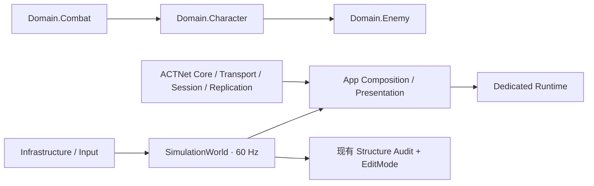
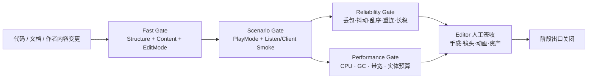

# ACTGame 全项目质量与交付优化方案

> 制定：2026-09-19  
> 角色：**结构稳定化完成后的项目级优化与验收真源（先文档，后实施）**  
> 基线：`NetSync`；代码结构稳定化 CS0～CS7 与 Safety 已于 2026-09-19 验收关闭  
> 相关：  
> - [代码结构稳定化方案](../2026.9.17/CODE_STRUCTURE_STABILIZATION_PLAN.md)  
> - [项目总清单](../PROJECT_CHECKLIST.md)  
> - [架构 ROADMAP](../../.agents/skills/actgame-architecture/ROADMAP.md)  
> - [联网现行链路](../2026.8.23/NETSYNC_FROM_JOIN_TO_HIT.md)

---

## 0. 一句话

保留现有 `Simulation / Domain / App / ACTNet` 分层，以**自动化场景验收、内容迁移清零、网络故障注入、表现门面收口和性能预算**完成从“结构正确”到“可持续交付”的优化；禁止再次大拆程序集、禁止以长期兼容层掩盖迁移、禁止在没有基线数据时做性能微调。

---

## 1. 问题与动机

### 1.1 现状基线



| 观察 | 当前证据 | 结论 |
|------|----------|------|
| 分层 | 生产代码已有 Core、Input、Combat、Character、Enemy、Simulation、Networking、App、Server、ACTNet 等显式 asmdef；引用白名单由 [`StructureAuditRuleSet`](../../Assets/Scripts/Editor/Architecture/StructureAuditRuleSet.cs#L42) 维护 | 不需要再做程序集大拆分 |
| 内容门禁 | [`StructureValidationBatch.ValidateAll`](../../Assets/Scripts/Editor/Architecture/StructureValidationBatch.cs#L35) 已聚合结构、Action、Character、CombatMode、Locomotion 与 BT 审计 | 静态结构与作者内容已有可靠入口 |
| 本地 CI | [`ci.ps1`](../../ci.ps1#L46) 当前执行 Structure/Content Audit、EditMode，并可选 Dedicated READY smoke | 缺少 PlayMode 场景、联网故障与性能门禁 |
| 测试形态 | `Assets/Tests` 当前只有 `EditMode` 与 `Editor` 目录，未发现 `UnityTest` / PlayMode 测试 | 大量出口仍依赖人工 Play，回归成本随功能增长 |
| 大型门面 | [`StructureAuditRuleSet`](../../Assets/Scripts/Editor/Architecture/StructureAuditRuleSet.cs#L20) 已为 `RemoteCharacterProxy`、`CameraManager`、`DedicatedServerRuntime` 等登记单职责理由 | 行数本身不是拆分类依据，但需用边界测试防职责回流 |
| 相机装配 | [`CameraManager.ResolveFollowTarget`](../../Assets/Scripts/App/Controllers/Camera/CameraManager.cs#L193) 在服务解析失败后仍以 Player Tag 查场景；同文件注释要求 LocalPlayerService 路径禁止 Scene Find | 存在可明确关闭的装配旁路 |
| Observer 表现 | [`RemoteCharacterProxy`](../../Assets/Scripts/App/Presentation/RemoteCharacterProxy.cs#L9) 同时承担 Snapshot 应用、动画播放、Notify、Targetable 与静态 Live Registry | 仍是单一播放头，但注册表/调试发现职责可下放 |
| 待验收项 | `PROJECT_CHECKLIST` 仍列出 L1B Play、W11/R2、资产闭环、性能基线等开放项；W10 已于 2026-09-19 验收 | 下一阶段应先关交付风险，不应继续铺新框架 |

规模快照（2026-09-19，只用于规划，不作为质量评分）：

- `Assets/Scripts`：约 623 个 `.cs`，其中 Domain 376、App 110、Editor 59、Framework 60。
- `Assets/Tests`：约 109 个 `.cs`，主要覆盖纯逻辑、结构边界和 Editor 工具。
- 运行时超 450 行的文件已被门禁显式登记；后续只在职责或变更风险失控时拆分。

### 1.2 核心痛点

1. **测试金字塔缺中层**：纯逻辑测试充足，但真实场景装配、Playable、Cinemachine、输入生命周期和多客户端组合主要靠人工 Play。  
2. **联网“代码已落”与“可交付”之间有缺口**：W10 已验收；W11 尚缺 V2 FakeActionGame、10+ Actor、兴趣 / Owner 预算和 R2 出口。  
3. **资产债无法由编译表达**：Action 位移、受击/死亡、EX/Ult、Locomotion 旧轨和 BT 装配仍可能代码绿、体验不完整。  
4. **结构门禁只防已知模式**：Tag Find、静态表现注册表和大型门面职责增长尚未形成机器可判定的回归条件。  
5. **没有性能预算**：项目尚无稳定木桩/多敌人/Observer 场景基线，无法判断一次优化是否真实有效。  
6. **文档存在双入口风险**：`.agents` 与 `.cursor` 下的架构资料可独立变化，长期手工双写会再次漂移。

### 1.3 目标与不做

| 目标 | 完成定义 |
|------|----------|
| 可回归 | 核心本地战斗与 Listen/Client 场景可由自动化 smoke 重复执行，失败有日志与结果文件 |
| 可验收 | W11/R2、Party 后续、Locomotion 与 Camera 的开放出口分别有清单和证据，不再用“代码完成”代替“功能完成”；W10 已关闭 |
| 可度量 | CPU、GC、Snapshot 带宽、实体数与长稳测试均有固定场景、采样窗口和预算 |
| 可维护 | 大型门面保持明确边界；场景 Find 与静态发现路径收口；新增职责必须先通过边界测试 |
| 单一真源 | 架构/技术/路线文档只维护一个权威副本，另一工具入口由链接或同步检查提供 |
| 不做 | 本计划不新增玩法、不实现 W12 公网运维、不引入 ECS/DI 框架、不重写 ActionSim/Numeric/Replication V2 |

---

## 2. 设计原则

1. **先关出口，再开新模块**：优先关闭现有 Play、R2 和资产迁移项。  
2. **自动化分层**：快速门禁负责结构与纯逻辑；场景门禁负责 Unity 装配；长稳/性能门禁单独运行。  
3. **固定输入、可判结果**：Play smoke 使用明确场景、角色、逻辑帧数与预期状态，禁止只靠等待秒数或肉眼截图判定。  
4. **权威边界不变**：玩法结果仍由 `SimulationWorld / InputFrame / CombatHitPipeline` 决定；测试和表现不得建立 Update 旁路。  
5. **资产也有 Schema**：不能自动修改的 `.asset` / Prefab 仍必须被只读审计和人工签收清单覆盖。  
6. **以预算驱动优化**：没有基线、重复样本和回归阈值，不提交“性能优化”结论。  
7. **零长期兼容**：迁移阶段完成即删除旧入口、旧字段与双写。  
8. **大型门面按职责拆，不按行数拆**：先以 characterization test 锁行为，再迁出独立职责。

---

## 3. 目标架构

### 3.1 交付门禁



| 层 | 输入 | 输出 | 不负责 |
|----|------|------|--------|
| Fast Gate | 源码、asmdef、SO 内容、纯逻辑 fixture | 非零退出码、EditMode XML、结构日志 | 真实渲染与多进程体验 |
| Scenario Gate | 固定测试场景、确定性输入脚本、逻辑帧预算 | 状态断言、PlayMode XML、场景日志 | 公网质量结论 |
| Reliability Gate | Fake/Loopback 故障模型、双进程构建 | ACK/重传/Recover/带宽/长稳报告 | 新协议双轨 |
| Performance Gate | 固定角色数、动作脚本、采样窗口 | CPU/GC/带宽基线与阈值对照 | 无数据微优化 |
| Manual Gate | 正式资产、镜头与动画主观体验 | 人工签收记录 | 替代自动断言 |

### 3.2 场景测试契约

```text
ScenarioDefinition
  Input  = SceneId + ContentCatalog + ActorLayout + InputFrameScript + FaultProfile
  Step   = Simulation ticks / rendered frames（显式预算）
  Assert = ActorSnapshot + MatchPhase + ReplicationMetrics + Presentation probes
  Output = NUnit result + structured JSON summary + Unity log
```

- 玩法断言读 Snapshot / Domain 查询，不读 Animator 当前状态作为权威。
- 表现断言可读只读 Probe，但不得回写 `SimulationWorld`。
- 联网故障模型复用 ACTNet Transport/Session 契约，不在 App 层伪造第二套协议。
- 正式场景与正式资产只读；自动化需要的最小 fixture 放到专用测试目录。

### 3.3 表现与装配收口

```text
LocalPlayerService ──> CameraTargetBinder ──> CameraManager
                                           （无 Tag Find 回退）

ObserverReplicationCoordinator
  ├─ RemotePresentationRegistry      // 生命周期与只读查询
  └─ RemoteCharacterProxy            // 单 Actor Snapshot → Playback
       ├─ RemoteActionPresenter
       └─ RemoteLocomotionPresenter
```

这不是要求立即拆完所有类型；只有在 characterization test 通过后才迁移职责，且 `RemoteCharacterProxy` 仍保持每个 Observer Actor 的唯一播放头。

---

## 4. 范围与优先级

| 阶段 | 优先级 | 包含 | 不包含 |
|------|--------|------|--------|
| PWO0 | P0 | 基线、失败账本、CI 分层 | 业务重构 |
| PWO1 | P0 | 核心 PlayMode 场景 smoke | 完整视觉金图系统 |
| PWO2 | P0 | W11 V2 证据与 R2（W10 已验收） | W12 公网部署 |
| PWO3 | P1 | 内容迁移与资产审计闭环 | Agent 直接修改正式 `.asset` / Prefab |
| PWO4 | P1 | 装配旁路与表现门面职责收口 | 重写 Camera/Replication |
| PWO5 | P1 | 性能学习主线：基线、预算与回归门禁 | 无基线的微优化 |
| PWO6 | P2 | 文档单一真源与计划收尾 | 保留两份长期手工真源 |

---

## 5. 分阶段交付（任务 / 验收 / 出口）

> 勾选：未开始 `[ ]`；实现并取得证据后改为 `[x]`，出口必须写日期与证据路径。

### PWO0 — 冻结优化基线与失败账本

**任务**

- [ ] 记录当前 Unity 编译、`StructureValidationBatch.RunAll`、全量 EditMode、Dedicated READY smoke 结果与耗时。
- [ ] 建立 `docs/2026.9.19/OPTIMIZATION_BASELINE.md`，按“代码缺陷 / 资产缺口 / 人工体验 / 环境问题”分类失败。
- [ ] 为 `ci.ps1` 定义 `Fast / Scenario / Reliability / Performance` 开关；默认仍只跑 Fast。
- [ ] 固定基线 commit、Unity 版本、场景、角色配置与测试机器说明。

**验收**

- [ ] 任一失败都有可复现命令、日志路径、责任阶段和“不阻塞项”说明。
- [ ] 不把当前已知失败伪装成新改动回归，也不因历史失败关闭门禁。
- [ ] Unity Editor 正在打开项目时不启动同目录 BatchMode；人工与命令行路径均写清。

**出口：** 后续每个优化结果都能与同一基线比较。→ **未达成**

### PWO1 — 核心 PlayMode 场景自动化

**任务**

- [ ] 新建独立 PlayMode 测试程序集与最小测试场景/fixture，不引用 Editor 程序集。
- [ ] 建立确定性 `InputFrameScript` 驱动器；按逻辑帧推进，不用 `WaitForSeconds` 判断玩法。
- [ ] 覆盖四条最小链：移动/动作起手、命中/死亡、三槽切人/弹刀、Observer Snapshot/播放头。
- [ ] 为相机只增加装配与抢权 smoke；镜头美感仍由人工验收。
- [ ] `ci.ps1 -RunScenario` 输出 PlayMode XML 和场景日志；Fast Gate 默认不被长场景拖慢。

**验收**

- [ ] 同一测试连续运行 10 次无随机失败。
- [ ] 失败信息包含 ActorId、LogicFrame、ActionId/GraphNodeKey 与关键 Snapshot。
- [ ] 测试不依赖对象创建顺序、`GameObject.Find*` 或 Animator 状态作为玩法真源。
- [ ] Unity Editor Test Runner 与命令行 Scenario Gate 均可执行。

**出口：** 核心本地战斗与 Observer 链路有可重复的 Unity 场景级回归。→ **未达成**

### PWO2 — W11 网络可靠性与 R2 出口

**任务**

- [x] W10 的丢包、抖动、乱序、可靠事件重传与网络时间完成用户验收。（2026-09-19）
- [ ] 将 W11 的 Delta/Relevancy/预算/R2 恢复场景纳入 FakeActionGame 或等价纯协议 fixture。
- [ ] 增加 30 分钟 Listen+Client 长稳：连接数、Recover 次数、重传队列、Snapshot 丢旧、内存趋势可观测。
- [ ] 双进程人工验收保留为 W11 最终出口：远敌裁剪、Owner 不饿死、断线重连。
- [ ] 更新联网真源，只在 W11 全部出口关闭后把 W11 / R2 标为完成。

**验收**

- [ ] Snapshot 丢包不阻塞可靠 Event；可靠队列有界且 ACK 后释放。
- [ ] Recover 失败可按现有冷却重试；ForceFull 重新通过 Meta/Lifecycle 屏障。
- [ ] Relevancy 裁剪压力下 Owner 与当前交互目标不被预算饿死。
- [ ] 长稳过程无无界历史、无连接残留、无静默吞异常。
- [ ] R2 与 Play 证据落盘；仍不得据此宣称 W12 公网可用。

**出口：** W10 已验收；W11 从“代码切面”升级为“V2 证据 + 双进程验收完成”。→ **W11 未达成**

### PWO3 — 内容与资产迁移清零

**任务**

- [ ] 扩展只读 Content Audit：Action 位移源、孤儿 YAML 字段、Reaction Action、EX/Ult Spec/Graph、Locomotion `frameCount=0`、Enemy Definition/BT/动画完整性。
- [ ] 每项错误输出资产路径、字段、修复菜单与严重级别；阻断项进入 `StructureValidationBatch`。
- [ ] 生成 Editor 人工迁移清单；逐资产 Bake/重存/绑定，Agent 不直接修改正式资产。
- [ ] 完成后删除一次性迁移菜单、临时兼容字段和过期 fallback。

**验收**

- [ ] 全库 Action/Locomotion/Character/Enemy 审计 Error=0。
- [ ] 玩家与敌人的受击、死亡、Special、EX、Ultimate 至少各有一条正式内容链通过 Play。
- [ ] `rg` 与序列化审计确认被替代字段/类型归零。
- [ ] 缺可选美术资源只允许 Warning，玩法权威缺口必须 Error。

**出口：** 代码闭环与正式内容闭环一致，开放资产债有明确归零证据。→ **未达成**

### PWO4 — 装配旁路与表现门面收口

**任务**

- [ ] 先补 Camera/Observer characterization tests，锁定现有可见行为。
- [ ] 删除 `CameraManager` 的 Player Tag 查找回退；目标只由 Inspector 明确覆盖或 `LocalPlayerService` 提供。
- [ ] 将 `RemoteCharacterProxy.LivePresentations` 静态注册表迁为由 Observer 生命周期拥有的 `RemotePresentationRegistry`；调试 HUD/Probe 只读该端口。
- [ ] 若测试表明动作、Locomotion、Notify 任一职责可独立变化，再提取 Presenter；否则保留单一播放头，不为降行数拆文件。
- [ ] 扩展结构门禁：生产 Controller 禁止 `GameObject.Find*`/Tag Find，静态可变注册表需显式登记所有者。

**验收**

- [ ] 本地玩家晚绑定、换人、Observer Spawn/Despawn、场景退出均无悬挂引用。
- [ ] Camera 缺依赖时明确失败，不静默绑定到错误 Tag 对象。
- [ ] Remote Proxy Dispose 后 Registry、Playable、TargetSystem 与 Notify consumer 均释放。
- [ ] Snapshot 应用仍不直接推进权威模拟；表现测试与迁移前一致。

**出口：** 场景依赖只经 Composition/Service 进入，Observer 表现的生命周期所有权唯一。→ **未达成**

### PWO5 — 性能基线与预算

**任务**

- [ ] 建立三档固定场景：1v1 木桩、1 玩家+8 敌人、Listen+Client 多 Observer。
- [ ] 固定 60 秒预热/采样窗口，记录 Main Thread、GC Alloc、Simulation Step、Snapshot bytes/sec、重传队列与 Proxy 数量。
- [ ] 为热路径添加低开销计数器/ProfilerMarker；禁止在 Domain 引入仅为 Profiler 服务的 Unity 反向依赖。
- [ ] 只针对超预算项优化；每次提交保留前后对照和功能回归。
- [ ] 预算稳定后将宽松上限接入独立 Performance Gate。

**验收**

- [ ] 同一场景至少三次采样，报告中给中位数与最差值。
- [ ] 逻辑帧无持续 GC Alloc；瞬时分配有来源说明与上限。
- [ ] 多实体下 Simulation 不丢欠账，Snapshot/可靠队列保持有界。
- [ ] 优化没有改变 Action、命中、预测、Party 或 Presentation 行为。

**出口：** 性能讨论由可重复预算和对照数据驱动，而不是主观感觉。→ **未达成**

### PWO6 — 文档单一真源与总出口

**任务**

- [ ] 决定 `.agents/skills/actgame-architecture` 为架构资料权威源；Cursor 入口改为链接、生成镜像或只读指针，禁止长期手工双写。
- [ ] 增加文档链接/重复真源审计，阻止 ROADMAP/TECHNICAL 版本漂移。
- [ ] 回写 `ARCHITECTURE.md`、`TECHNICAL.md`、`ROADMAP.md` 与 `PROJECT_CHECKLIST.md` 的最终状态。
- [ ] 删除已完成阶段的一次性 Backlog 入口，仅保留现行阅读路径与历史变更记录。
- [ ] 执行 Fast + Scenario + Reliability + Performance + Editor 人工总验收。

**验收**

- [ ] 项目内所有架构/技术链接可解析，任一主题只有一个可编辑真源。
- [ ] 本计划 PWO0～PWO5 出口全部注明完成日期和证据。
- [ ] W12、UI、A*、热更、SDK、剧情编辑器按各自近期学习切片推进，但不混入本质量优化计划的完成定义。

**出口：** 项目具备单一文档真源、分层门禁、内容闭环、可靠性证据与性能预算。→ **未达成**

---

## 6. 迁移与删除

### 6.1 保留

- `SimulationWorld / InputFrame / CombatHitPipeline / ActionSim / NumericSystem` 权威链。
- 当前程序集分层与 `StructureValidationBatch` 总入口。
- EditMode 纯逻辑测试与人工 Play 手感验收；新门禁补中层，不替代两端。
- `RemoteCharacterProxy` 每 Actor 唯一播放头语义。

### 6.2 明确删除或收口

| 对象 | 阶段 | 完成态 |
|------|------|--------|
| `CameraManager.playerTag` 与 Tag Find 回退 | PWO4 | 只经显式绑定 / `LocalPlayerService` |
| `RemoteCharacterProxy` 静态可变 Live Registry | PWO4 | Observer 生命周期拥有 Registry |
| 一次性资产迁移工具与旧序列化 fallback | PWO3 | 审计归零后删除 |
| `.agents` / `.cursor` 两份手工维护的架构真源 | PWO6 | 一个权威源，另一入口为指针或自动生成 |
| “代码完成即功能完成”的状态口径 | 全程 | 出口必须附自动/人工验收证据 |

禁止为迁移保留新的 `Legacy`、`Compat`、`V1` 门面；需要短迁移窗口时必须在同一阶段内创建并删除。

---

## 7. 目录与文件预期（增量）

```text
Assets/Tests/PlayMode/
  ACTGame.PlayModeTests.asmdef
  Scenarios/
  Fixtures/

Assets/Tests/EditMode/ACTNet/
  Reliability/
  Performance/

Assets/Scripts/App/Presentation/
  RemotePresentationRegistry.cs
  RemoteCharacterProxy.cs

Assets/Scripts/Editor/Architecture/
  StructureValidationBatch.cs
  Content migration audits...

docs/2026.9.19/
  PROJECT_WIDE_OPTIMIZATION_PLAN.md
  OPTIMIZATION_BASELINE.md
  PERFORMANCE_BASELINE.md

Temp/CI/                         // 生成物，不提交
  structure.log
  editmode-results.xml
  playmode-results.xml
  reliability-summary.json
  performance-summary.json
```

---

## 8. 风险与对策

| 风险 | 对策 |
|------|------|
| PlayMode 测试脆弱、拖慢迭代 | 固定逻辑帧与 fixture；Fast/Scenario 分层；禁止用任意等待时间判结果 |
| 测试为方便而建立第二套运行时 | 测试只通过正式 Composition/Domain 端口驱动；fixture 仅提供输入与观察 |
| 资产错误无法命令行修复 | Audit 输出精确路径和菜单；Editor 人工清单作为阶段必达出口 |
| 网络长稳不稳定、难复现 | FaultProfile 带固定 seed；记录连接、Tick、Sequence 和指标快照 |
| 大类拆分引入表现回归 | characterization tests 先行；一次只迁一项职责；无证据不拆 |
| 性能数字受机器噪声影响 | 固定机器/版本/场景；预热；至少三次采样；用中位数和最差值 |
| 文档双源涉及 Cursor 工作流 | 保留工具入口，但只允许链接/生成镜像，不再双边手工编辑 |
| Unity 正在被 Rider/Editor 使用 | 同项目禁止并发 BatchMode；在 Editor 内跑菜单/Test Runner 或关闭后执行 CI |

---

## 9. Editor 人工步骤

1. 关闭任何会与 BatchMode 争用项目的 Unity Editor 后，再执行完整 `ci.ps1`；日常可在 Editor 内运行结构菜单与 Test Runner。  
2. PWO1：在 Test Runner 的 PlayMode 页运行核心 Scenario；确认场景退出后无残留对象/Playable。  
3. PWO2：启动 Dedicated + Client 或 Listen + Client，按 FaultProfile 对照执行 Clumsy/UDP 验收并保存日志。  
4. PWO3：逐项运行 Action、Locomotion、Character、Enemy 审计；按输出路径 Bake、重存、绑定正式资产。  
5. PWO4：验证进关晚绑定、三槽切换、Observer Spawn/Despawn、相机目标切换与场景重载。  
6. PWO5：使用同一测试构建和质量设置采样 Profiler；禁止边采样边编辑资产或打开额外调试窗口。  
7. Agent 不直接修改 `Assets/Data/**`、Prefab、Scene、Input Actions 或正式美术资源；这些步骤由用户在 Editor 完成并回写证据。

---

## 10. 推荐开工顺序

```text
PWO0 基线
  → PWO1 PlayMode 场景 smoke
  → PWO2 W11 / R2 可靠性出口
  → PWO3 内容与资产迁移
  → PWO4 装配/表现职责收口
  → PWO5 性能基线与预算
  → PWO6 文档与总出口
```

**最小可感切片：** 先完成 PWO0 + PWO1 的“移动/动作起手 + 命中/死亡”两条 PlayMode smoke，并让 `ci.ps1 -RunScenario` 产出 XML；它能最快降低后续所有改动的人工回归成本。

---

## 11. 总完成定义

- [ ] Fast、Scenario、Reliability、Performance 四层门禁各有稳定入口和证据产物。
- [ ] 核心战斗、Party、Observer、W11 主要链路具备自动化或明确人工验收；W10 已具备用户验收记录。
- [ ] 正式内容审计 Error=0，迁移工具与旧 fallback 已删除。
- [ ] Camera/Observer 装配不存在未登记的场景查找或静态生命周期旁路。
- [ ] 三档性能场景有基线、预算与回归记录。
- [ ] 架构/技术/路线文档只有一个权威可编辑源。
- [ ] 所有改动保持 60Hz Sim、Numeric、Replication V2 与表现只读边界。

未同时满足以上条目，不得把本项目级优化计划标记为完成。

---

## 12. 变更日志

| 日期 | 说明 |
|------|------|
| 2026-09-19 | 初版：承接已关闭的代码结构稳定化，建立 PWO0～PWO6 质量、内容、可靠性、表现、性能与文档收口计划 |
