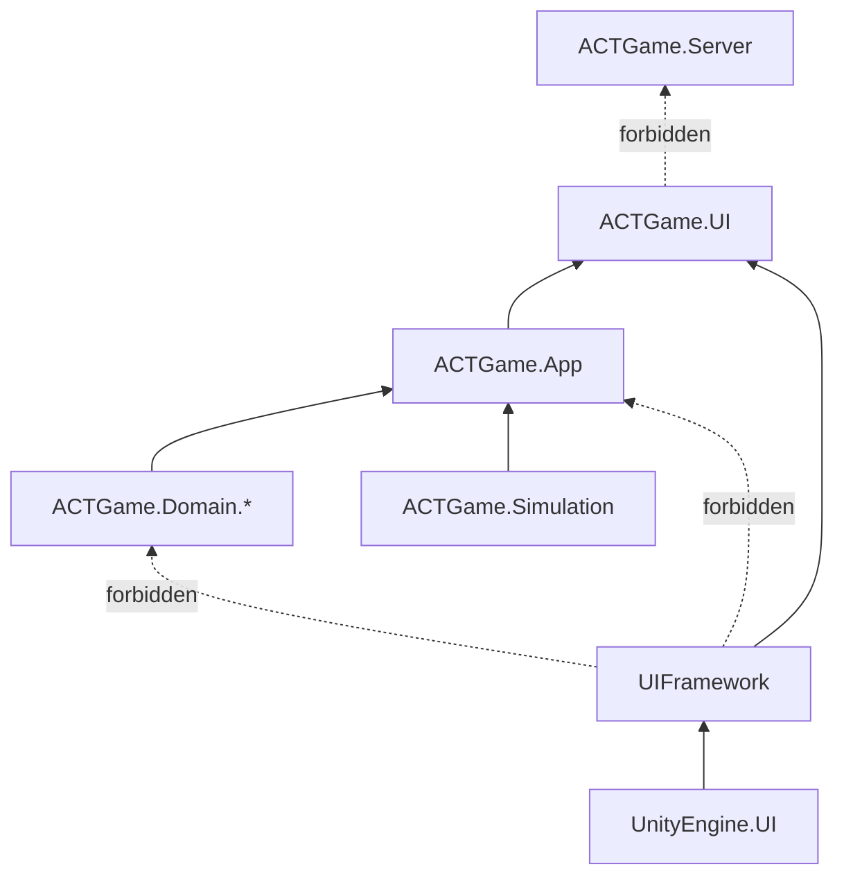

# ACTGame UI 框架搭建方案 — Framework/UIFramework + UGUI + MVVM Binding

> 制定：2026-09-19  
> 修订：2026-09-28 — 确定 Command + 可观察属性 + 通用 Binder 的 MVVM；首版反射解析与 Editor 校验，后续代码生成
> 角色：**通用 UIFramework 与 ACTGame 业务 UI 的结构、边界及手写实施真源（先文档，后实现）**
> 实施约束：框架及业务代码均由项目作者手写；Agent 只更新计划和提供评审。后续生成器也是作者手写的学习内容，其输出属于工具产物。
> 相关：  
> - [架构文档](../../.agents/skills/actgame-architecture/ARCHITECTURE.md)  
> - [架构约定](../../.agents/skills/actgame-architecture/CONVENTIONS.md)  
> - [相机与 UI 展示舱方案](../2026.8.26/CAMERA_SYSTEM_PLAN.md)  
> - [项目总清单](../PROJECT_CHECKLIST.md)  
> - 数据链：`Simulation / Owner Snapshot → App 只读投影 → ViewModel → UGUI View`

---

## 0. 一句话

在 `Assets/Scripts/Framework/UIFramework` 建立以 **`UIManager` + `UIPanel`** 为核心、由 **ScriptableObject 注册表 + 可替换资源 Provider + AssetBundle 版本目录 + Panel 对象池** 支撑的 UGUI 通用界面管理框架，由 `ACTGame.UI` 通过具体 Panel、Presenter、ViewModel 和 App 只读投影接入项目页面；热更新只覆盖 UI Prefab/图集/字体等资产，不伪装成 C# 代码热更，并禁止 Framework 引用 App/Domain、View 直读写玩法权威、静态 `UIManager.Instance` 与 Runtime UI Toolkit 双轨。

MVVM 增量确定为 **`IUICommand/UICommand` + `UIProperty<T>` + 控件通用 Binder + `UIBindingScope`**：Prefab 声明控件与 ViewModel 成员的对应关系，框架自动完成事件连接、首次同步和解绑。首版反射只在绑定时解析公开成员，Editor 校验配置；后续由同一配置生成强类型访问代码，替换反射实现，不建立第二套作者配置。

---

## 1. 问题与动机

### 1.1 现状基线

```text
SimulationHost.StepOnce
  → SimulationLogicStepEvent
  → LocalPlayerService.Local.Actor
       ├─ CharacterVitality（Health / MaxHealth）
       └─ PlayerPartyRuntime（ActiveSlot / AssistPoints）

Owner Snapshot
  → ActOwnerReplicationAdapter.ApplySnapshot
  → CharacterVitality.ApplyAuthorityHealthMilli
```

| 点 | 现状与结论 |
|----|------------|
| UI 当前实现 | 已有测试 Panel、内存 Provider、注册表、四层挂点和 UIManager 导航；正式 HUD 与 MVVM Binding 尚未实现。用户已反馈 A/B 重开、Back 修改及验证完成；不据此宣称本计划全部 U0/U1 验收通过 |
| Framework 基线 | `Framework/ACTNet` 已证明“独立目录 + 自有 asmdef + 上层单向引用”的项目约定；UI 只需一个轻量运行时框架，因此采用直白的 `Framework/UIFramework`，不复制 ACTNet 的产品前缀与多程序集规模 |
| 渲染技术 | 工程已安装 `com.unity.ugui 1.0.0`；首版采用 UGUI，适合 HUD、菜单、World Space 血条和后续 RenderTexture 展示舱 |
| 架构入口 | `ACTGameArchitecture` 已提供强类型 System / Query / Command / Event；UI 应复用，不新增 static event bus 或 Service Locator |
| 本机数据 | `LocalPlayerService` 已统一提供 Local Player；`PlayerController.Actor` 是 HUD 只读入口，Owner 快照也会回写该 Actor 的 Vitality |
| 固定帧通知 | `SimulationLogicStepEvent` 在整帧 Combat/PostCombat 完成后发布；适合 App 投影采样，不需要 View 每渲染帧轮询 Domain |
| 阵容切换 | `PlayerPartyRuntime.ActiveActorChanged` 已覆盖预测切人、权威纠正、死亡换人与队灭；App 投影需把它收口成 UI 快照，而不是让每个 View 自己换绑 Actor |
| Dedicated | `ACTGame.Server` 不得依赖 HUD/Input/Camera；运行时 UI 必须是仅客户端引用的叶子程序集 |
| 3D 展示 | C5 已约定独立 Booth + Camera + RenderTexture；它是后续页面内容，不应进入基础导航或战斗 Camera Director |

2026-09-28 代码核对入口：[`UIPanel.Create/Open/Close/Release`](../../Assets/Scripts/Framework/UIFramework/UIPanel.cs)、[`UIManager.OpenAsync/Back`](../../Assets/Scripts/Framework/UIFramework/UIManager.cs)、[`UITestController.OpenA/OpenB/Back`](../../Assets/Scripts/UI/UITestController.cs)。`UIPanel` 当前没有 DataContext/绑定作用域，测试入口仍使用公开方法；以下 MVVM 类型与新增阶段均是待实现设计。

### 1.2 核心痛点

1. 如果 HUD 直接在 `Update` 中抓 `PlayerController.CurrentHealth`，生命周期、换人、断线和测试都会散落在 View 中。  
2. 如果 ViewModel 直接持有 `CharacterActor`，所谓 MVVM 只剩目录命名，表现层仍与 Domain 强耦合。  
3. ScriptableObject 注册、AssetBundle、热更新和对象池是本轮明确的学习目标，但若全部塞进 `UIManager`，会混淆导航、资源、版本和实例生命周期。
4. 离线、Listen 与远端 Client 必须看到同一套 HUD 数据语义，不能分别维护本地血量与网络血量两条 UI 路径。  
5. 联机菜单不能擅自 `Time.timeScale = 0`；UI 输入焦点和玩法暂停是两个不同问题。

### 1.3 目标与不做

| 目标 | 完成定义 |
|------|----------|
| 清晰分层 | View/Binder 操作 UGUI；ViewModel 暴露可观察展示属性与 UI Command；Presenter 负责装配、生命周期和业务桥接；App Projection 只读玩法状态 |
| 自动绑定 | 每个需要绑定的控件挂通用 Binder 并填写成员名；Panel 根节点一个 Scope 自动收集和连接，不逐个配置 Button.OnClick 业务函数，也不为每个命令编写 MonoBehaviour |
| 可复用框架 | `UIFramework` 只依赖 Unity/UGUI，不引用 ACTGame App、Domain、Simulation 或 Server，可复制到另一 Unity 游戏项目独立编译 |
| 单一数据流 | 离线/Listen/Client 都从当前 Local Actor 生成同一 `LocalHudSnapshot`；网络纠正通过现有 Actor 回写自然进入 HUD |
| 可学习 | 每阶段只引入一个新概念，并有纯 C# 测试或 Play 现象作为出口 |
| 可扩展 | 支持 HUD、全屏页、Modal、Toast 四种层级；后续可接角色详情的 3D 展示舱 |
| 可回收 | 页面关闭后无残留订阅；重复开关页面不会重复回调或累积实例 |
| 资源注册 | `UIPanelRegistry` ScriptableObject 是 PanelId、Bundle、Asset、Layer 与回收策略的作者真源 |
| 可替换加载 | `UIManager` 只依赖 `IUIPanelAssetProvider`；本地直载与 AssetBundle 加载不得形成两套导航逻辑 |
| 资产热更新 | 支持远端版本目录、下载校验、原子切换、失败回滚；运行中旧实例按版本安全退役 |
| 池化 | 单实例缓存、池化多实例、临时实例三种策略明确；关闭与销毁生命周期分离 |
| 不做 | 本轮不做 C# 代码热更、国际化、复杂动效 DSL、嵌套属性路径/集合绑定/表达式语言、自动猜测业务函数、Bundle 差分算法、加密与通用 CDN 后台；异步 Command 与带参 Command 不纳入首版 |

---

## 2. 设计原则

1. **权威状态只在 Gameplay**：UI 展示结果，不计算伤害、不修改 Numeric、不决定换人是否合法。  
2. **单向数据流**：Gameplay → Projection → ViewModel → View；用户操作反向只产生 UI 意图或 Architecture Command。  
3. **View 被动化**：View/Binder 不查场景、不拿单例、不执行业务；控件事件调用 ViewModel 的 UI Command，展示属性通过 Binder 更新。
4. **配置显式、连接自动**：通用 Binder 记录成员名，Scope 统一 Bind/Unbind；反射只在绑定阶段解析并缓存元数据，不按帧扫描，不按 GameObject 名猜业务。此决定取代 2026-09-19 的“不引入反射绑定”。
5. **值快照越层**：跨 App/UI 边界传不可变 `LocalHudSnapshot`，不传 `CharacterActor`、`NumericSystem` 或可写集合。  
6. **变化才通知**：Projection 可在逻辑帧采样，但只有快照发生变化才发布 `LocalHudStateChangedEvent`。  
7. **导航与业务正交**：路由只决定显示哪一页和层级，不根据角色、关卡或联网身份写 `if`。  
8. **Framework 零业务依赖**：`UIFramework` 只引用 Unity/UGUI/TextMeshPro；禁止引用 `ACTGame.*`，也不定义 HUD、角色、背包等项目概念。
9. **业务 UI 是客户端叶子**：`ACTGame.UI` 引用 `UIFramework` 与 `ACTGame.App`；App、Domain、Simulation、Server 均不得反向引用业务 UI。
10. **一种运行时技术**：本阶段统一 UGUI；UI Toolkit 继续只用于现有 EditorWindow，不抽象一套兼容两者的控件层。
11. **零长期兼容**：正式 HUD 达到 Debug HUD 的必要观察能力后删除重复的旧显示路径，不长期双显。
12. **资源来源可替换**：导航只面对 `IUIPanelAssetProvider` 返回的租约；不得在 `UIManager` 内直接调用 `Resources.Load`、`AssetDatabase` 或写 Bundle 分支。
13. **版本与实例同生共死**：运行实例和池中实例持有资源租约；Bundle 有引用时不得卸载，热更后的旧版本只退役、不原地替换活跃对象。
14. **关闭不等于销毁**：`Close` 解除临时订阅并隐藏；池回收只走 `Close`，真正淘汰时才执行 `Release → Destroy`。
15. **热更边界明确**：AssetBundle 可替换 Prefab、Sprite、字体和配置，但不能提供 Player 未编译的 `MonoBehaviour` 类型；代码热更另立 HybridCLR/ILRuntime 方案。

---

## 3. 目标架构

```mermaid
flowchart LR
    Sim["SimulationWorld / Owner Snapshot"] --> Actor["Local CharacterActor"]
    Actor --> Projection["LocalHudProjectionSystem · ACTGame.App"]
    Step["SimulationLogicStepEvent"] --> Projection
    Projection --> Snapshot["LocalHudSnapshot · immutable"]
    Snapshot --> AppEvent["LocalHudStateChangedEvent"]
    AppEvent --> Presenter["HudPresenter · ACTGame.UI"]
    Presenter --> VM["HudViewModel · pure C#"]
    Framework["UIManager + UIPanel · UIFramework"] --> View["HudPanel · ACTGame.UI"]
    VM --> Property["UIProperty.ValueChanged"]
    Property --> Binder["UGUI Binder / UIBindingScope"]
    Binder --> View
    View --> ButtonBinding["UIButtonCommandBinding"]
    ButtonBinding --> UICommand["ViewModel.UICommand.Execute"]
    UICommand --> Intent["UI Intent"]
    Intent --> Presenter
    Presenter --> Command["Architecture Command / UIManager"]
    Command --> App["App System"]
    Remote["Remote UI Version Manifest"] --> Updater["UIAssetUpdateService"]
    Updater --> BundleStore["persistentDataPath Bundle Store"]
    Registry["UIPanelRegistry · ScriptableObject"] --> Provider["IUIPanelAssetProvider"]
    BundleStore --> Provider
    Provider --> Factory["UIPanelFactory + Asset Lease"]
    Factory --> Pool["UIPanelPool"]
    Pool --> Framework
```



### 3.1 五层职责

| 层 | 推荐类型 | 职责 | 不负责 |
|----|----------|------|--------|
| UIFramework | `UIManager`, `UIPanel`, `UIBindingScope`, `UICommand`, `UIProperty<T>`, UGUI Binders | Panel/资源生命周期、导航，以及业务无关的 MVVM 绑定 | ACTGame 页面类型、HUD 字段、Architecture、Gameplay |
| App Projection | `LocalHudProjectionSystem`, `LocalHudSnapshot`, `LocalHudStateChangedEvent`, `GetLocalHudStateQuery` | 读取 Local Actor/Party，去重并发布稳定 UI 数据 | UGUI、颜色、动画、按钮 |
| ViewModel | `HudViewModel`, `MenuViewModel` | 把快照转为可观察展示属性，暴露 UI Command 与执行条件 | 查 Architecture、持有 Unity 对象、写 Gameplay |
| Presenter | `HudPresenter`, `PauseMenuPresenter` | 建立/解除订阅，把快照灌入 VM，把 View 意图转为命令/导航 | 保存权威业务状态、直接操作具体 Graphic |
| View | `HudPanel`, `PauseMenuPanel` 及 UGUI Binder | 承载 Prefab、Scope、控件引用和绑定配置；复杂自定义表现可有独立 View | 查 Actor、发网络包、计算业务规则 |

`UIFramework` 提供 Panel 管理和通用 MVVM 基础设施，不提供 ACTGame 的具体 ViewModel。首版不用第三方响应式库，属性与命令契约保持纯 C#；Presenter 是项目 App 与 MVVM 的装配桥，不再手工转发每一个 Button 事件。同一个界面可以由具体 Panel 直接承担 View，不强制再套一层空 View。

### 3.2 UI Root 与显示层级

```text
UIManager (DontDestroyOnLoad 由 Composition Root 决定，首版可先场景内)
├── HudLayer       // 常驻，无射线遮挡空白区域
├── ScreenLayer    // 全屏页，单栈顶
├── ModalLayer     // 对话框，可压在 Screen/HUD 上
├── ToastLayer     // 提示，不参与返回栈
└── Blocker        // 仅 Modal/加载时启用
```

| 层 | 导航规则 | 输入规则 |
|----|----------|----------|
| HUD | 场景有效期间常驻，不进返回栈 | 默认不拦截玩法输入 |
| Screen | `Push(route)` / `Pop()`，同一时刻只有栈顶交互 | 打开后请求 App 切换本机输入上下文 |
| Modal | `ShowModal(route)` / `CloseModal()` | 必须有 Blocker；Esc/Cancel 先关最上层 Modal |
| Toast | `Show(message, duration)`，不入栈 | 不抢焦点，不暂停玩法 |

具体 `HudPanel`、`PauseMenuPanel`、`CharacterDetailPanel` 定义在 `ACTGame.UI`，Framework 不维护业务路由枚举。资源身份使用稳定 `UIPanelId`，业务侧可用 `UIPanelKey<TPanel>` 同时携带稳定 Id 与期望组件类型；`UIManager.OpenAsync(key)` 在加载后验证 Prefab 上确有 `TPanel`。禁止用类名、Prefab 名或 `Type.GetType` 反射扫描作为资源身份。

### 3.3 ScriptableObject 注册表与稳定身份

`UIPanelRegistry : ScriptableObject` 是作者配置真源，每条 `UIPanelDescriptor` 至少包含：

| 字段 | 语义 |
|------|------|
| `PanelId` | 跨版本稳定身份；重命名类或 Prefab 不改变 Id |
| `BundleName` / `AssetName` | AssetBundle 与资源名；运行时不保存直接 Prefab 强引用 |
| `Layer` | HUD / Screen / Modal / Toast |
| `Lifetime` | `SingletonCached` / `Pooled` / `Transient` |
| `PrewarmCount` / `MaxPoolSize` | 仅 `Pooled` 使用；非法组合在 Editor 校验失败 |

注册表资产进入固定的 Catalog Bundle。Player 内只保留 Bootstrap Manifest，用于定位内置或下载后的 Catalog Bundle；这样注册表自身也可以随 UI 资产升级。Editor 可保留 `UIPanel` Prefab 作者引用用于校验和构建，但 Runtime Descriptor 不得用直接引用把全部 UI Prefab 拉进 Player。

### 3.4 资源 Provider、租约与 AssetBundle

```text
UIManager.OpenAsync(key)
  → UIPanelRegistry.Require(key.Id)
  → IUIPanelAssetProvider.LoadAsync(descriptor)
  → UIPanelAssetLease(Prefab, BundleVersion, Release)
  → UIPanelFactory.Instantiate
  → UIPanelPool.Rent / Create
  → UIPanel.Create → Open → Refresh
```

- `UIManager` 只负责导航、层级与实例所有权，不直接操作 AssetBundle。
- `AssetBundlePanelAssetProvider` 负责 Bundle 依赖、异步加载、引用计数和 `Unload`；测试使用内存 Provider，不保留第二套生产导航。
- 每个实例持有 `UIPanelAssetLease`；活跃实例或池中实例存在时，对应 Bundle 不得 `Unload(true)`。
- Build 工具位于独立 `UIFramework.Editor` 程序集，生成平台隔离的 Bundle、Catalog Bundle、hash/CRC 与 Version Manifest；Runtime 程序集禁止引用 `UnityEditor`。

### 3.5 对象池与热更新

| Lifetime | Close 行为 | 再次打开 | 淘汰行为 |
|----------|------------|----------|----------|
| `SingletonCached` | `OnClose` 后隐藏并保留唯一实例 | 复用同一实例 | `OnRelease → Destroy` |
| `Pooled` | `OnClose` 后归还按 PanelId+版本分桶的池 | 优先 Rent；不足时实例化 | 超上限/旧版本时 Release+Destroy |
| `Transient` | 立即 Release+Destroy | 重新加载/实例化 | 不缓存 |

热更新固定流程：

```text
读取内置 Manifest
  → 拉取远端 Version Manifest
  → 比较 Catalog/Bundle hash
  → 下载到 staging
  → 校验 hash + CRC + 依赖完整性
  → 原子切换 Active Catalog 指针
  → 新 Open 使用新版本
  → 旧实例 Close 时销毁而非回旧池
  → 旧 Bundle 引用归零后卸载
```

- 下载或校验失败时继续使用上一份完整版本；禁止半更新目录成为 Active。
- 活跃 Panel 不在热更瞬间原地替换；需要即时换肤的页面由业务显式关闭后重开。
- Pool Key 必须包含资源版本。版本过期实例禁止进入新版本池。
- AssetBundle 只热更资产。若新 Prefab 挂载 Player 中不存在的脚本类型，加载应明确失败并保留旧版本。

### 3.6 HUD 快照契约

首个垂直切片只放真实需要的字段：

```text
LocalHudSnapshot
  HasLocalPlayer
  CurrentHealthMilli
  MaxHealthMilli
  ActiveSlot
  AssistPoints
  MaxAssistPoints
  IsPartyWiped
```

- 数值保持整数 milli，比例只在 ViewModel 计算，避免 UI 引入另一套浮点状态。  
- `HasLocalPlayer=false` 时 ViewModel 隐藏 HUD，不用 0 血猜“未初始化”。  
- 后续能量、喧响、技能冷却各自证明需求后再加字段；不提前塞整个 `NumericDebugSnapshot`。  
- 世界敌人血条应是独立 `WorldHealthBarPresenter` 切片，绑定只读目标句柄；不要复用 Local HUD ViewModel。

### 3.7 输入与暂停契约

```text
Button.onClick → UIButtonCommandBinding
  → ViewModel.UICommand.Execute → 注入的业务意图
  → Presenter
  → Open/Close Route 或 SendCommand
  → App 决定 Cursor / Gameplay Input 是否启用
```

- UI 只能请求 `UiInputMode.Gameplay | Menu`，不能直接启停 `InputActionAsset`。  
- 联机房间打开菜单只屏蔽本机玩法采样并显示光标，**不得**暂停 `SimulationWorld` 或设置 `Time.timeScale=0`。  
- 将来离线暂停也由 App 的 `PausePolicy` 决定；View 不判断当前是 Client / Listen / Offline。

### 3.8 程序集边界



图中实线方向表示“被上层引用”：`UIFramework → ACTGame.UI`，且 `ACTGame.UI` 同时引用 `ACTGame.App`。UIFramework 不认识任何 ACTGame 业务；`ACTGame.Server`、Domain 和 Simulation 不添加 UI 引用，Dedicated 场景不装配 `UIManager`。

---

### 3.9 MVVM 绑定契约（待实现）

采用“每个控件一个通用 Binder、Panel 根节点一个 Scope”的配置方式。Save/Cancel 共用 `UIButtonCommandBinding`，分别填写 `SaveCommand` / `CancelCommand`；Command 本身是 ViewModel 中的纯 C# 对象，不挂到 Prefab。首版不同时实现根节点绑定表或运行时节点命名匹配。

| 契约 | 输入 / 输出与约束 |
|------|------------------|
| `IUICommand` | `bool CanExecute`、`event Action CanExecuteChanged`、`void Execute()`；Execute 内部再次检查条件，不能只靠按钮禁用 |
| `UICommand` | 构造时注入非空 Action 与可选 Func<bool>；依赖状态变化后由 VM 显式调用 `NotifyCanExecuteChanged()`，首版不做自动依赖追踪 |
| `IReadOnlyUIProperty<T>` | 只读 Value 与 `ValueChanged`；供单向展示 |
| `IUIProperty<T>` / `UIProperty<T>` | 可写 Value；用 `EqualityComparer<T>.Default` 去重，值变化才通知；VM 的属性对象在一次绑定期间保持稳定 |
| `IUIBinding` | Bind(context, resolver) / Unbind；返回或持有可释放订阅，重复解绑安全 |
| `UIBindingScope` | 收集本 Panel 下含 inactive 对象的 Binder，排除子 Scope；预校验全部绑定，失败则回滚已建立订阅；重复 Bind 先 Unbind |
| `ReflectionBindingResolver` | 首版只支持 VM 的 public 实例、无索引、可读属性名；不支持点分嵌套路径、字段、方法、私有成员和隐式类型转换。缓存 Type + 成员名的元数据，不缓存 VM 实例或跨实例委托 |
| `UIButtonCommandBinding` | 从同对象取得 Button；绑定 IUICommand，首次同步及变化时设置 interactable，点击调用 Execute；解绑移除自己注册的监听并禁用按钮 |
| `UITextBinding` | `IReadOnlyUIProperty<string>` → TMP_Text.text；格式化留在 VM，首次绑定立即同步 |
| `UISliderBinding` | float 单向展示默认；TwoWay 显式要求 `IUIProperty<float>`，仅用于可编辑草稿/设置；VM → 控件用 SetValueWithoutNotify |
| `UIToggleBinding` | bool 单向或显式 TwoWay；VM → 控件用 SetIsOnWithoutNotify |
| `UIActiveBinding` | bool → 指定子内容节点的 SetActive；禁止控制承载 Panel/Scope 的根节点或其祖先，避免隐藏导致自身解绑无法恢复 |

所有 UGUI 操作在 Unity 主线程执行；外部异步结果由 Presenter 切回主线程并确认页面会话仍有效。首版 Command 只接受同步 Action，禁止把 async lambda 隐式塞入 Action 产生 async void；异步业务后续独立定义 AsyncUICommand 的取消、异常和防重入契约。

UI Command 表达界面行为，App Architecture Command 才是业务请求入口，二者不合并。CanExecute 只决定 UI 可交互性，业务与服务器仍独立校验合法性。双向绑定只编辑 VM 草稿，提交经 UI Command → Presenter → App；血量等权威投影永远只读。

### 3.10 绑定会话与导航恢复（待实现）

沿用现有 `Create/Open/Refresh/Close/Release` 生命周期，不引入另一组 Enter/Exit。新增 `UIMvvmPanel<TViewModel> : UIPanel` 作为可选通用扩展，拥有 Scope 和当前会话上下文；旧测试 Panel 可继续使用基础 UIPanel。业务 Presenter 在首次 Open 前创建 VM、灌入快照并设置上下文；Manager 只提供一次“实例准备后、Open 前”的初始化回调，不理解 VM 类型或业务成员。

| 时机 | 必须行为 |
|------|----------|
| Create / OnCreate | 缓存控件和 Binder；获取组件不依赖 Awake 已执行，支持 inactive Prefab |
| 首次或恢复 Open | MVVM 基类在业务 OnOpen 前绑定当前上下文并首次同步；无上下文明确失败；已打开页面的 Refresh 不重复订阅 |
| Screen 被覆盖 / Close | Unbind 移除全部 VM 事件和本轮 Unity 控件监听；暂停 Presenter 外部订阅。Singleton/导航历史可保留 VM 草稿与上下文，但不能保留活跃绑定 |
| Back 恢复旧 Screen | Presenter 重新取最新快照并恢复外部订阅，Scope 重新 Bind，再显示；必须覆盖 UIManager.RestoreStackTop 的恢复路径，不能只在最外层 OpenAsync 调用后绑定 |
| 换 VM | 先解除旧 VM，校验新 VM，再首次同步；失败不留下半绑定界面，Manager 清理实例/租约且不提交新导航记录 |
| Pool.Return | 除 Close 的解绑外，清空 DataContext 和业务委托，由会话所有者释放旧 Presenter/VM；下次 Rent 必须注入新上下文 |
| Release / 场景销毁 | 幂等解绑并清空引用；Manager/会话所有者清理订阅和租约，不只依赖可能不触发的 Unity 消息 |

框架钩子保证 Bind/Unbind 不会因具体 Panel 忘记调用 base 而跳过。外部直接禁用 Panel 的 OnDisable 可作为解绑兜底；直接 SetActive(true) 不作为正式重开入口，正式恢复必须经 Manager/Open。Scope 单纯解绑不等于销毁 VM，VM 的所有者是业务会话/Presenter。

### 3.11 Editor 校验、IL2CPP 与生成代码

具体 MVVM Panel 的泛型参数提供期望 VM Type，不在 Runtime 注册表保存任意程序集限定类型字符串。Editor 校验器检查成员存在性、读写能力、类型、重复 Binder、Scope 归属、控件存在性及 Button 的重复持久化业务回调；报告包含 Prefab、节点、成员名。

首版发布构建必须基于绑定清单保留反射访问的成员（link.xml / Preserve），并显式覆盖 float/bool/string 所需泛型实例；不用 Reflection.Emit 或运行时编译表达式。以 IL2CPP Player 验证实际裁剪行为，Editor Play 通过不能替代它。

后续 U-M5 使用相同 Binder 配置生成强类型访问器与成员校验清单，Binder 和 Scope 的订阅行为保持一致。迁移完成后删除运行时反射解析器及自动 fallback；未生成或过期清单直接构建失败。编辑器仍可用反射作校验。生成代码属于 Player 编译内容，AssetBundle 只能使用该 Player 已支持的绑定成员组合；新增成员需更新 Player，不能仅更新 Bundle。

---

## 4. 范围声明

| 阶段 | 包含 | 不包含 |
|------|------|--------|
| U0 | `Framework/UIFramework` Runtime asmdef、`UIManager/UIPanel` 生命周期、稳定 Id/Descriptor/Provider 契约与业务 UI 叶子程序集 | Canvas 美术、真实 Gameplay 数据、Bundle 下载 |
| U1 | ScriptableObject 注册表、内存/Editor 测试 Provider、UI Root、四层 Canvas、路由栈、空白页 | AssetBundle、远端更新、转场动画 |
| U-M1～U-M4 | Command/Property、通用 Binder、Scope/Panel 会话、反射解析、Editor 校验与 IL2CPP 保留 | 嵌套路径、集合、表达式、异步命令 |
| U-M5 | 基于同一配置生成强类型访问器，替换运行时反射 | 双运行时后端、另一套绑定配置 |
| U-P1 | `SingletonCached/Pooled/Transient` 三种实例策略、预热、上限与租约回收 | 跨版本下载 |
| U-AB1 | Runtime AssetBundle Provider、Catalog Bundle、Editor Build/Validate 工具 | 远端版本切换 |
| U-HU1 | 远端 Manifest、staging 下载、hash/CRC 校验、原子切换、回滚与旧版本退役 | C# 代码热更、差分补丁、CDN 后台 |
| U2 | Local HP + ActiveSlot + AssistPoints HUD 垂直切片 | 敌人世界血条、Boss UI |
| U3 | 菜单输入模式、返回键、Modal/Toast 生命周期 | 联机暂停、设置持久化 |
| U4 | 世界血条或第二个真实页面，用于验证复用 | 大批量血条优化、完整角色养成 |
| U5 | C5 Booth + RenderTexture 接入角色详情页 | 修改战斗 VCam、让展示角色进入 Simulation |

---

## 5. 分阶段交付（任务 / 验收 / 出口）

> 全部代码由项目作者手写。每阶段先写测试/最小契约，再写 Unity 组件；未开始保持 `[ ]`。

### U0 — UIFramework 骨架与程序集边界

**任务**

- [ ] 核实已有 `Framework/UIFramework/UIFramework.asmdef`：U0 引用 UnityEngine.UI，U-M3 增加 Unity.TextMeshPro；不引用任何 ACTGame.* 程序集。
- [ ] 定义 `UIManager`、`UIPanel`、`UILayer`；导航使用现有 `Stack<UIPanelId>`，不重新引入已删除的 UIPanelStack 类型。
- [ ] 定义 `UIPanelId`、`UIPanelKey<TPanel>`、`UIPanelDescriptor`、`IUIPanelAssetProvider` 与 `UIPanelAssetLease`；资源来源不泄漏进导航 API。
- [ ] `UIManager` 采用场景/Composition Root 持有的实例，不提供 `static Instance`；公开 `OpenAsync(UIPanelKey<TPanel>)`、`Close(UIPanelId)` 与 `Back()`。
- [ ] 新建 `ACTGame.UI` 客户端叶子程序集；定义项目自己的具体 Panels、ViewModels、Presenters 与 Views 目录。
- [ ] 明确 LocalHudSnapshot 在 U2 实现；ViewModel 使用 U-M1 的可观察属性，不并行建设另一套 State/Changed 绑定协议。
- [ ] 为 UIFramework/业务 UI asmdef 补结构门禁：UIFramework 禁止 `ACTGame.*`；App/Domain/Simulation/Server 禁止反向引用 `ACTGame.UI`。

**验收**

- [ ] `UIManagerNavigationTests`：Push、Pop、重复打开回退到已有 Screen、Modal 优先返回均可判定。
- [ ] Provider 契约测试：未注册 Id、类型不匹配、加载失败和租约重复释放均明确失败且不泄漏实例。
- [ ] HUD 数据规则测试留在 U2，不阻塞纯框架骨架。
- [ ] 结构测试证明 `UIFramework` 不引用任何 `ACTGame.*`，且 `ACTGame.Domain.*`、`ACTGame.Simulation`、`ACTGame.Server` 不引用 `ACTGame.UI`。
- [ ] Unity 编译与最窄 EditMode 测试通过。

**出口：** UIFramework 可脱离 ACTGame 业务独立编译，且导航和资源契约可测试。→ **未达成**

### U1 — UI Root 与空白导航闭环

**任务**

- [ ] 在 `UIFramework` 手写 `UIManager` 与 `UIPanel`，实现 HUD/Screen/Modal/Toast 四层及 `Open/Close/Back`。
- [ ] 定义 `UIPanelRegistry : ScriptableObject` 与 Descriptor 校验；注册表保存稳定 Id、Bundle/Asset、Layer、Lifetime 与池参数。
- [ ] 提供仅用于 EditMode/Play 学习切片的内存或 Editor 直载 Provider；它与 AssetBundle Provider 共用同一注册表、Factory 与导航链，不复制 `Open/Close`。
- [ ] 空白页先采用 `SingletonCached`，关闭隐藏；池化多实例在 U-P1 落地。
- [ ] 沿用 `Create → Open/Refresh → Close → Release` 生命周期；MVVM 绑定会话在 U-M3 集成。
- [ ] 在 Editor 人工创建 `UIRoot` Prefab/Scene 装配、EventSystem、CanvasScaler 与四层节点。

**验收**

- [ ] Play：按钮打开空白测试页，返回键关闭；Modal 打开时先关 Modal，再退 Screen。
- [ ] 连续开关 20 次，层级中实例数不增长，按钮和事件每次只响应一次。
- [ ] UIFramework 独立测试覆盖未注册 Panel、空栈 Back、重复 Open 策略，不引用 ACTGame 测试程序集。
- [ ] Dedicated 场景/程序集不出现 `UIManager` 依赖。

**出口：** 一个空白页面可稳定打开、返回和释放订阅，尚不接玩法数据。→ **未达成**

### U-M1 — 纯 C# Command 与可观察属性

**任务**

- [ ] 手写 IUICommand/UICommand，Execute 二次检查 CanExecute，显式通知条件变化；拒绝空执行委托。
- [ ] 手写 IReadOnlyUIProperty<T>/IUIProperty<T>/UIProperty<T>，变化去重；准备纯 C# TestPanelViewModel 的计数、标题、可执行条件和 Command。
- [ ] 区分 UI Command 与 App Command；业务行为通过构造注入，不让 VM 持有 Button、UIManager 或 Architecture 单例。

**验收**

- [ ] `UICommandTests`：禁用时直接 Execute 也不执行、条件切换通知、正常执行恰好一次。
- [ ] `UIPropertyTests`：相同值无通知、新值通知一次、取消订阅后不再收到；VM 测试无需创建 GameObject。

**出口：** 纯 C# MVVM 状态和行为契约可测试。→ **未达成**

### U-M2 — Command Binder 最小闭环

**任务**

- [ ] 依赖 U-M1；手写 IUIBinding、ReflectionBindingResolver、UIBindingScope、UIButtonCommandBinding。
- [ ] Scope 收集 inactive 子控件且排除子 Scope；绑定前检查 VM Type/成员/控件，绑定失败整体回滚。
- [ ] Button 通过 CommandPath 找到 IUICommand，初次和条件变化同步 interactable；解绑移除自身监听，不调用 RemoveAllListeners 影响其他订阅。
- [ ] 作者在测试 Prefab 挂通用 Binder，配置 IncreaseCommand 等成员；清除该按钮原有 Inspector 业务回调。最小测试宿主先显式驱动 Bind/Unbind，U-M3 后删除临时驱动入口。

**验收**

- [ ] `UIBindingResolverTests`：不存在成员、字段/嵌套路径、类型不匹配、null 命令明确失败；两份 VM 同类型不串实例。
- [ ] Play：一次点击计数加一，CanExecute=false 时按钮禁用；反复 Bind/Unbind 100 次仍只响应一次。
- [ ] 中途绑定失败后之前建立的事件全部解除；Unbind 两次无异常；子 Scope 无重复绑定。

**出口：** Prefab 配置 CommandPath 即可连接命令，不手动选择业务函数。→ **未达成**

### U-M3 — 数据 Binder 与 Panel 绑定会话

**任务**

- [ ] 依赖 U-M2；实现 UITextBinding、UISliderBinding、UIToggleBinding、UIActiveBinding 及首次同步，按 §3.9 锁定数据类型和双向回写范围。
- [ ] UITextBinding 使用 TMP_Text，Runtime asmdef 增加 Unity.TextMeshPro；不得引入 UnityEditor 或 ACTGame 依赖。
- [ ] 实现 UIMvvmPanel<TViewModel>，按 §3.10 对接 UIManager 首次打开前准备、覆盖关闭、Back 恢复和释放；移除测试宿主的临时绑定驱动。
- [ ] 实现 Presenter 会话暂停/恢复/释放，Back 重新读取当前快照；Pool.Return 的清空上下文契约先定义，U-P1 落地验证。
- [ ] UIActiveBinding 只控制子内容节点，Scope 的关闭解绑不能被普通子节点显隐误触发。

**验收**

- [ ] `UIBindingLifecycleTests` / Play：A→B→Back 后 A 重新绑定且立即显示最新值；缓存重开、打开中替换 VM、旧 VM 更新均不串页面。
- [ ] `UITwoWayBindingTests`：VM 改值不触发控件回写循环；用户拖动/切换只更新一次 VM 草稿；只读属性拒绝 TwoWay。
- [ ] 子内容 false→true 能恢复；关闭/销毁后外部通知不触达控件，绑定失败不残留导航/实例/订阅。

**出口：** 文本、值、显隐和命令共享单一绑定会话，导航恢复可正确重新绑定。→ **未达成**

### U-M4 — Editor 校验与反射发布验证

**任务**

- [ ] 依赖 U-M3；实现 UIBindingValidator，从具体 MVVM Panel 获取 VM Type，按 §3.11 校验 Prefab；集成 Player/Bundle 构建门禁。
- [ ] 生成绑定清单和反射成员保留配置；缺少成员、错误模式、重复点击路径及不支持的泛型组合均在构建前失败。
- [ ] Runtime 保留清晰错误诊断；热更目录声明所需绑定契约版本，Player 对不兼容资源拒绝激活。

**验收**

- [ ] `UIBindingValidatorTests`：属性改名、错误类型、根节点显隐、Scope 重复和 Inspector 残留回调均报告 Prefab/节点/成员。
- [ ] IL2CPP 开启项目目标裁剪配置后，Command、string/float/bool Binder 均通过；记录构建配置与运行结果。
- [ ] U-AB1/U-HU1 后补验：兼容 Bundle 更新可绑定；引用不存在属性的新 Bundle 被拒绝，旧版本仍可用。

**出口：** 反射绑定在 Player 可运行，错误配置可在构建和热更激活前阻断。→ **未达成（Bundle 联合验收在资源链完成后关闭）**

### U-M5 — 后续强类型代码生成

**任务**

- [ ] 依赖 U-M4、U-HU1 与至少一个真实页面；手写 UIBindingCodeGenerator，以现有 Binder 配置为唯一作者真源生成强类型访问器。
- [ ] 保持 Scope/Binder 生命周期契约；生成清单覆盖 Player 支持的绑定成员，过期输出构建失败。
- [ ] 全部页面迁移后删除 Runtime ReflectionBindingResolver 及 fallback；Editor 校验反射保留，不保留双运行时后端。

**验收**

- [ ] 原绑定契约和生命周期测试在生成访问器下通过；属性重命名导致生成校验/编译明确失败。
- [ ] 同一配置重复生成结果稳定；新热更绑定超出 Player 清单时拒绝激活。
- [ ] Runtime 搜索不存在旧反射解析入口，IL2CPP Player 和 A/B 导航回归通过。

**出口：** 同一配置驱动强类型运行时绑定，反射实现被完整替换。→ **未达成**

### U-P1 — Panel 对象池与实例生命周期

**任务**

- [ ] 定义 `UIPanelLifetime`：`SingletonCached`、`Pooled`、`Transient`；删除散落的布尔缓存选项。
- [ ] 实现 `UIPanelPool`，按 `PanelId + AssetVersion` 分桶，支持 `Rent/Return/Prewarm/Trim/Clear` 与每项 `MaxPoolSize`。
- [ ] `Close` 只解绑并隐藏；池淘汰、Transient 关闭、Manager 销毁时统一走 `Release → Destroy`。
- [ ] 实例持有 Asset Lease；归池仍持有租约，销毁时只释放一次。
- [ ] Return 清空 DataContext/业务委托并释放旧会话；Rent 在 Open 前注入新 VM，不继承上一使用者状态。
- [ ] 场景卸载/Manager 销毁按“活跃实例 → 池 → Provider”的逆序清理。

**验收**

- [ ] `UIPanelPoolTests`：复用、预热、上限淘汰、重复 Return、跨版本不复用、Clear 释放次数均可判定。
- [ ] Play：连续创建/关闭 100 个 Toast，实例总数不超过上限，按钮/订阅不重复。
- [ ] Singleton 连续开关 20 次始终同一实例；Transient 每次得到新实例且关闭后销毁。
- [ ] Profiler/计数器证明池清空后实例与 Lease 均归零。
- [ ] Play：同一实例绑定 VM-A 后回池，再绑定 VM-B；修改 VM-A 不更新 UI，按钮只执行 VM-B 的 Command。

**出口：** 动态实例可按显式策略缓存、回池或销毁，生命周期与资源租约完全对称。→ **未达成**

### U-AB1 — AssetBundle 构建与运行时加载

**任务**

- [ ] 新建 `UIFramework.Editor` asmdef 与 UI Bundle 构建工具；从 `UIPanelRegistry` 校验 Prefab 根组件、重复 Id、Bundle/Asset 重名、Layer/Lifetime 参数。
- [ ] 构建平台隔离的 UI Bundles、Catalog Bundle、依赖 Manifest、hash/CRC 和内置 Version Manifest。
- [ ] 实现 `AssetBundlePanelAssetProvider`：异步加载依赖与目标 Bundle，加载 Prefab，创建引用计数 Lease。
- [ ] 生产运行时只经 Provider/Factory 实例化；禁止 `Resources.Load`、`AssetDatabase` 和按目录扫描兜底。
- [ ] 对 Bundle 缺失、依赖缺失、Prefab 无目标 Panel、平台不匹配给出包含 PanelId/Bundle/Version 的错误。

**验收**

- [ ] EditMode 构建校验覆盖重复 Id、错误组件、非法池参数与 Bundle 环依赖/缺失信息。
- [ ] Play：删除 Editor 直载路径后，空白 Screen、Modal、Toast 均从本地 AssetBundle 打开。
- [ ] 同一 Bundle 多 Panel 共用一次加载；最后一个 Lease 释放后可安全 `Unload(false)`，不得销毁仍在使用的实例。
- [ ] Windows 构建产物不混入其他平台 Bundle，Runtime 程序集无 `UnityEditor` 引用。

**出口：** UI 从版本化 AssetBundle 单轨加载，导航与生命周期不感知资源实现。→ **未达成**

### U-HU1 — UI 资产热更新、回滚与版本退役

**任务**

- [ ] 定义 `UIVersionManifest`：平台、内容版本、Catalog hash、Bundle hash/CRC/size/dependencies 与最低 Player 兼容版本。
- [ ] 实现 `UIAssetUpdateService`：读取内置版本、拉取远端 Manifest、比较、下载到 staging、校验并原子提交 Active Catalog。
- [ ] 保留上一份完整版本；下载中断、hash/CRC 错误、Catalog 加载失败时回滚且不污染 Active。
- [ ] Provider 为每个 Lease记录资源版本；切换后新 Open 使用新版本，旧活跃/池中实例标记 Retired，关闭时销毁并在引用归零后卸载旧 Bundle。
- [ ] 明确代码兼容门禁：Catalog/Prefab 要求的 Panel/Binder 类型、VM 成员及类型必须在 Player 绑定清单内；不满足时拒绝激活新版本。

**验收**

- [ ] 纯 C# 清单测试：无更新、增量 Bundle、删除 Bundle、平台错误、最低 Player 不满足、hash 错误与断点恢复策略可判定。
- [ ] 本地 HTTP Play：V1 打开页面；发布 V2 后下载并切换；新开页面为 V2，已打开 V1 不崩溃，关闭后旧版本最终卸载。
- [ ] 人为破坏 V2 Bundle：仍可用 V1 打开全部已注册页面，Active 指针未改变。
- [ ] 更新期间退出/重启：只认最后一次完整提交，不加载 staging 半成品。

**出口：** UI 资产可远端升级、失败回滚、跨版本安全退役；明确不包含 C# 代码热更。→ **未达成**

### U2 — Local HUD 最小垂直切片

**任务**

- [ ] 在 `ACTGame.App` 手写 `LocalHudProjectionSystem`：订阅 `SimulationLogicStepEvent`，从 `LocalPlayerService.Local.Actor/Party` 生成快照。
- [ ] 只有快照变化时发送 `LocalHudStateChangedEvent`，并提供 `GetLocalHudStateQuery` 供 Presenter 首次同步。
- [ ] 依赖 U-M3/U-M4；手写 `HudPresenter → HudViewModel → Binder → HudPanel`，通过可观察属性完成 HP 数值/比例、ActiveSlot、AssistPoints 与无玩家隐藏。
- [ ] 换人和 Owner 权威生命覆盖继续走现有 Actor 单轨；禁止为 Client 单独读取 `LocalClientRuntime.SelfHealthMilli` 建第二条 HUD 数据源。

**验收**

- [ ] `LocalHudProjectionSystemTests`：相同快照不重复发事件；伤害、换人、队灭各只产生正确变化。
- [ ] `HudViewModelTests`：0/Max、无玩家、队灭、非法 Max 的展示值明确；HP 绑定只读，无 TwoWay 权威写入。
- [ ] Play：本机受伤后血条变化；换人后 HUD 同帧换绑；死亡自动换人后显示新 Active；队灭隐藏或进入明确终态。
- [ ] Listen/Client：Owner 快照覆盖 Actor 后，HUD 最终与权威 HP 一致，无第二套网络 HUD 分支。
- [ ] Profiler：静止 HUD 每帧无字符串重建与可见 GC Alloc；逻辑帧采样不导致 Canvas 每帧 rebuild。

**出口：** 第一块正式 HUD 通过统一 App 投影同时服务本地与联网路径。→ **未达成**

### U3 — 输入模式、菜单、Modal 与 Toast

**任务**

- [ ] 定义 `UiInputMode` 与 App 命令/系统，由 App 统一切本机 Gameplay/UI 输入和 Cursor。
- [ ] 手写简单 Pause/Menu 页面；打开 Screen 时申请 Menu 模式，最后一个阻塞页关闭时恢复 Gameplay。
- [ ] 完成 Modal Blocker、确认/取消结果回传和 Toast 队列；结果对象不携带 Domain 可写引用。
- [ ] 明确异常/销毁收尾：页面被禁用、场景卸载时恢复输入模式并解除全部订阅。

**验收**

- [ ] Play：菜单打开时角色不再接收本机移动/攻击，关闭后恢复；UI 按钮和返回键正常。
- [ ] Listen/Client：菜单打开期间服务器与其他角色继续运行，`Time.timeScale` 保持 1。
- [ ] Modal 连续打开/关闭无穿透点击；Toast 不抢焦点、不进入返回栈。
- [ ] 输入模式测试覆盖嵌套 Modal、场景卸载和重复 Close。

**出口：** 导航、焦点和玩法输入有明确所有者，联机菜单不冒充暂停。→ **未达成**

### U4 — 第二切片验证框架复用

**任务**

- [ ] 在“世界敌人血条”与“设置/角色信息页”中选择一个真实需求作为第二切片；推荐先做世界血条。
- [ ] 世界血条使用目标只读快照 + Presenter，View 只做屏幕坐标与可见性表现；不从 Slider 反写 Health。
- [ ] 复用 U-M 阶段 Scope/Property/Command；第二页面验证通用 Binder，特殊视图不引入表达式 DSL 或第二套通知协议。
- [ ] 正式 HUD 达到必要观察能力后，删除被替代的 Debug HUD 重复字段/入口。

**验收**

- [ ] 第二切片没有复制 `UiRoot`、路由栈或输入切换逻辑。
- [ ] 目标 Spawn/Despawn、死亡与场景退出后不保留悬空 Presenter。
- [ ] `rg` 确认 View/ViewModel 不引用 `CharacterActor`、`NumericSystem`、`ACTGameArchitecture.Interface`。
- [ ] 被替代 Debug HUD 路径已删除，不保留长期双显。

**出口：** 第二个真实功能证明框架能复用，同时没有演变为万能管理器。→ **未达成**

### U5 — 角色详情 3D 展示舱

**任务**

- [ ] 依照 Camera C5 实现 `UiShowcaseProfile`、`UiShowcaseService`、`UiShowcaseBooth` 与独立 Camera/RenderTexture。
- [ ] 角色详情 Presenter 只向 Showcase Service 提交 Profile/CharacterId；View 只显示 RawImage 与 2D 信息。
- [ ] 展示角色为视觉副本，不注册 `SimulationWorld`、`TargetSystem` 或 `CombatActorSystem`。
- [ ] 页面关闭时释放/回池 Booth 与 RenderTexture 引用，恢复 UI 输入状态。

**验收**

- [ ] Play：详情页同时显示 3D 角色与 2D UI；关闭后战斗相机 Follow、InputFrame、Motor 均不变化。
- [ ] 两份 Profile 可切换不同背景/机位，导航代码无按页面名分支。
- [ ] `rg "UiShowcase"` 不出现在 `CharacterMotor`、`InputFrame` 或 Server 程序集。
- [ ] RenderTexture 生命周期无残留，重复进出详情页实例数稳定。

**出口：** 3D 展示作为普通页面内容接入，和战斗相机/模拟完全隔离。→ **未达成**

---

## 6. 迁移与兼容

### 6.1 保留 / 迁入

- 保留 `ACTGameArchitecture` 的 Query / Command / Event，UI 不另建全局总线。  
- 保留 `LocalPlayerService` 作为本机玩家唯一发现入口。  
- 保留 `SimulationLogicStepEvent` 作为投影采样时机；UI 自己不复制固定帧时钟。  
- 保留 `CharacterVitality` / `PlayerPartyRuntime` 作为真实状态，投影只读并复制成值快照。  
- 保留 Debug HUD 直到 U2 的正式 HUD 能覆盖必要观察项。
- `UIFramework` 提供 Panel/资源管理以及 Command、Property、Binder、Scope、成员解析契约；具体 Panel、ViewModel、Presenter 与 HUD 数据永远留在 `ACTGame.UI` / App。

### 6.2 明确删除 / 禁止保留

| 删除或禁止 | 原因 |
|------------|------|
| 已迁移按钮的 Inspector 业务回调与临时手工监听 | Command Binder 是该按钮业务行为唯一入口，避免一次点击执行两次；其他独立音效/表现监听按用途保留 |
| 为每个 Save/Cancel 编写独立 Command MonoBehaviour | Command 是 VM 中的纯 C# 对象，Prefab 共用通用 Binder |
| U-M5 后运行时反射 fallback | 生成器完成后保持单一运行时绑定实现，未生成配置必须明确失败 |
| 正式 HUD 与 Debug HUD 长期双显 | 两套展示真源会漂移；U4 达标后删旧入口 |
| View 中的 `FindObjectOfType` / Tag 查找 | 破坏 Composition Root 与可测试生命周期 |
| View/ViewModel 持有 `CharacterActor` / `NumericSystem` | 穿透 App 边界，使联网和换人逻辑散落 |
| `UIManager.Instance` + static event | Manager 类型本身合理，但全局静态入口与现有 Composition Root 重复，且测试/订阅难回收 |
| 类名/Prefab 名作为资源身份或反射创建页面 | 重命名会破坏线上目录；统一使用稳定 `UIPanelId` / `UIPanelKey<TPanel>` |
| `UIManager` 直接调用 AssetBundle API | 导航与资源生命周期耦合；必须经 `IUIPanelAssetProvider` 与 Lease |
| Runtime 注册表直接强引用全部 Prefab | 可能把 Bundle 资源拉入 Player；Runtime Descriptor 只保存 Id/Bundle/Asset 元数据 |
| 旧版本实例进入新版本池 | Prefab 与依赖版本混用；Pool Key 包含 AssetVersion，Retired 实例关闭即销毁 |
| AssetBundle 承担 C# 热更 | Bundle 不提供未编译脚本类型；代码热更必须另立方案 |
| UIFramework 引用 `ACTGame.App` / Domain / Server | Framework 失去跨项目复用能力，并形成反向依赖 |
| 把 `HudViewModel`、`HudPanel` 放入 UIFramework | 产品语义污染通用框架 |
| UGUI/UI Toolkit 双 Runtime 实现 | 学习和维护成本翻倍，没有当前需求 |
| Client 专用 `SelfHealthMilli` HUD 分支 | Owner Snapshot 已回写 Actor；双轨会产生显示竞态 |

---

## 7. 目录与文件预期（增量）

```text
Assets/Scripts/Framework/UIFramework/
├── UIFramework.asmdef
├── UIManager.cs          # 注册、Open/Close/Back、层级与实例所有权
├── UIPanel.cs            # Panel 基类与显式生命周期
├── UILayer.cs            # HUD / Screen / Modal / Toast
├── UILayerHost.cs        # 各层 Transform 宿主
├── UIMvvmPanel.cs        # 泛型 MVVM Panel，会话上下文与绑定生命周期
├── Binding/
│   ├── IUICommand.cs
│   ├── UICommand.cs
│   ├── IReadOnlyUIProperty.cs
│   ├── IUIProperty.cs
│   ├── UIProperty.cs
│   ├── IUIBinding.cs
│   ├── UIBindingScope.cs
│   ├── ReflectionBindingResolver.cs  # U-M5 完成后删除，改用生成访问器
│   └── UGUI/
│       ├── UIButtonCommandBinding.cs
│       ├── UITextBinding.cs
│       ├── UISliderBinding.cs
│       ├── UIToggleBinding.cs
│       └── UIActiveBinding.cs
├── Registry/
│   ├── UIPanelId.cs
│   ├── UIPanelKey.cs
│   ├── UIPanelDescriptor.cs
│   └── UIPanelRegistry.cs
├── Loading/
│   ├── IUIPanelAssetProvider.cs
│   ├── UIPanelAssetLease.cs
│   ├── UIPanelFactory.cs
│   └── AssetBundlePanelAssetProvider.cs
├── Pooling/
│   ├── UIPanelLifetime.cs
│   └── UIPanelPool.cs
└── HotUpdate/
    ├── UIVersionManifest.cs
    ├── UIAssetUpdateService.cs
    └── UIBundleVersionStore.cs

Assets/Scripts/Framework/UIFramework.Editor/
├── UIFramework.Editor.asmdef
├── UIPanelRegistryValidator.cs
├── UIBindingValidator.cs
├── UIBindingCodeGenerator.cs   # U-M5
└── UIBundleBuildPipeline.cs

Assets/Scripts/App/
├── Events/UI/
│   └── LocalHudStateChangedEvent.cs
├── Queries/UI/
│   └── GetLocalHudStateQuery.cs
└── Systems/UI/
    ├── LocalHudProjectionSystem.cs
    └── LocalHudSnapshot.cs

Assets/Scripts/UI/
├── ACTGame.UI.asmdef
└── Runtime/
    ├── Panels/           # HudPanel / PauseMenuPanel / CharacterDetailPanel
    ├── ViewModels/       # HudViewModel / MenuViewModel
    ├── Presenters/       # HudPresenter / MenuPresenter
    ├── Views/            # UGUI references only
    └── Showcase/         # U5，接 Camera C5

Assets/Tests/Editor/UI/
├── HudViewModelTests.cs
├── LocalHudProjectionSystemTests.cs
└── UiAssemblyBoundaryTests.cs

Assets/Tests/Editor/UIFramework/
├── UIFramework.EditorTests.asmdef
├── UIManagerNavigationTests.cs
├── UICommandTests.cs
├── UIPropertyTests.cs
├── UIBindingResolverTests.cs
├── UIBindingLifecycleTests.cs
├── UITwoWayBindingTests.cs
├── UIBindingValidatorTests.cs
├── UIPanelRegistryTests.cs
├── UIPanelPoolTests.cs
├── UIPanelAssetLeaseTests.cs
└── UIVersionManifestTests.cs

docs/2026.9.19/UI_FRAMEWORK_PLAN.md
```

具体类名可在手写时微调。程序集依赖为 ACTGame.UI 引用 UIFramework 与 ACTGame.App，App 不反向引用业务 UI；数据方向为 App Projection → Presenter → ViewModel → Binder → Panel 控件。上表是增量目标，不要求为目录整齐迁移全部现有文件；现有 UIPanelLifeTime 名称不因本次计划单独改名。Prefab、Canvas、字体、Sprite、RenderTexture 与 ScriptableObject 由作者在 Unity Editor 中人工创建和配置；Agent 不直接修改这些资产。Bundle、Manifest 与后续生成绑定代码是工具产物。

---

## 8. 风险与对策

| 风险 | 对策 |
|------|------|
| 每逻辑帧发送 UI 事件导致重建 | `LocalHudSnapshot` 值比较，变化才发；ViewModel 再做字段级变化判断 |
| 事件重复订阅 | Scope Bind 前 Unbind，Presenter 的 Open/Close 对称恢复/暂停；重复进入测试计数 |
| Back 只显示对象却未重绑 | MVVM Panel 生命周期覆盖 RestoreStackTop；打开前恢复会话与快照 |
| 双向绑定无限反馈 | VM 值去重，控件更新使用 WithoutNotify；权威数值禁止 TwoWay |
| 控件显隐切断自己订阅 | UIActiveBinding 只控制子内容；根 Scope 不因子内容隐藏而解绑 |
| 字符串改名或 IL2CPP 裁剪 | Editor 校验 + Player 成员保留清单 + IL2CPP 实测；U-M5 改强类型生成访问器 |
| 代码生成与资产热更不兼容 | 同一配置真源，Player 声明支持的绑定成员；超出清单拒绝激活，不回退反射 |
| Architecture 全局实例在关闭 Domain Reload 时残留 | 页面 OnDisable 强制解绑；后续为 Architecture 增加明确 Reset/Deinitialize 测试入口，不靠析构 |
| Canvas rebuild/布局 GC | 静态 HUD 分 Canvas；只改变化控件；避免每帧 LayoutGroup/字符串拼接 |
| 菜单误停联机世界 | View 只请求 `UiInputMode`；联网策略固定不改 `Time.timeScale` |
| “MVVM”层数过多 | 首个 HUD 只保留 Projection、Presenter、ViewModel、View 四个明确职责；没有复用证据不抽基类 |
| Framework 设计过度 | 四个学习目标分属 Registry、Provider、Pool、Updater；`UIManager` 只编排，不吸收各模块实现；动画 DSL 仍不做 |
| Bundle 被过早卸载 | 实例与池持有 Lease；引用归零后仅 `Unload(false)`，场景/Manager 清理按逆序执行 |
| 热更半包成为当前版本 | staging 下载 + 全量校验 + 原子 Active 指针；始终保留上一完整版本 |
| 新 Prefab 引用了未编译脚本 | Manifest 声明最低 Player 兼容版本，激活前校验 Panel 类型；失败回滚 |
| 池化掩盖订阅泄漏 | Return 前必须 `Close/OnClose`；100 次复用测试检查回调次数和实例数 |
| 旧/新版本实例混池 | Pool Key 包含 AssetVersion；版本退役后旧实例只销毁不回池 |
| UI 路由膨胀成业务中心 | 路由只管层级和生命周期；购买、换装、领奖等行为仍走 App Command/System |
| World Space 血条数量增长 | U4 先做正确生命周期；出现测量证据后再做池化/批处理，不提前优化 |
| 3D 展示污染战斗 | 独立 Layer/Camera/RT，视觉副本不入 Simulation；按 Camera C5 验收 |

---

## 9. Editor 人工步骤

1. U1 创建 `UIRoot` Prefab：Screen Space Overlay Canvas、CanvasScaler、GraphicRaycaster、HUD/Screen/Modal/Toast 四层与 Blocker。  
2. 场景确保只有一个 EventSystem；输入模块与当前 Input System 配套。  
3. 创建空白测试 Screen 与 Modal Prefab，将资源描述登记到 `UIPanelRegistry`；`UIManager` 不直接保存业务 Prefab 列表。
4. 创建 `UIPanelRegistry` 资产，填写稳定 PanelId、BundleName、AssetName、Layer、Lifetime、Prewarm/MaxPool；运行 Validate，修复所有重复 Id 和错误组件。
5. U-P1 为 Toast/世界血条配置 `Pooled`，为 HUD/Screen 配置 `SingletonCached`；在 Hierarchy 观察 PoolRoot 与实例上限。
6. U-AB1 用 Editor 构建菜单输出当前平台 UI Bundles、Catalog Bundle 与内置 Manifest；将内置版本放入 StreamingAssets 指定目录。
7. U-HU1 启动本地 HTTP 静态服务器，分别发布 V1、V2 和损坏 V2，按验收清单测试升级、回滚、重启与旧版本退役。
8. U2 创建 HUD Prefab，手工绑定 HP Image/Slider、文本、槽位与支援点控件；先用占位图，不修改 Gameplay 资产。
9. 用 Game View 分辨率预设验收 16:9、16:10、21:9 和至少一个窄屏；检查 Anchor、Safe Area、CanvasScaler。
10. U3 验收鼠标/键盘与手柄焦点恢复；最后关闭页面后选中对象和玩法输入均恢复。
11. U5 按 Camera C5 人工创建展示 Layer、Camera、RenderTexture、Booth Prefab 和 Profile 资产；不得改战斗 VCam Follow。

MVVM 人工步骤（在现有 A/B 导航测试之后进行）：

1. U-M2 在测试 Button 上挂 UIButtonCommandBinding，填写 VM 公开 Command 属性名；清除该按钮原 OnClick 业务回调。所有按钮使用同一通用组件，不为 Save/Cancel 编写挂载脚本。
2. Panel 根节点挂一个 UIBindingScope；U-M3 将具体测试 Panel 接入 UIMvvmPanel<TestPanelViewModel>，由装配/Presenter 在打开前提供 VM。
3. 文本、Slider、Toggle、子内容节点分别挂对应 Binder；填写属性名，默认 OneWay，只有可编辑草稿启用 TwoWay。UIActiveBinding 不指定 Panel 根节点。
4. 运行 Binding Validate；验证空路径、错误成员和旧 OnClick 会报错。初始隐藏子节点也应被发现。
5. 按 A→B→Back、关闭重开、替换 VM、回池再用的顺序观察文本和点击计数；旧 VM 更新不能影响已解绑界面。
6. U-M4 做 IL2CPP Player 测试；资源链完成后做兼容与不兼容 Bundle 的绑定验证。
7. U-M5 运行 Generate Bindings 后编译，故意修改配置验证过期门禁，再重新生成；构建必须只使用生成访问器。

---

## 10. 推荐开工顺序

```text
U0 UIFramework 与程序集边界
  → U1 ScriptableObject 注册表 + 空白页面导航
  → U-M1 Command / Property 纯 C# 契约
  → U-M2 Button Command Binder 闭环
  → U-M3 数据绑定 + Panel 会话 / Back 恢复
  → U-M4 Editor 校验 + IL2CPP（Bundle 联合验收后补）
  → U-P1 Panel 对象池与租约
  → U-AB1 AssetBundle 构建/加载单轨
  → U-HU1 UI 资产热更新与回滚
  → U2 HP HUD 垂直切片
  → U3 输入/菜单/Modal
  → U4 第二真实切片
  → U-M5 生成访问器替换运行时反射
  → U5 3D 展示舱
```

**当前下一步：** 在已由作者验证的 A/B 导航上，从 U-M1 的 IUICommand 开始手写。U0/U1 中未核实的程序集与自动化验收仍保留待办，不重写已完成导航，也不把作者 Play 反馈扩大为全部验收通过。

**最小可感切片：** U-M1～U-M3 做“点击增加计数 → 文本自动更新 → CanExecute 禁用按钮 → A/B 返回后仍可用”，无需接真实 Gameplay。随后完成校验、池化与 AssetBundle/热更，再接 HUD；资源链完成时关闭 U-M4 的 Bundle 联合验收。U-M5 在真实页面后实施，保持一个绑定作者配置真源。

建议每个阶段的手写节奏固定为：

```text
写失败测试 → 写最小纯 C# 契约 → 让测试通过
→ 写 Unity Binder/ViewModel/Presenter → Editor 配置绑定并校验
→ Play 验收 → 记录问题 → 再进入下一阶段
```

---

## 11. 变更日志

| 日期 | 说明 |
|------|------|
| 2026-09-28 | 用户确定实现 MVVM Binding：通用控件 Binder + Scope、UI Command、可观察属性；新增 U-M1～U-M5，明确导航恢复/池化会话、反射与 IL2CPP 校验及后续生成代码替换。取代旧“只做 MVVM-lite、不做反射绑定”决策；代码仍全部由作者实现 |
| 2026-09-19 | 初版：确定 UGUI + MVVM-lite、App 只读投影、客户端叶子程序集与 U0～U5 手写学习路线 |
| 2026-09-20 | 收敛命名与规模：改为单一 `Framework/UIFramework` + `UIFramework.asmdef`，核心类型定为 `UIManager/UIPanel`，业务页面继续留在 `ACTGame.UI` |
| 2026-09-20 | 更正 UGUI asmdef 引用名：Package 为 `com.unity.ugui`，运行时 Assembly 为 `UnityEngine.UI` |
| 2026-09-20 | 扩展学习范围：纳入 ScriptableObject 注册表、三策略 Panel 对象池、AssetBundle Provider/构建链与 UI 资产热更新；明确 AssetBundle 不承担 C# 代码热更 |
