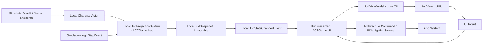
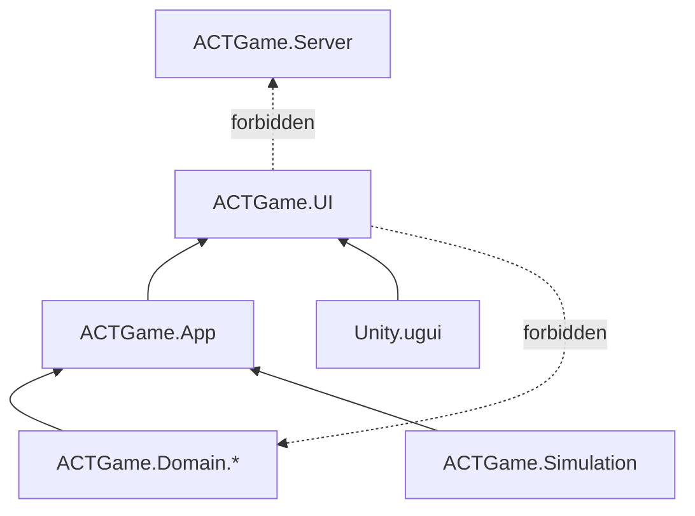

# ACTGame UI 框架搭建方案 — UGUI + MVVM-lite 学习主线

> 制定：2026-09-19  
> 角色：**运行时 UI 的结构与手写实施真源（先文档，后实现）**  
> 实施约束：本方案只定义边界、顺序与验收；业务代码由项目作者手写  
> 相关：  
> - [架构文档](../../.agents/skills/actgame-architecture/ARCHITECTURE.md)  
> - [架构约定](../../.agents/skills/actgame-architecture/CONVENTIONS.md)  
> - [相机与 UI 展示舱方案](../2026.8.26/CAMERA_SYSTEM_PLAN.md)  
> - [项目总清单](../PROJECT_CHECKLIST.md)  
> - 数据链：`Simulation / Owner Snapshot → App 只读投影 → ViewModel → UGUI View`

---

## 0. 一句话

以 **UGUI + 显式 Presenter + 纯 C# ViewModel + App 层只读投影** 搭建客户端 UI，先完成“生命值 HUD”最小闭环，再扩展页面栈、弹窗和 3D 展示舱；禁止 View 直接读取或写入 `CharacterActor` / `NumericSystem`，禁止 UI 另建玩法状态，禁止 UGUI 与 Runtime UI Toolkit 双轨。

---

## 1. 问题与动机

### 1.1 现状基线

```text
SimulationHost.StepOnce
  → SimulationLogicStepEvent
  → LocalPlayerService.Local.Actor
       ├─ CharacterVitality（Health / MaxHealth）
       └─ PlayerPartyRuntime（ActiveSlot / AssistPoints）

Owner Snapshot
  → ActOwnerReplicationAdapter.ApplySnapshot
  → CharacterVitality.ApplyAuthorityHealthMilli
```

| 点 | 现状与结论 |
|----|------------|
| 正式 UI | 尚未实现，只有开发期 Debug HUD；可以从单一入口开始，不需要兼容旧 UI 框架 |
| 渲染技术 | 工程已安装 `com.unity.ugui 1.0.0`；首版采用 UGUI，适合 HUD、菜单、World Space 血条和后续 RenderTexture 展示舱 |
| 架构入口 | `ACTGameArchitecture` 已提供强类型 System / Query / Command / Event；UI 应复用，不新增 static event bus 或 Service Locator |
| 本机数据 | `LocalPlayerService` 已统一提供 Local Player；`PlayerController.Actor` 是 HUD 只读入口，Owner 快照也会回写该 Actor 的 Vitality |
| 固定帧通知 | `SimulationLogicStepEvent` 在整帧 Combat/PostCombat 完成后发布；适合 App 投影采样，不需要 View 每渲染帧轮询 Domain |
| 阵容切换 | `PlayerPartyRuntime.ActiveActorChanged` 已覆盖预测切人、权威纠正、死亡换人与队灭；App 投影需把它收口成 UI 快照，而不是让每个 View 自己换绑 Actor |
| Dedicated | `ACTGame.Server` 不得依赖 HUD/Input/Camera；运行时 UI 必须是仅客户端引用的叶子程序集 |
| 3D 展示 | C5 已约定独立 Booth + Camera + RenderTexture；它是后续页面内容，不应进入基础导航或战斗 Camera Director |

### 1.2 核心痛点

1. 如果 HUD 直接在 `Update` 中抓 `PlayerController.CurrentHealth`，生命周期、换人、断线和测试都会散落在 View 中。  
2. 如果 ViewModel 直接持有 `CharacterActor`，所谓 MVVM 只剩目录命名，表现层仍与 Domain 强耦合。  
3. 如果先写“万能 UIManager”，容易在没有真实页面需求前堆反射、字符串路由、对象池和异步加载。  
4. 离线、Listen 与远端 Client 必须看到同一套 HUD 数据语义，不能分别维护本地血量与网络血量两条 UI 路径。  
5. 联机菜单不能擅自 `Time.timeScale = 0`；UI 输入焦点和玩法暂停是两个不同问题。

### 1.3 目标与不做

| 目标 | 完成定义 |
|------|----------|
| 清晰分层 | View 只操作 UGUI；ViewModel 只保存展示状态；Presenter 只做生命周期和映射；App Projection 只读玩法状态 |
| 单一数据流 | 离线/Listen/Client 都从当前 Local Actor 生成同一 `LocalHudSnapshot`；网络纠正通过现有 Actor 回写自然进入 HUD |
| 可学习 | 每阶段只引入一个新概念，并有纯 C# 测试或 Play 现象作为出口 |
| 可扩展 | 支持 HUD、全屏页、Modal、Toast 四种层级；后续可接角色详情的 3D 展示舱 |
| 可回收 | 页面关闭后无残留订阅；重复开关页面不会重复回调或累积实例 |
| 不做 | 首版不做 Addressables、国际化、复杂动效系统、通用数据绑定反射、UI 对象池、热更 UI、编辑器可视化路由 |

---

## 2. 设计原则

1. **权威状态只在 Gameplay**：UI 展示结果，不计算伤害、不修改 Numeric、不决定换人是否合法。  
2. **单向数据流**：Gameplay → Projection → ViewModel → View；用户操作反向只产生 UI 意图或 Architecture Command。  
3. **View 被动化**：View 不查场景、不拿单例、不发玩法请求；只暴露控件事件并渲染传入状态。  
4. **显式绑定优先**：首版使用 C# event 和明确的 `Bind/Unbind`，不引入反射式自动绑定。  
5. **值快照越层**：跨 App/UI 边界传不可变 `LocalHudSnapshot`，不传 `CharacterActor`、`NumericSystem` 或可写集合。  
6. **变化才通知**：Projection 可在逻辑帧采样，但只有快照发生变化才发布 `LocalHudStateChangedEvent`。  
7. **导航与业务正交**：路由只决定显示哪一页和层级，不根据角色、关卡或联网身份写 `if`。  
8. **客户端叶子程序集**：`ACTGame.UI` 可引用 `ACTGame.App`；App、Domain、Simulation、Server 均不得反向引用 UI。  
9. **一种运行时技术**：本阶段统一 UGUI；UI Toolkit 继续只用于现有 EditorWindow，不抽象一套兼容两者的控件层。  
10. **零长期兼容**：正式 HUD 达到 Debug HUD 的必要观察能力后删除重复的旧显示路径，不长期双显。

---

## 3. 目标架构



### 3.1 四层职责

| 层 | 推荐类型 | 职责 | 不负责 |
|----|----------|------|--------|
| App Projection | `LocalHudProjectionSystem`, `LocalHudSnapshot`, `LocalHudStateChangedEvent`, `GetLocalHudStateQuery` | 读取 Local Actor/Party，去重并发布稳定 UI 数据 | UGUI、颜色、动画、按钮 |
| ViewModel | `HudViewModel`, `MenuViewModel` | 把快照转换为比例、文本、可见性等展示状态；发 `Changed` | 查 Architecture、持有 Unity 对象、写 Gameplay |
| Presenter | `HudPresenter`, `PauseMenuPresenter` | 建立/解除订阅，把快照灌入 VM，把 View 意图转为命令/导航 | 保存权威业务状态、直接操作具体 Graphic |
| View | `HudView`, `PauseMenuView` | Inspector 引用、按钮事件、渲染文本/Slider/Image/CanvasGroup | 查 Actor、发网络包、计算业务规则 |

`ViewModel` 首版不需要第三方响应式库。每个 ViewModel 一个明确的不可变 `State` 或少量属性，加一个 `Changed` 事件即可。只有第二个页面证明重复模式后，再提取 `ObservableValue<T>`；不要在 U0 先造响应式框架。

### 3.2 UI Root 与显示层级

```text
UiRoot (DontDestroyOnLoad 由 Composition Root 决定，首版可先场景内)
├── HudLayer       // 常驻，无射线遮挡空白区域
├── ScreenLayer    // 全屏页，单栈顶
├── ModalLayer     // 对话框，可压在 Screen/HUD 上
├── ToastLayer     // 提示，不参与返回栈
└── Blocker        // 仅 Modal/加载时启用
```

| 层 | 导航规则 | 输入规则 |
|----|----------|----------|
| HUD | 场景有效期间常驻，不进返回栈 | 默认不拦截玩法输入 |
| Screen | `Push(route)` / `Pop()`，同一时刻只有栈顶交互 | 打开后请求 App 切换本机输入上下文 |
| Modal | `ShowModal(route)` / `CloseModal()` | 必须有 Blocker；Esc/Cancel 先关最上层 Modal |
| Toast | `Show(message, duration)`，不入栈 | 不抢焦点，不暂停玩法 |

路由使用 `UiRouteId` 枚举或强类型值对象，禁止字符串类名和反射创建。首版页面实例由 `UiRootController` 的 Inspector 注册表提供；等确实需要跨场景/异步加载时，再把实例来源替换成 `IUiViewFactory`，导航状态机不改。

### 3.3 HUD 快照契约

首个垂直切片只放真实需要的字段：

```text
LocalHudSnapshot
  HasLocalPlayer
  CurrentHealthMilli
  MaxHealthMilli
  ActiveSlot
  AssistPoints
  MaxAssistPoints
  IsPartyWiped
```

- 数值保持整数 milli，比例只在 ViewModel 计算，避免 UI 引入另一套浮点状态。  
- `HasLocalPlayer=false` 时 ViewModel 隐藏 HUD，不用 0 血猜“未初始化”。  
- 后续能量、喧响、技能冷却各自证明需求后再加字段；不提前塞整个 `NumericDebugSnapshot`。  
- 世界敌人血条应是独立 `WorldHealthBarPresenter` 切片，绑定只读目标句柄；不要复用 Local HUD ViewModel。

### 3.4 输入与暂停契约

```text
View.ButtonClicked
  → Presenter
  → Open/Close Route 或 SendCommand
  → App 决定 Cursor / Gameplay Input 是否启用
```

- UI 只能请求 `UiInputMode.Gameplay | Menu`，不能直接启停 `InputActionAsset`。  
- 联机房间打开菜单只屏蔽本机玩法采样并显示光标，**不得**暂停 `SimulationWorld` 或设置 `Time.timeScale=0`。  
- 将来离线暂停也由 App 的 `PausePolicy` 决定；View 不判断当前是 Client / Listen / Offline。

### 3.5 程序集边界



图中实线方向表示“被上层引用”：`ACTGame.UI` 是客户端叶子，只引用 `ACTGame.App` 与 UGUI。`ACTGame.Server`、Domain 和 Simulation 不添加 UI 引用；Dedicated 场景不装配 `UiRootController`。

---

## 4. 范围声明

| 阶段 | 包含 | 不包含 |
|------|------|--------|
| U0 | 目录、asmdef、快照/VM/导航纯规则 | Canvas、美术、真实 Gameplay 数据 |
| U1 | UI Root、四层 Canvas、路由栈、空白页 | 异步加载、对象池、转场动画 |
| U2 | Local HP + ActiveSlot + AssistPoints HUD 垂直切片 | 敌人世界血条、Boss UI |
| U3 | 菜单输入模式、返回键、Modal/Toast 生命周期 | 联机暂停、设置持久化 |
| U4 | 世界血条或第二个真实页面，用于验证复用 | 大批量血条优化、完整角色养成 |
| U5 | C5 Booth + RenderTexture 接入角色详情页 | 修改战斗 VCam、让展示角色进入 Simulation |

---

## 5. 分阶段交付（任务 / 验收 / 出口）

> 全部代码由项目作者手写。每阶段先写测试/最小契约，再写 Unity 组件；未开始保持 `[ ]`。

### U0 — 纯 C# 骨架与边界

**任务**

- [ ] 新建 `ACTGame.UI` 叶子程序集及 `Runtime/{Core,Navigation,ViewModels,Views,Presenters}` 目录。
- [ ] 定义 `UiLayer`、`UiRouteId`、`UiNavigationState`；只处理 Push/Pop/Modal 纯规则。
- [ ] 定义 `LocalHudSnapshot`、`HudViewModel.State` 与显式 `Changed` 生命周期。
- [ ] 为 UI asmdef、App/Domain/Server 禁止反向引用补结构门禁。

**验收**

- [ ] `UiNavigationStateTests`：Push、Pop、重复打开策略、Modal 优先返回均可判定。
- [ ] `HudViewModelTests`：0/Max、无玩家、队灭、非法 Max 的展示状态明确。
- [ ] 结构测试证明 `ACTGame.Domain.*`、`ACTGame.Simulation`、`ACTGame.Server` 不引用 `ACTGame.UI`。
- [ ] Unity 编译与最窄 EditMode 测试通过。

**出口：** 不依赖场景即可验证导航和 HUD 展示规则，程序集方向锁定。→ **未达成**

### U1 — UI Root 与空白导航闭环

**任务**

- [ ] 手写 `UiRootController`、`UiNavigationService`、`UiViewBase`，实现 HUD/Screen/Modal/Toast 四层。
- [ ] 页面采用 Inspector 明确注册；同一路由实例策略固定为“单实例、关闭隐藏”，首版不做池化。
- [ ] 实现 `Open → Enter → Exit → Close` 生命周期；Presenter 在 Enter/Exit 对称 Bind/Unbind。
- [ ] 在 Editor 人工创建 `UIRoot` Prefab/Scene 装配、EventSystem、CanvasScaler 与四层节点。

**验收**

- [ ] Play：按钮打开空白测试页，返回键关闭；Modal 打开时先关 Modal，再退 Screen。
- [ ] 连续开关 20 次，层级中实例数不增长，按钮和事件每次只响应一次。
- [ ] `UiNavigationServiceTests` 覆盖非法路由、空栈 Pop、重复 Push 策略。
- [ ] Dedicated 场景/程序集不出现 `UiRootController` 依赖。

**出口：** 一个空白页面可稳定打开、返回和释放订阅，尚不接玩法数据。→ **未达成**

### U2 — Local HUD 最小垂直切片

**任务**

- [ ] 在 `ACTGame.App` 手写 `LocalHudProjectionSystem`：订阅 `SimulationLogicStepEvent`，从 `LocalPlayerService.Local.Actor/Party` 生成快照。
- [ ] 只有快照变化时发送 `LocalHudStateChangedEvent`，并提供 `GetLocalHudStateQuery` 供 Presenter 首次同步。
- [ ] 手写 `HudPresenter → HudViewModel → HudView`；完成 HP 数值/比例、ActiveSlot、AssistPoints 与无玩家隐藏。
- [ ] 换人和 Owner 权威生命覆盖继续走现有 Actor 单轨；禁止为 Client 单独读取 `LocalClientRuntime.SelfHealthMilli` 建第二条 HUD 数据源。

**验收**

- [ ] `LocalHudProjectionSystemTests`：相同快照不重复发事件；伤害、换人、队灭各只产生正确变化。
- [ ] Play：本机受伤后血条变化；换人后 HUD 同帧换绑；死亡自动换人后显示新 Active；队灭隐藏或进入明确终态。
- [ ] Listen/Client：Owner 快照覆盖 Actor 后，HUD 最终与权威 HP 一致，无第二套网络 HUD 分支。
- [ ] Profiler：静止 HUD 每帧无字符串重建与可见 GC Alloc；逻辑帧采样不导致 Canvas 每帧 rebuild。

**出口：** 第一块正式 HUD 通过统一 App 投影同时服务本地与联网路径。→ **未达成**

### U3 — 输入模式、菜单、Modal 与 Toast

**任务**

- [ ] 定义 `UiInputMode` 与 App 命令/系统，由 App 统一切本机 Gameplay/UI 输入和 Cursor。
- [ ] 手写简单 Pause/Menu 页面；打开 Screen 时申请 Menu 模式，最后一个阻塞页关闭时恢复 Gameplay。
- [ ] 完成 Modal Blocker、确认/取消结果回传和 Toast 队列；结果对象不携带 Domain 可写引用。
- [ ] 明确异常/销毁收尾：页面被禁用、场景卸载时恢复输入模式并解除全部订阅。

**验收**

- [ ] Play：菜单打开时角色不再接收本机移动/攻击，关闭后恢复；UI 按钮和返回键正常。
- [ ] Listen/Client：菜单打开期间服务器与其他角色继续运行，`Time.timeScale` 保持 1。
- [ ] Modal 连续打开/关闭无穿透点击；Toast 不抢焦点、不进入返回栈。
- [ ] 输入模式测试覆盖嵌套 Modal、场景卸载和重复 Close。

**出口：** 导航、焦点和玩法输入有明确所有者，联机菜单不冒充暂停。→ **未达成**

### U4 — 第二切片验证框架复用

**任务**

- [ ] 在“世界敌人血条”与“设置/角色信息页”中选择一个真实需求作为第二切片；推荐先做世界血条。
- [ ] 世界血条使用目标只读快照 + Presenter，View 只做屏幕坐标与可见性表现；不从 Slider 反写 Health。
- [ ] 仅当两个 Presenter 已出现相同订阅样板时提取小型 `SubscriptionBag`；不得先造通用 Binder DSL。
- [ ] 正式 HUD 达到必要观察能力后，删除被替代的 Debug HUD 重复字段/入口。

**验收**

- [ ] 第二切片没有复制 `UiRoot`、路由栈或输入切换逻辑。
- [ ] 目标 Spawn/Despawn、死亡与场景退出后不保留悬空 Presenter。
- [ ] `rg` 确认 View/ViewModel 不引用 `CharacterActor`、`NumericSystem`、`ACTGameArchitecture.Interface`。
- [ ] 被替代 Debug HUD 路径已删除，不保留长期双显。

**出口：** 第二个真实功能证明框架能复用，同时没有演变为万能管理器。→ **未达成**

### U5 — 角色详情 3D 展示舱

**任务**

- [ ] 依照 Camera C5 实现 `UiShowcaseProfile`、`UiShowcaseService`、`UiShowcaseBooth` 与独立 Camera/RenderTexture。
- [ ] 角色详情 Presenter 只向 Showcase Service 提交 Profile/CharacterId；View 只显示 RawImage 与 2D 信息。
- [ ] 展示角色为视觉副本，不注册 `SimulationWorld`、`TargetSystem` 或 `CombatActorSystem`。
- [ ] 页面关闭时释放/回池 Booth 与 RenderTexture 引用，恢复 UI 输入状态。

**验收**

- [ ] Play：详情页同时显示 3D 角色与 2D UI；关闭后战斗相机 Follow、InputFrame、Motor 均不变化。
- [ ] 两份 Profile 可切换不同背景/机位，导航代码无按页面名分支。
- [ ] `rg "UiShowcase"` 不出现在 `CharacterMotor`、`InputFrame` 或 Server 程序集。
- [ ] RenderTexture 生命周期无残留，重复进出详情页实例数稳定。

**出口：** 3D 展示作为普通页面内容接入，和战斗相机/模拟完全隔离。→ **未达成**

---

## 6. 迁移与兼容

### 6.1 保留 / 迁入

- 保留 `ACTGameArchitecture` 的 Query / Command / Event，UI 不另建全局总线。  
- 保留 `LocalPlayerService` 作为本机玩家唯一发现入口。  
- 保留 `SimulationLogicStepEvent` 作为投影采样时机；UI 自己不复制固定帧时钟。  
- 保留 `CharacterVitality` / `PlayerPartyRuntime` 作为真实状态，投影只读并复制成值快照。  
- 保留 Debug HUD 直到 U2 的正式 HUD 能覆盖必要观察项。

### 6.2 明确删除 / 禁止保留

| 删除或禁止 | 原因 |
|------------|------|
| 正式 HUD 与 Debug HUD 长期双显 | 两套展示真源会漂移；U4 达标后删旧入口 |
| View 中的 `FindObjectOfType` / Tag 查找 | 破坏 Composition Root 与可测试生命周期 |
| View/ViewModel 持有 `CharacterActor` / `NumericSystem` | 穿透 App 边界，使联网和换人逻辑散落 |
| `UIManager.Instance` + static event | 与现有 Architecture 重复，且订阅难回收 |
| 字符串路由 + 反射创建页面 | 重构不安全，错误只能在运行时发现 |
| UGUI/UI Toolkit 双 Runtime 实现 | 学习和维护成本翻倍，没有当前需求 |
| Client 专用 `SelfHealthMilli` HUD 分支 | Owner Snapshot 已回写 Actor；双轨会产生显示竞态 |

---

## 7. 目录与文件预期（增量）

```text
Assets/Scripts/App/
├── Events/UI/
│   └── LocalHudStateChangedEvent.cs
├── Queries/UI/
│   └── GetLocalHudStateQuery.cs
└── Systems/UI/
    ├── LocalHudProjectionSystem.cs
    └── LocalHudSnapshot.cs

Assets/Scripts/UI/
├── ACTGame.UI.asmdef
└── Runtime/
    ├── Core/             # UiRootController / UiViewBase / lifecycle
    ├── Navigation/       # UiRouteId / UiLayer / UiNavigationService
    ├── ViewModels/       # HudViewModel / MenuViewModel
    ├── Presenters/       # HudPresenter / MenuPresenter
    ├── Views/            # UGUI references only
    └── Showcase/         # U5，接 Camera C5

Assets/Tests/Editor/UI/
├── UiNavigationStateTests.cs
├── HudViewModelTests.cs
├── LocalHudProjectionSystemTests.cs
└── UiAssemblyBoundaryTests.cs

docs/2026.9.19/UI_FRAMEWORK_PLAN.md
```

具体类名可在手写时微调，但 `App Projection → ViewModel → View` 的依赖方向不变。Prefab、Canvas、字体、Sprite、RenderTexture 与 ScriptableObject 由作者在 Unity Editor 中人工创建和绑定。

---

## 8. 风险与对策

| 风险 | 对策 |
|------|------|
| 每逻辑帧发送 UI 事件导致重建 | `LocalHudSnapshot` 值比较，变化才发；ViewModel 再做字段级变化判断 |
| 事件重复订阅 | Presenter 的 Enter/Exit 对称 Bind/Unbind；重复进入测试计数 |
| Architecture 全局实例在关闭 Domain Reload 时残留 | 页面 OnDisable 强制解绑；后续为 Architecture 增加明确 Reset/Deinitialize 测试入口，不靠析构 |
| Canvas rebuild/布局 GC | 静态 HUD 分 Canvas；只改变化控件；避免每帧 LayoutGroup/字符串拼接 |
| 菜单误停联机世界 | View 只请求 `UiInputMode`；联网策略固定不改 `Time.timeScale` |
| “MVVM”层数过多 | 首个 HUD 只保留 Projection、Presenter、ViewModel、View 四个明确职责；没有复用证据不抽基类 |
| UI 路由膨胀成业务中心 | 路由只管层级和生命周期；购买、换装、领奖等行为仍走 App Command/System |
| World Space 血条数量增长 | U4 先做正确生命周期；出现测量证据后再做池化/批处理，不提前优化 |
| 3D 展示污染战斗 | 独立 Layer/Camera/RT，视觉副本不入 Simulation；按 Camera C5 验收 |

---

## 9. Editor 人工步骤

1. U1 创建 `UIRoot` Prefab：Screen Space Overlay Canvas、CanvasScaler、GraphicRaycaster、HUD/Screen/Modal/Toast 四层与 Blocker。  
2. 场景确保只有一个 EventSystem；输入模块与当前 Input System 配套。  
3. 创建空白测试 Screen 与 Modal Prefab，绑定 `UiRouteId` 注册项。  
4. U2 创建 HUD Prefab，手工绑定 HP Image/Slider、文本、槽位与支援点控件；先用占位图，不修改 Gameplay 资产。  
5. 用 Game View 分辨率预设验收 16:9、16:10、21:9 和至少一个窄屏；检查 Anchor、Safe Area、CanvasScaler。  
6. U3 验收鼠标/键盘与手柄焦点恢复；最后关闭页面后选中对象和玩法输入均恢复。  
7. U5 按 Camera C5 人工创建展示 Layer、Camera、RenderTexture、Booth Prefab 和 Profile 资产；不得改战斗 VCam Follow。

---

## 10. 推荐开工顺序

```text
U0 纯规则与程序集
  → U1 空白页面导航
  → U2 HP HUD 垂直切片
  → U3 输入/菜单/Modal
  → U4 第二真实切片
  → U5 3D 展示舱
```

**最小可感切片：** 先只做 U0 + U1 + U2 的 HP 部分：角色受伤后，`LocalHudProjectionSystem` 发布变化，`HudPresenter` 更新 `HudViewModel`，UGUI 血条变化；换人后同一 HUD 自动显示新 Active Actor。这个切片同时学到程序集边界、事件生命周期、单向数据流、ViewModel 和 Unity 绑定，且不需要先造完整 UIManager。

建议每个阶段的手写节奏固定为：

```text
写失败测试 → 写最小纯 C# 契约 → 让测试通过
→ 写 Unity View/Presenter → Editor 手工绑定
→ Play 验收 → 记录问题 → 再进入下一阶段
```

---

## 11. 变更日志

| 日期 | 说明 |
|------|------|
| 2026-09-19 | 初版：确定 UGUI + MVVM-lite、App 只读投影、客户端叶子程序集与 U0～U5 手写学习路线 |
