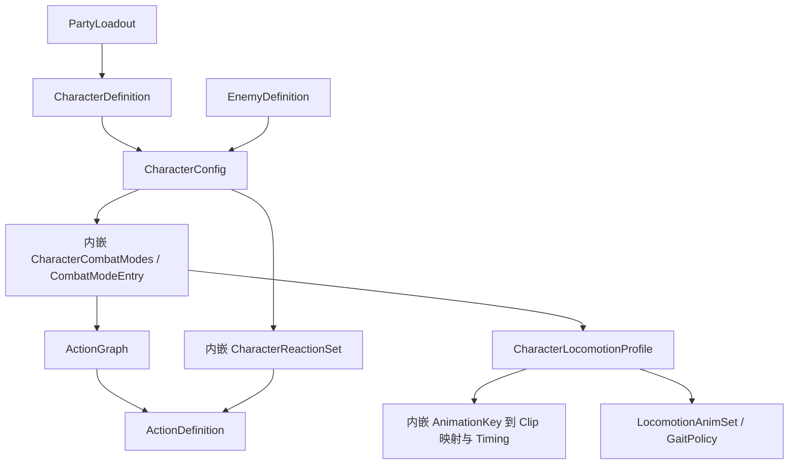

# 角色配置与动作编辑优化方案

> 制定：2026-09-28  
> 状态：方案初版；CA0～CA6 均未实施。  
> 角色：角色配置链路缩减、字段治理与角色级编辑流程的实施真源。  
> 关联：[架构](../../.agents/skills/actgame-architecture/ARCHITECTURE.md)、[约定](../../.agents/skills/actgame-architecture/CONVENTIONS.md)、[路线图](../../.agents/skills/actgame-architecture/ROADMAP.md)。  
> 格式参考：[Locomotion GaitPolicy](../2026.8.9/LOCOMOTION_GAIT_POLICY_PLAN.md)、[GAS 数值重构](../2026.8.7/GAS_STYLE_COMBAT_REFACTOR_PLAN.md)。

## 0. 一句话

将战斗模式数据内嵌到 `CharacterConfig`，将动画映射合入 `CharacterLocomotionProfile`，通过角色上下文统一创建、动作编辑、校验与烘焙；删除确认无消费者的预留字段，隐藏生成数据和不适用字段，禁止保留旧配置运行时读取路径或创建第二份配置真源。

## 1. 问题与动机

### 1.1 代码基线

以下为当前实现；本文目标结构尚未实现。行号为制定时定位，后续以符号为准。

| 当前事实 | 代码依据 |
|---|---|
| 阵容持有角色身份，身份引用身体配置 | `Assets/Scripts/Domain/Character/Party/PartyLoadout.cs:11`；`Party/CharacterDefinition.cs:7` |
| 身体引用独立模式资产，模式再引用 Graph 和 Locomotion | `Assets/Scripts/Domain/Character/CharacterConfig.cs:19`；`Combat/CombatModeProfile.cs:8` |
| Locomotion 又引用独立动画映射；AnimSet 将步态和方向映射到 Key | `Assets/Scripts/Domain/Character/Locomotion/CharacterLocomotionProfile.cs:22`；`LocomotionAnimSet.cs:7` |
| 动画映射资产主要保存 entries 和 defaultCrossFadeDuration | `Assets/Scripts/Domain/Character/Animation/CharacterAnimationProfile.cs:16` |
| elementTag/factionTag/specialtyTag 明确为预留；本次源码和测试搜索没有消费者 | `Assets/Scripts/Domain/Character/Party/CharacterDefinition.cs:10` |
| 动作创建只初始化 Clip、动画段与总帧数，不负责角色和 Graph 装配 | `Assets/Scripts/Editor/Combat/ActionEditor/ActionDefinitionCreateUtility.cs:132` |
| 时间轴支持同类型批量修改和跨动作复制；基础面板未绘制 resourceSpec | `Assets/Scripts/Editor/Combat/ActionEditor/Inspectors/ActionNotifySelectionDrawer.cs:35`、`:177` |
| Graph 有顺序组合并；完整图校验在 Editor，模式校验仅检查节点和动作引用 | `Assets/Scripts/Editor/Combat/ActionGraph/ActionGraphEditorWindow.cs:65`；`ActionGraphInspector.cs:305`；`Assets/Scripts/Domain/Character/Combat/CombatModeProfile.cs:126` |
| Timing、移动根位移、动作位移已有烘焙入口 | `Assets/Scripts/Editor/Locomotion/CharacterLocomotionProfileEditor.cs:8`；`Assets/Scripts/Editor/Combat/Motion/FolderMotionBakeWindow.cs:72` |
| 内容启动时统一构建并冻结，复制目录需要遍历角色模式 | `Assets/Scripts/App/Networking/Content/GameContentBootstrap.cs:12`；`Assets/Scripts/Domain/Character/Replication/ActionReplicationCatalog.cs:46` |

当前基础链：`CharacterDefinition → CharacterConfig → CombatModeProfile → ActionGraph / CharacterLocomotionProfile → CharacterAnimationProfile`。独立新建一个单模式角色涉及六类基础配置资产，不计 Action、PartyLoadout、模型与可选 Resolver。

当前 `Assets/Data` 中检查到的五份模式配置均只有 Default 条目，但 `CharacterActionGameplayStep.TrySwitchCombatMode` 已实现模式切换。不能因为当前内容单模式就删除多模式执行能力。

### 1.2 痛点与完成目标

| 项目 | 目标 |
|---|---|
| 资产数量 | 六类基础配置减为四类：CharacterDefinition、CharacterConfig、CharacterLocomotionProfile、ActionGraph |
| 引用操作 | 不再人工新建、绑定 CombatModeProfile 和 CharacterAnimationProfile |
| 字段负担 | 每个被审计字段标明用途、消费者、适用条件、默认策略和编辑级别 |
| 动作创建 | 当前角色/模式内完成创建、加入图、编辑时间轴与资源；无须重新选择角色目录 |
| 校验 | 同一规则供角色工作台、单资产 Inspector、项目审计和启动校验使用；错误能定位 |
| 行为保持 | 移动、连招、闪避、受击、换人、资源与网络播放保持既有语义 |
| 不做 | 重写 ActionSim/数值系统、合并 Graph 与 Action、改变输入协议、增加运行时模板继承、自动猜定攻击判定帧 |

## 2. 设计原则

1. 身份与身体继续分离：`CharacterDefinition` 用于阵容；`EnemyDefinition` 继续组合身体和 AI。下层不反向引用 Party/App。
2. 模式差异仍由条目和 Policy 表达；禁止用玩家/敌人身份 if 代替配置结构。
3. `SimulationWorld`、`InputFrame`、60Hz ActionSim 和帧末结算保持权威；Editor Preview 不创建 Update 玩法旁路。
4. 有消费者不等于应手填；只出现在序列化、指纹或 Inspector 中也不等于存在玩法用途。字段审计必须追到最终消费者。
5. 零兼容终态：迁移按导出、切换、导入执行，运行时始终只有一条读取路径。不新增 Legacy/Old/V1、兼容 wrapper 或双写字段。
6. 本轮只写方案。实施时 Agent 不直接修改 `Assets/Data/**`、Prefab、Scene、导入资源及其 `.meta`；具体资产清单须由用户在 Editor 执行，或另行明确授权。删除允许删除的 Unity 源文件时同步处理其 `.meta`。
7. 保留用户已有修改；不自动提交、切分支、重置或清理工作目录。

## 3. 目标架构与契约

### 3.1 配置结构（拟议）



`CharacterCombatModes` 为拟新增 `[Serializable]` 值配置，保留 DefaultMode、Entries、TryGetActionGraph、TryGetLocomotionProfile 的职责，但不是 SO，也不包装旧 Profile。`CombatModeEntry` 保持 Graph + Locomotion 引用。单模式界面默认只展示一个模式，多模式在同一数组上展开编辑。

`CharacterLocomotionProfile` 接收动画 entries 与 defaultCrossFadeDuration，并拥有 GetClip/TryGetClip 查询和映射校验。保留现有 `AnimationKey` 编号、AnimSet 选片语义及网络播放语义；本轮不改成运行时直接按槽位传 Clip。

`CharacterAnimationService`、本地/远端播放、Headless 查询、Locomotion Baker 均改读同一 Locomotion 内容。编辑器表格可以联合展示槽位、Key、Clip、Timing；改 Clip 应修改唯一映射记录，多个槽共享 Key 时提示影响范围，禁止额外保存第二套槽位 Clip。

### 3.2 编辑与校验边界

| 模块 | 输入与输出 | 边界 |
|---|---|---|
| CharacterAuthoringWindow（拟新增） | CharacterDefinition 或 EnemyDefinition → 当前 Config、模式、关联内容与问题清单 | 只编辑现有资产；不保存配置副本，不做场景自动扫描绑定 |
| 角色创建服务（拟新增） | 模板、身份、模型、目录、复制/共享清单 → 新资产集合及引用映射 | Editor-only；规划与执行分离，失败清理仅限本次新建内容 |
| 动作创建入口 | 当前角色、模式、用途、Clip → Action + Graph 节点或 Reaction 绑定 | 输入意图仍在 Graph；受击动作不强制进入 Graph |
| ActionGraphValidator（拟新增） | Graph → 结构化问题集合 | 放 Domain/Combat，无 UnityEditor；提取现行规则并审计其适用条件 |
| 角色内容校验聚合 | 身份、Config、模式、动作和移动 → 去重的问题集合 | Character 聚合下层校验；App 负责场景/目录完整性，Editor 负责定位与跳转 |

问题至少携带 `Code / Severity / Asset / PropertyPath / NodeId或条目索引 / Message`。Editor 定位能力不反向进入 Domain；Runtime 使用同一问题结果决定是否允许 Catalog Freeze。Draft 可保存，未满足运行条件不能标为 Ready，也不削弱启动门禁。

### 3.3 字段处理定案

| 类别 | 本次已确认的例子 | 处理 |
|---|---|---|
| 无消费者预留 | CharacterDefinition.elementTag/factionTag/specialtyTag | CA0 再查源码、测试、序列化字符串和资产值；导出留档后删除字段及 getter |
| 固定系统约束 | ActionDefinition.sampleRate | 新内容固定 ActionSim.LogicHz；迁移确认全为 60 后删除序列化字段，SampleRate 契约返回逻辑频率；非 60 输入拒绝迁移，不静默转换窗口 |
| 派生结果 | ActionDefinition.totalFrames | 保留派生缓存及重算，不允许普通表单手填；检查已有内容一致性 |
| 烘焙产物 | ActionBakedMotion、移动 RootMotion 采样表、Timing.durationFrames | 保留数据；通过烘焙生成，默认只展示摘要、来源和有效状态 |
| 可调时序 | Timing.exitFrame/handoffFrame、落脚点 | 保留作者输入；重烘焙需展示差异，不静默覆盖已调节值 |
| 条件字段 | switchCombatModeTarget/policy、RootMotion 参数、可选表现字段 | 仅在对应能力适用时显示；隐藏不等于清空数据 |
| 高级字段 | 时间轴 priority、精细转向/滞回参数 | 有有效默认值，默认折叠，仍允许调整 |
| 核心字段 | 模型、Clip、Hitbox、伤害、资源、Cancel/Phase | 保留，按使用任务分组；Action Editor 补齐 resourceSpec |
| 覆盖值 | EnemyDefinition 的 MaxHp/TeamId 与身体默认值 | 暂不重构归属；敌人上下文显示最终来源，避免修改未生效字段 |

不得误删：ActionType 参与 Dodge 退出与输入上下文；InterruptPriority 参与 ActionSim.TryInterrupt；时间轴 priority 参与窗口选择和事件顺序。依据：`ActionState.cs:36`、`ActionSim.cs:173`、`ActionTimeline.cs:112`。

CA0 必须覆盖 CharacterDefinition、CharacterConfig 的嵌套数据、模式、Locomotion/AnimSet/GaitPolicy/Timing、ActionDefinition、Graph 节点/边及所有 Timeline 子类型。未追完读取链的字段标“待确认”，不得据此删除。字段清单作为本方案附属审计产物，不把本表误作穷尽结论。

## 4. 分阶段交付

### CA0 — 完整字段台账与迁移基线

**任务**

- [ ] 生成 `CHARACTER_AUTHORING_FIELD_AUDIT.md`：字段路径、最终消费者、角色/能力适用条件、数据来源、去留、证据。
- [ ] 只读扫描全部相关资产与被引用资源（不限当前阵容），记录 GUID、子资源 fileID、共享关系、非默认字段及缺失引用。
- [ ] 导出角色模式、Key/Clip、Timing、根位移、Graph/Reaction 动作集合的规范化语义快照；记录网络内容标识及 Fingerprint 基线。
- [ ] 校对现有测试路径与程序集，记录基线已有失败；不把已有失败误归本方案，也不扩大为无关修复。
- [ ] 为创建一个角色、追加一个普攻记录手工创建/绑定次数，后续按相同任务对比。

**验收**

- [ ] 字段清单覆盖 §3.3 范围，删除候选均有“无消费者”证据；反射/字符串访问纳入检查。
- [ ] 共享 Profile 被所有引用方覆盖；无法解析的引用阻断迁移计划输出。
- [ ] 导出快照重复生成一致，未产生资产写入。

**出口：** 能明确解释删什么、迁什么、共享什么及如何证明行为未变。→ **未达成**

### CA1 — 两层配置合并与一次性迁移

**任务**

- [ ] 依赖 CA0；按 §5 先导出旧结构，完成 dry-run 后再切换代码。
- [ ] 新增内嵌 CharacterCombatModes，将 CombatModeEntry 从旧文件迁到独立源文件；Config 持有唯一模式数据。
- [ ] Locomotion 接收动画映射、默认 CrossFade 与查询；更新 CharacterAnimationService、ActorFactory、CombatModeService、远端播放、ActionReplicationCatalog、Bake/Audit 和测试。
- [ ] 导入到原 CharacterConfig/Locomotion 资产，保留它们的 GUID；共享模式按引用方复制值，共享动画映射按 Locomotion 复制值，Clip 引用保留。
- [ ] 删除 CombatModeProfile、CharacterAnimationProfile 类型、旧 CreateAssetMenu、旧引用字段及旧读取 API；清除所有已迁移旧 SO 与对应 meta，由用户执行资产清理。
- [ ] 更新内容收集、校验与指纹读取；不保留运行时 fallback 或旧新字段双写。

**验收**

- [ ] 迁移前后规范化模式、Clip、Timing、Graph/Reaction 动作集合一致；共享拆值后修改一方不会意外改另一方。
- [ ] 新建单模式角色只需四类基础配置，模式与动画映射不再需要独立 SO。
- [ ] `rg` 检查生产源码不再引用两个旧类型；历史文档不要求抹除，迁移报告可记录旧名称。
- [ ] Unity 编译通过；LocomotionIntegerClockTests、GameContentCatalogTests、GameContentBootstrapBoundaryTests、ActionReplicationCatalogTests 通过。
- [ ] 本地移动、起停、转身与远端播放对照基线；多模式行为由构造内容测试覆盖，即使现有资产只有 Default。

**出口：** 代码与资产共同切到唯一新结构，旧类型和旧资产均清零。→ **未达成**

### CA2 — 字段精简与移动表单收敛

**任务**

- [ ] 依赖 CA1；依据字段台账删除三个预留标签，处理非空值导出，拒绝无证据批量删字段。
- [ ] 移除逐动作 sampleRate 作者字段；更新创建器、时间轴、校验和测试，保持 SampleRate 读取契约。
- [ ] 移动表单统一展示动画槽、映射与 Timing；保留多槽共享 Key 语义；生成数据只读、高级参数折叠。
- [ ] 条件字段按能力显示，敌人 HP/Team 展示有效来源；切换界面条件不擦除保存的数据。
- [ ] Timing 重烘焙区分推导值和作者时序，越界项报错并定位，不静默重置交接帧。

**验收**

- [ ] 非 60Hz 旧内容被明确拒绝，60Hz 内容迁移后总帧数和窗口边界不变。
- [ ] 更换 Clip 后生成数据标记过期；手调 exit/handoff 不被无提示覆盖。
- [ ] 已删除字段在生产声明和消费者中均无残留；常规界面不暴露采样数组或自由采样率。
- [ ] 动作打断优先级、事件排序和 Dodge 特殊恢复回归通过。

**出口：** 每个可见字段都具有明确用途，派生数据与作者决策分离。→ **未达成**

### CA3 — 校验统一与动作编辑缺口补齐

**任务**

- [ ] 提取 ActionGraphInspector 的规则到 Domain ActionGraphValidator，Inspector 与工作台只渲染结果。
- [ ] 核对“必须有 Normal Cancel”等现行规则的适用范围，避免把终结/受击等动作误按普通连招验证；规则变动需反例测试，不借重构改玩法。
- [ ] 同一 Graph 校验接入角色内容校验、StructureValidationBatch 和 GameContentBootstrap；删除 Editor 独占的重复实现。
- [ ] Action Editor 补齐资源消耗/回填，增加关联 Graph/Reaction 跳转和问题定位；资源字段继续落在 ActionResourceSpec。
- [ ] 问题清单按资产/字段去重；区分错误、警告、未完成，批量操作后重新校验。

**验收**

- [ ] 缺 Entry Intent、悬空边、缺对应 Cancel 窗口分别产生稳定 Code；项目审计与启动得到同一核心规则结果。
- [ ] 从问题项能定位具体节点或字段，而非只打开 Console。
- [ ] 在动作窗口修改消耗后，实际起手资源 Gate 与命中 Grant 符合输入值。
- [ ] 新增 ActionGraphValidatorTests；已有合法资产零新增误报，确有问题的资产列明修复清单。

**出口：** 校验规则只有一份，动作内容日常编辑不再因缺字段返回普通 Inspector。→ **未达成**

### CA4 — 角色上下文与创建流程

**任务**

- [ ] 新增 CharacterAuthoringWindow，总览/移动/招式/连招/反应与支援入口复用现有编辑器；不重写时间轴。
- [ ] 当前角色和模式驱动动作范围、保存目录、预览模型和校验范围；列表基于引用关系，目录用于存储而非角色归属真源。
- [ ] 新建角色从已有配置模板复制；明确独有资产复制和共享资源复用清单，映射 Graph、Directional Resolver、Reaction 等全部内部引用。
- [ ] 从角色上下文创建动作，选择用途后绑定 Graph 节点或 Reaction；只设置基础初值，判定帧仍需作者调整。
- [ ] 新角色 ID 做唯一性检查；默认不修改场景和 PartyLoadout，提供明确的手工接入步骤。
- [ ] 预览使用隔离预览实例并可靠清理；不写回场景模型 Pose。资源创建失败只清理本次新建对象，已有资产不回滚覆盖。

**验收**

- [ ] 复制角色 A 为 B，修改 B 的独有动作不会影响 A；共享 Clip 保持同一引用。
- [ ] 重名、缺引用或目标目录冲突可在执行前发现；失败无半成品引用链。
- [ ] 创建角色无需手工创建/绑定两个已取消的 Profile；新增动作无需重选角色目录或手工拖回对应图。
- [ ] Undo/Redo 对已有配置编辑有效；新增资产提供明确撤销/删除边界，不宣称磁盘删除可由普通 Undo 完整恢复。

**出口：** 用户围绕角色和招式完成任务，不再维护分散的编辑上下文。→ **未达成**

### CA5 — 角色级烘焙与批量编辑

**任务**

- [ ] 复用 ActionMotionBakeService、Timing Baker、移动 RootMotion Baker；汇总当前角色依赖的缺失/Dirty 内容。
- [ ] 烘焙前展示输入匹配和将改写的资产，按依赖去重；共享资产列出影响角色，不能默认全项目 Bake。
- [ ] 模板提供普攻/闪避等创建初值；批量 Clip 导入先展示用途与绑定预览，禁止从文件名猜定玩法关键帧。
- [ ] 挂点从预览模型提供选择和有效性提示，保留运行时既有挂点身份语义。

**验收**

- [ ] 未变化内容不重复烘焙，改变 Clip/裁切后能发现过期产物。
- [ ] 烘焙前后作者交接帧、落脚点不被静默覆盖；失败保持错误可见，不标记 Ready。
- [ ] 切换角色不会沿用不匹配的 RootMotion 文件夹或预览挂点。

**出口：** 烘焙与批量操作围绕当前角色依赖闭包执行。→ **未达成**

### CA6 — 回归、清理与文档同步

**任务**

- [ ] 完成 §8 的自动化与 Play 验收，核对客户端/Listen/Dedicated 的内容一致性。
- [ ] 删除本次一次性迁移工具代码、临时导入入口和旧资产；归档迁移报告供追溯，不保留可执行兼容路径。
- [ ] 更新 ARCHITECTURE/TECHNICAL/CONVENTIONS/ROADMAP，只把实际完成项标完成。
- [ ] 对照 CA0 操作基线记录新建角色、追加招式的步骤减少情况与剩余手工决策。

**验收**

- [ ] 全内容审计通过，源码无被替换类型与重复校验，资产无旧脚本 Missing 引用。
- [ ] 所有必需测试完成并检查结果，人工 Play 逐项有记录；不存在仍运行中的验证任务。
- [ ] 跨进程内容 ID/指纹符合 §5 的约定，未知内容仍拒绝，不以宽松校验掩盖错误。

**出口：** 配置、编辑、迁移和运行闭环全部通过，CA0～CA6 可标记完成。→ **未达成**

## 5. 迁移与删除

### 5.1 无运行时双轨的迁移顺序

1. 在旧类型仍能被 Unity 正常加载时执行只读清点与导出；导出 DTO 包含值、GUID/fileID、版本、校验和及源文件摘要，保存到用户选定的迁移目录。
2. 用户保留源资产及 `.meta` 的可恢复备份。dry-run 验证每个目标、共享引用和源摘要，任何歧义先解决。
3. 切换新代码，旧类型与旧字段移除；此时旧资产会暂时无法完整装配，禁止 Play/出包，不能把此状态作为可运行阶段出口。
4. 新结构导入器只读导出 DTO，不依赖已删除旧类；写入原 Config/Locomotion，更新引用并验证完整快照。源文件在导出后变化则拒绝导入，禁止覆盖用户新编辑。
5. 用户按明确清单删除已无引用的旧 Profile 资产及 meta；删除前验证整个项目引用闭包，不只当前场景。保留其它资产 GUID/fileID。
6. 编译、审计、语义对照及 Play 成功后删除一次性工具；失败由用户恢复配套代码和资产备份，不自动 git reset。

导出器和导入器属于两个代码状态，不能要求删除类之后再用 SerializedObject 读取旧类型。工具准备可独立验证；结构切换、资产导入、旧资产清理属于 CA1 同一个交付单元。

### 5.2 迁移删除表

| 旧内容 | 迁入/保留 | 删除出口 |
|---|---|---|
| CombatModeProfile.defaultMode/entries | CharacterConfig 内嵌 CharacterCombatModes | CA1 删除类型、菜单、引用、资产及 meta |
| CharacterAnimationProfile.entries/defaultCrossFadeDuration | CharacterLocomotionProfile | CA1 删除类型、菜单、引用、资产及 meta |
| 共享旧 Profile | 给每个新所有者复制相同值，Clip/Graph/Locomotion 外部引用依契约保留 | 不保留同步回旧资产逻辑；记录共享语义变化 |
| 三个身份预留标签 | 非空原值进入迁移报告，不进新运行时配置 | CA2 删除字段/getter |
| Action.sampleRate 作者值 | 全部校验为 60 后，读取逻辑频率常量 | CA2 删除序列化字段及自由编辑 |
| Graph Editor 独有校验 | Domain 共用规则与结构化结果 | CA3 删除重复算法 |
| 一次性迁移工具 | 报告可归档 | CA6 删除可执行迁移代码 |

身份、Action、Graph 节点、AnimationKey 的稳定标识不重新编号。Fingerprint 不承诺原字节相同：CA0 查清现行算法，若存储结构影响哈希，明确升级内容版本并要求同版客户端/服务器；语义快照一致与同版双端指纹一致都必须验证，禁止绕过 Join 内容校验。

## 6. 预期代码影响

| 范围 | 改动 |
|---|---|
| Domain/Character/CharacterConfig、Combat、Animation、Locomotion | 新内嵌模式、动画映射合并与所有消费者迁移 |
| Domain/Character/Replication/ActionReplicationCatalog.cs | 按新模式结构收集动作 |
| Domain/Combat/Actions/Definitions 与 Resolution | 固定采样率、共用图校验；保持 Graph/Action 边界 |
| App/Composition、App/Presentation、App/Networking/Content | 本地/Headless/远端装配及内容指纹读取同步 |
| Editor/Character（拟新增） | 工作台、创建服务、阶段内迁移工具 |
| Editor/Combat 与 Editor/Locomotion | 复用现有窗口，接入角色上下文、字段分组、统一校验与 Bake |
| Assets/Tests/Editor/Character（拟新增） | 配置迁移、复制引用、创建失败和字段编辑测试 |
| Assets/Tests/EditMode/Combat | Domain Graph 校验测试，遵守现有 asmdef 引用方向 |

测试所在程序集按 CA0 实际发现的布局确定；不能为测试便利让 Domain 引用 Editor 或 App。

## 7. 风险与对策

| 风险 | 对策 |
|---|---|
| 删除旧类后资产值无法读取 | 必须先导出，导入器不依赖旧类型；切换前验证 DTO 完整性 |
| 共享 Profile 拆值后行为或修改范围变化 | 迁移时复制等价值并列出所有者；明确后续各自独立，不建立同步 wrapper |
| 多槽共用 AnimationKey，修改动画影响多个槽 | 唯一映射记录，修改前显示受影响槽，不自动新增/重编号 Key |
| 重烘焙覆盖手调时序 | 推导字段与作者字段分离，差异预览和越界错误 |
| 复制角色漏改 Resolver/Reaction 引用 | 引用闭包映射、未映射引用阻断，修改 B 不影响 A 的行为测试 |
| 统一校验把现有合法内容判错 | 先建立合法/非法样例，再提取规则；不把普通连招要求强加给所有动作 |
| 编辑器缓存显示旧 Clip | 修改映射后统一失效缓存，测试同一会话修改/Undo/Redo |
| 内容 ID/网络指纹变化 | 规范化语义快照、版本策略及同版双端验证；无兼容绕过 |
| 方案范围过大 | CA1/CA2 先交付结构缩减，CA4/CA5 不作为结构合并的前置条件 |

## 8. 验证与 Unity Editor 人工步骤

### 8.1 自动化

现有重点回归：`LocomotionIntegerClockTests`（包括 Full/Headless 600 帧一致性）、`ActionSimTests`（60Hz/Cancel/打断）、`GameContentCatalogTests`、`GameContentBootstrapBoundaryTests`、`ActionReplicationCatalogTests`、`ServerContentManifestTests`。新增测试名为计划，不代表已存在或已通过。

新增计划：`CharacterConfigMigrationTests`（共享/多模式/缺引用/快照一致）、`CharacterAuthoringCreationTests`（引用重映射/重名/失败清理）、`ActionGraphValidatorTests`（稳定问题 Code/合法终结动作/入口和窗口错误）。自动测试写入临时测试目录并对称清理，不修改生产内容。

仅当确认当前项目未在 Unity Editor 打开时，使用仓库脚本，例如：

```powershell
./tools/codex/Invoke-UnityTests.ps1 -TestPlatform EditMode -TestFilter LocomotionIntegerClockTests
./tools/codex/Invoke-UnityTests.ps1 -TestPlatform EditMode -TestFilter ActionSimTests
./tools/codex/Invoke-UnityTests.ps1 -TestPlatform EditMode -TestFilter GameContentCatalogTests
```

其他测试按同样方式定向执行并检查 XML/日志。不能安全确定 Editor 状态时不启动 batch，改用 `Window > General > Test Runner > EditMode` 按上述类名搜索运行；`ActionSimTests` 位于 `ACTGame.Simulation.EditModeTests`，Editor 测试程序集以 CA0 清点为准。不得用 IDE 诊断代替 Unity 编译。

### 8.2 用户 Editor 操作

1. CA1 前按导出报告核对迁移资产完整路径与共享关系，保存备份，执行旧结构导出与 dry-run。
2. 新代码编译后执行导入，检查角色 Config 的模式、Locomotion 的 Clip/Timing；按清单清理旧资产和 meta。
3. 执行 `ACTGame/Architecture/Validate All Structure And Content`，检查无 Missing Script、缺引用或动作图错误。
4. Test Runner 执行受影响测试类，保存结果；此时仍不把 Play 人工项视为自动通过。
5. 打开现有 `Assets/Scenes/Gameplay.unity`，沿现有 PlayerController → PartyLoadout 接入链测试：待机/走跑/冲刺、起停/转身、普攻连段、闪避及恢复、受击/死亡、换人与招架、资源不足拒绝及命中回填。
6. 现有敌人验证移动/攻击/受击与自己的 HP/Team 来源；按既有 Listen/Dedicated 流程验证加入和远端动画。双端使用同一份迁移后内容。
7. CA4 创建测试角色时，手工选择 PartyLoadout 槽位接入；不由工具自动改场景或替换原角色。模型/Hurtbox/挂点、VFX 与位移视觉效果人工检查。
8. CA5 检查当前角色 Dirty 列表与每项改写目标，确认范围后执行 Bake；保存日志和实际 Play 观察。

## 9. 开工顺序

`CA0 → CA1 → CA2 → CA3 → CA4 → CA5 → CA6`。

最小可感切片：完成 CA0/CA1，使一个已有角色在新结构中运行，消除两份独立 Profile 的创建和绑定，再扩展编辑工作台。CA0 是实施后的第一项工作，不因本文已列初步证据而视为完成。

## 10. 变更日志

| 日期 | 说明 |
|---|---|
| 2026-09-28 | 建立方案；确定两层配置合并、字段分类、离线一次性迁移和 CA0～CA6 验收；仅文档，未修改业务代码或资产。 |


## 2026-09-28 执行记录补充

用户已授权本次范围内资产操作并取消逐阶段人工确认。实际扫描为 4 个 CombatModeProfile、4 个 CharacterAnimationProfile（共 8 个），以 MIGRATION_MANIFEST 为准。58 个资产写入，62 个保留资产进行精确变换校验。源码与核心作者工具已落地；验收栏尚不勾选。详见 EXECUTION_REPORT；GUI 接入因应用授权超时，未启动第二个 Unity，也未声称 Unity/Test Runner 已通过。
