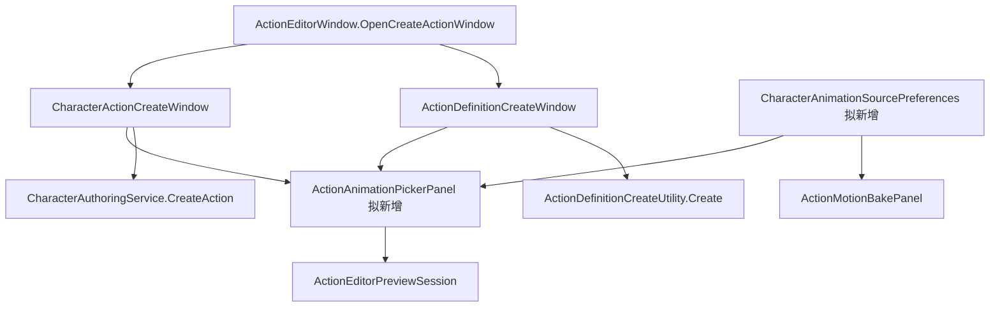

# 动作创建动画选择优化方案

> 制定：2026-09-29  
> 角色：动作编辑器动画来源与选择交互的实施方案。代码已实现，116 项定向 EditMode 通过；真实角色端到端人工验收待完成。见 ACTION_ANIMATION_PICKER_REPORT.md。  
> 相关：[动作编辑器工作区方案](ACTION_EDITOR_CWCMONTAGE_ALIGNMENT_PLAN.md)

## 0. 一句话

通过角色动画来源偏好和共享动画选择面板，让创建动作变成“当前角色 → 搜索、预览动画 → 按用途命名并创建”，禁止两个创建入口各自维护一套筛选逻辑。

## 1. 问题与目标

代码基线：ActionEditorWindow.OpenCreateActionWindow（ActionEditorWindow.cs:370）根据角色上下文打开 CharacterActionCreateWindow 或 ActionDefinitionCreateWindow。前者 OnGUI 的动画字段（CharacterActionCreateWindow.cs:35）、后者 First Animation Clip 字段（ActionDefinitionCreateWindow.cs:58）均为普通 ObjectField，没有角色范围动画浏览器。

ActionMotionBakePanel.Bind/PreferenceKey（ActionMotionBakePanel.cs:19、35）按 CharacterConfig GUID 保存 RM 路径；无角色上下文但唯一归属的动作使用归属角色，多归属或无归属动作使用自身 GUID。路径保存在本机 EditorPrefs。角色可以共用物理目录，不会自动生成 RM 文件夹。

| 目标 | 决策 |
|---|---|
| 缩小候选范围 | 每个角色记住动画来源目录，与 RM 目录分别配置；默认浏览当前角色目录 |
| 快速定位 | 名称搜索、相对路径、长度、60Hz 帧数，支持 FBX 子动画 |
| 选前确认 | 单选动画可用现有角色预览目标试播，不先创建资产 |
| 减少跳转 | 接收 Project 中拖入的 Clip、FBX 或文件夹；单 Clip 直接选中，多 Clip 展示列表 |
| 保持命名规范 | 最终名称仍按角色与用途生成，不把源 Clip 的旧角色前缀写入动作名称 |
| 不做 | 本轮不改运行时资产格式、不自动重烘焙、不猜测战斗窗、不增加批量创建和批量绑定 |

## 2. 原则

- 初次配置动画目录和 RM 目录，后续按角色复用；用目录 GUID 保存新增统一偏好，移动目录仍能定位。
- RM 配对继续使用既有匹配器；显示零匹配或多匹配，不默选第一个结果。动画筛选仅作候选过滤，不据此断言一定是 InPlace。
- 单一选择组件供两个创建入口使用；业务创建继续使用各自现有服务，保留角色图/反应绑定语义。
- Gameplay 权威仍在 SimulationWorld/InputFrame；所有新逻辑位于 Editor 层。
- Agent 不直接改 Assets/Data、Prefab 或美术动画；配置和创建资产由用户在 Editor 操作。

## 3. 目标结构（拟新增部分尚未实现）

契约：输入角色配置（可空）、当前 Clip、预览目标；输出用户明确选中的 Clip，不修改正式动作。缓存候选按目录/资源变化失效，不在每次重绘扫描全库。FBX 子资源使用 GUID + local file ID 标识，同名动画展示路径。无角色上下文时由用户选择来源目录并记忆独立创建偏好，不从保存目录猜美术目录。

预览会话必须与当前动作预览协调：开始浏览暂停当前播放，退出选择恢复原动作/目标并释放临时对象；Play 模式禁用编辑器采样。无模型时仍可选片，提示指定预览模型。

## 4. 分阶段交付

### AP1 — 统一动画来源偏好

**任务**

- [x] 新增 CharacterAnimationSourcePreferences，按项目与角色 GUID 管理动画目录、RM 目录。
- [x] 工作台与烘焙面板改用同一服务，操作时重新读取偏好，避免窗口同时打开时状态滞后。
- [x] 一次性迁移已有 RM 路径偏好为目录 GUID，成功后删除旧键；移除公开 FolderKey 跨窗口依赖。

**验收**

- [ ] A/B 角色分别设置、切换、重开窗口后各自恢复；共享目录可用；目录移动可恢复，删除后显示需重新指定。
- [ ] 已有 RM 设置迁移后相同，独立动作和多归属动作的偏好不串角色。

**出口：** 动画选择与烘焙共享稳定的来源偏好。→ **未达成**

### AP2 — 共享动画浏览与创建

**任务**

- [x] 新增 ActionAnimationPickerPanel，支持目录限定、名称搜索、路径/时长/帧数、FBX 子动画、明确切换全项目搜索。
- [x] 默认展示非 RM 目录候选，提供显示全部开关；与动画目录重叠时提示并保留可见候选。
- [x] 支持 Project 拖放 Clip/FBX/目录；统一两个创建窗口的选择区域，移除重复 ObjectField 选择实现。
- [x] 保留动作用途、类型、绑定设置；创建后定位新动作，空草稿能力遵循原入口契约。

**验收**

- [ ] 同名不同路径/同 FBX 多子片均可准确选择；关键词变化不导致错误引用；搜索清空恢复完整目录候选。
- [ ] 角色入口创建仍绑定正确图或反应；独立入口不隐式绑定；不继承源动画旧角色前缀。
- [ ] 用临时资产测试目录过滤、子资源身份、创建后的 Clip 引用，不修改生产内容。

**出口：** 无需展开 Project 文件夹即可选择并创建动作。→ **未达成**

### AP3 — 选前预览与验收

**任务**

- [x] 复用 ActionEditorPreviewSession 提供选片预览、暂停与拖帧；关闭窗口恢复原预览状态。
- [x] 展示 RM 配对状态，缺失不阻止创建普通动画草稿；不自动触发烘焙。

**验收**

- [ ] 切片/关窗/切角色不遗留采样姿态或临时模型；Play 时不抢运行时 Animator。
- [ ] Unity 编译与定向 EditMode 通过；人工完成“换角色 → 搜索 → 预览 → 创建 → 烘焙”的连贯流程。

**出口：** 选片、创建、烘焙在动作编辑器流程中连贯可用。→ **未达成**

## 5. 迁移与删除

| 对象 | 处理 |
|---|---|
| 既有 RM EditorPrefs 路径键 | 一次性迁入统一服务后删除，不保留长期双读写 |
| CharacterAuthoringWindow.FolderKey | 消费方迁移后删除，偏好责任收回独立服务 |
| 两窗口原动画 ObjectField 选择代码 | 替换为共享选择面板；手动拖片由共享面板承接 |
| ActionDefinition / 动画 / 角色资产 | 无自动迁移、无格式变更 |

## 6. 风险与对策

| 风险 | 对策 |
|---|---|
| FBX 含多个同名片段 | 子资源身份与路径展示，禁止只用名称当主键 |
| 首次不知道动画目录 | 可拖入已知 Clip 定位来源，目录范围由用户确认 |
| 全项目搜索卡顿 | 目录优先、缓存资源列表、资源变更失效，不在 Repaint 扫库 |
| 共用美术目录或名称不符合约定 | 支持共享目录与显示全部，不强制重新组织美术资产 |
| 换机器丢失来源设置 | 本轮明确为本机偏好；团队共享配置另立需求，不塞入运行时 CharacterConfig |

## 7. Editor 人工步骤

1. 每个角色首次设置动画来源与 RM 来源；可指向已有目录，无需移动文件。
2. 新建动作，搜索并预览目标动画，填写用途名称，确认保存位置与绑定后创建。
3. 在位移烘焙页检查配对后手动烘焙；需要运行时烘焙位移的动作确认 BaseMotionMode。
4. Test Runner/EditMode 验收来源偏好与选择面板测试及 ActionEditorViewportTests；Gameplay 场景 Play 检查创建动作接入既有图后的播放。

## 8. 开工顺序

先完成“目录记忆 + 当前角色动画搜索 + 创建定位”这一最小切片，再接入选前预览；均使用同一个选择组件。

## 9. 变更日志

- 2026-09-29：依据现有创建窗口与 RM 偏好实现制定，初版制定；随后完成代码实现，自动验证与人工验收边界见实施报告。
