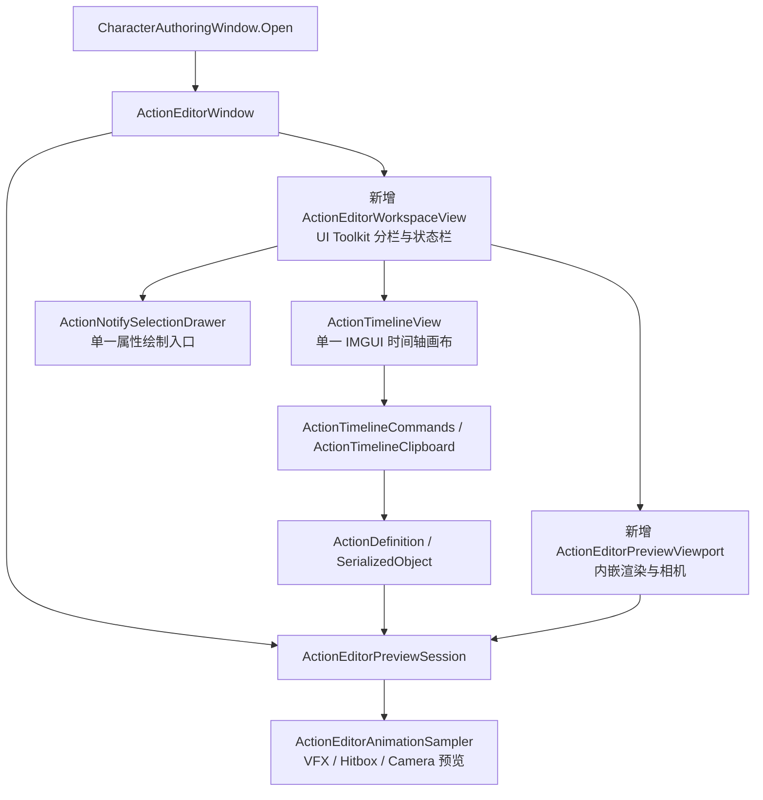

# ActionEditor 借鉴 CwcMontage 的编辑体验优化方案

> 制定：2026-09-29  
> 角色：本轮动作编辑器界面与操作重构的实施真源；状态为**代码已落地，自动回归已执行，完整人工体验验收待核对**。  
> 参考：[CwcMontage](https://github.com/CwcbbChao/CwcMontage)、[编辑器指南](https://github.com/CwcbbChao/CwcMontage/blob/main/docs/guide/editor-guide.md)。参考版本为本次查阅的 main，开工时记录提交 SHA，避免跟随上游变化扩张范围。  
> 关联：[场景预览修复](ACTION_SCENE_PREVIEW_FIX.md)、[角色目录与共享提示](CHARACTER_BASE_FOLDERS_REPORT.md)、[现有配置迁移](CHARACTER_LAYOUT_MIGRATION_REPORT.md)。  
> 本方案已获用户授权实施；修改 Editor 源码及测试，不修改生产配置、Prefab 或场景，不安装 CwcMontage 包。实施证据见 [实施报告](ACTION_EDITOR_CWCMONTAGE_ALIGNMENT_REPORT.md)。

## 0. 一句话

以“上方模型预览与选中项属性、下方完整时间轴”为主工作区，借鉴 CwcMontage 的布局、播放控制和磁吸交互，在现有 ActionDefinition、编辑命令与预览会话上实现统一编辑体验；保留场景模型预览和全部战斗轨道，禁止新增一套动作资产、运行时播放器或长期并存的新旧编辑器。

## 1. 问题与动机

### 1.1 已核实的现状

| 现状 | 代码证据 | 本轮处理 |
|---|---|---|
| 主窗口为 IMGUI，已有资产列表、时间轴和属性分栏 | [ActionEditorWindow](D:/Projects/ACTGame-code/Assets/Scripts/Editor/Combat/ActionEditor/ActionEditorWindow.cs:114) | 重组布局与入口，不删除作者能力 |
| 工具栏可选择场景 Transform，也可显式切回隔离模型 | [ActionToolbar](D:/Projects/ACTGame-code/Assets/Scripts/Editor/Combat/ActionEditor/ActionToolbar.cs:25)、[UseScenePreview](D:/Projects/ACTGame-code/Assets/Scripts/Editor/Combat/ActionEditor/ActionEditorWindow.cs:540) | 作为不能回退的约束，增加明确模式标识 |
| 隔离预览在独立窗口，主要通过角度与距离滑条操作 | [CharacterAuthoringPreviewWindow](D:/Projects/ACTGame-code/Assets/Scripts/Editor/Character/CharacterAuthoringPreviewWindow.cs:45) | 将渲染与相机操作迁入编辑器内嵌视口 |
| 时间轴已有多选、移动、窗口边缘缩放、动画片段排序与复制粘贴 | [ActionTimelineView](D:/Projects/ACTGame-code/Assets/Scripts/Editor/Combat/ActionEditor/Timeline/ActionTimelineView.cs:1226)、[ActionTimelineCommands](D:/Projects/ACTGame-code/Assets/Scripts/Editor/Combat/ActionEditor/Timeline/ActionTimelineCommands.cs:415) | 复用命令；补充磁吸、拖入动画与反馈，不能将已有能力当成全新功能 |
| VFX 已有按预览帧重采样逻辑 | [ActionEditorVfxPreviewExtension](D:/Projects/ACTGame-code/Assets/Scripts/Editor/Combat/ActionEditorVfxPreviewExtension.cs:82) | 接入内嵌视口，重点验证倒拖、循环和清理 |
| 模型切换会结束旧采样并恢复预览位移 | [ActionEditorPreviewSession](D:/Projects/ACTGame-code/Assets/Scripts/Editor/Combat/ActionEditorPreviewSession.cs:58) | 继续作为预览生命周期唯一入口 |
| ActionDefinition 包含动画段、资源规格与战斗时间轴 | [ActionDefinition](D:/Projects/ACTGame-code/Assets/Scripts/Domain/Combat/Actions/Definitions/ActionDefinition.cs:11) | 保持格式、GUID、名字和字段语义 |
| 动作逻辑为固定 60Hz，轨道不止音画事件 | [ActionSim](D:/Projects/ACTGame-code/Assets/Scripts/Domain/Simulation/Action/ActionSim.cs:8)、[轨道枚举](D:/Projects/ACTGame-code/Assets/Scripts/Domain/Combat/Actions/Definitions/Timeline/ActionTimelineTrackKind.cs:4) | 编辑落点仍是整数逻辑帧，保留全部轨道 |

痛点集中在三个方面：预览与编辑窗口分散；时间轴精确打点缺乏统一磁吸和操作反馈；当前选中项、资产配置与共享影响范围不够集中。之前出现过“进入角色上下文后不能选择场景模型”的回归，因此本轮必须先固定目标选择与生命周期契约。

### 1.2 参考项目的借鉴边界

| 参考能力 | 本项目定案 |
|---|---|
| UI Toolkit 上下分栏、视口与 Inspector 左右分栏 | 借鉴信息布局，自行实现样式与组件；保留可折叠动作列表 |
| 内嵌 PreviewRenderUtility、网格、相机操作与复位 | 本轮实现；增加本项目所需的场景模型模式 |
| 播放、停止、逐帧、时间与帧数、预览速度 | 本轮实现，预览速度不写回动作配置 |
| 多目标磁吸、片段拖动和修剪 | 本轮实现，并适配固定 60Hz 与现有动画段语义 |
| 片段时间拉伸、运行时分段调速 | 本轮不实现；需单独定义命中、取消窗、RootMotion 和网络时序映射 |
| FullBody / UpperBody / Additive 多层动画 | 本轮不实现；属于运行时动画图与遮罩能力，不作为编辑器完成条件 |
| 表现事件块 | 借鉴操作方式，保留本项目所有战斗轨道，不替换成 MontageActionBlock |

参考依据：[布局源码](https://github.com/CwcbbChao/CwcMontage/blob/main/Editor/UI/MontageEditorUI.cs)、[视口源码](https://github.com/CwcbbChao/CwcMontage/blob/main/Editor/UI/MontagePreviewViewportElement.cs)、[磁吸源码](https://github.com/CwcbbChao/CwcMontage/blob/main/Editor/Utility/MontageTimelineSnappingUtility.cs)。本方案依据源码与说明分析，未在本机安装、运行参考插件，不将其宣传性能视为本项目的性能结论。

## 2. 设计原则与范围

1. **先整合作者流程**：选角色 → 选动作 → 选预览目标 → 编辑与预览 → 检查与保存，在同一动作窗口内闭环。角色工作台继续负责身体、移动、反应与角色级配置。
2. **角色范围与预览目标分离**：选择哪个角色决定动作列表；选择哪个模型决定采样目标，不能相互锁死。明确显示当前角色、模式、动作和预览目标。
3. **保持数据真源**：只编辑既有 ActionDefinition 字段，复用 SerializedObject、Undo、ActionTimelineCommands 和 ActionTimelineClipboard；不新建 Montage 资产或导出再导入流程。
4. **保持逻辑边界**：Gameplay 权威仍在 SimulationWorld / InputFrame / ActionSim；EditorApplication.update 只推进预览，不产生伤害、资源扣除、AI 命令或网络事件。
5. **保持帧语义**：以 ActionSim.LogicHz 为编辑粒度。秒数用于显示，预览倍率用于观察，不改变 TotalFrames、时序窗口或烘焙表。
6. **零长期双轨**：主入口仍为 ACT/Action Editor 与工作台“时间轴”。删除被替换的窗口布局和独立隔离预览窗口，不提供 Old/New 模式开关。
7. **按能力组织差异**：轨道能力与预览目标类型决定 UI，不以玩家/敌人身份分叉实现编辑器。
8. **资产边界**：本轮无需迁移生产资产。Agent 不直接改 Assets/Data/**、Prefab、场景或美术资源；验证使用测试临时资产或作者明确选择的测试副本。历史目录迁移授权不扩张为本轮批量改玩法数据。
9. **参考许可**：CwcMontage 使用自定义许可，非默认 MIT/Apache。自行实现布局和交互，不复制源码、USS、图标或素材；若后续确需直接复用，先核实项目分发方式与[许可证](https://github.com/CwcbbChao/CwcMontage/blob/main/LICENSE)约束。

## 3. 目标界面

```text
┌──────────────────────────────────────────────────────────────────────┐
│ 角色 / 模式 / 动作                  共享状态 · 未保存 · 保存 · 检查   │
├──────────────┬──────────────────────────────────┬────────────────────┤
│ 动作列表     │ [场景模型 ▼] / [隔离模型 ▼]      │ 动作 / 选中项属性  │
│ 搜索 / 筛选  │                                  │                    │
│ 角色范围     │ 内嵌预览视口                     │ 常用字段           │
│ 当前选中项   │ 网格 / 轨迹 / 命中框 / 相机复位  │ 高级字段折叠       │
│ 可折叠       │                                  │ 校验与定位         │
│              │ 停止 播放 逐帧 帧数 秒数 倍率    │ 共享影响范围       │
├──────────────┴──────────────────────────────────┴────────────────────┤
│ 添加轨道 / 磁吸 / 适配全长 / 缩放 / 当前帧                           │
│ 固定轨道标题 │ 标尺、播放头                                         │
│ Animation    │ [动画段 1][动画段 2]                                 │
│ Hitbox       │          [命中窗]                                    │
│ Cancel       │                   [取消窗]                           │
│ VFX / SFX…   │          ◆         [持续事件]                         │
└──────────────────────────────────────────────────────────────────────┘
```

目标为结构与操作习惯接近参考编辑器，不追求像素级复制。

- 默认资产列表可折叠；时间轴横向铺满窗口，轨道标题与内容纵向同步滚动。
- 视口/属性左右分隔和上下时间轴分隔均可拖动；比例按项目保存；提供“重置布局”。
- 1280×720 与 1920×1080 下主要操作可用；较窄时折叠资产列表，属性区允许滚动，禁止按钮覆盖或选择框不可点击。
- 轨道按动画、战斗、移动、音画四组提供配色；标题和图标共同表达类型。选中、悬停、非法拖拽、共享编辑有独立反馈，不能只靠颜色。
- 采用 Unity 编辑器原生图标和本项目样式，中文操作标签配合必要的英文类型名。

## 4. 目标架构与关键契约

以下为**拟实施结构**。带“新增”的类目前不存在，不能视为已经实现。



### 4.1 UI 技术定案

采用 **UI Toolkit 工作区外壳 + 单一 IMGUI 时间轴画布与属性容器**：分栏、布局和外层样式由 UI Toolkit 管理；现有 ActionTimelineView 与属性 Drawer 通过 IMGUIContainer 接入并统一外观。两种绘制技术服务于同一套数据与命令，不是两个编辑器。此轮不为了技术栈统一重写所有轨道命中测试、复制粘贴和字段绘制。

拟新增组件各负单一职责：ActionEditorWorkspaceView 负责布局；ActionEditorPreviewViewport 负责内嵌渲染和镜头操作；ActionTimelineSnapping 负责整数帧候选选择。状态编排仍留在 ActionEditorWindow，写回仍归现有命令，不建立新的通用编辑器框架。

### 4.2 预览目标与会话

| 操作 | 契约 |
|---|---|
| 选择场景模型 | 使用已加载普通场景中的 Transform；不复制、不重新挂载、不保存该场景；在 Scene 中采样。内嵌区显示明确的场景模式提示与“定位 Scene”，不再偷偷驱动第二个副本 |
| 选择隔离模型 | 默认取角色 ModelPrefab，也允许显式选择预览 Prefab；只修改临时实例，不改配置的 ModelPrefab |
| 切换模型/模式/动作 | 通过会话停止扩展与旧目标采样，恢复旧位移和姿态，销毁旧临时资源后绑定新目标；任何时刻只有一个活跃采样目标 |
| 关闭、重载、进入 Play | 停止音画预览并清理临时对象和渲染资源；不能留下 AnimationMode、位移或隐藏 VFX；Play 后不自动接管游戏角色 |
| 同角色切换招式 | 保留用户的场景/隔离选择；切换到另一个角色时重新显示目标归属，场景模式不能被无提示改成隔离模式 |
| 摄像机控制 | 隔离视口支持旋转、平移、滚轮缩放、F 聚焦和复位；提供网格、命中框与轨迹显示开关；不移动用户的游戏 Camera |

场景模式保留 Scene 视图原工作方式；内嵌实时模型画面仅由隔离模式提供。这是本轮明确边界，不承诺将普通场景直接渲染进 PreviewRenderUtility。

### 4.3 帧与编辑命令

- 帧编辑范围沿用当前动作查询语义，不在 UI 重定义闭区间/半开区间。实现前列明动画段 endFrame=-1、点事件和持续窗口的边界测试。
- 磁吸候选：0、合法末帧、播放头、动画片段边界、现有 Phase 边界、其他事件块边界；排除当前被拖动的对象。先按屏幕距离选候选，最终结果落在合法整数帧。
- 默认吸附容差为 8 像素；放大缩小时保持视觉容差。Alt 暂时关闭磁吸，但整数帧约束不关闭。冲突时优先播放头，其次片段/Phase 边界，再事件边界；同优先级取最近，完全相同取较小帧。
- 多选移动保留相对间距；在整体合法范围内平移，不分别夹紧造成队形改变。拖拽过程提供落点线和帧差，鼠标释放只形成一次 Undo。
- 动画段边缘操作定义为**修剪源动画帧范围**，不自动变速。改变动作总长时，若现有战斗窗口越界，提交失败并明确列出受影响项，不静默裁剪或按比例重定时。
- 从 Project 拖入一个或多个 AnimationClip：显示插入位置和顺序；只写当前动作动画段，不自动创建其他角色或推测命中帧。
- 复制粘贴继续使用现有类型与字段映射；不允许剪贴板私自重命名资产、NodeId 或修改 GUID。

### 4.4 属性、保存与音画

- 没有选中项时显示动作概况和整体配置；选中段/窗口/点事件时显示对应编辑字段，资源与执行策略保留在明确的动作设置入口。
- 共享来源复用 CharacterConfigSourcePanel；界面常驻提示修改影响的配置，不添加每次点击都确认的弹窗。
- 所有内容修改有 Undo/Redo；Ctrl+S 保存当前动作，清晰显示未保存状态。关闭窗口不通过 SaveAssets 静默保存全项目。
- VFX 倒拖和跳帧复用绝对时间采样；相机预览不抢占用户场景镜头。SFX 增加显式试听/静音控制；暂停和反向拖动默认不重复触发声音，停止与切换必须清理播放实例。
- 预览倍率默认 1，可选 0.25/0.5/1/2；只改变预览帧推进速度。不得将倍率写入 ActionDefinition 或影响 RootMotion Bake。

## 5. 分阶段交付

各阶段连续实施，不要求用户逐阶段批准。下列任务完成标记仅指对应代码/自动检查；未完成的人工验收单独保留，不能将自动测试结果替代完整体验验收。

### AE-CM1 — 统一工作区与入口

**任务**

- [x] 记录参考提交 SHA、当前源码/资产基线和场景预览行为；列出全部轨道及入口保留清单。
- [x] 在 ActionEditorWindow 接入 ActionEditorWorkspaceView，实现 UI Toolkit 分栏、可折叠列表、上下文栏和状态栏。
- [x] 通过单一 IMGUIContainer 接入现有时间轴和属性绘制，复用选择与编辑命令。
- [x] 删除主窗口原先的手工三列布局、旧分隔拖拽状态及已替代的宽度设置键；保留 ACT 菜单、Inspector、工作台入口。

**验收**

- [x] 三个入口打开的是同一个 ActionEditorWindow；无新旧两个主窗口。
- [ ] 1280×720 和 1920×1080 可选择动作、调整分栏、编辑现有窗口与 Undo，主要控件无重叠。
- [x] 只打开和切换动作不改变生产资产字节、名字或 GUID；原场景预览选择测试通过。

**出口：** 新工作区替代旧布局，现有编辑能力可用。→ **代码已达成；完整验收以本节未勾选项及实施报告为准**

### AE-CM2 — 内嵌预览与明确的目标切换

**任务**

- [x] 依赖 AE-CM1，新增 ActionEditorPreviewViewport，将隔离渲染、相机控制和模型选择迁入工作区。
- [x] 场景/隔离选择统一经过 ActionEditorWindow → ActionEditorPreviewSession；接入网格、轨迹、命中框显示与相机复位。
- [x] 集中播放、停止、前后帧、首末帧、帧/秒显示与预览倍率；增加文本输入时的快捷键焦点保护。
- [x] 迁移并删除 CharacterAuthoringPreviewWindow.cs 及对应 .meta、旧 Bind 调用和重复的渲染资源生命周期。

**验收**

- [x] 无 ModelPrefab 的角色仍能选择场景模型；隔离模式缺少 Prefab 时显示可操作的空状态。
- [ ] 连续切换两个场景模型、隔离模型、动作并关闭窗口，旧目标 Transform 与采样前姿态恢复；原场景 dirty 状态不被错误清除，且不因单纯预览新增持久改动。
- [ ] 脚本重载后模式与有效场景目标保持；进入/退出 Play 不残留采样会话或隐藏实例。
- [ ] 同一动作帧在两种模式下，使用相同模型与初始变换时的骨骼/命中框结果一致；采样仍走单一会话。
- [x] 预览倍率切换前后 ActionDefinition 内容与烘焙数据哈希不变。

**出口：** 单窗口隔离预览可用，场景预览没有功能回退。→ **代码已达成；完整验收以本节未勾选项及实施报告为准**

### AE-CM3 — 时间轴交互与磁吸

**任务**

- [x] 依赖 AE-CM1/2，新增 ActionTimelineSnapping，统一候选、容差与整数帧边界。
- [x] 实现播放头磁吸、片段/Phase/事件边界磁吸及 Alt 临时关闭；增加参考线与帧差提示。
- [x] 完善 Clip 拖入、动画段边缘修剪和多选整体平移；跨越非法边界时使用统一提交检查。
- [x] 保留轨道排序、框选、删除与跨动作复制粘贴；补齐缩放到全长、选中项聚焦和快捷键提示。
- [x] 替换各编辑手势中重复的落帧算法，保持一个命令写回路径。

**验收**

- [x] 新增磁吸纯函数测试：不同缩放下容差一致、候选排除、同距优先级、首末帧以及越界处理。
- [ ] 0、末帧、单帧动作和跨段边界上移动/修剪行为确定；不生成负时长或非法帧。
- [ ] 一次拖拽一次 Undo；Undo/Redo 恢复组内相对位置、字段值与选择结果。
- [x] 缩短动画导致战斗窗口越界时不部分提交；原动作保持完整且错误可定位。
- [ ] 向测试副本连续拖入三段 Clip，顺序与预览帧映射正确；复制粘贴不改变资产身份。

**出口：** 精确打点和片段编辑可通过直接操作完成。→ **代码已达成；完整验收以本节未勾选项及实施报告为准**

### AE-CM4 — 属性组织、音画与校验闭环

**任务**

- [x] 依赖 AE-CM2/3，将动作级配置与选中项字段分区，增加常用/高级折叠和当前选择标题。
- [x] 保留全部 ActionTimelineTrackKind，覆盖 Hitbox、Cancel、PerfectDodgeWindow、MotionModifier、Camera、AssistCue、AssistParryWindow 等现有作者能力。
- [x] 把共享影响、当前动作校验、错误定位及烘焙状态整合到工作区；复用现有规则，不在 UI 写第二套验证器。
- [x] 验证内嵌 VFX 与镜头预览；补齐有明确停止清理机制的 SFX 试听与静音。
- [x] 完成当前资产保存与 Undo 状态提示，移除替代后重复的详情呈现路径。

**验收**

- [ ] 每种既有轨道都能添加、选择、编辑、删除、Undo，且属性名称/含义与原字段一致。
- [ ] 共享动作从两个角色入口编辑时修改同一资产，影响提示正确；不自动复制资产。
- [ ] VFX 正拖、倒拖、跳帧、循环 10 次后无残留实例；音频在停止/切换/关闭后停止。
- [ ] 单个字段错误能定位到对应轨道或属性；保存只影响当前编辑资产，不顺便保存其他脏资产。

**出口：** 作者可在动作窗口完成编辑、预览、检查与保存。→ **代码已达成；完整验收以本节未勾选项及实施报告为准**

### AE-CM5 — 回归、清理与交付

**任务**

- [x] 依赖 AE-CM1～4，执行预览、时间轴、命令、剪贴板、目录与内容相关 EditMode 回归。
- [x] 全项目结构/内容校验对比开工基线；只读打开生产资产进行能力核对，修改性验证使用测试副本。
- [x] 删除已替代的独立预览窗口、旧布局代码、未使用设置键和重复 UI 入口；保留唯一主编辑器。
- [x] 更新操作文档、快捷键表、已实现架构说明与变更报告，附验证结果和截图。

**验收**

- [x] Unity 编译与所需测试实际结束并检查结果；不能仅用 IDE 或补充编译宣告通过。
- [ ] 完成第 8 节 Editor 场景清单，未执行项明确标记，不将自动测试等同于操作验收。
- [x] 对未编辑生产资产执行 GUID、名字和内容哈希比较，无无意修改；未新增网络内容 ID 变化。
- [ ] 记录代表性场景下播放/拖帧耗时与资源数；静止不反复重建渲染实例，关闭后数量回到基线；与 AE-CM1 基线比较解释明显退化。
- [x] 检索确认旧预览窗口类型/Bind 引用及旧布局分隔处理路径已移除，无 Legacy/Old/New 切换入口。

**出口：** 主编辑器完成替换，功能保留、验证有证据、无长期兼容路径。→ **代码已达成；完整验收以本节未勾选项及实施报告为准**

## 6. 迁移与删除表

| 对象 | 处理 | 完成阶段 |
|---|---|---|
| ActionEditorWindow | 保留入口与上下文编排，替换布局代码 | AE-CM1 |
| ActionToolbar | 保留播放与目标选择能力，迁入统一工具栏；若组件被替换则删除原类型及 .meta，禁止两个工具栏同时维护 | AE-CM2 |
| CharacterAuthoringPreviewWindow | 渲染职责迁入 ActionEditorPreviewViewport，删除独立窗口、Bind 调用与 .meta | AE-CM2 |
| ActionTimelineView | 保留为唯一时间轴画布，升级交互与样式 | AE-CM3 |
| ActionTimelineCommands / Clipboard | 保留唯一写入与剪贴板语义，补充事务边界与测试 | AE-CM3 |
| ActionNotifySelectionDrawer | 保留字段编辑职责，重新组织呈现；不另写一套字段存储 | AE-CM4 |
| ActionEditorPreviewSession 与扩展 | 复用，必要时提取目标资源管理；场景与隔离仍共用采样 | AE-CM2/4 |
| CharacterAuthoringWindow / CharacterConfigSourcePanel | 保留角色配置入口和实际共享引用显示 | 全程 |
| ActionDefinition / ActionGraph / CharacterConfig | 无格式迁移，不重命名，不改 GUID，不改 NodeId/Intent | 全程 |
| CwcMontage Runtime、MontageSequenceSO 与其素材 | 不引入 | 全程 |

工程实现可分阶段提交逻辑，但每阶段切换完成后即删除对应旧路径；没有额外兼容窗口。当前请求不包含提交、推送或切换分支。

## 7. 风险与对策

| 风险 | 对策 |
|---|---|
| 外观重构再次禁用场景模型 | 场景选择作为 AE-CM1 起的阻断回归；无 Prefab 场景也必须通过 |
| UI Toolkit / IMGUI 混合焦点冲突 | 键盘命令只由获得焦点的单一画布处理；字段输入时不吞空格、Delete、复制粘贴 |
| 预览修改场景或遗留粒子 | 会话统一恢复；关闭、异常、重载、Play 四种退出路径均验证；不通过清除场景 dirty 标志掩盖问题 |
| Trim 被误当作 Time Stretch | 工具提示和字段区分源帧裁切与预览倍率；运行时变速不在本轮 |
| 改动总长破坏命中/取消/烘焙 | 事务校验、拒绝部分写回、显示受影响窗口，烘焙仍使用既有范围规则 |
| 轨道功能在“简洁界面”中丢失 | 按枚举逐类验收，常用与高级分组不等于删除字段 |
| 反复参考上游导致范围失控 | 开工固定 SHA，本方案列出的体验为本轮范围，分层与变速另案 |
| 未经许可复制参考源码 | 自行实现，不引入参考仓库源码和素材；直接复用前核实许可 |
| Unity 已打开时启动第二实例 | 用现有 Editor/Test Runner 验证；仅在确认项目未打开时使用 tools/codex/Invoke-UnityTests.ps1 |

## 8. Editor 人工验收步骤

1. 打开 Gameplay 场景与角色工作台，选择已有角色和动作；确认主窗口中角色、模式、动作标题正确，列表范围不被预览目标改变。
2. 从 Hierarchy 拖入场景模型，逐帧查看攻击；切换另一个场景模型，再清空，确认旧模型恢复。不要为此修改或保存生产场景。
3. 切到隔离模式，使用相同模型与动作，旋转、平移、缩放、F 聚焦和复位；显示命中框与轨迹，核对参考帧。
4. 在测试动作副本中拖入 Clip、修剪片段、移动命中窗、设置取消窗；分别吸附播放头、片段边界和事件边界，验证 Alt 与 Undo/Redo。
5. 缩短片段使窗口越界，确认清晰提示且未部分保存；修正后执行既有校验和烘焙。
6. 预览特效、试听音效、查看镜头事件；反向拖帧、循环、停止、换动作、关窗口，检查残留。
7. 切换场景/隔离后触发脚本重载，随后进入/退出 Play；观察无采样对象泄漏、姿态污染或游戏镜头接管。
8. 在 Gameplay 通过现有已配置角色核对攻击、闪避、受击、换人和敌人 BT 起手；本轮不要求重接 prefab 或新建阵容。
9. 以 1280×720 和 1920×1080 检查布局；记录截图、复现步骤、Unity Console 与 Test Runner 结果。没有双端联机记录时不得声称联机验收通过。

## 9. 开工顺序与完成定义

最小可感切片：**先完成新分栏工作区与内嵌隔离视口，并让场景模型选择仍然可用**，再增加磁吸和属性组织。

顺序固定为 AE-CM1 → AE-CM2 → AE-CM3 → AE-CM4 → AE-CM5。五阶段全部达到出口才算本方案完成；仅改配色、仅增加一个预览面板或只有静态编译通过都不算完成。

第一轮交付不含运行时多层混音、时间拉伸、动态分段调速和 Spine 补偿。这些能力如需推进，单独建立玩法时序/动画播放设计，明确资产与锁步迁移后再实施。

## 10. 变更日志

- 2026-09-29：基于参考仓库指南与编辑器源码、当前 ACTGame 实现制定借鉴方案；五阶段均未实施。本次仅新增方案并挂接 ROADMAP，不改实现状态。

- 2026-09-29：按用户授权连续实施 AE-CM1～4，执行 AE-CM5 自动检查。参考 SHA 固定为 `86607ce8ad99609b056e8747e42e41c15bc90db4`；本地源码基础提交 `df346611af0683041aa513378c56e86c420b21c8`（NetSync）。人工验收未全部完成，未把五阶段全项验收标为通过。
