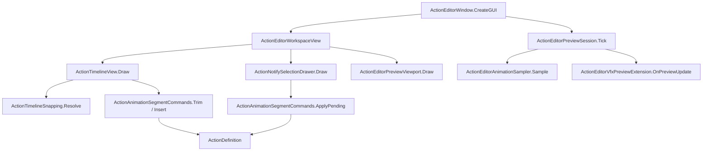
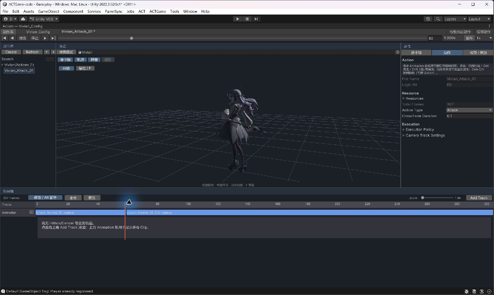

# ActionEditor 工作区优化实施与验收记录

日期：2026-09-29。参考提交：`86607ce8ad99609b056e8747e42e41c15bc90db4`。

## 本轮结果

已替换主窗口布局并移除独立 Character Preview。采用 UI Toolkit 管理分栏，现有 IMGUI 时间轴和属性绘制继续作为唯一编辑路径。场景模型与隔离模型共用 ActionEditorPreviewSession；未修改运行时动作格式或引入 CwcMontage 源码、包和素材。

- 上方动作库、内嵌模型预览、属性；下方完整时间轴。动作库可折叠，分栏尺寸持久化。
- 场景/隔离模式显式切换，预览 Prefab 不写回角色配置。隔离视口支持右键旋转、中键平移、滚轮缩放、F 聚焦、复位与网格；命中框/轨迹可以开关。
- 集中播放、暂停、停止、前后帧、首末帧、秒数、循环与预览倍速；保持 60Hz 逻辑帧。
- 8px 磁吸、Alt 暂停、参考线与帧差；多选整体夹紧保留间距。动画边缘修剪源帧，不变速；越界拒绝整次提交。支持按顺序拖入多段 Clip。
- 选中项/动作/检查与来源分区；保留全部 16 种轨道类型。当前动作校验复用 ValidateContent 与 ActionDefinitionAuditUtility，窗口问题可定位属性。保存按钮和 Ctrl+S 只保存当前动作。
- SFX 默认静音，选中 SFX 后显式试听**原始音频**；停止、拖帧、切换、关闭时清理。音量和 pitch 的实际效果仍由游戏音频路径验收。
- VFX 的世界空间实例进入目标所属场景；隔离模式不再把世界 VFX 放到普通场景。
- 仅选择、折叠、拖播放头不再标记资产为待保存；旧窗口在加载动作时自动补建轨道改为检查页的显式命令。

## 数据与架构

主要实现：[工作区入口](D:/Projects/ACTGame-code/Assets/Scripts/Editor/Combat/ActionEditor/ActionEditorWindow.cs:126)、[原子修剪](D:/Projects/ACTGame-code/Assets/Scripts/Editor/Combat/ActionEditor/Timeline/ActionAnimationSegmentCommands.cs:31)、[隔离资源绑定](D:/Projects/ACTGame-code/Assets/Scripts/Editor/Combat/ActionEditor/Preview/ActionEditorPreviewViewport.cs:19)。生产资产基线 `.utmp/action-editor-alignment/baseline.json` 包含 554 个 .asset/.prefab/.unity 文件；目前全部内容哈希一致，无资产名、GUID、NodeId、网络内容身份迁移。

## 源文件变更清单

| 文件（相对仓库） | 处理 |
|---|---|
| Assets/Scripts/Editor/Combat/ActionEditor/ActionEditorWindow.cs | 接入工作区、目标切换、播放生命周期、保存/校验/问题定位 |
| Assets/Scripts/Editor/Combat/ActionEditor/ActionEditorWorkspaceView.cs | 新增，负责 UI Toolkit 分栏与容器 |
| Assets/Scripts/Editor/Combat/ActionEditor/ActionEditorStyles.cs | 删除被 UI Toolkit 替代的旧分栏绘制、尺寸与配色常量 |
| Assets/Scripts/Editor/Combat/ActionEditor/ActionToolbar.cs | 统一播放与帧定位、预览倍速 |
| Assets/Scripts/Editor/Combat/ActionEditor/Preview/ActionEditorPreviewViewport.cs | 新增，管理隔离模型、镜头、网格和渲染资源 |
| Assets/Scripts/Editor/Combat/ActionEditor/Preview/ActionEditorSfxPreview.cs | 新增，显式原音试听与停止清理 |
| Assets/Scripts/Editor/Combat/ActionEditor/Timeline/ActionTimelineView.cs | 磁吸、修剪、拖入、组移动、Undo 合并、聚焦与全长 |
| Assets/Scripts/Editor/Combat/ActionEditor/Timeline/ActionTimelineSnapping.cs | 新增，纯落帧算法与候选收集 |
| Assets/Scripts/Editor/Combat/ActionEditor/Timeline/ActionAnimationSegmentCommands.cs | 新增，插入与原子修剪/属性提交 |
| Assets/Scripts/Editor/Combat/ActionEditor/Timeline/ActionTimelineCommands.cs | 删除动画段时接入总长检查，拒绝静默裁剪战斗窗 |
| Assets/Scripts/Editor/Combat/ActionEditor/Inspectors/ActionNotifySelectionDrawer.cs | 选择标题、动作分区、修剪提交保护及淡入覆盖字段 |
| Assets/Scripts/Editor/Combat/ActionEditorPreviewSession.cs | 切动作立即结束旧采样，恢复 Animator |
| Assets/Scripts/Editor/Combat/ActionEditorVfxPreviewExtension.cs | 世界 VFX 使用目标场景，避免隔离预览污染主场景 |
| Assets/Scripts/Editor/Character/CharacterAuthoringPreviewWindow.cs | 删除及同步删除 .meta；职责已迁入视口 |
| Assets/Scripts/Editor/Character/CharacterAuthoringValidationRunner.cs | 定向回归加入新测试类 |
| Assets/Tests/Editor/Character/ActionEditorAlignmentTests.cs | 新增，帧命令、磁吸、全轨道、布局、音频接口测试 |
| Assets/Tests/Editor/Character/ActionEditorViewportTests.cs | 新增，场景/隔离采样、资源、VFX 清理测试 |

新增脚本的 .meta 由 Unity 生成，旧布局 `ComputePanelRects`、`HandleSplitterDrag`、宽度 PrefKey 和旧 CharacterAuthoringPreviewWindow/Bind 已删除；未增加兼容分支。

## 自动验证

- 已在当前打开的 Unity Editor 内运行定向 EditMode；未启动第二个 Unity batch 实例。
- 最终定向结果：**111/111 通过，失败 0、跳过 0**，结束于 2026-09-29 12:12:30 UTC；全项目结构/内容审计 **0 个问题**。完整结果见 [Test Runner XML](ACTION_EDITOR_ALIGNMENT_TEST_RESULTS.xml) 和 [审计输出](ACTION_EDITOR_ALIGNMENT_AUDIT.txt)。
- 测试覆盖：磁吸视觉容差/优先级/Alt/非法候选、整组夹紧、endFrame=-1、原子拒绝、Undo/Redo、多 Clip 顺序、15 类业务轨道增删编辑撤销、只读选择、1280×720 与 1920×1080 分栏布局、Unity 音频预览接口、返回 Edit Mode 的序列化上下文重建、隔离实例复用/释放、场景对象拒绝、同帧场景/隔离采样一致、切换恢复 Animator、VFX 正拖/倒拖循环 10 次与释放。
- 代表性轻量模型 600 次预览 Tick 约 8.4ms，平均 0.014ms/Tick；仅覆盖采样循环，**不含真实角色、粒子、渲染开销**。开工前未采集对应耗时，不能据此声称性能提升。
- `.utmp/check_authoring_compile.py` 五个程序集补充编译通过；仅作为附加检查。
- `git diff --check` 检查格式；生产资源 SHA-256 比较：[554 个文件均无变化](ACTION_EDITOR_ALIGNMENT_ASSET_CHECK.json)。

## 操作与验收范围

| 项目 | 本轮证据 / 范围 |
|---|---|
| 隔离工作区渲染与拖帧 | 已通过实际 Unity 界面观察 Vivian 动画姿态随帧变化 |
| 模式与模型切换 | 自动测试覆盖场景目标保持、隔离资源回收及采样恢复 |
| Play 进出 | 已通过实际 Unity 进入/退出 Play 复验；退出后模型、属性、时间轴和拖帧恢复 |
| 1280×720 / 1920×1080 | 自动验证 UI Toolkit 分栏尺寸；不等同于两种分辨率所有字段的人工视觉验收 |
| 生产数据 | 554 文件哈希对比；未保存角色资源/场景 |
| SFX | 接口存在测试；原音试听，未宣称完成听感和游戏音调验收 |
| Camera | 保留 Scene 编辑与既有 Action Camera View；本轮不把游戏镜头嵌入隔离视口 |
| Gameplay 战斗和双端网络 | 未据编辑器测试宣称完整游戏/联机验收；仍需按方案第 8 节核对 |

剩余人工体验核对：在 `Gameplay` 的 Scene 模式逐帧查看实战 Hitbox 与 Camera；在测试副本上执行真实鼠标多选/修剪/多 Clip 拖入与 Undo；试听 SFX；Play 中核对攻击、闪避、受击、换人与敌人 BT 起手。无需新的 Inspector/Prefab 接线。Test Runner：EditMode，测试类 `ActionEditorAlignmentTests`、`ActionEditorViewportTests`、`ActionEditorScenePreviewTests`；完整定向入口为 `ACT/Character/Run Authoring Validation`。

## 使用方法

1. 从 `ACT/Action Editor`、角色工作台或资产 Inspector 打开主窗口。
2. 视口顶部切换场景/隔离。场景模式拖入 Hierarchy Transform 并在 Scene 查看；隔离模式选择 Project 模型 Prefab。
3. 时间轴边缘拖动修剪源帧，条块中部拖动换序；业务窗支持 Ctrl 多选、Shift 范围选、框选。Alt 临时关闭磁吸。
4. `全长` 恢复整个时间轴，`聚焦` 放大到当前选中项；Ctrl/Cmd+滚轮缩放。Ctrl+C/V 沿用业务窗口剪贴板，Delete 删除，Esc 取消拖拽或清空选择，输入文本时这些时间轴快捷键不接管。
5. 校验当前动作，使用问题定位按钮；确认后保存当前动作。资源共享影响见顶部提示和检查/来源页；烘焙及源指纹仍在角色工作台执行。

实际 UI 验证中修复了两项仅静态编译不能发现的问题：隔离视口绘制需恢复相机状态并在异常路径结束 PreviewRenderUtility；退出 Play 时必须重建 SerializedObject，不能只恢复模型。后者已加入 `ReturningToEditModeRestoresSerializedAction` 自动回归。最终工作区截图见下。

