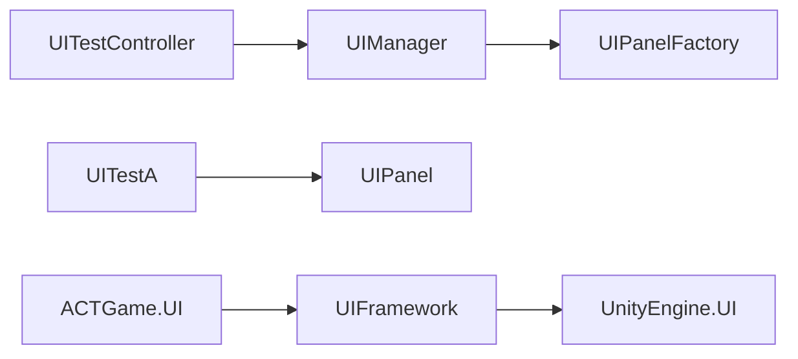

# 源码结构修复 — 2026-09-29

## 范围与结果

本轮处理资源校验中剩余的 51 项 StructureAudit。Unity 内 `StructureValidationBatch.ValidateAll()` 的最终结构、程序集边界和内容失败数均为 0；原配置修复结果没有回退。

采用类型拆分、明确程序集边界和改善异常反馈，不通过删除规则或整体放宽阈值清零。保留此前本地修改，未提交、推送、切换分支。

## 对应 51 项的处理

| 原问题 | 处理 |
|---|---|
| 45 项多公开类型 | 其中 43 个文件按类型拆成 165 个文件（新增 122、保留主文件 34、主文件改名 9）；另 2 项为调试组件的条件编译同名声明，修正计数规则 |
| ActionGraph 超长 | Graph、Node、Edge 各自独立；Graph 主文件低于 450 行，不改图解析算法 |
| ActionSim 超长 | 按既有机制登记单职责理由：同一动作实例的整数帧状态机集中管理推帧、卡肉、取消与下一帧提交。保持行为和状态不变，没有为行数机械拆分或增加转发层 |
| 读取启动配置的 catch | 只捕获预期的 IO、权限、路径异常；记录异常类型，仍由上层 ConfigFailed 处理；不记录配置正文 |
| 时间轴剪贴板的 catch | 解析失败明确输出警告，不再只有“粘贴无效果”；不写入损坏数据 |
| Mux 解包的 catch | 在读取载荷前验证完整固定头和声明长度，正常拒绝坏包，不靠 catch-all 控制流程；保留调用方丢包计数 |
| UIFramework 未登记 | 明确只允许依赖 UnityEngine.UI，没有默认放行未知程序集 |

规则修正同时保留反例测试：真正新增的另一个公开类型、同名但不同泛型元数的类型仍会报错，UIFramework 引用 ACTGame.App 仍被拒绝。

## 扩大验证时发现的结构补漏

`AssemblyReferenceBoundaryTests` 的目录比较混用了 Unity 的 `/` 与 Windows 本机分隔符。修正路径归一化后，发现 `Assets/Scripts/UI` 的两个示例脚本确实没有显式程序集归属。

新增 `ACTGame.UI.asmdef`，只引用 `UIFramework`。`UITestA`、`UITestController` 保留现有脚本 GUID 和命名空间，通过 `MovedFrom` 标记从 `Assembly-CSharp` 到 `ACTGame.UI` 的类型来源迁移；没有创建兼容执行路径。除此以外，43 个拆分文件中的类型程序集归属全部保持。

## 验证结果

最终 Unity EditMode：**656 项，639 通过、17 失败、0 跳过**；直接相关的 5 个测试类合计 **41/41** 通过。

- Unity 已加载并编译新脚本和 `ACTGame.UI`；通过打开的 Editor 执行全部 EditMode 测试，未对同项目启动批处理 Unity。
- 最终测试计数和失败清单以 `STRUCTURE_REPAIR_TEST_RESULTS.xml` 与 `STRUCTURE_REPAIR_REMAINING_TEST_FAILURES.json` 为准。**全量测试仍有失败，不能声称全工程测试通过。**
- 结构规则、程序集方向/归属、App/Networking 边界与 ChannelMuxTransport 的定向类均通过；新增坏包测试验证截断、错误长度、尾随字节、版本、类型和超长包的拒绝、计数，以及后续合法包继续交付。
- C# Roslyn 对拆分前后的 165 个类型按 Editor/发布版两种条件各比较一次，共 330 次类型声明等价检查通过；原始脚本 `.meta` 字节保持，所有新增脚本均有 Unity 生成的 `.meta`。
- 1,617 个已有序列化资产及相关配置 meta 的 SHA-256 对比全部不变。没有修改角色资产、行为树资产、prefab、场景或动画资源。
- `dotnet run --no-restore --project .utmp/structure-check/Check.csproj`：源码结构问题 0。
- `dotnet run --no-restore --project .utmp/structure-repair/Repair.csproj -- --verify`：330 次声明比较和脚本 meta 检查通过。
- 复用 `.utmp/check_authoring_compile.py` 的 5 模块补充编译通过，仅作为补充证据；Unity 加载与测试结果优先。
- `git diff --check -- Assets/Scripts Assets/Tests` 通过。

## 全量测试仍需处理的问题

| 测试类 | 失败数量 | 现象 |
|---|---:|---|
| DedicatedServerRuntimeTests | 3 | 预期绑定失败日志未声明；断连后重传发送；本机离开后玩家记录未按测试预期移除 |
| ServerLaunchConfigResolverTests | 1 | InvalidOverlay 测试预期配置拒绝，实际接受 |
| ServerSimulationRunnerTests | 2 | 时间推进预期 3 帧，实际 2 帧 |
| PartyCombatCoordinatorTests | 4 | 切人侧向站位预期距离与实际结果不同 |
| HitReactionResolverTests | 3 | 受击等级、Hit 边沿与抗打断叠加断言不符 |
| RemoteCharacterProxyTests | 2 | 代理可被选中/索敌的断言失败 |
| RoomArchitectureBoundaryTests | 2 | 文本式架构断言与当前工厂、Room Facade 实现不符 |

以上共 17 项，超出本轮 51 项结构报告的修复范围，保留原断言，没有忽略或改成通过。相关多数核心实现未在本轮修改，拆分类型已做语法树等价检查；但未运行修改前完整 Unity 测试基线，因此不将这 17 项全部断言为“已证实的既有失败”。后续需要按行为设计逐项诊断，不能仅改预期值消除红灯。

## Editor 人工验收与剩余限制

1. 菜单 `ACTGame > Architecture > Validate All Structure And Content`：预期全部通过，失败数 0。
2. Test Runner > EditMode：直接相关的 `StructureAuditRuleSetTests`、`AssemblyReferenceBoundaryTests`、`AppCompositionBoundaryTests`、`NetworkStructureBoundaryTests`、`ChannelMuxTransportTests` 应全部通过。全量仍有上述 17 项失败。
3. 打开现有角色 ActionGraph 和敌人 BehaviorTree，检查节点数据和 SerializeReference 类型显示完整。全库内容审计已通过，但未逐个图进行人工编辑操作。
4. Gameplay Play：攻击、取消、受击、敌人行为树、切人、调试面板。UI 示例场景检查现有 `UITestA`/`UITestController` 未显示 Missing Script，并验证 OpenA/OpenB/Back。无需重新绑定 prefab/Inspector；本轮未执行上述人工 Play 操作。
5. 未构建发布版 Player；仅对拆分声明做发布版条件的语法树对比，不把它等同于发布构建通过。

逐文件说明见 `STRUCTURE_REPAIR_FILE_CHANGES.md`；验证证据见同目录 `STRUCTURE_REPAIR_*`。修改前源码备份和拆分清单保存在 `.utmp/structure-repair/`，不得用 Git reset 覆盖此前本地工作。
