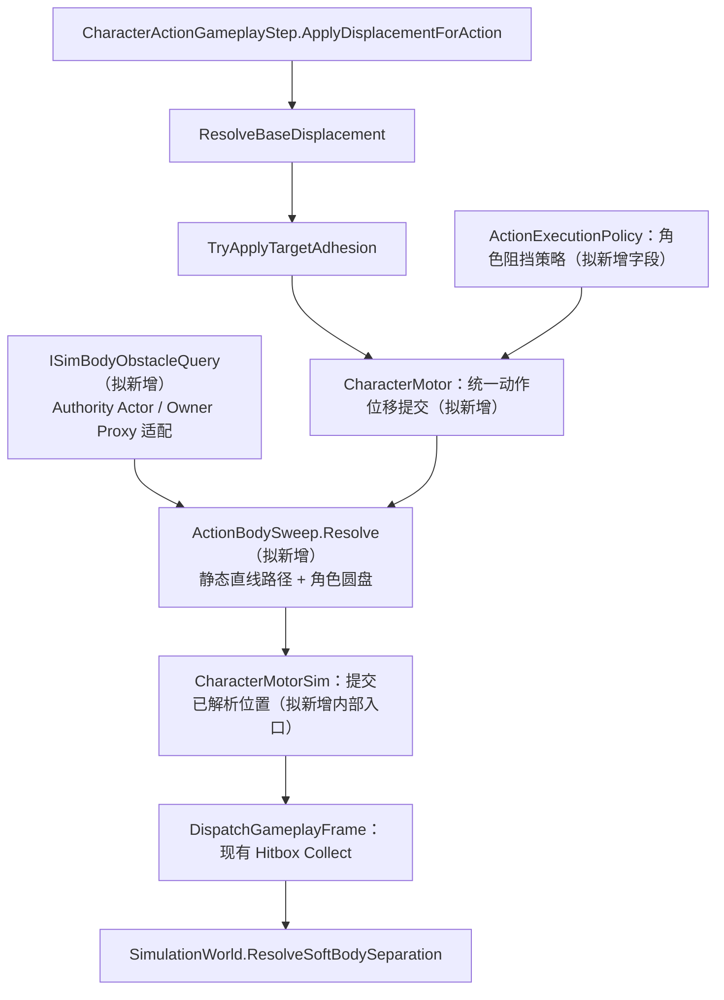

# 动作突刺碰撞优化方案

> 制定：2026-09-30  
> 角色：动作连续位移阻挡的实施真源；代码已接入，Unity 与 Play 验收待完成。
> 首批验收：Vivian Attack04、AttackBranch_Ground。  
> 关联：[吸附修正记录](TARGET_ADHESION_FIX.md)、[架构](../../.agents/skills/actgame-architecture/ARCHITECTURE.md)、[路线图](../../.agents/skills/actgame-architecture/ROADMAP.md)。  
> 基线：当前工作区，包含用户尚未提交的吸附代码及动作资产修改；实施时保留这些改动，不切分支、不重置。

## 0. 一句话

实施状态见 [ACTION_DASH_COLLISION_IMPLEMENTATION.md](ACTION_DASH_COLLISION_IMPLEMENTATION.md)。本次未启动第二个 Unity；补充编译和独立 Mono 测试不等于 Unity Test Runner 验收。Listen 共用注册表，实际实现由工厂按座位筛选 Authority 目标 / Observer Proxy。集成与预测测试放在现有 `Assets/Tests/Editor/`（Assembly-CSharp-Editor），避免为了测试引入反向程序集引用。

在固定帧动作位移中增加按动作配置的连续路径阻挡，让突刺在最先接触的角色前停止，保留动画与命中帧推进；纯模拟求解器供权威端和预测端共用，禁止按 Vivian 或动作名称硬编码，禁止新增 Update/Unity Physics 位移权威及长期兼容双轨。

## 1. 问题与动机

### 1.1 当前实现与证据

以下行号以制定时工作区为准，代码是现状真源。

| 现状 | 代码依据 |
|---|---|
| 动作先计算基础位移，再尝试吸附；未吸附时另走基础位移入口 | [CharacterActionGameplayStep.cs](../../Assets/Scripts/Domain/Character/Combat/CharacterActionGameplayStep.cs)，169–194 行 |
| 电机移动经过静态碰撞世界，不在该入口扫描动态角色 | [CharacterMotorSim.cs](../../Assets/Scripts/Domain/Simulation/Character/CharacterMotorSim.cs)，52、175–186 行 |
| CharacterController 不承担权威 Move | [CharacterMotor.cs](../../Assets/Scripts/Domain/Character/CharacterMotor.cs)，3–5 行 |
| 全体 Actor 移动后才做软分离 | [SimulationWorld.cs](../../Assets/Scripts/Domain/Simulation/SimulationWorld.cs)，108–126、141–182 行 |
| 软分离只计算终点距离和重叠，完全跨过时不会检测；越过中心后可向背面弹开 | [SoftBodySeparation.cs](../../Assets/Scripts/Domain/Simulation/Character/SoftBodySeparation.cs)，60–69、119–120 行 |
| 当前静态移动按 X、Z 分轴滑墙，实际路径不一定是起终点直线 | [SimStaticCollisionWorld.cs](../../Assets/Scripts/Domain/Simulation/Character/SimStaticCollisionWorld.cs)，32–44 行 |
| 客户端已有只读 Proxy 圆盘收集和本机软分离 | [ReplicatedFeedbackCoordinator.cs](../../Assets/Scripts/App/Networking/Services/ReplicatedFeedbackCoordinator.cs)，80–114 行；[AutonomousSoftBodySolver.cs](../../Assets/Scripts/Domain/Simulation/Character/AutonomousSoftBodySolver.cs)，18 行起 |
| 现有动作目标查询只提供指定 Id 的逻辑 Pose，不能直接承担全体角色体积查询 | [IActionMotionWorldQuery.cs](../../Assets/Scripts/Domain/Character/Motion/IActionMotionWorldQuery.cs)，2–5 行 |

解析资产 `positionDeltaMmZ` 的 little-endian int32 数组，得到以下单帧前移量；帧索引从 0 开始：

| 动作资产 | 帧索引 | 前移量 |
|---|---:|---:|
| [Vivian_Attack_04.asset](../../Assets/Data/Characters/Vivian/Actions/Vivian_Attack_04.asset) 第 161 行 | 24 | 2226 mm |
| [Vivian_Attack_Branch_Ground.asset](../../Assets/Data/Characters/Vivian/Actions/Vivian_Attack_Branch_Ground.asset) 第 161 行 | 13 / 14 / 15 / 16 | 915 / 1288 / 1943 / 873 mm |

两资产第 137 行均为 `motionModifierStates: []`。当前穿透无需假设开启了 SoftBodySuppress 即可解释。上述为源码与资产证据，尚未通过 Play Mode 复现；若实际运行 Graph 指向其他动作，须先修正验收对象。

### 1.2 目标与范围

| 项目 | 定案 |
|---|---|
| 阻挡对象 | 路径上最先接触的有效实体角色，包括未选中的角色；初版沿用实体互撞语义，不按阵营豁免 |
| “停在面前” | 停在沿突刺方向接近的接触侧，不是绕到敌人朝向定义的正前方 |
| 动作行为 | 截断本帧位移，不停止动画、ActionSim、Hitbox 窗口或取消窗口 |
| 位移欠账 | 截掉的位移立即丢弃，不积累、不在下一帧补偿 |
| 后续帧 | 每帧重新查询；敌人离开后允许继续执行当帧位移；不增加“首次撞击后锁死整招”状态 |
| 吸附 | 继续负责接近和落点；其输出也必须受阻挡约束 |
| 不做 | 全局 Rigidbody/CC 改造、提高逻辑频率、重烘焙以掩盖问题、通用三维刚体 CCD、完整两体同时运动求解、Hitbox 扫掠重构 |
| 资产边界 | 本方案只写文档；后续 Agent 不直接改 Assets/Data、场景、Prefab 或美术，除非用户明确授权具体资产 |

## 2. 设计原则

1. Gameplay 继续由 SimulationWorld / InputFrame 固定帧驱动；当前网络体系是权威状态同步，不把同一求解器误称为网络输入锁步。
2. Simulation 层只消费整数毫米几何和稳定 Id，不引用 Character、Enemy、Unity Transform 或 Physics。
3. 动作差异放 ActionExecutionPolicy；初版不新增 Timeline 轨道，避免为两招引入一套窗口生命周期。
4. 角色阻挡和软弹开职责分开：前者预防本次位移穿过，后者修复出生、挤压等残余重叠，二者不是兼容双轨。
5. 索敌、Hurtbox 是否开放和身体能否阻挡互相独立；无敌但实体存在的角色仍可阻挡。
6. 保留已有吸附修改；只收敛动作位移提交入口，不顺带重写走跑、重定位或帧末战斗流程。
7. 相同几何输入必须得到相同毫米结果；涉及浮点求根时明确运算次序、接触容差和保守量化，跨平台一致性必须验证，不能只凭纯 C# 声称成立。

## 3. 目标架构与契约

以下图包含拟新增方法和类型，标注“拟新增”的部分尚未存在。



### 3.1 作者配置

在现有 `ActionExecutionPolicy` 增加字段，不新增独立资产：

| 字段（拟新增） | 语义 / 初值 |
|---|---|
| `ActionBodyCollisionMode` | `SoftSeparationOnly = 0`、`StopOnContact = 1` |
| `bodyCollisionMode` | 默认 0，保留其他动作现有玩法；两招由 Editor 显式设 1 |
| `bodyContactSkinMm` | 建议初值 20 mm，作为验证起点而非已经调好的最终手感 |

`SoftSeparationOnly` 是长期有效的玩法策略，并非 Legacy 入口；两个策略共用一个动作位移提交点。初版 StopOnContact 覆盖该动作全部连续平面位移，后撤和切向移动按接触方向允许离开，不需要人工猜测突刺窗口。

SoftBodySuppress 仍只控制软分离参与，不暗中关闭 StopOnContact。主动穿敌动作采用 SoftSeparationOnly，并按既有机制配置抑制窗口。被动角色是否具有身体由独立状态决定，不能把 `ParticipatesInSoftBodySeparation == false` 无条件理解为无实体：它可能仅由临时抑制导致。

### 3.2 纯几何输入与输出

拟新增到 `Domain/Simulation/Character/`：

```text
SimBodyObstacle:
    ActorId, PositionMm, RadiusMm, BodyEnabled

ISimBodyObstacleQuery:
    填充本次求解所需的只读圆盘集合；排除 SelfId，按稳定 ActorId 排序

ActionBodySweep.Resolve:
    输入 = FromMm, DesiredDeltaMm, MoverRadiusMm, SkinMm,
           静态碰撞查询、圆盘集合
    输出 = AllowedDeltaMm, Blocked, BlockerId, ContactKind
```

求解器不写 Actor，不派发命中或伤害。圆盘半径取 MotorSim 配置，不取攻击盒、模型包围盒或骨骼。停用、死亡、离场和非实体对象由适配层过滤；无敌不等于无实体。半径无效和重复 Id 在构建/调试校验中拒绝。

初版保持项目已有 XZ 圆盘语义：不额外以高度差忽略角色；空中上下穿越不在本次保证范围。后续需要多高度层时单独扩展体积契约。

### 3.3 连续检测与提交规则

1. 将目标圆盘膨胀为 `moverRadius + obstacleRadius + skin`，沿本帧完整直线位移求最早进入时刻 `t ∈ [0, 1]`。不是只测终点，也不采用固定数量子步近似。
2. 每个候选计算最早接触；取最小 t，相同接触时间按稳定 ActorId 决定调试归属，不能依赖收集顺序。
3. 毫米量化向安全侧收敛，并复查结果不得进入有效阻挡体；擦边且没有进入内部时允许通过。零位移、极短向量、大坐标及平方溢出必须单测。
4. 起点已在膨胀圆内时不使用普通“入射根”：向外或不加深重叠的位移允许；向内位移截断。完全同心时允许非零逃离方向，静止重叠交给现有软分离。不让“初始重叠即一律 t=0”造成卡死。
5. 不保存累计残差或整招碰撞锁。动画继续前进，下一帧重新计算基础位移、吸附和阻挡。
6. 同一 tick 因动作帧追赶产生多次位移提交时，每次都必须经过统一入口，以本次已提交位置为起点。

### 3.4 静态墙体与动态角色的组合

现有静态电机采用 X/Z 滑墙，因此禁止“先扫直线敌人，再调用会转向滑墙的旧 Move”后宣称完整防穿。

本方案定案：**StopOnContact 动作采用直线停止语义，遇墙也截断，不沿墙滑动**。为 `ISimCollisionWorld` 增加无副作用的直线扫掠查询，由 OpenField 和 SimStaticCollisionWorld 使用各自已有数据实现；静态 AABB 与角色圆盘取最早接触时间。复用现有静态数据，不再烘焙第二份墙体。

电机只提交该次解析的安全终点，不再次执行会改变路径的分轴滑墙。位置写入入口限制在模拟内部，并由测试保证调用前已经解析。现有走跑与 SoftSeparationOnly 继续使用原有滑墙行为，通过同一电机服务选择明确玩法策略，不复制一套 Motor。

起点嵌墙时先复用静态脱嵌能力，再检查脱嵌结果与角色重叠；脱嵌属于恢复既有非法状态，不承诺回退到历史接触侧。恢复后重新解析该帧动作路径。贴墙+贴人必须成为独立出口测试。

### 3.5 固定帧时序与移动目标边界

权威端按当前稳定 Actor Step 顺序，查询**该次提交时的已提交逻辑位置**；本次求解期间冻结候选数组。先执行的角色位置已经更新，后执行的角色仍是前一步位置。这个顺序影响是显式契约，不声称两体同时运动顺序无关。

这样先落实对静止或低速角色的突刺防穿，不重排 Hitbox Collect、PostCombat 或全世界两阶段移动。两个启用 StopOnContact 的角色正面互冲，后执行者应检测前者已提交位置，必须有集成测试。

**保证边界：** 自身此次启用策略的路径不会穿过查询到的角色体积；未启用策略的另一角色随后高速冲入、瞬移穿越或跨网包位置跳变，不属于完整两体 CCD 保证，残余重叠仍由软分离处理。不得将本期验收描述为“任意动态角色永不穿透”。

保持“动作位移 → Hitbox Collect → 世界软分离 → 现有战斗结算”的时序。身体阻挡不等待 OnHitConfirm，否则出现命中前已经穿过去的问题；逻辑体积和攻击距离不匹配时，应调作者配置并验收命中，不把身体接触当作造成伤害。

### 3.6 网络、构建与预览

| 环节 | 接入与边界 |
|---|---|
| Authority / Dedicated / Listen | 由现有组合根注入 Actor 圆盘查询；Simulation 不反向访问 App 或 Enemy |
| Autonomous | 将已有 Proxy 收集逻辑整理为可复用的只读体积提供者；动作阻挡与帧末软分离共享该来源，不修改 Proxy 位置 |
| Observer | 只消费权威位置，不新增本地阻挡求解 |
| 预测差异 | 相同输入使用同一算法，但远端位置具有延迟，不能承诺结果始终等同权威；沿用当前和解机制并专项测动作中误差，不通过放大容忍距离隐藏错误 |
| Restore / Replay | 求解器本身无跨帧状态；凡现有路径重放动作位移，都需注入该模拟步可用的逻辑圆盘数据。当前不支持的动作 Replay 不借此方案扩张；不得声称历史数据未保存时可精确重放动态接触 |
| 内容一致性 | 新策略、skin 和静态查询规则纳入现有内容校验/指纹体系；先审计当前指纹覆盖，若漏 Gameplay 字段必须补齐，不能只凭资产名称相同认为配置一致 |
| ActionEditor | 暴露两个字段；提供起点、原始终点、安全终点、圆盘与阻挡 Id 的调试显示；假敌预览必须调用同一纯求解器并标注其不代表运行时网络时序 |

## 4. 分阶段交付

DB1～DB3 的代码任务已接入，下面仅勾选已完成任务。DB0～DB4 出口全部达成后，才可宣布功能完成；Play 复现、Unity 测试与网络误差测量仍未验收。

### DB0 — 锁定样例与基线

**任务**

- [ ] 确认 Gameplay 场景实际使用的 Vivian Graph 指向两份动作资产，记录敌方逻辑半径、位置和当前动作配置。
- [ ] 记录攻击前方、贴身与远距离三种起点的穿透现象；区分逻辑根穿过和仅视觉残差越界。
- [x] 审计 Actor/Proxy 身体参与状态、现有指纹字段和程序集引用，锁定本方案新增查询的装配点。

**验收**

- [ ] 记录中包含动作名、帧索引、位移量和角色前后逻辑坐标，可重放相同场景。
- [ ] 确认未把 SoftBodySuppress、未绑定静态场地或另一份资产误当成同一问题。

**出口：** 基线与具体接线清单可复核。→ **未达成**

### DB1 — 纯模拟连续路径求解

**任务**

- [x] 新增 `SimBodyObstacle`、`ISimBodyObstacleQuery`、`ActionBodySweep`，明确距离单位与稳定排序规则。
- [x] 扩展静态碰撞契约及全部生产实现，提供直线扫掠；StopOnContact 取静态/角色最早接触。
- [x] 在 `CharacterMotorSim.TryMoveActionMm` 内原子求解和提交，保留现有走跑滑墙语义，不暴露绕过解析的写位置入口。
- [x] 新增 `ActionBodySweepTests` 覆盖静态组合和电机提交；复用现有电机、静态及软分离测试回归。

**验收**

- [ ] 2226 mm / 1943 mm 单步跨越、终点无重叠仍拦截；近处目标优先；交换候选输入顺序结果一致。
- [ ] 零位移、切线、反向离开、初始重叠、完全同心、大坐标和量化边界均有明确结果。
- [ ] 墙在人前、人在墙前、斜向接近墙角、贴墙贴人测试通过，提交点不被后续滑墙改变。
- [ ] 原有静态电机与软分离相关 EditMode 回归通过。

**出口：** 在给定几何输入下，完整路径检测和保守终点提交可独立验证。→ **未达成**

### DB2 — 动作策略与单一提交入口

**任务**

- [x] 增加 ActionExecutionPolicy 字段、Editor 编辑入口、内容审计及指纹覆盖。
- [x] 将 GameplayStep 收敛为“基础世界位移 → 吸附修正 → 统一动作提交”，删除动作内重复提交基础位移的分支。
- [x] 在收敛时保持烘焙量化、朝向同步和脚本移动速度估计语义；不借机改变走跑速度口径。
- [x] 注入权威圆盘查询，明确实体资格与软分离抑制的区别。
- [x] 新增 `ActionDashCollisionIntegrationTests`，覆盖默认/停止策略、持续动作帧及吸附末帧的电机/预览一致性；真实 Unity 执行待验。

**验收**

- [ ] 每次动作位移只提交一次；无目标选择时仍被路径上的实体拦住。
- [ ] 被挡住后动作帧、Hitbox 与取消窗口继续；无累计欠账，吸附末帧也不能绕过阻挡。
- [ ] 默认策略的既有动作结果保持；移除的 `ApplyBaseDisplacement` 在动作 GameplayStep 中无残留定义/调用。
- [ ] 两个启用策略的角色正面互冲不交换前后位置；后撤可离开接触，连续攻击无静止死锁。

**出口：** 单机/权威动作具有可配置且唯一的连续位移阻挡路径。→ **未达成**

### DB3 — 预测、工具与回归

**任务**

- [x] 将 Proxy 圆盘来源整理为每个 Actor 的查询服务，供预测阻挡和原软分离使用；不缓存跨房间 Actor 引用，不新建静态求解缓冲。
- [x] 接通本机动作路径，Observer 保持只读；本次不扩展现有动作 Replay 或增加碰撞历史。
- [x] 完成编辑器字段、校验、假敌路径预览和 F3 碰撞调试字段。
- [x] 增加 `ActionDashPredictionTests`，覆盖相同输入两端一致、每次提交重新采样、角色注销/身份切换及 Listen 来源筛选。

**验收**

- [ ] 相同圆盘快照得到相同毫米结果；预测不修改远端 Proxy。
- [ ] Listen 与 Dedicated/Client 均能在敌人前停下；延迟条件下记录峰值位置误差和最终和解结果，无持续反复穿越/拉回。
- [ ] 新字段不同的内容构建能被一致性校验发现；断线重连和房间切换无残留阻挡体。
- [ ] 编辑器预览和运行时在相同几何条件下安全终点一致。

**出口：** 预测、权威和作者工具共用语义，已知时序差异有验证记录。→ **未达成**

### DB4 — Vivian 配置与体验验收

**任务**

- [ ] 用户在 Editor 将 Attack04、AttackBranch_Ground 配为 StopOnContact，初始 skin 20 mm；不改烘焙位移表。
- [ ] 验收空场原始突刺距离、贴身停止、群怪最先接触、墙边、连续连招、敌人死亡/移开、主动穿敌动作。
- [ ] 对照逻辑根与模型分别观察，记录是否出现身体已停止而动画残差仍显著穿过的表现问题。
- [ ] 更新架构/技术文档中的实际实现、限制与本方案出口，保留原有未提交改动。

**验收**

- [ ] 两招从近、中、远三档距离攻击实体敌人均无自身位移跨体；无敌角色仍挡身体，已离场对象不挡路。
- [ ] 在目标静止时持续出招保持接触侧，不向背面弹出；命中数量、取消和卡肉符合原动作配置。
- [ ] 30/60/120 渲染 FPS 下相同逻辑输入得到相同接触结果，首轮预热后查询与求解无每帧托管分配。
- [ ] 以 10/30/100 个候选测量求解耗时和候选数并记录；确认固定帧预算无明显回退后再决定是否需要空间索引，不先搭大规模 broadphase。
- [ ] 自动测试结果与手动 Editor 记录齐全；未完成的网络/表现检查不得勾选通过。

**出口：** 两招实际玩法满足“遇实体停在接触侧”，文档与验证闭环。→ **未达成**

## 5. 迁移与删除

| 项目 | 处理 |
|---|---|
| `CharacterActionGameplayStep.ApplyBaseDisplacement` | DB2 将其必要语义迁入统一动作提交，删除方法及绕过策略的调用分支 |
| `ResolveBaseDisplacement` / `TryApplyTargetAdhesion` | 保留为顺序明确的位移生成与修正，不再各自决定提交路径 |
| `CharacterMotor.MoveLocalMm/MovePlanar` | 审计其他消费者；有走跑或其他用途则保留，仅移除动作侧旁路，不盲目删除公共 API |
| `SoftBodySeparation` / `AutonomousSoftBodySolver` | 保留终点重叠修复职责；其存在不是旧碰撞兼容路径 |
| `ISimCollisionWorld` | 扩展直线扫掠契约并更新全部实现；不维护另一份静态场地数据 |
| Proxy 圆盘采集 | 提取公共只读来源，删除替换后的重复循环；不复制两份角色注册表 |
| Relocate / Teleport | 保留其显式重定位语义，不悄悄套入连续突刺规则；含此类命令的招式另按命令语义验收 |
| Legacy/Old/V1/Compat | 不新增；同一出口删除被替换入口，不保留运行时双写或双重移动 |

## 6. 预期文件影响

以下是实施范围，新增名称为设计名，最终以职责不变为准。

| 路径 | 工作 |
|---|---|
| `Assets/Scripts/Domain/Simulation/Character/` | 新增圆盘查询/求解类型；扩展静态查询和电机安全提交 |
| `Assets/Scripts/Domain/Combat/Actions/Definitions/ActionExecutionPolicy.cs` | 动作策略和接触间隙 |
| `Assets/Scripts/Domain/Character/Combat/CharacterActionGameplayStep.cs` | 收敛动作提交与吸附顺序 |
| `Assets/Scripts/Domain/Character/CharacterMotor.cs` | 统一动作移动服务与表现根同步 |
| `Assets/Scripts/App/Composition/`、`Assets/Scripts/App/Networking/` | 权威/预测查询装配、共享 Proxy 来源和内容一致性 |
| `Assets/Scripts/Editor/Combat/` | 作者字段、审计、预览调试 |
| `Assets/Tests/EditMode/Simulation/` | 纯几何、静态组合与电机测试 |
| `Assets/Tests/Editor/Combat/`、`Assets/Tests/Editor/Replication/` | 动作集成、预测与生命周期验证；复用 Assembly-CSharp-Editor，避免为测试新增反向依赖 |
| 两份 Vivian 动作资产 | 仅列 Editor 配置步骤；本次不写资产 |

## 7. 风险与对策

| 风险 | 对策 |
|---|---|
| 静态滑墙改变扫描路径 | StopOnContact 明确直线停止；静态/动态同一路径解析，不在提交后再滑墙 |
| 角色之间挤压抖动 | skin 与保守量化；允许离开接触；不累计被截断位移；保留软分离兜底 |
| 初始深度重叠 | 单独处理逃离方向；不声称能恢复未知的原接触侧 |
| 吸附末帧大修正 | 末帧位移同样先经阻挡，安全性优先于精确落点；调试同时显示 Desired 和 Actual |
| 模型残差造成视觉越界 | 先比对逻辑根与模型；若仅视觉越界需另立表现修正，不能增大身体半径掩盖问题 |
| 固定顺序或移动目标造成不对称 | 文档明确提交时采样；互冲单测；完整两体连续运动求解另立需求 |
| 把受击盒当作身体 | 使用 MotorSim 半径及独立实体资格；无敌和 Hurtbox 关闭不改变身体 |
| 内容哈希未覆盖新字段 | DB0 审计并在 DB2 补齐，双端不同 skin 必须触发一致性失败 |
| 用户已有吸附修改被覆盖 | 实施前检查 git diff；以当前工作区为起点，只修改统一提交所需行 |

## 8. Unity Editor 人工步骤与验证命令

1. 使用 Unity 2022.3.62f3c1 打开项目；实现后先等待编译完成，检查 Console。Editor 状态、编译和测试优先使用 Unity MCP；不可用时由用户手动执行，不改用桌面自动化。
2. 打开 `Assets/Scenes/Gameplay.unity`，确认当前 Vivian 配置与 Graph 实际引用上述两招。
3. 在 ActionEditor 的动作执行策略区选择 StopOnContact，skin 初始 20 mm；保留已有 Root Motion 烘焙、Hitbox 和吸附配置。若未授权资产编辑，这一步由用户完成。
4. Play：普通连招进入 Attack04；按当前 Graph 的分支条件进入 AttackBranch_Ground。不要凭动作名假设固定按键。打开拟新增碰撞调试，分别观察逻辑根、原始终点、安全终点和模型。
5. 覆盖 DB4 的近中远、群怪、墙边、死亡及连招样例；再运行 Listen 和 Dedicated/Client 路径，记录测试网络条件。
6. Test Runner → EditMode：先执行 `ACTGame.Simulation.EditModeTests` 中的 `ActionBodySweepTests` 和现有电机/静态/软分离测试；再执行 `Assembly-CSharp-Editor` 的 `ActionDashCollisionIntegrationTests`、`ActionDashPredictionTests`、`ServerContentManifestTests` 及原有 `ActionEditorViewportTests`。

只有确认同一项目未被 Unity Editor 打开，才运行以下项目脚本；无法确认时留给 Editor Test Runner。以下是**后续验证命令，本次未执行**：

```powershell
& ./tools/codex/Invoke-UnityTests.ps1 -TestPlatform EditMode -AssemblyNames ACTGame.Simulation.EditModeTests
& ./tools/codex/Invoke-UnityTests.ps1 -TestPlatform EditMode -AssemblyNames Assembly-CSharp-Editor -TestFilter ActionDashCollisionIntegrationTests
& ./tools/codex/Invoke-UnityTests.ps1 -TestPlatform EditMode -AssemblyNames Assembly-CSharp-Editor -TestFilter ActionDashPredictionTests
```

脚本完成后必须检查日志与测试结果，既有失败和本次新增失败分列，不以 IDE 诊断代替 Unity 编译。本文不宣称任何未来测试已经通过。

## 9. 推荐开工顺序

`DB0 基线 → DB1 几何 → DB2 权威接线 → DB3 预测/工具 → DB4 Editor 配置和体验`

最小可感切片：Attack04 对一个静止实体执行 2226 mm 单步位移，逻辑根停在接触侧，动画继续且能正常命中；之后扩到 Branch、群怪和联网，不先重构整个碰撞系统。

## 10. 变更日志

| 日期 | 说明 |
|---|---|
| 2026-09-30 | 初版：确认终点软分离的穿透限制；定案动作级连续路径停止、静态组合规则、预测边界和 DB0～DB4 出口。仅生成方案，业务代码与资产未修改。 |
| 2026-09-30 | 实施：核心/装配/指纹/工具接入，42 项独立 Mono 测试与 5 个程序集补充编译通过；准确记录 Unity、Play 与资产授权待办，阶段总出口未关闭。 |
