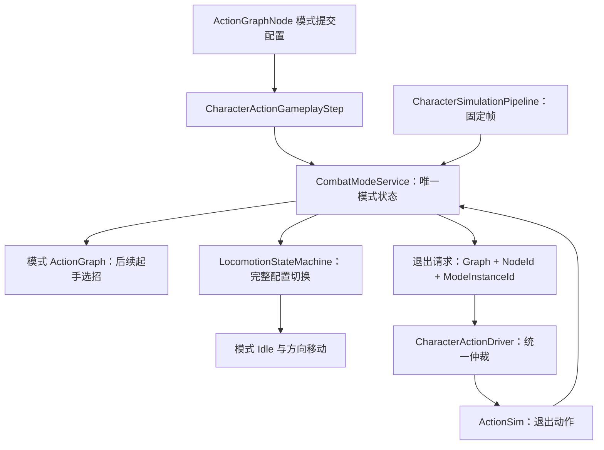
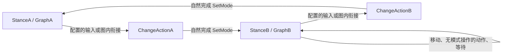

# 可复用战斗姿态与移动模式方案

> 当前需求已于 2026-10-01 收缩为固定时长 Pose Action 内移动，后续讨论以 [动作内输入移动方案](../2026.10.1/ACTION_INPUT_MOVEMENT_PLAN.md) 为准。本篇完整姿态/资源方案继续暂停，不恢复实施。

> 制定：2026-09-30  
> 修订：2026-09-30 — 姿态操作可绑定任意动作节点，不依赖大招；Vivian 本次仅落地限时 Ground/Air，永久姿态以独立框架测试验证。  
> 配置约定：支持 N 个姿态，任一时刻一个活动姿态；DurationSeconds=-1 表示永久，不另设可编辑的 Lifetime 开关。  
> 状态：2026-10-01 用户要求暂停，全部姿态方案代码（含 CM0 资源池）已撤回。本文仅保留设计，非当前实现；详见 [撤回记录](COMBAT_MODE_LIFECYCLE_IMPLEMENTATION.md)。  
> 角色：限时/永久战斗模式、模式移动与动作切换的修改方案。  
> 关联：[Locomotion 步态策略](../2026.8.9/LOCOMOTION_GAIT_POLICY_PLAN.md)、[GAS 数值重构](../2026.8.7/GAS_STYLE_COMBAT_REFACTOR_PLAN.md)。

## 0. 一句话

扩展现有 CombatModeService，以数据定义持续模式和生命周期，Action 承担有限动作，Locomotion 承担模式内待机与移动；禁止角色名判断、双份姿态真源和第二套 Action 移动状态机。

维持量统一归 NumericSystem 的自定义资源池：模式服务只申请衰减和读取资源，不再维护一份并行倒计时。资源可由动作消耗或命中回复；耗尽后生成退出请求。

## 1. 现状、问题与范围

已核对实现：

- `Assets/Scripts/Domain/Character/Combat/CombatModeEntry.cs:5` 已将 ActionGraph 与 LocomotionProfile 组合为模式。
- `Assets/Scripts/Domain/Character/Combat/CombatModeService.cs:99` 只切动画映射，移动相位仍使用初始化配置。
- `Assets/Scripts/Domain/Character/Locomotion/LocomotionContext.cs:44` 的 Profile 只读；LocomotionStateMachine 构造时绑定根运动播放器。
- `Assets/Scripts/Domain/Character/Locomotion/States/IdleLocomotionState.cs:19` 强制 Idle→Start，不能直接表达 Pose⇄四向滑移。
- `Assets/Scripts/Domain/Character/StateMachine/States/ActionState.cs:17` 锁住移动动画，Tick 清移动快照；自然结束回 Locomotion。
- `Assets/Scripts/Domain/Combat/Actions/Resolution/ActionGraphNode.cs:17` 已有节点起手行为和模式切换参数，可以扩展，不另建动画回调入口。
- `Assets/Scripts/Domain/Simulation/Action/ActionSim.cs:293` 的 EndCurrent 统一产生 Stopped，自然完成、取消和强制停止尚未形成足够明确的模式提交契约。
- `Assets/Scripts/Domain/Simulation/Replication/ActorReplicationSnapshot.cs:9` 当前构造字段没有完整模式生命周期状态。

| 范围 | 目标 |
|---|---|
| 必做 | 定时/无限模式、模式动作图、完整移动配置、定时退出动作、动作主动切换、打断清理、预测与复制 |
| 首个配置案例 | Vivian GroundPose 禁止移动，AirPose 四向移动，均超时播放对应 Cancel |
| 框架复用验收 | 独立测试配置中，任意配置了模式操作的动作可进入/离开无限期姿态；未配置模式操作的动作、移动和等待不改变模式。不是 Vivian 的角色需求 |
| 其他复用案例 | 无时限武器模式、限时变身、静止架势、移动瞄准；通过配置而非角色分支实现 |
| 不做 | 真正三维飞行、异常伤害系统、无限层模式叠加、任意脚本表达式条件、重写动作图 |

本方案的 Air 是战斗与移动模式，不等于 Motor 离地。真实悬空高度、重力和空中碰撞另需垂直运动设计。

角色落地与框架能力分开：Vivian 本次只配置 Ground/Air 的进入、保持、移动及超时收姿，不增加永久姿态或大招切姿态。Unlimited 属于共享框架能力，以测试夹具验证，不要求新增另一个生产角色或修改 Vivian 的大招。

## 2. 原则

1. 模式与 Action/Locomotion 顶层状态正交：在同一模式内攻击后可返回该模式的待机。
2. 扩展 CombatModeService 为模式唯一真源，不另建相互写入的 StanceService。
3. 模式差异通过 Profile、Policy 和图配置装配；禁止 Vivian/Ground/Air 等具体身份判断进入状态机。
4. Gameplay 由 SimulationWorld/InputFrame 固定逻辑帧驱动，禁止 Update、协程、动画结束回调成为计时权威。
5. 同一帧只能有一个系统输出主体动画和基础移动：Action 活跃时由 Action 接管，返回 Locomotion 后再恢复模式移动。
6. 零长期兼容；旧标识、只换 Clip 的切换路径与替代入口在迁移完成时删除。
7. 本轮仅文档；Agent 不直接修改 Assets/Data、Prefab、场景、动画及 meta。资产迁移由 Editor 步骤执行。

## 3. 目标架构与契约

以下新增方法及状态均为提案；现有类型保留其层级依赖。

### 3.1 模式配置与稳定标识

扩展 CombatModeEntry：

| 配置 | 契约 |
|---|---|
| ModeId / DisplayName | 角色配置内稳定整数 ID 与显示名，Default 显式引用；不是数组下标、字符串哈希或 Unity InstanceID |
| ActionGraph | 模式内后续输入选招图，可与其他模式共享 |
| LocomotionProfile | 完整移动和动画配置，必填 |
| DurationSeconds | 未绑定自定义维持资源时的便捷配置：-1 不生成维持资源；正数构建为专用资源及衰减。0、其他负数、NaN/Infinity 校验报错；绑定自定义资源时不参与运行时计算 |
| MaintenanceResource | 角色稳定资源 Id；可被不同模式共享，空值才使用 DurationSeconds 的便捷配置 |
| DrainMilliPerSecond | 当前模式维持资源的每秒衰减，允许零；按固定帧累积余量，不按渲染帧计时 |
| EntryResourcePolicy | 保留、设为指定值或增量补充；共享资源不默认补满 |
| TimerPolicy | 是否在 Action/HitStop 中暂停；固定帧实现，无输入方向变化重置计时 |
| ExpiryPolicy | 到期进入 ExitPending；按安全边界执行退出，或通过既有合法打断规则执行，不绕开 ActionSim |
| ExitAction | 通用 RequestExit 使用的收姿动作，显式 Graph + NodeId 引用；不可依赖切换后 ActiveGraph 恰好含同名节点 |
| ExitTargetMode | 通用退出完成后的模式，通常 Default；不限制动作主动 SetMode 的目标 |
| ReentryPolicy | 同模式请求采用 KeepRemaining 或 Refresh；切换请求携带唯一提交身份，重放不重复刷新 |
| Hit / PartyExit 策略 | Reset 或 PreserveRemaining；死亡固定清理；保留时后台不隐式启动动作 |

用 CombatModeId 替代封闭的 CombatModeType 枚举；迁移可保留原数值 0/1/2 的配置身份，但删除 enum API 双轨。ID 在角色内容目录内解析，网络使用经过一致性校验的角色目录+稳定 ID。

每个角色可配置 N 个模式，任一时刻只有一个活动模式；不存在 A/B 两槽限制或“自动切到另一个”的隐式逻辑。每次 SetMode 显式指定任意有效目标，允许 A→B→C→A、A→C 等配置关系。需要武器×姿态组合的角色配置组合条目并共享 Profile/Graph；不引入没有实际需求的运行时叠加优先级系统。

本文 Timed/Unlimited 仅为作者配置语义，不是独立开关。DurationSeconds=-1 且未绑定资源时，不生成自动退出维持条件；资源池值始终为非负，不能把 -1 写入资源。正数时长向上取整到逻辑帧后构建专用资源，资源量为帧数×1000、每帧消耗 1000，并校验容量不溢出。资源为唯一维持量，模式中不再保存 RemainingFrames。零衰减资源仍可被技能主动消耗到零，因此不等于无维持条件的永久模式。

### 3.2 模式状态与动作边界

CombatModeService 持有 CurrentModeId、ModeInstanceId、维持资源绑定、Active/ExitPending/Exiting 阶段、退出动作实例身份和未提交请求。NumericSystem.Resources 持有资源值及衰减余量；模式与动画层均不持有第二份倒计时。

在固定帧相关消耗、周期衰减和命中回复结算后检查资源是否为零。因资源耗尽产生的 ExitPending 在退出动作尚未开始且资源回升时可撤销；Exiting 不因回复中断，手动退出请求也不被资源回复撤销。退出模式后停止其衰减；衰减暂停策略沿用固定帧及卡肉约束。

- 节点模式操作增加明确提交点：OnBegin、AtFrame、OnNaturalEnd。详细语义见 §3.6；统一走逻辑事件，不由 ActionState.Exit 或动画结束回调推断。
- Vivian 的 Ground/Air 收尾自然完成时提交相应模式；被打断不提交。此操作必须先于 Locomotion 恢复与下一次输入选招，防止一帧普通 Idle 或从旧图起手。
- Action 已开始后，其 Graph/Node 继续绑定当前实例；换模式只影响后续起手，不能重解释旧节点的自动衔接。
- 同帧仲裁固定为：死亡/强制退场/必须受击处理优先；到期退出请求先于新的普通输入起手。无法合法打断正在执行的动作则保持 ExitPending，阻止无限连招饿死退出。
- 开始退出动作时标记 Exiting，停止模式倒计时且只发起一次。退出动作正常完成才应用目标模式；被受击、死亡、退场打断时按生命周期策略清理，不能永远停在 Exiting。
- 没有 ExitAction 的模式可在安全边界直接切目标模式；有 ExitAction 的模式禁止以“恢复 Idle”绕过它。
- 图内部生命周期动作使用经过校验的显式请求，不伪造玩家 Dodge 输入、不为退出动作创建无意义的按键 Entry。仍经过统一动作可执行检查、实例事件和费用规则；配置校验要求收姿动作无资源费用。
- 动作内的自然结束与自动衔接提交应在现有固定帧管线内增加明确协调点；不能依赖事件订阅先后。新模式本帧提交后从下一逻辑帧开始扣时，消除首帧差一。
- RequestExit 负责“播放配置的收姿，再应用目标模式”；SetMode 负责“当前动作已承担转换表现，在指定点直接提交目标模式”。两者共用服务与提交队列，直接切换模式不自动追加原模式的收姿动作。

### 3.3 完整 Locomotion 切换

增加统一 ApplyProfile 入口，在进入 Locomotion 前同时应用动画映射、相位时序、步态/速度/朝向策略、位移轨迹、足步与相位恢复数据。旧模式轨迹、落脚计时和临时恢复请求不能泄漏；验证完成后原子提交，失败不留下半套配置。

LocomotionProfile 增加有限且明确的策略：

- MovementPolicy：Disabled / Enabled。Disabled 时固定 Idle，不读取移动输入触发起步，但攻击输入仍由 ActionDriver 处理。
- PhasePolicy：现有 GroundedPhases / DirectMove。DirectMove 使用 Idle⇄Gait，复用现有方向解析；不经过 Start/Stop/Pivot，不伪造地面足步。
- Idle/Move 播放策略：Loop 或 HoldLastFrame；移动循环按逻辑采样周期运行，姿态持续时长与 Clip 长度分离。先验证 Clip 首尾是否适合循环，不能只依据 Pose/Move 文件名。
- 保留现有步态上限、方向滞回与朝向配置。Air 选择固定步态与相对朝向四向选片；普通模式保持现有起步和跑步行为。

Action 活跃时完整模式配置可准备好，但不抢写 Action 动画/电机；进入 Locomotion 的边界再激活移动相位。网络恢复例外通过统一 Restore 路径先应用模式配置、再恢复相位，而非简单重置 Idle。

### 3.4 Vivian 配置映射

| 模式 | 移动 | Idle | 到期动作 | 目标 |
|---|---|---|---|---|
| Default | 现有普通移动 | 普通 Idle | 无 | — |
| GroundPose | Disabled | Attack_Branch_Ground_Pose_Inplace | Attack_Branch_Ground_Cancel_Inplace | Default |
| AirPose | DirectMove、四向 | Attack_Branch_Air_Pose_Inplace | Attack_Branch_Air_Cancel_Inplace | Default |

Air Move 映射四个 Attack_Branch_Air_Move 动画。姿态内攻击通过对应图的输入入口选择；Pose 不需要长期占用 Action 节点。现有 Main→Ground/Air 收尾 AutoTransition 保留。不要把 Ground/Air 收尾自动连入一个无限 Pose Action，否则无法使用模式 Locomotion。

Ground 禁止移动是本方案示例默认；后续若实测需要 Ground 移动，只改其模式配置。持续时间和实际提交帧由录屏/Editor 预览确定，本方案不虚构数值。

### 3.5 复制、恢复与校验

模式 ID、实例身份、资源值及衰减余量、生命周期阶段和必要的待提交状态进入权威快照与本机预测保存；远端先解析模式内容再应用动画键。扩展 ActorReplicationSnapshot、Codec、内容目录、预测恢复与 RemoteCharacterProxy；修改所有 Copy/With/相等/差量路径，不能新增字段后在复制构造中丢失。ResourcePoolSet 的 Capture/Restore 仅是容器契约，不代表网络接线已完成。

恢复是直接安装状态，不重放进入副作用、不重复扣费、不刷新计时。计时规则、打断规则和提交顺序均用同一固定帧逻辑执行。配置门禁覆盖重复/缺失 ID、悬空目标模式、无效图节点、非法计时、缺失播放时序和不可退出的配置。

### 3.6 动作主动切换与提交时机

在 ActionGraphNode 增加单个可选 `CombatModeOperation`：OperationKind 为 SetMode / RequestExit，包含 TargetModeId（仅 SetMode）、Trigger、Frame（仅 AtFrame）。第一阶段每个节点最多一个模式操作，复杂动作拆成已有图节点，不提供任意多条互相覆盖的模式事件。每个操作由节点身份与动作实例共同识别。

模式操作不检查 Ultimate 意图、技能槽或角色身份。普通攻击、技能、闪避、连招派生、自动衔接节点均可按需配置；没有配置操作的动作不会因其类型而隐式切换姿态。

| Trigger | 精确定义 | 被打断后的结果 |
|---|---|---|
| OnBegin | 起手通过检查且扣费成功，Started 逻辑事件提交 | 模式已经改变，不因随后被打断而自动撤销 |
| AtFrame | 首次跨过指定有效动作帧，Frame 必须满足 0≤Frame<TotalFrames；Frame=0 随起手事件处理 | 到该帧前被打断不切换；已提交后按模式受击策略处理 |
| OnNaturalEnd | 动作达到自然完成边界，包含 AnimationEnd 自动衔接；提前 Cancel、提前 AtFrame/OnHit 衔接、Stop、受击打断不触发 | 未自然完成则不切换 |

`OnNaturalEnd` 针对当前节点，不能推断多节点技能整体完成；需要整段动作链完成才切换时，在最后节点配置。片段剪辑时由 Editor 显示全局动作帧并校验模式操作范围。

ActionSim 增加可辨别的结束原因契约（拟议 `ActionEndReason`），让 Stopped 事件携带原因。所有 EndCurrent 调用方必须显式给出原因；不得仅用“当前 Frame 等于某值”推断自然结束。Simulation 层只产生通用开始/帧推进/结束事件，不反向依赖 CombatModeService。

CharacterActionGameplayStep 读取绑定到动作实例的节点操作并生成请求；CombatModeService 统一校验并提交。表现 Timeline 只读结果，不再另设 SwitchMode 通知入口。ActionDefinition 不保存角色模式 ID，确保同一动作可供不同角色/图复用。

同帧顺序约束：必须受击/死亡等高优先决策先于尚未提交的模式请求；成功提交新模式会清除属于旧 ModeInstanceId 的到期请求。新的普通起手必须在模式提交之后解析。正在播放的动作及其已经排队的图内衔接继续使用绑定的原图；禁止切模式后在另一张图里重新查询同名节点。

每个请求携带 SourceActionInstanceId、SourceModeInstanceId 与 OperationKey。过期请求丢弃；同一提交身份在当前模拟历史中至多应用一次。回滚时恢复消费状态并按同一输入确定性重演，不能使用跨历史永不清理的全局去重表跳过合法重演。

### 3.7 多姿态与永久姿态通用测试配置（非 Vivian 需求）

“永久”仅指不因时间自动退出，并非跨死亡、关卡重建自动持久化。受击/切人行为由 Profile 明确配置，死亡与重新生成使用 Default。

| 配置 | StanceA | StanceB |
|---|---|---|
| DurationSeconds | -1 | -1 |
| ActionGraph | GraphA | GraphB |
| 示例触发动作 | ChangeActionA | ChangeActionB |
| 节点模式操作 | SetMode(StanceB, OnNaturalEnd) | SetMode(StanceA, OnNaturalEnd) |
| 未配置模式操作的动作结束 | 回本姿态的 Locomotion | 回本姿态的 Locomotion |
| 受击/切人示例 | PreserveRemaining | PreserveRemaining |

模式操作总是写显式目标，不提供含糊的 Toggle。Unlimited 的配置不要求填写到期动作和目标，校验不能把它误判为无法退出；如需手动通用退出，才配置 ExitAction/ExitTargetMode。示例中的 ChangeActionB 自身承担转换表现，不再追加独立收姿。两个触发动作可以使用不同输入，也可以通过自动衔接到达，不要求同键往返。

上表只是两条转换的局部示例；独立测试必须另加入 StanceC，覆盖 A→B→C→A 和 A→C，证明不存在两姿态假设。每个目标模式拥有自己的时长、动作图和移动配置，永久与限时可以混合配置。

### 3.7.1 姿态切换动作的归属

切换动画仍是普通 ActionDefinition，由 ActionGraphNode 承载明确的模式操作；不为所有姿态自动生成一套互相组合的转换动作。

- 已有攻击/技能兼任转换：在其节点指定 SetMode(TargetModeId) 和提交时机，不再自动插入另一段变姿动画。
- 专门的转换动作：在来源图配置转换节点，可由输入、Cancel 或 AutoTransition 到达；节点在指定时机提交目标，动画由 Action 持续播放至完成。
- 不同来源需要不同转换表现：来源图分别引用 AToC/BToC 动作，目标同为 C；需要共享则复用同一 ActionDefinition，不强制 N×N 资产。
- 无独立转换动画：在已有节点的逻辑边界提交目标，不创建空动作占位。
- 定时收姿：由模式的 RequestExit 启动 ExitAction，完成后切 ExitTargetMode；同一退出动作不再另配重复 SetMode，Editor 校验拒绝两个提交所有者。

模式提交前，查询仍返回来源模式；提交后返回目标模式，但当前 Action 的图、时间轴和动画继续绑定原实例。目标 Locomotion 在退出 Action 后接管。不同提交时机的打断结果按 §3.6 执行。

同一输入仍只消费一次；模式切换后不把本次输入重新派给新图。动作资源检查和扣费仍由 Action 的原有规则负责：资源不足时没有 Started，也不能切换模式。转换动画中途应生效的配置改用 AtFrame，而不改框架代码。

### 3.8 修改文件与层级边界

以下为实施清单，新增名称为拟议名称，实施时在相应层级建立单一实现。

| 文件/类型 | 修改职责 |
|---|---|
| Domain/Combat/CombatModeTypes.cs、ICombatModeService.cs | 以稳定 CombatModeId 替代封闭枚举，统一模式查询/请求契约 |
| Domain/Character/Combat/CombatModeEntry.cs、CharacterCombatModes.cs | 生命周期、退出策略、稳定 ID 和角色级跨图校验 |
| Domain/Character/Combat/CombatModeService.cs | 模式唯一状态、整数计时、提交/退出及 Capture/Restore；移除直接操纵动画配置的旧职责 |
| Domain/Combat/Actions/Resolution/ActionGraphNode.cs、拟议 CombatModeOperation.cs | 节点模式操作配置，不把角色模式绑定写入 ActionDefinition |
| Domain/Simulation/Action/ActionSim.cs、ActionSimEvent.cs、拟议 ActionEndReason.cs | 明确自然结束/替换/停止等原因，保留通用动作事件边界 |
| Domain/Character/Combat/CharacterActionGameplayStep.cs、CharacterActionDriver.cs | 模式请求产生、内部退出动作解析和动作合法性仲裁 |
| Domain/Character/CharacterSimulationPipeline.cs | 固定计时、模式提交与输入/动作结束的确定性顺序 |
| Domain/Character/Locomotion/CharacterLocomotionProfile.cs、LocomotionContext.cs、LocomotionStateMachine.cs 及相位类 | 完整 ApplyProfile、Disabled/DirectMove、播放周期与恢复 |
| Domain/Character/Party/CharacterPartyLifecycle.cs 及死亡接入处 | 明确清理、保留和重新激活规则 |
| Domain/Simulation/Replication/ActorReplicationSnapshot.cs、ActorReplicationSnapshotCodec.cs；预测/内容目录/RemoteCharacterProxy 消费者 | 模式状态复制、差量、回滚和远端选片；所有复制构造必须传播新增字段 |
| Editor/Combat/ActionGraph/ActionGraphEditorWindow.cs、ActionGraphInspector.cs、Editor/Character/CharacterAuthoringFields.cs | 模式目标、触发点、帧与内部退出节点选择；重排/保存恢复不得丢字段 |
| Assets/Tests 下新增模式测试与相关既有测试 | 固定帧边界、姿态复用、输入消费和同步回归 |

保持 asmdef 层级不变；Simulation 不读取角色 ScriptableObject 或调用 Character 服务。模式配置解析与组合放在 Character/装配边界，模式 ID 等共享值类型放在允许的下层契约中。

## 4. 分阶段交付

### CM0 — 资源前置切片

**任务**

- [ ] NumericSystem 统一持有 ResourcePoolSet；CharacterResourceConfig 配置稳定 Id、上限和初值。（实现已撤回）
- [ ] ActionResourceSpec 接入自定义起手费用与命中回复，重复费用合并并原子检查。（实现已撤回）
- [ ] 实现显式 Drain API 的整数余量及 Capture/Restore。（实现已撤回）

**验收**

- [ ] 当前实现验收；此前 14 项辅助检查属于已撤回代码，不能作为现状证据。
- [ ] Unity 编译与 ACTGame.Domain.EditModeTests 的 Test Runner 验证。

**出口：** **已暂停，资源前置代码已撤回。**

### CM1 — 稳定模式配置与生命周期

**任务**

- [ ] 替换 CombatModeType API，扩展 CombatModeEntry、CharacterCombatModes、CombatModeService 与校验。
- [ ] 增加有限生命周期阶段、资源维持绑定、重新进入资源策略与捕获/恢复契约；不新增独立 RemainingFrames。
- [ ] 用 DurationSeconds=-1 推导 Unlimited、正数推导 Timed；删除独立 Lifetime 开关设计。SetMode/RequestExit 保持独立操作语义，无限模式不强制填写自动退出配置。

**验收**

- [ ] 新增 CombatModeLifecycleTests：超时只提交一次、同模式 Keep/Refresh、卡肉暂停、恢复后剩余帧一致。
- [ ] 新增第三种模式仅靠配置，无需修改框架枚举或角色判断。
- [ ] Unlimited 连续推进大量逻辑帧不产生超时请求；Timed 边界 N-1/N/N+1 行为无一帧偏差。
- [ ] -1 不生成自动耗尽条件；0、其他负数、NaN/Infinity 被拒绝；资源衰减余量在恢复后保持；覆盖至少三种姿态与任意显式目标选择。

**出口：** 模式是唯一可恢复状态，现有普通模式行为保持。→ **未达成**

### CM2 — 完整移动配置与姿态播放

**任务**

- [ ] 依赖 CM1 的稳定模式配置和状态契约。
- [ ] 实现统一 ApplyProfile，删除 CombatModeService 中只替换 Clip 的路径。
- [ ] 修改 LocomotionContext、LocomotionStateMachine 及相位策略；实现 Disabled/DirectMove 和循环/末帧保持。

**验收**

- [ ] 新增 LocomotionModeSwitchTests：无输入 Pose、四向输入选片、停止回 Pose、地面起步不泄漏、切换不残留旧轨迹。
- [ ] 运行现有 LocomotionGaitPolicyTests、LocomotionIntegerClockTests、LocomotionDirectionModelTests 对应回归。

**出口：** 同一移动系统支持普通移动与姿态移动。→ **未达成**

### CM3 — Action 进入与退出协调

**任务**

- [ ] 依赖 CM1/CM2；实现 OnBegin/AtFrame/OnNaturalEnd，给全部动作结束路径补明确原因。
- [ ] 扩展节点模式提交点与逻辑结束原因，接入 CharacterActionGameplayStep、CharacterActionDriver、CharacterSimulationPipeline。
- [ ] 实现 ExitPending/Exiting 请求仲裁、死亡/受击/退场清理，移除被取代的 pending-mode 提交入口。
- [ ] Editor 提供模式和退出节点选择器，禁止依靠手填目标导致静默失败。

**验收**

- [ ] 新增 CombatModeActionBoundaryTests：收尾完成无普通 Idle 闪帧；收尾被打断不入姿态；移动不刷新计时。
- [ ] 到期与攻击同帧、退出被打断、死亡、退场分别得到确定结果，无重复退出与永久 Exiting。
- [ ] 新增 CombatModePermanentSwitchTests：独立测试动作 A 切到模式 B、等待/无模式操作动作保持 B、测试动作 B 切回模式 A；一次输入不重复起手。参数化覆盖普通攻击、技能、闪避及自动衔接节点，不依赖 Ultimate。
- [ ] 三姿态测试覆盖 A→B→C→A、A→C；专用转换动作、攻击兼任转换和定时退出都只提交一次目标。
- [ ] 指定帧 F 前打断不提交，F 提交一次，F 后打断按模式策略保留/清理；资源不足不起手、不切模式。
- [ ] AnimationEnd 自动衔接可触发自然完成操作，提前 Cancel/Stop 不触发；新模式不会重解释旧动作节点。
- [ ] Graph Editor 保存、节点重排、重新打开后模式操作及目标不丢失。

**出口：** 可完整演示 Vivian 两条限时姿态路径；独立测试证明任意配置动作可切换永久姿态，不扩展 Vivian 技能需求。→ **未达成**

### CM4 — 预测复制与角色配置验收

**任务**

- [ ] 依赖 CM1～CM3；所有运行时模式字段纳入预测/权威状态设计。
- [ ] 扩展快照、编码、目录、预测保存/恢复与远端呈现，协议同步升级，无旧/新协议双跑。
- [ ] 完成所有模式引用的 Editor 迁移；更新架构/技术文档和已实现条目。

**验收**

- [ ] 新增模式快照往返、差量与重演测试，扩展 ActorReplicationSnapshotTests、LocomotionSavedStateTests、RemoteCharacterProxyTests。
- [ ] Host/Owner/Remote 对同一输入序列的模式、退出帧和动画键一致，重复校正不重启 Pose。
- [ ] 普通角色回归及 Vivian 双姿态通过 Play 验收；Unlimited 和不同动作类型切换通过独立测试夹具验证，不要求新增生产角色或 Vivian 永久姿态资产。
- [ ] 切换提交帧前后回滚重演结果一致；重复快照不刷新计时，不跳过应重演的模式操作。
- [ ] `rg` 验证旧 CombatModeType、SwitchCombatMode 起手专用分支及被替代 pending-mode 入口无运行时消费者；Unity 编译确认迁移完成。

**出口：** 本地、预测、远端共用该能力，可配置复用。→ **未达成**

## 5. 迁移与删除

| 现状 | 迁移终态 |
|---|---|
| CombatModeType 封闭枚举 | 稳定 ModeId，迁移所有资产引用与 Editor 字段后删除旧枚举/API |
| CombatModeService 只换 Clip | 完整配置事务；删除原分支 |
| 分散的 pending-mode 应用 | 统一动作边界提交；删除被替代入口，保留“下一次 Locomotion 生效”的配置语义 |
| ActionGraphStartBehaviorType.SwitchCombatMode 及专用 target/policy 字段 | 迁移到 CombatModeOperation 后删除该枚举成员、字段和执行分支；FaceBufferedMoveIntent 等其他起手行为保留 |
| 同一 Stopped 事件没有模式所需的结束语义 | 所有结束调用给出明确原因，模式提交只读取通用逻辑事件 |
| 强制 Idle→Start | 配置驱动相位策略；普通模式使用 GroundedPhases |
| 若临时配置了 Pose Action 链 | 迁为模式 Idle，保留真实攻击/收尾/Cancel Action；按具体资产授权人工迁移 |

不保留 Compat、Legacy、角色专用运行时补丁或两套模式字段。

## 6. 风险与对策

| 风险 | 对策 |
|---|---|
| 配置切换导致脚步/根运动跳变 | 原子重置旧状态；恢复时先装模式再还原精确相位 |
| 动作自然结束与模式提交顺序冲突 | 明确固定帧协调点与结束原因，覆盖自动衔接边界测试 |
| 正在攻击时到期 | ExitPending 等合法边界，禁止普通新动作饿死退出 |
| Clip 不循环或接缝明显 | 验证 Loop/Hold 策略及导入设置，禁止虚构播放效果 |
| 网络状态缺失 | 完整快照/差量/校正/远端一起验收，不能只测本地 |
| 永久姿态被当成超长倒计时或负资源 | -1 只用于时长作者配置，不写入资源池；资源值及衰减余量参与复制 |
| 变身动作重复回调或回滚导致往返错乱 | 显式 SetMode 目标，操作身份去重状态随模拟历史恢复 |
| 资产和脚本迁移不同步 | 同批人工迁移和门禁，不在缺失 Profile 时静默使用旧配置 |

## 7. Editor 人工步骤

1. 在明确资产授权后迁移角色模式 ID；配置 Default/GroundPose/AirPose 和退出目标。
2. 创建/指定对应 LocomotionProfile；Ground 禁移动，Air DirectMove，绑定 Pose 与四向 Move，校验帧时序与循环接缝。
3. 保留 Main 的 AutoTransition；Ground/Air 收尾节点配置自然结束提交模式。
4. 对应模式图配置姿态内攻击入口；两条 Cancel 动作不扣资源，通过显式退出引用启动。
5. Play 路径：Attack04→Ground/Air→Pose；Air 四向移动与停下；到期 Cancel→普通 Locomotion；持续输入移动时自然进入普通移动。
6. Vivian 配置到此仅包含 Default/GroundPose/AirPose，不添加永久姿态或大招模式操作。独立夹具配置 StanceA/StanceB/StanceC，-1 表示永久，可与正数时长混用；模式切换动作不限类型、不要求同一输入。
7. 使用独立测试动作验证 OnBegin/AtFrame/OnNaturalEnd 的打断差异；Editor 选择目标模式而非自由输入角色专用名称。
8. 覆盖攻击、卡肉、受击、死亡、切人和网络校正。Test Runner 运行 CM1～CM4 新增类与所列既有回归；实际程序集以新增测试目录 asmdef 为准。

Unity 编译与 Test Runner 为权威。项目已在 Editor 打开时不得启动同目录 batch mode；优先 Unity MCP，不可用则人工 Test Runner。本轮未执行测试。

## 8. 开工顺序

先完成 CM1 的单一模式状态，再以 Air Pose⇄四向移动为 CM2 最小切片，接入定时 Cancel 和 Ground 配置，最后完成复制与全部角色迁移；CM4 未通过不宣称系统改造完成。

## 9. 变更日志

- 2026-09-30：基于现有实现制定跨角色复用方案；未修改业务代码或 Unity 资产。
- 2026-09-30：补齐永久姿态大招往返、三种提交时机、SetMode/RequestExit 区别、结束原因、文件影响清单及回滚验收；所有阶段仍未实施。
- 2026-09-30：按用户澄清修正上一修订：永久姿态示例泛化为任意动作节点操作，大招不作为特殊条件或必验角色用例；Vivian 本次仅实现限时 Ground/Air，永久姿态由独立框架测试覆盖。
- 2026-09-30：明确 N 姿态、DurationSeconds=-1 永久语义，撤销独立 Lifetime 开关；补充转换动作归属、三姿态测试和 -1 复制校验。
- 2026-09-30：用户授权实施资源驱动方案；完成 CM0 资源代码及辅助检查，模式核心补丁被自动审批阻止，未配套模式类型改动已撤回。Unity 编译、模式接线和网络复制均未完成。
