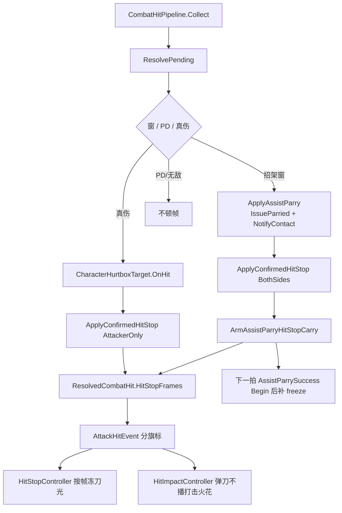

# 弹刀卡肉收敛 — 接触确认后双方停顿

> 制定：2026-09-05  
> 角色：**弹刀成功卡肉**的结构/排期真源（先文档，后实现）；不改写换人裁定  
> 相关：  
> - 极限支援真源：[`../2026.8.30/PARTY_SWITCH_ASSIST_PLAN.md`](../2026.8.30/PARTY_SWITCH_ASSIST_PLAN.md)  
> - 受击档（已关）：[`../2026.9.3/HIT_REACTION_IMPLEMENTATION_PLAN.md`](../2026.9.3/HIT_REACTION_IMPLEMENTATION_PLAN.md) — 被弹刀仍走 `IssueParried`，禁止改回冲击力裁定  
> - 装配链：`CombatHitPipeline.ResolvePending` → `ActionSim.RequestHitStop` → `AttackHitEvent` → `HitStopController` / `CharacterActionPresentationBridge`

---

## 0. 一句话

在 **`CombatHitPipeline` 结算成功之后**用同一套 `ActionSim.RequestHitStop` 写双方 `freezeFrames`；真伤只冻攻击者，弹刀冻敌人新受击招 + 玩家 Guard，并把剩余帧带到 `AssistParrySuccess`。禁止把弹刀改回 `CharacterHurtboxTarget.OnHit`，禁止并排第二套卡肉状态机，禁止 `if (敌人)`。

---

## 1. 问题与动机

### 1.1 现状基线

```text
SimulationHost.StepOnce
  World.Step                    // Actor.Step：出招、Collect
  CombatHitPipeline.ResolveBeforePostCombat
    招架窗 → ApplyAssistParry
      ConfirmHit
      IssueParried → EnterHit → HitState.Enter
        ActionSim.Stop（进攻招）
        TryStart（受击招，Begin 清 freeze）
      NotifyAssistParryContact → 排队 AssistParrySuccess
      不 RequestHitStop
    真伤 → Target.OnHit → Grant → RequestHitStop（仅攻击者当前招）
  World.ResolvePostCombat
  CompleteFrame → PublishAttackHitCommand
    AttackHitEvent(AbsorbedByPerfectDodge = PD || 弹刀)

下一拍 Actor.Step
  注入 AssistParrySuccess
  Driver.TryPriorityInterrupt → ActionSim.Begin（再清 freeze）
```

| 点 | 现状 |
|----|------|
| 接触确认 | `Collect` 已成立；结算枢纽是 `ResolvePending`，不是 `Hurtbox.OnHit` |
| `OnHit` | 只算伤写血；弹刀窗内早退，故意不走 |
| 真伤卡肉 | `Feedback.UseHitStop` 才 `RequestHitStop`，只冻攻击者 |
| 弹刀卡肉 | 无写入；`EnterHit` 停进攻招后 freeze 已被清掉 |
| 事件旗标 | `PublishAttackHitCommand` 把弹刀并进 `AbsorbedByPerfectDodge` |
| VFX 卡肉 | `HitStopController` 只认 `UseHitStop`；没勾盒则刀光不冻 |
| 受击火花 | `HitImpactController` 只跳过 PD；弹刀会误走打击火花 |
| 本机预测 | `AfterLogicStep` 只镜像 `NotifyAssistParryContact`，不写 freeze |
| 客机预测卡肉 | `PredictedHitStopConsumer` 只服务本机进攻盒，打不到「敌人打玩家」 |

### 1.2 痛点

1. 弹刀成功双方都应停顿，但结算早退把共用顿帧一起跳过了。  
2. 若在 `ApplyAssistParry` 里再抄一段 `RequestHitStop`，会变成两条卡肉链路，时长 / oncePerAction / 事件会对不齐。  
3. 把弹刀塞进 `Hurtbox.OnHit` 会重新扣血、走冲击力、可能 Flinch/EnterHit，破坏 P-SW2 吞伤契约。  
4. `IssueParried` 换实例、`AssistParrySuccess` 再 `Begin`，不处理时序则 freeze 写上去也会被清掉。

### 1.3 目标

| 目标 | 说明 |
|------|------|
| 结构 | 裁定分支保留；顿帧在结算末尾 **一个** `ApplyConfirmedHitStop` |
| 可玩 | 金光弹刀接触后，敌人受击片与玩家 Guard/Success **同时停**，再继续 Success / Stun |
| 可测 | EditMode：弹刀双方 `FreezeFrames`；真伤仍只冻攻击者且仍受 `UseHitStop` 门控 |
| 不做 | 玩家/敌人 `OnHit` 做弹刀；`HitReactionKind.Parried`；顶层 Parry 状态；客机预测敌人打玩家卡肉；改 Data/Prefab |

---

## 2. 设计原则

1. **接触确认 ≠ OnHit**：`Collect` / `ResolvePending` 是命中成立点；`Hurtbox.OnHit` 只负责真伤数值。  
2. **一条写入 API**：逻辑卡肉只走 `ActionSim.RequestHitStop`；表现跟 `FreezeFrames` / `AttackHitEvent.HitStopFrames`。  
3. **先裁定，后顿帧**：弹刀仍早退伤害/Grant；`IssueParried` **之后**再冻新受击实例。  
4. **双方停是多一个目标，不是第二套系统**：真伤 `AttackerOnly`；弹刀 `BothSides`。  
5. **零长期兼容**：删掉 `PD \|\| 弹刀` 的事件合并；不留旧 Publish 语义。  
6. **锁步边界不变**：权威仍在 Pipeline；本机预测只镜像已结算的接触 + 帧数。  
7. **差异在窗 / 盒 Feedback，不在身份 if**：弹刀帧读玩家 `AssistParryWindow.hitStopFrames`；真伤仍只认进攻盒 `UseHitStop`。无窗回退代码常量 8。

---

## 3. 目标架构

```text
ResolvePending（已 Collect）
  ├─ 招架窗 → ApplyAssistParry
  │     不 OnHit / 不 Grant
  │     IssueParried → EnterHit（新受击实例）
  │     NotifyAssistParryContact
  │     frames = AssistParryHitStop.ResolveFrames(player)
  │
  ├─ PD / 仅无敌 → 早退，不顿帧
  │
  └─ 真伤 → OnHit + Grant
        frames = UseHitStop ? HitStopFrames : 0

  两支汇合（frames>0）
    ApplyConfirmedHitStop(hit, frames, once, scope)
      AttackerOnly：HitReceiver + 原 ActionInstanceId
      BothSides：
        攻击者当前实例（EnterHit 之后）
        玩家当前 Guard
        ArmAssistParryHitStopCarry(frames)

下一拍玩家 StepActionClock
  允许且仅允许 AssistParrySuccess 硬打断
  Begin 清 freeze → NotifyActionBegun 把 carry 写回 Success
  其它 PriorityInterrupt / 移动取消：IsFrozen 则拒绝
```



### 3.1 关键契约

```text
Input  → 已 Collect 的 CombatHitEvent + 玩家当前招架窗
Output → 双方或单方 ActionSim.freezeFrames
       → ResolvedCombatHit.HitStopFrames / AbsorbedByAssistParry / AbsorbedByPerfectDodge
       → AttackHitEvent 同上（禁止再把弹刀并进 PD）

AssistParryHitStop.ResolveFrames(player / window)
  当前招有生效 AssistParryWindow → window.HitStopFrames（0 表示不冻）
  无窗 / 无活动招 → DefaultFrames（8）
  真伤不走此解析：没勾 UseHitStop 则 0

ApplyConfirmedHitStop
  只写当前 IsActive 实例；无实例则跳过该侧（不另做 HitState 帧冻结双轨）
```

### 3.2 时序定案（必须按此实现）

接触发生在 **Actor.Step 之后** 的 `ResolveBeforePostCombat`。

| 时刻 | 敌人 | 玩家 |
|------|------|------|
| 接触帧 Combat | `IssueParried` 已 `Begin` 受击招；对其 **新** `InstanceId` 写 freeze | Guard 仍在；对当前实例写 freeze；排队 Success；记下 carry |
| 接触帧内 | 本帧不再 `ActionSim.Step`，freeze 尚未递减 | 同左 |
| 下一拍 Step | 受击招 `Step`：先减 freeze，片停在 frame 0 | `TryPriorityInterrupt(Success)` 允许；`Begin` 后立刻 `RequestHitStop(carry)`；再 `Step` 减 freeze |
| 卡肉期间 | 受击片不推帧 | Success 停在 frame 0；禁止普攻硬打断与移动取消 |
| 卡肉结束 | Stun 片继续 | Success clang 轨继续 |

定案理由：clang 在 Success Timeline；卡肉应停在 Success 第 0 帧，而不是把 Success 推迟到卡肉结束（那会让 clang 晚 8 帧）。不把 Guard 和 Success 合成一条「冻第 0 帧」的弹反招（P-SW2 已否决）。

### 3.3 边界（与谁正交）

| 层 | 职责 | 不负责 |
|----|------|--------|
| `CombatHitPipeline` | 裁定后调用唯一顿帧入口 | 播动画、扣弹刀伤害 |
| `AssistParryHitStop` | 帧数解析 | 写 freeze、发事件 |
| `ActionSim` | `RequestHitStop` / `Begin` 清 freeze | 知道弹刀 |
| `CharacterActor` | carry：仅 `AssistParrySuccess` 起手补写 | 自己算帧数 |
| `CharacterActionDriver` | 冻结时拒绝移动取消与非 Success 硬打断 | 写 freeze |
| `HitStopController` | 按事件帧数冻攻击者 VFX | 再猜要不要顿 |
| `PredictedHitStopConsumer` | 仍只服务本机进攻盒 | 本阶段不预测弹刀几何 |

---

## 4. 范围声明

| 阶段 | 包含 | 不包含 |
|------|------|--------|
| HS0 | 帧数解析器 + 单测 | 改 Pipeline / 事件 |
| HS1 | Pipeline 汇合写入；弹刀双方当前实例 | Success carry、表现事件 |
| HS2 | Success carry + Driver 冻结门 | VFX / 预测镜像 |
| HS3 | 事件拆旗标、Controller、本机镜像、TECHNICAL | 客机预测敌人打玩家、改盒资产 |

---

## 5. 分阶段交付（任务 / 验收 / 出口）

> 勾选：未开始 `[ ]`；完成后 `[x]` 并在出口注明日期。

### HS0 — 帧数契约

**任务**

- [x] 新增 `Assets/Scripts/Domain/Combat/Hitbox/AssistParryHitStop.cs`：`DefaultFrames = 8`，`ResolveFrames` 只认招架窗  
- [x] EditMode：`AssistParryHitStopTests`（窗上配置帧；空窗 / 无招回退 8）

**验收**

- [x] `rg "class AssistParryHitStop"` 仅一处解析实现  
- [ ] Test Runner：`AssistParryHitStopTests` 全过（Editor 确认）  
- [ ] Unity 编译 / EditMode 在 Editor 确认通过  

**出口：** 弹刀时长有唯一数字来源。→ **已达成（2026-09-05，Play/Test Runner 待 Editor）**

### HS1 — Pipeline 唯一写入点

**任务**

- [x] `CombatHitPipeline` 抽出 `ApplyConfirmedHitStop`；真伤分支删除内联 `RequestHitStop`  
- [x] `ApplyAssistParry`：`IssueParried` **之后** `BothSides`；禁止对已停掉的进攻 `ActionInstanceId` 写 freeze  
- [x] 玩家侧经已有 `_actorLookup` 对 **当前** `ActionSim.InstanceId` 写入  
- [x] `ResolvedCombatHit` 增加 `HitStopFrames`（弹刀为 `ResolveFrames`，真伤为实际写入值）  
- [x] 扩展 `AssistParryPipelineTests`：双方 `ActionSim` 先 `TryStart` 最小片；接触后攻击者已 `Hit` 且双方 `FreezeFrames` 等于解析帧  
- [x] 增补真伤对照测：未勾 `UseHitStop` 则 `FreezeFrames==0`  

**验收**

- [x] `rg "RequestHitStop" Assets/Scripts/Domain/Combat/Hitbox/CombatHitPipeline.cs` 只出现在 `ApplyConfirmedHitStop`  
- [ ] Test Runner：`AssistParryPipelineTests` 含卡肉断言；玩家 `OnHitCount==0`、攻击者不满血断言仍成立（Editor 确认）  
- [x] 无受击片时攻击者 `ActionSim` 已 Stop：该侧跳过写入，测试覆盖「不抛、不另开 HitState 冻帧」  

**出口：** 接触帧双方逻辑时钟已停；Success 由 HS2 续冻。→ **已达成（2026-09-05，Test Runner 待 Editor）**

### HS2 — Success 续冻与冻结门

**任务**

- [x] `CharacterActor.ArmAssistParryHitStopCarry(int frames)`；`NotifyActionBegun` 仅当 intent 为 `AssistParrySuccess` 时对**新**实例 `RequestHitStop` 并清空 carry；其它起手只清空、不补写  
- [x] `ApplyAssistParry` 在双方写入后 `ArmAssistParryHitStopCarry`  
- [x] `CharacterActionDriver`：`ActionSim.IsFrozen` 时 `TryCancelActionByMovement` 直接返回；`TryPriorityInterrupt` 仅放行 `GameplayIntentType.AssistParrySuccess`  
- [x] 单测：Success 起手后 `FreezeFrames` 回到 carry；冻结时 `CanCancelByMovement` 为假  

**验收**

- [x] `rg "ArmAssistParryHitStopCarry"` 调用点 = Pipeline + 本机镜像  
- [ ] Test Runner：`AssistParryHitStopCarryTests` 证明 Begin 后仍冻（Editor 确认）  
- [x] 卡肉期间 Driver 拒绝移动取消与非 Success 硬打断  

**出口：** 玩家看到的停顿落在 Success 第 0 帧，与敌人受击第 0 帧对齐。→ **已达成（2026-09-05，Test Runner 待 Editor）**

### HS3 — 表现事件与本机镜像

**任务**

- [x] `AttackHitEvent` 增加 `AbsorbedByAssistParry`、`HitStopFrames`；**删除**把弹刀并进 PD 的写法  
- [x] `PublishAttackHitCommand` 按 `ResolvedCombatHit` 原样转发  
- [x] `HitStopController.HandleAttackHit`：`HitStopFrames > 0` 即冻攻击者 VFX，不再要求 `UseHitStop`  
- [x] `HitImpactController`：`AbsorbedByPerfectDodge \|\| AbsorbedByAssistParry` 不播打击火花（clang 仍在 Success Timeline）  
- [x] `SimulationHost` 接触列表改为 `{ TargetId, HitStopFrames }`；`PlayerController.OnAssistParryAuthorityContact` 对预测 Actor：`NotifyAssistParryContact` + 当前实例 `RequestHitStop` + `ArmAssistParryHitStopCarry`  
- [x] 同步 TECHNICAL 弹刀/卡肉节；本方案阶段勾选  
- [x] **不改** `PredictedHitStopConsumer` 去扫敌人打玩家  

**验收**

- [x] `rg "AbsorbedByPerfectDodge \\|\\| .*AssistParry" Assets/Scripts/App/Commands` 无匹配  
- [x] `PublishAttackHitCommand` 分旗标转发  
- [ ] Play：金光弹刀接触，双方模型停约 8 逻辑帧（或盒上配置帧），随后 Success clang 与敌人 Stun 继续  
- [ ] Test Runner：相关测在 Editor 确认  

**出口：** 权威、本机预测、VFX 与骨骼都跟同一套帧数；无 PD/弹刀旗标混用。→ **代码已达成（2026-09-05）；Play 待 Editor**

---

## 6. 迁移与兼容

### 6.1 保留 / 迁入

- `ActionSim.RequestHitStop` / `FreezeFrames` 复制字段  
- `IssueParried` → `EnterHit` → `HitState`  
- `NotifyAssistParryContact` 的武装突击 + 排队 Success（不把顿帧塞进该方法本体）  
- 真伤 `UseHitStop` 门控语义不变  
- Proxy / PresentationBridge 已按 `FreezeFrames` 停骨骼，不另开通道  

### 6.2 明确删除

| 删除 | 原因 |
|------|------|
| `PublishAttackHitCommand` 把弹刀写入 `AbsorbedByPerfectDodge` | 事件语义双轨，HitImpact/HitStop 误判 |
| `CombatHitPipeline` 真伤分支内联 `RequestHitStop` | 与弹刀顿帧必须共用同一方法 |
| 任何「弹刀专用 HitStopController 分支状态机」 | 第二套卡肉 |

---

## 7. 目录与文件预期（增量）

```text
Assets/Scripts/Domain/Combat/Hitbox/AssistParryHitStop.cs          // 新增
Assets/Scripts/Domain/Combat/Hitbox/CombatHitPipeline.cs           // 汇合写入
Assets/Scripts/Domain/Combat/Hitbox/ResolvedCombatHit.cs           // +HitStopFrames
Assets/Scripts/Domain/Character/CharacterActor.cs                  // carry
Assets/Scripts/Domain/Combat/Actions/Execution/CharacterActionDriver.cs
Assets/Scripts/App/Events/Combat/AttackHitEvent.cs
Assets/Scripts/App/Commands/Combat/PublishAttackHitCommand.cs
Assets/Scripts/App/Controllers/Combat/HitStopController.cs
Assets/Scripts/App/Controllers/Combat/HitImpactController.cs
Assets/Scripts/App/Controllers/Gameplay/SimulationHost.cs
Assets/Scripts/App/Controllers/Gameplay/PlayerController.cs
Assets/Tests/Editor/Combat/AssistParryHitStopTests.cs              // 新增
Assets/Tests/Editor/Combat/AssistParryPipelineTests.cs
docs/2026.9.5/ASSIST_PARRY_HITSTOP_PLAN.md
```

---

## 8. 风险与对策

| 风险 | 对策 |
|------|------|
| 对旧进攻 `ActionInstanceId` 写 freeze，`EnterHit` 后必失败 | HS1 验收：必须在 `IssueParried` 之后用 **当前** `InstanceId` |
| Success `Begin` 清 freeze | HS2 carry，且只认 `AssistParrySuccess` |
| 无 Parried/Hit 片，攻击者 `ActionSim` 已 Stop | 该侧跳过；不延长 `HitState` 纯帧硬直（避免双轨）。Play 依赖现有受击片 |
| 卡肉中玩家普攻取消 Success | Driver 冻结门只放行 Success |
| 本机镜头跟预测 Actor，权威冻了预测没冻 | HS3 接触列表带帧数并镜像 |
| 旧招架窗未填 `hitStopFrames` | 序列化默认 8；故意填 0 表示不冻。真伤仍只认进攻盒 `UseHitStop` |
| 客机预测弹刀几何 | 本阶段不做；伤害/接触仍只信权威 |

---

## 9. Editor 人工步骤（若涉及配置/Prefab）

Agent **不改** `Assets/Data/**`、Prefab、非 Shader 美术。

1. 打开工程，等编译通过。  
2. 在 Guard（及若要连续自动格挡则 Success）Timeline 的 `AssistParryWindow` 填 **Hit Stop Frames**；旧窗未写该字段时用默认 8，填 0 表示不冻。  
3. 确认上场角色 Graph 仍有 `AssistParry` / `AssistParrySuccess`，并新增 `Parry` Entry（可指向同一条 Guard）。敌人 `CharacterReactionSet` 有 Parried 或 Hit 回退片。  
4. Input Actions 的 Player Map 增加名为 `Parry` 的 Action（名称必须完全一致）。  
5. Play：金光切人弹刀、以及本体 `Parry` 举刀 → 敌人出手打中招架窗 → 双方停顿 → clang / Stun 继续。  
6. Test Runner：`AssistParryHitStopTests`、`AssistParryPipelineTests`、`SelfParryIntentTests`、carry 相关测。

---

## 10. 推荐开工顺序

```text
HS0 帧数解析
  → HS1 Pipeline 双方写入
  → HS2 Success carry + 冻结门
  → HS3 事件 / VFX / 本机镜像 / 文档
```

**最小可感切片：** HS1 + HS2 — Play 已能看见双方动画停在接触后的第 0 帧。

---

## 11. 变更日志

| 日期 | 说明 |
|------|------|
| 2026-09-05 | 初版：卡肉收敛为 Pipeline 结算后唯一写入；弹刀双方停；禁止 OnHit 做弹刀 |
| 2026-09-05 | HS0～HS3 代码落地：`ApplyConfirmedHitStop`、Success carry、事件拆旗标、本机镜像 |
| 2026-09-06 | 弹刀帧改读 `AssistParryWindow.hitStopFrames`，删除 `ResolveFrames(HitFeedbackSettings)` |
