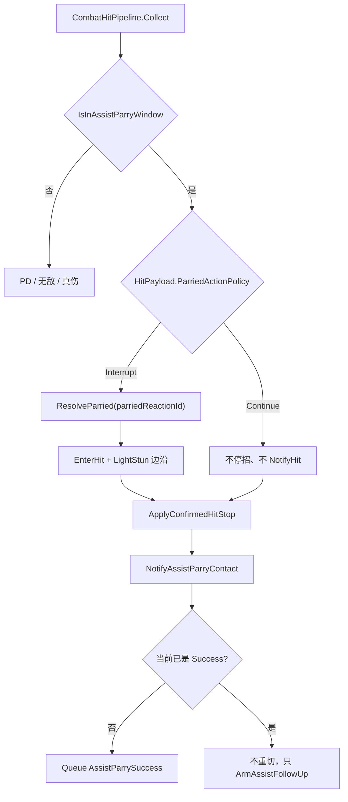

# 弹刀选片 / 连续自动弹刀 / 被弹是否断招 — 方案

> 制定：2026-09-06  
> 角色：**被弹刀选招、连续自动弹刀、进攻盒断招策略** 的结构/排期真源（先文档，后实现）  
> 相关：  
> - 极限支援真源：[`../2026.8.30/PARTY_SWITCH_ASSIST_PLAN.md`](../2026.8.30/PARTY_SWITCH_ASSIST_PLAN.md)  
> - 弹刀卡肉：[`../2026.9.5/ASSIST_PARRY_HITSTOP_PLAN.md`](../2026.9.5/ASSIST_PARRY_HITSTOP_PLAN.md)  
> - 受击档（已关）：[`../2026.9.3/HIT_REACTION_IMPLEMENTATION_PLAN.md`](../2026.9.3/HIT_REACTION_IMPLEMENTATION_PLAN.md) — 被弹刀仍**禁止**走冲击力×韧性  
> - 装配链：`CombatHitPipeline.ApplyAssistParry` → `CharacterReactionService.IssueParried` → `CharacterReactionResolver.ResolveParried` → `EnterHit` / 不停招

---

## 0. 一句话

被弹刀的**片子与是否断招**写在进攻盒 `HitPayload` 上，选片走现有 `CharacterReactionSet` 的 `Parried + reactionId`；连续自动弹刀只认玩家当前招架窗，已在 Success 则不再重切。禁止冲击力裁定、禁止 `HitReactionKind.Parried`、禁止顶层 Parry 状态、禁止 `if (敌人)`、禁止把弹刀改回 `OnHit`。

---

## 1. 问题与动机

### 1.1 现状基线

```text
敌人 Hitbox → Pipeline.IsInAssistParryWindow
  → ApplyAssistParry
       ConfirmHit
       IssueParried
         ResolveParried()          // 固定 LightStun + Parried 默认片（Id 空）
         ConfirmHitReaction(LightStun)  // 写 Hit 边沿
         hitSideEffect → EnemyBrain.NotifyHit → BT Reset
         EnterHit(StunAction)      // 必进 HitState
       NotifyAssistParryContact
         ArmAssistFollowUp
         队列 None/AssistParry/Parry → 改成 AssistParrySuccess
         已在播 Success 时队列也是 None → 会再排一次 Success（重切）
       ApplyConfirmedHitStop（帧读玩家招架窗）
```

| 点 | 现状 |
|----|------|
| 被弹选片 | `ResolveParried()` 只查 `Parried` + 空 Id，再回退 `Hit` 默认片 |
| `HitPayload.hitReactionId` | 给**被打中的那一方**选 Hit/Death 片，不是给攻击者被弹用 |
| 断招 | `IssueParried` 写死 `EnterHit` + LightStun 边沿 |
| 连续接触 | Success 上若仍有 `AssistParryWindow`，第二次仍走 `ApplyAssistParry`，但会再排队 Success |
| 仅无敌无窗 | 吞伤，不 `IssueParried` |
| 卡肉 / 玩家侧 | 已接；本方案不改窗帧语义、不改切人 Coordinator |

### 1.2 痛点

1. Attack1 / Attack2 被弹后要分别播 `Hit_Parry_Left` / `Hit_Parry_Right`，现在全员同一张默认片。  
2. 多段攻击打在 Success 招架窗上时，会把 clang 从头再切一遍，不像连续自动弹刀。  
3. 有的招被弹后应停住再出被弹片，有的应只卡一下肉、原招继续；现在无法配。

### 1.3 目标

| 目标 | 说明 |
|------|------|
| 选片 | 进攻盒填 `parriedReactionId`；敌人 `ReactionSet` 用 `Parried + Id` 精确命中，缺省走默认 Parried，再回退 Hit 默认 |
| 自动弹刀 | 已在 Guard/Success 招架窗内的后续接触无需再按 `Parry`；已在 Success **不重切** Success |
| 断招可配 | 盒上 `ParriedActionPolicy`：`Interrupt`（默认，现行为）/ `Continue`（不进 Hit、不写边沿、不 Reset BT） |
| 可测 | EditMode：左/右 Id 选不同片；Continue 后攻击者仍 `Action`；第二次接触不新开 Success 实例 |
| 不做 | 无输入自动起手 Guard；13 段专用状态机；`HitReactionKind.Parried`；冲击力裁定被弹；Flinch 被弹（本轮不做）；Agent 改 Data/Prefab |

---

## 2. 设计原则

1. **接触确认仍不是 OnHit**：吞伤、Grant、玩家受击档都不走；只改 `IssueParried` 的输出。  
2. **差异在进攻盒 + 反应表**：Attack1/Attack2 各填 Id；片子在敌人 `CharacterReactionSet`，禁止按 Action 名 `if`。  
3. **`hitReactionId` 不复用**：那是打中别人时对方选 Hit 片；被弹选片用独立 `parriedReactionId`。  
4. **默认等于今天**：新字段 0 / 空串必须保持「断招 + 默认 Parried 片」，旧盒不用立刻改。  
5. **Continue 不装成受击**：不 `EnterHit`、不 `ConfirmHitReaction(LightStun)`、不 `NotifyHit`、不 Reset BT；卡肉仍冻**当前进攻实例**。  
6. **自动弹刀 = 窗还在**：不另做第二套判定；Success 不铺窗 = 后续只无敌吞伤。  
7. **零长期兼容**：删掉「ResolveParried 永不读 Id」的旧签名；不留 `IssueParriedForced` 双轨。  
8. **锁步边界不变**：权威仍在 `ResolvePending`；本机预测只镜像已结算接触。

---

## 3. 目标架构

```text
ApplyAssistParry（已 Collect，窗内）
  ConfirmHit
  policy / parriedReactionId ← context.Hitbox.Payload
       Interrupt
         ResolveParried(parriedReactionId)
           Parried+Id → Parried 默认 → Hit 默认
         ConfirmHitReaction(LightStun)
         NotifyHit + EnterHit(选中片)
         冻新受击实例 + 玩家当前招 + carry
       Continue
         不 EnterHit、不写边沿、不 NotifyHit
         冻当前进攻实例 + 玩家当前招 + carry
  NotifyAssistParryContact
       首次（Guard / Parry）→ 排队 Success
       已在播 Success 或已排队 Success → 只刷新突击窗，不重切
```



### 3.1 关键契约

```text
Input  → 已 Collect 的 CombatHitEvent
       → HitPayload.ParriedActionPolicy
       → HitPayload.ParriedReactionId
       → 攻击者 CharacterReactionSet（Parried 规则）
       → 玩家当前招架窗（是否自动吃下一刀、卡肉帧）

Output → Interrupt：攻击者 HitState + 指定/默认被弹片 + LightStun 边沿
       → Continue：攻击者仍在原 Action，仅 freeze
       → 玩家：首次切 Success；已在 Success 则实例不变
       → ResolvedCombatHit.AbsorbedByAssistParry = true
       → Continue 时 ReactionKind = None（禁止再报 LightStun）
```

### 3.2 字段定案（只留这一套）

| 字段 | 位置 | 默认 | 语义 |
|------|------|------|------|
| `ParriedActionPolicy` | `HitPayload` | `Interrupt = 0` | 被弹后攻击者是否进 Hit |
| `ParriedReactionId` | `HitPayload` | `""` | 查攻击者 `Parried` 精确规则；空则默认 Parried |
| `AssistParryWindow` | 玩家 Guard / Success Timeline | 已有 | 窗在 = 该帧可自动吃接触 |

```text
public enum ParriedActionPolicy
{
    Interrupt = 0,  // 现行为：EnterHit
    Continue = 1,   // 不停招
}
```

禁止再加 `PlayHit` / `PlayParried` 双枚举：若要播普通受击片，把同一份 `ActionDefinition` 挂到 `Parried` 规则即可。

### 3.3 自动弹刀定案

**自动弹刀 = 连续接触自动成立，不是无输入自动举刀。**

| 条件 | 结果 |
|------|------|
| 玩家当前帧 `IsInAssistParryWindow` | 无需再按 `Parry` / 切人，走 `ApplyAssistParry` |
| 当前 Graph 节点 Intent 已是 `AssistParrySuccess`，或队列已是 Success | 不 `QueueExternalIntent(Success)`，不 `Begin` 新实例 |
| Success 后段只有无敌、没有招架窗 | 吞伤，不 `IssueParried`（与现「仅无敌」一致） |
| 无输入自动从 Locomotion 起 Guard | **不做** |

开启方式：在 Success（及若需要则 Guard 后段）继续铺 `AssistParryWindow`。不另做 `autoParry` 开关。

### 3.4 边界

| 层 | 职责 | 不负责 |
|----|------|--------|
| `HitPayload` | 该盒被弹后的政策与选片 Id | 不持有 Action 引用 |
| `CharacterReactionSet` | `Parried + Id` → 片子 | 不断招、不写边沿 |
| `IssueParried` | 按政策执行或早退 | 不读冲击力 / 韧性 / SuperArmor |
| `NotifyAssistParryContact` | 首次切 Success；连续接触不重切 | 不写卡肉 |
| 玩家 Graph | Guard / Success Entry 与窗 | 不选敌人被弹片 |

---

## 4. 范围声明

| 阶段 | 包含 | 不包含 |
|------|------|--------|
| P-PR0 | Payload 两字段；`ResolveParried(id)`；Continue 早退 | 自动弹刀不重切；改资产 |
| P-PR1 | Success 二次接触不重切；连续接触单测 | 无输入自动 Guard；Flinch 被弹 |
| P-PR2 | Action Editor 盒字段说明；文档索引 | 改 `Assets/Data/**` |

---

## 5. 分阶段交付（任务 / 验收 / 出口）

> 勾选：未开始 `[ ]`；完成后 `[x]` 并在出口注明日期。

### P-PR0 — 进攻盒选片 + 是否断招

**任务**

- [x] `HitPayload` 增加 `ParriedActionPolicy parriedActionPolicy`、`string parriedReactionId`；默认 Interrupt / 空串  
- [x] `CharacterReactionResolver.ResolveParried(string reactionId)`：`Parried+Id` → `Parried` 默认 → `Hit` 默认；**删除**无参 `ResolveParried()`  
- [x] `CharacterReactionService.IssueParried` 读 Payload：`Continue` 直接返回；`Interrupt` 才 Confirm + NotifyHit + EnterHit  
- [x] `ApplyAssistParry`：Continue 时 `ResolvedCombatHit` 的 `ReactionKind = None`  
- [x] EditMode：`ResolveParried("Left")` / `"Right"` 命中不同片；空 Id 走默认；Continue 后攻击者仍 `Action`、无 Hit 边沿、满血、BT 不 Reset  

**验收**

- [x] `rg "ResolveParried\\(\\)" Assets/Scripts` 无无参调用  
- [x] 旧盒不填新字段时行为与改前一致（Interrupt + 默认片）  
- [ ] Test Runner：选片 / Continue 用例（Editor 确认）  
- [ ] Unity 编译在 Editor 确认通过  

**出口：** 被弹播哪张片、是否断招只由进攻盒 + ReactionSet 决定。→ **已达成（2026-09-06，Play/Test Runner 待 Editor）**

### P-PR1 — 连续自动弹刀

**任务**

- [x] 依赖 P-PR0  
- [x] `NotifyAssistParryContact`：当前 `ActionSim` 图节点 Intent 已是 `AssistParrySuccess`，或队列已是 Success → 不改队列；仍 `ArmAssistFollowUp`  
- [x] EditMode：同一 Success 实例上第二次窗内接触 → `IssueParried`（或 Continue）仍发生，`ActionSim.InstanceId` 不变  

**验收**

- [x] Success 无招架窗、仅无敌 = 第二次不 `IssueParried`（现有 `InvincibleOnly` 语义保持）  
- [ ] Test Runner：连续接触不重切 Success（Editor 确认）  

**出口：** 多段刀打在 Success 窗上只 clang 一次，后续自动弹、不重播成功段。→ **已达成（2026-09-06，Play/Test Runner 待 Editor）**

### P-PR2 — Editor 说明与文档

**任务**

- [x] Action Editor / Hitbox Inspector：画出 Policy 与 Parried Reaction Id，HelpBox 写清「Id 查攻击者 ReactionSet.Parried，不是对方 Hit」  
- [x] TECHNICAL §0.1 补三行：选片、Continue、自动弹刀不重切  
- [x] 本篇阶段勾选随实现更新  

**验收**

- [ ] 选中进攻盒能看到两个新字段（Editor 确认）  
- [x] ROADMAP / 本文变更日志已写实现日期  

**出口：** 策划能在盒上配完，不必读代码。→ **已达成（2026-09-06，Inspector/Play 待 Editor）**

---

## 6. 迁移与兼容

### 6.1 保留 / 迁入

- 接触成功、玩家不 OnHit、卡肉读招架窗、本体 `Parry` / 切人 `AssistParry` 入口全部保留  
- `CharacterReactionType.Parried` 与「精确 Id 优先于默认」解析原样使用，只是开始传入 Id  
- 旧进攻盒：Policy 默认 Interrupt，Id 空 → 与 2026-09-05 行为相同  

### 6.2 明确删除

| 删除 | 原因 |
|------|------|
| `ResolveParried()` 无参 | 唯一入口必须带 Id（可空） |
| 「被弹刀永远 LightStun + EnterHit」隐含契约 | 被 Continue 取代为显式政策 |

禁止：`LegacyIssueParried`、`if (!hasPolicy) 走旧函数`、把 `parriedReactionId` 映射进 `hitReactionId`。

---

## 7. 目录与文件预期（增量）

```text
Assets/Scripts/Domain/Combat/Hitbox/HitPayload.cs
Assets/Scripts/Domain/Combat/Hitbox/ParriedActionPolicy.cs          // 新增枚举
Assets/Scripts/Domain/Combat/Hitbox/CombatHitPipeline.cs
Assets/Scripts/Domain/Character/Reactions/CharacterReactionResolver.cs
Assets/Scripts/Domain/Character/Reactions/CharacterReactionService.cs
Assets/Scripts/Domain/Character/CharacterActor.cs                   // NotifyAssistParryContact
Assets/Scripts/Editor/Combat/ActionEditor/Inspectors/…              // 盒字段说明
Assets/Tests/Editor/Combat/AssistParryPipelineTests.cs
Assets/Tests/EditMode/Domain/…                                     // ResolveParried Id
docs/2026.9.6/ASSIST_PARRY_OUTCOME_PLAN.md
```

---

## 8. 风险与对策

| 风险 | 对策 |
|------|------|
| 把 `hitReactionId` 当成被弹 Id，打中玩家时错选玩家受击片 | 独立字段；Inspector 写明查攻击者 Parried |
| Continue 仍 `NotifyHit`，BT 被 Reset、招却没停 | Continue 分支禁止 `hitSideEffect` |
| Success 二次接触重切，clang 闪一下 | P-PR1 用 Graph 节点 Intent / 已排队 Success 门闩 |
| 无 Parried 规则且 Interrupt | 回退 Hit 默认片（与现网一致），不静默 Continue |
| Continue + 卡肉写到已停掉的进攻 InstanceId | 与 HS1 相同：不停招时冻**当前**实例 |
| 策划理解成「松开手也会自动举刀」 | §3.3 写死：不做无输入起手 |

---

## 9. Editor 人工步骤（Agent 不改 Data/Prefab）

1. 打开工程，等编译通过。  
2. 敌人 `CharacterReactionSet`：`Parried` 默认片一条；再加精确规则 `Left` → `Hit_Parry_Left`、`Right` → `Hit_Parry_Right`。  
3. Attack1 进攻盒：`Parried Reaction Id = Left`，Policy = Interrupt。  
4. Attack2 进攻盒：`Id = Right`。  
5. 需要「被弹不断招」的盒：Policy = Continue。  
6. 玩家 Success Timeline：在还要接下一刀的帧段继续铺 `AssistParryWindow`（填卡肉帧）；不要窗的后段只留无敌。  
7. Play：Attack1 被弹播左、Attack2 播右；Continue 盒卡肉后原招继续、树不重置；多段打在 Success 窗上不重播 clang。  
8. Test Runner：P-PR0 / P-PR1 相关测试。

---

## 10. 推荐开工顺序

```text
P-PR0 盒政策 + 选片
  → P-PR1 Success 不重切
  → P-PR2 Inspector / TECHNICAL
```

**最小可感切片：** P-PR0 — Play 里 Attack1 / Attack2 被弹能播两张不同片，Continue 盒能不停招。

---

## 11. 变更日志

| 日期 | 说明 |
|------|------|
| 2026-09-06 | 初版：选片走 Parried+Id；断招政策在进攻盒；自动弹刀 = 窗内连续接触且 Success 不重切 |
| 2026-09-06 | P-PR0～P-PR2 代码落地：删除无参 `ResolveParried()`；Continue 早退；Success 不重切 |
