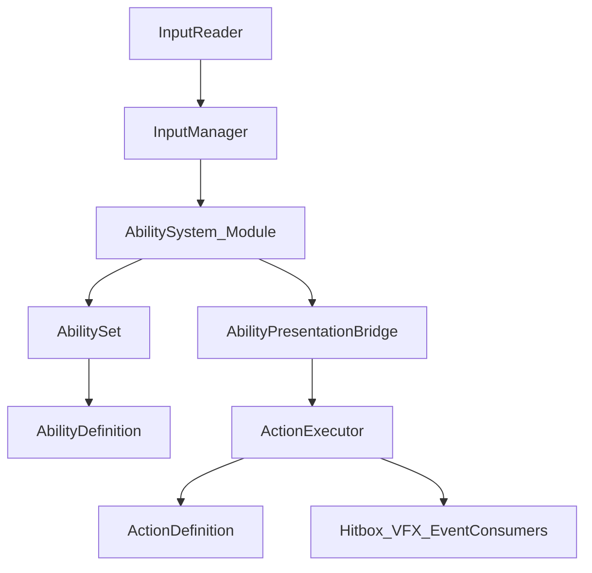

# Ability 驱动动作系统重构计划

## 目标

本次重构不再以轻量 Resolver 作为最终动作选择中心，而是引入 AbilitySystem：

- `AbilitySystem` 负责输入、条件、连段/派生、资源、冷却、激活状态与表现请求。
- `ActionExecutor` 只负责播放 `ActionDefinition`、推进逻辑帧、派发 Hitbox/VFX/ActionEvent/HitStop。
- 表现层通过接口接入，未来不仅能播放 `ActionDefinition`，也能扩展到相机、音效、UI、特殊表现任务。



命名说明：项目规范中 `System` 后缀目前保留给 `App/Systems` 架构系统。为兼顾用户目标与项目规范，计划中模块统称 `AbilitySystem`，代码落地可优先命名为 `AbilityService` / `AbilityController` / `AbilityRuntime`；若决定直接使用 `AbilitySystem` 类名，需要同步更新 `CONVENTIONS.md` 说明此处为特例。

## 详细执行文档

本计划拆分为三份详细执行文档，未来实施时按顺序阅读和执行：

1. `[docs/ABILITY_REFACTOR_PART1_ACTION_PRESENTATION.md](docs/ABILITY_REFACTOR_PART1_ACTION_PRESENTATION.md)` — 收敛 `ActionExecutor` 为 AbilitySystem 表现层。
2. `[docs/ABILITY_REFACTOR_PART2_ABILITY_SYSTEM.md](docs/ABILITY_REFACTOR_PART2_ABILITY_SYSTEM.md)` — 实现 AbilitySystem 核心模型、激活流程、条件、消耗、冷却与跨模组派生。
3. `[docs/ABILITY_REFACTOR_PART3_PRESENTATION_BRIDGE.md](docs/ABILITY_REFACTOR_PART3_PRESENTATION_BRIDGE.md)` — 建立 AbilitySystem 到 `ActionExecutor` 的可扩展表现层接入。

## Part 1 — 收敛 ActionExecutor 为表现层

目标：按照原计划优化动作执行层，但不再让它承担输入解析、能力选择、连段选择或 Dodge 分派。

### 目录整理

将动作表现相关代码保留在 `Assets/Scripts/Domain/Combat/Actions`：

```text
Actions/
  Definitions/
    ActionDefinition.cs
    ActionPhase.cs
    ActionEvent.cs
    ActionTransition.cs
    CancelWindow.cs
    RotationWindow.cs
    CombatActionType.cs

  Execution/
    ActionExecutor.cs
    IActionExecutor.cs
    ActionSession.cs
    ActionRotationDriver.cs
    IActionStartContext.cs
    IActionHitReceiver.cs

  Frames/
    CombatFrameContext.cs
    ICombatFrameConsumer.cs
```

### 改动范围

- `[Assets/Scripts/Domain/Combat/Actions/ActionExecutor.cs](Assets/Scripts/Domain/Combat/Actions/ActionExecutor.cs)`
- `[Assets/Scripts/Domain/Combat/Actions/IActionExecutor.cs](Assets/Scripts/Domain/Combat/Actions/IActionExecutor.cs)`
- `[Assets/Scripts/Domain/Combat/Actions/ActionSession.cs](Assets/Scripts/Domain/Combat/Actions/ActionSession.cs)`
- `[Assets/Scripts/Domain/Combat/Actions/CharacterActionDriver.cs](Assets/Scripts/Domain/Combat/Actions/CharacterActionDriver.cs)`
- `[Assets/Scripts/Domain/Character/CharacterActorFactory.cs](Assets/Scripts/Domain/Character/CharacterActorFactory.cs)`

### 执行要点

- 删除 `ActionExecutor.TryStartByInput`，只保留 `TryStart(ActionDefinition action)`。
- 删除 `ActionExecutor` 中的 Dodge 方向分派、ComboSequence 进位、输入路由依赖。
- `CancelWindow` 仍保留在 `ActionDefinition` 中，但只作为“允许表现切换/能力派生”的时间窗数据，不直接决定下一招。
- `ActionExecutor` 可保留 `Transition`、Hitbox、VFX、HitStop、ActionEvent、RootMotion、ScriptedDisplacement。
- `CharacterActionDriver` 从动作选择入口降级为输入桥接，后续由 AbilitySystem 消费输入缓冲。
- `ActionExecutor` 对外暴露当前播放状态、当前帧、当前 Action、是否处于可取消窗口，供 AbilitySystem 判断。

### 验收

- `ActionExecutor` 内不再出现 `InputId`、`ComboSequence`、`DodgeDirectionVariants`、`TryStartByInput`。
- `ActionExecutor` 可以被任意上层调用 `TryStart(ActionDefinition)` 播放表现。
- Hitbox/VFX/HitStop/ActionEvent 与原有表现保持一致。

## Part 2 — 实现 AbilitySystem

目标：新增 AbilitySystem，作为玩法动作的唯一选择与激活层。

### 新目录

```text
Assets/Scripts/Domain/Combat/Abilities/
  Definitions/
    AbilityDefinition.cs
    AbilitySet.cs
    AbilityEntry.cs
    AbilityInputTrigger.cs
    AbilityActivationPolicy.cs

  Runtime/
    AbilityService.cs
    AbilityActivationRequest.cs
    AbilityActivationContext.cs
    AbilityRuntimeState.cs
    AbilityStateStore.cs

  Conditions/
    AbilityCondition.cs
    AbilityConditionResult.cs
    CurrentActionCondition.cs
    CurrentStateCondition.cs
    CombatModeCondition.cs

  Costs/
    AbilityCost.cs
    AbilityCostResult.cs

  Cooldowns/
    AbilityCooldown.cs
    AbilityCooldownState.cs

  Presentation/
    AbilityPresentationRequest.cs
    IAbilityPresentationDriver.cs
    ActionAbilityPresentationDriver.cs
```

### 核心职责

- `AbilityDefinition`：描述一个能力的激活规则、条件、消耗、冷却和表现请求。
- `AbilitySet`：替代 `PlayerActionSet`，表示当前战斗模式可用的能力列表。
- `AbilityEntry`：绑定 `InputActionReference`、触发类型、优先级与 `AbilityDefinition`。
- `AbilityService`：运行时能力系统，负责查找、判定、激活、冷却、状态记录和派发表现请求。
- `AbilityActivationContext`：一次激活判定所需的上下文快照，如当前角色状态、当前 Action、当前帧、移动输入、战斗模式。
- `AbilityCondition` / `AbilityCost` / `AbilityCooldown`：可组合的能力激活规则。

### AbilityDefinition 初版字段

初版只覆盖当前动作系统需要，避免一次做成大型 GAS：

```text
AbilityDefinition
  id
  displayName
  priority
  activationPolicy
  conditions[]
  costs[]
  cooldown
  presentationRequest
```

### 支持轻重派生

跨动作模组派生放在 Ability 层，不放进 `ActionExecutor`：

```text
HeavyAbility
  Conditions / Branches:
    CurrentAction == Light1 -> Play Heavy2
    CurrentAction == Light2 -> Play Heavy3
    Default -> Play Heavy1
```

初版可通过 `CurrentActionCondition` + `AbilityPresentationRequest` 表达；如果分支增多，再抽成 `AbilityBranchDefinition` 或 Graph。

### 验收

- 输入 `Attack` / `Dodge` 不再直接解析 `ActionDefinition`，而是激活 Ability。
- Ability 可根据当前 Action、状态、战斗模式决定是否能激活。
- Ability 可请求播放一个或多个表现请求。
- Ability 的条件、消耗、冷却接口存在，但具体资源系统可先用空实现或最小实现。

## Part 3 — AbilitySystem 接入可扩展表现层

目标：让 AbilitySystem 不直接依赖 `ActionExecutor`，而是依赖表现层接口，保证未来能扩展 Graph、相机、音效、UI、Buff 表现任务。

### 表现层接口

建议以 `IAbilityPresentationDriver` 作为能力系统到表现层的边界：

```csharp
public interface IAbilityPresentationDriver
{
    bool CanPlay(in AbilityPresentationRequest request, in AbilityActivationContext context);
    bool TryPlay(in AbilityPresentationRequest request, in AbilityActivationContext context);
}
```

`ActionAbilityPresentationDriver` 作为初版实现：

```text
AbilityPresentationRequest
  -> ActionDefinition
  -> ActionAbilityPresentationDriver
  -> ActionExecutor.TryStart(action)
```

### 可扩展表现请求

`AbilityPresentationRequest` 初版支持：

```text
PresentationKind.Action
ActionDefinition action
```

后续扩展但不在本次实现：

```text
PresentationKind.ActionGraph
PresentationKind.CameraShake
PresentationKind.Audio
PresentationKind.UI
PresentationKind.StatusEffect
```

### 接入 CharacterActor

运行时装配建议：

```text
CharacterActorFactory
  -> new ActionExecutor(...)
  -> new ActionAbilityPresentationDriver(actionExecutor)
  -> new AbilityService(combatMode, abilitySetProvider, presentationDriver)
  -> CharacterActor.Tick
      -> InputManager.IngestFrame
      -> AbilityService.ProcessInput
      -> CharacterStateMachine.Tick
```

### 与 Action 状态机协作

- Ability 激活成功后，表现层播放 `ActionDefinition`。
- 若表现请求进入 Action 播放，AbilityService 或 CharacterActor 负责请求状态机切到 `CharacterStateType.Action`。
- `ActionState` 继续 Tick `ActionExecutor`。
- `ActionExecutor` 停止后，状态机回到 Locomotion。

### 与 CancelWindow 协作

- `CancelWindow` 不再自行解析下一招。
- `ActionExecutor` 暴露当前是否处于允许某输入取消的窗口。
- AbilityService 在输入缓冲存在时检查当前 Action 的 CancelWindow，再决定是否允许激活目标 Ability。
- 这样轻击接重击、攻击接闪避、技能接防御都统一走 Ability 激活规则。

### 验收

- AbilitySystem 不直接调用 `Animator`、`Hitbox`、`VFX`。
- ActionExecutor 不知道 Ability、输入路由、能力条件。
- 新增一种表现形式只需新增 `IAbilityPresentationDriver` 实现或扩展 `AbilityPresentationRequest`，不改 Ability 激活主流程。
- 跨模组派生通过 Ability 条件/分支表达，不进入 ActionExecutor。

## 数据资产迁移说明

受规则限制，Agent 不直接修改 `Assets/Data/**`、`.asset`、Prefab 或 InputActions 资产。脚本完成后，用户需在 Unity Editor 中：

- 创建 `AbilitySet` 资产替代旧 `PlayerActionSet`。
- 为 Attack、Heavy、Dodge、SwitchMode 等创建 `AbilityDefinition`。
- 在 `AbilityEntry` 中绑定 InputActionReference 与 AbilityDefinition。
- 在 Ability 的 `presentationRequest` 中绑定对应 `ActionDefinition`。
- 在角色配置中把旧 `PlayerActionSet` 入口替换为 AbilitySet 入口。

## 文档同步

完成代码后同步：

- `[docs/ACTION_SYSTEM.md](docs/ACTION_SYSTEM.md)`：改为 Ability 驱动动作系统说明。
- `[.cursor/skills/actgame-architecture/TECHNICAL.md](.cursor/skills/actgame-architecture/TECHNICAL.md)`：更新动作系统、AbilitySystem、运行时流程。
- `[.cursor/skills/actgame-architecture/CONVENTIONS.md](.cursor/skills/actgame-architecture/CONVENTIONS.md)`：新增 Ability 与表现层边界约定。
- `[.cursor/skills/actgame-architecture/ROADMAP.md](.cursor/skills/actgame-architecture/ROADMAP.md)`：记录 Resolver 方案被 Ability 驱动方案取代，补充后续 Graph / Ability Editor 路线。

## 风险

- 这是比 Resolver 更大的结构升级，Ability 资产需要一次性重配，不能保留旧 `PlayerActionSet` / `ActionComboSequence` 兼容层。
- `System` 命名与当前项目约定存在冲突，需要在代码命名上使用 `AbilityService`，或同步更新规范允许 `AbilitySystem` 特例。
- Ability 条件/分支若一次做得过复杂，会接近 Graph 系统；初版应优先支持当前所需的输入激活、当前动作条件、CancelWindow、冷却/消耗接口。
- 表现层接口必须保持窄，否则 AbilitySystem 会重新耦合到 Animator、Hitbox、VFX。