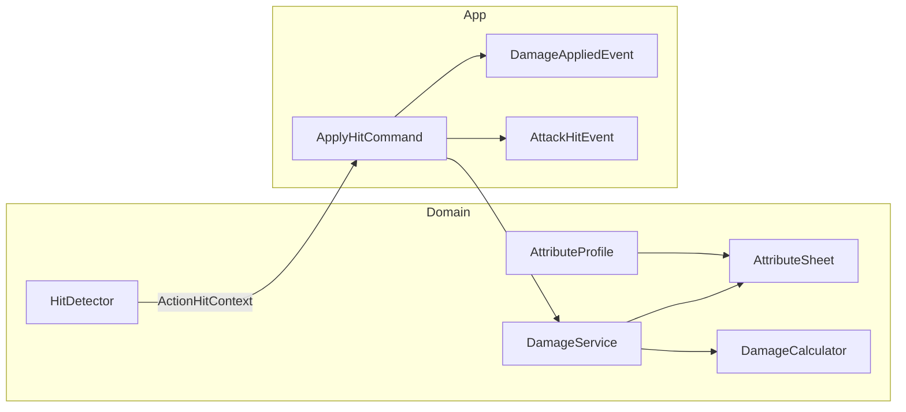

# 战斗属性与伤害系统 — 修改方案

> 状态：方案待实施  
> 创建：2026-07-22  
> 关联：ROADMAP `[P1] 战斗闭环`、现有命中链路（`HitboxFrameConsumer` → `ApplyHitCommand` → `AttackHitEvent`）

---

## 1. 背景

### 1.1 已具备的链路

攻击侧命中检测与反馈已通：

```text
ActionState.Tick
  → ActionExecutor.UpdateFrame
      → HitboxFrameConsumer（OBB）
          → PlayerController.ApplyDetectedHit
              → ApplyHitCommand
                  → IHurtboxTarget.OnHit        // 木桩仅 Debug.Log
                  → IActionHitReceiver.NotifyHit // OnHitConfirm
                  → AttackHitEvent              // 卡肉 / 震屏
```

预留字段：

| 位置 | 字段 | 现状 |
|------|------|------|
| `HitboxNotifyState` | `damageWeight` / `hitReactionId` | 编辑器可配，运行时未参与结算 |
| `HurtboxTarget` | `currentHealth` | 未真正扣血；`IsAlive` 不依赖血量 |
| `CharacterCombatConfig` | `teamId` 等 | 无攻击力 / 生命配置 |
| `CharacterStateType.Hit` | 枚举值 `80` | 无 `HitState` 实现 |

### 1.2 缺口

- 无角色属性真源（HP / 攻击 / 防御等）
- 无伤害计算与扣血管道
- 命中后无法驱动受击状态 / 死亡（属战斗闭环后续阶段，本方案预留接口）

### 1.3 本方案范围

**纳入**：属性系统 + 伤害系统 + 接入 `ApplyHitCommand`，打通「命中 → 算伤 → 改属性」。

**不纳入（后续文档/阶段）**：

- `HitState` / 受击 `ActionDefinition` 播放
- 完整敌人 AI
- Buff UI、复杂元素伤害、部位弱点运行时
- Timeline 动态 Hurtbox 替换常驻框

---

## 2. 目标

### 2.1 设计目标

1. **属性系统**：统一管理角色（及木桩）战斗数值；支持基础值 + 修饰器；HP 为资源型属性。
2. **伤害系统**：唯一接管「一次命中如何变成扣血结果」；纯 Domain 可测；由 App Command 编排。
3. **不破坏现有命中检测**：`HitDetector` / `HitboxFrameConsumer` 仍只做几何判定与去重。
4. **对齐分层**：Domain 不访问 `ACTGameArchitecture`；跨系统仍走 Command / Event。

### 2.2 核心边界

```text
AttributeSheet     = 角色数值真源（读/写/修饰）
DamageCalculator   = 纯函数：Request → Result（不算副作用）
DamageService      = 取 Sheet → 计算 → 扣血 → 返回 Result
ApplyHitCommand    = 命中后的唯一结算编排入口
HitboxFrameConsumer = 只检测，不算伤
```

---

## 3. 推荐最终结构

### 3.1 目录

```text
Assets/Scripts/Domain/Combat/
  Attributes/
    AttributeId.cs
    AttributeModifier.cs
    AttributeSheet.cs
    AttributeProfile.cs          // ScriptableObject 定义类
  Damage/
    DamageType.cs
    DamageRequest.cs
    DamageResult.cs
    DamageCalculator.cs
    DamageService.cs
    IDamageable.cs

Assets/Scripts/App/
  Commands/Combat/ApplyHitCommand.cs   // 扩展
  Events/Combat/DamageAppliedEvent.cs  // 新增
  Controllers/Combat/HurtboxTarget.cs  // 改为 IDamageable + Sheet
  Systems/Combat/CombatActorSystem.cs  // 条目可挂 AttributeSheet（可选）

Assets/Scripts/Domain/Character/
  CharacterConfig.cs                   // 引用 AttributeProfile
  CharacterActor.cs / Factory          // 创建并持有 AttributeSheet
  CharacterCombatConfig                // 视需要补充默认引用说明

Assets/Data/…                          // Editor 人工创建 AttributeProfile 资产（Agent 不改 .asset）
```

### 3.2 依赖关系



### 3.3 运行时装配

```text
CharacterConfig.AttributeProfile
  → CharacterActorFactory
      → new AttributeSheet(profile)
      → 挂到 CharacterActor（或 Context）
      → CombatActorSystem.Register 时可一并登记查询

HurtboxTarget（木桩）
  → 自持 AttributeSheet（可由 SerializeField 基数或引用 AttributeProfile 初始化）
  → 实现 IDamageable / ITargetable
```

---

## 4. 属性系统详细设计

### 4.1 AttributeId（第一版）

| Id | 类型 | 说明 |
|----|------|------|
| `MaxHp` | 派生/基础 | 生命上限 |
| `Hp` | 资源 | 当前生命；不参与修饰公式，只被伤害/治疗改写 |
| `Attack` | 基础+修饰 | 攻击力 |
| `Defense` | 基础+修饰 | 防御力 |

二期可选：`MaxPoise` / `Poise`、`DamageDealtMul` / `DamageTakenMul`。

### 4.2 修饰器

```text
AttributeModifier
  - AttributeId target
  - ModifierOp op     // Flat | PercentAdd
  - float value
  - int sourceId      // Buff / 装备来源，便于批量移除
```

最终值（非 Hp）：

```text
final = (base + ΣFlat) * (1 + ΣPercentAdd)
```

规则：

- `base` 来自 `AttributeProfile`，初始化时写入 Sheet。
- `Hp` 初始化为 `MaxHp`；变更后 `Clamp(0, Get(MaxHp))`。
- `MaxHp` 变化时可选：按比例缩放当前 Hp，或仅 Clamp（第一版采用 **仅 Clamp**）。

### 4.3 AttributeProfile（SO）

`[CreateAssetMenu(menuName = "ACT/Combat/Attribute Profile")]`

建议字段（与 `AttributeId` 对齐的 SerializeField）：

- `maxHp`（默认如 100）
- `attack`（默认如 10）
- `defense`（默认如 5）

挂载：`CharacterConfig` 增加 `[SerializeField] AttributeProfile attributeProfile`；`ValidateForPlayer` 可要求非空（或木桩场景允许缺省用内置 Default）。

### 4.4 AttributeSheet（纯 C#）

职责：

- `Get(AttributeId)` / `GetBase` / `SetBase`
- `AddModifier` / `RemoveModifiersBySource`
- `ApplyDelta(AttributeId, float)` — 主要用于 Hp
- `IsAlive` → `Get(Hp) > 0`

不引用 `ActionDefinition`、不引用 Architecture。

### 4.5 与索敌接口对齐

`ITargetable.CurrentHealth` / `IsAlive` 改为读取 `AttributeSheet`（或 `IDamageable` 转发），删除 `HurtboxTarget` 上孤立的业务语义 `currentHealth` 字段（迁移为 Sheet 初始化参数或 Profile）。

---

## 5. 伤害系统详细设计

### 5.1 类型与请求/结果

```text
DamageType
  - Physical   // 第一版仅此；后续可扩

DamageRequest
  - AttributeSheet attackerAttributes   // 可为 null（环境伤害）
  - AttributeSheet targetAttributes
  - float actionDamageMul               // 来自 ActionDefinition
  - float hitboxDamageWeight            // HitboxNotifyState.DamageWeight
  - float hitboxFlatBonus               // 可选，第一版可恒 0
  - string hitReactionId                // 透传，供后续受击
  - DamageType type
  - Vector3 hitDirection                // 可选透传

DamageResult
  - float rawDamage
  - float finalDamage
  - float targetHpAfter
  - bool wasKilled
  - bool wasApplied                     // 目标已死则 false
  - string hitReactionId
```

### 5.2 招式伤害系数（推荐）

在 `ActionDefinition` 增加：

```text
[Header("Damage")]
[SerializeField] float damageMultiplier = 1f;  // 招式系数
```

公开属性：`DamageMultiplier`（`>= 0`）。

**基数来源**：`attacker.Attack * action.DamageMultiplier * hitbox.DamageWeight`。  
不在 Hitbox 上再写一套完整伤害表，避免与属性系统重复。

### 5.3 减伤公式（第一版推荐）

采用平滑百分比减伤，常数 `K` 可放在 `DamageCalculator` 常量或小型 `DamageFormulaSettings` SO（第一版用代码常量即可）：

```text
K = 100
raw   = attacker.Attack * actionDamageMul * hitboxDamageWeight
mitigation = defense / (defense + K)
final = max(1, raw * (1 - mitigation))   // raw<=0 时 final=0，不强制 1
```

边界：

- 目标已死亡：`wasApplied = false`，不扣血。
- `raw <= 0`：不扣血，不触发「有效伤害」后续（仍可由 Command 决定是否 NotifyHit——**推荐仍 NotifyHit**，因几何已命中；仅 UI/受击可看 `finalDamage`）。

> 拍板建议：几何命中仍 `NotifyHit` + `AttackHitEvent`；`DamageAppliedEvent` 仅在 `wasApplied && finalDamage > 0` 时发送。若需「0 伤也震屏」可再调。

### 5.4 DamageCalculator / DamageService

| 类 | 职责 |
|----|------|
| `DamageCalculator` | 静态或无状态实例；`Calculate(in DamageRequest) → DamageResult`（未写 Sheet） |
| `DamageService` | `Apply(in DamageRequest) → DamageResult`：调用 Calculator，再 `target.ApplyDelta(Hp, -final)`，填充 `targetHpAfter` / `wasKilled` |

第一版 `DamageService` 可为静态门面或轻量实例；**不**注册为 Architecture `System`（避免无状态全局单例扩散）。多角色各自持有 Sheet，Service 无角色状态。

### 5.5 IDamageable

```text
interface IDamageable
{
  AttributeSheet Attributes { get; }
}
```

结算统一由 `DamageService` + Command 完成，避免每个目标复制公式。  
`IHurtboxTarget` 可与 `IDamageable` 并存；`ITargetable` 继续继承 `IHurtboxTarget`，血量读取改走 Attributes。

木桩：`HurtboxTarget : ITargetable, IDamageable`。  
完整角色：后续由 Actor 侧组件或注册表提供 `IDamageable`（本阶段至少木桩打通）。

---

## 6. ApplyHitCommand 编排（唯一结算口）

```text
OnExecute:
  1. 若 context.Action == null → return
  2. 解析 attacker AttributeSheet（CombatActorSystem.TryGet → Actor.Attributes；可空）
  3. 解析 target AttributeSheet（IDamageable / IHurtboxTarget 扩展）
  4. 若 targetAttributes != null:
       result = DamageService.Apply(request from context + sheets)
       if result.wasApplied && result.finalDamage > 0
         SendEvent(DamageAppliedEvent)
  5. target.OnHit(context)          // 保留；内部可改为空或转调
  6. hitReceiver.NotifyHit(context)
  7. SendEvent(AttackHitEvent)      // 卡肉/震屏行为不变
```

**禁止**：在 `HitDetector` / `HitboxFrameConsumer` 内调用 `DamageService`。

### 6.1 DamageAppliedEvent

```text
DamageAppliedEvent : IArchitectureEvent
  - DamageResult Result
  - ActionHitContext Context
  - Transform TargetTransform
  - Vector3 HitDirection
```

用途：UI 飘字、后续受击状态、死亡表现。与 `AttackHitEvent` 分离，避免反馈系统误绑扣血逻辑。

---

## 7. 角色装配改动清单

| 文件 | 改动 |
|------|------|
| `CharacterConfig` | 增加 `AttributeProfile` 引用；校验可选/必填策略见阶段 A |
| `CharacterActor` | 持有 `AttributeSheet` 只读属性 |
| `CharacterActorFactory` | 用 Profile 创建 Sheet 并注入 Actor；`CombatActorEntry` 可选扩展 |
| `CombatActorSystem` / `CombatActorEntry` | 便于 Command 按 Transform 取 Sheet |
| `ActionDefinition` | 增加 `damageMultiplier` |
| `HurtboxTarget` | Sheet + `IDamageable`；扣血走 DamageService（经 Command） |
| `ITargetable` | `CurrentHealth` 语义改为读 Sheet |
| `ApplyHitCommand` | 接入伤害 |
| 文档 | TECHNICAL / ROADMAP / ARCHITECTURE 在实现后由 architecture skill 同步 |

**Agent 不修改**：`Assets/Data/**`、`.asset`、Prefab；实现后列出 Editor 手工步骤。

---

## 8. 分阶段实施

### Phase A — 属性骨架

**改动**：

- 新增 `AttributeId` / `AttributeModifier` / `AttributeSheet` / `AttributeProfile`
- `CharacterConfig` + Factory + `CharacterActor` 注入
- `HurtboxTarget` 用 Sheet 初始化（可 SerializeField 写默认 maxHp/attack/defense，或引用 Profile）

**验证**：

- Play Mode：玩家 Actor 上能读到 Attack/MaxHp
- 木桩 Inspector/日志可见 Hp

**不包含**：扣血、公式。

### Phase B — 伤害结算

**改动**：

- 新增 Damage 目录类型与 `DamageService`
- `ActionDefinition.damageMultiplier`
- 扩展 `ApplyHitCommand` + `DamageAppliedEvent`
- `HurtboxTarget.IsAlive` / `CurrentHealth` 读 Sheet；死亡后可 Unregister 或检测跳过

**验证**：

- 攻击木桩 Hp 下降
- 公式符合 `Attack * mul * weight` 与防御减伤
- 打死后面不再被命中/索敌
- 卡肉/震屏仍触发（`AttackHitEvent`）

### Phase C — 角色可受伤入口（轻量）

**改动**：

- 玩家/未来敌人通过 `CombatActorSystem` 暴露 Sheet，使角色也可被 `IDamageable` 命中
- 死亡时广播事件（可选 `ActorDiedEvent`）

**验证**：

- 若场景存在第二可动目标，命中后扣血

**仍不包含**：`HitState`、受击动画（单独开「受击闭环」方案）。

### Phase D — 修饰器与扩展（按需）

- Buff 加减修饰器
- `DamageDealtMul` / `DamageTakenMul`
- 公式 SO 化
- 与受击反应 `hitReactionId` 衔接（消费 `DamageResult`）

---

## 9. Editor 人工操作清单（实现后）

1. `Create → ACT/Combat/Attribute Profile`，填写 MaxHp / Attack / Defense。
2. 在玩家 `CharacterConfig` 上拖入该 Profile。
3. 既有攻击 `ActionDefinition`：按需设置 `damageMultiplier`（默认 1 即行为 ≈ 仅属性×Hitbox 权重）。
4. 场景木桩：配置 HurtboxTarget 的 Profile 或默认基数；确认 `teamId` 与玩家不同。
5. Play Mode：打木桩观察 Hp；确认 HitStop / CameraShake 未回归。

---

## 10. 测试计划

| 用例 | 期望 |
|------|------|
| 命中木桩一次 | Hp 减少约 `final`；同 HitboxId 同招不重复扣 |
| 提高 Attack 或 damageMultiplier | 伤害上升 |
| 提高木桩 Defense | 伤害下降但仍 ≥ 1（当 raw>0） |
| damageWeight = 0 | 不造成有效伤害；几何命中策略按 5.3 拍板 |
| 木桩 Hp 打到 0 | `IsAlive == false`；不再进入 ActiveTargets 有效命中 |
| 命中反馈 | 有效命中仍有卡肉/震屏（若招式配置开启） |

---

## 11. 风险与约束

| 风险 | 缓解 |
|------|------|
| 旧 Action 资产无 `damageMultiplier` | 默认 `1f`，Unity 反序列化兼容 |
| 木桩与角色双路径血量 | 统一 `AttributeSheet`，禁止并行 float 血条 |
| Command 取不到攻击者 Sheet | Request 允许 attacker 为空；此时 Attack 视为 0 或仅用 action 系数（实现时选：**Attack=0 则 raw=0**，逼配置完整） |
| 分层违规 | Domain 伤害/属性零引用 Architecture；只在 ApplyHitCommand 编排 |
| 范围蔓延到受击状态 | Phase C 止步于扣血；HitState 另案 |

破坏性变更：

- `HurtboxTarget.currentHealth` 字段语义迁移（删除或仅作初始化种子）。
- `ITargetable.CurrentHealth` 背后实现变更（接口形状尽量不变）。

---

## 12. 已拍板默认（可在实施前改）

若实施时用户未另指定，采用：

| 项 | 默认 |
|----|------|
| 属性列表 | `MaxHp`, `Hp`, `Attack`, `Defense` |
| 招式系数 | `ActionDefinition.damageMultiplier`（默认 1） |
| 框权重 | 现有 `HitboxNotifyState.damageWeight` |
| 减伤 | `defense/(defense+100)` |
| 木桩 | 轻量自持 `AttributeSheet`，不强制完整 `CharacterActor` |
| 0 伤命中 | 仍 `NotifyHit` + `AttackHitEvent`；不发 `DamageAppliedEvent` |
| Architecture DamageSystem | **不**新增；用 Domain `DamageService` + Command |

---

## 13. 成功标准

- [ ] 属性由 `AttributeSheet` 统一管理，玩家与木桩同源模型
- [ ] 所有扣血仅经 `DamageService`（由 `ApplyHitCommand` 调用）
- [ ] 检测层无伤害公式
- [ ] 打木桩可见掉血与死亡失效
- [ ] 卡肉/震屏/OnHitConfirm 行为不回归
- [ ] TECHNICAL / ROADMAP 在落地后更新（architecture skill）

---

## 14. 后续衔接（非本方案实施范围）

```text
DamageAppliedEvent
  → 选 hitReactionId 对应受击 ActionDefinition
  → CharacterStateMachine → HitState
  → 播放受击 / 结束回 Locomotion
  → Death 状态
```

该链路依赖本方案的 `DamageResult` / 事件字段，但不在本修改方案的 Phase A–C 内实现。
