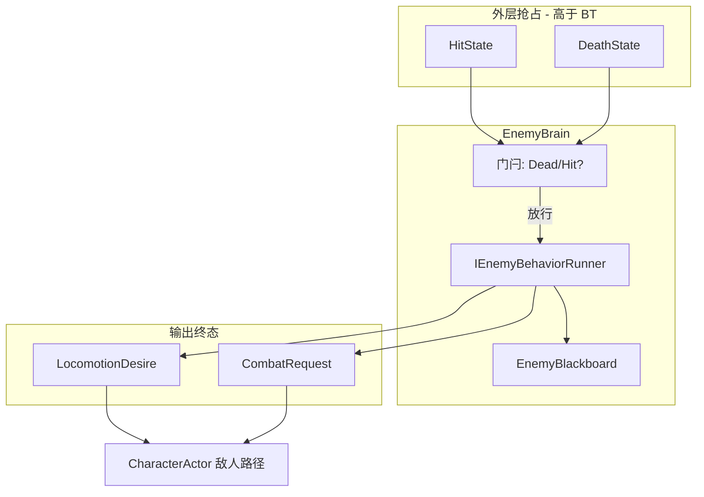

# ACTGame 敌人行为树方案

> 基准：`develop`（敌人 AI 初版已落地：`EnemyBrain` 五态 FSM + `AIInputWriter`）  
> 制定日期：2026-07-30  
> 修订：2026-08-09 — 补充**可替换 BT 后端**抽象（`IEnemyBehaviorTreeAsset` / `IEnemyBehaviorRunner`）；Phase-1 输出对齐 `AIInputWriter`/`InputFrame`  
> 修订：2026-08-09 — BT-1/BT-2 主体已落地；GraphView 见 [ENEMY_BEHAVIOR_TREE_EVOLUTION_PLAN.md](./2026.8.9/ENEMY_BEHAVIOR_TREE_EVOLUTION_PLAN.md)  
> 修订：2026-08-09 — E3 后**编辑器**优化见 [ENEMY_BEHAVIOR_TREE_OPTIMIZATION_PLAN.md](./2026.8.9/ENEMY_BEHAVIOR_TREE_OPTIMIZATION_PLAN.md)  
> 修订：2026-08-10 — **§3.4 输出槽终态**改为 `LocomotionDesire` + `CombatRequest`；结构真源见 [ENEMY_BT_DISCRETE_COMBAT_AND_CONFIG_PLAN.md](./2026.8.10/ENEMY_BT_DISCRETE_COMBAT_AND_CONFIG_PLAN.md)  
> 修订：2026-08-11 — 结构主线与对峙表现已关闭；**待优化真源**见 [2026.8.11/ENEMY_BEHAVIOR_TREE_BACKLOG_PLAN.md](./2026.8.11/ENEMY_BEHAVIOR_TREE_BACKLOG_PLAN.md)

> 前置文档：[ENEMY_SYSTEM_INTEGRATION_PLAN.md](./ENEMY_SYSTEM_INTEGRATION_PLAN.md)  
> 总清单交叉：[PROJECT_CHECKLIST.md](./PROJECT_CHECKLIST.md) §6.4（BT 抽象 + 简易编辑器）  
> 本次范围：**只做行为树决策层**；NavMesh / A\* 寻路另开迭代，本方案预留接口不实现  
> **结构真源（已关闭）：** [2026.8.10/ENEMY_BT_DISCRETE_COMBAT_AND_CONFIG_PLAN.md](./2026.8.10/ENEMY_BT_DISCRETE_COMBAT_AND_CONFIG_PLAN.md)  
> **待优化真源：** [2026.8.11/ENEMY_BEHAVIOR_TREE_BACKLOG_PLAN.md](./2026.8.11/ENEMY_BEHAVIOR_TREE_BACKLOG_PLAN.md)

---

## 1. 结论摘要

1. **Phase-1 自研轻量行为树**（不引入第三方插件包）；同时 **BT-1 起就预留可替换后端接口**，便于日后功能完善或整包接入现成插件。
2. **BT 只写黑板输出槽**；禁止节点直调 `ActionSim` / `MotorSim` / Numeric。  
   - **终态（已落地，E-MOVE2）：** Brain 提交 `LocomotionDesire` + `CombatRequest`；`ProduceInput` 写空 `InputFrame`；**已删除** `AIInputWriter` 与战斗 Pulse。
3. **Hit / Death 不进树**：由 `CharacterReactionService` 外层抢占；BT 在受控期间不 Tick 或 Tick 前被门闩拦住。
4. **用 BT 替换 `EnemyBrain` 内 Idle/Chase/Attack 决策**，删除与 BT 并行的五态业务 switch（保留 `EnemyBrainState` 仅作调试快照可选）。
5. **策略资产化**：`EnemyDefinition` 引用实现 `IEnemyBehaviorTreeAsset` 的资产；战斗距离/幅度等调参终态迁到 **节点 Def**（见 8.10 E-CFG），`EnemyBrainProfile` 瘦身为开关/生命周期。
6. **第一版节点库约 12 个**已复现「进战追击 + 冷却普攻」；离散多招 / 滞回见 8.10 E-REQ / E-ST。

---

## 2. 目标与非目标

### 2.1 目标

| 项 | 验收 |
|----|------|
| 等价替换（Phase-1） | 近战怪：进 `aggro` 追击、进 `attackRange` 且冷却好时起手、脱战停步（当时经 `PulseAttack`） |
| 受击/死亡 | 挨打进 Hit、死亡停 AI，行为与现网一致 |
| 可配置 | 换一张树资产即可变成「只追不打」或「更远才攻击」，无需改 C# switch |
| 架构合规 | Domain 纯 C#；**玩家**出招走 Intent → Driver → Graph；**敌人终态**走 `CombatRequest` → Driver Entry（见 8.10） |
| 可替换后端 | `EnemyBrain` / Factory **只依赖** §3.4 抽象；零引用自研节点类型之外的具体插件 API |

### 2.2 非目标（本迭代不做）

- NavMesh / A\* / 动态避障（预留 `IEnemyPathQuery`）
- 完整 GraphView 可视化编辑器（可用嵌套 SO / 列表编辑；Graph 放 Phase 2）
- GOAP、Utility AI、并行复杂战斗子树
- BT 内播放受击/死亡 Action
- **本迭代不安装**第三方 Behavior Designer / NodeCanvas / Unity Behavior 包（**允许**日后以 Adapter 实现同一 Runner 接口接入）

---

## 3. 架构位置

### 3.1 数据流

**当前终态（8.11）：**

```text
EnemyHandle.ProduceInput / Step（逻辑帧）
  ├─ [若 Dead] 不跑 Runner
  ├─ [若 CharacterState==Hit] ClearAll，不跑 Runner（或 Reset）
  ├─ EnemyBrain.Step
  │    ├─ Perception → 填 EnemyBlackboard（客观量）
  │    ├─ IEnemyBehaviorRunner.Tick(bb)
  │    │    ├─ Condition 读黑板 / 节点参数 / Cooldown
  │    │    └─ Task 写黑板 MoveDesire / CombatRequest
  │    └─ Commit：LocomotionDesireBuffer + ActionEntryRequestBuffer
  └─ CharacterActor.Step（敌人）
       Locomotion / Motor → IMoveIntentSource
       CharacterActionDriver → IActionEntryRequestSource
```



### 3.2 职责划分

| 模块 | 职责 |
|------|------|
| `CharacterReactionService` | 生命值 → EnterHit / EnterDeath；回调 Brain 门闩 |
| `EnemyBrain` | 门闩、黑板填装、冷却辅助、**只通过** `IEnemyBehaviorRunner` Tick；帧末提交 Desire + CombatRequest |
| `IEnemyBehaviorTreeAsset` / `IEnemyBehaviorRunner` | **可替换后端契约**（§3.4）；首版自研实现 |
| 自研 `BehaviorTree` + 节点 | Phase-1 默认 Runner 实现（可配置决策） |
| ~~`AIInputWriter`~~ | **已删除**（E-MOVE2） |
| Desire / Request Buffer | **终态**敌人移动/出招唯一提交槽 |
| `EnemyPerception` | 只读快照，供条件节点读取 |
| `IEnemyPathQuery` | **预留**：返回追击方向；首版实现 = 直线朝向目标 |

### 3.3 与现有五态 FSM 的迁移策略

| 旧 `EnemyBrainState` | BT 中的表达 |
|----------------------|-------------|
| Idle | 根 Selector 未命中追击/攻击时的默认（StopMove） |
| Chase | `Sequence(InAggro, MoveTowardTarget)` |
| Attack | `Sequence( 门控(Stop+Pulse) , WaitWhileInAction )`；Wait **不可**被 IsLocomotion/CdReady 包在外层（否则 Action 中 Abort → 对峙污染朝向） |
| Hit | **不进树**，门闩 |
| Dead | **不进树**，门闩 + `Stop()` |

迁移原则（`no-legacy-compatibility`）：

- 合入后 **删除** `EnemyBrain` 内 Idle/Chase/Attack 的 switch 业务实现。
- `EnemyBrainState` 可改为「调试用派生状态」（由黑板/上次成功行动推断），或删除对外依赖后仅保留日志枚举。
- 不保留「FSM 与 BT 双轨同时决策」。
- 不保留「自研 Runner 与插件 Runner 双轨同时决策」；切换后端时只换实现，契约不变。

### 3.4 可替换后端契约（实现时必须预留）

> 目标：自研完善与未来接入现成 BT 插件 **共用同一宿主边界**；插件类型不得泄漏进 `EnemyBrain` / `EnemyHandle` / `CharacterActor`。  
> 与 [PROJECT_CHECKLIST.md](./PROJECT_CHECKLIST.md) §6.4「`IBehaviorTreeAsset` + `IBehaviorTreeRunner`」同义；本仓库敌人侧命名如下（可加 `Enemy` 前缀以免与通用 BT 混淆）。

#### 3.4.1 接口形状（Phase BT-1 即落地）

```text
/// 树资产契约：Definition / Factory 只认此接口（或 ScriptableObject 实现类）
IEnemyBehaviorTreeAsset
  IEnemyBehaviorRunner CreateRunner(in EnemyBehaviorBuildContext ctx)

/// 运行时决策契约：Brain 每逻辑帧只调这些
IEnemyBehaviorRunner
  void Reset()                          // Hit/Death 门闩、重进战时
  BehaviorStatus Tick(EnemyBlackboard bb)  // 只读写黑板；禁止起招/改 Numeric

EnemyBehaviorBuildContext（只读装配袋）
  EnemyBrainProfile Profile
  IEnemyPathQuery PathQuery             // 可空 → 直线默认
  // 禁止塞入 ActionExecutor / CharacterActor 可变写引用
```

首版实现：

```text
EnemyBehaviorTreeAsset : ScriptableObject, IEnemyBehaviorTreeAsset
  → CreateRunner → NativeBehaviorTreeRunner（包装自研 BehaviorTree）

NativeBehaviorTreeRunner : IEnemyBehaviorRunner
  → 内部持有 BehaviorTree + 节点图
```

未来插件接入（**本迭代不实现**，只保证接口不被破坏）：

```text
PluginBehaviorTreeAdapterAsset : ScriptableObject, IEnemyBehaviorTreeAsset
  → CreateRunner → XxxPluginBehaviorRunner : IEnemyBehaviorRunner
       内部调插件 API；对外仍只 Tick(EnemyBlackboard) / Reset()
```

#### 3.4.2 稳定契约（换后端也不能破）

| 规则 | 说明 |
|------|------|
| 时钟 | 仅在 World **逻辑帧**由 `EnemyBrain.Step` 调用；禁止 Runner 自挂 `Update` |
| 输出槽（**代码现状**） | 黑板 `MoveDesire` / `HasCombatRequest` → Brain 提交 **`LocomotionDesire` + `CombatRequest`**；不经敌人假手柄 / 攻击 Intent |
| 感知 | 目标/距离等由 Brain+Perception **填入黑板**；Runner 不直读 Scene Physics 作权威 |
| 门闩 | Hit/Death 仍由 Brain 外层处理；进入时 `Runner.Reset()` + `ClearAll` |
| 冷却 | 招式 CD 终态以节点 `CooldownGate` 为主；Brain 可保留起手确认观测；禁止同一 id 双写 |
| 资产引用 | `EnemyDefinition` 序列化字段类型为 `EnemyBehaviorTreeAsset`（具体 SO）亦可，但 **Factory 构建时经 `IEnemyBehaviorTreeAsset` 取 Runner**；或字段直接 `SerializeReference`/`ScriptableObject` 再 `as IEnemyBehaviorTreeAsset` |

细节阶段与验收见 [ENEMY_BT_DISCRETE_COMBAT_AND_CONFIG_PLAN.md](./2026.8.10/ENEMY_BT_DISCRETE_COMBAT_AND_CONFIG_PLAN.md)。

#### 3.4.3 禁止

- `EnemyBrain` / `EnemyActorFactory` / `EnemyHandle` `using` 或字段类型出现第三方插件命名空间  
- Runner / 节点持有 `IActionExecutor`、直接 `TryStart`、改 Vitality/Numeric（起招由 Actor/Driver **消费** Request，节点只写黑板）  
- 为「过渡」同时跑 FSM switch + Runner（双轨决策）  
- 长期保留「假手柄 + Desire/Request」双轨（迁完必须删 `AIInputWriter` 敌人战斗/移动用途）  
- 把插件黑板当第二套权威；必须映射进 `EnemyBlackboard` 或由 Adapter 只写我们的 bb 输出槽  

#### 3.4.4 与功能完善的关系

| 阶段 | 做什么 | 是否改 §3.4 契约 |
|------|--------|------------------|
| BT-1 | 自研 Runner + 默认近战树 | **建立** Runner 接口；输出当时为 InputFrame |
| BT-2 | Inspector/调试、更多节点 | 不改 Runner 接口；可扩黑板只读键 |
| BT-E1～E3 | Task 目录 / Graph 数据 / GraphView | 不改 Runner 接口 |
| **8.10 E-*** | Desire + Request、滞回、配置上树 | **修订输出槽**（本文 3.4.2）；Runner 接口形状不变 |
| BT-3 / E4 | `IEnemyPathQuery` 真寻路 | 不改 Runner 接口；方向写入 Desire |
| 日后 | 插件 Adapter | 新程序集实现接口；仍只写黑板输出槽 |

---

## 4. 运行时模型

### 4.1 节点状态

```text
enum BehaviorStatus
{
  Success,
  Failure,
  Running
}
```

- **Success / Failure**：瞬时结束，父节点继续决策。
- **Running**：跨帧行动（如 Wait、等待攻击起手确认）；父 Sequence 保持在该子节点。

每帧从根 Tick；默认 **单次遍历预算** 足够（节点少）。禁止节点内 `while` 死循环。

### 4.2 黑板 `EnemyBlackboard`

运行时每敌一份，不进 SO：

| 键 | 类型 | 说明 |
|----|------|------|
| `Self` | Transform | 自身 |
| `Target` | Transform | 当前目标（可空） |
| `HasTarget` | bool | |
| `PlanarDistance` | float | |
| `PlanarDirection` | Vector3 | 指向目标（或路径方向预留） |
| `CharacterState` | CharacterStateType | |
| `IsDead` | bool | |
| `MoveDesire` | Vector2 | 本帧期望移动（节点写，Brain 帧末提交） |
| `AttackPulse` | bool | 本帧是否请求攻击脉冲 |
| `LastAttackSuccess` | bool | 供 CD 逻辑 |
| `DeltaTime` | float | |
| `Profile` | EnemyBrainProfile | 只读数值 |
| `PathDirection` | Vector3 | 预留；首版 = PlanarDirection |

**帧末提交规则**（避免多节点互相覆盖混乱）：

```text
1. 帧初：Blackboard.ResetFrameOutputs()  // MoveDesire=0, AttackPulse=false
2. Tick BT
3. Brain 根据输出：
   - SetMove(MoveDesire)
   - if AttackPulse: PulseAttack()
4. 若门闩 Hit/Dead：ClearAll，跳过 2~3 的输出
```

### 4.3 树资产 `EnemyBehaviorTreeAsset`

```text
EnemyBehaviorTreeAsset : ScriptableObject
├─ root : BehaviorNodeAsset          // 序列化节点树
└─ (可选) displayName / description
```

节点资产基类：

```text
BehaviorNodeAsset : ScriptableObject  或  [Serializable] 嵌套 class
├─ 复合节点持有 children[]
├─ 装饰节点持有 child
└─ 叶节点持有参数（距离、intent、秒数等）
```

**第一版序列化建议**：`[Serializable]` 嵌套类 + `SerializeReference` 多态（Unity 2019.3+），单文件树资产，避免海量子 SO。  
若 SerializeReference 不熟，可用「节点列表 + parentIndex」扁平表。

### 4.4 运行时实例

```text
IEnemyBehaviorRunner          // §3.4 宿主只认这个
  └─ NativeBehaviorTreeRunner // 首版
       └─ BehaviorTree
            ├─ 从 Asset Bind 出 BehaviorNode 运行时图
            └─ Tick(EnemyBlackboard bb) -> BehaviorStatus

IBehaviorNode                 // 自研节点内部接口（插件后端不必实现）
  BehaviorStatus Tick(EnemyBlackboard bb)
  void Reset()
```

装配：

```text
EnemyActorFactory
  → IEnemyBehaviorTreeAsset asset = definition.BehaviorTree
  → IEnemyBehaviorRunner runner = asset.CreateRunner(ctx)
  → new EnemyBrain(profile, perception, input, facingProxy, runner)
  // Brain 不接收具体 BehaviorTree / 插件类型
```

`EnemyDefinition` 增加：

```text
behaviorTree : EnemyBehaviorTreeAsset  // 实现 IEnemyBehaviorTreeAsset
```

缺省树：提供 `BT_MeleeChaseAttack` 默认资产，行为等价旧 FSM。
---

## 5. 节点库（第一版）

### 5.1 复合节点

| 节点 | 语义 |
|------|------|
| `Selector` | 子节点按序；Success 则 Success；全 Failure 则 Failure；Running 则 Running |
| `Sequence` | 子节点按序；Failure 则 Failure；全 Success 则 Success；Running 则 Running |

暂不做 `Parallel`（输入单通道，并行易打架）。

### 5.2 装饰节点

| 节点 | 语义 |
|------|------|
| `Inverter` | 反转 Success/Failure；Running 透传 |
| `Succeeder` | 子节点结束一律 Success（用于可选分支） |
| `Repeater` | 可选；首版可不做 |
| `CooldownGate` | 子树 Success 后进入冷却（见 5.4） |

### 5.3 条件节点（瞬时 Success/Failure）

| 节点 | 参数 | 说明 |
|------|------|------|
| `HasTarget` | — | `bb.HasTarget` |
| `DistanceLessEqual` | `distance` 或读 Profile 键 | `PlanarDistance <= x` |
| `DistanceGreater` | `distance` | |
| `InAggro` | — | `<= AggroRadius` |
| `OutOfAggro` | — | `> LoseAggroRadius` |
| `InAttackRange` | — | `<= AttackRange` |
| `IsCharacterState` | `CharacterStateType` | 如 Locomotion |
| `CooldownReady` | `cooldownId` | 见冷却表 |

条件失败返回 Failure，不写输出。

### 5.4 行动节点

| 节点 | 参数 | 行为 | 状态 |
|------|------|------|------|
| `StopMove` | — | `MoveDesire = 0` | Success |
| `MoveTowardTarget` | `magnitude?` 默认 Profile | 刷新 facing；`MoveDesire = (0, mag)`；方向用 `PathDirection` | Success（首版瞬时；有寻路后可 Running） |
| `FaceTarget` | — | 只刷新 facingProxy | Success |
| `PulseAttack` | — | `AttackPulse = true` | Success；由 Brain 调 `PulseAttack()` |
| `Wait` | `seconds` | Running 直至结束 | Running → Success |
| `ClearIntent` | — | Move=0 且不脉冲 | Success |

**攻击冷却**不放在 BT 节点里写死业务，而用：

```text
CooldownGate(cooldownId = "basicAttack", seconds = Profile.AttackCooldownSeconds)
  └─ Sequence(InAttackRange, IsLocomotion, StopMove, PulseAttack)
```

或行动成功后 `Brain.NotifyActionCommitted("basicAttack")`。  
失败起手：若 `PulseAttack` 后下一帧仍非 Action，写入 `FailedAttackRetrySeconds`（逻辑可留在 Brain 辅助，或 `WaitAttackConfirm` 节点 Phase 1.1）。

### 5.5 预留（寻路迭代）

| 节点 | 说明 |
|------|------|
| `MoveAlongPath` | 调 `IEnemyPathQuery.GetSteerDirection`，写 MoveDesire |
| `HasPath` | 路径有效 |

首版 `IEnemyPathQuery` 默认实现：

```csharp
direction = flatten(target - self); // 等同现在直线追
```

---

## 6. 默认树：近战追打（等价旧 FSM）

```text
Selector                         // 根
├─ Sequence                      // 攻击
│   ├─ HasTarget
│   ├─ InAttackRange
│   ├─ IsCharacterState(Locomotion)
│   ├─ CooldownReady("basicAttack")
│   ├─ StopMove
│   └─ CooldownGate("basicAttack")   // 或 Pulse 后由 Brain 上 CD
│        └─ PulseAttack
├─ Sequence                      // 追击
│   ├─ HasTarget
│   ├─ InAggro                   // distance <= aggro；已在 lose 外则失败
│   └─ MoveTowardTarget
└─ StopMove                      // Idle
```

脱战：`InAggro` 使用「曾进战则用 LoseAggroRadius」需要黑板旗位：

```text
bb.IsAggroed
  进入：Distance <= AggroRadius → true
  退出：Distance > LoseAggroRadius → false
条件节点 InCombatAggro：bb.IsAggroed == true
```

与旧 `HasAggro` / `LoseAggroRadius` 语义对齐。

### 6.1 示例策略变体（证明可配置）

**只追不打**

```text
Selector
├─ Sequence(InCombatAggro, MoveTowardTarget)
└─ StopMove
```

**更远才攻击**（改 Profile.AttackRange 或节点覆盖 distance=4）

```text
攻击 Sequence 里 DistanceLessEqual(4) 替代 InAttackRange
```

---

## 7. 门闩与生命周期

```text
EnemyBrain.NotifyHit()
  → _preempted = Hit
  → input.ClearAll()
  → tree.Reset()          // 清 Running 的 Wait/Sequence 索引

EnemyBrain.NotifyDeath()
  → _preempted = Dead
  → input.ClearAll(); _running = false
  → tree.Reset()

Tick:
  if !_running or Dead: return
  perception → 填黑板
  if CharacterState == Hit or _preempted == Hit:
      ClearAll(); 
      if 已离开 Hit: _preempted = None
      return
  tree.Tick(bb)
  提交 Move / AttackPulse
  刷新 facing（MoveToward / Face 节点内或统一后置）
```

攻击确认 CD（保持旧手感）：

```text
Pulse 后进入「等待起手」辅助（可放 Brain，不必进树）：
  - 进入 Action → 上 AttackCooldownSeconds
  - 仍 Locomotion → FailedAttackRetrySeconds
```

该辅助是**输入结果观测**，不是第二套决策；BT 只负责何时 Pulse。

---

## 8. 目录与类型清单

```text
Assets/Scripts/Domain/Enemy/
  BehaviorTree/
    BehaviorStatus.cs
    IEnemyBehaviorTreeAsset.cs   // §3.4 可替换资产契约
    IEnemyBehaviorRunner.cs      // §3.4 可替换运行时契约
    EnemyBehaviorBuildContext.cs
    NativeBehaviorTreeRunner.cs  // 首版 Runner：包装自研 BehaviorTree
    IBehaviorNode.cs             // 仅自研节点图使用
    BehaviorTree.cs
    EnemyBlackboard.cs
    Nodes/
      SelectorNode.cs
      SequenceNode.cs
      InverterNode.cs
      ConditionNodes.cs      // HasTarget, Distance*, InAggro, IsCharacterState, CooldownReady
      ActionNodes.cs         // StopMove, MoveTowardTarget, FaceTarget, PulseAttack, Wait
    IEnemyPathQuery.cs       // 预留
    StraightPathQuery.cs     // 首版直线
  EnemyBehaviorTreeAsset.cs  // SO + IEnemyBehaviorTreeAsset
  EnemyBrain.cs              // Runner 宿主（不持有具体树类型）
  EnemyDefinition.cs         // + behaviorTree 引用

Assets/Data/Enemy/BehaviorTrees/
  BT_MeleeChaseAttack.asset
```

命名：用 `BehaviorTree` / `Node` / `Runner` / `PathQuery`，**不用** `Runtime` 后缀；插件适配器日后可放 `BehaviorTree/Adapters/`（或独立 asmdef），仍只实现 §3.4 接口。

Editor（可第二阶段）：

```text
Assets/Scripts/Editor/Enemy/
  EnemyBehaviorTreeEditor.cs   // 列表/树状 Inspector
```

---

## 9. 配置改动

### 9.1 `EnemyDefinition`

```text
+ [SerializeField] EnemyBehaviorTreeAsset behaviorTree; // : IEnemyBehaviorTreeAsset
```

`Validate`：`behaviorTree != null`（按 no-legacy 原则：**强制配置资产**，不提供 FSM 回退）。  
Factory：`CreateRunner` 经接口取 Runner，不 `new BehaviorTree` 写死在 Brain 构造之外的旁路。
### 9.2 `EnemyBrainProfile`

保留半径/冷却/移动幅度等；**不把树结构写进 Profile**。  
节点默认可绑定「读 Profile 键」减少重复填数。

### 9.3 数据目录

```text
Assets/Data/Enemy/
  EnemyDefinition.asset
  EnemyBrainProfile.asset
  BehaviorTrees/BT_MeleeChaseAttack.asset
```

---

## 10. 实施阶段

### Phase BT-1 — 骨架 + 等价默认树（本迭代主目标）

- [x] **§3.4 契约**：`IEnemyBehaviorTreeAsset` / `IEnemyBehaviorRunner` / `EnemyBehaviorBuildContext`（2026-08-09）
- [x] `NativeBehaviorTreeRunner` + `BehaviorStatus` / `IBehaviorNode` / `BehaviorTree` / `EnemyBlackboard`
- [x] Selector / Sequence / 条件与行动节点（第一节库）
- [x] `StraightPathQuery`
- [x] `EnemyBehaviorTreeAsset`（预设 MeleeChaseAttack / ChaseOnly）；**Editor 建 SO 并挂 Definition**（Agent 不改 `.asset`）
- [x] `EnemyBrain` 只持有 `IEnemyBehaviorRunner`；删除 Idle/Chase/Attack switch
- [x] Factory / Definition 接线（`CreateRunner`，不泄漏具体树类型）
- [x] Hit/Death 门闩与 `runner.Reset()`
- [x] EditMode：`Assets/Tests/Editor/Enemy/EnemyBehaviorTreeTests`（预设树 + Asset→Runner；因 Enemy 在 Assembly-CSharp）

**验收**

1. 进圈追、贴脸停、冷却普攻 — ✅ Play（用户 2026-08-09：敌人已能行动）  
2. 受击硬直中无移动无攻击 — 门闩代码齐  
3. 死亡后不决策 — 门闩代码齐  
4. 换「只追不打」树资产行为变化 — 预设 `ChaseOnly` / Custom 可配  
5. `EnemyBrain` 源码无具体 `BehaviorTree`/节点类型字段（仅接口 + 黑板） — ✅  

**BT-1 出口：✅ 关闭（2026-08-09）**

### Phase BT-2 — 配置体验

- [x] 运行时调试：`NamedNode` + 黑板 DebugPath；`EnemyController` 选中 Gizmo / 可选变化日志（2026-08-09）
- [x] 菜单 `ACT/Enemy/Validate Enemy Behavior Trees`（已删除 Create Default / Kind / Fill）
- [x] Inspector + Graph：仅 `[SerializeReference] customRoot` 手动配置（2026-08-09）
- [ ] GraphView 节点图画布 — 后置（实践轨）
- [ ] `WaitAttackConfirm` 节点化（可选；冷却观测仍在 Brain）

### Phase BT-3 — 与寻路汇合

- [ ] `NavMeshPathQuery : IEnemyPathQuery`
- [ ] `MoveAlongPath` 替换直线 `MoveTowardTarget`（或内部切换）
- [ ] 多敌 repath 错峰

---

## 11. 风险与对策

| 风险 | 对策 |
|------|------|
| Sequence 卡在 Running 导致受击后乱序 | 门闩时 `tree.Reset()` |
| 多行动节点同帧写 Move | 帧初清空 + 约定后写覆盖 / 仅叶行动写 Move |
| BT 直接起招 | Code Review 禁止；节点 API 不暴露 Executor |
| SerializeReference 迁移麻烦 | 第一版节点类型稳定后再扩展；资产小可重建 |
| 调试困难 | 打日志：每帧根结果 + Running 路径；Debug 开关 |
| 与旧 `EnemyBrainState` UI 依赖 | Controller 调试改显示「派生状态」或黑板摘要 |
| 日后换插件时 Brain 被具体类型绑死 | BT-1 起只依赖 §3.4；CR 拒绝插件命名空间进宿主 |
| 插件 Adapter 直接起招 | Adapter 同样只能写黑板；与自研节点同一 Code Review 红线 |

---

## 12. 测试清单

1. 默认树 ≈ 旧 FSM 手感（半径与 CD 同 Profile）。  
2. 攻击中再进攻击距离：不因 Sequence 重入每帧 Pulse（CooldownGate / Brain CD）。  
3. Pulse 失败：短 CD 后可重试。  
4. Hit 期间 ClearAll；出 Hit 后能重新追打。  
5. 死亡：BT 停止，Despawn 流程不变。  
6. 替换只追树：永不 `PulseAttack`。  
7. 无 Target：StopMove，不报错。  

---

## 13. 决策记录

| 日期 | 决策 | 理由 |
|------|------|------|
| 2026-07-30 | Phase-1 自研轻量 BT，本迭代不安装插件包 | 与 Intent 管线契合、无授权、节点面可控 |
| 2026-07-30 | Hit/Death 外层门闩，不进树 | 与 ReactionService 单一抢占源一致 |
| 2026-07-30 | 删除 FSM 业务 switch，不双轨 | 符合 no-legacy；避免双脑 |
| 2026-07-30 | 寻路仅预留接口 | 用户要求先做 BT；直线查询保等价行为 |
| 2026-07-30 | 帧末统一提交 Move/Pulse | 防止节点互相覆盖造成抖动输入（Phase-1） |
| 2026-08-09 | BT-1 起落地 `IEnemyBehaviorTreeAsset` + `IEnemyBehaviorRunner` | 功能完善与未来插件 Adapter 共用宿主边界；禁止 API 泄漏 |
| 2026-08-10 | 输出槽终态改为 Desire + Request；废除敌人假手柄 | 离散多招与移动不对称；见 8.10 方案 |

---

## 14. 下一步

BT-1 / BT-2 / **BT-E1～E3** / **8.10 结构主线** 已关闭；对峙 CD 循环表现已验收。  

**待优化真源：** [2026.8.11/ENEMY_BEHAVIOR_TREE_BACKLOG_PLAN.md](./2026.8.11/ENEMY_BEHAVIOR_TREE_BACKLOG_PLAN.md)  
推荐顺序：**BT-A3 → A2/A4 → A5 →（按需）C1～C4**。  

历史：结构见 [2026.8.10](./2026.8.10/ENEMY_BT_DISCRETE_COMBAT_AND_CONFIG_PLAN.md)；编辑器 A1 见 [OPT](./2026.8.9/ENEMY_BEHAVIOR_TREE_OPTIMIZATION_PLAN.md)。**禁止**再落地 Pulse 版 CombatPool。  

寻路见 Backlog **BT-C4**（原演进 E4）。插件 Adapter 为可选；Runner 接口形状保持，输出槽以 §3.4.2 终态为准。