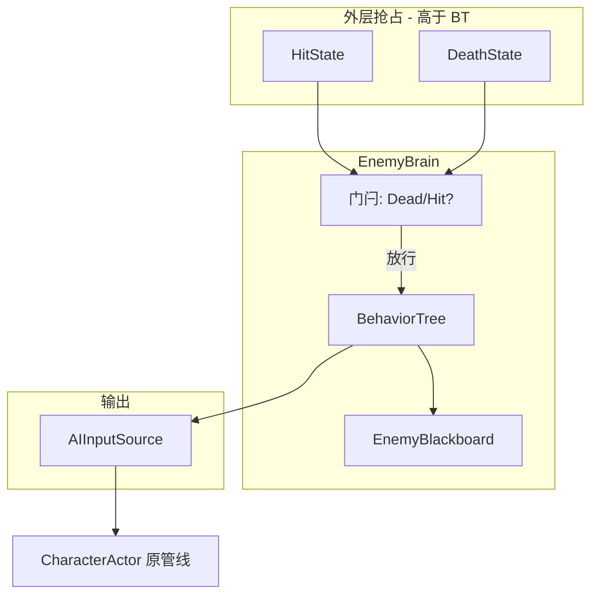

# DiavoloGame 敌人行为树方案

> 基准：`develop`（敌人 AI 初版已落地：`EnemyBrain` 五态 FSM + `AIInputSource`）  
> 制定日期：2026-07-30  
> 前置文档：[ENEMY_SYSTEM_INTEGRATION_PLAN.md](./ENEMY_SYSTEM_INTEGRATION_PLAN.md)  
> 本次范围：**只做行为树决策层**；NavMesh / A\* 寻路另开迭代，本方案预留接口不实现

---

## 1. 结论摘要

1. **自研轻量行为树**，不用第三方 BT 插件（避免授权与架构适配债）。
2. **BT 只写黑板 / `AIInputSource`**，禁止直调 `ActionExecutor` / 强制切招。
3. **Hit / Death 不进树**：由 `CharacterReactionService` 外层抢占；BT 在受控期间不 Tick 或 Tick 前被门闩拦住。
4. **用 BT 替换 `EnemyBrain` 内 Idle/Chase/Attack 决策**，删除与 BT 并行的五态业务 switch（保留 `EnemyBrainState` 仅作调试快照可选）。
5. **策略资产化**：`EnemyDefinition` 引用 `EnemyBehaviorTreeAsset`；数值仍读 `EnemyBrainProfile`。
6. **第一版节点库约 12 个**，先复现现有「进战追击 + 冷却普攻」，再扩展巡逻/风筝等策略。

---

## 2. 目标与非目标

### 2.1 目标

| 项 | 验收 |
|----|------|
| 等价替换 | 现有近战怪：进 `aggro` 追击、进 `attackRange` 且冷却好时 `PulseAttack`、脱战停步 |
| 受击/死亡 | 挨打进 Hit、死亡停 AI，行为与现网一致 |
| 可配置 | 换一张树资产即可变成「只追不打」或「更远才攻击」，无需改 C# switch |
| 架构合规 | Domain 纯 C#；出招仍走 Intent → Driver → Graph |

### 2.2 非目标（本迭代不做）

- NavMesh / A\* / 动态避障（预留 `IEnemyPathQuery`）
- 完整 GraphView 可视化编辑器（可用嵌套 SO / 列表编辑；Graph 放 Phase 2）
- GOAP、Utility AI、并行复杂战斗子树
- BT 内播放受击/死亡 Action
- 第三方 Behavior Designer / NodeCanvas / Unity Behavior 包

---

## 3. 架构位置

### 3.1 改造后数据流

```text
EnemyController.Update
  └─ EnemyHandle.Tick
       ├─ [若 Dead] 不跑 BT
       ├─ [若 CharacterState==Hit] ClearAll，不跑 BT（或跑空）
       ├─ EnemyBrain.Tick
       │    └─ BehaviorTree.Tick(blackboard, deltaTime)
       │         ├─ Condition 读 Perception / Profile / Cooldown
       │         └─ Action 写 AIInputSource / Blackboard
       └─ CharacterActor.Tick
            Input → Intent → ActionDriver → SM / Locomotion / Action
```



### 3.2 职责划分

| 模块 | 职责 |
|------|------|
| `CharacterReactionService` | 生命值 → EnterHit / EnterDeath；回调 Brain 门闩 |
| `EnemyBrain` | 持有树实例、黑板、门闩、冷却表；每帧 Tick |
| `BehaviorTree` + 节点 | 决策逻辑（可配置） |
| `AIInputSource` | 唯一移动/攻击输出通道 |
| `EnemyPerception` | 只读快照，供条件节点读取 |
| `IEnemyPathQuery` | **预留**：返回追击方向；首版实现 = 直线朝向目标 |

### 3.3 与现有五态 FSM 的迁移策略

| 旧 `EnemyBrainState` | BT 中的表达 |
|----------------------|-------------|
| Idle | 根 Selector 未命中追击/攻击时的默认（StopMove） |
| Chase | `Sequence(InAggro, MoveTowardTarget)` |
| Attack | `Sequence(InAttackRange, CdReady, IsLocomotion, StopMove, PulseAttack)` |
| Hit | **不进树**，门闩 |
| Dead | **不进树**，门闩 + `Stop()` |

迁移原则（`no-legacy-compatibility`）：

- 合入后 **删除** `EnemyBrain` 内 Idle/Chase/Attack 的 switch 业务实现。
- `EnemyBrainState` 可改为「调试用派生状态」（由黑板/上次成功行动推断），或删除对外依赖后仅保留日志枚举。
- 不保留「FSM 与 BT 双轨同时决策」。

---

## 4. 运行时模型

### 4.1 节点状态

```text
enum BehaviorStatus
{
  Success,
  Failure,
  Running
}
```

- **Success / Failure**：瞬时结束，父节点继续决策。
- **Running**：跨帧行动（如 Wait、等待攻击起手确认）；父 Sequence 保持在该子节点。

每帧从根 Tick；默认 **单次遍历预算** 足够（节点少）。禁止节点内 `while` 死循环。

### 4.2 黑板 `EnemyBlackboard`

运行时每敌一份，不进 SO：

| 键 | 类型 | 说明 |
|----|------|------|
| `Self` | Transform | 自身 |
| `Target` | Transform | 当前目标（可空） |
| `HasTarget` | bool | |
| `PlanarDistance` | float | |
| `PlanarDirection` | Vector3 | 指向目标（或路径方向预留） |
| `CharacterState` | CharacterStateType | |
| `IsDead` | bool | |
| `MoveDesire` | Vector2 | 本帧期望移动（节点写，Brain 帧末提交） |
| `AttackPulse` | bool | 本帧是否请求攻击脉冲 |
| `LastAttackSuccess` | bool | 供 CD 逻辑 |
| `DeltaTime` | float | |
| `Profile` | EnemyBrainProfile | 只读数值 |
| `PathDirection` | Vector3 | 预留；首版 = PlanarDirection |

**帧末提交规则**（避免多节点互相覆盖混乱）：

```text
1. 帧初：Blackboard.ResetFrameOutputs()  // MoveDesire=0, AttackPulse=false
2. Tick BT
3. Brain 根据输出：
   - SetMove(MoveDesire)
   - if AttackPulse: PulseAttack()
4. 若门闩 Hit/Dead：ClearAll，跳过 2~3 的输出
```

### 4.3 树资产 `EnemyBehaviorTreeAsset`

```text
EnemyBehaviorTreeAsset : ScriptableObject
├─ root : BehaviorNodeAsset          // 序列化节点树
└─ (可选) displayName / description
```

节点资产基类：

```text
BehaviorNodeAsset : ScriptableObject  或  [Serializable] 嵌套 class
├─ 复合节点持有 children[]
├─ 装饰节点持有 child
└─ 叶节点持有参数（距离、intent、秒数等）
```

**第一版序列化建议**：`[Serializable]` 嵌套类 + `SerializeReference` 多态（Unity 2019.3+），单文件树资产，避免海量子 SO。  
若 SerializeReference 不熟，可用「节点列表 + parentIndex」扁平表。

### 4.4 运行时实例

```text
BehaviorTree
  ├─ 从 Asset Bind 出 BehaviorNode 运行时图（或直接解释 Asset）
  └─ Tick(EnemyBlackboard bb) -> BehaviorStatus

IBehaviorNode
  BehaviorStatus Tick(EnemyBlackboard bb)
  void Reset()   // 树重置 / 门闩恢复时调用
```

装配：

```text
EnemyActorFactory
  → new EnemyBrain(profile, perception, input, facingProxy, treeAsset)
  → brain 内 BehaviorTree.Build(treeAsset)
```

`EnemyDefinition` 增加：

```text
behaviorTree : EnemyBehaviorTreeAsset
```

缺省树：提供 `BT_MeleeChaseAttack` 默认资产，行为等价旧 FSM。

---

## 5. 节点库（第一版）

### 5.1 复合节点

| 节点 | 语义 |
|------|------|
| `Selector` | 子节点按序；Success 则 Success；全 Failure 则 Failure；Running 则 Running |
| `Sequence` | 子节点按序；Failure 则 Failure；全 Success 则 Success；Running 则 Running |

暂不做 `Parallel`（输入单通道，并行易打架）。

### 5.2 装饰节点

| 节点 | 语义 |
|------|------|
| `Inverter` | 反转 Success/Failure；Running 透传 |
| `Succeeder` | 子节点结束一律 Success（用于可选分支） |
| `Repeater` | 可选；首版可不做 |
| `CooldownGate` | 子树 Success 后进入冷却（见 5.4） |

### 5.3 条件节点（瞬时 Success/Failure）

| 节点 | 参数 | 说明 |
|------|------|------|
| `HasTarget` | — | `bb.HasTarget` |
| `DistanceLessEqual` | `distance` 或读 Profile 键 | `PlanarDistance <= x` |
| `DistanceGreater` | `distance` | |
| `InAggro` | — | `<= AggroRadius` |
| `OutOfAggro` | — | `> LoseAggroRadius` |
| `InAttackRange` | — | `<= AttackRange` |
| `IsCharacterState` | `CharacterStateType` | 如 Locomotion |
| `CooldownReady` | `cooldownId` | 见冷却表 |

条件失败返回 Failure，不写输出。

### 5.4 行动节点

| 节点 | 参数 | 行为 | 状态 |
|------|------|------|------|
| `StopMove` | — | `MoveDesire = 0` | Success |
| `MoveTowardTarget` | `magnitude?` 默认 Profile | 刷新 facing；`MoveDesire = (0, mag)`；方向用 `PathDirection` | Success（首版瞬时；有寻路后可 Running） |
| `FaceTarget` | — | 只刷新 facingProxy | Success |
| `PulseAttack` | — | `AttackPulse = true` | Success；由 Brain 调 `PulseAttack()` |
| `Wait` | `seconds` | Running 直至结束 | Running → Success |
| `ClearIntent` | — | Move=0 且不脉冲 | Success |

**攻击冷却**不放在 BT 节点里写死业务，而用：

```text
CooldownGate(cooldownId = "basicAttack", seconds = Profile.AttackCooldownSeconds)
  └─ Sequence(InAttackRange, IsLocomotion, StopMove, PulseAttack)
```

或行动成功后 `Brain.NotifyActionCommitted("basicAttack")`。  
失败起手：若 `PulseAttack` 后下一帧仍非 Action，写入 `FailedAttackRetrySeconds`（逻辑可留在 Brain 辅助，或 `WaitAttackConfirm` 节点 Phase 1.1）。

### 5.5 预留（寻路迭代）

| 节点 | 说明 |
|------|------|
| `MoveAlongPath` | 调 `IEnemyPathQuery.GetSteerDirection`，写 MoveDesire |
| `HasPath` | 路径有效 |

首版 `IEnemyPathQuery` 默认实现：

```csharp
direction = flatten(target - self); // 等同现在直线追
```

---

## 6. 默认树：近战追打（等价旧 FSM）

```text
Selector                         // 根
├─ Sequence                      // 攻击
│   ├─ HasTarget
│   ├─ InAttackRange
│   ├─ IsCharacterState(Locomotion)
│   ├─ CooldownReady("basicAttack")
│   ├─ StopMove
│   └─ CooldownGate("basicAttack")   // 或 Pulse 后由 Brain 上 CD
│        └─ PulseAttack
├─ Sequence                      // 追击
│   ├─ HasTarget
│   ├─ InAggro                   // distance <= aggro；已在 lose 外则失败
│   └─ MoveTowardTarget
└─ StopMove                      // Idle
```

脱战：`InAggro` 使用「曾进战则用 LoseAggroRadius」需要黑板旗位：

```text
bb.IsAggroed
  进入：Distance <= AggroRadius → true
  退出：Distance > LoseAggroRadius → false
条件节点 InCombatAggro：bb.IsAggroed == true
```

与旧 `HasAggro` / `LoseAggroRadius` 语义对齐。

### 6.1 示例策略变体（证明可配置）

**只追不打**

```text
Selector
├─ Sequence(InCombatAggro, MoveTowardTarget)
└─ StopMove
```

**更远才攻击**（改 Profile.AttackRange 或节点覆盖 distance=4）

```text
攻击 Sequence 里 DistanceLessEqual(4) 替代 InAttackRange
```

---

## 7. 门闩与生命周期

```text
EnemyBrain.NotifyHit()
  → _preempted = Hit
  → input.ClearAll()
  → tree.Reset()          // 清 Running 的 Wait/Sequence 索引

EnemyBrain.NotifyDeath()
  → _preempted = Dead
  → input.ClearAll(); _running = false
  → tree.Reset()

Tick:
  if !_running or Dead: return
  perception → 填黑板
  if CharacterState == Hit or _preempted == Hit:
      ClearAll(); 
      if 已离开 Hit: _preempted = None
      return
  tree.Tick(bb)
  提交 Move / AttackPulse
  刷新 facing（MoveToward / Face 节点内或统一后置）
```

攻击确认 CD（保持旧手感）：

```text
Pulse 后进入「等待起手」辅助（可放 Brain，不必进树）：
  - 进入 Action → 上 AttackCooldownSeconds
  - 仍 Locomotion → FailedAttackRetrySeconds
```

该辅助是**输入结果观测**，不是第二套决策；BT 只负责何时 Pulse。

---

## 8. 目录与类型清单

```text
Assets/Scripts/Domain/Enemy/
  BehaviorTree/
    BehaviorStatus.cs
    IBehaviorNode.cs
    BehaviorTree.cs
    EnemyBlackboard.cs
    Nodes/
      SelectorNode.cs
      SequenceNode.cs
      InverterNode.cs
      ConditionNodes.cs      // HasTarget, Distance*, InAggro, IsCharacterState, CooldownReady
      ActionNodes.cs         // StopMove, MoveTowardTarget, FaceTarget, PulseAttack, Wait
    IEnemyPathQuery.cs       // 预留
    StraightPathQuery.cs     // 首版直线
  EnemyBehaviorTreeAsset.cs  // SO 树定义（或放 Definitions 子文件夹）
  EnemyBrain.cs              // 改为 BT 宿主
  EnemyDefinition.cs         // + behaviorTree 引用

Assets/Data/Enemy/BehaviorTrees/
  BT_MeleeChaseAttack.asset
```

命名：用 `BehaviorTree` / `Node` / `Service`（PathQuery），**不用** `Runtime` 后缀。

Editor（可第二阶段）：

```text
Assets/Scripts/Editor/Enemy/
  EnemyBehaviorTreeEditor.cs   // 列表/树状 Inspector
```

---

## 9. 配置改动

### 9.1 `EnemyDefinition`

```text
+ [SerializeField] EnemyBehaviorTreeAsset behaviorTree;
```

`Validate`：`behaviorTree != null`（或允许空时回退内置默认树，但按 no-legacy 原则：**强制配置资产**）。

### 9.2 `EnemyBrainProfile`

保留半径/冷却/移动幅度等；**不把树结构写进 Profile**。  
节点默认可绑定「读 Profile 键」减少重复填数。

### 9.3 数据目录

```text
Assets/Data/Enemy/
  EnemyDefinition.asset
  EnemyBrainProfile.asset
  BehaviorTrees/BT_MeleeChaseAttack.asset
```

---

## 10. 实施阶段

### Phase BT-1 — 骨架 + 等价默认树（本迭代主目标）

- [ ] `BehaviorStatus` / `IBehaviorNode` / `BehaviorTree` / `EnemyBlackboard`
- [ ] Selector / Sequence / 条件与行动节点（第一节库）
- [ ] `StraightPathQuery`
- [ ] `EnemyBehaviorTreeAsset` + `BT_MeleeChaseAttack`
- [ ] `EnemyBrain` 改为 BT 宿主；删除 Idle/Chase/Attack switch
- [ ] Factory / Definition 接线
- [ ] Hit/Death 门闩与 `tree.Reset()`

**验收**

1. 进圈追、贴脸停、冷却普攻  
2. 受击硬直中无移动无攻击  
3. 死亡后不决策  
4. 换「只追不打」树资产行为变化  

### Phase BT-2 — 配置体验

- [ ] Inspector 树编辑（增删子节点、多态 SerializeReference）
- [ ] 运行时调试：当前 Running 节点路径日志 / 可选 Gizmo  
- [ ] `WaitAttackConfirm` 节点化（可选）

### Phase BT-3 — 与寻路汇合

- [ ] `NavMeshPathQuery : IEnemyPathQuery`
- [ ] `MoveAlongPath` 替换直线 `MoveTowardTarget`（或内部切换）
- [ ] 多敌 repath 错峰

---

## 11. 风险与对策

| 风险 | 对策 |
|------|------|
| Sequence 卡在 Running 导致受击后乱序 | 门闩时 `tree.Reset()` |
| 多行动节点同帧写 Move | 帧初清空 + 约定后写覆盖 / 仅叶行动写 Move |
| BT 直接起招 | Code Review 禁止；节点 API 不暴露 Executor |
| SerializeReference 迁移麻烦 | 第一版节点类型稳定后再扩展；资产小可重建 |
| 调试困难 | 打日志：每帧根结果 + Running 路径；Debug 开关 |
| 与旧 `EnemyBrainState` UI 依赖 | Controller 调试改显示「派生状态」或黑板摘要 |

---

## 12. 测试清单

1. 默认树 ≈ 旧 FSM 手感（半径与 CD 同 Profile）。  
2. 攻击中再进攻击距离：不因 Sequence 重入每帧 Pulse（CooldownGate / Brain CD）。  
3. Pulse 失败：短 CD 后可重试。  
4. Hit 期间 ClearAll；出 Hit 后能重新追打。  
5. 死亡：BT 停止，Despawn 流程不变。  
6. 替换只追树：永不 `PulseAttack`。  
7. 无 Target：StopMove，不报错。  

---

## 13. 决策记录

| 日期 | 决策 | 理由 |
|------|------|------|
| 2026-07-30 | 自研轻量 BT，不上插件 | 与 Intent 管线契合、无授权、节点面可控 |
| 2026-07-30 | Hit/Death 外层门闩，不进树 | 与 ReactionService 单一抢占源一致 |
| 2026-07-30 | 删除 FSM 业务 switch，不双轨 | 符合 no-legacy；避免双脑 |
| 2026-07-30 | 寻路仅预留接口 | 用户要求先做 BT；直线查询保等价行为 |
| 2026-07-30 | 帧末统一提交 Move/Pulse | 防止节点互相覆盖造成抖动输入 |

---

## 14. 下一步

方案确认后，按 **Phase BT-1** 在 `DiavoloGame` 仓库实现：先默认近战树等价替换，再给 `EnemyDefinition` 挂可切换资产。  
寻路迭代单独开 `ENEMY_PATHFINDING_PLAN`（或本文件 Phase BT-3）。
