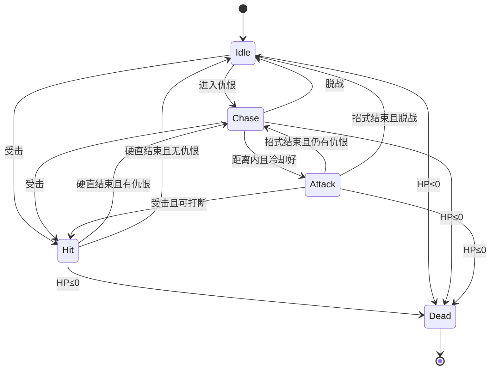

# ACTGame 敌人系统接入方案

> 基准：`develop`（约 `7c0e8fb` 及后续）  
> 制定日期：2026-07-28  
> **历史文档：** AI I/O 曾定「只替换输入源 / InputFrame」。**终态**以 [2026.8.10/ENEMY_BT_DISCRETE_COMBAT_AND_CONFIG_PLAN.md](./2026.8.10/ENEMY_BT_DISCRETE_COMBAT_AND_CONFIG_PLAN.md) 为准（Desire + Request）；本文保留生成/装配等仍有效叙述。  
> 目标：在现有 `CharacterActor` / Action / Locomotion 管线上接入敌人配置、生成与 AI（追击、攻击、受击）  
> 实施状态（2026-07-29）：运行时代码已落地；后续 BT Phase-1 已替换五态决策 switch。

---

## 1. 结论摘要

1. **敌人复用整条角色运行时**：`CharacterConfig` → `CharacterActorFactory` → `CharacterActor`，不另起移动/出招栈。
2. **AI 只替换输入源**：`AIInputSource : ICharacterInputSource` 合成 `PlayerInputFrame`，经 `GameplayIntentProducer` → `CharacterActionDriver` → Graph 出招。
3. **Brain 负责决策，不直调 Executor**：禁止 AI 直接 `TryStart` / `TryInterrupt`，以免绕过 Cancel、Recovery、缓冲。
4. **首版 AI 用简单 FSM**：`Idle / Chase / Attack / Hit / Dead`，覆盖追击、攻击、受击；不上行为树。
5. **受击与死亡依赖战斗闭环补齐**：HP + `ApplyHitCommand` + 外层 `Hit`/`Death`（或受击 Action），与敌人里程碑绑定落地。

---

## 2. 目标与非目标

### 2.1 首版目标（可玩验收）

| 能力 | 验收标准 |
|------|----------|
| 配置 | 一份 `EnemyDefinition` + 敌人 `CharacterConfig` / Graph 可驱动一只怪 |
| 生成 | Scene 刷出 1 只敌人并注册到索敌/战斗 Actor 列表 |
| 追击 | 进仇恨圈后朝玩家移动；脱战回 Idle |
| 攻击 | 进入攻击距离且冷却就绪时出招，走敌人 ActionGraph |
| 受击 | 被玩家打中后进入硬直（Hit），期间不追击、不出招；结束后恢复 Chase |
| 死亡 | HP≤0 停 AI、注销目标、播死亡或 Despawn |

### 2.2 非目标（首版不做）

- 完整行为树 / GOAP / Utility AI
- 敌人专属第二套 ActionExecutor / 状态机
- 多波次关卡编排、复杂刷怪表（可留扩展点）
- 远程弹道、护盾、破防条（可先预留字段）
- Agent 直接改 `.asset` / Prefab（由 Editor 人工配置）

---

## 3. 架构总览

```text
EnemySpawnController (App)
        │ SpawnEnemyCommand
        ▼
EnemyActorFactory
  ├─ CharacterActorFactory.Create(config, AIInputSource, ...)
  ├─ EnemyBrain + EnemyHealth
  └─ 注册 CombatActorSystem / TargetSystem
        │
        ▼
EnemyController.Tick
  ├─ EnemyBrain.Tick          → 写 AIInputSource 本帧意图
  └─ CharacterActor.Tick
        ├─ InputManager.IngestFrame(AIInputSource)
        ├─ GameplayIntentProducer
        ├─ CharacterActionDriver   → 起手 / Cancel / 移动取消
        ├─ Motor + CharacterStateMachine
        │     ├─ Locomotion（追击位移）
        │     └─ Action（攻击 / 受击招）
        └─ Animation
```



---

## 4. 配置设计

### 4.1 分层

| 资产 | 职责 |
|------|------|
| `CharacterConfig` | 模型、Locomotion、Motor、CombatProfile、挂点、受击/死亡 Action |
| `CombatModeProfile` + `ActionGraph` | 敌人出招表（普攻 1～2 段；可选受击/死亡 Action） |
| `GameplayIntentProfile` | 可复用玩家 Profile，或敌人精简版（仅 Attack 等） |
| `EnemyDefinition` | 敌人身份：引用 CharacterConfig、Brain、HP、仇恨半径 |
| `EnemyBrainProfile` | 追击/攻击/受击 AI 数值 |

`CharacterConfig` 管「怎么动、怎么打」；`EnemyDefinition` 管「是谁、怎么想、多少血」。

### 4.2 `EnemyDefinition`（建议字段）

```text
EnemyDefinition : ScriptableObject
├─ displayName
├─ characterConfig : CharacterConfig
├─ brainProfile : EnemyBrainProfile
├─ maxHp
├─ teamId = 1                         // EnemyDefinition 独立持有，避免复用身体配置时继承玩家阵营
```

### 4.3 `EnemyBrainProfile`（建议字段）

```text
EnemyBrainProfile : ScriptableObject
├─ aggroRadius              // 进战
├─ loseAggroRadius          // 脱战（略大于 aggro，防抖）
├─ attackRange              // 开始攻击距离
├─ attackCooldownSeconds
├─ chaseMoveMagnitude       // 写入 Move 的幅度（0~1），影响走/跑
├─ stopDistance             // 贴身停步，避免顶模型
├─ CharacterConfig.Combat.Reactions.defaultHitStunSeconds
│                          // ReactionResolver 未解析到受击动作时的唯一硬直时长
├─ repathIntervalSeconds    // 朝向/假相机刷新间隔（可选）
├─ faceTargetWhileChase     // 追击时是否持续面向目标
```

### 4.4 `CharacterConfig` 校验拆分

现有 `ValidateForPlayer` 强制 `InputActions`。敌人需要：

```text
ValidateForEnemy()
  ✓ ModelPrefab / DefaultLocomotionProfile / CombatProfile
  ✓ GameplayIntentProfile（AI 仍走 Intent 管线）
  ✗ 不要求 InputActions
```

阵营约定：**玩家 `CharacterConfig.Combat.teamId = 0`，敌人 `EnemyDefinition.teamId = 1`**（索敌与命中均排除同阵营）。

### 4.5 建议资产目录

```text
Assets/Data/
  CharacterConfig/Enemy_Xxx.asset
  Combat/Actions/Enemy/Xxx/          # Graph、ActionDefinition
  Enemy/
    EnemyDefinition_Xxx.asset
    EnemyBrainProfile_Melee.asset
```

---

## 5. 生成与生命周期

### 5.1 App 入口

| 类 | 位置 | 职责 |
|----|------|------|
| `EnemySpawnController` | `App/Controllers/Gameplay` | 场景刷怪点、发 Spawn |
| `EnemyController` | 同上 | 单敌 Empty 根：Tick Brain + Actor |
| `SpawnEnemyCommand` | `App/Commands` | 创建实例、注册 System |
| `DespawnEnemyCommand` | 同上 | 注销、Dispose、回收 |

首版可先无 IOC System，用 Controller 内列表；第二阶段再抽 `EnemySpawnSystem`（池化、上限）。

### 5.2 工厂

```text
EnemyActorFactory.Create(owner, root, EnemyDefinition, targetProvider, hitDetected)
  1. 建 AIInputSource + EnemyBrain + EnemyHealth
  2. CharacterActorFactory.Create(config, aiInput, cameraTransform: facingProxy, ...)
  3. 注册 TargetSystem（IHurtboxTarget）与 CombatActorSystem
  4. 订阅 AttackHitEvent / 命中回调 → Health → Brain.NotifyHit / NotifyDeath
  5. 返回 EnemyHandle（Controller 可持有）
```

销毁顺序：`Brain.Stop` → `Actor.Disable` → 注销目标 → `Actor.Dispose` → Destroy/回池。

### 5.3 刷怪点（首版）

```text
EnemySpawnPoint（场景组件）
├─ enemyDefinition
├─ spawnOnStart : bool
└─ maxAlive : int = 1
```

---

## 6. AI 设计（追击 / 攻击 / 受击）

### 6.1 模块拆分

| 类 | 职责 |
|----|------|
| `EnemyBrain` | 感知 + FSM 决策；每帧写出「期望移动 / 攻击边沿 / 受控标志」 |
| `AIInputSource` | 把 Brain 输出变成 `PlayerInputFrame` |
| `EnemyPerception` | 读玩家位置、距离、自身是否在 Action/Hit |
| `EnemyHealth` | HP、无敌帧（可选）、死亡事件 |

Brain **不**持有 `ActionExecutor` 的选招权；只通过输入边沿请求攻击。

### 6.2 感知输入（每帧）

```text
PerceptionSnapshot
├─ hasTarget
├─ targetPosition / planarDistance / planarDirection
├─ selfPosition / selfForward
├─ isInAction          // CharacterState == Action 且非受击招
├─ isInHit             // CharacterState == Hit
├─ isDead
├─ canBeInterrupted    // 供受击打断判断（可先粗暴：Attack 态可被 Hit 强制切）
```

目标获取：首版直接注入「玩家 Transform / CharacterActor」；后续可换成 `TargetSystem` Query。

### 6.3 FSM 状态职责

#### Idle

- Move = 0，不发 Attack  
- `distance ≤ aggroRadius` → Chase  
- 收到受击 → Hit  
- HP≤0 → Dead  

#### Chase（追击）

- 更新面向代理（见 6.5），`Move = forward * chaseMoveMagnitude`  
- `distance ≤ stopDistance` 时 Move = 0（或微小 strafing，首版停步即可）  
- `distance ≤ attackRange` 且 `attackCooldownReady` 且不在 Action → 发一帧 Attack Pressed，切 Attack  
- `distance > loseAggroRadius` → Idle  
- 受击 → Hit  

#### Attack（攻击）

- 进入时：`AIInputSource` 脉冲 `Attack` Pressed（随后 Held/Released 按边沿规范）  
- 等待 `CharacterState` 回到 Locomotion 或当前攻击 Action 结束  
- 期间 Move = 0（或保留极小位移，首版锁停）  
- 攻击结束：重置冷却计时 → Chase / Idle  
- 若配置允许招式中受击：收到 Hit → Hit  
- 注意：真正选哪招由敌人 Graph Entry×`Attack` 决定，Brain 不点名 ActionId  

#### Hit（受击）

- **立即清空** Move 与攻击缓冲意图，避免硬直中误出招  
- 当前正式路径：外层 `CharacterStateType.Hit` + 受击 `ActionDefinition`；`CharacterReactionService` 使用注入的 Resolver 按 HitPayload 的 ReactionId 生成请求，再交给 `CharacterActor.EnterHit`。Brain 只通过 Service 的副作用委托接收 Hit 抢占通知，不参与表现选招。
- 硬直结束且 HP>0 → Chase / Idle  
- HP≤0 → Dead  

> 当前 Hit / Damage / Reaction 链路均已接通；资产侧仍需配置 CharacterConfig.Combat.Reactions。

#### Dead

- 停 Brain 决策、停输入  
- 由共享 `CharacterReactionService` 解析 Death 规则并播放对应 Action；无匹配则直接完成表现
- 注销 `TargetSystem` / `CombatActorSystem`  
- 不可再进 Chase/Attack  

### 6.4 攻击脉冲时序

```text
帧 N:   Brain 判定可攻 → AIInputSource.RequestAttackPulse()
帧 N:   CaptureFrame: Attack ∈ Pressed
帧 N:   IntentProducer → Attack → ActionDriver → TryResolveStart → 进 ActionState
帧 N+1: Attack 不再 Pressed（避免每帧重触发）
冷却:   从「成功进入攻击 Action」或「攻击结束」起算（建议从成功起手起算，防失败狂点）
```

失败起手（距离判错、被挡）：不切 Attack 态，留在 Chase，短 CD 防抖（如 0.2s）。

### 6.5 追击移动与「假相机」

玩家 Motor 为**相机相对**移动。敌人推荐：

```text
每帧（或 repath 间隔）：
  facingProxy.forward = flatten(targetPos - selfPos)
  actor.SetCameraTransform(facingProxy)
  AIInputSource.Move = Vector2(0, chaseMoveMagnitude)  // 相对「朝向玩家」的前进
```

备选：`cameraTransform = null` + Motor 支持世界方向写入（改动更大，首版不优先）。

### 6.6 `AIInputSource` 契约

```text
ICharacterInputSource
  CaptureFrame() -> PlayerInputFrame
  ConfigureDiscreteInputs(...)  // no-op
  Enable / Disable

对外 API（供 Brain）:
  SetMove(Vector2)
  PulseAttack()          // 下一帧 Pressed，其后自动清
  ClearAll()             // 进 Hit/Dead 时调用
```

离散键不依赖 `InputActionReference`；`GameplayIntentProducer` 需能从「逻辑键」或专用敌人 Profile 映射出 `GameplayIntentType.Attack`。  
若现有 Producer 强依赖 InputAction id：为 AI 增加「直接推送 Intent」旁路，或给 Ai 帧填与 Profile 匹配的 synthetic control id——**实现时选改动更小的一条，禁止双轨长期并存**。

---

## 7. 受击与伤害闭环（与 AI 绑定）

### 7.1 数据流

```text
玩家 Action Hitbox
  → HitboxFrameConsumer
  → hitDetected / ApplyHitCommand
  → AttackHitEvent
  → EnemyHealth.ApplyDamage
       ├─ HP>0 → EnemyBrain.NotifyHit(hitContext)
       └─ HP≤0 → EnemyBrain.NotifyDeath()
```

### 7.2 对 AI 的约束

| 阶段 | Brain 行为 | 角色状态 |
|------|------------|----------|
| 正常 | Chase/Attack | Locomotion / Action |
| 受击中 | 强制 Hit，忽略追击/攻击欲望 | Hit 或受击 Action |
| 死亡 | Dead，不再 Tick 决策 | Death / Despawn |

受击优先级：**Death > Hit > Attack 欲望 > Chase**。

Hit 反应由有效命中直接触发，不依赖最终伤害必须大于 0；生命值扣减与受击表现分别处理。自身角色根及其全部模型子层级不会生成命中或镜头反馈事件。

### 7.3 玩家被敌人击中

对称走同一套 Hitbox → ApplyHit；玩家 Hit 状态可与敌人同期实现，避免只做单向伤害。

---

## 8. 目录与类清单

```text
Assets/Scripts/
  App/Controllers/Gameplay/
    EnemyController.cs
    EnemySpawnController.cs
  App/Commands/
    SpawnEnemyCommand.cs
    DespawnEnemyCommand.cs
  App/Systems/                         # 第二阶段
    EnemySpawnSystem.cs
  Domain/Enemy/
    EnemyDefinition.cs
    EnemyBrainProfile.cs
    EnemyBrain.cs
    EnemyBrainState.cs                 # enum Idle/Chase/Attack/Hit/Dead
    EnemyPerception.cs
    EnemyHealth.cs
    AIInputSource.cs
    EnemyActorFactory.cs
  Domain/Character/
    CharacterConfig.cs                 # + ValidateForEnemy
  Domain/Combat/                       # 若 Hit/Death 状态落地
    ... Hit 状态、伤害结算扩展
```

命名遵循现有约定：`Controller` / `System` / `Command` / `Service` / `Actor`；Domain 不直接访问 `ACTGameArchitecture.Interface`。

---

## 9. 分阶段实施

### Phase A — 配置 + 生成 + 追击

- [x] `EnemyDefinition` / `EnemyBrainProfile`  
- [x] `ValidateForEnemy`  
- [x] `AIInputSource` + 假相机追击  
- [x] `EnemyController` + Factory 注册 Target  
- [x] Brain：`Idle` / `Chase`  

**验收**：进圈追玩家，出圈停；玩家能索敌到该敌人。

### Phase B — 攻击

- [x] Brain：`Attack` + 冷却 + 攻击脉冲  
- [ ] 敌人极简 ActionGraph（1～2 段普攻）  
- [x] 攻击中锁移动  

**验收**：贴身出招；Hitbox 可打到玩家；走原 Cancel/Recovery 管线。

### Phase C — 受击 + 死亡（战斗闭环）

- [x] `EnemyHealth` + `ApplyHit` 扣血  
- [x] Brain：`Hit` / `Dead`  
- [x] 外层 Hit 状态或受击 Action（优先正式路径）  
- [x] 死亡注销与 Despawn  

**验收**：挨打硬直；杀敌消失且不再被索敌；硬直中不追击不出招。

### Phase D — 可运营扩展

- [x] 刷怪点 / 存活上限（首版 Destroy 回收；对象池仍待扩展）  
- [ ] 多种 BrainProfile（近战参数变体）  
- [ ] 可选 Strafe / 攻击前摇面向修正  
- [ ] 多敌人时感知预算（间隔感知）

---

## 10. 与现有系统的衔接要点

| 现有模块 | 衔接方式 |
|----------|----------|
| `ICharacterInputSource` | AI 实现，已预留 |
| `CharacterActionDriver` | 完全复用，角色无关 |
| `ActionGraph` | 敌人独立 Graph，Entry×Attack |
| `LocomotionStateMachine` | 追击走 Locomotion；Attack/Hit 期间不驱动追击 Move |
| `CombatTargetLock` / TeamId | 敌人 teamId=1，互打排除同阵营 |
| `LocomotionResumeRequest` | 敌人一般不用 Dodge 恢复；可忽略 |
| `CharacterStateType.Hit/Death` | 与 Phase C 一起实现，避免 Brain 与外层状态不一致 |

---

## 11. 风险与对策

| 风险 | 对策 |
|------|------|
| Producer 绑死 InputAction id | AI 旁路推 Intent，或 synthetic 帧与 Profile 对齐 |
| Motor 相机相对导致追击方向错 | 假相机 facingProxy，文档 6.5 |
| Hit 未实现导致受击只能「停 AI」 | Phase B 用计时硬直；Phase C 升正式 Hit |
| AI 直调 Executor 造成双真源 | Code Review 禁止；只允许输入脉冲 |
| 多敌同帧打爆 | 首版 1～3 只；感知降频放 Phase D |
| 攻击失败狂触发 | 起手失败短 CD；成功起手才进 Attack 态 |

---

## 12. 测试清单（Play Mode）

1. Spawn 后 Idle 站立，无目标漂移。  
2. 玩家进入 `aggroRadius` → 追击；超过 `loseAggroRadius` → 停。  
3. 进入 `attackRange` → 出招动画与 Hitbox；冷却内不连捅。  
4. 玩家攻击命中 → 敌人硬直，硬直中不移动、不出招。  
5. 伤害杀敌 → 注销目标，索敌列表无僵尸引用。  
6. 敌人命中玩家 → 走同一套命中反馈（Phase C）。  
7. Action 中移动取消/Recovery 行为与玩家管线一致（无 AI 特判破坏）。  

---

## 13. 建议落地顺序（执行时）

1. 定 Unagi（或新怪）为试点：`EnemyDefinition` + 极简 Graph。  
2. 实现 `AIInputSource` + Chase（Phase A）。  
3. 接 Attack 脉冲（Phase B）。  
4. 与伤害/Hit 状态同迭代做受击死亡（Phase C）。  

---

## 14. 决策记录

| 日期 | 决策 | 理由 |
|------|------|------|
| 2026-07-28 | AI 经 `ICharacterInputSource` 接入 | 与 CONVENTIONS / ROADMAP 一致，复用 Driver |
| 2026-07-28 | Brain 用五态 FSM | 覆盖追击/攻击/受击；复杂度低于 BT |
| 2026-07-28 | 配置拆 CharacterConfig / EnemyDefinition | 身体与 AI/HP 分离，玩家配置不被污染 |
| 2026-07-28 | 追击用假相机 | 少改 Motor，快速验证 |
| 2026-07-28 | 受击与战斗闭环同 Phase C | 避免长期「假硬直」双轨 |
