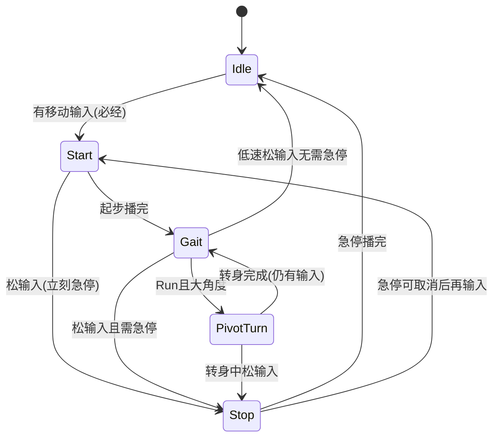

# Locomotion 扩展方案 — Phase / FootCycle

> 状态：**已实施（Phase A–C 代码）** — 2026-07-18（决议已锁定 §7#1–9；Phase D Motor 抛光未做）  
> 资产待办：AnimationProfile 绑定 Start / PivotTurn / StopL / StopR；创建并配置 `CharacterLocomotionProfile`（落脚时间与脚步音）后挂到 CharacterConfig。  
> 目标：在不破坏 `Locomotion` ↔ `Action` 顶层边界的前提下，支持起步、脚步相位、急停分脚、**Run（即冲刺）**大角度转身，以及过渡相位被松手时立刻接急停。  
> 相关：[`ANIMATION_PLAYABLE_MIGRATION_PLAN.md`](./ANIMATION_PLAYABLE_MIGRATION_PLAN.md)、架构文档 `LocomotionState` / `CharacterMotor`

---

## 0. 已锁定决议

| # | 决议 |
|---|------|
| 1 | 幅度 > `runThreshold` → **Run**（非冲刺） |
| 2 | **独立 Sprint**：Run 连续保持满输入达到 `sprintAfterRunSeconds`（默认 3s）后进入；仅 Sprint 可 Pivot |
| 3 | 尚无落脚记录时，急停默认 **右脚**（`FootSide.Right`） |
| 4 | 起步 **不分左右**：单条 `Start` Clip |
| 5 | 转身 **不分左右**：单条 `PivotTurn` Clip |
| 6 | 急停 **不用 Root Motion**；且 **先不实现** 减速曲线、转身位移等 Motor 特殊逻辑（首版以动画相位 + 现有位移为主） |
| 7 | **所有移动必须经 Start**（含 Walk，不可跳过） |
| 8 | `Start` 中改方向：**直接按当前输入旋转**（`FollowInput`），不重播 Start |
| 9 | `Stop` 可取消后再输入 → **回到 Start** |
| 10 | Profile 挂载点 | **暂定** `CharacterConfig` 独立引用 |
| 11 | 落脚数据来源 | **暂定** SO 标记表 |

---

## 1. 背景与问题

### 1.1 现状

| 路径 | 实现 | 缺口 |
|------|------|------|
| 状态 | `LocomotionState` 按 `MoveInputMagnitude` 选 Idle/Walk/Run | 无起步 / 转身 / 急停相位 |
| 位移 | `CharacterMotor.TickLocomotion` 平滑转向 + 水平 Move | 首版暂不扩展加减速/转身位移（决议 #6） |
| 动画键 | `AnimationKey` = Idle / Walk / Run | 无 Start、StopL/R、PivotTurn |
| 播放 | `PlayableAnimationPlayback` 已暴露 `NormalizedTime` / `HasFinished` | Locomotion 未消费时间轴信息 |
| 脚步 | 无 | 无法驱动落脚音与急停分脚 |
| 招式 | `ActionTimeline` + Notify | 专管战斗，不宜承接走跑循环 |

### 1.2 目标状态

```text
CharacterActor.Tick
  → CharacterStateMachine
      → LocomotionState.Tick
            → LocomotionService.Tick
                 ├─ 输入快照 / 朝向误差 / 着地
                 ├─ Phase FSM：Idle | Start | Gait | PivotTurn | Stop
                 ├─ FootCycle：支撑脚 + 落地点（共享真源）
                 ├─ MotorCommand → CharacterMotor.Apply（首版位移逻辑从简，见 §5.0）
                 └─ AnimationKey + FootPlanted → FootstepPlayer
      → ActionState（不变，仍锁动画）
```

### 1.3 需求摘要

| # | 需求 | 方案落点 |
|---|------|----------|
| 1 | 起步动画 | Phase `Start`：任何移动意图必须先 Start |
| 2 | 起步中立刻松手 → 急停 | `Start` → `Stop` |
| 3 | 转身中松手 → 急停 | `PivotTurn` → `Stop` |
| 4 | 仅「冲刺」大角度播转身 | 冲刺 ≡ **Run**；守卫 `Gait == Run`；**Walk 只平滑转** |

### 1.4 非目标 / 首版不做

- 不把起步 / 急停 / 转身做成 `ActionDefinition`
- 不新增顶层 `CharacterStateType`
- 不做独立 Sprint 键 / Sprint Clip / `Gait.Sprint`
- 不做 StartL/R、PivotL/R
- **不做** Root Motion；**不做**急停减速曲线、Pivot 专用位移/锁速（决议 #6，留待后续）
- 不做地面材质、IK、八向 BlendTree
- 不保留旧 Idle/Walk/Run 内联分支与新 Phase 双轨
- 不在 Agent 侧改 Prefab / `.asset` / 动画 Clip

---

## 2. 设计原则

1. **外层状态不变**：扩展全部落在 Locomotion 内部。
2. **脚步相位是唯一真源**：脚步声与急停选脚都读 `FootCycle`；无记录时用右脚。
3. **决策与执行分离**：Service 出命令；Motor 执行。首版 Motor 命令可很薄（沿用现位移）。
4. **数据驱动落脚标记**（暂定 SO 表）。
5. **与 Action Notify 解耦**。
6. **过渡可打断**：`Start` / `PivotTurn` 松输入立刻 `Stop`。
7. **旋转分档**：仅 `Gait(Run)` 大角度进 `PivotTurn`；Walk 与 Start 跟输入转。
8. **必经起步**：Idle/Stop→移动 一律 `Start`。
9. **小步可验证**。

---

## 3. 核心模型

### 3.1 Gait（稳态步态）

| Gait | 判定 | 旋转 | 可否 Pivot |
|------|------|------|------------|
| `Walk` | 有输入且幅度 ≤ `runThreshold` | 跟输入 `SmoothDamp` | **否** |
| `Run` | 有输入且幅度 > `runThreshold`（**即冲刺**） | 小角度跟输入；大角度 → `PivotTurn` | **是** |

不存在 `Sprint` 枚举值；文档中「冲刺」均指 `Run`。

### 3.2 Phase

| Phase | 进入 | 行为（首版） | 主要退出 |
|-------|------|--------------|----------|
| `Idle` | 静止 | 播 Idle；无移动意图 | 有输入 → **`Start`（必经）** |
| `Start` | Idle / Stop 取消后 | 播单条 `Start`；朝向 **FollowInput**；位移暂用现有逻辑 | 播完 → `Gait`；松输入 → `Stop` |
| `Gait` | Start 完成 | Walk/Run 循环 + FootCycle | 松输入 → Stop 或 Idle；**Run + 大角度 → PivotTurn** |
| `PivotTurn` | `Gait(Run)` 且 \|yaw\| ≥ 阈值 | 播单条 `PivotTurn`；朝向跟 Pivot 目标（动画切换）；**不做专用位移** | 完成 → `Gait(Run)`；松输入 → `Stop` |
| `Stop` | Start / Gait / Pivot 松输入 | 按脚播 `StopL`/`StopR`；**暂不实现减速曲线**（位移可停或沿用简单位移） | 结束 → Idle；可取消 → **`Start`** |



**低速松输入（仅 Gait）**：Walk 且速度低于急停阈值 → 可直接 Idle。  
**Start / Pivot 松输入**：无视速度门槛 → `Stop`。

### 3.3 旋转策略

| 相位 / 步态 | 旋转 |
|-------------|------|
| `Idle` / `Stop` | 保持朝向 |
| `Start` | **始终 FollowInput**（决议 #8） |
| `Gait(Walk)` | FollowInput；永不 Pivot |
| `Gait(Run)`，\|yaw\| < pivotAngle | FollowInput |
| `Gait(Run)`，\|yaw\| ≥ pivotAngle | → `PivotTurn` |
| `PivotTurn` | 朝向插值/对齐进入时锁定的目标方向（不跟输入即时扭头） |

```text
bool CanEnterPivotTurn(...) =>
    phase == Gait
    && gait == Run          // Run ≡ 冲刺
    && Abs(yawError) >= pivotAngleDegrees
    && HasMoveInput;
```

### 3.4 过渡打断

| 当前 | 松输入 | 备注 |
|------|--------|------|
| `Start` | → `Stop` | 无视 `stopMinSpeed` |
| `PivotTurn` | → `Stop` | 同上 |
| `Gait` | 速度够 → `Stop`；否则 → `Idle` | 用速度门槛 |
| `Stop` | 保持 | 再输入且可取消 → **`Start`** |

进 `Stop`：冻结 `LastPlanted`；若无记录 → **Right**；短 CrossFade（≤ 0.1s）。

### 3.5 FootCycle

| 字段 | 含义 |
|------|------|
| `LastPlanted` | 最近落地脚；默认 / 无记录 = **Right** |
| `Phase01` | 循环 Clip 归一化周期 |

在 `Gait`（及可选 Start 标记）上按 SO 标记采样；进 Stop/Pivot/Action 时冻结。

### 3.6 类型关系

| 现有 | 扩展后 |
|------|--------|
| `LocomotionState` | 委托 `LocomotionService` |
| `CharacterMotor` | 首版：薄 `Apply` 或仍走现 `TickLocomotion`；**不加**减速/转身位移 |
| `AnimationKey` | + `Start`、`PivotTurn`、`StopL`、`StopR`（**无 Sprint**） |
| Profile | 动画 Profile 映射 Clip；Locomotion Profile（暂定）阈值 + 落脚 |

---

## 4. 数据配置

### 4.1 资产分工（#10 暂定）

| 资产 | 职责 |
|------|------|
| `CharacterAnimationProfile` | Key → Clip + CrossFade |
| `CharacterLocomotionProfile` | 阈值、落脚标记、脚步音（暂定挂 `CharacterConfig`） |

### 4.2 落脚标记（#11 暂定 SO）

```text
FootPlantMarker { normalizedTime, foot }
```

Walk/Run 各配左右落脚；Start 可选。无任何落脚记录时 Stop 用右脚。

### 4.3 参数初值

| 参数 | 建议 | 说明 |
|------|------|------|
| `idleInputThreshold` | 0.01 | |
| `runThreshold` | 沿用 Motor | > 此为 Run（冲刺） |
| `stopMinSpeedFactor` | ~0.5× runSpeed | **仅 Gait→Stop** |
| `pivotAngleDegrees` | 110–135 | **仅 Run** |
| `startToGaitNormalized` | 1.0 或标记 | 起步结束 |
| `stopCancelNormalized` | 0.35–0.5 | 取消后 → Start |
| `interruptFadeDuration` | ≤ 0.1s | Start/Pivot → Stop |

---

## 5. 运行时流程

### 5.0 首版 Motor 范围（决议 #6）

**做：**

- 维持现有水平移动 + 按相位选择的旋转模式（FollowInput / Pivot 目标对齐 / Hold）
- Phase 切换驱动动画

**暂不做：**

- 急停减速曲线、滑步距离
- Pivot 期间锁速 / 弧线位移 / Root Motion
- Start 专用加速曲线（可先用现 walk/run 速度直接推）

后续单独开「Locomotion Motor 抛光」任务，不阻塞动画相位。

### 5.1 每帧

```text
1. Snapshot（MoveIntent、幅度、世界方向、着地）
2. yawError
3. Phase 转换（打断优先）
4. FootCycle.Tick（Gait）
5. MotorCommand（首版从简，见 §5.0）
6. Motor.Apply / TickLocomotion
7. Animation.Play
8. Footstep 消费
9. Context 同步
```

**同帧优先级：**

```text
1) 松输入 ∧ phase ∈ {Start, PivotTurn} → Stop
2) 松输入 ∧ phase == Gait → Stop | Idle
3) Gait(Run) ∧ 可 Pivot → PivotTurn
4) Start 播完 → Gait(Walk|Run)
5) PivotTurn 播完 ∧ 有输入 → Gait(Run)
6) Stop 播完 → Idle；Stop 可取消 ∧ 有输入 → Start
```

### 5.2 起步（必经）

```text
Idle|StopCancel + HasMoveInput → Start →（播完）→ Gait(Walk|Run)
Start 全程 FollowInput
```

### 5.3 起步秒停 / 转身秒停

```text
Start|PivotTurn + !HasMoveInput → Stop（默认脚 Right 若无记录）
```

### 5.4 Run 大角度转身

```text
Gait(Run) + HasMoveInput + |yaw| >= pivot → PivotTurn
Gait(Walk) + 任意角度 → 仅 FollowInput，无 Pivot
```

### 5.5 进入 Action

离开 Locomotion 时停脚步派发；`LastPlanted` 保留。

---

## 6. 代码结构（拟）

```text
Assets/Scripts/Domain/Character/Locomotion/
  FootSide.cs
  LocomotionPhase.cs              // Idle, Start, Gait, PivotTurn, Stop
  LocomotionGait.cs               // Walk, Run（无 Sprint）
  LocomotionInputSnapshot.cs
  LocomotionMotorCommand.cs       // RotationMode 等；位移字段首版可最少
  LocomotionService.cs
  LocomotionFootCycle.cs
  LocomotionFootstepPlayer.cs
  CharacterLocomotionProfile.cs   // 暂定

修改：
  LocomotionState.cs
  CharacterMotor.cs               // 薄接入；不加减速/转身位移
  CharacterAnimationService.cs    // 透传 NormalizedTime / HasFinished
  AnimationKey.cs                 // Start, PivotTurn, StopL, StopR
  CharacterAnimationProfile.cs
  CharacterActorFactory.cs
  CharacterConfig.cs              // 暂定挂 LocomotionProfile
```

无需扩展 Sprint 输入 Action。

---

## 7. 决议表（终稿）

| # | 问题 | 决议 |
|---|------|------|
| 1 | 跑/冲刺判定 | `> runThreshold` → Run；Run 持续默认 3s → Sprint |
| 2 | Sprint Clip | **有** `AnimationKey.Sprint` / `Gait.Sprint` |
| 3 | 无落脚时选脚 | **右脚** |
| 4 | 起步分脚 | **不分**；单 `Start` |
| 5 | 转身分脚 | **不分**；单 `PivotTurn` |
| 6 | Root Motion / 减速转身位移 | **关 Root Motion**；**首版不实现**减速与转身位移逻辑 |
| 7 | 挪步是否跳过 Start | **不跳过**；所有移动必经 Start |
| 8 | Start 中转向 | **FollowInput** |
| 9 | Stop 取消后 | → **Start** |
| 10 | Profile 挂载 | **暂定** `CharacterConfig` |
| 11 | 落脚数据 | **暂定** SO 标记表 |

---

## 8. 分阶段实施

### Phase A — 骨架 + FootCycle + 脚步（P0）

- Service：`Idle` / `Gait(Walk|Run)`，等价现网选片
- FootCycle + 脚步；透传 `NormalizedTime`
- 删除 `LocomotionState` 内联选 Key

### Phase B — Start + Stop + 打断（P1）

- `Start` / `Stop`；必经起步；`Start→Stop`；Stop 取消 → Start
- 选脚：FootCycle 或默认 Right
- **不做**加速/减速曲线

**验证**：必经起步；起步秒停立刻急停；急停取消再起步。

### Phase C — Run PivotTurn（P1）

- 仅 `Gait(Run)` 大角度进 Pivot；Walk 平滑转
- `PivotTurn→Stop`；完成后回 `Gait(Run)`
- **不做**转身专用位移

**验证**：Run 大角度先转身再跑；转身中松手急停；Walk 大角度无转身动画。

### Phase D — Motor / 数据抛光（P2，可选）

- 急停减速、Pivot 位移手感
- 敲定 #10/#11；编辑器写回落脚时间
- 脚步材质等

---

## 9. 风险

| 风险 | 缓解 |
|------|------|
| 必经 Start 使挪步变沉 | 缩短 Start Clip / CrossFade；不因此跳过 Start |
| 无减速时 Stop/Pivot 滑步违和 | 验收标为已知限制；Phase D 再做 |
| Run 易误触 Pivot | 调 `pivotAngleDegrees`；日志打印 gait/yaw |
| 落脚双触发 | 周期+marker 去重；进 Stop 停采样 |

---

## 10. 验收清单

- [ ] 所有移动经 Start；Start 中可跟输入转向
- [ ] 起步中松手立刻急停；无落脚时默认右脚 Stop
- [ ] 跑动左右脚出声
- [ ] 急停分脚；Stop 取消后回 Start
- [ ] **仅 Run** 大角度播转身；Walk 只平滑转
- [ ] 转身中松手接急停
- [ ] 首版无独立 Sprint；无 Root Motion；无减速/转身位移专用逻辑
- [ ] 无 Legacy 双轨；文档实施后同步

---

## 11. 文档同步（实施时）

更新 `ARCHITECTURE.md` / `TECHNICAL.md` / `ROADMAP.md`，本文件标为已实施。

---

## 12. 开工顺序

1. §7#1–9 已锁定；#10/#11 实施 Phase A 时按暂定落地即可。  
2. **Phase A → B → C**；Motor 抛光进 Phase D。  
3. 可以开始 Phase A 代码。
